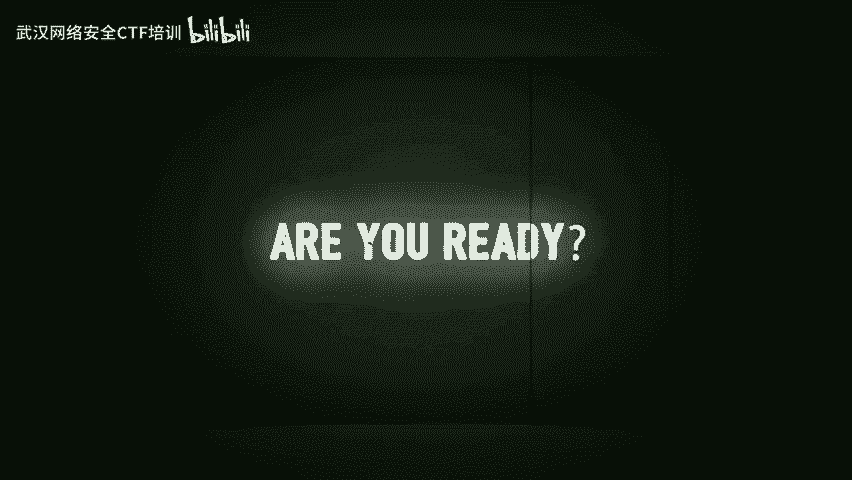
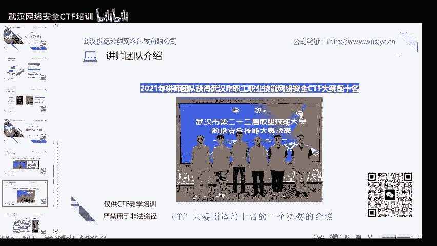

# 01-网络安全CTF系列培训教程之赛制介绍 - P1 - 武汉网络安全CTF培训 - BV1Vg4y1d7VM

大家好，我是武汉世纪云创公司的CTF培训老师，大家可以叫我阿阳。我们制作此视频的目的是希望帮助一些想要学习CTF的同学，快速入门，提高CTF竞技水平。本视频为CTF网络安全系列培训教程。

后期将会持续不断的更新。大家如果有兴趣进一步深入学习CTF，可以访问PPT上面的公司网址进行电话联系，或者扫描视频中的二维码进行咨询。我们的教师团队均来自CTF省赛世赛前10名的选手。

通过顶尖战队的手把手指导，大家学完之后呢，可以达到省赛世赛的夺奖水平。首先，大家一定要遵守网络安全法，不得非法入侵他人网络、干扰他人网络正常功能，窃取网络数据等。

本课程内容呢仅用于CTF网络安全教学培训，请大家遵守相关的法律法规，勿用于其他用途。今天这节课呢主要是对CTF比赛进行一个简单的介绍，使大家对CTF比赛有一个基本的认识和了解。

同时呢我也会分享一些CTF学习经验，帮助大家更好的学习CTF知识，提升CTF竞技水平。最后呢将会介绍一下我们的培训公司和讲师团队。大家如果想进一步深入学习CTF的话呢，也可以进行一个报名咨询。

第一章我们将对CTF进行一个简单的介绍。那么什么是CTF呢？CTF其英文名为cap flagag亦为夺旗赛，起源于1996年com全球黑客大会，以代替之前黑客们通过互相发起真实攻击进行技术比拼的方式。

CTF现已成为全球范围网络安全圈流行的竞赛形式。其大致流程是参赛团队之间通过进行攻防对抗程序分析等形式，从主办方给出的比赛环境中得到一串具有一定格式的flag字符串，并将其提交给主办方。

从而获得相应的分数。flag字符串呢相当于题目的答案，提交flag呢就相当于提交答案。获得相应的题目分值。而dcom呢作为CTF赛制的发源地。

defcomCTF呢也成为了全球最高技术水平和影响力的CTF竞赛，类似于CTF赛场中的世界杯。CTF竞赛模式具体分为以下三种。第一种是解题模式。在解题模式CTF赛事中。

参赛队伍呢可以通过互联网或者现场网络参与这种模式的CTF竞赛与ACM编程竞赛信息学奥赛比较类似，以解决网络安全技术挑战题目的分值和时间来排名，通常用于在线选拔赛。

题目主要包含立项漏洞挖掘与利用外部渗透、密码、取证引起安全编程等类别。第二种呢是攻防模式，在攻防模式CTF赛事中，参赛队伍在网络空间互相进行攻击和防守，挖掘网络服务漏洞，并攻击对手服务来得分。

修补自身服务漏洞，进行防御，来避免丢分。攻防模式CTF赛制可以实时通过得分，反映出比赛情况，最终也以得分直接分出胜负，是一种竞争激烈，具有很强观赏性和高度透明性的网络安全赛制。在这种赛制中。

不仅仅是比参赛队员的智力和技术，也比体力。呃，因为比赛一般都会持续很长的时间，同时呢也比团队之间的分工配合与合作。第三种呢是混合模式，它是一种结合解题模式与攻防模式的CTF赛制。

比如参赛队伍通过解题可以获取一些初始的分数。然后呢，通过攻防对抗进行得分增减，最终以得分高低分出胜负，采用混合模式CTF赛制的典型代表如ICTFICTF国际CTF竞赛。CTF题型呢主要包括以下6类。

第一，外部类外部是CTF的主要题型题型题目涉及许多常见的外部漏洞，如叉SS文件包含。代码执行上传漏洞、circle注入的，也有一些简单的关于网络基础知识的考察。比如返回包TCPIP数据包内容和构造。

可以说题目环境呢比较接近真实的环境。所需知持包括PHPpythonTCPIP以及circle等等。第二种呢就是cryp密码学题目呢考察加密解密技术，包括古典加密技术、现代加密技术。

甚至出题者自创的加密技术以及一些常见的编码解码，主要考察参赛选手密码学相关知识点，通常呢也会和其他题目呢进行一个结合。所需知识的包括矩阵、数论、密码学等。

第三种呢是miss杂项题目涉及引写术、流量分析、电子取证等，覆盖面呢比较广，主要考察参赛选者的各种基础综合知识。所需知识包括常见的引写术工具、rsha等流量审查工具编码知识。

第四种呢就是reverse立项题目涉及到软件立项、破解技术等，要求有较强的反汇编反编译功里，主要考察参赛选者的立项分析能力，所需知识包括汇编语言、加密、解密反编译工具的使用等。

第五种呢是胖胖在黑客离域中代表攻破了意思获取权限。在CTU比赛中呢，它代表着溢出类题目，其中常见类型一出漏洞有整数一出战一出堆溢出等，主要考察参赛选手对漏洞的利用能力。

所需知识包括C语言OD和IDA工具。数据结构以及操作系统等。第六种呢是mobil移动端，主要分为安卓和IOS2个平台，以安卓立项为主，破解APK并提交正确答案。所需知持包括java安卓开发常见工具等。

第二章呢我们来介绍一下常见的CTF比赛。defcon cTF呢起源于defcon是国际知名的CTF赛事，被誉为CTF赛事中的世界杯。每年的7月份呢，在美国的拉斯维加斯举行。

有近万名来自世界各地的极客安全领域的研究者爱好者呢参加。王鼎杯呢是迄今为止我国规模最大、覆盖面最广的国家级网络安全赛事，是由公安部指导组织被称为网络安全奥运会。2018年呢第一届网鼎杯在北京举办。

吸引了来自全国十四大关键领域3200多家单位的708支队伍22455人参赛，创当时规模之最。2020年第二届网礼杯呢在深圳举办来自全国十四大关键领域6000多家行业单位的14724支战队。

50165人线上参赛，2000人超大规模同场竞技，为业界呈现了一场全球最大规模的国家级网络安全赛事。呃，每一届网顶杯呢奖金非常丰厚，例如2022年的第三届网顶杯，一等奖一名，奖金10万，二等奖5名。

奖金5万，三等奖9名，奖金3万。另外呢，各个省也有相应的省级CTF比赛。比如说呢湖北省CTF比赛呢一般由湖北省总工会等多个政府部门联合举办比赛的第一名呢将获得湖北省五一劳动奖章。

前三名呢将获得湖北省技术能手称号。这些呢都是省级奖项含金量非常高。同样的，各个市呢也有相应的市级CTF比赛。比如说武汉市CTF比赛呢。

一般由武汉市总工会等多个政府部门联合举办比赛的第一名将获得武汉市五一劳动奖章。前10名将获得武汉市技术人手称号。有兴趣的同学呢可以积极报名参赛。第三章呢将给大家分享一些CTF的学习经验。第一。

学习基础知识。CTV竞赛需要掌握的基础知识，包括操作系统、网络加密、编程、漏洞等，建议学习网络安全相关的基础知识和编程语言，如python、java、CC加加等。第二呢，多参与CTF赛事。

参与当下举行的CTF赛事是最好的学习方法之一。即使是初学者呢，也能够找到一些适合自己能力的赛事，比如即客大挑战UNCTF各个大学的新生赛等等，都是不错的选择。在比赛中呢去发现自己知识的不足。

然后去针对的补充这部分知识是很好的一种学习方式，无需迷茫的去到处获取知识，而是在需要的时候去学习。或许有人觉得呢直接刷题是一样的，但完全不是当下比赛中的题目呢往往呢更加前沿和流行。

你可以找到当下的CTF题目趋势，紧跟技术热点，而且呢可以融入CTF竞技的氛围中，成长呢会更快。第三呢是多看其他师傅的博客，打完CT比赛的，你呢肯定是想看r up，也就是答案的。一般来说呢。

赛后过几天呢就会有很多师傅发出他的rightite up。从比赛群、百度等途径呢都可以找到，多看其他师傅的解题思路，多关注几个大流，看看他们发的技术文章都是很好的学习方法。

另外呢有一些CTF书籍呢可供大家学习。第一本书是CTF特训营，由fling pig战队的编著，主要介绍常见的CTF题型解题方法和各种竞赛模式技巧。第二本书是从0到1CTF12成长之路。

由new尔战队编著，覆盖了CTF各方向的学习路径、团队协作与管理经验分享。综上所述呢，学好CTF呢需要不断学习和。练习建议呢参赛者注重基础知识的学习，结合实践练习和社区交流呢来提升自己的技能。

第四章呢给大家介绍一下我们的讲师团队。我们的讲师团队呢均来自于湖北省及武汉市CTF比赛前10名的选手。这是2022年我们团队成员呢在湖北省职工职业技能网络安全CTF比赛中获得团体前10名的照片。

这是我们团队成员在2021年获得武汉市职工职业技能网络安全CTM大赛团体前十0名的呃一个决赛的一个合照。

这是我个人在2021年武汉市C铁布大赛中呢取得前十0名的成绩，呃，获得武汉市技术能手1佳网安全员的一个称号。最后呢介绍一下我们的培训公司，武汉世纪云创网络科技有限公司。呃。

涵盖了从基础入门到专业高级不同的CTF学习课程。在师资力量、教学、资源、学习环境、课程设置上呢均比自学有一定的优势。有兴趣的同学。如果想进一步深入学习CTF的话呢。

可以通过PPT上的网址或者扫描二维码进行报名咨询。欢迎大家呢进行一个报班的学习。好了，今天的课程到此结束，感谢大家的收听收看。

