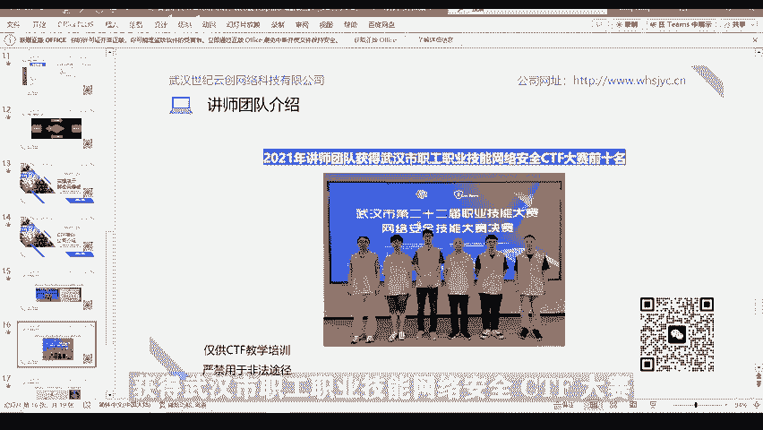

# 02-网络安全CTF系列培训教程之Web篇-burpsuite爆破弱密码（送弱口令字典） - P1 - 武汉网络安全CTF培训 - BV1DH4y1z7VN

片尾有惊喜哦，免费资源等你来领。😊。

大家好，我是武汉世纪云创公司的CTF培训老师，大家可以叫我阿阳。我们制作此视频的目的是希望帮助一些想学习CTF的同学快速入门，提高CTF经技水平。本视频为CTF网络安全系列培训教程。

后期将会持续不断的更新。大家如果有兴趣进一步深入学习CTF，可访问PPT上面的公司网址进行电话联系。或者扫描视频中的二维码进行咨询。我们的教师团队均来自CTF省赛市赛前10名选手。

通过顶尖战队的手把手指导，大家学完之后，即可达到省赛市赛的夺奖水平。首先，大家一定要遵守网络安全法。本课程内容仅用于CTF网络安全教学培训，请大家遵守相关的法律法规，勿用于其他用途。

今天这节课主要是教大家如何使用baap suit对外部网页进行弱口令爆破。最后将会介绍一下我们的培训公司和讲师团队。大家如果想进一步深入学习CTF的话，可以联系我们公司进行报班学习。

第一章我们将对入口令进行一个简单的介绍。那么什么是绕口令？通常认为容易被别人猜测或被破解工具破解的口令均为弱口令。例如，admin123456ABC123ga testest的。除此之外呢。

纯数字以及纯字母，并且密码长度小于6位的口令也被称之为弱口令。理想情况下，以此作为密码的口令爆破工具呢，只需要半天的时间就能成功的破解密码。在允许社会工程学攻击的情况下，密码中仅带有与自身相关的信息。

也可以称之为弱口令。如被攻击者姓名为张三，通过简单的社工信息收集到生日为19920801。那么以张319920801ZS19920801此类的密码均被认为是入口令。另外。

企业CMS以及系统服务的默认口令也被认为是入口令的一种。网络绕口令犹如一扇不上锁的门，不法分子很容易通过入口令获得账号或者系统权限，对用户造成很大的危害。比如进入后台窃取企业内部资料。

然后呢就可以在山战中获得优势。比如登录某个用户的账号，把里面的资金转出去。比如，破解家用摄像头秘密，个人和家庭的隐私，在网上被大肆传播。比如利用你的社交工具，骗取亲友钱财，甚至发布不良信息等等。

这些都是入口令的危害。第二章我们将介绍一下常用的爆破工具。ba suit。首先，什么是入口令爆破？口令爆破，其实就是攻击者对用户口令进行穷举尝试。在用户登录界面。

攻击者呢通过便利生成口令或者加载口令字典进行多次的登录尝试，直至呢把用户口令重举出来，成功登录。因为一般能被成功猜测出的用户口令呢都是弱口令，所以呢口令爆破也称为弱口令爆破。

口令破解的漏洞原理呢其实很简单，及网站未对用户登录认证的请求频率和次数呢进行限制。使得攻击者呢可以无数次的进行便利口令登录。从理论上讲呢，只要加载的字典范围足够大，尝试的次数足够多。

攻击者呢可以把任意用户的口令呢穷举出来。baab suit呢适用于攻击外部应用程序的集成平台，包含了许多工具。密码爆破呢就是工具之一。baab suit的为这些工具设计了许多接口。

以加快攻击应用程序的过程。所有工具呢都共享一个请求，并能处理对应的HTP消息、持久性、认证、代理、日志、警报等。由于baab suit呢是用java语言开发的，所以呢需要提前安装java环境才能运行。

接下来呢给大家介绍一下baby suit使用前的基本设置。首先点击代理proxy，再点击选项options，点击添加ad。添加本地IP地址，127。0。0。1，以及端口号8080。

这样呢就完成了baap suit的代理设置。同样呢浏览器呢也需要进行代理设置。我们以火狐浏览器为例，点击浏览器选项高级，点击网络设置，手动配置代理IP为127。0。0。1，端口号为8080。

这样设置的目的呢就是将baap suit呢作为浏览器和web服务器的中间代理。当浏览器要访问web页面时，都会先经过baap suit这个代理。

最后呢再将访问请求包呢通过baap suit呢发送给web服务器。同样的，返回的we部页面内容呢都会经过baap suit再返回给浏览器。完成前面的基本设置后呢。

第三章将会给大家演示一下如何使用baap suit，包括弱密码。前面介绍的软件工具呢，以及它的安装步骤呢，呃大家可以添加微信进行一个免费的领取。在安装和使用的过程中呢，如果有什么疑问。

也可以直接的通过微信进行咨询。现在呢大家看到的就是一个web的登录页面，需要输入用户名。密码。首先呢根据前面大家讲的给大家讲的内容呢，我们可以看到。首先呢我们在BP里面对这个。软件进行一个代理设置。

选择proxy代理，然后再点击options，点击ad添加添加我们的一个IV地址以及端口号是吧？IV地址我们设置为117。0。0。1，端口号呢设置成8080。这样呢就完成了我们的BP的一个设置。

同样的我们的火候浏览器呢也需要进行一个设置。比如说我们在这里点击设置。找到网络设置。同样呢我们也需要通过呢网络设置将IP设置为127。0。0。1端口呢设置为8080。设完之后呢。

我们就可以使用BP对我们的浏览器外部浏览器进行一个暴力破解。比如说我现在输入我们的user内，用户名为ad me。假设他用户名额的密，那么密码呢我设一下123456。

这时候我们点击inpect is on，就是监听，点击登录。这个时候我们就。外b的数据呢一个请求包就反就传送到了我们的BP软件。这个时候我们右击鼠标点击send to in。

就是将它发送到了我们的爆破模块。点击positions。位置，然后呢，这时候发现很多多勒伏呢将变量进行一个。Kuangxan。然后我们点击clear。可列按钮将我们是把这些变量呢进行一个清除。

因为我们现在只对密码进行包括，所以我们选中密码，然后点击ad按钮。就是将密码呢做一个变量。我们假设用户名是add me，然后呢，我们这个时候选择sleep狙击手模式。

就是我们只对一个变量就对单个变量进行包破。然后呢，选择pay node。加载加载了我们加载我们的密码，top100。这些密码字典呢最后呢，大家都可以通过扫描微信。添加我们的一个工作人员的微信呢。

我们都可以免费的。然后呢呃给大家。然后呢，我们这个时候就加载了我们一个弱密码字典，比如说入口令对吧？100个弱密码。我们加载完我们用户字典之后，我们点击star a就是开始攻击按钮。我们开始攻击一下。

点击。这个时候呢我们呢就有100多个密码的，100个密码呢进行一个暴力破解。那么呢哪一个密码呢？能够破解成功，怎么看呢？我们点击Lance这个按钮进行一个排序。排序的长度。nice了不同的这个密码。

就是我们的一个包括成功的密码。为什么呢？大家可以看一下，点击response这个按钮，点击reow，我们发现呢。这个时候返回的页面是welcome to就欢迎登录。我们再看看其他长度，比如4653。

很多都是4653啊，大家看一下，发现用户名或者密码不对，为什么长度不一样呢？登录成功之后的页面的数据包的内容的长度和登录不成功的页面的数据包的内容的长度肯定是不一样的，对不对？

不成功的都是返回的user大家看一下。User name。N， incorrect。是吧所以这些都是4653，4691呢就welcome to。所以它数标长度肯定变。

那么呢我们就可以推断出来这个密码呢就是pass word。这个时候我们可以验证一下。明。输入ad me。杨红明在输入密码，怕错了。登录一下。是吧就welcome，欢迎登陆。

这个时候我们就暴露出来它的密码V怕错了。那么呢前面介绍的软件工具以及密码字典呢，大家可以通过扫描视频中的二维码添加微信进行免费领取。在安装和使用中呢，如果有什么疑问呢，也可以直接通过微信进行咨询。

第四章呢就给大家介绍一下我们的培训公司和讲师团队。我们的讲师团队均来自于湖北省及武汉市CTF比赛前10名的选手。

这是2022年我们团队成员在湖北省职工职业技能、网络安全CTF比赛中呢获得团体前十名的照片。这是我们团队成员在2021年获得武汉市职工职业技能网络安全C体分大赛团体前十0名的成绩。

这是我个人在2021年武汉市C协大赛中取得前十0名的成绩，获武汉市技术人社1佳网络安全员称号。武汉世纪云创网络科技有限公司涵盖了从基础入门到专业高级不同的CTF学习课程。

在师资力量、教学资源、学习环境、课程设置上，均笔自学有一定的优势。有兴趣的同学可以通过PPT上的网址或者扫描二维码进行报名咨询。欢迎大家报班学习CTF。今天的课程到此结束，感谢大家的观看。

