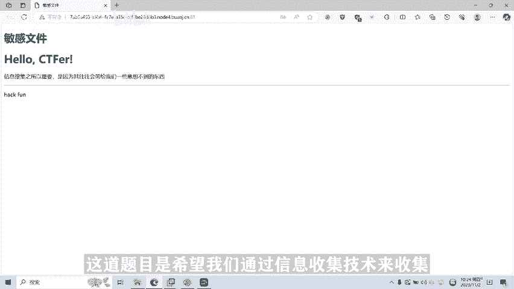
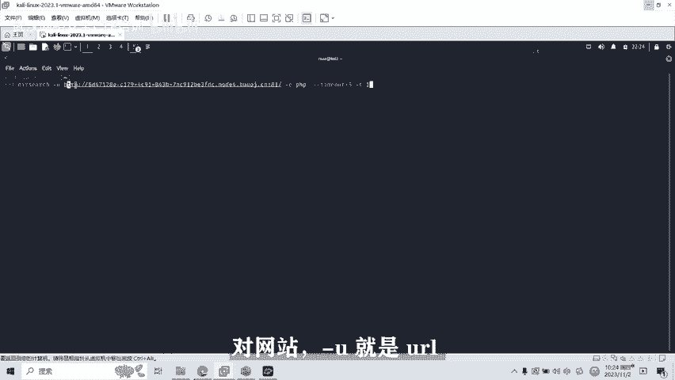
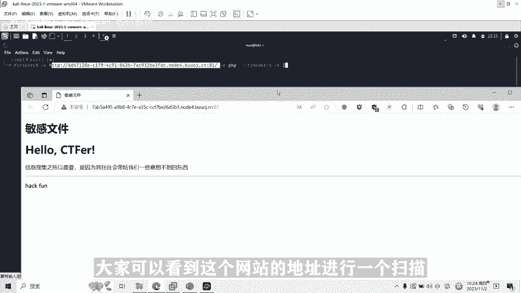
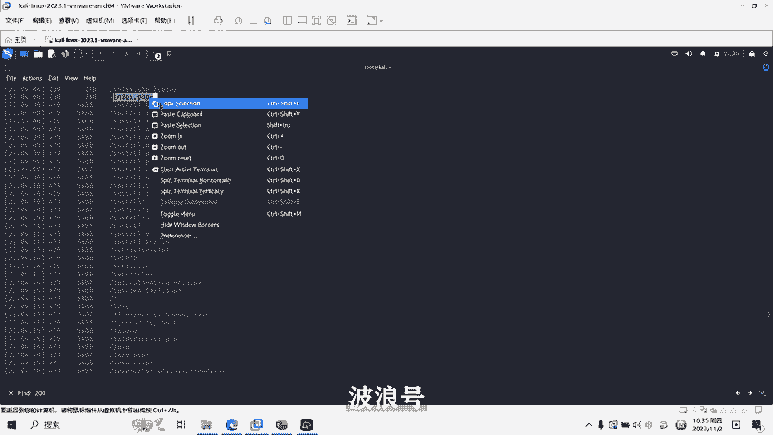
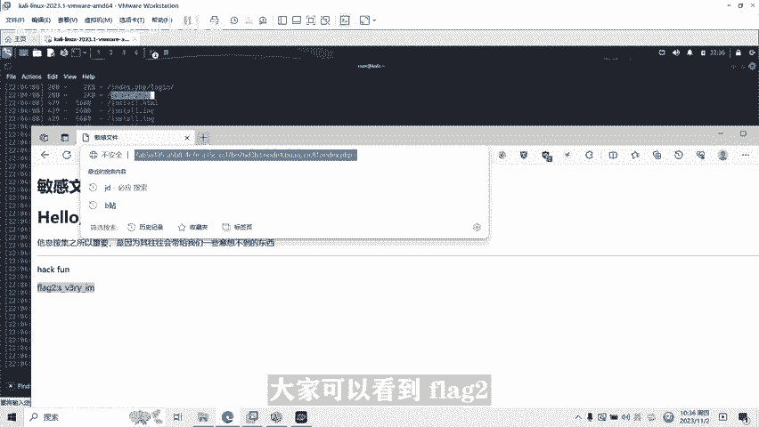
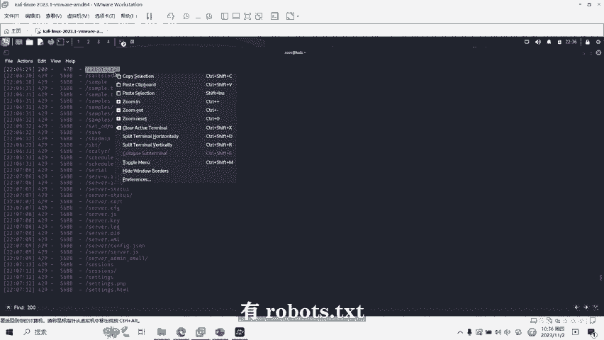
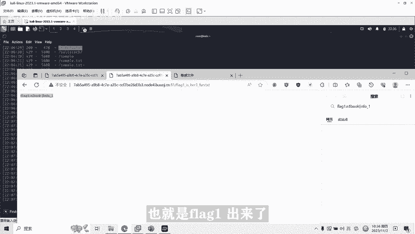
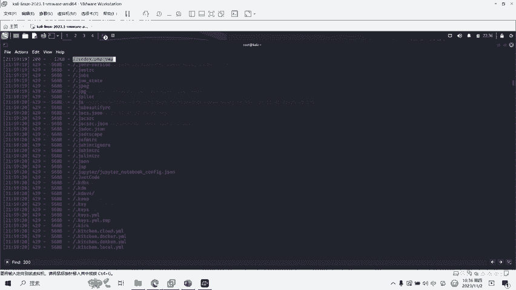
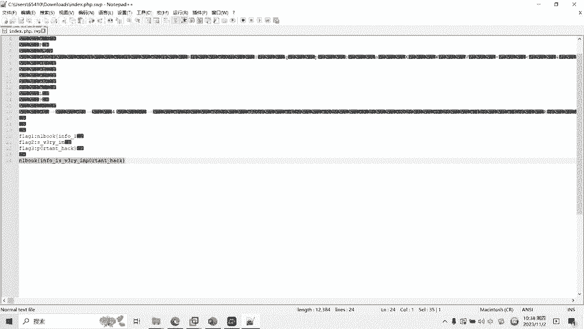

# 03-网络安全CTF系列培训教程之Web篇-信息收集dirsearch渗透扫描网站 - P1 - 武汉网络安全CTF培训 - BV1ww411T7zB

Yeah。添加客服微信送安装包。

我是武汉世纪云创公司的CTF培训老师，大家可以叫我阿阳。我们制作此视频的目的是希望帮助一些想要学习CTF的同学，快速入门，提高CTF竞技水平。本视频为CTF网络安全系列培训教程，后期将会持续不断的更新。

大家如果有兴趣进一步深入学习CTF，可访问PPT上面的公司网址进行电话联系，或者扫描视频中的二维码进行咨询。我们的教师团队均来自CTF省赛世赛前10名选手，通过顶尖战队的手把手指导大家学完之后呢。

即可达到省赛世赛的夺奖水平。首先大家一定要遵守网络安全法。本课程内容仅用于CTF网络安全教学培训，请大家遵守相关的法律法规，勿用于其他用途。今天这节课主要是教大家在CTF比赛中。

如何通过信息收集技术收集信息泄露漏洞。首先，什么是信息泄露漏洞？信息泄露漏洞一般是由于外部服务器没有正确处理一些特殊请求，或者系统管理员对于应用设置及操作不规范，泄露服务器或者应用的敏感信息。

比如用户名、密码、源代码、服务器信息、配置信息、物理路径信息等。该类信息的泄露呢容易造成恶意人员的利用。为达到进一步的攻击系统呢打下基础。那么，信息泄露有哪些危害呢？比如数据库信息泄露漏洞。

可以泄露数据库类型信息，甚至是数据库的账号密码，降低攻击者的攻击成本。比如，网站配置信息漏洞，可能会暴露服务器信息网站的限制条件。比如网站的目录结构信息泄露漏洞，可能会被攻击者呢发现敏感文件。

如后台路径、文件保存路径等等。CTF比赛中常见的信息泄露主要有源码泄露，如get泄露，文件泄露，如网站备份压缩文件泄露外部点XML泄露等。那么，如何发现与利用这些泄露露呢？比如配置测试信息泄露漏洞。

网站常见的配置测试文件如web点fig webb点commL CON点PHPPHP information点PHPro点TT等等。

一般呢他们都是用来存储及显示服务器及应用程序的配置信息提供应用程序权限和功能。我们可以通过预见或者是de search等扫描软件呢对网站进行扫描。例如右图。

我们通过预见软件呢扫描某网站发现了存在PHP information。点PAPP配置信息文件robots点TST爬虫文件就是右图的我们那个遇键扫描，扫描到了一些呃。信息泄露的一个文件。

比如源码文件数据库新泄露。它是由于呢网站对源代码呢及数据库文件信息呢保存不当。例如呢我们呢通过软件预见图中呢可以表示出来我们扫描到某网站的一个呃源码的备份压缩包。

3Wroot点RAAR这是一个呃网站的一个root压缩包的一个文件。大家可以在图中的这个标红记的这个地方可以看到，我们就扫描到了这个网站的呃一个源码的备份的一个文件。接下来呢就给大家进行一个实操的演示。

演示一下CTM比赛中，如何使用信息收集工具，收集信息泄露漏洞。首先大家可以看到这一道题目CTFP5敏感文件，题目名称为敏感文件。然后呢，会提示信息搜索。

也就说呢这道题目是希望我们通过信息收集技术来收集这个网站，泄露了哪些敏感文件。

我们打开卡链卡令系统。点击我们的命令终端。我们使用的是det。大家设计这个命令。然后呢，关于软件工具的安装使用呢，大家可以添加。PPT上面的二维码呢添加工作人员的微信呢，然后进行一个免费的领取。

该涉嫌这个命令就是通过。卡里里面的大家筛起呢，我们对网站呢杠U就是URL对它这个网站呢进行一个扫描。大家可以看到这个网站的地址。

进行一个扫描。杠一呢是杠1PAAPP，就说明这个网站是PAP做的，一般是PACD比赛。如果大家不知道它是什么语言，可以把它写成杠新，就任何辩论语言。港新。这样就可以了，这个时候我们就对它进行一个扫描。

就扫描完了。然后呢，我们如何来查找呢？查找哪些是我们扫描成功的文件呢？大家可以看一下，我们找一下。大家看一下，像这种绿色的啊吧，状态代表是200。200就是返回成功。然后呢。

这些文件呢就说明呢是我们扫描到的一些文件。有这个网站里面有这些文件，我们可以访问。我们呢为了快速的查找了，我们直接通过查找fi的这个功能。输入200。输入200呢。

我们就开始查找返回是200的那个呃成功的文件。我们来可以找一下。比如说第一个文件是index点PAPP。波浪号对吧？我们看一下这个文件。

是不是flag2，大家看到flag2，也不是他有几个flag，有也应该有flag一flag2flag3，我们再看看还有没有其他的。

装态是200的。比如robots点贴地。对不对？这是一个网络爬虫的一个文件。

我们再反问一下，看看。这时候就是flag一。flash一他说f一在这里，那我们再试一下。也是付来个一出来， flag个一，对不对？

然后flag2也出来了，我们再看有没有flag3，我们再找找有没有其他文件，还有一个文件是吧？

我点击回收，有这个文件下载了。嗯打开看一下。这是我们在里面搜索flag。搜索一下。这时候回来的是不是就出来了？这就是flag3。一般flag是左右画括号，左画括号结开始右画括号的结尾。

我们将四来三个flag我们拼接一下试一下，这是flag，3后复制一下。3。那个一是什么呢？我们看一下。来个一是这个。fag2呢。我那个是这个。比如说将这三个拼在一起，就是我们的flag，我看一下啊。

第一个fleggo我们拼一下。第一个flre。然后第二个flag。第三个回来的。批完了之后呢，这个就是答案。Info is very important to hack信息是非常重要的黑客。

这个呢就是我们的一个答案。

好了，今天的课程呢就到此到此结束，感谢大家的观看。今天呢就主要给大家讲的是信息收集技术，并且呢给大家演示了d search这个命令呢，如何对网站进行搜索扫描，搜索它的一个信息泄露漏洞。

Yeah。