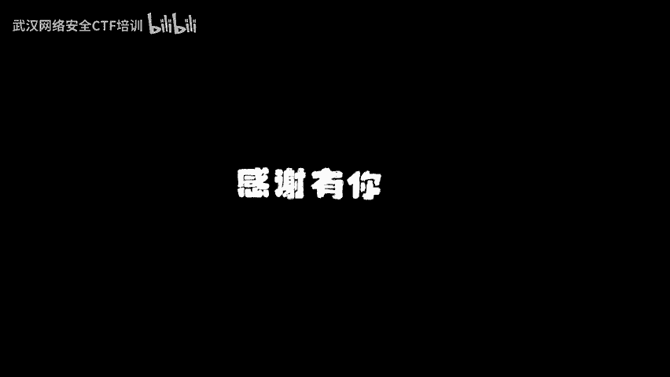
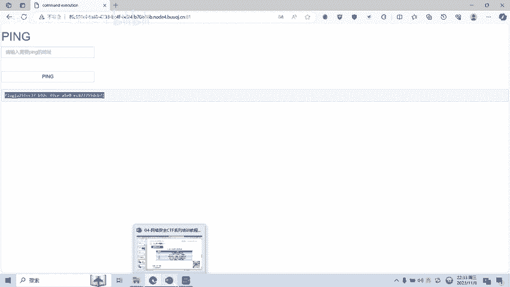

# 04-网络安全CTF系列培训教程之Web篇-命令执行 - P1 - 武汉网络安全CTF培训 - BV1KN411u7SC

🎼。🎼The。🎼。

大家好，我是武汉世纪云创公司的CTF培训老师。大家可以叫我阿阳。我们制作此视频的目的是希望帮助一些想要学习CTF的同学，快速入门，提高CTF竞技水平。本视频为CTF网络安全系列培训教程。

后期将会持续不断的更新。大家如果有兴趣进一步深入学习CTF，可访问PPT上面的公司网址进行电话联系，或者扫描视频中的二维码进行咨询。我们的教师团队均来自CTF省赛世赛前10名选手。

通过顶尖战队的手把手指导，大家学完之后，即可达到省赛世赛的夺奖水平。首先，大家一定要遵守网络安全法。本课程内容仅用于CTF网络安全教学培训，请大家遵守相关法律法规，勿用于其他用途。

今天这节课主要是讲CTF比赛中的命令执行漏洞。首先，什么是命令命令执行漏洞呢？命令执行漏洞就是黑客可以直接在外部应用中执行系统命令，从而获取敏感信息或者拿下希尔权限。例如。

右图输入IP地址以及或拼接符务，因为有命令执行漏洞，所以呢就没有执行P命令，而是执行了或后面的命令语句。第一个图片呢就执行了LRP命令。第二个图片呢就执行了打开计算器的命令。那么。

命令执行漏洞是怎么形成的呢？命令执行漏洞形成的原因是外部服务器对用户输入的命令安全监测不足，导致恶意代码被执行。CTF比赛中常见的命令执行漏洞主要有以下两类，一是系统命令执行漏洞。

通过此漏洞可以传入系统命令。CTF比赛中的系统命令执行漏洞可能由C斯函数。ESEC函数pass true函数造成。接下来呢我们看一下这些函数的具体功能。c算函数呢可以执行外部程序，并且呢显示输出。

ESEC函数呢执行系统外部命令时呢不会输出结果，而是返回结果的最后一行。pas through函数呢直接将结果输出到的浏览器，不需要使用eal或retturn来查看结果，不返回任何值。

且可以输出到二进制，如图像数据。第二类呢就是PHP代码执行漏洞。通过此漏洞可以传入PHP代码，并且执行。例如e函数可以把输入的字符串当成了PHP代码来执行。比如set函数，它是一个断言函数。

在PHP里面呢判断一个表达式是否成立，返回真或假。如果直接将PHP代码呢传入呢，也将会被执行。最后呢我们介绍一下linux系统里面的命令执行漏洞常用的拼接符。第一个呢是单个或拼接符。

它的功能是显示后面语句的执行结果。第二个呢是呃双货拼接符，它的功能呢是前面执行语句执行错误，才会执行后面的语句。第三个呢是单个语拼音符，它的功能呢是前面语句，无论真假都会执行后面的语句。

第四个呢是双语拼接符，它的功能是前面的语句为真才能执行后面的语句。第五个呢是分号拼接符，它的功能呢是执行完前面的语句后呢，再执行后面的。接下来呢给大家进行实操演示。

演示一下CTF比赛中如何利用命令执行漏洞。首先大家看到这一道题目是拼，请输入需要拼的地址。假如我输入1个IP地址，127。0。1。本机IP地址。然后呢，点击一下拼按钮。这时候呢就会对127。0。

1这个地址呢进行一个拼命令。比如用户呢输入IP地址，然后呢就会执行了这个P命令。那么如果呢。这个外部页面具有命令执行内能，我们进行一个测试。点1我们测试一下，比如说输入一个货符号，然后呢输入L命令。

假设它是linux系统，我们L呢就是看一下当前目录下的文件。嗯拼一下。是不是当前目录有一个index点PA。那我再看一下。跟目录有什么文件呢？I。格莫鲁佛号。然后呢，我们点击平按了。

发现呢根目录下来有一个flag。那我们如何查看flag呢？127。0。0。1。t输入看命令。ca的。我们来来查看跟目录下的flag文件。因为呢单个的货执行的是后面的一句，我们前面PPT已经讲过。

单个的货呢显示的是后面一句的执行结果。那么我们来拼一下。这个时候呢就查到了flag值。这个flag呢就是我们的题目的答案。

这道题目呢命令执行漏洞的题目呢就给大家呢演示完毕。好了，今天的课程到此结束，感谢大家的观看，再来个关注也不错。

