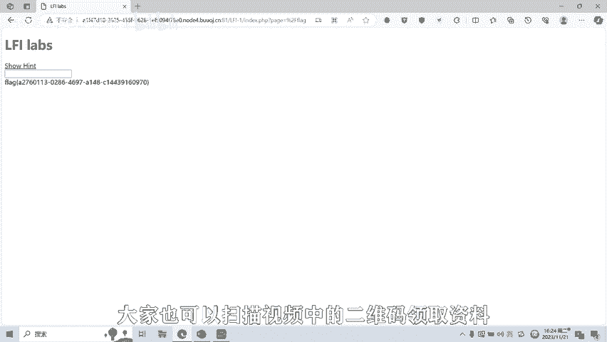

# 06-网络安全CTF系列培训教程之Web篇-文件包含漏洞 - P1 - 武汉网络安全CTF培训 - BV1ZH4y127KZ

学习资料扫码领取免费。

大家好，我是武汉世纪银创公司的CTF培训老师，大家可以叫我阿阳。我们制作此视频的目的是希望帮助一些想要学习CTF的同学，快速入门，提高CTF竞技水平。本视频为CTF网络安全系列培训教程。

后期将会持续不断的更新。大家如果有兴趣进一步深入学习CTF，可访问PPT上面的公司网址，进行电话联系，或者扫描视频中的二维码进行咨询。我们的教师团队均来自CTF省赛世赛前10名选手。

通过顶尖战队的手把手指导，大家学完之后即可达到省赛市赛的夺奖水平。首先，大家一定要遵守网络安全法。本课程内容仅用于CTF网络安全教学培训，请大家遵守相关的法律法规，勿用于其他用途。

今天这节课主要是讲CTF比赛中的文件包含漏洞。首先，什么是文件包含漏洞呢？文件包含漏洞是指客户端，一般为浏览器用户通过输入控制动态包含在服务器的文件，从而导致恶意代码的执行以及敏感信息的泄露。

主要包括本地文件包含AFI和远程文件包含RFI两种形式。接下来给大家介绍一下文件包含漏洞的原理。其实原理就是由于在代码开发的过程中，有时候呢会有相同的代码，不想呢重复的输入。

就将代码单独写在一个文件里面。当遇到的时候呢，就直接调用该文件进行运行。而这种方式呢就会导致客户端可以调用其他的恶意文件，通过恶意文件呢造成文件的包含漏洞。但是呢前提也是呢，当包含文件的代码呢。

被当做一个编量来使用，并且呢。能够被用户传入参数。如果没有对该变量做相应的安全防护，就可能引发出文件包含漏洞。以右图的代码为例，使用动态包含的方式，通过改变fire参数动态的调用PHPHP文件。

从而不再局限于某一个文件是包含的方式呢更加灵活，而在实际应用中呢，该参数呢就是需要被包含的文件，假如说接收到的参数值是6点PP则实际包含的就是include6点PP。

若参数值是proproduct点PP则实际包含就变成了includeproduct点PP。接下来给大家看一下文件包含的实例演示。

大家可以看到该图展示的是一个网站的首页index点PP当点击导航栏上的项目，线页面呢也会呢进行一个相应的改变。比如点击进入新闻中心，可以看到URL网址呢有文件包含参数。

其中fare为参数名luose点PP为参数值，通过fare来接收参数改变包含的页面。若是进入下载中心，则对应的参数呢就会变成faair等于down点PP。这个呢就是文件包含的一个网站的实例。

那么文件包含漏洞形成的前提条件呢，一般有2个。第一呢就是inlude的函数，通过动态变量的方式引入需要包含的文件。第二呢就是用户能够控制该动态变量。常见的文件包含函数呢有以下几种。

PHP类型的有include include once require require once。GSP类型的有java IO fire。

java IO fireri等AP类型的有include fire，inlude virtual的。接下来呢给大家进行实操演示，演示一下CTF比赛中如何利用文件包含漏洞。大家可以看到这道题。

这道题目呢有一个she。显示。提示我们点击一下。可以看到，希望呢通过啊包括in库文件in库的参数。通过了ge的传传一个配置参数。我们输入一下。E c。PASSWD。看一下他是否能够包含这个文件回撤。

大家可以看到配景的这个参数呢。就包含了ETC password word这个文件，这是个linux服务器，将它的参数呢进行一个显示。那么呢这道题目的flag在哪里呢？一般flag呢都在根目录下。

有个flag值，我们试一下。该目录like。回车。大家可以看到flag值就出来了，这就是这道题目的答案。配置呢就等于flag百分号22F呢就是。更不到这个符号的1个URL网络编码。

文件包含漏洞呢还有很多种绕过和利用的方式，后面呢将会针对各种类型的文件包含漏洞呢制作相应的教学视频。大家呢也可以扫描视频中的二维码，领取资料或者报班学习。

好了，今天的课程到此结束，感谢大家的观看。🎼。

