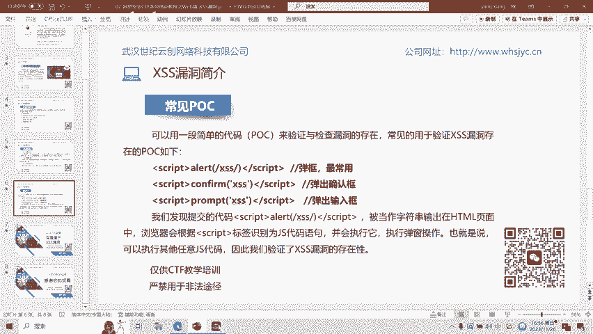
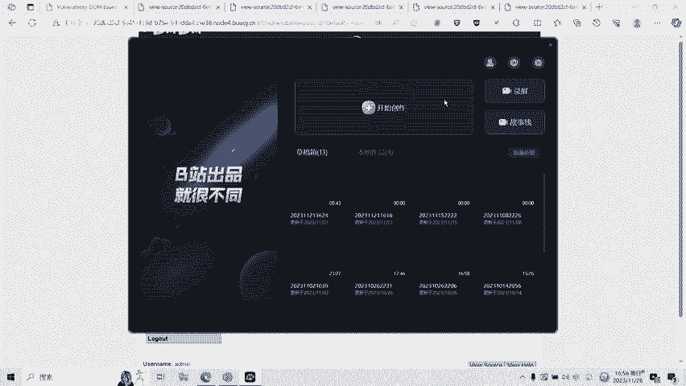

# 07-网络安全CTF系列培训教程之Web篇-XSS漏洞 - P1 - 武汉网络安全CTF培训 - BV1yN411G7og

扫码优先获取更多资料。大家好，我是武汉世纪银创公司的CTF培训老师，大家可以叫我阿阳。我们制作此视频的目的是希望帮助一些想要学习CTF的同学快速入门，提高CTF经济水平。

本视频为CTF网络安全系列培训教程，后期将会持续不断的更新。大家如果有兴趣进一步深入学习CTF，可以访问PPT上面的公司网址进行电话联系，或者扫描视频中的二维码进行报名咨询。

我们的教师团队均来自CTF省赛世赛前10名选手，通过顶尖战队的手把手指导大家学完之后，即可达到省赛世赛的夺奖水平。首先，大家一定要遵守网络安全法。本课程的内容呢仅用于CTF网络安全教学培训。

请大家遵守相关法律法规，勿用于其他用途。今天这节课主要是讲CTF比赛中的叉SS漏洞。首先，什么是叉SS漏洞呢？叉SS漏洞是指跨站脚本漏洞。本应该缩写为CSS。但是呢该该缩写呢已被层叠样式脚本CSS所用。

所以呢改简称为叉SS也称跨站脚本或跨站脚本攻击。跨站脚本攻击呢通过将恶意的scriptcr代码注入到we部页面中，当用户浏览该页面时，嵌入其中的scriptcrip代码呢将会被执行。

从而达到恶意攻击用户的目的。接下来给大家介绍一下XSS漏洞的危害。攻击者呢可以利用叉SS漏洞呢使用户在浏览器中执行其预定义的恶意脚本，其主要有以下危害。一。盗取用户的账号。第二呢。

窃取用户的cookie资料，冒充用户身份进入网站。三呢，结时用户绘画，执行任意操作。第四呢，刷流量、执行弹窗广告等等。第五呢就是传播蠕虫病毒等等。叉SS漏洞呢大概呢可以分为三个类型。

反射型叉SS存储型叉SS和断型叉SS。第一种呢，反射型叉SS是非持久性参数型的扩张脚本。反射型叉SS的GS代码呢在外部应用的URL参数变量中或输入狂种。这种攻击方式呢往往具有一次性。

攻击方式一般为攻击者通过电子邮件呢等方式，将包含叉SS代码的恶意链接发送给目标用户。当目标用户访问该链接时呢，服务器接收该目标用户的请求并进行处理。然后呢。

服务器把带有XSS代码的数据呢发送给用户目标的浏览器。浏览器解析这那带有叉S代码的恶意脚本后呢，就会触发叉SS漏洞。第二种，存储型叉SS是持久性的扩展脚本。持久性体现在叉SS代码不是在某个参数编量中。

而是写进数据库或文件等可以永久保存数据的介质中。存储型叉SS呢通常发生在留言板等地方。我们在留言板位置留言，将恶意的代码呢写进数据库中。特点呢是攻击脚本呢会被永久的存放在目标服务器的数据库或文件中。

具有很高的隐蔽性。这种攻击呢多见于论坛博客和留言板。攻击者呢在发帖的过程中将恶意脚本连同正常信息一起注入帖子的内容中，随着帖子被服务器存储下来，恶意脚本呢也永久的被存放在服务器的后端存储器中。

当其他用户浏览这个被注入了恶意脚本的帖子时呢，恶意脚本呢会在他们的浏览器中得到执行。所以呢需要浏览器从服务器载入恶意的叉S代码呢，才能真正的触发叉SS。

反射型呢与存储型的叉值的区别呢是我们能够谨慎的对待不明链接。那么反射型X测攻击呢将没有多大的作为。而存储型叉S呢则不同。由于它注入在一些我们信任的页面。因此呢，无论我们多么小心，都难免会被攻击。

第三种呢是多m型叉SS。dom全称为document object model，中文为文档对象模型，使用doom呢可以使程序和脚本呢能够动态的访问和更新文档的内容结构及样式。HTML的标签呢都是节点。

啊这些节点呢组成的动物的整体结构节点数。通过HTMLdoom的doom数呢中的所有的节点呢均可通过javascript进行访问。所有HTM元素呢节点呢均可被修改，也可以创建或删除。

动om型叉SS呢比较特殊。OWSP呢关于doom型叉S的定义是基于dome的叉SS是一种叉S攻击，其中攻击的pay note呢由于修改受害者浏览器页面的动数而执行的。

其特殊的地方就是pay node在浏览器本地修改动me数而执行，并不会呢传到服务器上，也就是说呢，客户端的脚本程序可以通过dome动态修改页面内容从客户端获取动me中的数据呢，并在本地执行。

由于dom呢是在客户端修改节点的，所以呢基于dom的叉S漏呢不需要与服务器端交互，它只发生在客户端处理数据的阶段。攻击方式呢是用户请求一个经过专门设计的URL，它由攻击者提交。

而且呢其中包含叉SS代码服务器的响应呢。不会以任何形式包含规具者的脚本。当用户的浏览器处理这个响应时呢，动om对象呢就会处理叉代码，导致存在叉S的漏洞。接下来呢给大家看一下叉S漏洞的常见的POC。

比如cpe a lot叉S。scriptcr弹框，这个是最常用的。还有一个就是scriptip confirm XSS script，这个是弹出确认框。

第三个就是scriptcrip promoteote叉S script，弹出输入框。我们通过提交的代码scriptipnet叉SS script呢发现它被当做字符串输出在HTML页面中。

并且呢执行弹窗操作，从而验证了叉SS漏洞的存在性。接下来呢给大家进行实操演示，演示一下CTF比赛中的叉SS漏洞。我们先看一下反射型叉SS。what's your name？输入你的名字。

比如说名字是张三。提交。这时候就会显示hello张三，他是通过get传餐，大家可以看URL。get传单传舱给到name这个变量，我们右击查看源代码。

我们发现刚刚输入的姓名张三就被嵌入到ATM代码里面去了。那么我们这个时候再输入这个sscriptcrip。脚本POC验证一下是否存在拆色漏洞，我们提交。这说显示已经弹窗了叉SS。点成立。那么这时候右击。

查看原来吧。大家可以看一到。这个POC script脚本是不是就被写入到了HTRM代码里面？这个name幕参数。是不是就被这个代码给复制了？也就是说通过这个POC验证。这个网页具有叉SS漏洞。好。

我们再看存储型一样的，存储型，比如说输入姓名ABC。信息。message123。提交。这时候呢我们就看到name是ABCmessage是message123。那我们查看。原代码。

是发现这些信息也被写入到了。我们的ATM代码点，那们再来验证一下，看他是否具有。你是啲。BCE是否具有？彩色了动我门输入。我们看弹窗了。这是BC1。我们有机插按了吗。

这个是存储型的叉SS我们把这个贴吧的内容存到服务器的。大家以看到每一次调用这个贴吧查看贴吧内容的时候，他都会调用这个代码。从服务器数据库里面调用这个留言的内容，执行这个查次代码。比如说我们刷新一下。

是吧每刷音次都会。都会执行一次XS代码。好，我们再来看动性。这里可以选择englishfch这些选项，我们选择english一下。我这时候发现。这个地方有个deer参数，我们修改这个参数。

输入POC看一下是否具备。查一下楼洞回车。这个时候也弹窗了，也就是说这也是一个叉SSlogo。刚刚呢我们就演示了反射型存储型和端型三种叉SS的。漏洞的验证方式。然后呢，我们在CT做比赛做题目的时候呢。

也可以通过这些简单的POC。来验证一下我们的这道题目有没有查色漏洞，从而呢。更好的解题目。

叉C漏洞呢还有很多的绕过和利用的方式。后面呢将会针对各种类型的叉C漏洞呢制作相应的教学视频。大家呢也可以扫描视频中二维码，领取资料或者报班学习。好了，今天的课程到此结束，感谢大家的观看。🎼。

