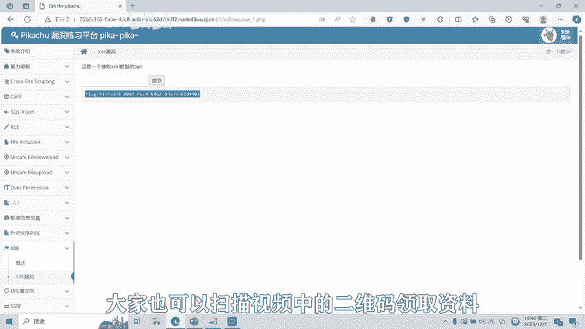
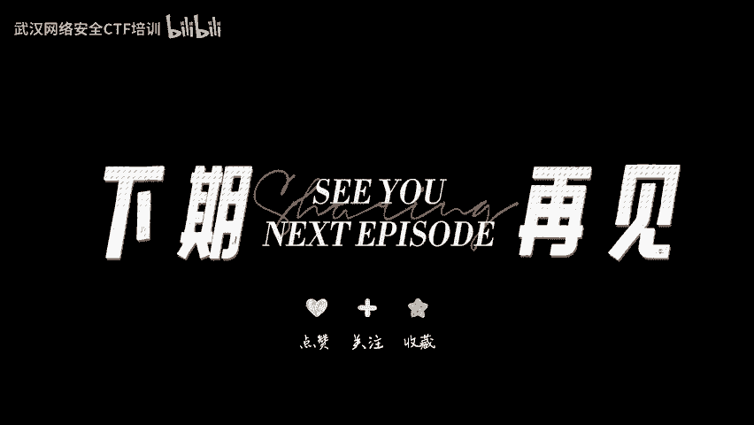

# 08-网络安全CTF系列培训教程之Web篇-XXE漏洞 - P1 - 武汉网络安全CTF培训 - BV1Ni4y1Y7fK

扫码优先获取更多资料。

大家好，我是武汉世纪云创公司的CTF培训老师，大家可以叫我阿阳。我们制作此视频的目的是希望帮助一些想要学习CTF的同学快速入门，提高CTF竞技水平。本视频为CTF网络安全系列培训教程。

后期将会持续不断的更新。大家如果有兴趣，进一步深入学习CTF可以访问PPT上面的公司网址进行电话联系，或者扫描视频中的二维码进行报名咨询。我们的教师团队均来自CTF省赛世赛前10名选手。

通过顶尖战队的手把手指导，大家学完之后，即可达到省赛世赛的夺奖水平。首先，大家一定要遵守网络安全法。本课程内容仅用于CTF网络安全教学培训，请大家遵守相关的法律法规，勿用于其他用途。

今天这节课主要是讲CTF比赛中的叉叉一漏洞。首先什么是叉叉一漏洞？叉叉一呢全称为叉ML外部实体注入漏洞。而叉叉E漏洞的出发点呢，往往是可以上传叉ML文件的位置，没有对叉M叉ML文件呢进行一个过滤。

导致呢可以加载恶意的外部文件和代码，造成了任意文件的读取，命令执行内网端口的扫描，攻击内网网站，发起多次攻击等危害。要了解叉叉E漏洞呢。那么呢我们一定要先明白基础知识。了解叉M文档的一个基础组成。

接下来呢给大家介绍一下XML的基础知识。叉ML呢用于标记电子文件，使其具有结构性的标记语言，可以用来标记数据定义数据类型，是一种允许用户对自己的标记语言进行定义的原语言。

叉ML文档结构呢包括了叉ML声明DTD文档类型定义文档元素。如右图所示，第一行代码呢就是叉ML的声明。中间部分呢为DTD文档类型定义部分。它定义了root元素。

而root元素包括了to from heading body4个子元素。其中呢PCDATA呢的意思呢是被解析的字符数据。PCDATA呢是会被解析器解析的文本，而这些文本呢将会被解析器检查实体以及标记。

最底下第三个部分呢就是我们的文档元素。语法格式呢如右图所示。每个元素呢都要有闭合，并且呢子元素要嵌套在上级元素里面。DTD文档类型定义呢有内部声明和外部引用两种定义方式。右图呢就是内部声明的语法格式。

那么呢第二种方式呢，外部引用是什么样子呢？它和内部声明又有什么不一样呢？大家接着往后看。现在大家看到的右边的两个图片呢，就是外部声明的一个格式。第二个图片呢，定义了一个root点DTD文件。

将内部声明的代码呢写到了root点DTD外部文件里面。第一个图片呢引用了roote点DTT文件，从而实现了DDT的外部声明。接下来呢给大家介绍一下叉ML里面的实体变量以及实体变量的引用。

右边的第一个图片定义元素为any，说明呢接受任何元素，并且定义了一个叉ML的实体变量。第二个图片呢就是叉E一引用，对这个叉一呢进行引用输出呢语号叉E1呢时呢就会被test这个文本呢给替换掉。

这个呢就是一个实体类型变量的一个声明以及引用。接下来给大家看到的是一些常见的叉叉一漏洞的E叉P。图中代码呢就是利用叉叉一的外部实体引用方式，实现了任意文件的一个读取。读取po点TST的文件内容。

并且呢输出。好了，接下来呢给大家进行一个叉叉一漏洞的实操演示。这是一个接收叉ML数据的API。查查一老动。也就是说我们在这个对话框里面输入叉ML数据。然后呢，检测它是否有叉叉E漏洞。

我们首先来一个正常的。叉叉一语句定义1个叉叉一实体。test123，我们看它是否输出test123，我们把这个叉MI语句。复制进去。提交。大家看输出了test123。

然我们再看一下能不能通过外部实体注入漏洞来读取。ETC passwordword这个文件。提交。大家可以看到我们读取了ETC passwordword这个文件，并且对它进行了一个输出。好。

我们看一下能不能输出跟目录下的flag。这个时候这道题目的flag就已经被输出了。叉叉E漏洞呢还有其他的很多种绕过和利用的方式。后面呢将会针对各种类型的叉叉E漏洞制作相应的教学视频。

大家呢也可以扫描视频中的二维码，领取资料或者报班学习。

好了，今天的课程到此结束，感谢大家的观看。🎼。

