# 09 2-8 布尔盲注CTF题目解决_ev - P1 - 高中数学yyds - BV1Dm411R76j

大家好，本节课呢我们将介绍过盲柱对应的这个解题的这种方法。那么对于盲助来说，咱们如果单纯的使用我们之前所介绍到的这种手工的方式来进行利用，那么并且得到对应数据，那么是非常耗费时间和精力的。

那么此时呢我们就可以使用脚本啊，这个python脚本来加快我们对应的这种测试，来获取对应数据。那我们要使用pathon来进行解题或者是获取数据。那么咱们需要有一定的步骤。这里呢我归纳了三个步骤。

首先呢你要找到对应注入点，确定对应注入点，确定之后，我们就开始对注入点测试，获取咱们最基本的一种注入利用语句。之后呢，我们开始替换其中的数字来逐位进行拆解。那么这个工作就交给pathon来自动完成。

那我们对于测试注入点来说，那么咱们可以使用and一等于一and一等于2。但是呢由于当前我们对应的这个 web程序过滤掉and关键字，那我们使用这样的内容是无法进行探测是否存在scle注入。

因此呢我们就需要使用它的一些替代方法绕过方法。那么在my circle当中，我们可以使用两个这个at符号来表示对应的这个and关键字。那么通过它就可以绕过对应的这个过滤。接下来我们做演示。

首先呢我们回到浏览器当中，我们首先输入一个空格and一等于一回车，会发现它输出wa，然后过滤关键字相关的内容。and一等于2也是过滤。因为它这个筛选过程中过滤了对应的这个and应该是。

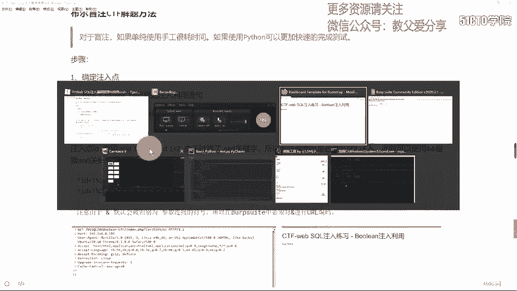

那么过滤and之外啊，那咱们想对它进行进一步的这个测试的话，那么此时呢啊我们应该是过滤的一个等号啊，过滤的一个等号。那么如果我们这里过滤了and的话，那么我们同样可以使用我们对应的at符号。

然后比如说at符号，然后是一个零的话，回车。那么可以看到输出了一个success。如果是一个一的话，也会输出success。那么这是由于咱们对应的这个at符号会在这里被认为是一个参数。

而后边内容会被认为参数相关内容，而并没有真正的执行circle语句相关内容。那对于这种情况来说，咱们可以对它进行1个UL编码，百分号26就是我们对应的啊这个at符号相关的UI编码。

那么我们这样一个符号的话，那么要使用两个符号就使用百分号26，百分号26之后输入对应的这个条件。那么它在我们对应的这个s语句当中，相当于我们对应的这个and。那么end一的话，那么永远为真。

那么返回正常结果。如果我们end的话，一个零的话就会返回对应错误。那么这种情况我们可以直接在浏览器当中输入我们相关的符号进行测试号26分号261回车那么正常输出，如果是零的话回车，那么可以看到是一个。

那么由此呢我们就确定我们在正常和不正常或者是错误情况下输出不同内容。此时我们对ID是可以进行注入的。那么当然这过程我们也可以使用来进行测试。

那同样呢我们需要对我们对应的这个符号进行UI编码将它编码为号26，然后得到对应结果进行查看。那么在这里我们也做一个演示。首先截断之后呢，在这里进行一个刷新。回到我们对应的当中这里我们要开启。

我应该开启对应的代理之后呢，对它进行一个刷新。我们可以看到此时呢截获对应数据包。我们将它发送到repeer当中。那么在这里呢我们可以将对应的这个百分号26替换为之前我们可能错误的这样一个结果。

那么可以看到我们此时这个位置会将它识别为一个对应的参数。那么此时它并没有两个符号进行结合传入到对应数据库当中。因此呢我们这个位置就不会被认为scle语句相关的这个and符号，那么点击s的话。

它也不会输出相关的这些内容，只会输出success。那么此时要想做对应利用，就需要对它进行编码。如果你不知道我们and符号相关的这个编码的话，那么在这里可以将它拷贝到这里，然后inL。

那么就是百分号26。我们要将它拷贝过来，然后返回到repeer当中，conl之后点击对应的。

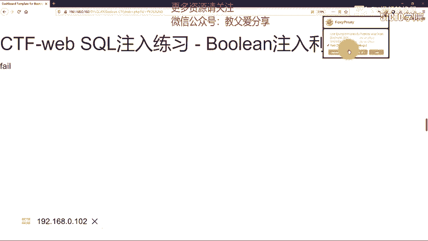

ad在s之前，我们先改为一个一表示永远为处一个真，点击sad。那么此时永远为真返回一个success。如果我们传递一个假的条件，也就是零啊，也就是零零代表是一个假点击sad的话，肯定是一个假。

那么此时呢是一个fi，那也验证了我们对应的这个说法。那么此时就证明ID是存在一个不尔注入利用的。我们可以使用不尔注入利用来进行进一步的测试。那么首先我们要做的啊就是获取原始的这种利用语句。

那么大家可以想我们相关这个srcle语句。首先呢我们使用一个se相关内容之后呢，我们可以使用226，26进行连接。你也可以使用其他逻辑运算符哦二的话，那么表示一个或者。那么双方有一个为正确的话。

后边内容就不会再进行执行了。因此我们需要把前面内容报错啊，带入一个不存在的值负一，然后通过对应啊正常的这个查询来进行获取。那么之后呢我们进行对应的判断啊，每一个对应的字符。

那么当然我们当前的这个语句当中有很多是存在对应的啊这个防注入或者是对应的过滤，那么此时我们就需要进行进一步的啊这个。筛选啊或者是绕过，我们需要将空格以及我们在这里啊不能使用SUBSTR啊。

要使用对应的这个my以及阿24ASKII这样一个对应的函数，也不能使用使用ORD因为它进行过滤。同时呢逗号也不能使用。那么等号也不能使用。那么此时我们就可以使用这种结构来进行对应的绕过。

我们接下来做演示。那么ID啊首先给它进行一个赋值啊，负一。接下来给他对应的。就空格啊空格。那么咱们要对它进行注入的话，那么首先我们其实呢可以回到浏览器当中进行进一步的这个设置。

那么还原我们对应的原始srcle注入语句。那么首先呢要知道ID传进去它使用啊对应的这个表，我们so tables进行查看，使用posin这个表进行对应数据查询。那么此时我们就可以。

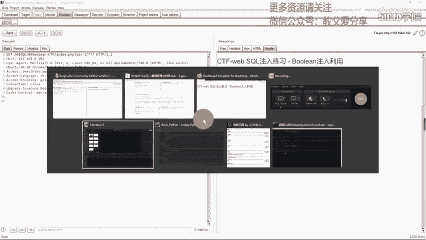

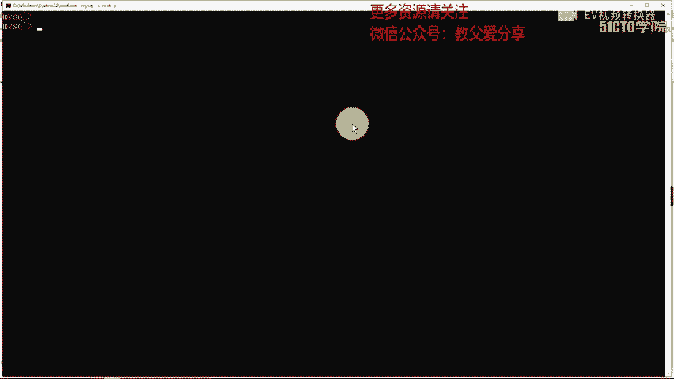

进行对应的还原还原思格语据。say that person啊，然后well。条件ID等于一那回车，它查询这样一条数据。那我们要想对它进行不利用的话，我们需要使用ad相关的这个内容。

那么当然and不行的话，可以使用or，并且可以使用两的这个艾符号来进行替代。那么此时我们使用一个or，那么使用二的话，就要将前面内容置为负一啊也不存在值，那么此时后面内容才会进行一个判断。

那么只有后面内容为正确的时候，那么咱们最终外语句会返回一个正常的这个数据，比如说返回一个一。那么此时为帧就会查询到对应数据页面也就会展示对应的success啊这样一个信息，否则的话展示for。

那我们要想后面这个数据进行对应的判断。那么它要为一个真。那么首先呢我们要判断一下相关的这个表。那么表明的话，我们可以使用对应的啊这个。逐字拆解。那么逐字拆解的话，我们首先要将所有的内容进行一个输出。

要将它这个table下划线name。进行获取啊，然后从我们对应的原数据库information，然后sma SCCHEMA点tableswhere。tableable小划线name啊在我们哦。

这里tableable是加码。SCHEMA。等于一个对应的databbaseDATABSE等于一个datbase。那么现在查询对应的这个数据库当中的这个表明，那表明的话，我们要查询对应的这个数据的话。

就由于它返回的并不是一行。因此我们就需要使用limit来使用限制的方式输出我们对应的这个数据，比如说01，那么就从第零位置也就是第一个位置向后截取一个对应的数据长度。那么与此同时呢。

我们还要将对应的这个数据。首先呢我们这样的一个查询会获取我们对应的啊这个数据表的第一个数据表的名称，也就是我们当前对应的这个数据库第一个表的名称。获取之后，我们因为是一个逐字拆解。

那么此时就要使用到对应的这个my或者是SUBITR相关的这个函数。啊，比如说SUB。STR那么我们开始执行这个函数，这个函数的话要查询我们当前获得表明相关的内容。我们此时一逗号一获取第一个数据。

那么与知判断啊，判断的话，首先它是一个字符，我们使用单引号。比如说A。那么直接回车，那么这里他报错误。那我们看一下啊，究竟是什么错误，这里。空格subt。

然后接下来是对应的这个datbase are limit。这里没有问题。datase啊，然后。我们看一下啊对应这个符号。

select table name for informations tables，well tableca等于 databasease。那么之后呢，通过limit来进行一个第一个啊这个表明的确定。

确定之后，然后这里啊应该是多了一个对应的啊这括号。不车。那么此时可以看到我们筛选出第一个表明对应的这个字符等于A的情况下，那么它就会返回一个处。如果它使用另外一个字符B，那么就不会返回对应结果。

因为它相当于V20，那么此时它就会。报错或者说是没有查询到相关的数据，那么就输出Mty set表示没有数据。那么由此呢，咱们就确定我们查询的啊这个数据库对应的啊这张第一张表所对应的啊这个第一字符就是A。

那么这样组织拆解就可以拆解出相关的内容。

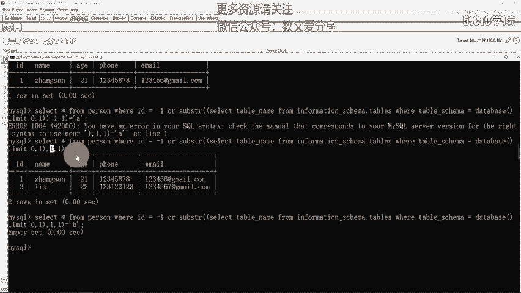

那么由于我们当前对应的这个数据库呢，是存在对应的这个过滤的那我们也可以给它添加一些内容。那么会发现它过滤了我们对应的sub stream啊，以及我们对应的这个空格。substream的话。

我们可以使用mide进行替换。而对应空格的话可以使用这种注释符的方式来进行绕过。那么同时也过滤掉相关的逗号。我们需要在limit以及我们对应的mide进行一个相关的绕过。

那下面我们开始构造对应的这个payload。那么构造payload的时候，我们可以先在对应的终端当中进行构造。首先进行一个替换，替换掉subre啊，改为mide。那么此时这个问题解决。

那么subre已经绕过，然后well tableca啊，然后datbase，然后之后呢是对应的这个逗号，逗号的话我们可以使用对应的。

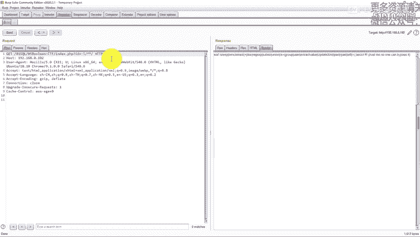

limit可以使用from。啊，这里是一，然后oft OFFSET，然后是从零开始，然后偏一个内容。那么此时我们只需要改变零这个位置即可。那么这是它最终的这个偏移量。那么之后这里没有对应的逗号。

那我们对我们对应的啊这个m也进行一个驱逗号。首先它是一个from。一啊 for一啊从一到一，那么此时就是第一个位置。那么第一个位置回车是否等于A啊等于A。那么等于B的话回车，那么可以看到没有对应的结果。

那么此时我们就构造了这样一个circle语句。那么对于这个蛇课语句，我们可以给大家做一个复制之后呢，我们可以对它粘贴到我们相关的啊这个位置。

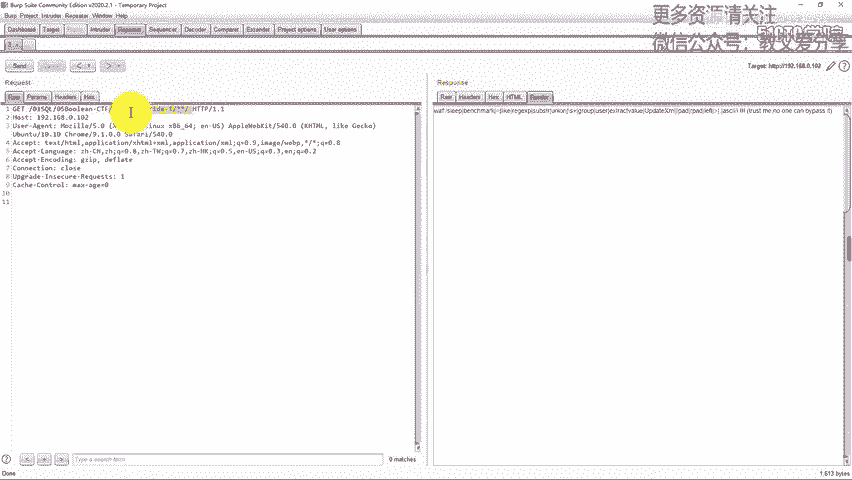

我们要对ID相关的这个值进行复制。ID这个值按回车进行复制之后呢，回到波当中。

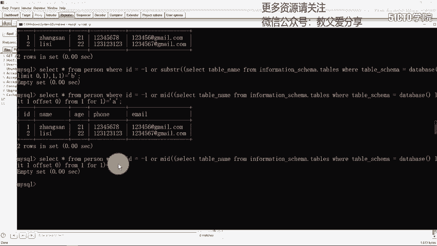

在这里contrl啊粘贴进来。那么由于啊空格不会进行正常识别，一般情况下，你要使用加号或百分号20。由于我们在正则表达式当中过滤了啊这个反斜杠S啊。

表示对应任意多个一个或多个对应的空格都会进行一个对应的报错。因此呢我们不能使用百分号20或者是对应的加号。我们需要使用注释来进行绕过相关的这个操作。那么此时我们将对应的这些内容。

也就是空格都改为这样一个百分号呃，这个星号相关的这个注释。那么此时就可以进行一个正常的使用色透居，那么不会出现我们相关的啊这个wa检测到或者是脚本检测到。那么此时我们开始逐个修改。修改完成之后。

我们进行一个访问。那么在这里啊，我们要一步一步修改。把limit这个位置啊修改。之后呢，啊一这个位置也需要进行一个室外。当然呢啊你也可以拿到文本编辑器里啊，直接将空格替换为对应的这个位置也可以。

你可以像我这样手工的输入。可以加深啊相关的这个印象。那么现在完成啊，点击下ad。那么正常情况下B是不等于的。但是这里啊它输出了相关的这个内容。那么他说我们对应的这个内容的话。它而进行了输出。

那么此时他没有绕过对应的这个袜子。那么也就是说没有绕过脚本检测，我们再次看它防御内容有对应的等号，我们这里直接出现了等号，这里也有对应等号。所以说报错了。那我们想要绕过等号的话。

大家可以使用我们之前所介绍到的这个应啊，我们可以给它设置印啊，然后对应的是括号，一定不能少啊，必须有对应这括号。

括号加上，然后我们在B这里也要加对应的是括号。然后一。对应的啊是括号，然后对应的A回车。那么可以看到输出正常内容。B的话输出错误内容啊，没有对应的这个提示或者没有消息啊，没有数据。

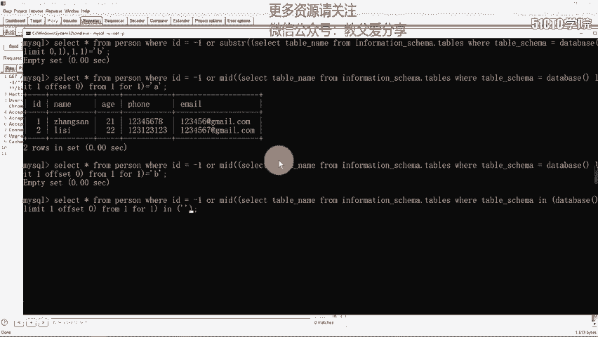

那在这里我们对它进行修改I啊，然后这里应该是有一个空格，然后IN，然后对应的这空格。之后我们对它加括号，然后到这里。括号。之后是一个数字啊，比如说A，然后接下来在这里对它加对应的这个空格。

然后接下来是一个in啊，然后加对应的这个空格之后，一定要加上databbase相关的括号。in后边必须有对应这括号，否则会报错。那么此时啊它报一个错误啊，是一个语法错误。我们可以啊查看对应这个语句。

那么datb啊，然后接下来。table scammer well taste go scammer，然后in我们具体的limit。然后我们找一下对应这个错误，他说在一的这个位置应A。

他说这个位置是出现错误，我们看一下对应这个错误。然后这里应该是没有问题。查询到数据与A进行比较。那我们可以啊将它复制出来，直接进行一个拷贝之后呢，我们回到浏览器当中啊，替换相关的这个ID。

之后把代理关闭。不撤，那么他报错表示我们在这个位置当中啊存在错误。我们回到这里进行对应的这个查看，进行修改。那我们啊看一下究竟什么什么错误，form一啊 for一啊，应我们对应的这个A。

A1于括号没问题，字符。你在这里。我们将啊对应这个内容进行一个比对吧。直接将我们当前内容啊进行一个拷贝，然后对应的compare。然后pas粘贴到这里之后呢，我们在之前也使用过相关的这个内容。

我们可以将它拷贝过来。之后呢，我们再。对应这个位置啊点击pate。那么两者进行一个比较，我们可以点击word进行一个比较。那么会发现啊在这个位置的话，它出现了相关的这个内容。一这个位置。放佛。

我们这样啊进行一个查看一，然后ORD啊它是进行了一个相关的ORD啊这个转换。那么这里我们应该少了1个ORD相关的这个内容。那么RD的话，然后是在一这个位置后边是具有对应内容。那这样的话我们进行一个转换。

当然不转换也应该是可以正常运行的那么我们先给它进行一个转换。首先呢卖之后是1个ORD。ORD将它转化为对应的这个二进制呃，转化为对应的阿斯萨码之后呢，在这个位置啊应该是这个位置。

RD啊将我们括起来内容再给它进行括起来之后是硬啊这个操作。那么阿萨尔玛比如说是1个97啊，点击sead。那么这样还是会出现对应这个语法错误，我们可以将这个内容这个内容直接给它进行一个复制。复制过来。

然后我们再compare进行一个比较。那么首先我们将它remove，将之前的这些内容都removepa，然后回到我们这个对应之前测试好的这个语句，直接给它进行一个复制。之后呢。

回到compare past，然后word。进行比较会发现啊在这个位置的话，它是有对应的一个这个符号，其他内容是一致的。我们啊可以将对应这符号给它去掉。关闭。然后有对应这个符号点击下的。说。

这里应该是没有错误，我们把这条语句给它复制过来，然后回到这个页面当中，给它直接进行一个粘贴ctl，然后点击下ad。对的。他说一个错误。好，我们应该是没有问题。很到位。我们将之前的这个部分复制过来。

之后粘贴到这个位置。然后点击s。那么可以看到啊，这时候成功了。刚才啊我这个原因的话，我看一下compare。应该是没有问题的。挂的。它俩这个区别的话，就是在最后这个位置，它多了这样一个符号啊。

它不是不具有这样一个符号，也就是对应的这个冒号。这里这个冒号应该是不影响啊，我们将冒号进行一个去掉，这里啊多了一个空格，直接把这个冒号去掉，点击s也是没有问题。如果这里修改了一个其他字符，点击s的话。

它就会是一个fi，那么此时呢就可以构造出原始的这样一个对应的scle语句。那么这个scle语句呢，你需要精心的来进行构造，最后呢根据页面结果来进行一个返回绕过。那么有了这样一个语句的话。

那么此时呢大家就可以通过它来编写相关的这个代码，我们使用thon来进行编写。首先呢编写对应的这个表明的获取。我们要声明一个对应的差类型，也就是我们对应一个字符串。

其中包含着我们相关在数据当中可能出现的一些字符，之后呢，要声明一个请求的UL，也就是存在注点的UL之后呢开始进行。对应的这个测试使用一个for循环。那么我们要测试过程中，首先要获取我们对应的这个表。

数据库当中的表可能不止具有一个。因此呢我们要探测两个相关的表。那么当然你也可以修改为更大的一些数字。探索更多的这个表之后呢，我们申明一个table name。我们探测的每一个表来说，那么探测完成之后。

那么就可以对它进行输出，再次进行探测下一个表的话，你要将之前所使用的这个临时变量置为空，否则的话你就会进行一个错误的显示，之后呢，我们开始进行对应测试。我默认情况下，假设每一个表的名称要小于等于50。

那么就可以使用1到50，也就是1到49这个范围当中数字来进行对应的设置，也就是有这么长度的啊这个字符。之后呢，我们每次探测要对我们当前差当中的啊这个所有字符进行探测。因为在我们对应的这个数据当中。

或者是任何字符创展当中，都有可能出现我们这里可显示或者可打印的一些字符。之后呢开始对我们参数进行设置。那么这个参数就是我们对应提交的IDID的话，我们要精行设置它相关的这个语句。

那么这条语句得来全靠我们对应之前获得的这个原始语句，获得原始语句之后，我们要做对应的修改。首先呢你要修改ofset这个位置表示我们获取第一个表明，第二个表明，那么零表示第一个表明一的话表示第二个表明。

因此呢我们在这个位置的循环，要替换到我们对应的offset之后。那么替换之后，我们要对啊对应的这个。表明当中啊字符对应的这个具体位置，也就是表明的第一个字符，第二个字符。

那么要从我们对应的form后之后添加，那么也就是通过啊对应的I进行追加。那么每一位的字符究竟是怎样一个内容，那么咱们可以使用叉来进行替换，也就是应之后的这样一个内容。那么设置完成之后就可以进行对应测试。

在这里呢我没有使用阿斯尔玛，而是直接使用字符串。实际情况下，你需要使用阿斯尔玛相关的啊这样一个操作。那么这里由于我没有过滤相关的这个引号，所以说就可以直接使用。如果过滤的话。

你需要使用ORD或者是对应的ASCII来进行对应测试之后呢，要将阿斯尔玛转换为对应的字符，就可以获得我们智能数据。那么此时我们设置完成直接发送。然后如果我们在这个过程它对应的长度是1764的话。

那么咱们就拼接我们得到的这个字符，最终呢输出我们对应的表名。那么输出一个表名之后，开始第二次循环。那么最终我们输出两个表名admin和possy。那么对于我们1764如何获得。

那么这里我们也给大家做一个介绍。我们要将这样的内容给它发送到对应的音出大模块之后呢，我们对这个位置进行克列。我们要将零添加一个变量，对它进行修改。那么输入一个一啊，输入一个0。

and然后star attack ok。那么此时就会发现我们对应的这个数据一的话，那么它输出2029，那么它代表永为真，那么就输出ss对应响应的这个长度。那表明咱们对应的这个条件语句正确。

那么如果是一个错误状态，那么是2026，因此呢我们确定正确状态对应的这个数字是2029。因此呢在这里你第一个语句使用or进行一个报错。那么or在这里首先是一个-一报错。报错之后。

那么后边按语句为正确的情况下，那么它就会得到对应的正确长度1764，最终呢输出相关数据库名啊，这个数据库当中的这个表明。接下来我们做演示回到我们对IDE当中，我们将啊这段代码给它解注式。

按cttrorl写杠。

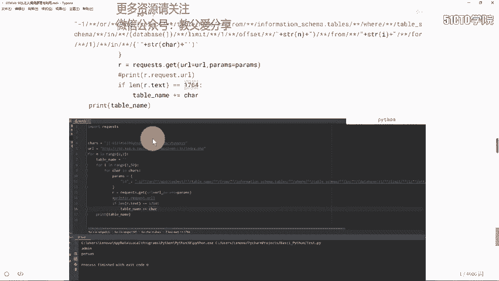

此时呢我们右键运行。那么这个过程它要进行循环便利，循环便利是需要花费一些时间。我们要加入对应的多线程。所以说你就需要在这里等待即可。等待它完成之后就会输出我们相关的啊这个表明。

也就是在我们当前对应的这数据库啊，datb这个数据库，也就是我们最终的web circle这个数据库当中所对应的这个前两张的表明，因为我们只便利了零零代表第一张，那么一代表对应的第二张。

那么此时它会输出第一张表名是ad命。那么之后呢，它还会输出对应的第二张表明，也就是possy。那么这里啊我们就不再等待，稍后给大家查看相关的结果。现在我们有了对应这个表名，就需要获取对应字段名。

同样呢我们要进行对应的原始payload的的这个获取或者是原始circle注入语句的这个获取。那接下来我们以admin这样一张数据表为例做演示。

首先呢我们要将之前的Qlumtable name替换为Q long，然后对应的表也要替换为Qlum。那么最终它要查询哪一个具体表当中内容要替换为admin之后呢，同样的语句，同样的这个含义。

我们要进行对应的这个设置。

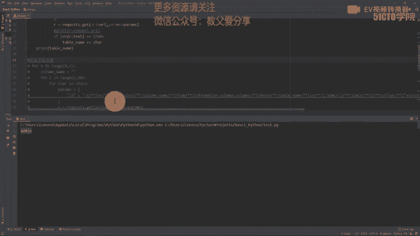

进行相关替换。首先呢我们要查询对应的啊这个。limit之中的内容，也就是查询第一个字段，第二个字段，第三个字段相关内容。那么要查询每一个字段相关字符就使用I这个变量。

那么最终每一位对应的字符是怎样的内容使用叉，那么这样就构成了我们相关的这条语句，同样判断是否等于1764，最终得到我们指定的这个表名admin当中的字段名，这时候我们回到代码当中进行查看。

我们现在得到了表明admin和per，我们可以将这段代码给它进行一个注释。我们将我们这里写的获取字段名称代码解注释，然后右键运行。

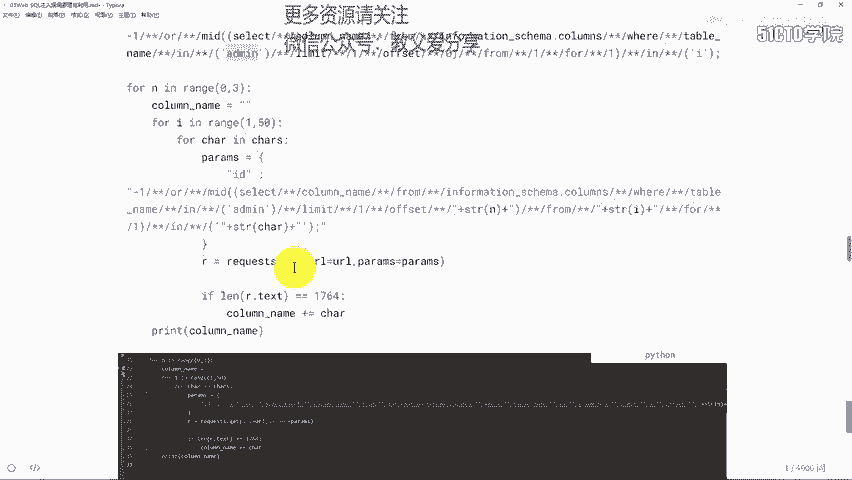

那么此时它就会获取我们对应指定的啊这个admin，这里是admin相关表明的这个字段。那么它是在这个srcle语句当中进行指定的。那么之后呢，它就会输出addmin当中所具有的啊这个字段名。

那稍后呢我们查看相关的这个结果。

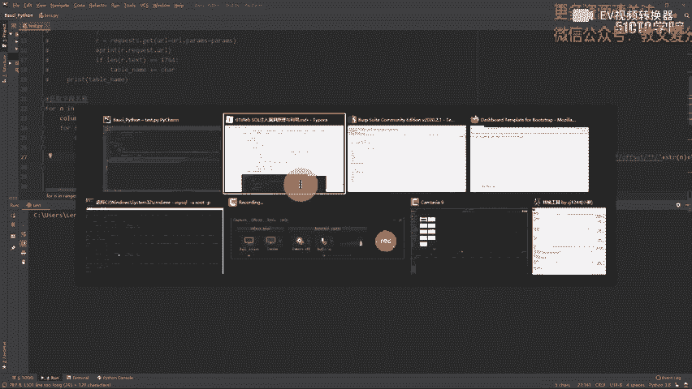

那么对于这些srcle语句的这获取，以及我们对应代码编写，我就不再详细介绍了。大家应该是可以轻松的掌握通过之前的学习。那么有了对应的字段名，表明我们就可以构造circle语句来获取对应的这个值。

这里我们给出circle语句。同样呢它要进行一个对应的逐字裁选，然后进行一个替换。那么这个替换首先呢要进行字段啊相关的第几个字段。那每一个字段当中的位也就是你判断第一个字段当中的第一个位，第二个位。

第三个位，那么每个位具体的值使用差，最终呢就可以得到相关的结果。这里呢我写了一个。获取前十0个对应的passport字段相关的内容。那么可以看到这是字段是表明。那我们回到这里进行查看。

此时呢会发现我们现在已经输出了对应的啊两个对应的这个。

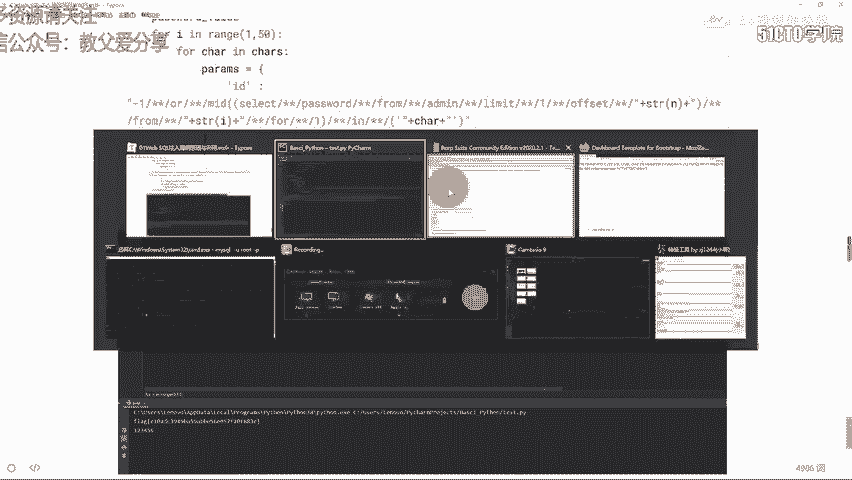

字段分别是ID和Uer name。那么同时呢我们稍后也会输出对应的password。那么输出pasword之后。

我们就可以在这里通过pasthon啊这个语句或者是脚本来获取password相关的这个数据。那么我们就不再等待了，它比较慢，我们直接关闭。那么将这段内容给它注释掉。那么接下来获取相关的这个值。

我们此时呢右键运行啊，它确实输出了password。那么运行之后，我们就会看到我们前十个相关的啊这个pass word对应的值。那么首先呢我们要获取多少条记录。那么在这里每条记录包含多少个字符。

那么这些字符分别是什么内容？那么这是它的一个逻辑结构。之后呢，对应参数是我们精心构造的这个payload的原始字符串。

那么这个payload的构造要结合我们对应的这个book以及我们浏览器对应的这个显示。同时呢我在实际的这个测试当中，我更喜欢加入一条语句。那么这里我们先输出了第一个对应的这个payload获得对应f值。

我们先给它中断啊，就不再进行对应运行了，运行下去也会获得对应的值。我们给大家说一下对应这个调试，就是使用对应的print request uL将它拷贝出来之后呢。

我们对它进行一个输出control位之后右键啊运行。

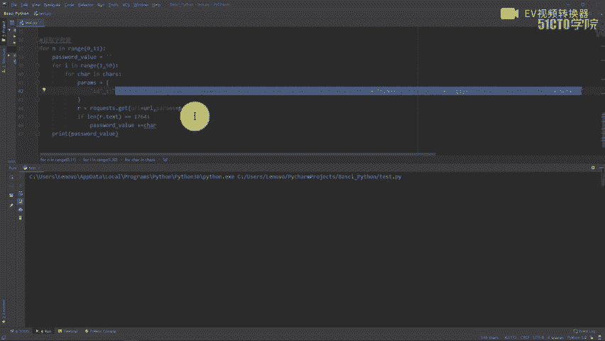

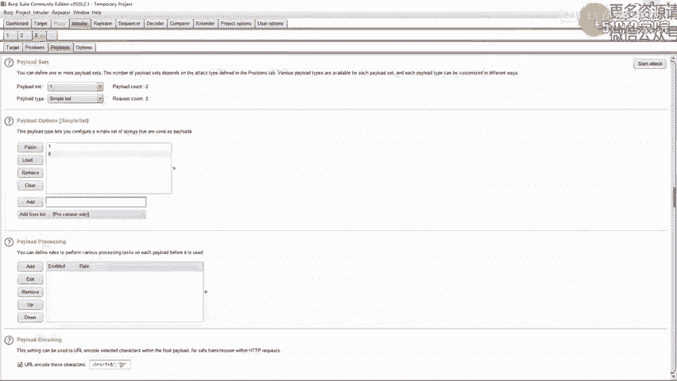

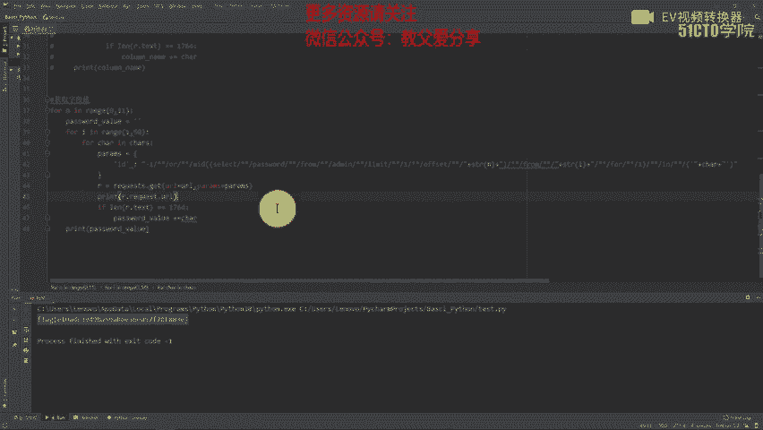

那么进行一个中断关闭。那此时呢我们获取对应UL值可以拷贝出来。然后呢，我们对它进行一个测试啊，这是我们测试过程中使用的一些技巧。那么测试的话会发现它是一个fill。那么这个语句是正常，没有报错。

所以说啊我们这个构造应该是没问题。此时呢我们就可以精心的去构造对应的这个每一位是否进行一个正常的啊这个设置，以及我们对应逻辑是否正常。而对于我们对应这个语句啊，应该是可以语法正常的一个检测啊。

在这里通过它输出我们请求的URL来完成检测的效果。那么此时我们将它注释掉，获取到我们刚才类似于flanang相关内容，大家就可以提交，然后获得对应的这个分数。

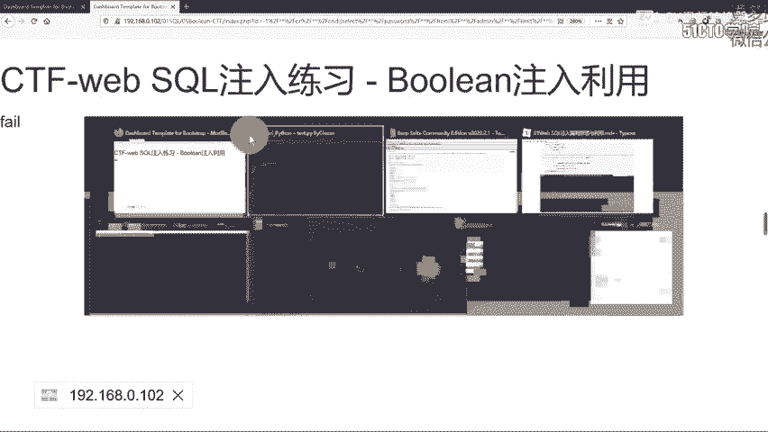

那么下面呢我们进行一个小结。首先呢大家要理解我们python如何实现自动化布尔的这个注入。我们分为三个步骤。首先呢你要确定注入点哪一个参数是存在注入点的话，然后进行注入点测试。最终呢要通过测试。

绕过我们对应的过滤，找到替换的方案，构造出原始注入利用的这个语句之后呢，就是一个pasthon自动化便利的一个操作。那么通过啊我们本章节的学习呢，大家要深入理解bo尔注入的这个原理。

那么同时也能编写出我们波尔注入利用的这些代码。

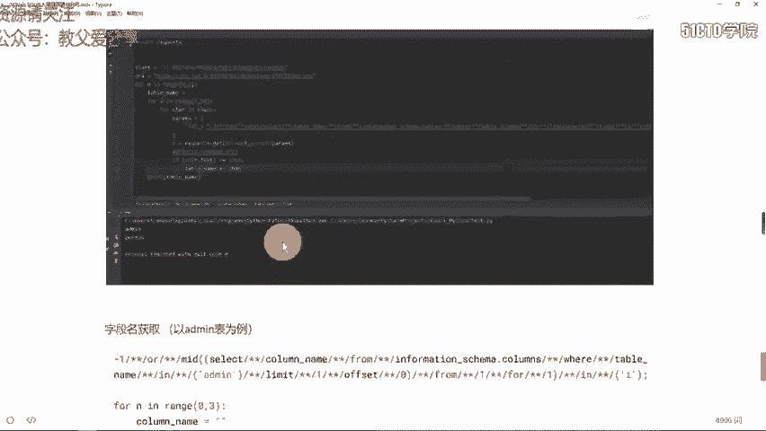

那咱本节课关于布尔芒助CTF解题的这个方法先介绍到这里，再见。

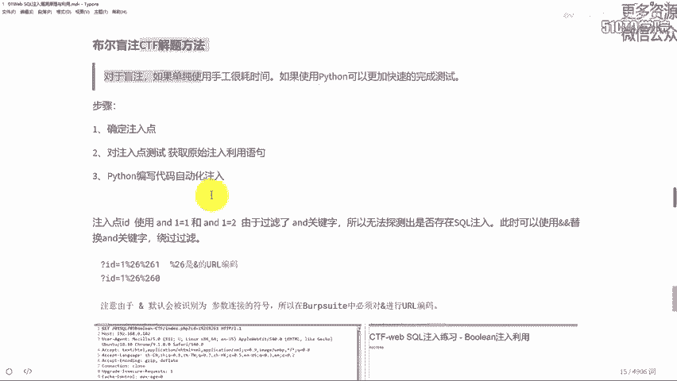