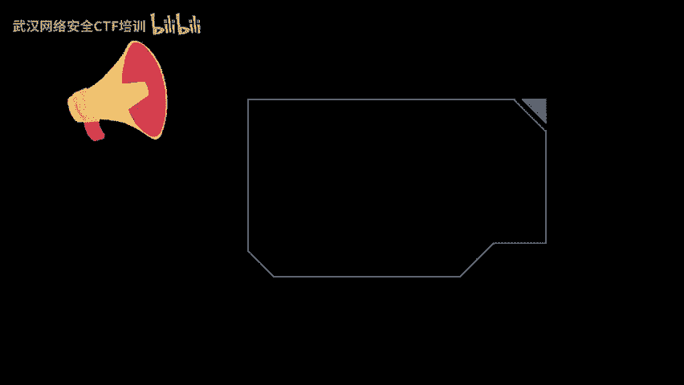
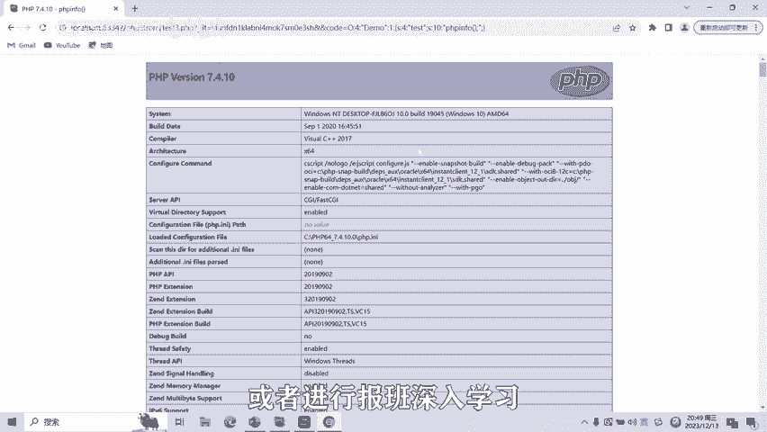

# 09-网络安全CTF系列培训教程之Web篇-反序列化漏洞 - P1 - 武汉网络安全CTF培训 - BV1bN4y1z7bW

扫码优先获取更多资料。大家好，我是武汉世纪云创公司的CTF培训老师。大家可以叫我阿阳。我们制作此视频的目的是希望帮助一些想要学习CTF的同学快速入门，提高CTF竞技水平。

本视频为CTF网络安全系列培训教程，后期将会持续不断的更新。大家如果有兴趣进一步深入学习CTF，可访问PPT上面的公司网址进行电话联系，或者扫描视频中的二维码进行报名咨询。

我们的教师团队均来自CTF省赛世赛前10名选手，通过顶尖战队的手把手指导，大家学完之后呢，即可达到省赛世赛的夺奖水平。首先大家一定要遵守网络安全法。本课程内容呢仅用于CTF网络安全教学培训。

请大家遵守相关的法律法规，勿用于其他用途。今天这节课呢主要是讲CTF比赛中的反序列化漏洞。序列化seize是将对象的状态信息转换为可以存储或传输的形式的过程。在序列化期间。

对象呢将当前的状态呢写入到临时或持久性的存储区，将状态信息呢保存为字符串。反序列化un serious就是把序列化之后的字符串呢再转化为对象的一个过程。其实在序列化的过程中呢，是没有任何的漏洞的。

产生漏洞的主要原因呢就是在反序列化的过程中，通过我们的恶意篡改，会产生魔法函数绕过字符串逃逸、远程命令执行等漏洞。接下来呢给大家看一下序列化子符串的基本格式。

比如stream类型呢是通过S sizeize value来表示。size呢是stream变量长度大小的意思。valueue是4郡的一个变量的值。后面呢我们将通过代码来更全面的了解字符串的基本格式。

我们看到左侧为PHP序列化代码，右侧呢为输出对象里面的变量值以及变量序列化后的字符串。左侧代码声明了一个user name，并且呢有两个变量，分别是age和name。还有一个print data函数。

输出name和age的值。我们创建了一个user类的USRUSRR变量，将USR变量中的nameme设置成addmin age设置成18，然后eal userer输出user的反user的序列化字符串。

大家可以看到虚化字符串的为。O冒号4user2S3HI18S4name S5ad me这个呢就是对象user。是序列化之后的一个形式。这个O呢表示的是对象。4呢表示对象名的长度为4。

因为user呢为对象名，对象名的长度呢为4二呢表示这个对象有两个参数。花括号里面的参数呢是key和value。S呢表示讯对象。三呢表示age名字的程度呢为3，age呢则为key。I呢是int对象。

18呢就是value是值的意思。后面呢。都是相同的道理。以此呢类推。好了，接下来给大家介绍PHP反序列化里面可能会用到的模法函数。construct函数呢是初始化啊。

初始化类的时候呢一般呢是对变量呢进行一个赋值。distruct函数呢和构造函数呢相反，在对象呢不再被使用时候呢，将所有该对象的引用呢是为6或者呢程序退出时呢自动调用该函数。

to讯函数呢是当一个对象呢被当做一个字符串时呢，被调用，把类呢当做字符串使用时呢，就会触发to讯函数，返回值呢需要为 string字符串。weake up函数呢呃使用unseless时候呢出发。

反序列化时候的触发。反序列化恢复对象之前呢，调用该函数。sleep函数呢使用C序列化呢的时候呢出发该函数呢需要返回以内成员变量名作为元素的数组。该数组里的元素呢会影响内成员变量呢是否被序列化。

只有出现在该数组元素里的内成员变量呢才会被序列化。Dstruct函数呢。嗯，前面呢刚刚讲过，就是呢当这个对象呢被销毁时候呢，出发。然后呢。

invoke函数呢就是当脚本尝试呢将对象调用为函数的时候啊再出发。接下来呢给大家看一个反序列化的一个攻击案例。1个PHP论坛使用PHP对象序列化呢来保存一个超级cookie。

该cookie呢包含了用户的ID角色哈西密码哈西和其他的一个状态。攻击者呢将该序列化呢对象权限呢从Uer大家看呢从。U走权限呢改成了a的命。从而呢达到了授权自己爱丽丝这个账号呢为led的命权限。

从而达到一个权限的一个提升的一个过程。接下来呢给大家看一个无weake up函数的反序列化漏洞的利用。右侧呢为源代码，有一个构造函数和一个C构函数，构造函数呢将test变量呢进行一个赋值。

虚构函数呢则会调用微小函数以保。通过get传参传code参数值为反序列化字符串，可以调用反序列化函数嗯se，然后呢，当对象消亡后呢，就会调用西构函数里面的eva函数，从而达到反序列化动动的一个利用。

我们只需要将get传参的code参数值呢设置成为序列化字符串。这个。欧4demo啊S testestS呢这个值就是test值呢为PHP information，这个时候呢就会调用。

把这个把这个当做一个代码进行执行。调一个函数。接下来呢给大家看一下。反序列化漏洞的一个实操的一个演示。这个t的一呢点P呢这个呢就是我们前面讲的啊。创建个user对象，有A和name两个变量。

输出A和nameme的一个值，我们输出一下。这时呢就把通过se less函数呢输出user这个变量的一个区化对象。内呢是t123456A呢是22。好，我们看一下这道题目怎么做。有一个demo类。

有t变量。前面讲过，通过get传参传一个扣的参数值。然后呢，如果我们的参数值里面。传的这个序列化。看的这个序列化啊。去的话走不上。code等于虚化字符串，这个时候呢就会触发eva函数，从而达到了一个。

反需要漏洞的一个利用。但是呢这个序列方了。做出来是多少呢？我们可以看一下。我们可以利用一个demo，是不是？然后在里面输入值为PP information这个函数，然后呢输出。

它的值我们输出一下它的序列化函数。交换函数为这个。也就是说那我们把这个复制进去。就可以调用PP information函数。回收这个时候就调用了PAAP information函数。

从而达到了反序列化漏洞的利用。反序列化漏洞呢还有很多种绕过和利用方式，后面呢将会针对各种类型的反序列化漏洞呢制作相应的教学视频。大家呢同时也可以扫描市民中的二维码，领取资料。

或者呢进行一个报班的深入学习。

好了，今天的课程到此结束，感谢大家的观看。🎼。

