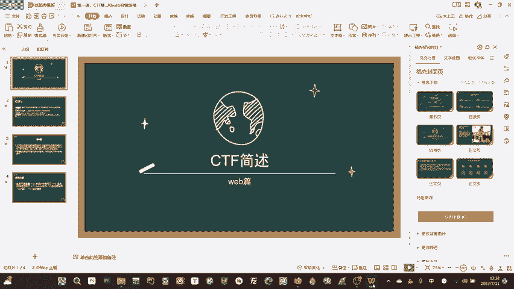

# 0基础WEB安全教学，从开机到拿奖 - P1：第一节 CTF简介和注意事项：哒咩干坏事 - 看名笑 - BV1nW4y1o7T8

hello大家好，欢迎收看本一期we部教程的第一节课。呃，后面我将会带大家在本个系列中进行整个CTF webb的一个学习，教大家从开发语言开始到能够打CTF甚至是能够拿奖的一个呃阶段。

杨呢作为本系列的第一节课要给大家简单的介绍一下CTF是什么东西。然后呢，同时给大家介绍一下方向，以及后面的学习路线。嗯，首先CTF是夺起比赛的意思，它就是打比赛的时候，比如说给你一个网站，然后呢。

你呃入侵这个网站，然后得到一串字不串这个字不串叫flog，然后把fag交上去就得分。然后呢，CTF的方向主要有4个web和密码学密呢主要是杂象。然后实际上很少作为一个主要的方向去学习。

然后呢外部的话是网络安全RE就是逆项，也就是大家所谓的做外挂呀，做病毒啊这些东西或者去破解一个软件的话主要是研究内核和操作系统的一些漏洞。是对数学要求比较高，它主要是密码学。

然后呢主要是研究AES这些的当代的或者是国家密码。嗯，基本的漏洞的话，CTF方向我们会带大家在外部方向学习一些像rcle输入啊S或者是文件上传。然后呢这些都会在后面的CTF阶段给大家一个一个的讲解。呃。

首先要声明，中华人民共和国网络安全法已经在2017年6月1号起施行了。本课程所宣传或教涉的任何内容均为分享目的，严禁任何人用于任何的非法途径。嗯，这是我们的培养方案。

后面的话会先带大家进行一些基本的环境配置。嗯呃如果说。如果说你要说你按找不到开机键，那我就没办法了。建议问一下GPT嗯，环境配置的话，就在后面学习语言的时候。

单独呃会给大家伴随着说就不单独做一个教程出来了。然后首先我们会进行前端三件套的学习，大概一两节课，能够给大家基本上呃完成一个怎么说呢完成一个网页的呃学习或者是能够做一个动态的，甚至好看一点的网页。呃。

你能力高点，甚至能做小程序，然后呢一些基本的后端语言学习认你我们的后端语言主要是学习呃srcle语句，还有mysql数据库以及PHP语言。然后大家也说像java呀，还有下或者是其他的一些go这种的语言。

它在后端的占有率更高。为什么不学它们呃，主要是因为PHP它更方便。同时的话呃后端的语言，它都是一个思想。你把就比如说传的一个参数过来，我怎么去接受它怎么接受一个请。有怎么处理他们，你把PHP写好了，嗯。

基本上都没有问题。同时的话后面的话好像很多代码审计这些的题都是PHP的。并且PHP的占用率还是挺高的。大家呃不知道用过steam市场没有steam市场的那个交易界面就是PHP大家可以看一下。

在那上面那个绿色的那个小网页，然后后面是python的学习。python的话会大概花一两节课教大家学习如何进行去写一个攻击脚本。然后基础漏洞片CTF片的话，主要是给大家呃带大家打一些靶场啊，像BOJ啊。

或者是我们自己开发的前TOJ这种的。那然后面的话是一些网站的真实的实战渗透。中途我会给大家分享课件。同时这个整门课程是免费的，大家可以呃安心的学习。如果说你想有其他资源的话，这些再说。

但是的话课程是免费的。呃，录这个视频，主要的目的还是希望能够更多人去学习安全了解安全能够呃更少的人被到QQ号。

呃，感谢大家收看。

