# 0基础WEB安全教学，从开机到拿奖 - P2：第二节 前端篇（上）HTML,CCS：如何用10000原石诱惑朋友 - 看名笑 - BV1nW4y1o7T8

嗯，好的，大家好，欢迎收看呃前端篇的上半部分。在本次课程中，我会给大家介绍一下，同时教大家使用HTML和CSS语言。然后呢呃大家不用担心我讲的特别的潦草。但是你看完我这一节课的话。

我相信大家是能够呃使用HTM和CSS来去做一些呃自己想做的网页啊，或者是其他的都可以。然后基本上就是够用了，对于安全来说够用了。然后呢HTML它是这样一个框框，就是一个大的HTML标签里面有两部分。

一个是head，一个是8底是它的脑袋和它的身体，然后的标签就是长这样，就是两个大于符号小于符号加一个这个大于符号小于符号中间一个斜杠，大家可以看HTML呃，这个是它的头，这个是它的尾。

还有一种HTML标签是它一整个自己就能能能就不需要这个尾巴的，就比如说它长着就长这样。后面会给大家介绍，然后呢head标签的话是写在这个呃开头，它可以标识一些整个网页的一些看不见的属性。比如说它的编码。

或者是它的呃标题呀，或者是其他的地方都是看不见的。但是它是真实存在所需要的一些东西。然后呢8底标签的话，主要是用于网页的主干部分。比如说你网页上有一条链接或者是你的网页上有一个。呃。

图片就是写在这个8字里面。然后呢，你要想加这些属性，加这些图片啊，这些东西都是用其他的一些单独的标签去加进去。后面会给大家介绍。然后呢给大家教一些学的就会HTML的一些标签。

那可能前端爷觉得我讲的特别的肤浅。但是的话呃对于一个我们这种用户或者是来说，只是想做一个网页，不是想去做那种专业前端的人来说，完全够了。我教的东西。然后你要是特别想去学系统学校。

你也可以去看其他的专业讲前端的网课。我这里只是给大家教会大家用。

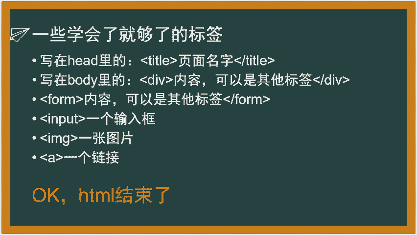

然后呢，这里给大家做一些例子啊，我这里新建的一个test点HTML。然后呢，这个软件的话是PHBstone是JB加。借 BRA大家可以去搜这个公司里面有很多的这种呃写各种语言的东西。

你下它的PHPstone就可以。然后呢，因为它既可以写PHP就可以写HT用。然来这里是题外话，然后我们继续我们刚才的呃介绍这个。然后我现在这里写了一堆这个。呃，一个一个基本的一个价值，大家可以看一下。

就是整个HTML它把你看首先是HTML，他把整个网页告诉你，就是我写里面写的HTML代码。然后。嗯。里面的话有headt标签是一个部分，8级标签是一个部分。我在head标签里面可以定义一个网页的编码。

比如说这。matta标签，然后他告诉他恰2C的就是编码的意思呃，等于UTF8。像这种，比如说mat标签。嗯。那是一个标签。然后呢我在里面比如有什么charc或者SRC啊这种东西啊，等于多少。

它这个就是告诉你一个标签的一个属性值等于多少。然后呢，每一个标签有很多的属性值，也有很多呃共同的属性值，当后这些属性值这些东西都太多了，没有必要系统的去学，我待会儿会给大家介绍几个平常的用的就行了。

然后呢，这些东西你你如果说其实你我现在这个网页不要这个也可以。但是我设置一个这个呃。在上面的话，它就不会出问题，大家也不需要去背它，也不需要看它没有关系的。那呢我接下来给大家介绍这个title表现。

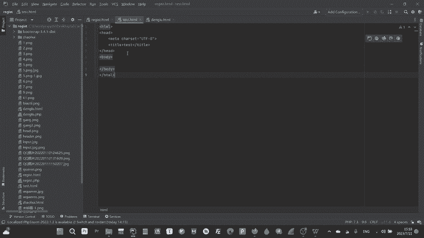

t标签它是写在head里面能够定义一个页面的名字。嗯，比如说我这个地方写了tle，然后中间加了一个呃。

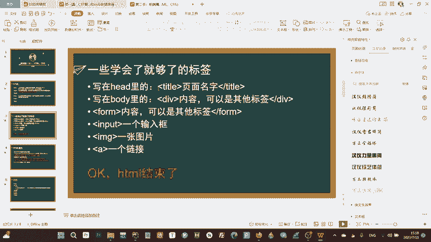

啊名笑。大家用这个浏览器去运行它，然后他就可以看到这上面把这个标题给改了。然后它的标签就是改这个标题，我在里面写什么，它都会加上去。然后呢，它呃这里给大家讲一下这个浏览器运行的原理啊，这个浏览器啊。

它就是一个呃你可以理解为1个HTML语言专用的一个解析器，它就专门负责去解析HTMLCSSjavacr这些呃语言的。你比如说我现在把它保存为一个记事本。

然后呢我用浏览器去打开它这个HTML它也可以解析出来成我现在这个样子。

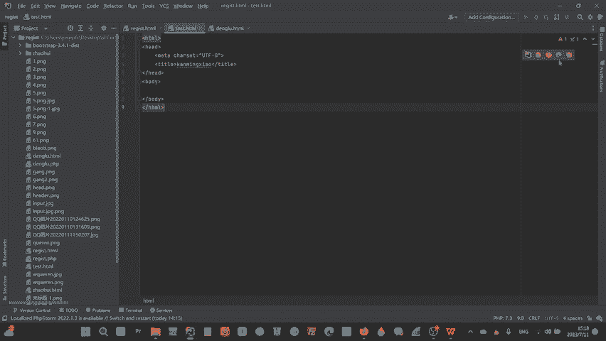

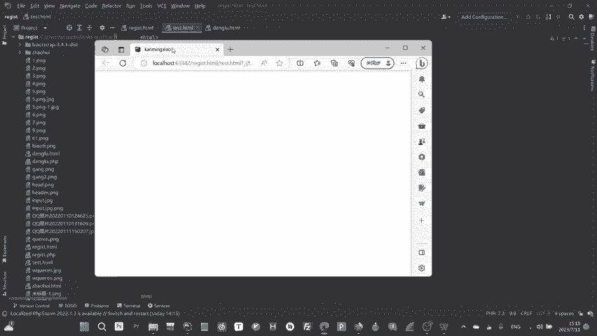

然后呢，大家理解一下就行。啊，它就有点像那个C语言的那个编译器，你可以理解为浏览器就是编译这个HTML的。然后那编译器就是编译C语言的。好的，大概就是这么多。

然呢8底标签继续我们刚才所介绍的就是呃比如说这个dve标签，dve标签就是把这个8级标签分成一小块，你后面可以学的CSS，可以把dve给它规定一下多大。比如说我把呃HTM有比如这整个是个网页。

我把这一块给它分一个d出来这一块分成出来。这样我就可以分门别类的去操作。这里面呢我怎么把它字体变成红色，这里面呢把它变成黄色，然后就可以这样。

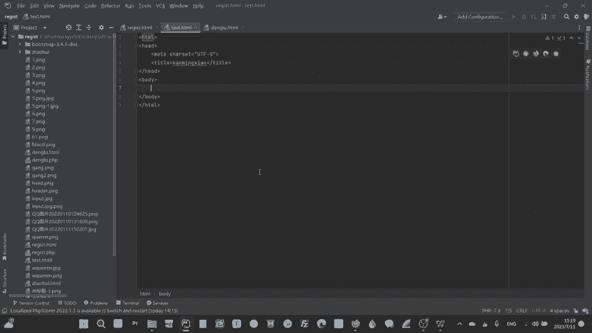

那楠给大家看一看。招不招先。他本身。

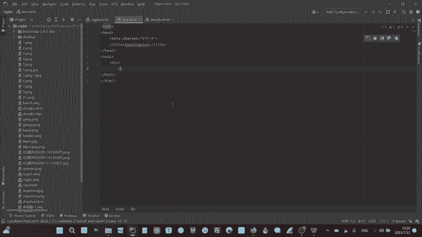

呃，它是它是它是没有任何的东西的，打开看一下，但个标签里面可以加，它就是分区，分区里面你什么东西都没加，肯定没东西。你可以在里面加文本。

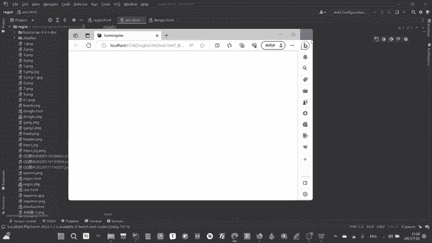

嗯。比如说加了一个文本，它就会显示上来，或者是我加一个其他的标签。

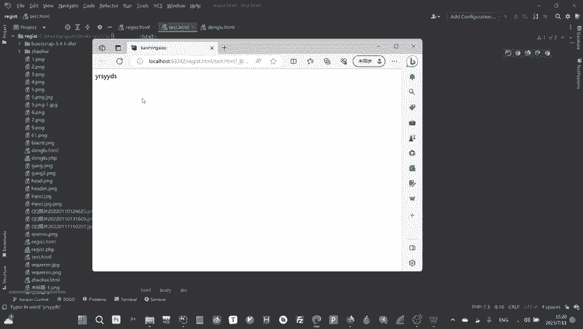

嗯，大家可以看，就拿这个A标签，比如这个一个链接这个东西来举例子。呃，A标签啊。他可以。它有一个属性。首先你想啊一个链接它能有什么属性啊，一个链接的属性就是它指向的地址。for就是地址的意思。呃。

比如说我像让它只向百度。百度点com，这是百度的网址。然然我在中间给这个地址命一个名，命一个什么名呢？命名叫KMX。好，现在我运行它。

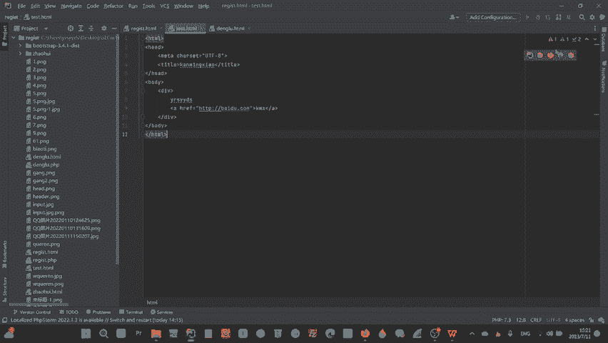

大家看到没有？这个地方有一个长得很像链接的东西，就是它名字就叫caMX就是根据我这个caMX决定的。当我点击它的时候，它就会解析这个地址，让它解析到这个百度这个地方去。

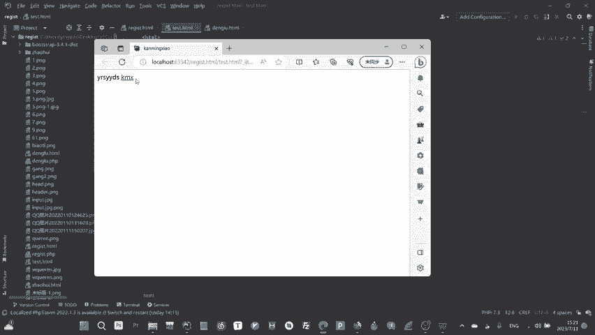

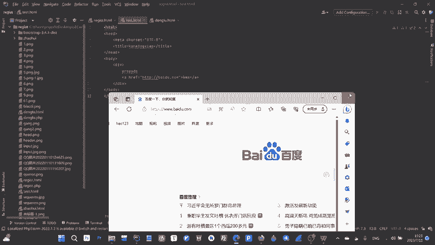

这就是大家平常看到的链接的这一个功能。比如说好，现在我给大家做一个简单的例子嗯。点击获取。点击获取原石1万。

然后呢，把这个网页呃发给你的朋友，我朋友一看获取原始，点击进去一看就进入了你的钓鱼网站里面，就到他的QQ密码。

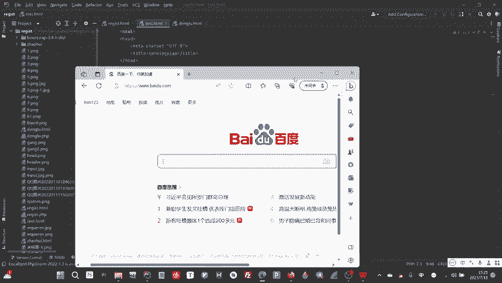

当然大家不推荐大家这么去做，只是给大家举个例子。那那dve标签里面可以写标签，你也可以把这个A放在外面也是可以实现。这里只是给大家举个简单的例子，dve也是可以写标签的。

然后呢呃有人说为什么要写这dap，主要就是一个呃分分别处理，后面会给大家介绍一些dve的一些呃特殊的用法，就是为什么要用dap，而不直接写到里面。啊，接下来继续介绍其他表签啊。

phone标签是一个表单啊，这个东西后面再介绍，暂时先用不到。嗯，大家知道有form表，有form一个标签，它用法有点像deve，但是的话它有一些特殊的属性，然后它的内容里面既可以写文字。

也可以写其他标签就行了。然道还有input标签。input标签就是一个输入框。

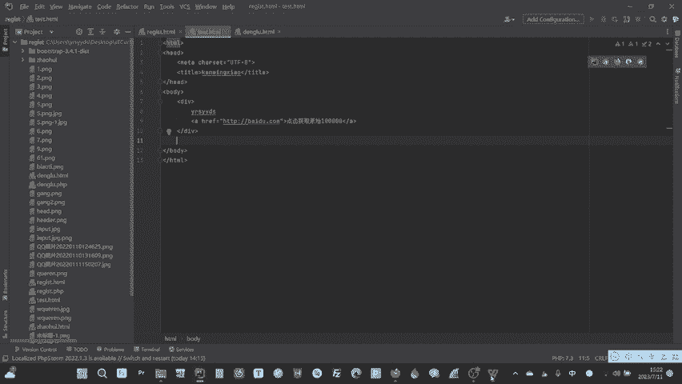

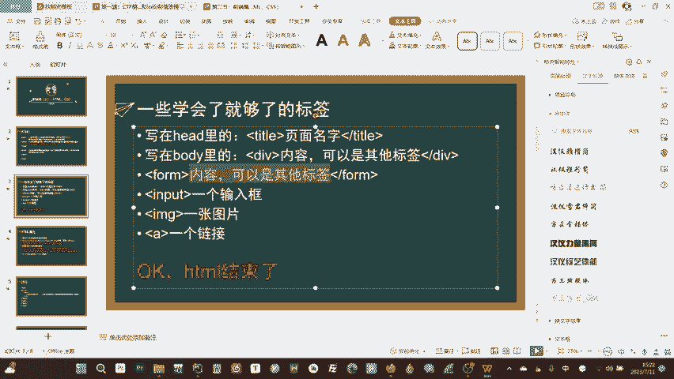

这个win1一用的很多习惯，那个更西。营铺的标签，有时给大家看一看。

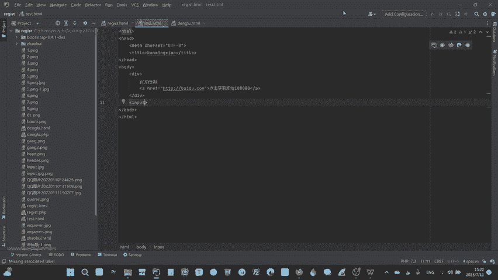

我现在加族人给你铺特别，看没有，大这地方就输入个输输入框，12341345页都可以输入的。然后呢，比如说你想做那些QQ密码呀，或者是让他输入一个账号密码，它就是一个稍微复杂一点的输入框，给它美化的效应。

但是本质上都是这个东西。

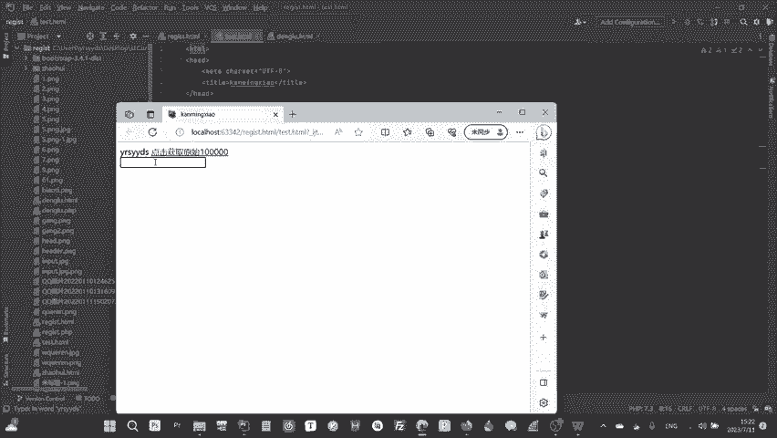

然后image标签就是一张图片。

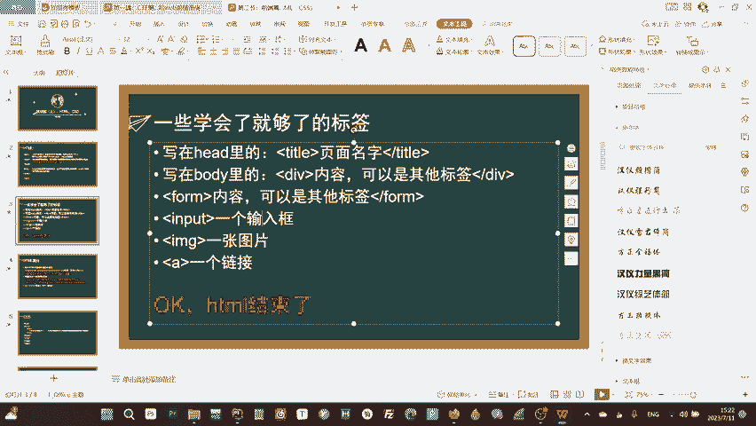

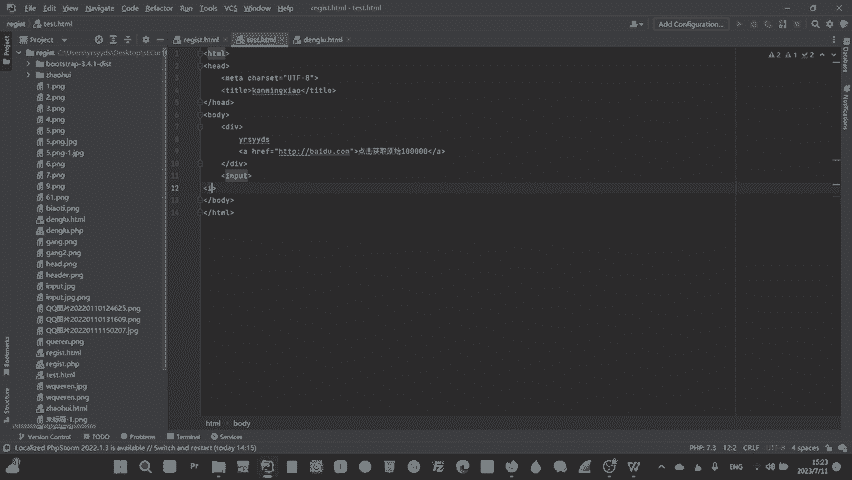

我写个字。里面标签。

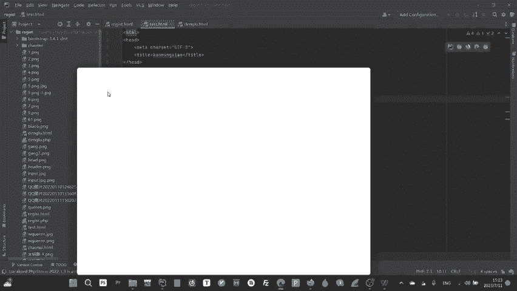

等一下。啊，Eage标签里有一张图片，我现在是不是要给他规定一个图片，显示个什么东西，对吧？我得总告诉你图片在哪儿，或者叫什么名字。然后呢，给大家说一下这个东西啊，呃。

因为我这个HTML是新建在我的这个呃这个项目这个文件里面的，所以说我的HT看大家看到没？这个testHTML所以说它可以用这种直接去告诉他名字的方式能够告诉你它同步度下面的某一张图片。

比如这个2点PNG，他就可以告诉你，就直接告诉你，就他就知道我是从这个里面拿。但是如果说我想访问一个，比如说我C盘里面的什么东西怎么办呢？你就得用绝对地址，这个叫相对地址，相对地址。

就是以呃文件所在的地址为起始去访问绝对地址就是比如说你输入C盘，然后能来拿一个哪个文件夹，比如说呃比如说用户。

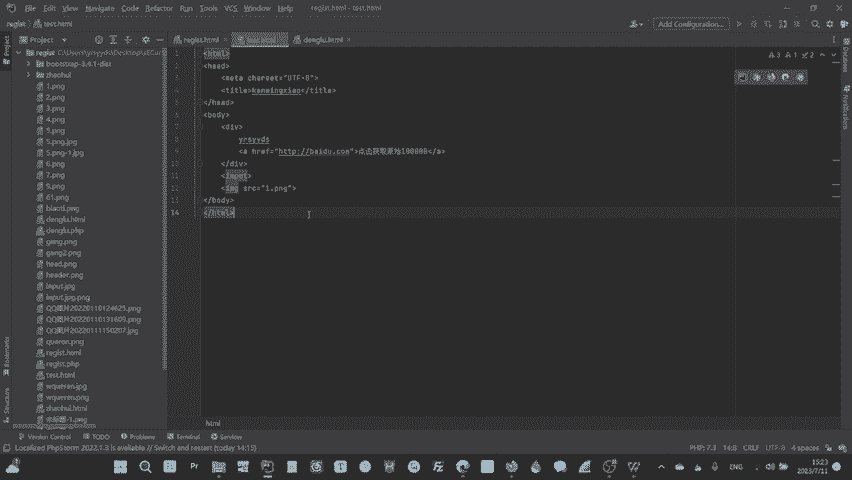

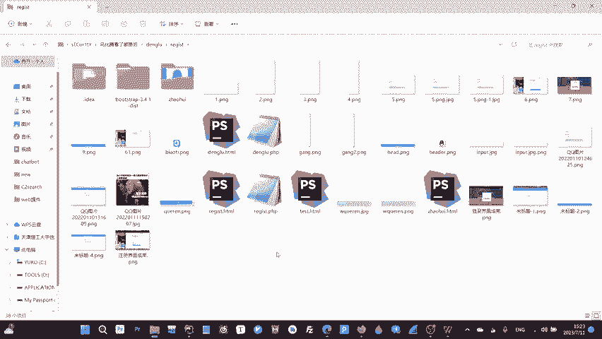

windows，我也不知道有没有在文件夹，windowswindows文件夹下面的什么什么什么什么就得这么说，这就是绝对地址。还有一个就是相对地址。现在我们用相对地址就可以了。啊。

比如说这个QQ图片偏N近，然呢我们现在运行一下，看大家看到没有？就把这张QQ图片给展示出来了。然后呢，这个就是我给大家所呃基本的一些最最最最最常用的HTMA标签。然后呢。

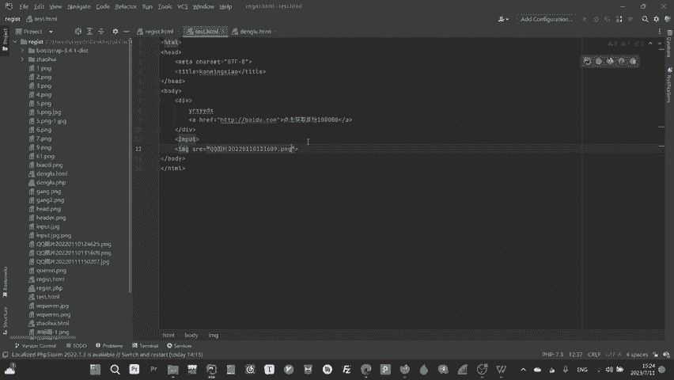

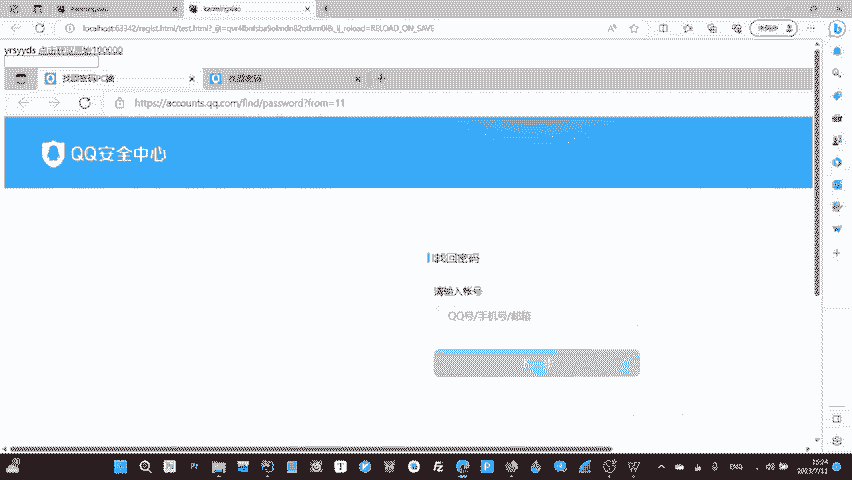

哎说白了，其实这些HTM标签它也我顶够用了，可以给大家做一个简单的示例。大家看到比如说我现在点开这个呃微软的IE的首页。这个是不是就是一个输入框，这个是不是就是一张图片？然后呢。

这些是不是就是很多的链接，然后呢，这些是不是也是链接加上图片，然后呢，这些也是链接加上图片，然后呢，这些也是一个文字。你看你发现你点击很多很多的网页，你都会发现所有的网页基本上就是由链接图片文字。

然后呢把它构成的。所以说理论上来说，我们有链接图片，文字我就可以做99%的的事情基本上都够用了。虽然它做出来可能不太美观，或者说嗯不太细致，但是绝对够用的。大家知道。

所以说我说HTML就学这么多够了安全来说够了。

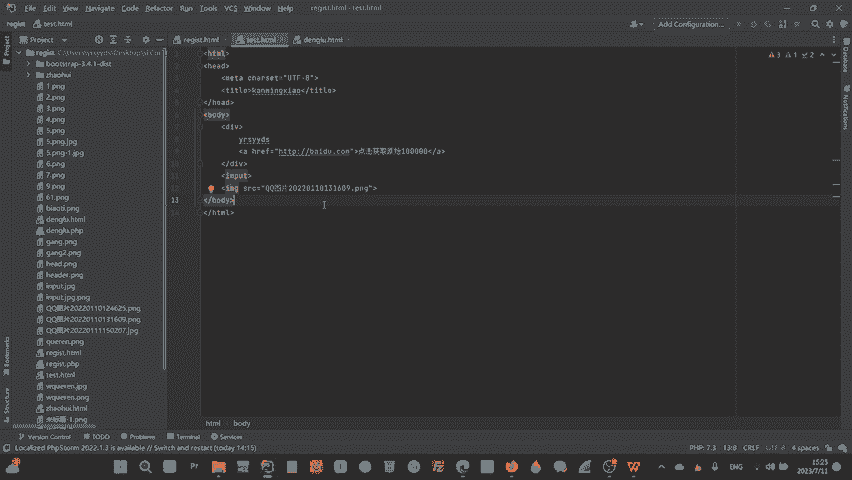

好了，嗯，这里要给大家简单介绍一下HTML的一些属性啊。呃这些属性大家必须要知道，每个HTM有标签都有它自己独特的属性，甚至包括had巴迪或者是呃HTML那个大标签，它也是有属性的。

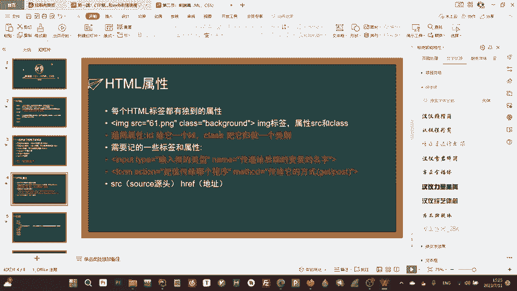

然后呢，MG属性，比如这个呃MG标签啊，它就有一个属性，比如说它就有SRC这个SRC就是sourcece的意思就是源头的意思。源头的意思，很多的这个标签，它都有SRRC标签。你像imagage有。

还有包括呃video啊，还有像什么Patform啊，这些这些标签都有它的SRC就是你得给他一个源头啊，我我我唉我语言我又不是人工智能，我又不知道它从哪加载。然后呢，这个地方后面是跟你一个地址，然后呢。

class标签啊，这种东西要着重给大家介绍一下啊。class标签任何的标标签哦，class属性啊，任何的标签它都可以给它赋予1个class或者是ID属性。呃，class和ID属性它是什么用呢？

它是把它呃给他一个ID值。class就是给它一个类。比如说我有很有3个image标签，我都把它归为class background。然后呢后面你想三个都是它有个共同特点。既然是它有都是一个类别里面。

我能不能改变某一个类别的东西，就可以改变所有的东西。呃，这个就是后面CSS要用到的ID的话，你想1个ID是唯一的那我能不能比如说我现在它竟然是一个classus，但是的话我想单独改变它这一个标签。

那我就用ID去查找它的位置。然那我改变这个ID上面的东西就可以了。那这个大家记住一下就行了。这这这一篇需要知道就是你知道嗯SRC很常用。然后呢，每一个元素都有1个ID和1个classus属性就O。

两ide class可以随便付，然呢需要记住的一些特殊的标签。比如说input标签，input的标签就会给你一个type啊，你看type输入框的类型，比如说你想让它输入的是文字。

就TXT啊TXT你要想让它输入密码，就比如说那个一个点一个点一个点那种，你就让他给它输一个它pa word，就是规定你那个input的类型。然后那那是传递给后端的变量的名字这个东西的话。呃。

给大家简单的说一下，后面学那个后端的时候，大家就懂了？就是看一遍那个代码大家就懂了，这个那样不什么意思啊？比如说我刚刚不是有个一put的输入框嘛，给大家看一下嘛。

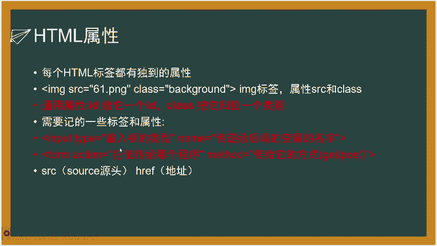

这个输入框你看啊就这个地方是input。呃，input我给他一个type，等于是TEXT。

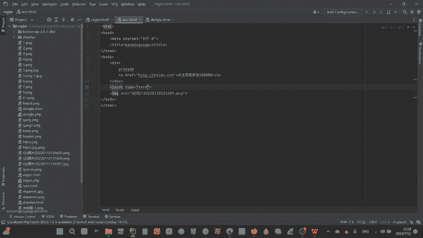

那我输入的就是就在这个地方输框，那它输入的就是呃字符串，123123123。假设我现在有个按钮，点击它把它提交过去之后。哎，假设后面我又写了个程序去接收他这个提交的这个东西。

我怎么知道他提交的东西那么多？假设我有5个输入框，我怎么知道哪个输入框，哪个输入框提交的是哪个，是不是得要有个名字？后端去判断这个变量它是哪一个来的，就是通过这个名字也就这个n。

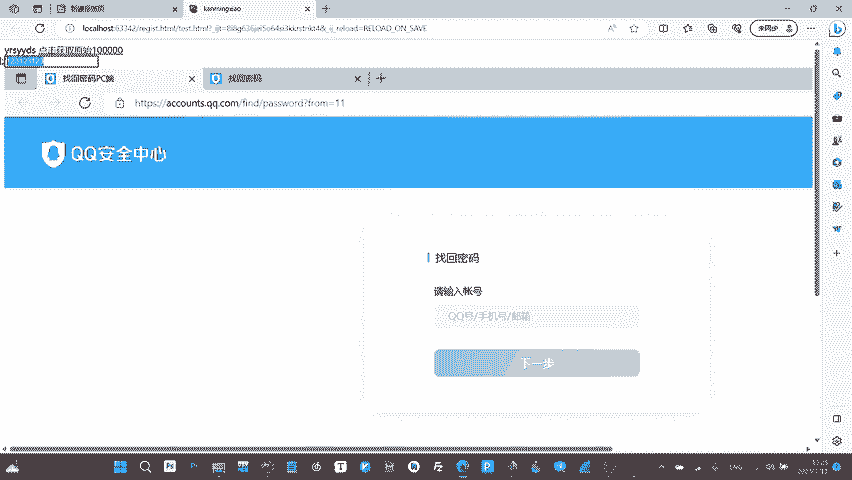

比如说它就相当于船的一个变量。就说漫步等于是。嗯，纳米等于是123，它就相当于传了一个变量的名字。123值是你输入的这个值给后端，大家听起来就懂，理解不了也没关系。后面看到后端就懂了。然后就是这个意思。

然后比如说我现在给它改一个改成。

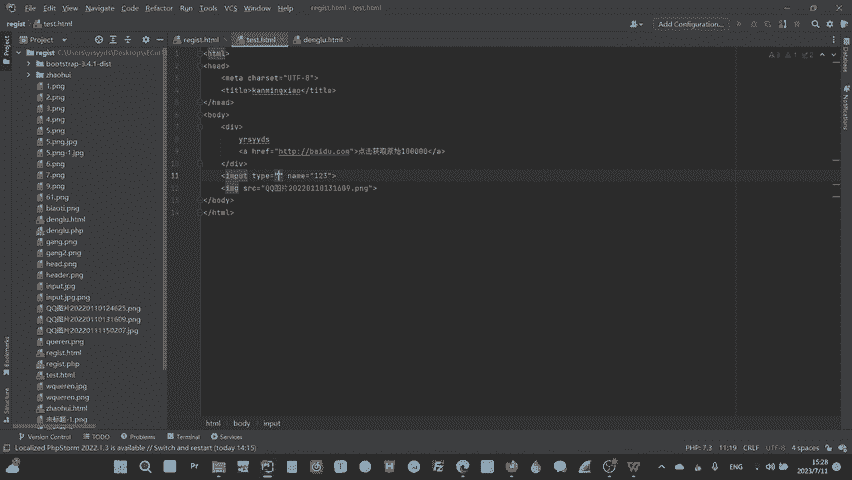

word好，大家看一下有什么区别啊。1231231，它是看是不是变成那个密码框的样子。然后我可以点一下查看密码，就是这个意思。

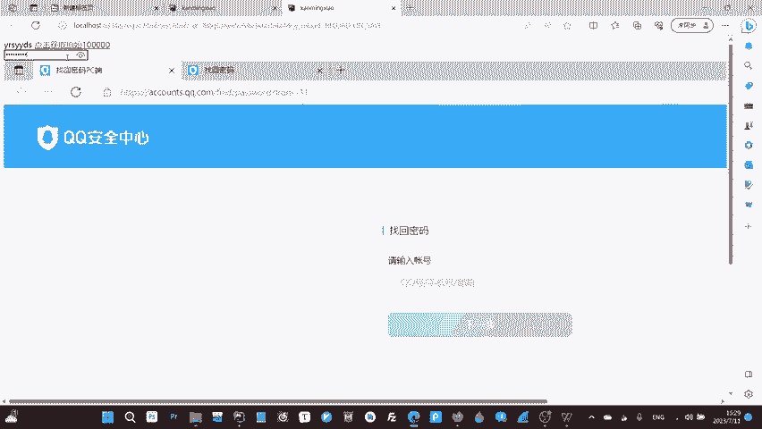

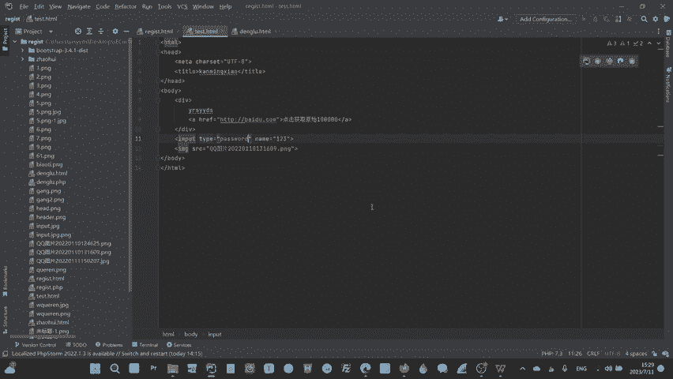

然后呢，还有就是这个form表单，form表单就是它也是一个标签。说白了它后面还有一个闭合，这个我没有写啊，就是大家记得加上那个斜杠form的，还有一个那个东西。但是form的话。

它的这个标签里面有很多属性，它有最重要的两个属性就是有action和这个meer。那action是把这个值传给哪个程序，你想我现在HTM只写那个页面，对吧？我这个页面上用户肯定会交互呗。

我肯定会给他传值。那我传值，我把这个值传给谁，说白了就这个action告诉你比如你传给一个EX传给一个CG或者传给PHP啊，就这个action指箱那个地址，他用法就跟这个一样。

比说把传一个给YYDS点PHP就把它写成YYDS点PHP就行了。事就是给他传的方式。啊，有有两种，一种是get，一种是po，大家不用管这个学后端的时候会给大家系统的。呃，拿一两节课给大家好好的讲一讲。

大你就明白了。大家现在就只需要记住这个input有这两有这两个必要的呃属性form有这两个必要的属性就OK。现在我们也没有用它。然后这地方是简单解析一下SR是源头cras地址的意思。好的，那。

HTML就是到这儿了。然后呢，在这节课讲完的时候，我会整合HTML和CSS带大家看一看项目里面是怎么样去呃做出一个好看的网页出来的。然后这里给大家说一下CSSCSS啊，它是一个呃装饰语言。

它是怎么它是什么意思啊？它就是写在一个，你可以理解为CSS它就是一个标签，就是一个你看这个位置，它是写在哪了hand标签里面有一个style标签，style标签里面就专门用来写这个CSS里面的内容。

然后呢，CSS是装饰它的，这个不用看。然呢CSS怎么写啊，它大概就长这个样子。就是比如说我现在呃给你一个image标签，假设我在吧里里面有个image标签，它的SRC是61点偏NG。

然后它的class是等于是background IDD等于是看病效。然呢现在呃好了，我现在把那光是觉得你看现在我。

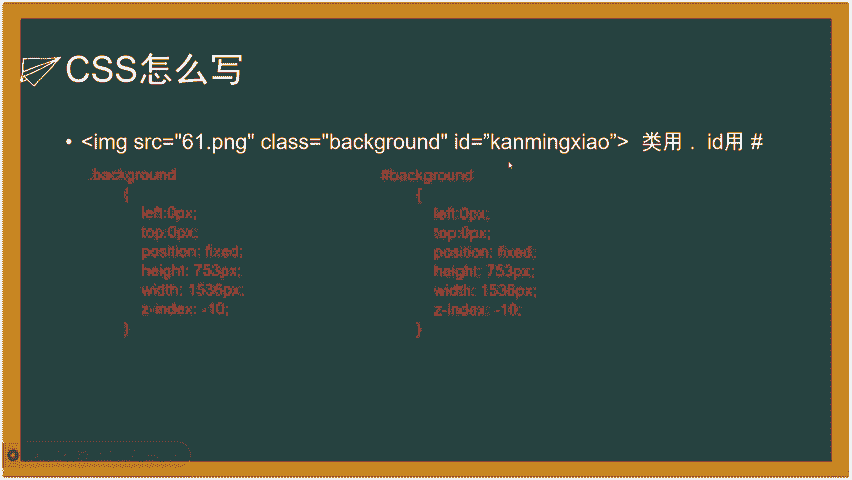

我现在写出来的这样的一个呃网页，它是不是长得非常的丑陋？

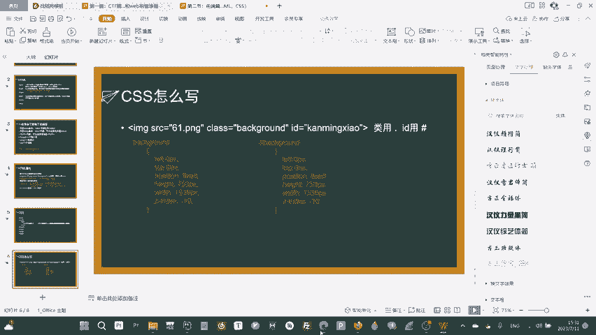

长得非常丑，比如说你看这个图片也是这么大，然后这个也是只有个框框，然后这个就只是一串字，我怎么让它好看一点？我怎么想让他好看一点，大家想想这个思路怎么去实现它。我想让它好看。

是不是我得先用一种语言去专门去写它，用这种语言去专门去写它。这个语言又不知道我要去我要让哪个好看，我是不是得告诉他我在哪去找他。

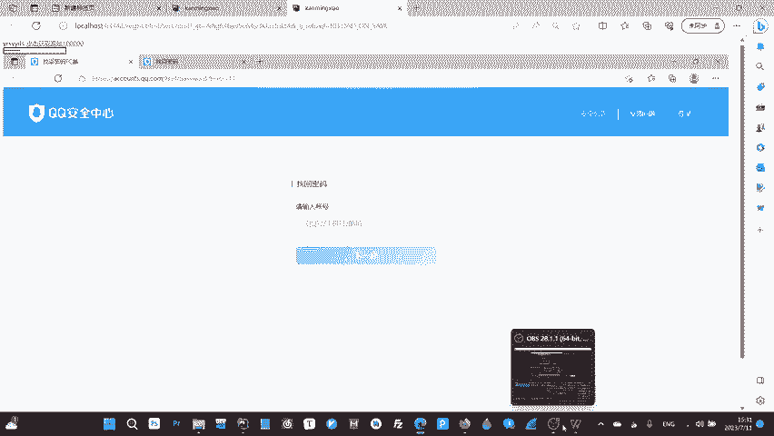

去找他去索引它的方式，就是通过这个class和这个ID属性。比如说我给他定义了一个classbackground。然后呢我在CSS里面。

我想要呃去更改这个background的这个这个这个这个这个标签所这个属性所指向的这个标这一类的标签的值，就在这个里面加个点background。好，下面就是怎么改的这些东西暂时先不用看这一坨。嗯。

大家知道，如果说我要通过类去索引就通过点什么什么那那想用ID去单独去索引，就用这个井号就ok了。点加这个名字就能更改这个标签，或者是井号加这个ID就能更改这个标签。然后呢。再给大家看看啊。

然后我们现在接下来就是首先啊我能找到它了，是不是我还要具体怎么改CSS有特别多的属性。然那每一个标签都有很多固定的属性，这些就是它的固定的属性，说白了你也只需要知道这个固定的属性就ok了。

其他的什么字体颜色啊，透不透明啊，这些东西都是都是都是你需要的是你去百度百度上多得很，你就百度CSS怎么让字变透明，他就告诉你，你就把家具复制粘贴ok结束了。我们现在学CSS看得懂啊。

就是能写一个简单网页，就只需要这几个。呃，那而且很好懂啊，left就是。这我给它单独列出来了，left就是去这我先说这个是没有固定格式的。我把这个nft的top写在最下面。

把这些index写在最上面都没关系啊，都没关系。那那left就是距离左边有多少个啊，多少，这个地方PX的意思是多少像素。

我这个left比如说left的10PX就是距离我整个这个网页最左边10个像素那么多top就是距离顶端多少。那那那统一这个的这个这个默认的是，比如说我现在有一个这个这一段文字。

你这个文字的左上角作为定位点，来来来规定这个left那个top是距离哪哪哪多少呢定位它。然后给大家讲一下这个定位方式啊，这个relative就是相对于它的正常位置，其实它的默认位置去进行一个呃调整。

比如说我加了一个top，那么它就是向下移多少，加一个left呢，就会向左移多少。然后fixed的是相对于整个浏览器框，就是这个浏览器。比如说我在上面加了一个这个图片，然后我把它设置为fix的。

那么无论我怎么样去滑动它，它都不会呃根据因为我改变了它这个浏览器的这个这个这个哪哪个位置而改变一个呃变化。就我想想怎么给你们说，你可以理解为它就是像像你在你的电脑上连了一块儿，连连着一个连了一个贴子。

无论你怎么滑一电脑的贴子都是不动的，就是那个意思。然后呢，absolute的意思就是相对于复元素，比如说复元素是什么意思啊？复元素就是呃比如说我现在给你。

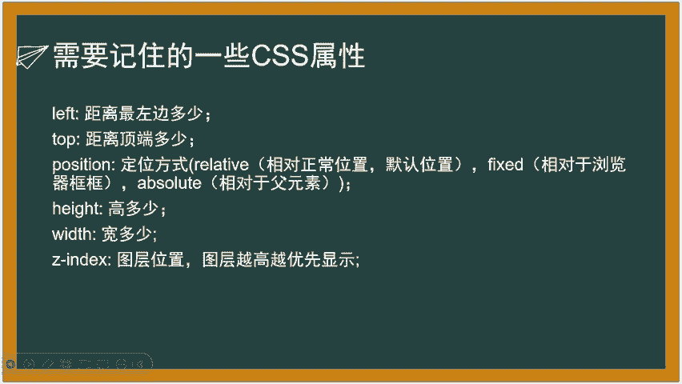

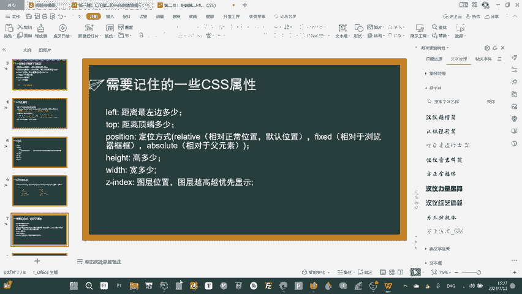

我现在加一个袋。然后呢，这个大ve。它是不是本身有一个位置，它会在某个地方，假设我的dve设这个位置。然后我把这个imagage写在这个里面，那么这个imagage的最近的复元数就这个dve。

它会相对于这个dve的框框在哪去移动我的这个PX，比如向上多少，向左边多少，就是这个意思。ab那。

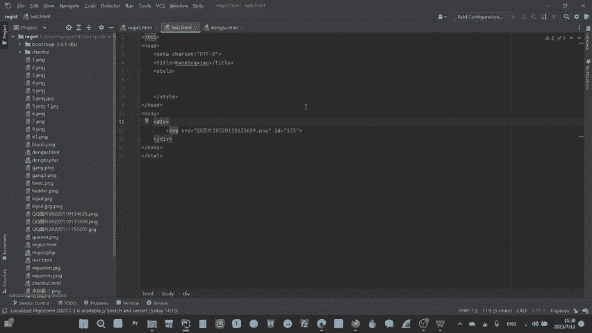

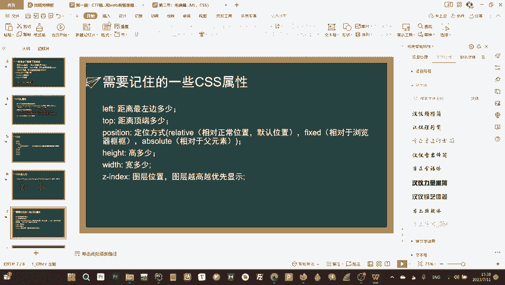

呃，再给大家说一下这个hat就是高多少。比如说我给了一张图片，我把它设置为高20像素，宽宽多少像素，宽30像素。但是它会它这个高宽啊，是根据它这个那个图片本身那个高宽去压缩。

也就是说如果说你人为的去设置太多的那个高太多宽，它就会把它拉的很长，或者是拉的很短。然后这个Z index就是图层位置的意思，图层指它这个数就这个位置，它数越高，它就会越又越优先显示，这个什么意思啊？

它的它的意思就是默认图层位置是0。然后比如说我把Z index设置为-10，然后呢我现在有一张图片，然后呢。后面有它的底下同一个位置，有一张图片为呃-一。那么我在它同时显示的时候。

就会优先让这个零的这个位置的图片去盖住这个-一的位置的图片。你说用户能看到的就是呃我在零这个位置的图片，而不是我在负一的图片，只能说比如说负一图片比较大，我才能看得到出来，它才是它是这个意思。

就是大家做过PS都应该是就是图层的意思。图层的那个值是多少。

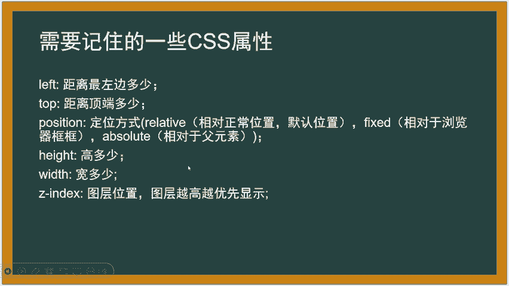

然呢呃给大家简单的演示一下，大家有可能会疑惑啊。

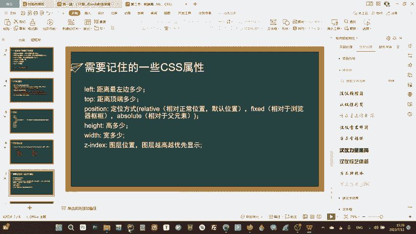

我就问你说的这些东西，我能不能做一个好看的网页出来，当然是肯定可以的。我给大家演示一下，比如说我现在呃这个是我之前刚刚学PHP和HTML的时候的呃一个小项目，就是做了一个复刻那个呃登录界面。

就是腾讯QQ的一个登录界面的。呃，给大家看一看，比如说这个是腾讯QQ的一个注册。呃，大家看了，比如说这个就是另一个这个东西啊，这个东西就是加了一个稍微特殊一点点这个东西，这个东西就是给那个。

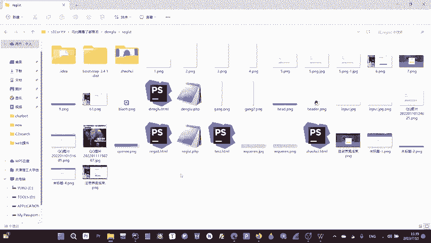

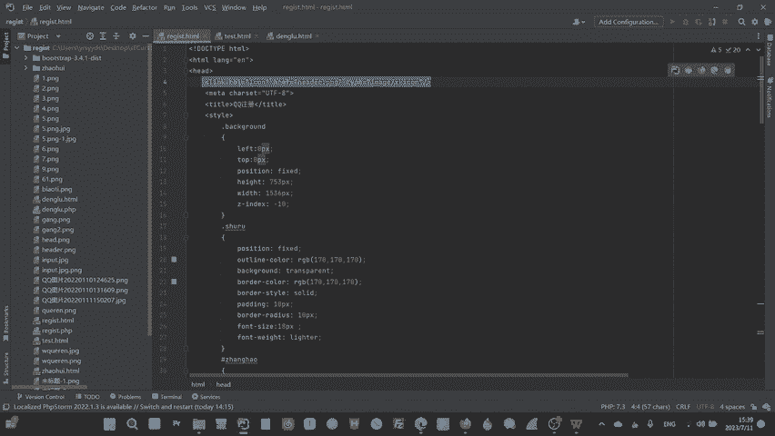

给这个给这个界面，它上面加了一个这个小。小图片儿让它看起来更真实一点。

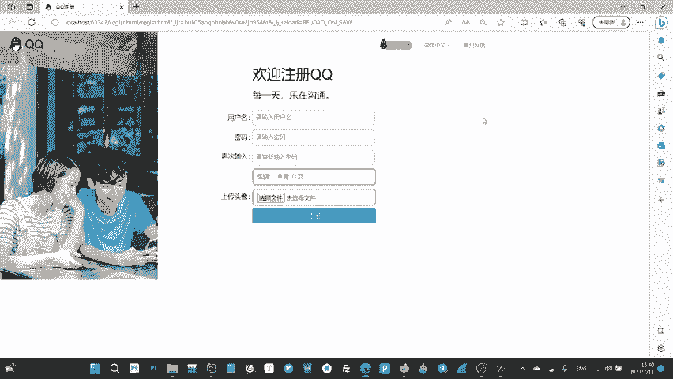

然后呢，大家可以看到都是一些我们刚刚所说的这些基本的一些标签。比如这个是title标签。然后这个是style styleyle标签查的一个背景，背景，让它等于多少高长宽高等于多少。然后呢输入框。

长宽高等于多少。然后那这些叫什么RGB啊，这是什么颜色这些东西，大家去百度一下百度上多的很，比如说我百度怎么去改变那个C怎么改变字体颜色，那那全都有，大就只有需要什么去查什么就行了。后比如这账号长宽高。

你看这些都是长宽高，每一个基本都有长宽高和它的位置是什么。然后这个地方是我们的这个脚本，然后这个地方是javascript的，这个可以不管，这个东西把它删了也没关系。

这个是导入的一个but strip的一个框架。我把它删了，大家也可以看也是没什么区别的。因为我没有用那个框架。当时是要求要用这个。然后呢呃你看我现在写这个dve大ve里面里面框了一张图片。

图片class大家看这些呃属性也是我刚刚给大家说的这个form标签是因为呃要给它传一个参，所以说加了一个form标签，大家可以暂时先不看这个大家记得比如说我要输入个input。

我在里面前面加一个form就行了。然后这个内部标签也很简单，内部标签说白了就加一段字，你也可以不要这个内部标签写，你就把那个内标签删了，然后呢让它直接前面写个用户名。

然后呢input type等于text，然后呢name等于什么什么什么class等于什么什么ID等于什么什么placease hold就是一个特殊的属性。它的属性的意思就是告诉你啊。

就是就是那个灰颜色的字给大家运行一下。

就这个东西就大家就在我没输入之前，它里面有一个提示语，比如说请输入用户名这种好，大家可以看我的这个网页。就是我也是刚刚用我刚刚给你们介绍的那些标签啊，介绍的那些最简单的那种呃CSS或HTML的写法。

写出来的一整个这个网页，是不是虽然麻雀虽小，但是五脏俱全，这个注册是会导入到那个PHP里面就不点它。你看呢你看这地方就是一张图片。这这整个背景是一张图片啊，就是如果说我想让他做好看一点。

我拿出来看大家看这个上面这些用户QQ注册啊，还有这些东西都是一整张大的图片在上面。难道这个地方是设置的一个链接，可以点一下，它会自动跳转。然后呢这个地方就是一些单独的像什么字儿啊，或者是什么男女啊。

这些东西选了之后，然后呢给大家进行一个优化。呃，我想说就是。虽然我们知道很少，但是但并不影响我们去做一个好看的网页出来，这些东西都是呃很。就是就是怎么说啊，就是你你手上现有的资源如何去做一个好看的出来。

那都是可以的。因为它基本上就是这些东西。然后你在网页上去嗯，比如随便新建网页这种网页我按F12，大家也可以去看一下它的这个代码，实际上它也是这些东西。比如这个head这些东西都是都是那些属性啊。

它它这个相当于就是把CSS都一起写你一遍了。然后呢这个8底标签，你看也是什么dve，也是screen啊，这些都是iflam。比如说我现在不知道这iflam if frame是什么意思。

我就去网上去百度if frame是什么意ii frame。FM是什么意思？网上它就有。呃，就是安全就是这个意思，就是我不需要学，因为我要把前端真的要学完，让的把那个呃什么后端学完太太多了。

我真正需要做的实际上就是我拥有一个基本的读这个语言的能力。比如说现在这样，我把它打开看，我知道它大概是讲的什么意思，然后大概是什么什么东西，放到这儿，它大概在哪儿。那我知道它是个什么东西。

然后呢我不懂得，我能去百度百度百把它看懂就行了。安全就只需要你这一点。因为你。1万个人写出来的代码有1万种不同，你不可能每个都去学。大家要明白这个意思。然后呢，今天的前端的课就到这里。然后呢。

大家如果说有什么不懂的话，可以在下面评论区问我。

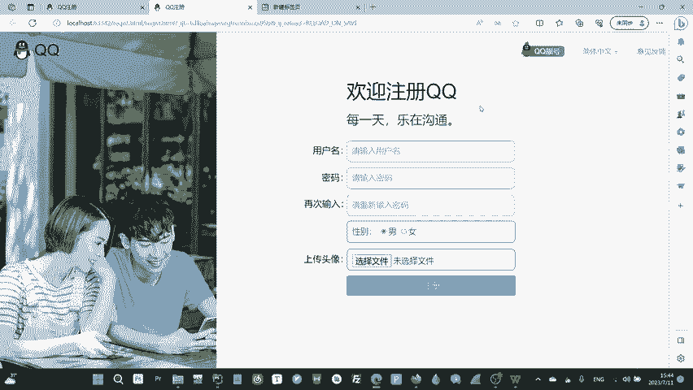

感谢大家收看。