# 0基础WEB安全教学，从开机到拿奖 - P3：第三节 前端篇（下）javascript：动起来，很有精神! - 看名笑 - BV1nW4y1o7T8

hello helllo，大家好，欢迎收看前端片的下半部分。然后在本片中我将会给大家以实用为基准，然后呢去讲一个javascript，带大家去做一些把自己的网页给优化，让它变得动起来，让它变得更好看。

然后呢，首先javascript和java是没有任何关系的，它的本名是dvecr的。当时是那个ra开发java出来之后，它就非常的火。然后呢javascript都为了蹭一个这个java的热度啊。

他就把自己的名字改成了javascript，搞得很多人都以为javascript的是java的一个轻量化的脚本语言。实际上不是，他们俩没有任何的关系。呃，他们俩的关系啊就像是身下滑塞紧一样。

没有没有任何的关系。java毕业的一般都叫做GSGS有很多的框架，它像什么 view这种框架给大家说一下什么东西框架就是指的一个语言。

通过它的底层语言或者它自身去提前写好的很多的函数或者是预好的很多功能。它就可以简便你去开发的一个过程，让你能够开发出更多样，甚至是更呃快的去开发一个东西。它是一个特别简单的一个一个怎么说呢？一个装饰库。

就它里面集成的特别多的专门用来装饰那个网页啊，小程序样的一些功能。后面大家学的之可以去百度一下它就是特别方便，它就像那个这个WPS模板一样，你它就可以让你很方便的就不用去自己做一些什么边框啊，设计啊么。

它就可以设计好只需调就行。呢是一个中国人开发的一个框架。它非常的现在来说非常的火，基本上很多前沿的一些项。都会使用vivo作为一个呃前端的一个开发语言。那后大家像看到那些什么小程序啊。

这些的都是用vivo和vi3开发的。然后大家也可以感兴趣，可以去看一下vivo的一个框架的一个知识，或者是它的一些呃详细的内容。嗯，如果说真的想学前端法，一定是要学view的，一定要是要学view的。

想学前端的话，note GS是一个呃集成好的用javascript来去写后端的一个轻量化的程序。呃，下载note G框架之后。

它就可以让你用javascript跨越前端语言的界限去去写后端的东西去处理一些什么数据包。这些后面的话我们会专门讲一讲node GS因为它是一个呃还算来说比较常用的一个后端的一个呃小插件。

只能说是一个小程序。那它也会存在很多的漏洞，只要有后端就会有漏洞。后面我们在CTF片的时候会专门讲这个框架。大家在学的本节的javascript之后，再看note GS的一些东西就会很简单的。嗯。

java是能够给HTMM元素写点好东西的语言，就是它能够让你的HTM元素动起来，就是HTML它可能给你铺了一个框架，CSS给你加了点肉，加了点骨骼。但是的话javacr才是让你的骨骼动起来的东西。

GS也是前端的精髓，前端必须精通的一个东西，我们不用精通，我们会用就行了。嗯，它写在crmp的标签里面，就像那个CSS写在style标签里面，它写在crscreen标签可以在head，也可以在8底里面。

呃，区别不大，就是谁先加在谁后加载那一个东西。你也可以写很多的cr都没有关系的。好的，那就进入今天的正题啊，揭实的一些杂项啊，有很重要的点。这些杂项啊呃首先我强调一下，就是看本门课程啊。

推荐大家首先呃至少要会一门或者是至少要了解一门编程语言，就比如说C语言或者是python的，你至少得会你知道变量是个什么东西。同时的话你也知道函数是个什么东西。然后呢后面我可能会点一下。

但是不会那么详细的给大家讲，你至少得知道变量，知道函数是什么。同时的话你也得呃你至少得知道if啊Y偶啊，for循环吧这些东西后面我会给大家简单的提一嘴，但是的话不会深度的去讲。

如果说你感觉这些东西很很吃力的话，我说这些东西你连变量都不太知道的话，那我建议你先去菜鸟教程上啊，或者是什么程序员课栈去学一些这种呃C语言啊或者是python这种基础的语言知识。

至少你得会外偶循环if判断语句啊。你才能够来听弄个安全。因为安全必须得先会开发，那是没办法的绕不过去的坎。呃，首先啊GS它GS啊，它对于如果大家学过C语言啊，那就会知道C语言啊，它是一个很它这个语言啊。

它你要定义一个变量出来，你要用一个东西去存一个数据，你就必须得。呃，比如说我申请我想用一个东一个一个变量去存一个字符，我就得用char，我要去整一个整数，我就得用int。但是javascreen不一样。

它不需要声明类型。javaqui里面甚至很少有类型的一个操作。呃，你什么变量你都可以用va对就相当于这个通用类型，你可以理解ve variety就是一个通用类型。呃，什么都可以存，它可以纯字符。

也可以存数字，也可以存什么什么什么什么什么纯字符啊，纯数字，纯字符串都可以。那它甚至还可以存布尔值都是可以的。比如说布尔值就是fors或者是 true那些，也就是所谓的零和一呃，给大家提一嘴。

大家可以去了解一下布尔变量。布尔变就是就是是或者否说白了。嗯，然后呢，这是第一个javascreen定义变论就Y什么什么等于什么什么，就是这个意思，你就把它简成成超级C语言就行了。然后呢。

ccl log就是在呃控制台打印出来一段话，控制台是什么东西啊，大家可能还不太清楚控制台是什么。我给大家简单说一下控制台啊，任何一个网浏览器它都给你提供了一个这个东西。

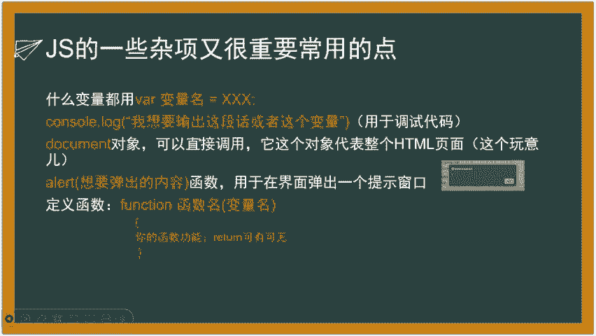

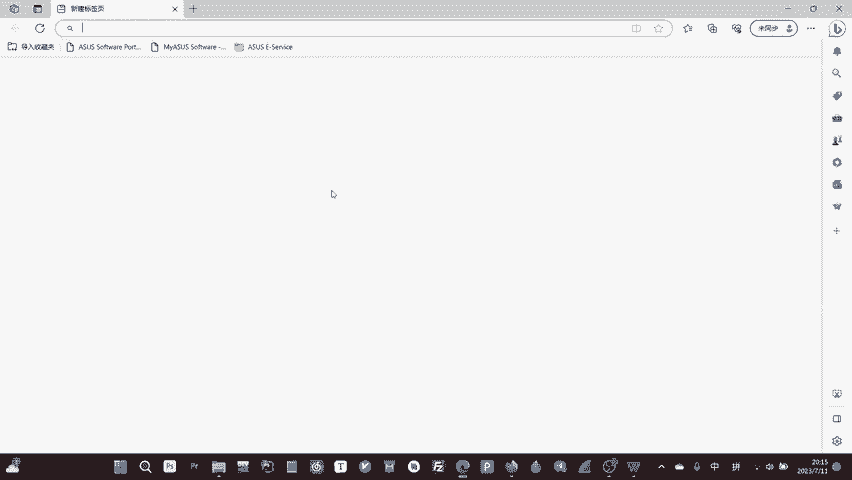

嗯，就这一块儿。这个东西这个就是控制台，你按F12就可以在一个网页里面，按F12就可以看到这个网页的控制台。它上面有这个网页的报错啊，提醒信息啊，警告这些东西。你也可以在这个里面这个控制台所使用的代码。

就是javascript，你也可以在里面写一个呃java。比如比如说我给大家打一个ortor就会弹出一个窗口，然后里面弹出的是它要执行的东西。我们。哦，打错了。看这我刚使用我ner一。

它就打印出来了一个一出来，就是它使用的就javascriptme代码。但家如果说没有呃javascript编辑器，这些你都可以在这个里面去尝试都是可以的。然后呢，这个就是控制来按F12就可以看得到。

你们看得到整个这个代码的一个呃所有的元素啊，HTM文件啊，还有它javascript文件都会在这个里面存着有。然后呢。嗯，继续我们刚才讲的，嗯。

这个是cl logcil log的就是它可以在那个就在这个里面刚讲了半天，没给大家没给大家看看明白。

这个就是这个就是conl log consolecl这个就是控制台，我使用ccl log。等下。然后呢，我比如说我打123，它就可以在我的控制台里面输出123。呃。

如果说比如说我在代码里面写一个concl log123，它就会在代码里面在运行之后，你让F12打开这个控制台，也会在这个里面看那个123被打印出来。它这个意思就是打印在控制台里面打印日志。

日志内容为这个东西。就是里面你可以打字符串，也可以打数字啊，都可以，没有关系的，你可以打变量啊，用来调。这个主要是用来调试你代码里面的一些变量。比如出了什么事情啊，你不知道错在哪儿啊这种东西的。呃。

它是这个我知道这个东西就行了，很常用。然后呢，我们继续啊。嗯，这里给大家说一下这个document对象，document的对象就是说白了它就是一个你把它当成一个大变量，一个超级大变量。

就是你任何HTML在呃浏览器运行成功之后，它都会存在一个document对象。这个对象就是一个变量。那它这个对象呢，它有很多的内置的方法啊，它这个对象它代表了整个HTML页面。

说白了什么HTML就这一坨就整个这个东西，无论它上面的属性啊，还是它上面的这些什么链接啊，还是它的什么图片啊，它都被集成在了这个document的对象里面。

就是你可以通过document的对象调用任何这个上面的东西。理论上来说。然后document对象是可以直接调用的，不需要直接声明，难道它是window对象的windows就是浏览器窗口。

window对象的一个呃方法。但是的话这个东西不需要强调，大家是只知道document对象就okK了。呃，window对象这个东西不需要深究。如果你不学前段的话，只需安全，我们只奔着试用去啊。

我们不不去细究什么什么东西，它到底什么来的，那就太多了。那看那学无止境的就。那当还有一个很重要的就是这个aleralert就是里面中间加一个弹出的内容，就是刚我给大家看的，就这个弹它会在里面弹出个窗口。

然后这个东西也是用来调试，后是用来做一些提示的。然后呢，最后一个也是最重要的，就是javaquiimp怎么定义函数，定义函数的方法就是先写一个functionction。比如说。

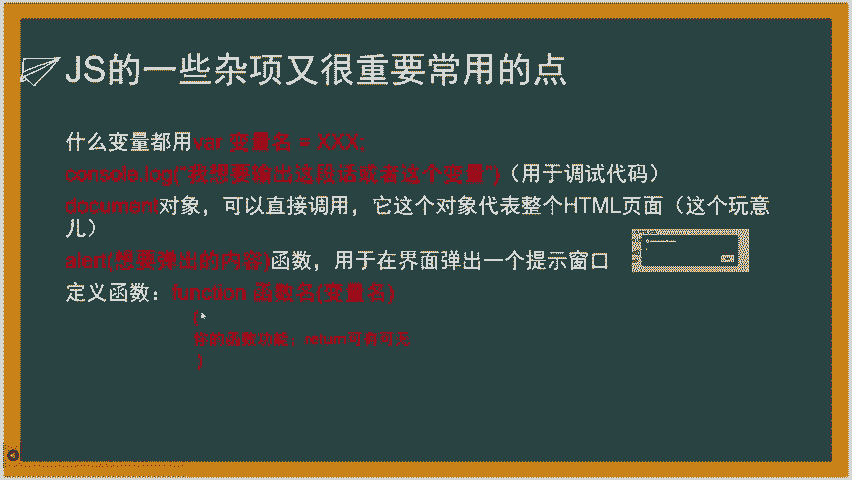

呃，我在这个script里面给大家写这个框这个控制台给大家写一个。呃，首先我定一个functionction。functionction，然呢function就是声明我现在定义个函数。

然后呢你不需要声明它返回值，大家就会觉得和C语言不同，声语言必须要声明返回值，对吧？返回值的类型它不需要，因为它的它的返回值就是你想返回就返回，不返回也可以。因为它没有固定的类型，我就省去了这一步。

我就只需要写个function，然呢既然还是名字就行了。比如说这个函数名字叫做YYDS，然后呢给随便给他一个变量，叫做evenent。啊。You问。变量名叫evenent啊，大家又会看这个参数里面。

这个参变量啊，它为什么没有这个类型啊？因为还是我刚刚说的，它它都没有类型去区分它，你为什么还要加呢？我不直接给他个名字就okK了。我想写两个变量，那就行，比如说么evenvent，你问二就行了。

就是你直接就告诉他里面有一个，因为你外面在传参的时候传进来，它就会被付给这个参变量呃。就这个意思。难道我现在给了个大框号，你也可以把大括号弹词说尽啊，只不过这里我没有没有写，没有单独弹词书尽啊。呃。

现在我定义一个方块形，对吧？然后我方块形里面写我的东西，比如说我定义了Y申请的变量，A等于是。A等于1，然后呢同时的话呃再申请一个变量，B等于2，这个就是申请变量变给变量负值。然后呢我再计算一个。

我在conl。ccl点log。考试点log输出的少，输出A加B的值。嗯，输出A加B的值。这个时候。然后再给它加一个啊，然后确定现在它就已经定义好了。然后这时候我在调用YYDS啊，随便随不用传。

因为它没有没有变好，看没有，它这地方就打印出来了，调用这个函数。因为我没有不需要没有用这个参数，我写个随便写个参数，我也可以不给他传呗，不给他传上就空的，也不影响它也不会报错。

然后它这地方就被打印出来的。我的这个控制台里面打印出来的A加B看就这个3，就这个意思，大家可以在这个里面去店点你的javascreen代码，或者你也在PHP storm上也可以去写这个都是没有关系的。

呃。继续啊，我这个地方我把那个PHP storm打开，这就是定义一个函数。这个函数很重要，大家一定要会这个。因为你加个代码，你总得自己去想办法去写那种啊，比如说让它渐变啊，让它变成透明的，点一下。

就是这种你得自己去定义自己的函数。

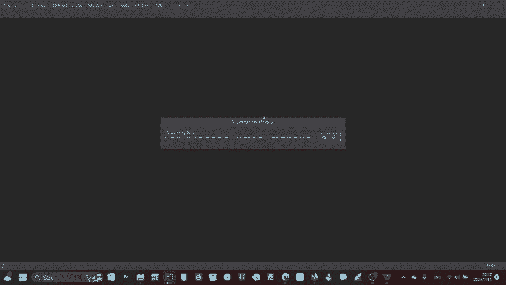

然呢接下来讲一个java扩部最最最最重要的一个核心的一个地方就是动术。动不什么东西，动不，你看他这个DOM这个写的那么高级啊。

实际上他说白了就是他告诉javame怎么去找到他java想操作的HTML元素呃什么意思啊？就是比如说我们说java是用来操作的HTML那些什put那些标签的吧，操作L标签的。我今天要操作它。

我怎么知道我那个那个那语言，我怎么知道我要操作的是哪一个，我是操作image标签，还是操作input标签，对吧？我肯定他有一个方法去找的哈？也就是我们之前所说的他的大家看比如说这有个标签image标签。

它里面有个变有个这个标签名image，是不是它有一个class它有个ID。我是不是我要想单独找个标签，我可以用ID去找他，也可以用class去找他，也可以用imagage这个名字去找他。

但是的话大家也应该知道，我要这么，如果说我用这个去找他，或者用class去找它会出现就是很多个这种标签都用同一个class或者是image这个名字，那就会出错。

所以说我给一般ID的给它定义一个独特的ID比如说给他定义的这个位字叫看名校，可能挡住啊。然后我就可以用这个ID去找它。然后这个地方就是比如说我javame里面，我想找到一个这个呃元素。

并且把它付给一个变量，付给一个变量eleement，让它后面我去对这个变量进行操作的时就方便用就行。就这么写首定义一个变量变名字叫为值复值什么呢？

首先这个get element变量啊就是我要想获取这个变量的元素啊，它肯定是在doment document因为是整个的所有的素肯定在do里所以说我我要想找到这个这个元素它在哪。

但我肯定得在do里面找你们就这么理解就继承就这么记通个英文就是通获取元素，通过的方式的名字叫做开好我获取到这个元素一坨这个标签我就把它给变量下面这个一样的就是直。通过了class time。

就通过这个类名啊去获取它。当然后面肯定就加个大括号哦，加个小括号，然那里面就是这个background就获取到它。那呢。有很多那个java的获取呃元素的方法，这里都给他写出来了。通过ID啊，通过类名啊。

通过它的名称啊，或者是通过它的名字，或者是通过它的那个标签的名字，或者标签的nameN都可以获取到它。嗯，这些东西都是后面查的就是就自己查就行。基本上能用的就是ID和class大家记住这两个就行。

就是大家。其实大家不需要背啊，大家留个印象，就是javaque，我要获取这个变量，用什么来获取啊？document来获取。OK结束了，doment来获取这个变量，通过get byD这样的一坨形式。好。

然后呢，现在我获取到了这个变量之后，呃，我是不获取到这个元素之后，把这个元素存到变量里面，我是不是要去更改它啊？想现在我想要去更改它。比如说我现在一开始我加载出来的那个。啊。

比如你看一开始我的image标签里面，它的SRC它的源头啊，图片源是61点PN我想通过java比如说延时个3秒钟。

我就把它的这个图片的源头换成另外一个PN也就是比如说YYDN这个图片我就直接元素点SRC也就是点它的属性名就可以直接更改，直接复制，非常方便。呃，你像这些什么class什么I啊，这些属性。

它都是可以改改的。我跟你说就是它什么SRC，还是它的什么type啊，还是这些东西都可以改。你就把它的属性当成一个这个元素，也是它这它是个对象。

它这个对象把这个这个对象或者变量的一个方法就点这个属性名的意思就可以直接更改。那其他的就一样没什么区别。这另外一个大写，通过名称点属性名的方式就可以直接修改它啊。大家想想啊，如果说我现在可以修改它。

是不是我就可以用一个呃操作。比如说我定义一个函数。就放个选呃放个选函数名括号，括号没有都行。然然大括号里面是我的函数，这个函数的目标是呃，当我去点击的。那个比如说我点击的页面，然后呢。

一旦检测到它点击等个10秒钟，实力捕十，然后呢就把eleement这个图片的源头换成YYDS点评级。大家脑补一下这个过程。当现在有个网页上面有一张图片，我点一下这个网页等3秒钟之后。

它这个网页的这个图片就自动变成了它是不是就可以通过java去实现的这样一个动态的过程啊。动数就掌握这么多，大家去想象一下，马上我就会给大家讲啊，后面也会给大家做一个实践。啊，首先啊咱们刚刚既然说到了。

你看就像这种元素，就是比如说这一个HTM元素里面有一个方法，就是我可以通过这样的方法去改它的属性。那它是不是还有一些特殊的这种属性或者是方法能够让我做达到一些特殊的操作啊。啊。

这里就是要给大家讲一些JS类的元素的一些呃常用的方法。比如说假设存在一个元素叫做啊存在一个元素，你不是说存在元素吗，存在一个标签，这个标签就是个dve标签，就分区ve标签。

它的ID等于是KMX然呢这个ve标签和它的尾标B和标签，就中间这个尾标签之间加了一串数字，114514这114514呢正常来说我直接写了HTM它就会直接在网页上显示一串这个数字，对吧？

现在有一个这个标签。好，我是不是能够通过刚刚说的 elementement等于是就是新建一个eleement变量，等于是doment从document里面获取一个元素通过ID的方式MX就把它获取给它了。

好，现在我的目标是想要更改这个dve中间这一块，就这块夹着这个两半夹着中间这一块字，这个属性是什么？这个属性就是一个特就是ML。就是可以这个婴儿聚间物等于什么什么什么什么。

比如说这一坨我它就会当你运行的时候，你就会发现这个里面的字儿变成了它。说白了就是它会这网易才会展示出来一个这个字新的这个字儿。而且这个英HTM它有一个很牛逼的工，它不仅可以把内部。

比如说dvedve它内部它不仅可以写过支付串的版，我是不是还可以写呃什么form标签啊，写A标签啊，什么标签我都可以写，对吧？嗯，这个英HTM，它不仅可以改变内部的文字，它还可以向里面加入标签。😊。

它可以向里面加入标签，这样的话我就可以实现。比如说我当我点击一个东西，然后呃把这个里面的这串字变成一个广告。就像里面加入一坨呃新的HTML标签进去，就这样。

你看 element点然后呢现在我现接下刚刚说的那个点击那个功能啊，点击那个功能有什么说？你想想这个点击啊是不是任何一个元素，我都可以任何1个HM标签，我都可以给它单独定义一个这个啊这个点击之后的。

是干嘛的，它是不是就像是一个固有的属性连在那个元素上面的，那么我就猜这个unclelink就这个点击啊，unclelink英文就就是点击的意思。😊，它就是个属性ele点unclelink就等好。

既然这个uncle它不可能等于一等于2呗，不可能是这么的那它uncle link之后肯定是一个动态的一个流程。这个流程我怎么去实现呢？是不是我就可以给它赋值一个把这个cle这个方法。

就是un link之后干嘛等于一个函数，这个函数就可以自定义了，你可以直接比如说ele点的 function然后括号，然呢啊你可以不用这个这个al这个function可以不用加函数呢。

直接就function括号，然呢大括号里面写就行了。或者说你在外面单独定义一个function呃，function名，然后呢等于什么什么。

然后呢你在这个地方eleement点等于unclelink等于是那个函数名也可以都是可以的，就是你用自己定义的，或者是你限定义一个函数去设置一个元素的，获取到这个元素的点击之后的方法。😊。

待会会给大家做一个呃简单的de门的控制台，给大家做一个简单的一个示范，大家就懂了。on一 on change什么意思吧？就是当它改变的时候，什么叫改变的时候啊，比如说我现在有个输入框。

这个输入框里面把它啥都没有，突然我给它输了一个一，它是不是就把改变？它是不是改变它改变了，那就有一个方。比如说给它弹出一个把它把它变成大写啊。比如说我现在输入的全部ABC都是小写。好。

我给它定义一个函数。一旦我输入的这个东西是小写，我就把它变成大写，是不是我就实现了一个现个方来实现它就这这种方法比点击之这就叫事件说白它就是一个事件的监听了。

事件的监听它就是一个监听某一个事件像这种可以监听的事还有很多，大家可以自己去百度你需要比如我现在想要鼠标移到上面的时候我就来你就百度鼠标移到上面的时候，事件java监听方法它就有就给你说你点就行。

我只给大家做一个简单的教大家怎么去看va代码。比如说啊mo over就是鼠标移走就会出现一个，比如弹一个弹窗啊，这个是划过，一旦碰到它，它就会滑弹出一个滑那个弹窗。mo out就是一出去。

比如说现在本来在这个里面。然后现在我移出去，它就有一个弹窗啊，resize就比如说我拉动这个这个大小，它就会有一个弹窗这种东西哦，弹窗只是我自己定义的函数啊。

不是说它什么啊它什么它什么什么什么什么东西啊，这些东西都是相当于你重载了一个它的函数，你可以自己定义，你也可以有预先的，比如什么or就预先的函数，你也可以cl log等于一也可以都可以。

就反正就是你后面必须得跟一函数。好呃，既然它可以改变元素，那我是不是。除了改变HTML直接改变HTM以外，我是不是还可以改变它的CSS你想啊我们上一节说到的啊一个HTML元素。

它是不是任何HTML元素我都可以给它加一个CSS的方法加一个SS的一个比如说给它加一个高啊，加一个宽等于多少那既然va可以改变HTML元素的属性啊这那么是不是也可以改变这个HTML元素对应的CSS属性。

好，改变CSS属性的方法就是eleement点style点CSS就这个意思比如说比如说假设这个这个我现在之前我现在比如说我它有一个S属性，它它的top距离它顶端有10好。

那么eleement点就这个元素啊获取到这个元素eleement点tyletop等于2X就把之前那个本身CSS里面设置的。使距离顶端10PX改成了20PX嘛，就是这样的一个过程，大家看一下就嗯懂就行了。

反正CS的属性名单不就是一个一个改嘛，它有top，那就改成top，有has就改成has有Y就改成Y嘛，改成新的值OK就这个意思。嗯，大家看一看就是这些，其实就核心的就是这些，其他的也。

你想其他的东西要么就是光速就能把度得到，要么就是。你用不到的就两种。其实你想你平常你平常你在逛网页的时候，你你你有什么机会能够能够我我我拉动它，我还改变它，我还一出去一回呢，他都给你来些花里胡哨的东西。

没有真正实际上平常网页你能用到的就是一个点击它或者是当它改变的时候。😡，就这两个东西，大家待会儿我给大家做一个实验，大就会发现实际上这种东西已经超级全能的，已经够用了。

那么最后啊给大家讲一个javascreen衍生出来的一个特别重要的一个东西，就是jason。这个东西就涉及到安全的这个东西，这个东西就安全里面很常用，包括你平常开发也会常用。

你后面学python的时候也会遇到这个东西啊。jason啊，它说白了就是一坨，就是一坨数据啊，就是这个就是jason。这一坨就是一个几一个典型的一个jason的字符串。啊，首先这个jason啊。

它的名字叫做size。size名字叫做sizejason这里面把它分成了三个部分，第一个部分有两个变量，这个是变量的名字叫lum。那就是run，然它点的la的name就run。

然那第二个部分就是URLURL内容就是3W这个。然后你看第二个la就是第二个部分的name就是google。然后它URL就是这个这个这个那现在我把它呃比如说我现在定义了个字符串。

我现在给大家展示一下它这个javascriptme怎么用。后面右边这个就是它怎么javascript，怎么去利用这个jason啊呃。好的，我也给大家讲一下这个代码，怎么去使用这个阶省对象了。

首先我定义的一个text变量，text变量。然后呢，我这个位置看到没有这个答引号是一个字符串的意思。我先弄一个这个字符串。然后这个加号就是在javaqui里面，把字符串拼在一起的意思。

就是把左边那个跟右边那个接在一起。好，现在这是一个字符串，是它然后再加上一个这个到这儿是一个字符串。当加上它再加它再加它是不是就拼出了这样的一个jason的一个这一坨，对吧？

然后呢我再用后面的这个很重要的这个函数jason点f它这个函数啊，它就可以让这个tex的这个son把它变成一个对象，也就说object好，现在有这个object的对象之后。

比如说从另外一个程序传了一个jason过来。然后我现在解析这个jason把它等于是tex，然后再把它解析成了一个对象，我是不是就可以利用它传过来这个对象，这个就是jason的妙。

就是它可以让程序之间传对象这个沟通方式变得非常的简单非常的容易实现。只需要通过改变字符串的值就可以了。然后这个地方就是啊这个地方就就是假这个地方是假设有一个变量的ID叫做demo让里面的值等于是。啊。

给大家解读一下这一坨什么意思啊。OBJ这个对象的site。的第一个。就这一坨。的烂的值runload笔加上。object the site的第一块的URL的值，把这两个字符串。

就是他们两个这个值给拼起来。也就是说这个这一块的结果就是run over然后马上接3W点runob点com就这个意思啊，这就jason的一个基本的用法。就是首先你要获取jason。

然后把它作为一整个字符串传进去，然后再解析jason点fance解析出来，然后就可以直接当对象用，就这个意思。呃，我们来实践一下啊。

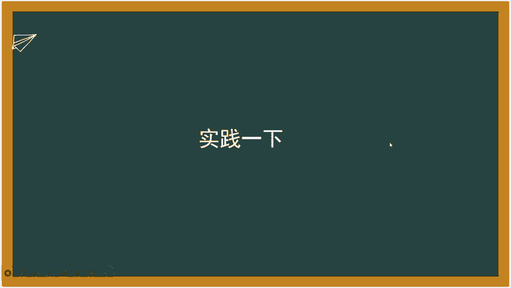

嗯，大家可以看到我的这个。

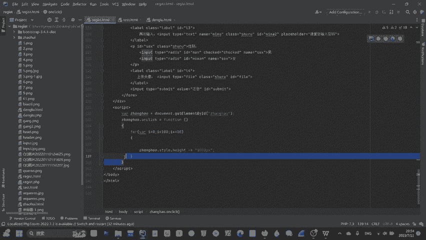

就是这是我之前看写的这个代码。

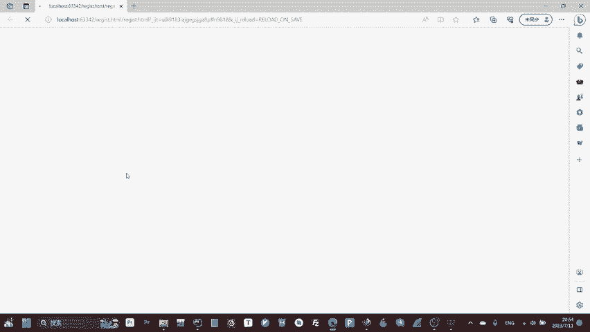

啊，不是简代码，写那个HTM页面，它是不是里面很多的元素啊，它元素里面有很多的ID然后我现在想要给它加一点美化，就比如说去呃加一点点动态效果啊，动态检测呀。嗯，我首先在8底看出来。

这是在8底标签里面写加入一个javascript的一个标签，就是screen。好，就是加入screen标签之后，我就可以在screen标签里面写我的javascreen代码。嗯。

首先啊比如说我现在想要改变这个这个这个账号，就这个用户名啊，这个输入框的嗯对它进行一些操作。首先我是不是要呃ve定一个变量eleement。eleement等于是什么呢？等于是document。

从document里面获取一个get element by IDD获取1个ID为账号的。元素好，现在我获取了，它就被存在element里面了。好，现在我要给这个账号这个文本这个输入框啊。

给它加入一个点击事件，让它能够呃在我点击它之后，能够弹出一个警告框警我看里面内容为一，怎么实现呢？Ament。点是不是它的uncle点击之后的方法等于是好。

这个地方我因为我想要写一个临时的一个定一个临时的函数，用于专门去实现这个adimateuning方法。这个临时函数只属于它，那么就用方，就不需要写变量名呢，直接加这个就行了。因为你的变量。

你又不用在其他的地方，你为什么要给它个名字，你还不如就告诉他怎么用就行了。好，比如说呃给他把多钱一。

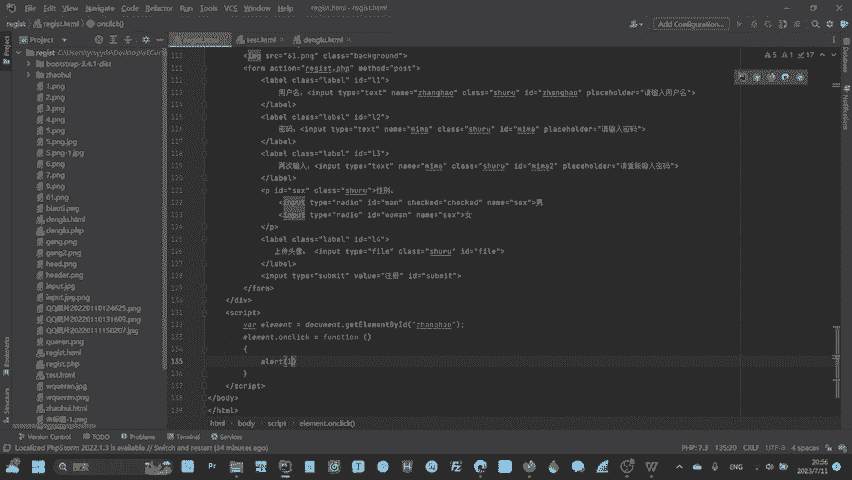

ro一好，现在看一下，现在这是就这个输入框。当我点击它的时候，看是不是就弹着一个这个一这个警示框出来了。就是我刚这个oralor alert一好，现在我是不是想还想做一些其他的操作。

比如说我想让刚刚示范一下刚才的那个。

呃，让它从点击一下，假设我现在想实现稍就当它点击一下的时候，它的距离顶端的距离变成只有一怎么办呢？是不是它那个距离顶端距离是t，就是style里面的属性，那么就要改变它的CSS属性，有什么al。点。

改变CSS的属性是style，然后呢点top等于是多少呢？等于EPX就距离顶端。霍属性距离顶端只有一项素的距离。当我点击它之后，它就会变成那样。好，现在是这样正常的第二项素。

它是不是变成距离顶端只有一像素啊，就这个过程。那那如果说你比如说想做一什么动效啊，你就可以比如说什么for尔，然后呢啊YI等于G，就是定义一个这个就是定一个临时变量用于for尔函数啊，负尔函数就是循环。

大家学过C语言，应该都都至少能明白，对吧？I小于100，然后呢I加加。

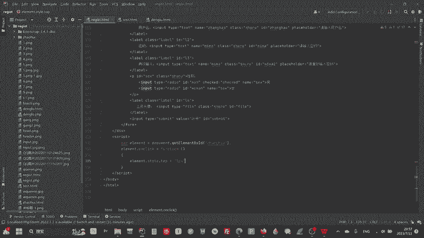

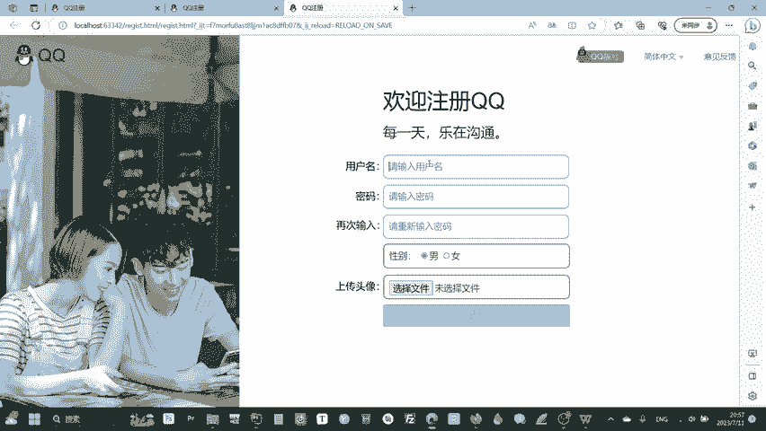

然楠然楠就18 elementement旁边。animatement点style点top。等于是。等于是减等于减等于意思就是说它等于它减去某个值，就是后面这个值就是比如说减去一个I好。

它就会逐渐的当你点击之后。回到上面减100变成减100那个操作。好的，那java screen就是这样，就是大家去利用的时候就是呃用这样的一个格式，我再给他写一个这个格式啊。

比如说我想定一个函数function，然后呢我想给他加一个名字，就比如说click，然后呢就等于是啊，不是什么click，然呢里边有个参数，有参数就写有参数，比如说我随便加一个evenent参数。

这个evenent不是固定的，随便随便什么名字，随便什么参数都可以啊，就是我刚刚说的没有类型啊，因为它然后呢比如说A等于一，然后呢B等于是2，然后呢C等于是呃A加B，然后呢，conl。点look。

那那C那那他就会一旦然道我在这个位置再调用它。呃Click。第二趟。它一旦运行之后，它执行到这儿，它就会运行这个。它就会运行这个这个函数。然后呢它最后打就会在控制台里面打印出这个C的直接。所谓的3。

然后后面大家可以去尝试一下javascript就这个意思就是一个获取元素，让它改变元素，然后呢让它变得动啊，或者是让他做一些其他的校验啊，改变它属性啊，让它变得更好看啊这样的一个功能。

然后大家如果说想要更方便快捷的去美化页面的话，推荐大家使用什么bstruct这种的框架就会非常的快。对于一个安全员来说，实际上就是看得懂。你像这么你像你像我讲一下这么你看比如说这个东西啊。

我现在给你讲了。你瞟一演的东西，你是不是就能大概知道他大概是干嘛的。我跟你讲所谓的安全员啊，他就是什么能力啊？😡。

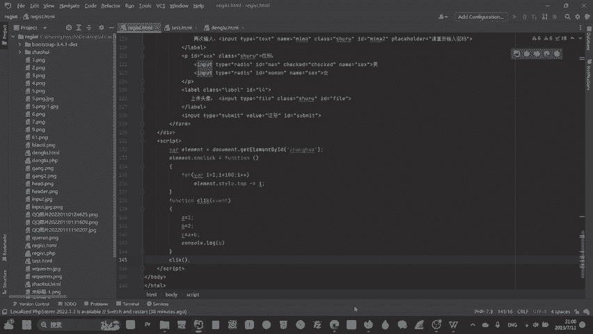

是什么能力啊？就是就是就比如说现在一个。代码啊，不用这个。现在这样一个代码，我F12，我现为什么我们安全要学前端？其前端目的就是我我打开这个F12，我会觉得它前端页面，我随便打开一个。

我都能大概读懂它是什么意思。如果说我读不懂，我还能去查，你看这什么意思？就是Y的那个WS等于一个6嘛，新建了一个呃一个一个就是新建的一个对象。WS等于6we这个东西啊，这个东西是那个初始化那个。

你不用看，你比如说我这个。你看我晃野这个，你现在是不是就能大体看得懂它是什么意思？一简单java控代码，你就能够能读了，能读就对了。安全源就是安全员的核心，实际上很多时候工作就是呃。

我看懂你的代码就行了，我没必要了解你那个代码多么的高级，用了什么框架。我看懂你的代码，我核心是不是要找你这些交互中间有没有什么逻辑，有没有什么没考虑到的地方，能不能把你这个网站给打下来。

我才不在乎你的网站做的多么的华丽，这就是安全原始中的。但是实际上我教会你这些东西，你啊也能够去实现很多的你想要去，比如说就这样一个网页，你已经能够实现出来这样一个好看的网页了。实际上对于你你的水平来说。

那么今天课就到这里，如果说大家还有什么问题的话，可以在下面提问出来，谢谢大家。

