# 0基础WEB安全教学，从开机到拿奖 - P4：第四节 后端篇（上）sql和mysql：励志存下全世界的小猫咪 - 看名笑 - BV1nW4y1o7T8

好的，各位同学大家好啊，欢迎继续收看我们后端片的上半部分啊。然后呢，首先老师后端篇的上半部分，我们会给大家介绍一门呃数据库操作语言叫SQL语言。然后你学会什么语言的话，基本上全球的数据库。

你都呃随便操作啊。然后my circlercle数据库呢，它是一个软件啊，它是呃全球很多的那个数据库软件的开发商啊。比如说像什么呃oracle，就是开发java的还有像什么circle server。

还有mysrcle，它都是一些不同的厂商开发出来的。但是区别不大，都是用circle语言有一点点的区别。呃，所以大家学会mysrcle数据库，完全够用了。呃，后面我会给大家呃详细的介绍一下。

稍微要详细点。因为SQU语言它涉及到那个SQU注入漏洞。然后呢，这个漏洞只能说什么嗯从从数据库诞生之初，一直到现在啊，每年都会有SQU注入漏洞，新的SQU注入爆出来。而且一般SQU注入漏洞，一爆出来。

就一般都会录入到像什么呃CVE啊这些里面的。所以说SQU注入漏洞是一个很重要的一个呃漏洞，大家后面会单独给大家讲。那这里只讲一些数据库怎么用它。后面在遇到漏洞的时，再给大家详细说一些细节的。

然首先数据库它是一个能够被特定的语言，很方便调用的一个软件啊，它就是里面集合了特别多数据库。比如说我下了一个mysql数据库之后，我可以用SQ语言去生成很多的数据库。然呢每一个数据库里面有很多张表。

这每一张表啊，它长得就像那个excel的表格一样，就这个这个就是比如说我里面制定义了一个列叫C number，然呢又制定一个列叫CM，还有后面两个列，然后里个面我可以去给它呃添加什么内容啊。

或者添加其他的东西。然后这样的话，我添加进去之后，比如说我写一个程序啊，它主要就是因为它可以和代码联合使用。比如说用户输入的一个东西，我就把它通过代码存到这个软件里面。

然呢有一天我想要验证它输入的密码对不对，我就从里面呃去从数据库里面传到代码中传出来。它可以很方便的实现这样一个过程，就可以很大的呃节省了大家。比如说最早啊怎么拿记事本去存数据。比如说我张三拿了一个号码。

拿个什么张三要去存他的犯罪记录他就张三的犯罪记录就存一个文档，谁谁存一个文档这样话很不方便，所以就专门开发了一个这样能够快速的针对程序去操作的一个更工业化的一个软件。

那呢SQ语言是长什么样SQ语就这样看这一排红字没就是比如说select username from student where student ID等于是一我都不用说。

我大家真的不用SQ语言大家都知道这句话什么意思lect就是挑选的意思嘛挑选username从dent里面在那个dent ID等于一的时候就这个意思。它就像是一个这个叫什么叫地点状语从句啊。

我英语不是很好，应该是这个意思啊。地点状语从句啊就是这个意思。实际上很多时候你那看不懂，你不会学SQ语句，你看SQ你不会SQV，你看SQ语句也是看得明白的。

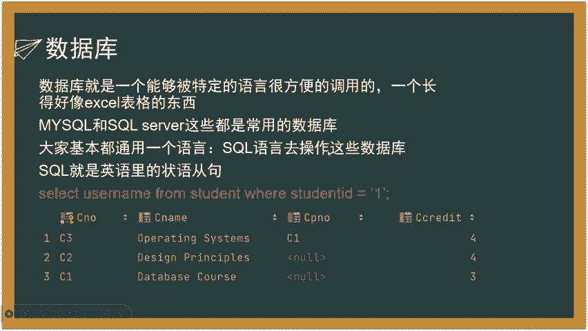

然后呢嗯这个地方给大家讲一下，就是怎么配这个呃my circlel，还有PHP啊这些环境啊，就推荐大家去百度上去搜这个软件啊。它是中国人开发的，有中文件表什么都有，而且它特别好。

就是你它给你极大的限度的省去的你初期的时候去自己配什么环境变量啊，去配这些配置文件，因为很麻烦，因为你主要是因为这个windows啊，它。它配这些东西非常的非常的麻烦，新手很难配好，尤其是这个买车口。

所以说你下这个PHP study，它就一键化安装了。安装完之后这个软件啊呃因为呃我们现在就是怎么说呢？就是。呃，入门阶段嘛，大家都是主要我们现在主要的流程是感受这个安全和快速的入门，快速的去答题。

你像后面的一些什么环境面料啊，这些东西，实际上呃如果说我非你说非的时候环境面料有没有用，那确实有用啊。但是为什么我不能专门开一节？开以前配服务器的课来教你环境变量什么的对吧？

我没有必要专门因为我学数据库，所以我就专门去研究个环境变量。好，环境变量研究完，我就专门去研究配置文件，对吧？没有必要我们现在就只要会会用它作为开头就够了，没必要花那么多时间。

我们当下啊有很多的那个数据库的操作软件，就它非常方便，它可视化了。你比说像这个这个是加就上次用的那个加这这个加的另外一个就专门负责管理数据库的你像我这添加了一个本地的这个数据库它就可以在这里面快速的查看。

甚至你我点的这种把它更改，就是把它改成C2那那确定我后面再给这地方上传，它就执行它就自动把它改。就是就像是它就已经变成一个excel表格了。前期我们学这些的时候，没有必要弄的这么。😊。

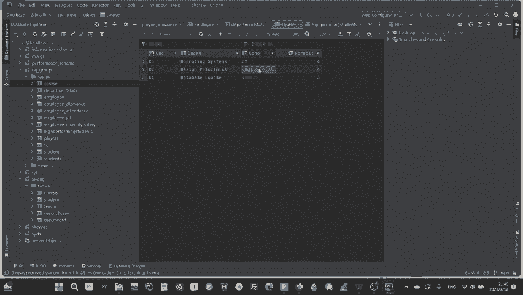

弄这种啊，弄这种其实看软件啊啊，它方便是方便啊。但是的话嗯对于我们学ciirrcle语句也帮助不是特别大。所我们主要还是去弄circle句。所以我们用这个命令行啊，就我们所有数据库操作都用命令行去做。

好不好？用SQ语言去做，好吧？我们学也是学SQ语言。然后呢打开命令行的方式，就是你PHP是 study你看PHP study安装之后出来就是这样的。呃，就是一个小皮的后，然后呢你点进去之后。

它这个地方这些东西都是他自己给你装好的。然后呢如果说你想装其他的，你开软件安装就行了。啊，还有包括像后面我们要学的呃阿帕奇啊，这种这个就是外部的一个一个服务服务网服务服务软件服务软暂时暂时不看的。

后面会专门开一节课讲这个东西啊。还有像PHP你包括这个地方PHP它也自动就给你配好了，你就很方便的去使用了，你就不需要去单单独去弄什么东西啊，也是你安装好之后，然后这个地方点击这个启动了啊，开机启动。

你可以把它停，你可以把它停。但是的话你这个点了启动之后啊，它这个运行的只要是个三角标就没问题了。可能要多点几次三角标运行了之后你可以进这个数据库里面你可以呃改这个密码，但是的话就不用往默认密码。

就是root，这个是我自己的密码，大家可以那就别看了，那就。呃，启动之后。就是这样一个界面，它就很方便，它就一次性给你配好哪你再去弄什么东西。然后呢怎么样进这个CMD呢？

就是我们用CMD就是呃其实你用linux服务器上也是用CMD就是一个类似于CMD的一个去配套给大家演示一下。

首先我比如说我的 study装在这个D盘的呃 study文件夹下面我现在进去之后它的my circle是全部装在这个extenion里面的然后呢里面大家可以看到我的使用的是mycle8。0my8。

0我进这个myq8。0文件夹里面有个这个并是什么东西啊，大家看到我给大家再讲一个呃扩展啊，这个并文件啊，它一般用于纯什么东西啊，一般用于纯这个系统的一个系统的指令。

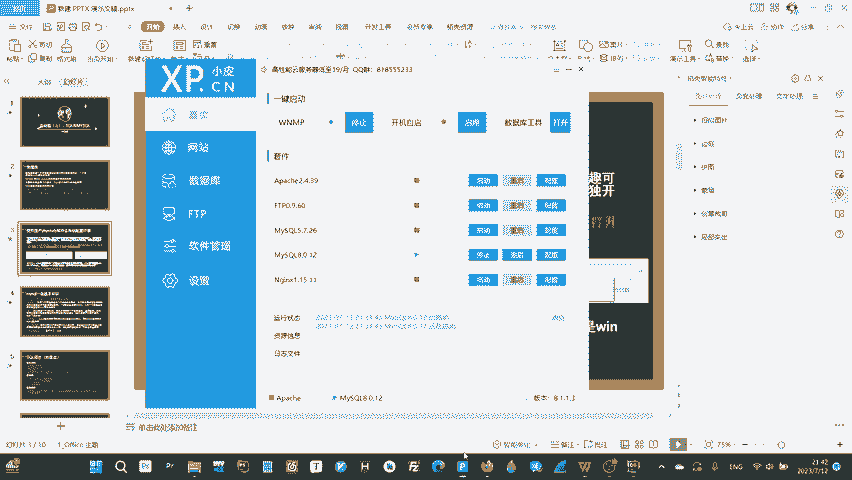

呃，你如果说大家用过linux操作系统，或者是你研究过windows，他会发现你的它的所有的那些什么呃指令，比如说什么重启啊，这些什么指令，它都在一个叫做binb式的一个文件夹下面。呃，并这个文件。

大家要要有这个想法，就它是个很敏感的文件，它里面存的它的很多的指令，包括它的一些操作啊，这些东西点进去之后，在这个地方就这个地方，这个栏部里面。win是一样的，输入CMD好，它就会自动进到，看到没有？

这个地方文件夹就自动进到这里面了。嗯，然后呢你在里面再输入，比如说后面我再给大家介绍这个数据库怎么进入啊，就是这么开这个sell开CMD这个过程啊。那我给大家说一下这个sll是什么东西啊。

s呃是一个安全里面很常用的一个。是一样，后面大家打CTF什么东西的话啊，也会知道很经常看到大家拿什么什么获取什么泄油啊，或取什么东西啊。嗯，给大家说一下，简单介绍，留个印象就行了。

它就是一个呃他说白了它就是一个交互交互界面儿。呃，比如说任何一个系统它都有一个交互界面，对吧？你比像我的windows，我的windows这个cMD就是一个交互界面。啊。

如果说我进了数据库只有数据库有一个交互界面，因为它是个系统，还有包括什么linux，它也有一个交互界面。这种就这种啥都没有。然后呢我输比如说我输一个呃ook啊，我输一个这个调用。

这个是这个指令是windows里面调用计算器的这里我输入指令。然后等一下，然后呢，他给一个反馈，看到没有？他弹出计算器了，就是就是就就这种东西啊，给指令给反馈就叫做。就是我给你指令。

他给我反馈这种东西就是一个一个界面就叫做然windowswindows操作系统的就是这样的一个MD啊，这就叫CMDMD点个大家留个印象就行了啊。像什么安全里面就说你打把别人的服务器打穿了。

然后呢他说获取到什么的有权限。白了就是我获取到你这个服务器能够给你发指令的，你服务器能够给我执行了，就这个意思啊。那呢在windows操作系统里面快速打开CMD的方法是win加R键。

然这地方输CMD但是他打开的时候默认是在这个呃user就是用户文件夹下我刚刚在这个地方输CMD它就会自动在这个文件夹下大家看一下刚才那个跟这个对比样的话我才能够对这个里面的这些命令进行操作。

不然的话在刚才那个默认文件夹里面。做不了，就省去呢我再跳转到这个文件夹的步骤了。然，就我现我就大概说这么多，还有CMD相关的。呃，后面我们都会在这个CMD里面对mycirl进行一个登录。

还有像什么其他的cirl语言的操作。好，这个地方。嗯，这里给大家简单介绍一下，就是my circler的一些啊基本的知识啊，这些都是重点啊重点啊。

首先是这个my circlercle的这个登录的这个命令啊，就是你mycircle杠U用户名杠P就是给大家简单说一下这个任何的这个s啊，啊也不是就这个这个命令行里面啊，这种指令杠什么什么。

就是代表着有一个参数，比如说杠U就是有个参数又，然后后面跟这个参数杠P就是代表有个参数P，后面跟一个参数，然后只不过它里面简单的告诉你，就是通过用这个又就user嘛。

P就是pasword通过密码登录某个用户。呃，这里给大家演示一下。比如说我现在刚刚在这个B里面，我现在CMB进去。进去之后，咱呢在这个B里面，我输入。

my circlecle杠U通过ro何用户的密码去登录它。现在他让我输入密码了，然后就这样，待会我输入密码了，他就进到这个mysql数据库里面了。

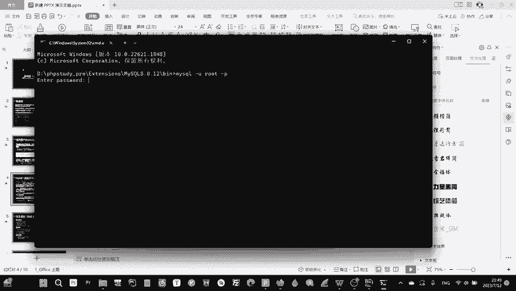

呃，然后呢继续讲我们这些其他的杂项了，呃，这些都很重要啊都很重要。这是必须要记住的。呃，root用户继续跟他说。因为你看刚刚我是不是用P用密码去登录的一个root用户啊，这root用户是个什么意思啊？

呃，大家可能用过安卓的都知道一个东西叫做安卓有个功能啊，就是你可以开这个root权限，比如说获取一个什么root原来老机子，比如说像什么呃比如说什么查看别人的撤回消息啊。

还有什么呃删除一些预设预安装的一些文件啊，软件啊，这些东西，你就必须要开root权限啊。但是为什么说警告root权限容易把你的安卓机子变成一块砖的，就是什么呀？因为它root它就是一个你这个系统。

安卓这个操作系统，它在它在诞生的时候，就得它从厂家出来的时候。它是不是本身是一块砖，然后呢我肯定要有一个用户能够进去，能够或这个用户一定是拥有对这个系统的所有的控制权限。就是系统有啥我就能用啥，嗯。

我才能够去改变，或者是去适配这些功能，对吧？去去开发这些功能。那么这个。拥有最高权限的这个用户的名字就叫做root。你可以理解它会默认或者是叫做跟跟用户，就是最牛逼的那个说白了就是老大系统的老大。

然后呢，所有的安卓用户在拿到手上的时候都是使用的是客户，就是user就是你自己的自己的安卓名的那个useruser权限啊。user权限是。嗯，它很高。但是的话它有一些基本的，比如说删除一些核心软件啊。

删除一些核心文件。比如说什么系统文件啊，这些权限你是没有的。你要想获取一个root权限，你必须要去破解它的root密码。这些东西一般呃为了安全，还有这些原因，它都不会给用户。

如果说你真的去花一些什么软件去破解了它。然你乱点，很有可能比如说呃比如说你网站上你下的像样一个东西。然后这个网站呢它会自动利用利用你当前的用户去给你安装一个木马。如果说你没在安装这个木马这个过程。

它本身是需要一个高权限去才能安装的。但是的话你本身原来那个用户，你在安装之前要经过你同意，你就至场来说要过一遍脑子，但是你用root用户的话，它默认就直接安装了。因为你权限太高啊。

所以就很容易导致你的机子被装些很多呃很可怕的东西，就这个意思。然后呢，linux用户也会经常看得到这个东西，root用户是什么东西，他应该理解的可能深刻一点。后面会给大家单独再讲的。

然后它端口是什么东西啊，端口啊就是一个。一个人脑瓜子想象出来的一个一个一个数据传输的通道。就是有一个笑话，就是说就是说一个博士导师，他他要去。他他他看见这个端口，他总是想要去摸。他说他看见那个80端口。

他他想找一下，在那个路由器上，80端口在哪插的是哪根线。然后这个东西啊就是怎么说呢？就是端口啊，它是永远是找不到的，它就是一串一串用代码去伪造的，就是去去编程去实现的一个虚拟的一个数据传输。

他这个端口的存在就是。比如说你路由器啊，我给大家举个简单的例子，你就懂了。呃，比如说你你整个这个整个这个路由器啊，它是不是用来传数据的。假设我一个用户传几连入的这个路由器，一个用户连入这个路由器时。

我要传数据。那我是不是假设路由器的全部的量都去用给我这个用户去分发数据，那别人连这个路由器，它怎么用的，是不是就会存在这种问题。

是不是就会想办法把这个呃路由器的这个网络怎么给它分就比如说你用你从这个地方往外跑，你从这个地方往外跑，就把它分出来很多虚拟的这样的数据传输的通路啊，然后呢让你去跑这个端口就这个意思啊。

然后呢大家大概理解一下，就是就是后面大家我们弄也是马上弄后端的时候，弄PHP大家看就懂了PHP就是有很多的这种端口啊怎么去配置啊这些东西。还有3306端和什么东西啊，3306这个是大家必须要熟悉。

并且要备注的。就是你看一眼你就得知道。它是数据库使用的端口，因为miccyclq数据库它使用的是默认的3306端口，而且基本上大家也不会改。呃，这个东西呃，因为它是在公网上开放的。

所以说的话很多时候比如说你安全员，你去找，你就会去扫它的端口，它开放了什么端口，从一扫到一万，然后大家就会扫到3306端口，就是他使用的mycycll数据库。

然后我可以去根据它这个东西去对它进行一些什么破解啊，这什么东西。你看呢还有一个问题就是my circlercle语言的呃circle语言的大小写问题。嗯。怎么说呢？ciirrcle语言啊。

它官方啊是没有明确规定到底是你大写还是小写还是区分大小写，还是该大写的时候大写大写是小写。呃，但是的话啊。在windows上呃是不需要区分的。但是在linux上的操linux操作系统上。

因为你的服务器全都是挂在了linux上的。后面大家配服务器啊就知道，我会会给大家讲的服务器上的时候，它的那个表啊、列啊这些名字。😊，名字他他他他是要区分大小写的啊，当然的话。

如果说你你你本身就是一个那种本身一个就是我啥都用小写的话，那也没关系。但是如果说就有那种怪的比如说我建一个user表，道er表我的又是大写S是小写一是大写啊，二是小写，难道你最后全用的大写去写。

你就会发现你根本就跑不通，那你最后也不知道什么原因。然后到时候一查你就发现原来是linux的这个要区分大小写，所以说我建议大家还是一开始就区分大小写，因为你写代码。

不可能在linux上写你写代码肯定是在windows上写。道你最后肯定是要呃怎么装载在linux上，所以说最好一开始就避免这些系统之间的矛盾啊，最好就区分大小写，不要听什么他们说的不区分。

啊最后lin是什么东西啊。linux是什么东西？如果说你就你不知道linux，我给大家简单说一下linux是什么东西啊。😊，嗯，家用电脑挂在的都是windows操作系统。

当然哈苹果公司挂在的不是windows操作系统。呃，大家就会发现，如果说有苹果电脑或者是苹果手机的人，你会发现啊这个苹果手机啊，啊苹果电脑啊，它这个跟那个平常的什么华硕呀，还是什么呃酷睿啊，这些的电脑。

它为什么就那个界面啊，还有什么这些软件啊，它都不一样。为什么我的软件在我的windows上机成人跑在苹果上跑不了了。就什么操作系统不一样啊。这个操作系统就是你电脑预装的一个大软件，这个软件集成的。

所有的你的什么鼠标点击啊呃安装驱动啊，这些什么东西，就是你用户本质使用的，就是这个东西，它是连接的你的呃硬件的，比如你的风扇，你的显卡。就是通过操作系统来让用户能够使用到的。然后呢，呃操作系统。

怎么说呢？就是linux就是另外一个电脑的操作系统。呃，大家可以去百度一下，百度一下卡里啊，还有或者百度一下优邦图啊，百度一下什么东西，都是基于linux的。我们平常用的就是windows，就这个意思。

大家大概理解一下就行，就是一个电脑预装软件，说白的。嗯，然后呢再说SQU语言的重点啊，这些东西都是必须要熟练或者背诵的啊，你也不需要熟练，你留个印象就行的。回头需要的是再查，但是这些都是很基本的。呃。

当然你把我这些看完了，听懂了，你也circle语言随便用了，已经已经随便用了，该用的都会的，不会的也能查了，看得懂的。至少来说。嗯，首先啊它的基本规范啊。

circle语句啊就是SQ语言的一句一句的它的结尾都必须要加分号，就跟C语言，还有PHP啊，还有加格数分一样，必须要加分号，不加分号就会报错。然后呢，建议区分大小写。同时的话数据库的结构是什么？

就是它在里面是一个什么包容什么东西？呃，比如说我大家我们刚刚使用的是mysrcle数据库，对吧？myscle数据库里面我可以新建很多的数据库。呃，数据库一个数据库包含了很多的表。

很多每一张表包含了很多的列，每一个列包含了很多的单元格，这个单元格就是我存的具体的数据，123456789这种。然后呢数据库方面的话，就是比如说新建一个数据库就用cre啊，很简单。

大家记住这个创造你create database，然后加个数据库。你比如说要新建个数据库叫做QQ农场，就create databaseQQ农场ok结束。啊，最好不要用英文，因为它编码有就不要不要用中文。

编码有问题，最好用英文啊，我只是这个地方呃写一个大家好理解jo database就是删掉。嗯啊当创建表一样的，删创建表删除表都是一样的，只不过把它换成表的名字就行了。这个地方是以数据库举例。

jo database加数据库名就把它删掉。然后呢呃想使用某个数据库就用右子数据库名，后面我会给大家咱单独显示你啊，这个大家先看先看，待会再写。好，然后呢数据类型啊，数据库有什么数据类型。

C语源有很多数据类型吧，整数啊、浮点数啊、双进度浮点数啊、长整数啊这些的数据库也有数据类型。这个数据类型是什么东西？就是我这个单元格里面，我该存个什么东西，我不可能什么杂七杂八的全都往里面塞。

比如说我的学号，我不可能给你塞个ABCD进去，对吧？我肯定只能塞整塞一堆整数进去呗，这就数据类型啊，就是区分它是什么东西的，呃，它有很这些常见的数据呢，不不代表它只有这些数据类型，它只是常见啊呃。

你会这些数据类型就够用了。咱不是那种大型的数据库工程师啊，咱家用的就就这一点点自己用的，包括你打别人的网站也就也就用这些。然后呢，int就整数就是大家记个记个记个记一个印象就行了。

in ininteger in integer吧。应该是你配过，就ink就是整数，float浮点数啊啊，给大家说个，大家如果说还没进大学啊，建着大学学生语言啊。

大家看到多浮点数浮点数浮点数浮点数就小数的意生就小数的意思。😊，呃，do宝双金度蝴蝶速。嗯，什么意思啊？就是就是那个小数点后面更长的小数恰尔就是字符串就字符，恰儿是字符的意思。但是在数据库里面。

恰尔是代表字符串的意思啊，它是相对来说较短的字符串。Y恰尔就是长一点的字符串，就这么理解就行了。好，然后呢再给大家讲一些啊数据库这个表一个表不是有很多列嘛，它每一个列都有一些特征。比如说学号。

我想建了一个表，这个表叫student，student里面专门负责存很多学生的个人信息啊，这个个人信息肯定有学号呗，你学号肯定是唯一的呗。然后呢我要想找这个学生，我肯定是以学号的编号呗啊。

所以说就会存在这种不同列之间的不同的区别。我怎么样去区别它在创建表，创建那个表的时候。我就要去设置这些特征的，这些特征就就这几个常用的，其他的都不需要看。嗯，primary key就是组件的意思。

就是英文主件的意思。它代表的意思是这一列上面的东西呃唯一就是在整个整个表中是唯一的，值是唯一的，并且它不能不能为空啊，它不是只在表上是在列啊，在整个比如说它它这个比如说学号这一列，学号这一列呃。

我是要设置的primary key。那学号这一列里面就不能重复不能重复不能出现两个相同的2。懂我的意思吧？就是它只能唯一，并且不能为空。然后呢，unic克就是可以只能只为一，但是它不，但是它可以为空。

它必须为一，但是它可以为空。那那note don rule就是不能为空，你可以理解为prim就是既un又notote do就这个意思。al in就是它会自增呃，这个自增什么意思啊？

自增的意思就是说比如说学号呃假设现在新生要进大学了，我导入的一个数据，呃，我从第一个学生开始导入，我不想给他单独设置区号。然后呢，我让他这个学号这一列是自增，我导入学生个人信息。

它自动变为一导入第二个学生个人信息，它自增变为2就自动编排下来了，就这个意思。自增的意思就是他一个一个自己自己加自己。楠丹呃星号这个字符啊，这个字符在SQ语言中代表所有所有这两个字的意思。

就是所有的东西。啊，然后呢。呃，就说到这个地方，然后呢呃基本语句暂先不看，咱先看这个。呃，首先啊我数据库里面我要进去之后，我首先要干什么？我首先要呃首先要新建一个table。

create一个tables哦，不是cre。首先要新建一个数据库，那么我就得create database。create database就得新建个数据库，新建了数据库左比。

假设我新建的数据库叫做123，然后呢，我又是数据库123进去，然后呢，我就得呃现在我有数据库了，数据库里面啥都没有，对吧？我现在至道新建一张表呗，新建表怎么新建啊，大家就看这个格式就行了，就这个格式。

大家就截张图，就这个格式。嗯，create这个大小写都无所谓啊，就就全大小写无所谓啊，大小写无所谓啊，只是大写看起来更好看一点。create table创建一张表好，这个地方是表的名字。

现在假设我要新建一个学生表，学生表里面有它的呃学号啊呃姓名啊，年龄啊，呃邮箱啊，还有它地址，假设我要新建一张表，它里面有这些列。我首先把表名儿写在这，拿它写一个括号，括号后面跟一个分号。

括号中间就是它的列的信息。呃，写首先它第一列第一列叫做IDID呢它是必须存整数。这个整数的意思就是就是。就是1到1到就是就是就整数，你就理解为整数就行了，就整数它必须存整数。那么整数呢同时它又是组间。

它是组件。prim加的这个看面这一块是一块啊，是一个是一块儿，就是它它首先它是整数，然后它是组件，然呢它是自真的，就我不需要单腿来设置。就这个意思，就这一坨就是双新建了一个列ID它是整数，它是组件。

它是自真的，就这样像叠buff一样给它叠上去就行了。然呢又新建了一个列叫做student ID就学号，它是整数，它不为空，并且它唯一啊，这个地方就有疑问呢，为什么我不再给他写一个prim key啊。

因为my circle数据库中啊，是不能有两个组件的，一个表只能有一个组件。所以说我想要让student ID也实现那个nten do，并且呃它还它还唯一的这个特征啊。

我就必须给它单独设置这两个buff，而不能再给它设置一个组件上去。组件只能唯一啊，大家只能记住一下啊，只组件只能是。一个只能有一个组件。然后呢，呃namename点就它名字。name点是什么？

name名字肯定是。这个为什么开啊这个东西啊，什么意思啊？就w刚刚我说的那个长一点的那个字符，长一点的字符开了50个长一点字符。意思是说我可以开我你我可以输入。俄罗斯人的名字大家知道吧？

就是什么拉河马什么什么什么什么什么什么什么什么懦夫什么什么什么什么，然后呢，它很长，对吧？我的开1个50个，那么长，你可以输50个字母进去啊，对最多50个超过50个就炸了，就存不进去的。

那50个以内是允许范围内，就这个里面就是括号50，你恰尔501样的意思，就是50个那么度。😊，那喃不为空，就是名字不能为空呗，我可能光有性别为名字呗，就这意思啊，就是按按虚来就行了。啊。

年龄还有这些东西都是一个意思，大家看一下，就反正就这个格式就行了。你要想创建个表，就以这个格式去创建。然后呢。再给大家讲一下啊这个东西啊，再给大家讲一下这个现在回到这个地方讲这些SQU的剧本语句。呃。

首先啊所有的SQU语句，你想在用之前，你都得先柚一个数据库，就你得先创建个数据库。难道你再柚它，你就可以使用这个数据库，就这个。这是个什么过程啊？等一下，待会给大家演示，好吧。

就是你现得你当然你现在就记住，我现在创造，然后呢，我再use或者用一个之前呃已经创造过的一些。然后use数据步骤，现在我才能有这些操作。呃，首先啊比如说我塞那这个这四个语句，就是这个什么意思啊？

就是查询。插入。更新删除。好的，结束。大家思考一下这四个这四字真言是不是？是不是非常的完美？你思考一下，假设你现在给你一张excel表格，你你你脑补一下，除了查询插入。更改和删除，你还能想出什么？

还能想出还能想出什么更更更更更适用性那么广的操作，对吧？没有，所以说我说那个数据库我没有必要选那么多，你其实就会这四项，你平常完全够用，完全够用。你有那些很高级的ci口语句。

说白了就是这些一个套一个一个套一个，就这个意思，其他的还要加一些什么排序啊，那些那那些都是。😊，那些都是那些都是小小东西啊，最重要的操作就是这四样。然后呢这四样你就背这四种格式就行了。

那那select要查的数据从哪个地方查啊，比如我现在我现在我要查一个数据，那那我从这个表里面查，我怎么知道你要查哪个，你是要查一整店，你还是要查单个的。假设我要查单个的那是不是我就得规定在哪个地。

在比如说在他的名在他的呃名字等于看名校的时候，查询他的学号，查询查询学号，从呃学生表里面，当名字等于看名校的时候，是不是很好理解，就查出来，他就给你返回一个他的呃学号。

然后呢呃inert into就是向某个列，向某个表的某几列里面分别插入某几个数据，就这个iner比如说要像sdent表里面的呃学生像学生表里面的名字和学号列分别插入就inert into studentdent学生表啊。

括号呃左边这个第一个列是什么学号呃s studentdent ID，然后第二个列是它的年龄就是A级，然后呢呃值是多少，我插入的都是什么什么值嘛，什么值第一个值就分别插入进去了。

它这个值一就插到列一值二就插入列二里面然后呢就这个意思啊，update什么意思啊？update是更新一个。比如说我比如说刚刚把看名校的看比年龄登错了，从从从18登成了81了。

然后我现在更新是不是然后呢update。呃，student的设置。呃，什么什么等于谁要设置，因为我要更新的是年龄，设置A级等于是。呃，18好，我现在光设置光从这个studdent表里面设置A级等于18。

我知道是设置谁的，A级等于18，那是不是还得给他限定一个范围，那就从哪儿威尔。威尔。那我等于看一下就找到了，就就就把它改了。那道等一样的，从哪个地方删除，当什么等于什么的时候，当什么什么等于什么的时候。

从哪个地方删除，就这个意思。基是大家是基本上。理论上来说，到这儿大家数据库就。可以的。他就已经能够做所有的你的这些什么操作啊，都可以了，已经没什么。没什么没什么阻碍你的数据库已经结束的。

说白了其他的都是你需要啥去查啥就行了。唉，好了，现在给大家讲一下这个特殊的字啊。你现在把这个特殊的字看完，可以说你就已经。毕业啊，你这个特殊的字为什么要给大家讲这？就主要是为了后面的那个做铺垫。

同时给大家补充一下，省得大家去差的。呃，这个百分号它是代表的特殊字符的意思哦，不是代表任意制符的意思啊。啊，你现在看不懂没关系啊，你看这个like。这个like什么意思啊？

likeike它的作要就是比如说我现在想查询一大堆学号，这个学号呢，它它的那个条件就是这个学号，它对应的人名必须要姓刘。怎么办呢？怎么姓刘了。呃，有没有什么方法能够去这样定向的去查询啊，就这个like。

大家看这一句啊，sn的心这个心什么意？新就是我刚刚前面给大家介绍的。就这个这个代表所有的意思啊，什么意思是要所有啊，就是你看这儿查询所有的东西，从列一里面，比如说从s IDD就学号里面。当列二的是等于。

当内院呢不等于当地院就像这样。大家看看这个什么意思啊，从查从列一里面查询所有的东西，但是前提是威尔前提是列二。就像任意字符com这个这句话什么意思？这句话就是从列一获取所有列二中结尾为com的数据。

你看这个百分号是不是这个likeakelike这样的样子，百分号是任意字符，难道后面任意字符一大堆，后面跟那个结尾，最最后三个字符是com，它就长这样的形式，那么那做个推导啊。

假设啊假设我要想呃查它的姓氏为牛，那是不是就可以单引号里面前面写一个牛，后面加个百分号，是不是就把所有姓氏为牛的就可以查到。因为它那个字符串就是最开始的第一个字符为牛嘛，后面的都是任意字符。

是不是就相当于把这个likeike的条件就给加上去啊。耐ike这一分钟也是就像的意思吧？好然后呢现在有一个哎疑惑啊，大家可能会疑惑这个列一啊，大家仔细思考就会发现哎我这个列一它没有规定表啊。

我怎么从从那个表里面查呢。

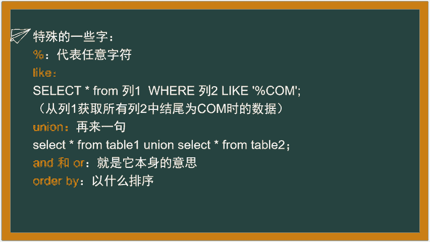

给大家讲这地方补充一个。呃，这种列为了方便简写。比如说我想说student student student表里面查查那student表里面的那个sdent ID里面列里面查怎么打sdent。

student这个是学学生表点。Student。ID这样的一个格式就把它简化了，就是扩能够它这个意思就是表示student表的student ID列是不是就是这个student ID列。

然后就把它添到这个地方啊，它就能够快速的能够呃能够表示出来这个列到底是哪个列的意思。同时的话也把表给表示出来了。好，继续后面的我们说的呀，大家理解一下后面我们说的这个优优大家知道什么意思吗？

优N在英文中是联合的意思，就是说白了就再来一句，我前面那一句不够啊，想再来一句，就是比如说这查询所有的东西从表一里面查，能不能同时啊查询所有的东西从表二里面查，刚然这么查，哎，啊这么查是是对的。

就他会把整个表每一列的内容都给你显示出来啊，就是查询从一表一里面查，然后同时又从表二里面查，他就会同时把两个表里面的查询结果像像两句那个话一样给你排列出来，就这个意思。

理解一下样联合查询这个就叫做后面也会有联合注入。

年啊，不是粘合住。联合注入不是这个，后面后面会SQ额输入会有这个会很经常用到这个优点。因为我前面比如说我从这边就给它掐一点，从这儿给它掐，从那从从从这地方给它掐一截出来。然后呢我怎么样想查我自己想查的。

我就给他加个优点，就把它联合给查出来，查到我想要，但这个是后面讲到，反单知道优点就是再来一句的意思。你看这个and和or就是就他自己的意思就是呃同时或者是或者这个怎么叫？诶。

比如说这儿sic的要查这个数据，从某个表里面，威尔呃，比如说威尔威尔 student IDD等于一，并且加个andstudent ID呃不等于3。就是。要求st studentdent的ID等于一。

并且它不能来去加个I。比如说或者我s studentent的ID等于是等于是等于是等于是一或者。orA级等于或者年龄等于是3，就这种就这个意思，就是and和or就这个意思就是表示一个呃逻辑关系啊。

就是同时或者是或者是呃并且或者是或得的意思或者或者的意思。呃，or by什么意思？order by就是排序，以什么方式排序跟在这个后面，马上我给大家这个地方是菜鸟教程上截的一个图啊。

大家可以去看菜鸟教程。菜鸟教程上几乎有几乎有所有的语言的呃教程。除了没有汇编，其他都有啊，几乎有大家如果说想真的在系统的学一点srcle语言的话，大家可以去看菜鸟教程。但是的话呃菜鸟教程有一个。

缺点就是它全是字儿，全是字儿。呃，如果说自选能力不是很强的话，不推荐开采料就是最好是看网课。然后呢，比如说这个地方啊。

你看这个地方就是刚刚说的嘛待会儿我会给大家马上也是那个呃在CMD里面怎么去呃实现我刚才那个步骤的。首先我又知道数据库，然呢 datataase嵌几了，然后呢这个地方就是它的这个地方呃。

select查询所有的东西，从runby杠table一里面，就这个表里面，从run杠 table一这个表里面查询所有的东西以这个列subvision data这个列来申序排序ask个就升序的意思order by就两个参数顺序或者是降序desk就是升降序二个就顺序。

大家看一下。这个地方就是sub million data，他把这些东西从从这个run表里面就有三样东西。你看有4样东西，有4样列，这些就是它的内容。呃，它以这些内容怎么排序呢？

就以这一列的内容看没有来自动去降升序排序，它就这样把排出来了。下面这一句查询所有的东西从run table一里面呃，以这一列降序排序同理就这个意思。大家备注这两个参数order by就这个意思就得了。

就没没有别的了。但是你可以order by其他的也可以order by123啊，这些就是安全后面的要说的社度要说得了。

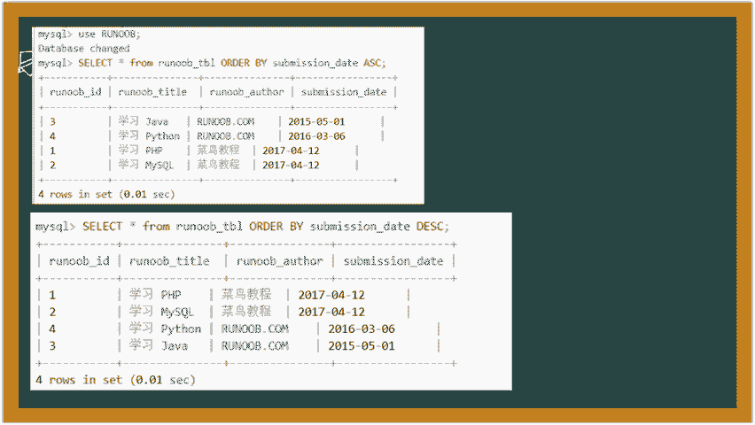

然后呢呃要讲的就到这儿了，先在给大家演示一下啊。

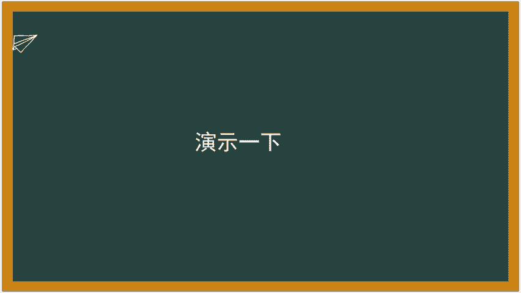

从头到尾演示一下什么意思啊？嗯，我从CMD怎么进CMD开始啊。首先进这个B文件夹，刚才说的CMD进去之后，然后怎么登录数据库啊。

my circle杠user什么userroot什么密码密的密码进去让他输入我的数据库密码。就刚才你们在小屏里面设置的。好，进去之后，大家看到没有？这就是一个我给他命令，它就交互的一个界面。

你现他是不是也是让你输命令，这就是一个稀有。所以我说很多的稀有啊，有就这个意思啊，就是给命令它返回。现在我进数据库之后，他现在没有没有没有没有没有数据库啊，什么都没有啊，它是不空的。

我是不是得创建个数据库。

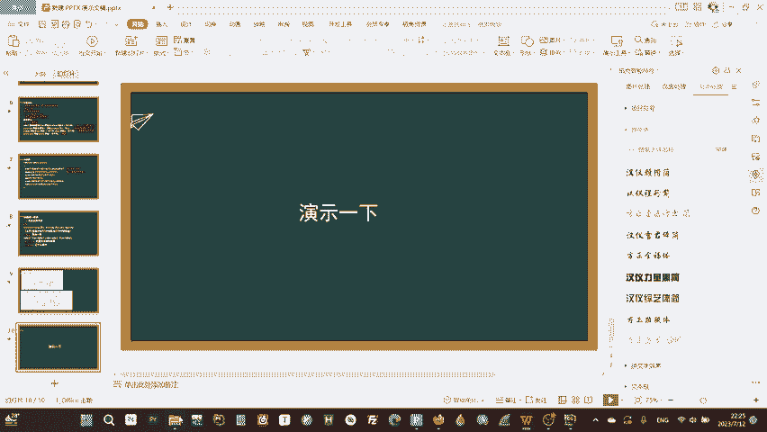

CREATc一个数据库，数据库名字是什么呢？呃。嗯，KMXYYDS。创建啊cre the database。创建的一个数据库，它的名字叫。KM X Y，YD， S。好，现在我创建你看没有？

queryO就是它代表它执行成功了就没有任何问题啊。现在我修贝ta。Pace。它就会展示所有的数据库，大家看KMXYYDX是不是就YYDS是不是就创建成功了。

这些其他都是我之前创建的这个information scheme是预带的，它里面存了很多什么表啊，这些的敏感信息啊。呃大家保护好这个数据库。这个数据库只有word权限能查看啊，也不是有的权限。

基本上就是的很多用户他都可以查看这个呃这个数据库的表啊。它里面的话呃后面我们弄SQV注入的时候，会专门针对这个这个数据库去进行一些。呃，专门的攻击啊。现在先不说，后面再说啊。

KMXYYDS现在我创建了我要怎么办？我要使用它，是不是我要针对这个数据库里面才能创建表，我不可能创建个在在外面创建表呗，所以我就得 useKMXYYDS。然后看ase现在我已经虽然它这里面没改变。

但如果说你在linux里面的话，它这个地方会变成KMXYYDS这里面我1它它没变啊，大家大家都知道这个地方有现在我已经进这个数据库这个界面了，现在我修tables。

我看一下里面什么表什么表都没有告诉你空的。那我现在是不是要创建表，创建表是不是我就可以对它进行一些真正查改啊这个东西，创建表怎么创建。假设我要创建个学生表。

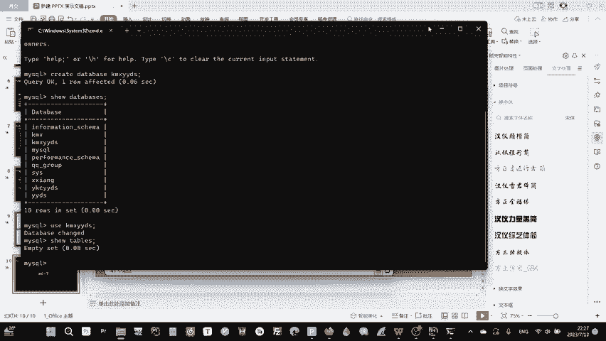

嗯。我就被一个一个打了。哎，这个地方我直接复制粘贴下来啊。算了，我要是给你打一下。

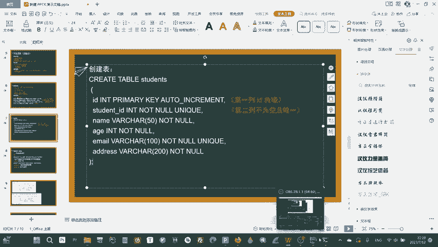

嗯。首先啊cre。Table。创建一张表打出来了，表叫什么名字啊？表叫student。那都已经打通了，对吧。好，它自动给你换行了。

create一个table table的名字叫studentstudent有什么？首先有ID。就是ID嘛，一个一个简单的号码，它跟学号不一样，往学号后面单独参加，现在有个IDID然后呢，他要干什么？

ID它有它是它是整数啊，我要给那个int。那他还是什么？他是主主件。Primary。primarypri key，然后呢它还是什么？它还必须得要自尊呢。Ao in。对吧。逗号。下一点还有什么列呢？

student ID studentdent ID它要干嘛呢？它必须要唯一unic对吧？unic就是唯一，难道同时它不能为空not。录好了，这一页就行了，还有什么列呢？呃那。那那什么它有很长啊。

它可能有很长，那我们给他来一个长一点的玩 chart，他要开多少，那给他开50。啊，同时呢它不能为空啊。想想孩什么？名字不能有你可吧，名字大家可以重名的，虽然俄罗斯那么长的名他也能重名的对吧？好。

现在结束了确定，然后呢在最后一行加个分号。lost connection to my circle。掉掉线。什么意思？Use the K X， Y， Y D S。啊，他。我刚刚说的太慢了，他掉线了呃。

😊，不想重新再输了。等一下，现在我右折KMXYYDS它这个是它的保护机制啊。然后呢我现在要创建一张表啊，我就直接复制粘贴了，我就懒懒得懒得再懒得再弄，待会儿它又掉了。😊。

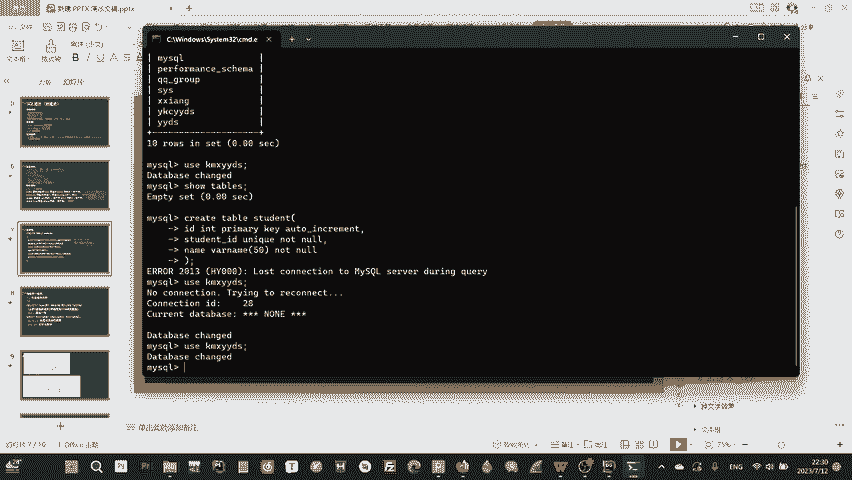

这是它的一个保护机制啊，就你太久没半天没输没输下来，他就。

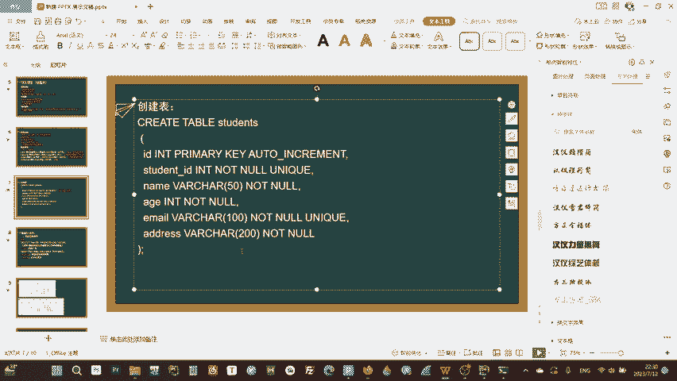

粘贴好了，它自动执行了，因为你这地方自动换行了啊，它它它这个有一个保护机制啊，它它会让你让你让让让让你就是你比如说linux大家用了之后你会发现它为什么安全，就是你它就有点类似于windows熄屏一样。

就是你半天不用，我怕你去搞什么搞什么坏事去啊，然后我就给你掉个线，难道你现在就得重新连上去啊，就这个意思啊，linux有些正做的更过分一点，你掉个线，你就得重新试次密码，就这意思。

现在我我直接复制粘接进去，它创建了这个表了，现在我秀。😊，Tables。啊，看到没有？现在就有这张表了。好，现在有这张表了。呃，是不是这个表上面大家可以看一下select。😊，从呃se新 from从哪？

谁那个从我现在要从现在情况下查一下这个表里面有什么东西啊。s新 from student它理论上里面是什么东西都没有的哈。从资本表里面查一下所有的东西，什么都没有。我现在是不是要给它注加一些东西进去？

刚跟我说了怎么加，它里面有呃有什么地啊，它这些东西nt to，完整再加太多了，我给它加个。Insert。into这个就是给它添加，后面的话你PHP连接上去这也可以啊。inact into呃tu。

然后加什么电呢？因为它这个主件啊你不能改，你就不需要加。Student。快递。还有什么？student IDD还有live。还有A，还有一。没有还有啊这。啊， the dress然后呢值是多少？呃。

这个地方必须要，因为你是字符串，字符串，所以你得加这个小这两个这两个小点儿啊，这两个小点就代表字符串单引号啊，16的ID为123，然后。呃，name。南为なな ca x。然后年龄为20亿。呃。

email。你该机没有，随便随便输一个。呃，address是ABC。NowST。好的，queryO了。现在我再来查啊select。啊，我再给大家说一下这个。这个这个这个min这种泄啊。

它是有一个普遍的特征啊，就是它为了方便你减写。比如我打很多重复的命令啊，我怎么样快速的能够打上就上一个重复的命令。就是你按这个呃你你看你所看你键盘的右下角有个上下图右是不是你按这个上看到没有？

它就自动的会复制出上面的命令，基本上所有的泄有这个界面都通用了，现在我直接就按两下就回到前两次的那个了，好，现在我再看是不是它就有内容了，现在我就inert进去了，对吧？iner进去了之后，呃。

我现在select也给大家展示的，还有是我再给它inert。这样的话方便给大家展示。嗯，咱示更多的。嗯，比如说我给他来个1234KMXYYDS，然后呢把它连你变成这个GM变成奇mail，它是。啊。

这个是un尼克，这个是唯E的那就就须123。同时的话ASDF好的，现在又可以了。前边是这样，呃，现在我再给大家演示一下那个select from where怎么查select的。

比如说我想单独查这个student IDD这一列的信息。student ID然后呢，我是什么从哪个表啊，student表里面，然后呢，我怎么怎么限制。

我怎么知道我这sud段你在查123还查1234的那是不是给他插个wherewhere where什么，我想要通过名字去定位它wherename等于是什么字符串，这个地方是给他传的字符串。

所以说你比须你为KMXYYDS好的，加分号。是不是就查的student ID了，对吧？就是这个意思。那那order by还有那些东西就是一样的。我就是在这样的一个数据库里面。

比如我们刚刚是记到一定要先右数据库啊，然后再创建表，创建表的时候就得生成执行地，然后你再把这些东西去一个一个的查，一个一个的去呃去试用，怎么去弄它，就就是这个意思。呃，其他的东西就就一样的。

就是你把这个就按照这个原原模原样的呃一个一个输进去输进去试一下，大家就知道了。

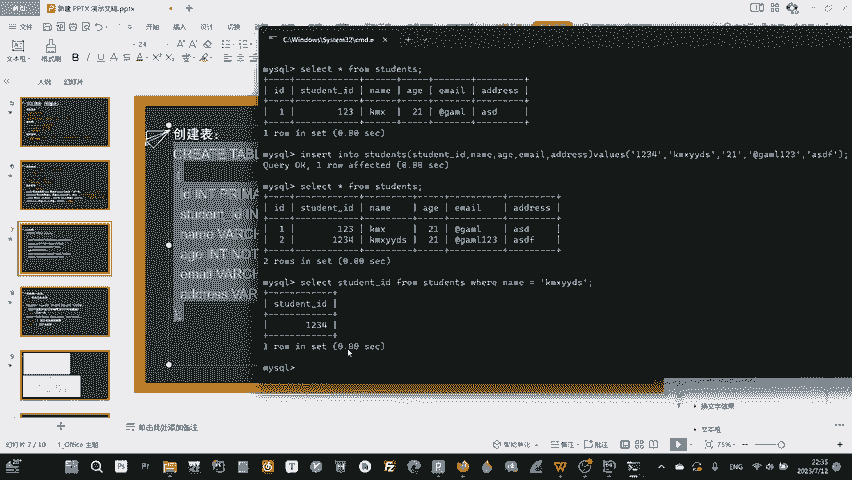

呃，那今天的课就到这里了，后面的话会明明天啊今天太忙了，明天会给大家呃更新PHP的呃后端的下半部分。PHP学完的话，咱就会开始正式学习呃，拍下继续脚本，马上就会变得非常的有意思。

大家也可以开始去配服务器了。好，感谢大家的收听。

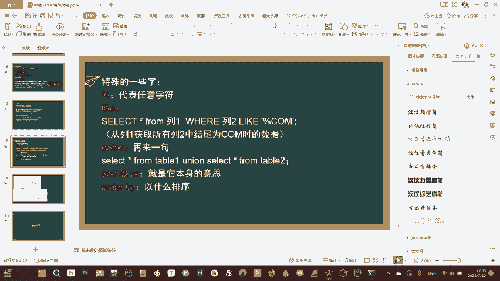