# 0基础WEB安全教学，从开机到拿奖 - P5：第五节 后端篇（下）php：阿巴阿巴，前端你在说什么 - 看名笑 - BV1nW4y1o7T8

hello，大家好，欢迎继续收看我们的后段片下半部分。嗯，在本片中我将会给大家嗯。教授一门后端语言叫做PHP啊PHP的话能够实现很多的功能。并且目前来说PHP的市场占有份额还是挺高的啊。呃。

虽然是中小型项目，但是大家生活中基本都能看到。首先给大家介绍一下后端是什么东西啊。后端后端它就是一堆那个处理用户数据啊，然后服务器数据的一个软一堆软件啊，一堆软件这些软件它就是什么互相传信息啊。

互相处理信息啊，然后大家一起处理信息，处理完之后最后统一发给客户或者是发给那个你的网页也是前端的一部分啊能够作为后端的语言特别多啊，像什么C语啊J加vaing啊勾浪啊这些都可以啊。

但是的话它这个呃选这个后端它主要的原因还是因为比如说你一个公司开发一个后端啊，或者说是你个人给自己网页选个后端，那肯定那个。需要的体量是不一样的对吧？然后呢，他那个因为各种他语言的那些特性啊。

你用来开发后端的时候，这些语言都会有像什么。呃，反映时间啊，或者说是开发的工程量的一个问题。所以说呃都是酌情啊，自己根据自己需求去选。然呢你选一门或者选多门一起组成一个后端的呃系统都是没有问题的。

然后呢后端最基本的思想是什么？就是三个后端最基本思想就是第一啊，首先从前端我得接收请求，对吧？我怎么和前端通信，首先前端肯定得发我，那呢我就要处理这些程序。就比如说我用后端用java去写一些什么东西。

比如他传给我个支符串，我把它分成一个一个的字儿，然后我也给它传回去，就是这样的一个处理的过程。然后呢我再把这个数据包给发给前端，这样就实现了一个后端流程，这就是后端基本的思想，就是接收处理。然后。

返还回去就就这个意思。那呢呃后端呢它写代码啊，写后端是一个程序员要，按照程序员所想来处理这些请求的信息啊。就是为什么我们要写后端，就是因为它前端呃，你javaqueimp特别万能对吧？但javaque。

它所有的东西啊，包括它的代码它都会完整的展示在那个客户的面前，它没有安全性可言啊。然呢同时的话我javaque它有很多的功能。它包括它局限于呃网页的一部分，它很难去处理一些服务器上内部的文件啊。

这些东西啊，它很。写起来非常的麻烦。呃，所以说我为什么为什么要单独拿一个这个语言出来？一个是出于安全性的考虑。第二个就是呃就是前后端分离吧。大家可能提出过前后端分离这个事情。

就是我前端跟后端到底是写在一起，还是分别分开大家一起去呃各写各的，最好啊前后端分离啊，这样的话便于你去弄一些安全啊，还有相关的呃维护啊。然的后端的代码呀是理论上来说是客户是看不见的。

就是只要啊只要你的你的那个那个程序没有什么漏洞。没有什么漏洞。比如说你把那个什么呃后端代码打包成一个压缩包放在了服务器上啊，基本上啊客户是不能通过正常手段看得到你的后端代码的。

所以说这也是后端的一个安全性的呃后端一个安全性的一个呃原理啊。就是首先我根本看不到，你看不到，你就没办法分析我。啊，这是写在前面的一个简介啊，然后PHP的一些呃就是代码规范啊，还有这些东西啊。

首先PHP它是一门解释器语言啊，什么叫解释器语言啊？大家想一想，呃，java queryme就是一门解释器语言啊，就解释器语言，它有一个最普遍特征就是它是没有编译器的。呃。

它的解释器就像是呃提供了编译器这样一个功能啊，它解释器本质上它是1个EXE啊，不是一点EXE啊，反正就是它是一个程序，它是一个程序啊。这个程序它的功能就是说呃把你的写。

比如说你写的代码写的在门前那么本质上就是一堆字符串，对吧？然道它这个解释器这个软件，它能把你写的那一大堆字符串变成呃电脑能运行的一个程序啊，呃它有点类似于那个打开方式啊。比如说你写的。哎。

比如说你1个MP4。MP4格式啊，你用记事本去打开，你就会发现它是一堆乱码。那实际上就是它的字节流转换成那个UTF8编码的时候呃那一大串呃就是本身上是它的字节流啊，它你用自节记事本打开。

它就用记事本这个程序去读它。那它就是读出来肯定是本记记事本的字符串，身相当于那道你用呃比如说迅雷语音啊，或者你用那个medo player让它去打开它，它就会按照用这个程序的方式。

比如说以MP4的格式去打开它。那这个解释器就是一个原，就相当于把一串那个TXT就文档普通的文本呃，以这个程序打开，它就以这个程序的方式去解析，解析出来之后，它就变成了一个就是我能够使用的程序了。好的那。

PHP文件的结尾是点PHP啊，比如说我写了一个文件是12345，那它就是点PHP。然后呢大家如果说在网上去浏览那个网页啊，如果说你足以看那个网页的那个地址啊。

如果说你发现最后是一个什么什么什么点PHP啊，那说明它的这个页面就是以PHP来写的。那那PHP啊，它是写在一个就这样的一个标签啊，大家都知道那HTM标签啊，HTML标签就是一个呃左右两边一个大于小于嘛。

等等中间加上那个呃它的标签内容本PHP也是写在一个这样的一个固定的一个格式里面，呃，给大家看一下。

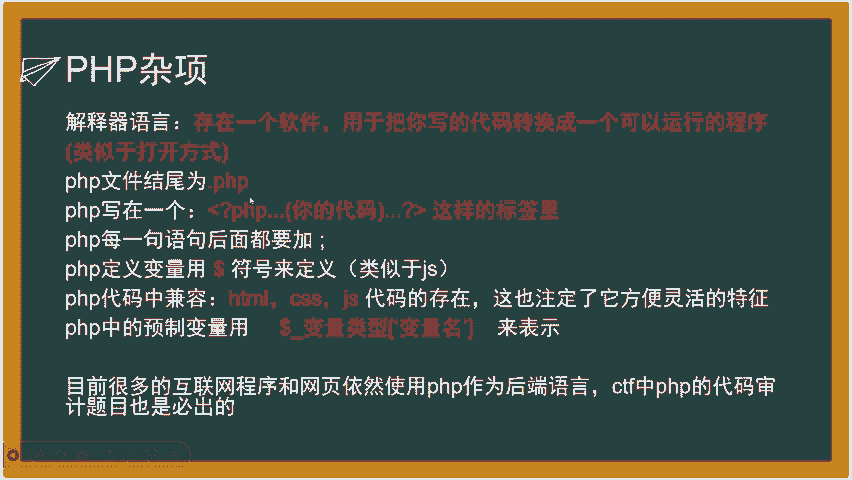

就像这样，看到没有？这个就是1个PHP的代码。然后他写的他写在。看到没有？就他写在这样的一个标签里面，所有PHP那代码都写在标签里面。然后呢这个PHP的代码是可以里面是可以写HTML的。呃。

直既然可以写HTML说明它也可以写java也可以写S只是我这没有没有单独再加的息，但是都是可以写的。我这个地方以以这个去打开它它一样是可以呃显示出来这些HTML这些东西的。但是如果说我打开之后。

我在按F是看不到这个的，看不到这些PHP代码这就是一个很神奇的东西啊，就虽然我是写在一起的。道我打开解析的时候，我也按P解析的。但是我就是看不到客户就是看不到的。

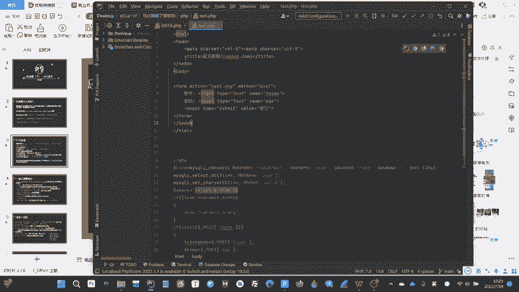

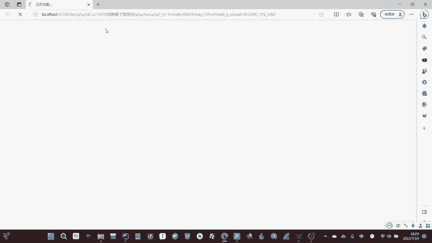

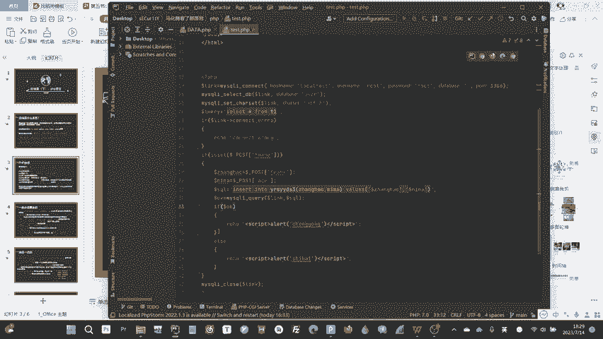

嗯，然后继续。然后呢，PHP啊它的规范是它的每一个语句，后面就是每一行它都必须要加分号来区别每一句啊。当它也有大括号，也有括号那些和那个C语言差不多，其他地方的事。那呢PHP定义变量，它是用呃这个符号。

就是我用一个这个符号等于什么？就相当于是我把这个符号后面跟的东西来作为一个变量了，就是这个意思。比如说。

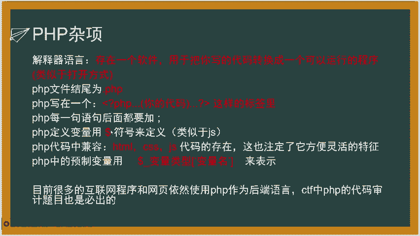

比如说我想定一个变量A，我写在这儿啊，定一个变量A等于是一，那么我怎么写啊？就是A就是一个这个加上后面它就PHP解释就知道这个东西就是一个变量了。难道我现在有一个变量了，等于。等于等于字符A。

这是一刚说一吗？等于一啊，1234都可以，因为它没有那个明确的去区分那个字符还是什么，它是个弱的型语啊，就随便你就是你写字符也行啊，你写整式也行，那些布尔直付给他都可以啊。

所以说它没有不需要去区分这些很方便的一点啊，就是它可以用来作为一个呃很快速的一个开发。因为我不需要去管理它内存或者它的那个数据类型啊，当然的话这样这这种模式也会出现一些问题啊。

比如说什么强内型判断弱的型判断，但这些都是后面打CTF的时候再给大家说，这地方留个影象就，反正他用这个去定义变量。

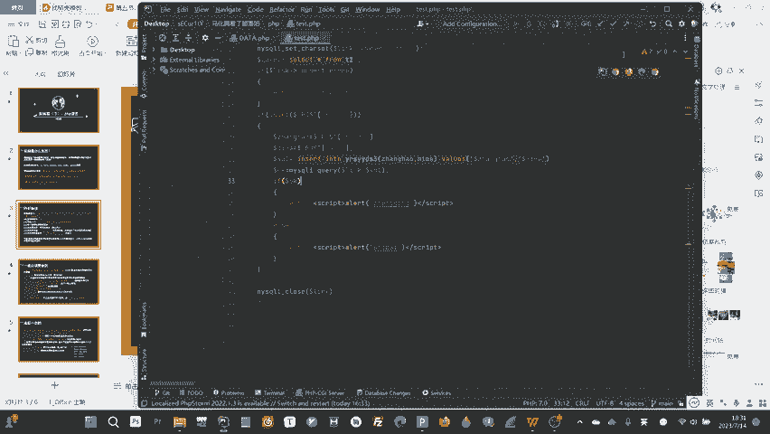

嗯，然后呢PHP代码中啊，它兼容HTM和GS。然后这个就是刚刚我给大家展示的啊，就是里面PHP里面既可以写PHP也可以写很多其他的些啊。同时的话它里面有一些函数。

也可以让你呃去写这些专门给你一些空间去写一些呃附加的这种前端的代码。那PP中预制变量啊，就是那种像什么环境变量啊，超级全局变量啊或这些东西啊，它都是一个这种类型的。

就是一个一个这个变量就这个do dollar这个变量符号加一个下划线，跟上个变量类型比如什啊，就用这个地方加个大写的一般这个变量类型都是小请求啊，就是一个这个加个大写的GT那加上变量名字。

比如说er啊这种东西啊，就是这个就是前端传刚之前我给大家的候不说那个 inputput它不是里面有个属性那个属性里面对这个地方就用到了就比如说一个get请求。

这地方就是一个US dollar下划线那里面就是一个这个地方就存的是前端那个input属性等于一个个变量的这幅串属。然后大家不要觉得那个PHP那个呃不是不重要。

就是他大家很多人不懂他不懂那个互联网那个生态的，他他就觉得他就觉得他瞧不起PH因为他觉得PHP用的很多很少啊，实际上不知道PHP用的特别多啊，很多时候大家不知道大家城市里面有没有那个。

就那种10块钱开在那种沃尔玛超市里面那种理发店啊，那种理发店啊，他就他他他他大家去得那种理发店实就开的就种两三个座位的那种，你去扫他的那个自动出票的那个牌号出票的那个机器啊。那个机器你进去之后。

你仔细看上面那个网页，它就是点PHP的结尾的，就是一个程序啊，它就是用PHP写的。你会发现它PHP还能实现很多了，像这种什么支付啊这种功能都是可以的，包括steam的购买界面也是用PHP能实现的。

还只交PHP市场占有份，包括现在还是来说相对来说挺高的。

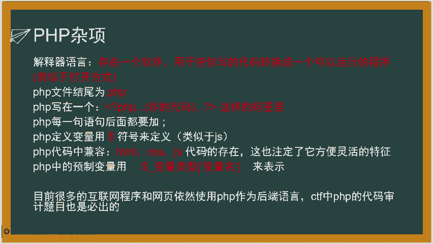

那呢还有接下来就正式给大家教大家PHP啊，PHP这些都是基础啊，就是必须要会的。让呢看就这些东西会了，基本上哎基本上PHP用来做后端就可以了。当然你非得说你要用PHP做什么爬虫啊，做什么东西，那么。

那我也没办法，那那PHP它他他他他这个语言啊，它诞生之初啊，它就是为处理这个请求数据作为一个后端语言使用的。难道大家看了这么多不是很多，对吧？有些同学他就会好奇啊，就你说看面像你你写你就这么一点点。

你就把一门后端语言给概括了，怎么可能啊，你觉得不可能的。嗯，我给大家说一下。就是这个东西啊，你一定要看透这个语言的本质啊，你说C语言那么多东西，对吧？C语言它那个C语言，它它它有那么多的功能。

有那么多的库。而这个处理这个页面请求这个东西啊，就是比如说它虽原它也能做后端，但它处理网络请求这个东西只是它一个额外的附加功能。也就是它本它主要目的不是用来干这个。而PHP这个语言。

它的主要目就是它诞生出来就是为了。写网页而服务的，他就是为了，因为你看它他都甚至可以和前端代码写在一起啊，他就是为了去方便去高速的快速的去达成一个这种处理请求啊，高速的那种呃数据转换啊这种的功能啊。

所以说你看嘛这些东西就是连接数据库啊，处级请求啊，难那你拿着请求，随便你怎么处理啊，什么什么加以存除啊都没关系。人家最后返回给他不就。不就是我们刚才说的一个后端的核心嘛，拿到请求处理请求。

拿到返回请求啊，所以这就是PHP的核心。你把这些会的，其他的都是啊我这边给大家教的这些语啊，大家可能觉得很快啊，觉得可能觉得很简单啊，但是。呃，实际上就是很简单，学语言是最简单的事情。

学语言真的是最简单的事情。然呢你真的就是这是一个核心的东西。我觉得这是核心的东西。你核心的东西你会了，你就你千万不信，就是需要再去百度，需要再去百度都有。然他学安全，为什么要学这么多语言。

就是因为我只是为了看懂代码而已，我也我也只需要看懂代码就够了。好，继续。啊，首先PHP中有很多能够补充有用的函数的库啊啊，这个什么意思啊？这个东西就是。呃，大家用过C语言。

大家应该都知道这些语言上面有个那个include，然什么什么点H，比如说你的标准输入库输输出就STDIO点那个呃点H对吧？那你还有像什么处理字符串， string点H，不是点。

就是str就是C加加的库啊，就你直接呃比如说你你你要想用它那些预制好的那种处理字符串的呃函数，它这个函数，它定义的这个点H头文件里面，那你就得先把这个点H头文件给它。呃，给它导入对吧？

现在就是你提前预置了一堆一堆东西，然后来来让它来把它提前给加入到你的代码里面。这个这个这种一lude的这种东西啊，在PHP中就叫做库啊。python也是这样的。

就是它安装之后但是python还是需要引入啊PHP不用PHPPHP安装之后只需要在它的配置文件，就是一个呃PHP点INI后面会给大家单独开一门课讲这个东西啊。嗯，这个地方大家了解一下就行了。

就PHP的那些呃额外的函数都是通过这个呃自己安装安装了之后，呢，在库里面解锁就行了。然楠第二个就是给大家介绍一个PHP最最核心的一个啊最最核心之一的呃一个函数就是PHP inform然。

它意是PHP的inform就PHP的信息，它会这个函数啊，一旦输入它就会展示本机的所有的PHP信息啊。然丹这个函数它有个很。呃，给大家看一下，大家应该就知道。比如说我把这儿全都给他全都给他删。

然后呢我这地方PHP，然后加个封号。

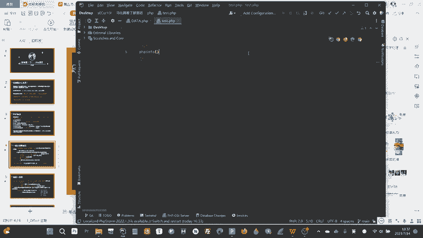

运行看到没有？它就会展示一个这种比如说PHP的版本啊当那你安置些什么C安装了什么库啊啊CUR啊ta这些这些库，它是有些信息装在哪个位置，那安装在哪个牌里面，它都会显示出来啊这些东西都是很敏感的信息啊。

大家也看到一个版本这些东西绝对是很敏感的信息啊，包括地址版本这些东西啊。嗯大家要很一定要有有有这个印象。那PHP为什么重点要讲啊，它除了让开发者能够去调试你的PHP环境有没有安装好。

还就是看他真正安装什么库，为什么有些还是用不了，用来debug以外，它在那个流量分析中啊。

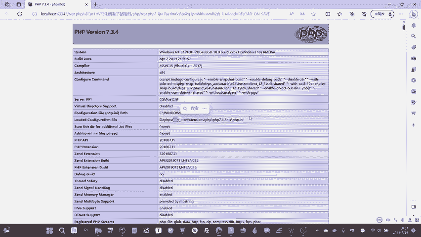

呃，也有一个很重要的地位啊，就是比如说一般的一般安全员的习惯都是呃比如说我现在攻攻入要进攻你一个PHP作为后端写的一个网页。呃那我现在已经成功破解了。然呢我现在破解的呃放那个结果就是我可以理论上来说。

我可以把你的我可以写我可以让你的程序执行任何我想要让他执行的PHP函数。那么我怎么验证怎么直观的去验证，同时的话又不惊动这个呃服务器方啊呃，就是就是一般习惯性的都会让他去执行一个这个PHP的函数啊。

然呢如果说呃就是他就会回显，如果说有回显，那他就成功了，就相当于入侵成功了呗。然后呢你在流量分析的时候，如果说你去呃他说这是一段入侵PHP作为后端的一段入侵流量，你去检索有这个PHP的有数据包内容。

你就会看得到啊，就很容易去找到一些呃入侵。啊或者这些信息基本信息啊。那啊还有就是E什么什么什E什么什么什么东西啊，这个地方是英文，我这略啊就长成这样的一个函数啊。

它就是用来它就会判断这个括号里面的这个条件啊，是不是满足这一坨就是是不是比如说呃E大小写括号加个字符串，它就会判断这个这个这一坨字符串里面是不是是不是大写啊，是不是小写这种。

它会返回一个是或者否这个一般都会加在那个判断语句里面去方去方便你去很少去写一些这种东西啊。因为它PHP中后端嘛，它肯定有很多作西判断，比如说我判它是不是数字啊，是不是呃字符啊有没有输入啊这种东西的。

如果说你用户在自己去定义，那肯定很麻烦。P内置的特别多，大概就长这样比如说这个这个。呃，这个这个同学ea就是是否设置的呃这个变量，就是它会判断这整个是一个变量，对吧？

posts过来的名字叫f那的一个呃变量。如果说他po过来的东西是空，那么说明叫没设置呗。它现在就是个疑问句啊，英语中的。如果说它设置的，那就会返回一个真，那么它就会继续执行下面的，没有的话。

那就不会执行。就这样他设置了很多这种E类型的。大家嗯遇到的时候，你就读英文都读的明白了。呃，然呢啊接下来重点介绍那个PHP跟那个my circlercle相关的一些基本的函数啊。啊。

那其他的my my my circlecle这个库里面的东西，大家需要再去百度就行了。很多啊特别多太多啊。哎，最重的就就这两个。其实你知道这三个最重要是这三个，你知道就行了。呃。

my circle collect，然呢后面的参数分别是主机密用户密码这些东西啊，就是人一个一个往里面填就行了。就是你填你要连接哪个啊什么东西啊，它会这个这个东西就这个。就这个东西哎。

首先我定义一个变量link。用来存储这个my circleconnect这个这个函数返返回的这个呃信息哦，它里面就会比如说我填本地的那个主机就local host嘛，这是本地域名啊。

大家loc host的loc host的知道是什么东西吗？不知道我跟大家说一下。诶。域名啊域名是什么东西啊？域名，比如说百度。百度点com就是一个域名。然后呢，这种域名啊，你想啊。

假设我本地开一个本地才能看到的网页，我怎么知道我本地除了用IP地址去访问以外，我怎么知道我的这个这个这个本地这个域名啊，它怎么我我怎么用一个域名的方式去访问我本地的这个IP地址呢？

就有一个固定的域名就叫做locco。host就是当地主机啊，本地主机的意思就是全球通用啊，全球的主机的本地域名都叫做lochost啊，这个就是本地反机大你理解本地的意思啊。

就本地那那user lab就是用户名啊，就root，然后呢它密码，因为预先默认密码是root就设置个root databasebase可以不选，你可以后面这个地方设置daabbase都行啊。啊。

这个地方你也可以直接设置进来啊，因为你。怎么说呢？你你连接my circlerl之后，我里面有很多的数据库啊，如果说我后面想直接去执行一个SQL语句。我之前给大家叫SQL的是不是说过啊。

你要想执行一个SQ语句。你任何SQ语句肯定都是围绕着某一张表的某几个列里面来进行操作对吧？那这个表一定会存在一个数据库里面，但是你默认情况下，你进了myr软件之后里面那么多数据库。

我怎么知道是哪个数据库啊啊，所以说这个地方必须要预先设置一个数据库，你可以在这设置也可以自己定一个这个啊，因为为了方便，这个地方就呃啊这个地方是选这个数据库现在就是补充这个东西啊啊。

大家就理解的把这个填到这里面一样的，就不需要这个了那那这个就是设置一个那个编码格式，就UTF8这个东西大家可以不用管这个是为了防止乱码呃设置的，就是一个附加，大家可以不用看。首关就这个东西啊。

你肯定得预先选择一个数据库的范围，不要不然你牛头不对马嘴，我也我也不知道你是哪个表肯定要啊，这这地方一定要设置设置了之后，当然还要设置一个端口啊，呃，你不也可以不用设置默认端口，就3306啊。

也有可能有些人他改了配置文件，他换成了比如什么70啊、990啊这种的。呃，可以单独设置，就这个意思。那它连接啊它这个连接。如果说它成功了，它成功连接到本地数据库之后，它就会返回一个数据库的一个对象。

返回一个数据库的对象，并且把这个对象复制给他。如果说你不设置的话，你就没有办法后面进行后面的操作，所以说一般都会定义一个变量去存这个呃返回的数据库的对象。那那这个对象嘛。

因为你要拿这个对象才能进行这些操作呗。你看这些函数它都必须要先传个这个数据库对象去，不然我都不知道你哪个数据库，我怎么知道我怎么知道啊你光连接的，下面代码也不知道你上面的代码连接啥。

它代码还没那么智能嘛。那你看这地方比如说这个query就是要执行一个SQ语句，这个前面定义那个SQ语句嘛，等于像这个里面注入什么，这地方还是得传个数据库，基本上你就是你只要使用mysql数据的那个库。

你都得。都得先连连了之后，然后在后面所有的mysq的函数，你都得传这个数据库进去啊。好，然后继续啊。然后呢my query啊，就刚刚介绍的，首先传这个数据库信息，就这个conect返回的。

只要连接成功了，就会返回个数据库信息啊，就是那个对象啊，当给进去，就刚刚那个变量给进去啊，然后呢加上一段我自己定义的字符串，这个字符串就是一段我想要执行的SQU语句。能来执行一段SQVG。

这个就是让数据库去执行他们。前面就你啊有同学就会问我，我现在能够查询，能够执行能能够查询，能够增删查改。那我能不能用这个呃去创建数据库还可以。可以，你可以用这个query，就是只要他这个权限够了。

那同时呢它只要是一句合法的社口矩，都可以执行啊，都可以执行。你无论你什么创建表啊，创建率啊，创建什么东西都可以啊。呃，my circleclo啊，我给大家说一下这个这个为什么刚刚看我的代码。

为什么一会儿有SQUI，一会有SSQ讲长这种样子的，一会儿用SQ没有I啊，这个东西什么意啊？这个就是mycircle它有个版本啊，它也是会更新的，它是个软件啊，比如看这儿这个有mycle5cle8啊呃。

在my circler my circle这个软件啊，在PHP中啊，针对6。0以下的。😊，呃，比如说my circlercle6。几级级6。000以66。00以下的版本了，呃。

都是用my circlecle没有这个I的函数来去写。然后呢呃6。0级其版本以上的五代以后的mycyclcle五代以后的都是用my circlecleI。这个东西啊本质没什么区别啊。

函数比这个l安全一点qql安全一点也没安全到哪去啊正功能都是一样的函数功能都一。就是换了个名字区别所以这个地就家就默认你用代以后那个数据库就当我说qclo就把个我现在连接上了一个程序连接程序执行完直开占用我的内存空电内存我把关话一是方信息信息流去泄露或者信息流中断甚至多开了很多个PP时运行一个数据库万一我占用数据库想占用不会报错其他的西你关闭这个东西这个东西常开机直不关就这个意思。

😊，你可以不关，不关实操基本上正常来说，普通情况下没什么，他会自己关，他会自己关。但是的话最好最好自最好自己设这个，还是把它关了。然后呢，呃gatet。嗯。

我所以说下面就要介绍两个啊最重要的这个这个呃这个处理请求的这个变量啊。首先第一个就是长这样，刚刚我说的这个长这样的，就是一个美金的意思，加个下划线呃。

加这个这个一个英文的意思就是说它存的是这个请求或者是这一个特殊的一个全局变量呃，的信息，下面是这个全局变量的名字。嗯，但是可能。可能比较费劲。我这个地方给大家讲一下这个gatet请求是什么呀？呃。

这个gatet请求。哎，对下现现现在先不讲啊，后面讲那个配置文件，讲那个网络基础的时候呃，专门拿着节课来讲这个get请求pos的请求啊。大家嗯暂时先暂时先不研究这个东西啊，这个东西。我单独讲get请求。

我怕你们后面忘了，我当然后面混着网络网络那个基础来跟大家一起讲啊。这个东西呃暂时大家就理解为这个pos的请求跟get请求就是给你传段字符串就行了。就是从前端给你传了一段字符串用户输入的过来。

然后你后面两种方法把都能接把它接住就行了。那那一口啊一口就类似于C语言中的print，就是打印一段话，就是在这个创业上面打印一段话啊。但是这个打印一段话就在网页上啊。因为这个打印一段话它很神奇啊。

它可以它可以接受你在里面加HTM标签，会打加那个javascreen标签啊哎这个东西啊怎么说呢？就是可以做那种很多神奇的操作。比如说你点了某个东西之后，它跳转过来之后。

它就给你弹一整个新的网页出来都是可以的。这个东西。😊，诶。唉，大家稍微理解一下啊，就是大家不要不要小瞧这个这个一口一口啊，这个一口非常的牛逼啊，这个一口。唉，这个eco它的它的功能呢。

它的功能甚至可以用来做作为什么东西啊，可以用来作为呃作一个比如说PHP的一个呃一个加密啊。就比如说我前你先单独写个PHP这个PHP用来做一些呃什么呃密码呀或者这种加密操作。那比如说首先我进入第一个页面。

如果是用户输入对的，我再把另外1个PHP给它那些页面给它加进来，怎么加进来呢？就让它一口出来就把它打印出来啊。这个答印啊啊。把它看你不要你不要把它想象的只能打的很短啊，它可以打很长很长很长。😊。

那来继续啊啊，待会儿我们都会给大家做演示的哈，我已经准备好，待会给大家弄一个这个呃怎么怎么写都会给大家录的。能能弄一个呃讲一些高级一点的这个东西啊，这些东西大家暂时可以不用掌握。

这些东西都是呃就是正常你开发几乎用不到。但是的话这些东西你现在我给你讲一下，系统上讲一下，嗯，可以让你后面的那个呃学起来更为更有一个印象，尤其是这些这些函数啊，正常来说其实很少用。但是的话呃它在。

他在S学那个PHP的代码审计的时候，我经常看得到每一道题几乎都有这些这些函数。然后我给大家说一下，这个pre maxpregmat or是什么意思啊？就正则表达式啊。

它就是用一个正则表达式去去那个一个就去判断一个字符串啊。给大家说一下正则表达式什么的，你可以理解为它就是一串字符串，那这串字符串它它它有一定的特殊的一个格式，用户可以去自定义很多的这种字符串。

这种正则正则表达式的字符串这个字符串它的功能就是当它作为正则来使用的时候，他可以去检测一个呃一个一个一个字符串一个一个其另外的一个字符串里面是否有比如说什么违规字符啊这些东西，你可以自己去定义啊。

就给他可以去根据你定义的需求，去判断这个字符串是不是满足要求或者是不满足要求啊，并且给你返回一个值。呃，这个东西。它的好处就是它可以用来作为一个防火一个最简单的一个防火墙啊。

有一个说法有一个说法就是如果说你的这个正则写的足够的牛逼，就是你的你的检索，就这个检验这个机制，考虑的足够的详细足够的牛逼，你可完全可以用它作为一个很厉害很厉害的防火墙。

就是很多不包括当前的大家可以去了解一下1个PHP的框架，PH也是框架了。PHP框架有个叫啊剩个PHP就TTBTP这个框架，胜个PHP框架。嗯，它到期待啊。呃。

一直这么多代一直都有SQL注入这个漏洞的问题啊，但是他一直都不用。现在就是他他他们所有的几乎的那些SQL注入，他都是用这个正则表达式去防范的呀。呃，说明它这个这个表示用出来是很多啊。

包括你用来检锁字符串这些东西都是很有用的。呃，除了安全之外，其他的用水很大啊。那但是呢这正则字符串怎么写啊，正则表达式怎么写？嗯。我们放在python的时候给大家讲。这会儿暂时不讲。

因为这会儿讲的话有点儿。太早了。😊，等把python学要再给大家讲这个正则表达式怎么去写，然后呢和python一起写。因为它python还可以用来做呃爬虫这些东西啊，或者混在一起啊好用一些。

而且pyython正则表达式用起来舒服一点。这个PHP还有加va，这些其实都有正则表达式。但是的话用起来那个体验感觉是不一样的。replace就是用正则表达式去检索一个字符串。

检索到之后就把它替换成另外一个，就是个替换成什么东西。你想要想要替换。比如说我想检索所有的ABC联合起来连起来的一个字符。比如说它一个字符有ABC123ABC123ABC123。

我写一个正则字符串这个正则正则表达式的意思就是我检索ABC好，只要我匹配到这个里面有ABC连在一起，我就把它替换成123。当就可以用这个replace去替换这个东西一般用来处理文本啊。

或者是用来处理一些用户输入啊。呃，典型的就是大家的QQ密码，就是比如说那种太有些特殊字符是不让用的，比如说什么点这种的，好斜杠这种的，它就会自动用这个政式表达式去检测你是否存在有这种特殊符号。

还是很可靠的。那 get content就是填入一个路径啊，就是把一个文件，比如说我写了一个呃预制的文件，然后把这个文件读出来，就是比如说我里面写123，然后我把它读出来，把这个返回到PHP中。

你可以用一个变量去存它，它会把这个文件的内容赋值给前我前面的某一个变量去。比如说呃每当A等于是它就可以得到这个字符串。

那那非 put content就是把一个文本或者是什么数据把它写入到写入到一个路径中。比如说写入到一个文本中啊，然后那后面的话第三个参数是怎么写入啊，怎么写入就。

很多啊它有三个变量啊啊有三个那个可以选择的变量。如果说你不选啊，它默认就是覆盖。就是比如说我之前现在有1个123点TXT，我用fi put往这个123点TXT里面写入数据啊。第一次写我写了个123。

第二次如果说没有设置这个这个写入方式为追加写入的话，那它就会直接把它给覆盖了，就它就没有了，没有了，把里面全部删的，相当于就是重新新建了个一模一样的这个文件，然呢重新写，就等给大家留个印象行的。

就反正这个是这个是读，这个是从这个是从文件读，这个是从文件写啊，像文件写。然后这个是正则表达式匹配匹配匹配到多少个就返回多少个数，然后这个是匹配匹配到之后就替换。然后呢要重点讲一下这个。

就是一个减号加一个这个大于符号的这个呃组合起来的这个符号在PHP中什么意思啊？这个意思啊，它官方文件显得很绕啊，说白了。就是你定义了一个类。这个类它里面有很多的方法，有很多的属性。

然后这个类比如说它生成了一个对象，我怎么我生成了一个对象，我怎么通过这个对象去调用一些它的嗯从类那个地方来的那些什么属性啊，还有什么方法呀，就方法就是类里面定义的函数嘛。呃，怎么样去调用呢？

就是用这个减号加上大于符号去钓用。比如说类似于那个点呢，就是你理解当成那个指针所源中那个。那个指指针去调用，怎么去调用那个结构体里面的那些东西啊？哎，这个就说到了，那就给大家看一个。

刚刚我说这个my circle杠conect，它连接成功之，它是不是返回一个对象传给这个link。这个link是不是就是个对象了，它这个对象里面肯定有很多从那个类里面继承的很多的呃函数啊。

或者是继承的一些类里面定义的变量了。你看这个地方就是如果说这个link这个对象里面的这个这个变量connect杠arrow变量为帧就是出现错误了，就它就会为帧，那么它就会它打印那个连接错误。

如果说里面我没有它或者是它为路，那么它就会打印它了啊，它就不会打印它。这个就是一个简单的句子，你就可以把理解就类似于这个东西。就是类类似于C圆中这个点啊，但是GHP中呃它使用的是这种。

使用的是一个横杠加一个大于啊，大家大概理解一下就行了。就是从那中就是从那中调用一个它的属性或者是它的一个方法。

呃，然后呢function函数名加参数的格式，这个就是和GS一样的。大家如果说不明白，可以去看一下GS里面怎么定义函数的C呃PHP里面一样的，没什么区别。因为他们都是弱类型的。

他们都不需要单单独去列举一下，他要返回一个什么类型，或者说它的参数是什么类型的，他们都的类型都是一样，啥都可以存粗暴一点。你思说所以他不需要那么多条条款款。然后呢呃就是这个函数。

这个HTML spatialial spatialial chances就是HTML的特殊的字符啊。呃，这个函数是什么意思啊？就是它后面跟的这一坨字符啊，会把这一坨字符里面的一些特殊字符。

就比如这个函数啊，它会返返回一串字符，它会就是它会把这种啊就这里面的这一坨字符里面，如果说含有这些字符，就比如说这个语啊，或者然后双引号大引号小于大于转换成这个。这个东西什么呀？

这个东西就是HTML实体就是。呃，我想想怎么给你解释啊，就在HTML，你看它代码虽然是这么写啊，但是你浏览器读解释出来就不是这个意思啊。浏览器它是它是看的这个。

它就把它转换成这个看的这个就把它转换成这个，就是把它转换成呃人肉眼不可读的这种状态，你可以理解为乱码也行啊，你理解为乱码也行啊，就是它会把这个它会检测这个字符串里面是否存在这些符号。

然呢把这些符号转换成这一坨乱码，然后呢这个就是什么好处啊，这个好处就是。呃，这个好处就是你你的你比如说传了一些什么特殊的什么javasquiimp这种代码进来。

或者传了一些什么特殊的这种呃敏感的字符的这种代码进来，它可以把它给你自动的进行一个简单的过滤，就相当于一个小防火墙给你把它过滤之后，就可以防止你在里面PHP代码里面去执行其他的PHP代码。

或者是javaqui代码产生一些木马啊这种东西啊，就是这个好处。嗯，大家留个印象就行了。反正就是啊就是有个这这个这个函数，就是一个简单防火墙了。啊，接下来说后面的呀。好的。

我们继续给大家演示一下这个PHP怎么写啊。嗯，首先是之前我们下载好的这个小皮的这个。

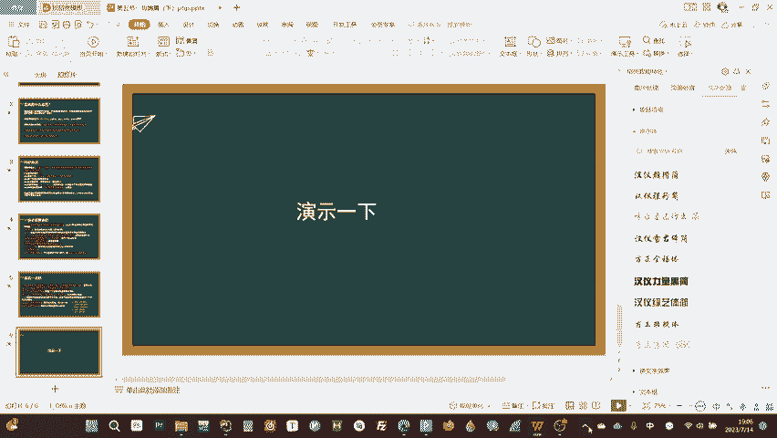

嗯，小皮的这个面板，然后它进去之后，大家会发现上面有这个数据库，还有就是这个阿帕奇这个服务啊，大家记得把那个阿帕奇服务打开，它是个外部服务程序啊，后面会单独给大家讲的，现在不急要。

马上下节课我就给大家讲啊，然后呢，my circlecle这个数据库你肯定得打开啊。因为你要连数据库，你不你不打开，你怎么连呢？然楠进去之后呢，然然，首先我们看一下，这个是我之前写的一个这个PHP的呃。

因为这个是PHP store嘛，然后那地方生成了一个test点PHP。

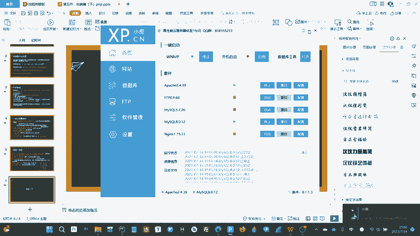

呃，是新建的test点PHP前面我写好的这个前端界面啊，而这个前端界面很简单，就是一个form表单，加上两个呃加上3个input的这个。这个这个标签啊嗯这里单独给大家说一下这个form表单是什么东西啊。

首先这个form表单这个form在英文单词中的意思就是表的意思啊。啊，我跟你说嘛，这个表你想这个表一般是什么东西啊？在中文中啊，就是你这个表它一般。是不是都会有很多栏部，这些栏部里面都会有很多的值。

对不对？呃，你想啊为什么要有这个form文表达？就是假设我一个网页中有很多的input。我很多的input，当我点击提交的时候，我想要让它提交哪些input出去。嗯，或者说比如说我有5个input。

但是我只想让他呃一次性提交三个，我一次性提交两个，我怎么样来来来限制它点哪个按钮的时候去交那个表单，就是这样，我写一个fo表单。然后呢这个表单里面呃首先第一个input标签是呃一个test类型的。

然后它的名字叫做呃fe name，就F。然它的还有一个标签是密码。然后就是它的名字叫做A，然那还有一个input标签，它的名字是一个提交啊，这个是固定格式啊，你也可以写成按钮。按钮也可以咬。

但是我建议大家写择subme啊，subm就提交的意思么，它就是一个按钮的意思。咱们这按钮的值是提交这个属性是什么意思啊？这个属性是。但是。呃，这个属性就是这个HTO标签的值。什么叫HTMO标签的值啊？

就比如说我那个账号，我这地方给它设置一个value。valueue等于是123。

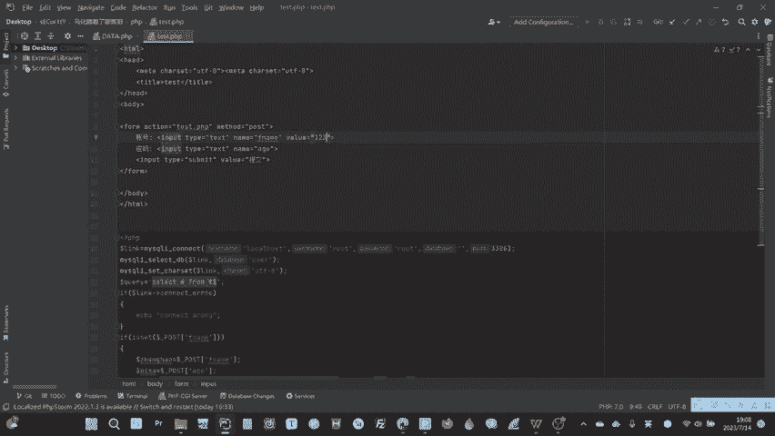

那我运行一下。这个地方呃在下面是报错啊，这个不管啊，当是警告不管，暂时不管，因为我后面还没调啊。呃，看到没有？这个地方账号这个栏目，它里面是不是就有123啊？呃，你提交的时候啊。

就是用户他输入到输入框里面，它相当于这个操作就是改变这个value的值。😊。

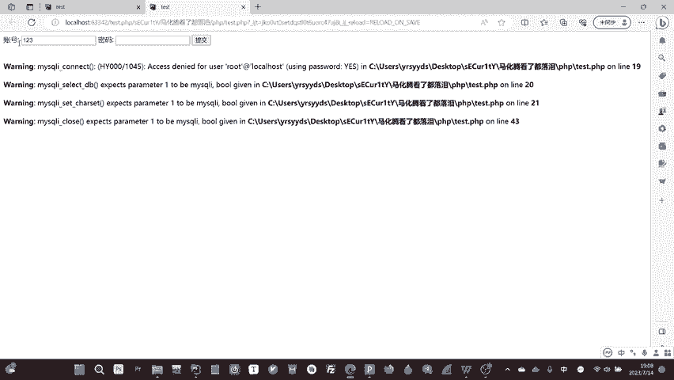

改变了这个value的值，我改变了这个value的值，它会它会它是什么意思？就是我改变valueue的值证我点这个subbit，它就相当于把我这个value给提交上来。嗯大家明白我的意思吗？

如果说我的地方预设一个value，它就是会给你提交valueue。而这个意而每一个value在不同的标签里面，它值都不一样的。你比如说像你这个tpho的类型的。

它的valueue的值就是就这个标签上的名字，就这个东西啊，点击的时候，他也会把这个东西提交上来啊。大家理解一下就行了。

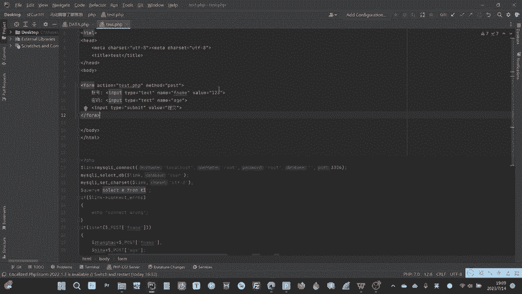

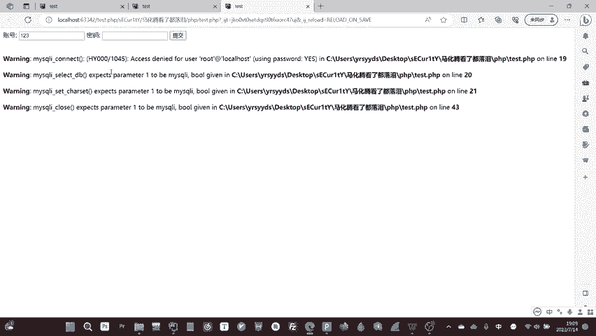

嗯。当然这个sme的这个按钮最主要的意义是它点一下子，它会它会去执行这个表单上的这个action啊，还有这个me。然后呢，现在之前给大说，后面讲了这个form标签什么意思？form标签就是它里面有很多。

同时的话它这个action这个action就是当我点击这个sme或者but按钮的时候，他去提交的时候，他提交给谁。

就是谁去处理我这个表单就行动了a谁去处理我这个表单就是这个就这个test点P因为他们在同一个。呃，同一个目录啊，不是同一个目录下，就是。呃，它就是在同讯跟目录下，因为它这个fo表呢，一旦你点击提交。

他现在就刷新一下，就把整个网页关了。然后呢把这个网页的那个目标定向到这个action的这个地址。因为我这个PHP和这个和这个这个这个前端这个页面写在一起的，相当于就是给我自己传的啊。

当然了你非得要说的话，你也可以单独写1个HTL然后里面这个action test点PHP，然后你再把test点这个前端页面删的然后你单独写个这个PHP里面也可以啊，相当于就是往这个文件里面传东西。

同时的话会刷新一个页面，这个页面就这个t点PHP。😊，那那方法就是你传请求的方式啊，你可以是get，可以是get，也可以是post。呃，这个地方这是post的，因为我下面写的代码是post它类型的。

好的好，一旦我点这个s meet，它就会以po的请求的方式传两个变量给我的这个PHP代码。这两个代码分别是名字叫做一个叫A级，一个叫feil name。好，现在我们从头来操作一下啊，从头来操作一下。啊。

首先第一步是什么东西啊？首先我假设我为这个PHP代码，那它运下这样的。好，我现在这个代码是怎么干呢？我想让它能够呃能够去去去把我这个输入的这个变量啊，呃能够插入到我的mysql数据库里面的一张表里面。

然后这个表呃，首先你得有表，对吧？首先你得有表，你就得你要想有表，你就得干嘛，你是不是就得。

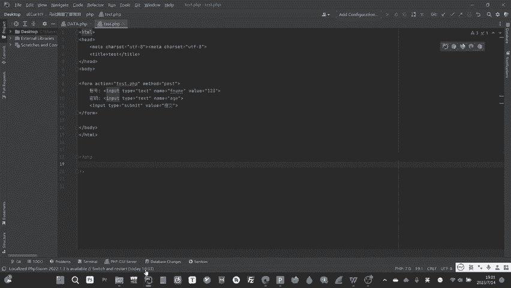

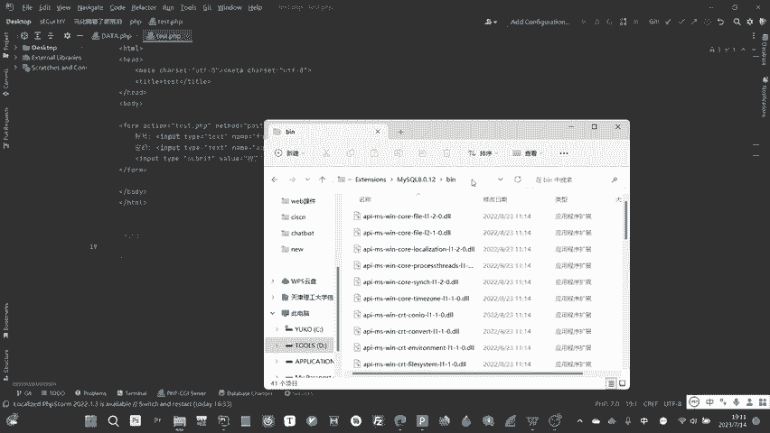

就得进到数据库里面新建一张表。

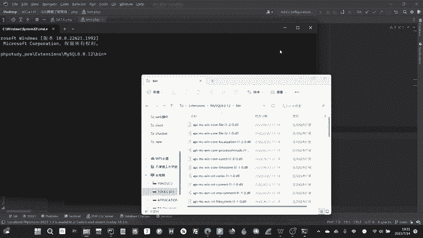

嗯，怎么新建怎么新建表，我再给大家看一下my circle杠又root杠P。让输入你的密码。好，输入你的密码子，现在是不是就进来了？进来之后。嗯。database看下哪些啊。

我就把它存在这个KMX数据库里面啊，咱么用KMX数据库啊，就 useKMX啊 databaseabase change了。然后呢，现在我要看一下有没有有哪些表在里面。没有，那么就要创建一个表。

create table，然后接table的名字。te目名字叫做YYDS。YDS然在后面干嘛？括号是不是？那是它会接到后面，现在我要定义列了呃，定义列这个列怎么定义呢？首先第一个列粉丝。粉丝。

然后呢粉丝什么类型的，是挖 chart，然后呢给他开个5丝吧。下一个，然后呢又博主啊。啊，又拍过挖个叉，这个地方只是给大家做演示，大家平常需要用的时候自己弄就行。然喃确定。闭合这个括号加分号。

O现在可以了。S tables and select。哦，就是从里面是那个从从从从这个表里面YYDS表里面查询所有的东西啊。啊，他没有啊他没有的，那就先不管它了。嗯，这个地方显示么？

我本来先给大家看一下这个表的结构啊，但是不管大家我们记住啊，现在有两个列啊，首先表是在YYDS，然呢它有两个列，一个是粉丝，一个是佛主啊，他们分别能存50个长度的呃变长字符串。😊。

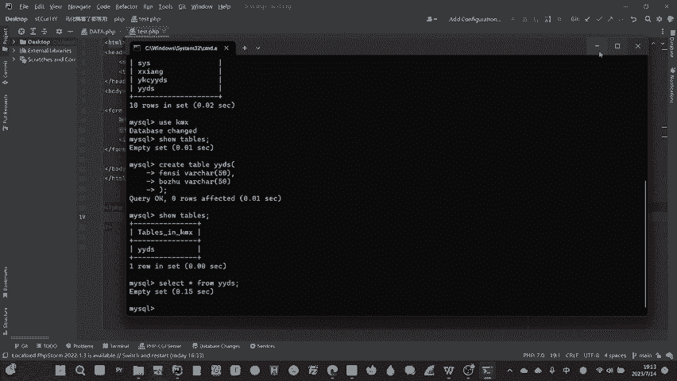

老师呢，我要给大家呃，首先第一步，我们PHP是不是这个东西是跟数据库相关的，我是不是得先连接数据库啊，刚刚说的。啊，首先怎么连击输果啊，首先第一个变量。啊，算了，这第一个边叫link吧。

第一个边叫link啊，这个边叫link用来存这个数据库的对象啊，那是不是就是my circle I connect好，conect之后，首先呃数据本那个域名啊，域名是什么？

local host本地的数据库。这个麦这个PHPstar都是装在本地啊，但你也可以远程啊，进这个地方你就输。比如说你自己服务器挂在在公网上，你也可以输自己服务器啊，然后那个地方开一个权限也可以啊。

这个地方就呃后面再讲它er name首先是用户名是什么，那肯定是用ro用户呗因为我只用户。然后呢名密码是什么东西啊。呃，XYYDS这个地方这个密码可以在这个数据库里面看到没？这地方可以操作去改它的呃。

这地方就不改它，这个地方是我预先设置好的。

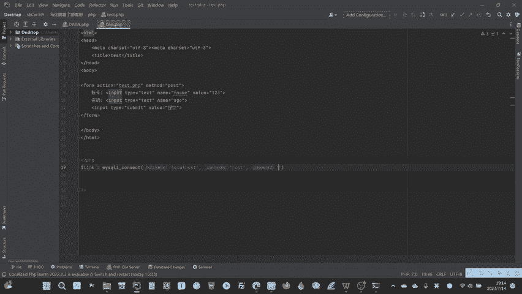

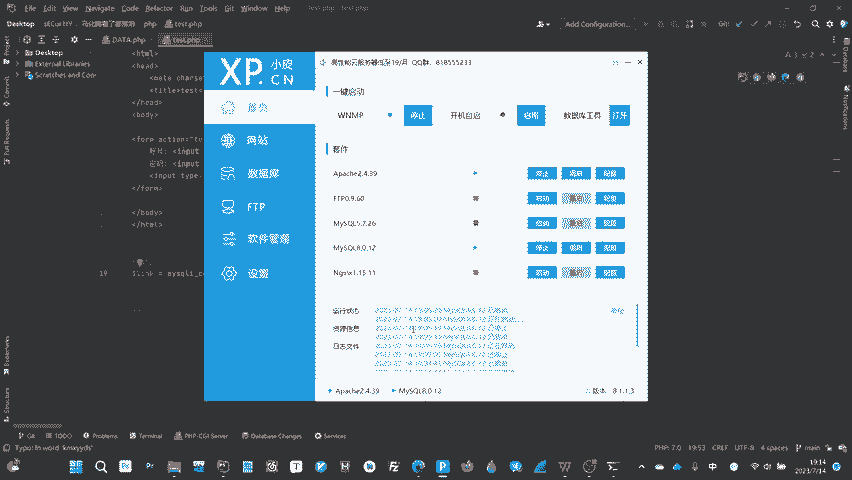

好，密码设置好了之后，还有什么东西啊，是不是那种限定数据库了，因为你要找到数据库，你才能操作这些表呗。刚刚那个数据库名字叫做KMX就把这个地方输上去。那的端口端口是必须数字，这个不是字符串。好。

现在完了之后输入一个封号，它是不是就存进去了？那道我是不是还得判断一下这个呃这个这个这个数据库它是不是。它是不是呃怎么说啊，它是不是会不会会不会连接失败啊？呃，是不是就得拿个if服啊。

if服啊呃link。就这个数据库里面的某一个变量，这个变量啊存储这个错误的变量，呃，就是connect ever。if connect如果说它存在，那么就打印eal就是打印。之前看看看看刚才说的eal。

就是打印一段话，我就在界面上打印connect error。Connect。

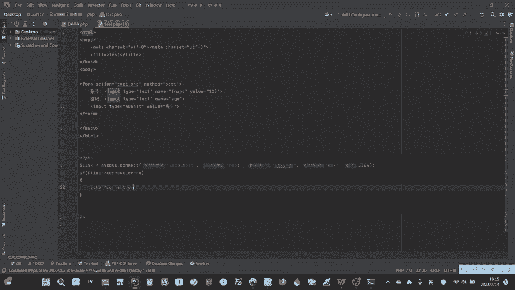

好的，然那我们运行一下，看连不连得上了。哎，连接上，看没有打印，是不是就连接成功了。连接成功了之后面我们就可以放心的写了啊，我们现在这个目的是什么东西啊，是不是要把这个这两个话给存进去啊。

但是这样的话存进去。如果说这些是不是肯定要用那那两个传过来的post请求传过来两个变量，那既然要用post的请求，传过来的变量，是不是就得用这个呃方式去去去代替就代表这个传过来的变量的内推于字符串。

如果说我整个项目我都用全部都用这个来表示这个post过来的字符串呃，是不是就会就会出现这个这个变量太长了。

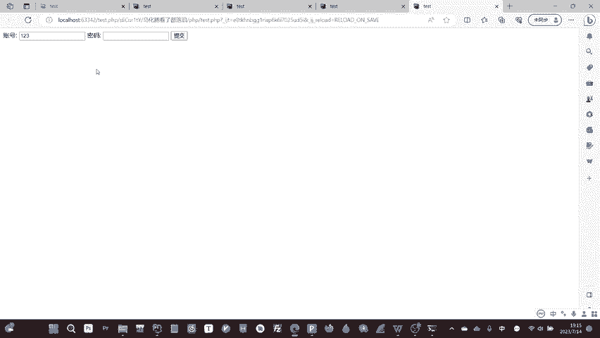

然后这个变量太长了，然后它是不是我就得想办法把它给缩短一点，怎么把它缩短一点，就是我自己再单定一个变量去呃存它。而且大家不觉得这个这种这么长一段变量，它可读性非常的差。好，现在我要单独定义个。

比如说第一个啊，最好定义跟这个man的一个名字啊。我最好跟他定一个男姆这个位置。嗯，这样的话方便大家去。方便大家去去去去去想想象的到到底是是哪一个变量。呃，首先我定一个变量，名字叫fiel now。

用来存这个po过来的变量的里面的这个参这个参这个变量，这个就是这个银put传过来的信息等于是。嗯，hos请求，然后呢分号，然后呢里面跟一个这个。跟一个这个love的名字啊，就feel love。

这个地方我怕大家误解啊，有些同学他前面没听啊，这个地方跟这个地方一样的，不是说一定一啊，随便定义啊。这句话的意思是这个是pos的传过来的。因为它这个表单pos的过来的两个变量吧。

因为这地方有啊这是三个变量，这就说三个变量。然呢这两个变量是有名字的，我就可以存这两个变量，这两个变量就可以查询得到通过这个名字，就用这个方式去查询，等价于这个就是就是这个input过来的字符串。

input过来的字符串字符串，然后呢再把这个字符串赋值给这个变量而已，并不是说它就非得是这个名字啊，只是把这个字符串赋制给了它。大家理解一下。呃，千万不要忌忌忌混的呀，不然的话啊。不然的话。

说我误人子弟啊。然后。这地方post这个A级在这存它的年龄嘛，说白了唉。有点怪怪的。刚刚我们存的是哪几个？我们不我们把它。把他这么大通怕大家看着困难。我们刚刚就就就改个名字啊，改个名字。

改成这个粉丝和博主啊。

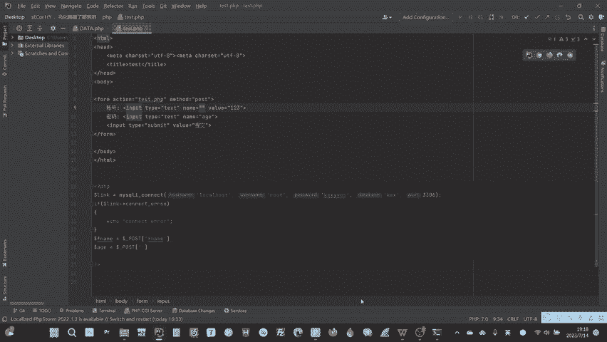

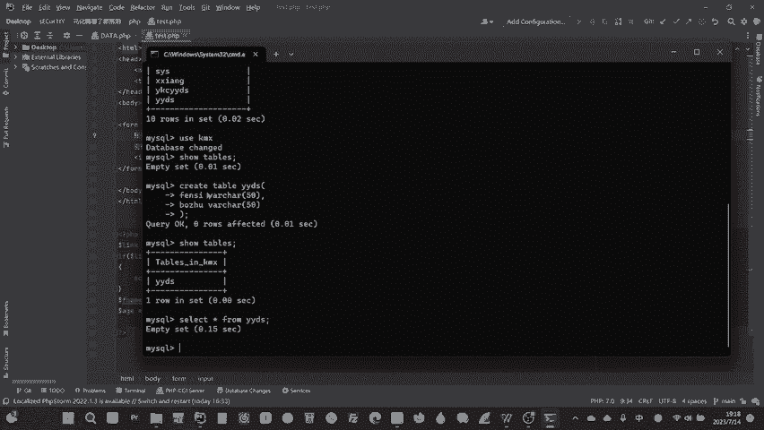

粉丝。还有博煮。嗯。加个这个吧区分一下。粉丝还有博主啊T。粉丝和博主啊，拿到这个地方就改成。第一个变量叫做。粉丝，然后第一个概量叫做。博主啊，奶边这个地方是名字叫什么粉丝杠T。下面这个地方是博主杠T。

好，然后现在。可以了可以了之后，现在我已经存进来了，我就可以用这两个去代表那两个传过来字符串了。好，现在要执行一个什么操作，我是不是要呃是不是要往那个数据库里面插入啊，要往数据库里面插入，呃。

我是不是就得预先定义一个circle语句。这个circle语句肯定是个字符串呗，然后呢再把这个字符串当做circle语句去执行吧。那我是不是就得。呃，就得干什么，就得定一个字符串。

第一个字符串SpoL吧，随便什么名字都行。这个不啊再说一遍啊，这个circle啊。不一定不是说我后面因为写的是circle语句，所以说我这地方就得叫circle，我只是把它这叫做这个名字更简单一点。

更好记，更更更更容易我后面写的时候不会混乱啊。嗯，circle语句circle语句怎么说啊？inert into对吧？插入是insert intoinser into什么？insert into是表。

对吧？表格呃，表格表格表格表格的名字叫什么？表格是YYDS表格。YYDS表格呃，哪几个数据库啊，哪几个列啊是不是粉丝啊？粉丝这个脸还有什么力啊？想想。啊，博主啊。难那是不是还得values。

就是传入的什么值，传输的值是不是字符串，这个地方字符串的话啊啊，因为它这个地方为了满足这个怎么说呢？为了满足这个格式就是。

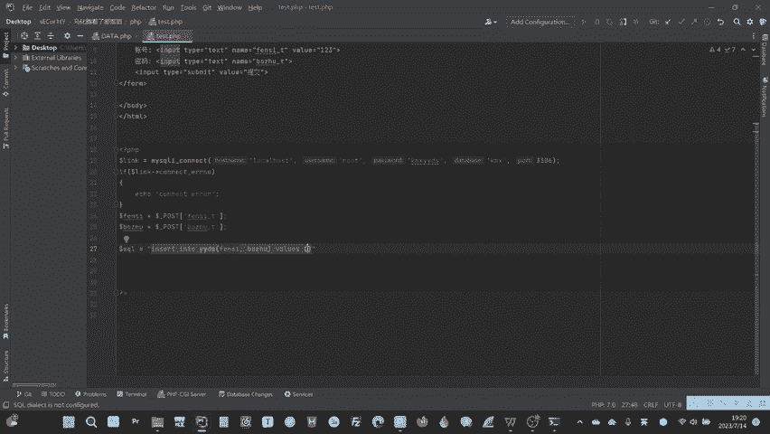

在circle语句中啊在circle语句中，你比如说你要想你要想一 in to，前面这个地方列明是不需要作为字符串的，因为它就是列明，它是直接减索的这个。

但是你插入的值必须是你这写这一段的时你当成SQU语言来写的，插入的值必须是字符，但是PHP在执行的时候，它不觉得这个东西是字符，就是大家知道字符是要自动加两个大引号的。

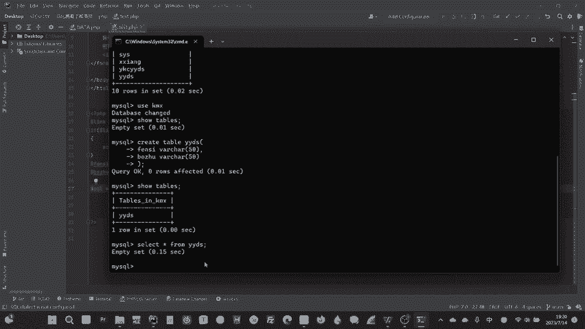

，PHP在把这一个变量挪到这一坨的时候，它是不会它是不会给它自动加变单引号的。所以说我这下我得自动给它加一个单引号。这样的话在SQV在执行的时候，我才知道这个地方是把它拿进来了。大家理解一下。

相当于是PHP是是把这个东西直接原模原样的，一点啥东西都没有呢。你输一下大家把一23给放进去啊，没有什么单引号，这个东西啊。大家有些时候SQV注入啊，说什么自动加单引号。😊。

说什么自动加单引号这个东西大家就觉得很昏。那个自动加单引号哪儿加的大引号啊，不是是因为这个地方是circle语句，必须是单引号，而这个东西是原模原要放进来的啊。这个东西给大家说说一个坑点啊。

有些有些那个CSDN上的博主，他就他乱说啊，他给你。看到这地方是把它加进来的，然呢再单独加一个。博主卧。嗯。好了，现在这个cicle语句结束了，ci后语结束啊，最后一个坑点就是cile语句必须要加分考。

PHP得加个分号，这是PHP依句整个是PHP最后得发分号。SQV文我也得加分号，对吧？好，现在加了封号之后，现在要干什么，是不是就得执行它了，是不觉得my circle啊，因为是把5。0米上。

是不是就得I呀，那是不是就是query啊？query第一个参是什嘛？是这个数据库对象。所有的都是数据库的，先示数据库对象，然后呢加什么东西啊，加我的srcle语句的字符串SQL。好，现在加了支付串之后。

呃，咨询一下，看一下有没有什么报酬，没有啊，没有不是没有报错，因为他们都没执行了。

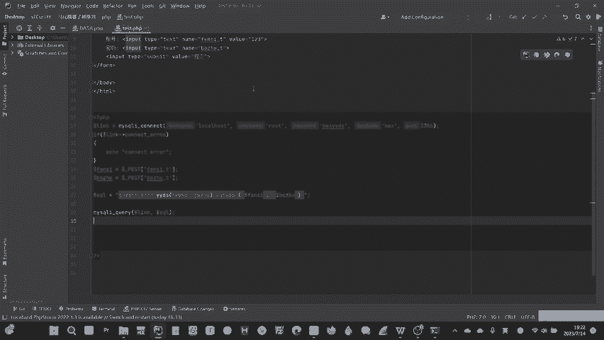

只是连接了，没有执箱，因为里面是空的，现这种输入账号啊。账号网上大家这个账号就是那个粉丝这个这个东西啊，但后这地方博主是234啊。

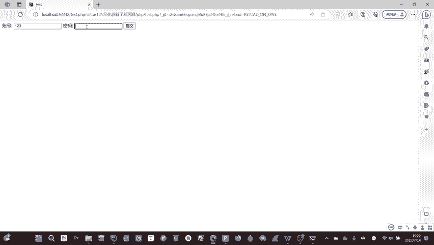

提交啊提交成提交上了提交上了之后，然后呢我们现在这地方检查这地方直接谁来考什么好，看到没有？是不是就把这个给存进去了？

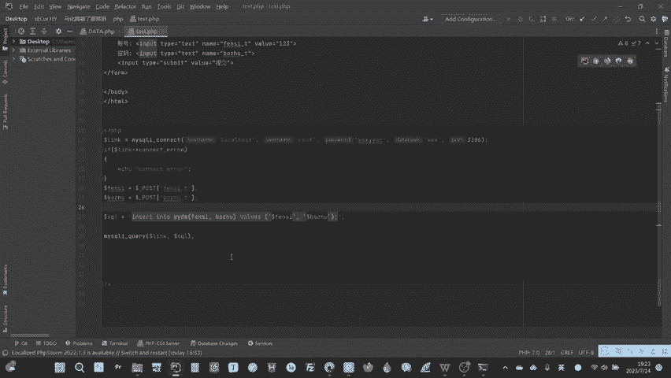

是不是这就实现了个后端的过程了，就是我后端我不一定要给你返回一个东西啊，就是返回东西可能这种回显，有没有什么报错啊，这东西啊。但是我后端也有可能就是比如说我单纯只收集个用户的信息啊。

我就没有必要呃就向你返回一个东西，我就把它存进去就行了。那这地方就是后端那个过程。如果说你比如说像什么在处理一个什么数据啊，比如说这样。

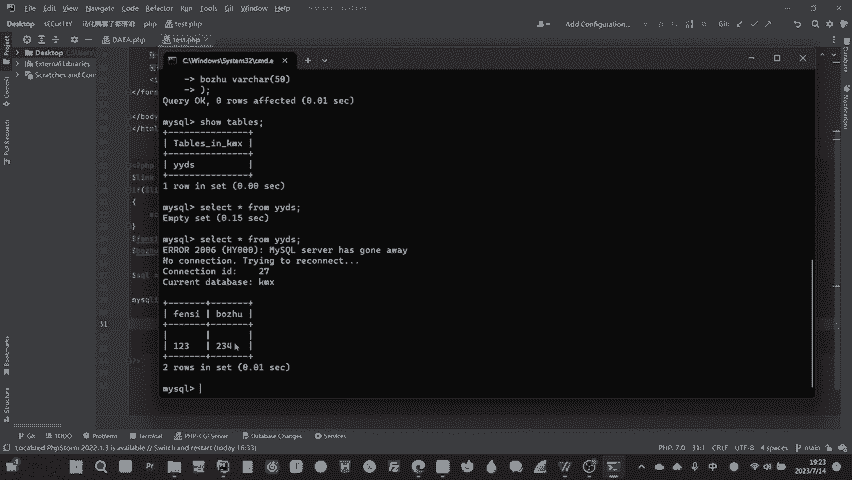

啊，首首先我执行结束成功了，时候，是不是我还得给他呃返回一个呃东西啊，比如说我就打印一个eal，现在我是不是就在实行一个这个返回的过程呢？呃，eal什么东西啊？呃，eal一个字符串。呃，比如说首先啊不。

首先我主。加上。粉丝。看一看。0因为这地方啥都没有啊，0了，这地方执行了之后，我再来给大家执行一下。123234好，没有。

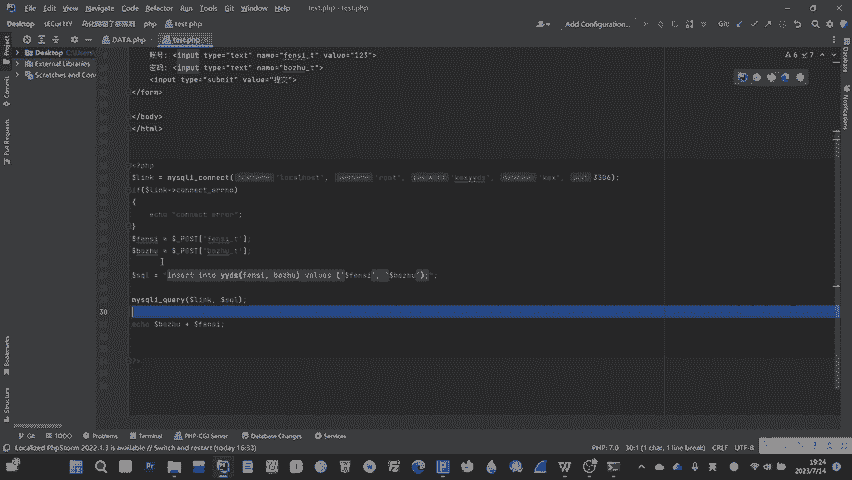

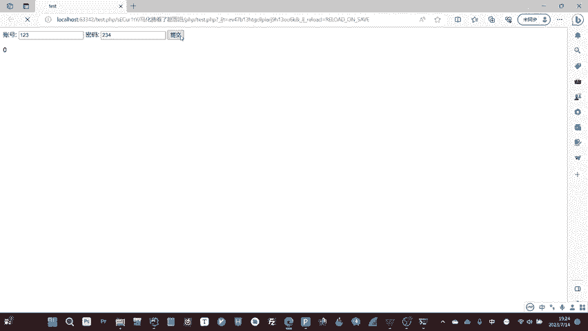

他看到没有？大家这个地方就是把这个两个变量给加上，因为它两个变量传过来的时候，它是。他他他传过来的时候是数字哦，这个东西大家就会很好奇啊，为什么我的字符串加给他之后，他。它变出来它是这样的嗯。

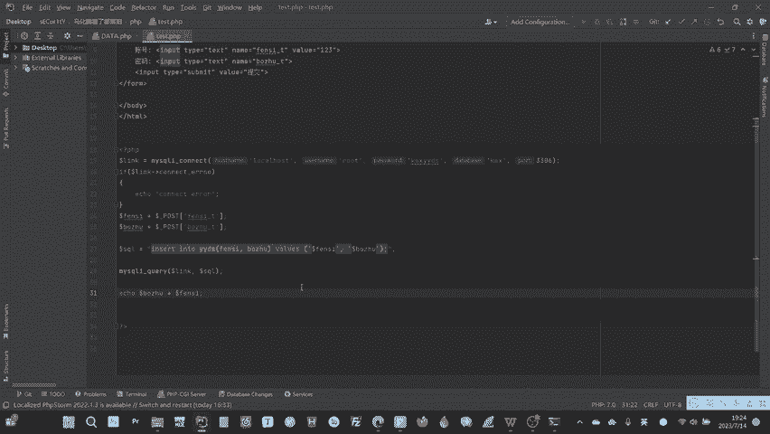

再给看给大家举个例子。b b c。CDE。

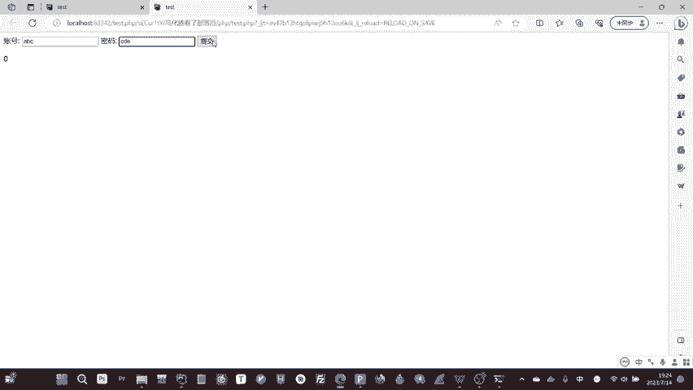

提交。大家看到没有？这地方31他就会给你一个问题啊，因为这个31是在哪个位置啊，在这个位置啊，他说一口这个东西它会不对。但是的话这个里面。

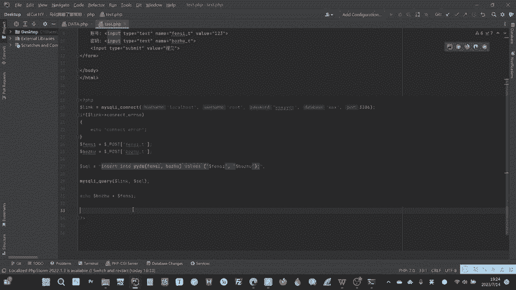

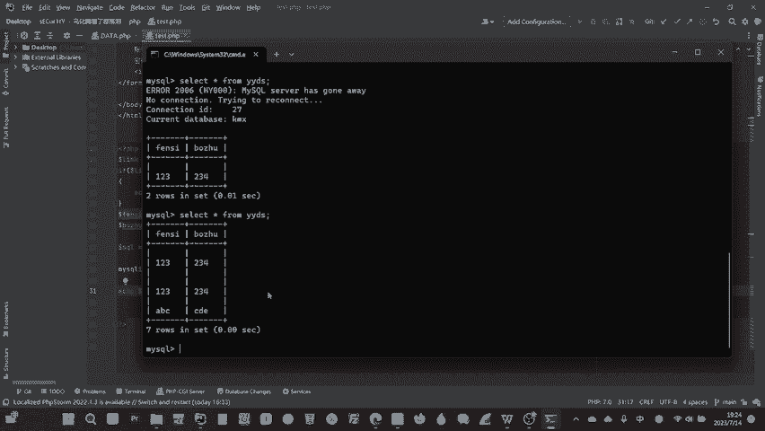

看觉这地方是存进去了。这个地方是存进去的，但这个地方报不错啊，是因为什么呀？是因为你在你这个PHP中，在你加的时候，它是自动把它当做一个数字啊，左两边必须是数字，但是的话它这个地方存的地方是字符串啊。

PHP中的那个相连的数字是这个东西啊，相啊不是相连数字啊，相连的这个字符串的这个符号是这个字符啊。如果说我把连成这样。

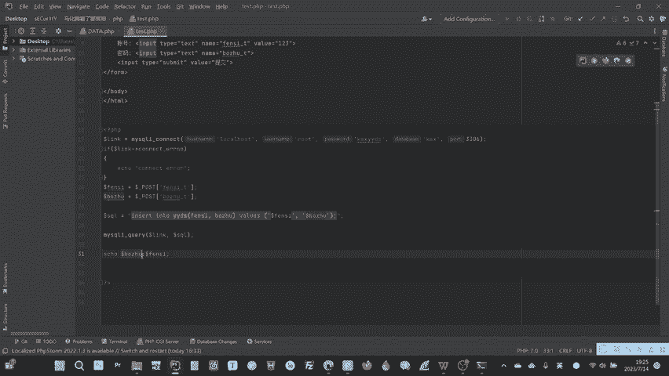

大家再看一下。

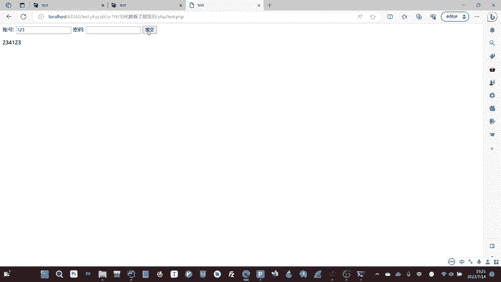

看里面是不是就变成234123了。注不啊？这个是一个坑点啊，有些Javascript，还有有一些那个python的，他学的很好的同学，他在学PHP的时候，他就会遇到一个。呃，很费解的东西。

就是我这个加号啊，它怎么怎么一会儿爆充，一会儿变成数字呢？不是它它的那个连接这个叫做连接符，就是把数字啊，把把任何字符串给拼在一起。这个符号，它是这个。😊，是这个点儿不是加。

大家一定要记清楚啊一定要记清楚啊。同时的话呃这也印证了。你看刚刚我说的是我传的字符串进去，对吧？传了字符串进去，这个字符串它是不是没有自动加的单引号啊，是不是没自动加单引号啊，就是不是就印证了。

我刚才说如果说他自动加了个单号，在这个语里面他是变啊单引号，是不是就报错了也不是报错，这个地方是不是就存了存了还还有个单引号在里面啊，所以我说有些CSDN上的博主，他是乱乱说的，什么自动加单号。

不是他是PHP自动把它挪进来了，自动挪进来了。😊。

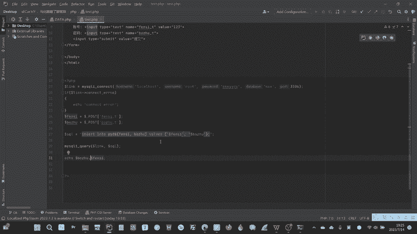

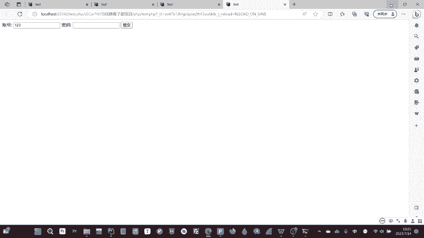

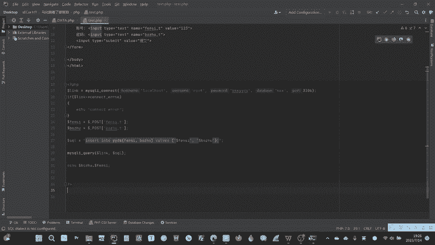

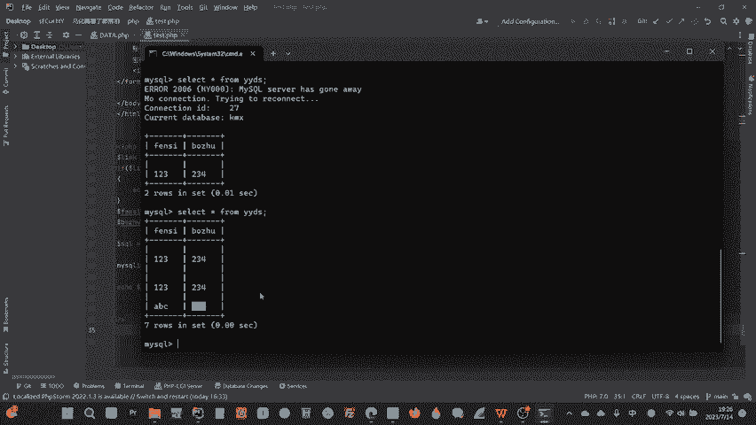

是你自己因为它要满足SQL语言的语法，你给他加的单引号，所以说才会存在什么我输单一号就报错的这个问题啊。是这个原因啊，大家要。搞清楚搞清楚这个东西哦。嗯，不要搞错。好，最后好习惯什么好习惯。

My circle。啊。你都搞忘了。我我都没这个好习惯，但是最好有这个好习惯，特别容易忽略closeok。结束。close系哦。还结束了，还有个link。

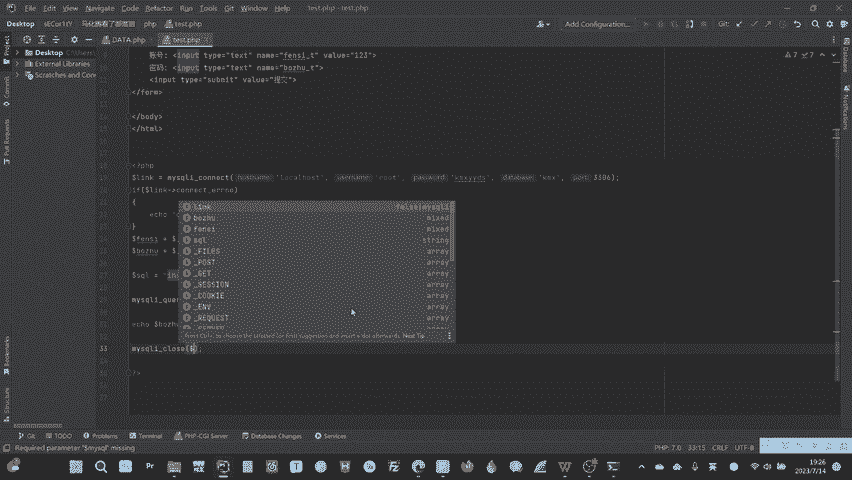

好，现在就实现了一个完整的过程。比如说ABCDE然后呢。哎，粉丝是粉丝是粉丝粉。哎，那密码是什么？密码密码就是看名啊，不是密码啊，博主是看名校的。好，现在是来看一下。

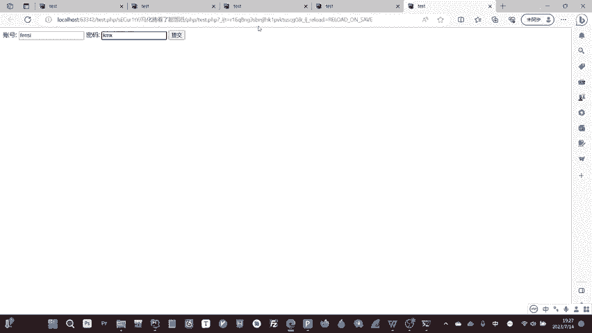

嗯，掉线，不好意思。

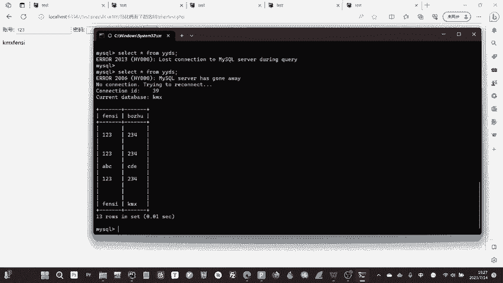

它太久没连接它自动掉线，好，现在又会牵扯出另外一个问题啊。大家有没有想过，假设我输入的是中文，粉丝把它变成粉丝。博主变成博主。提交。

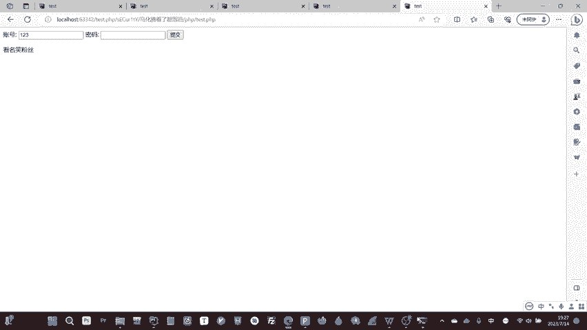

好。那你再看一看这个地方是可以是没有问题的，这地方是没有问题。但是如果说它在linux上就换一个操作系统，比如说我在我的服务器上，我的有邦图的服务器，或者是我的生透OS的服务器。

我再把这个东西换成中文输上去。大家想会不会可能出什么问题？

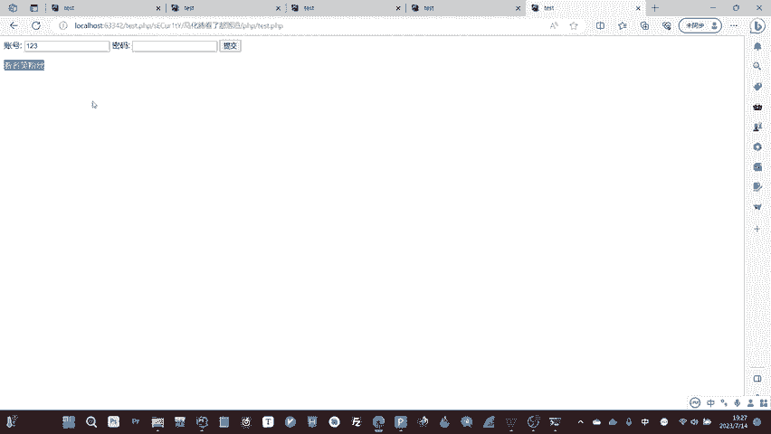

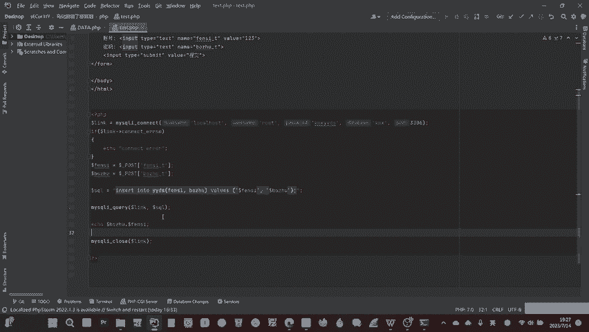

会不会出什么问题，会不会出什么报错，或者是输进去这个数据查不到或者是一串断码啊，这个就是涉及到windows和其他的操作系统的区别了。这也是为什么我之前最开始设置的一个东西啊。

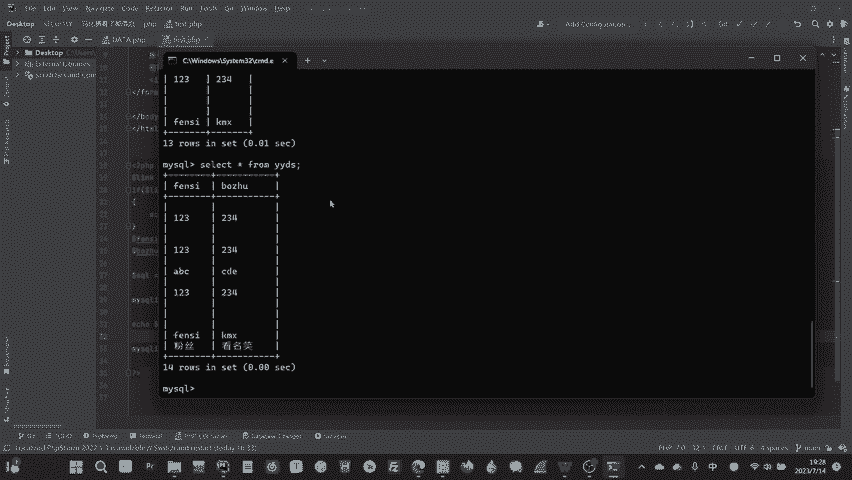

my circle啊SQUI杠 seat。叉se变成UTFUTF8。这就是为什么前面少少加了个东西。Link。为什么要把它设置成U切？ITF8为什么要把它设置成UTF8的意思？就是这个意思？

就是它它会它会出问题。我这地方把它全把它设置成UTF8，我这个读没有问题，但是我的linux上读它也没有问题的。如果说我不设的话，linux上是GB2312，它读出来就是。

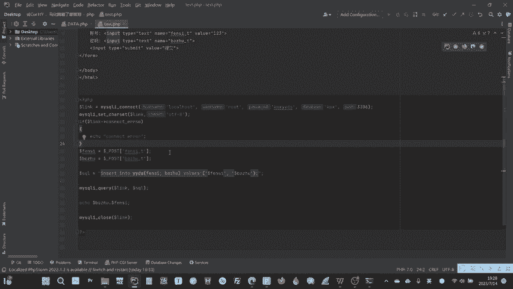

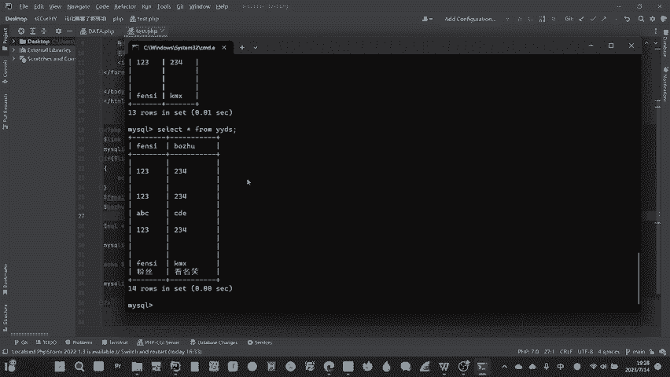

是么吧。是白。就是乱了，你必须要把它设置UUTF8才行啊。呃，今那今天的这个PHP就到这了。大家如果有什么问题的话，大家可以呃评论或者是私信留言都可以啊。好，感谢大家收看。

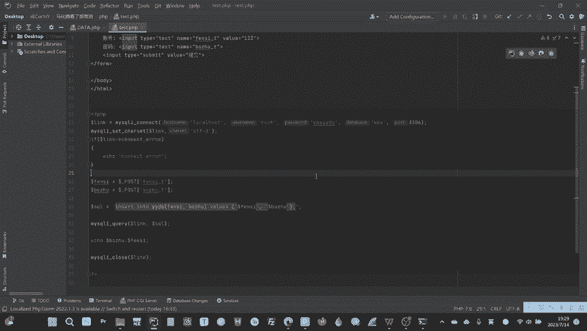