# 0基础WEB安全教学，从开机到拿奖 - P6：第六节 脚本篇（上）python：‘皮松’真有意思捏 - 看名笑 - BV1nW4y1o7T8

hello大家好，欢迎继续收看我们的CM片的教程啊。在本片中我将会给大家介绍一些啊一个很牛逼的教语言叫做python。然后呢前段时间没有更新啊，主要是有一点点的事情。这边然后呢后面的话会继续更新啊。

然呢先给大家介绍一些on的小知识。首先我个人觉得pyon是一个脑瓜子非常牛的一个出来的。为它真的解决了很多你其他语言的一些很麻烦啊很那种很恼火的一些地方。

比如说去动态管理一个内存啊者说去定义一些这种怎么样区区别这个语言哪块哪块这种它真的用的一些很脑筋急转弯的一些方法去把它给做出来。同时的话现存的on版本主要是2。0和on3。0。然后2。03。0的差别。

还有语法习惯实际上是蛮大的。如果说大家平常用的是2。

0的解析器的话，建议大家用3。0啊，因为现在市面上都是用的3。0以上的解析器。后面我们讲的就是3。0以上的解析器。呃，同时的话我觉得学会python的话。

才是真正的呃一个计算机给你是拿给是真正属于你的一个开始。因为你其实很多人就觉得比如说我电脑能够开机的，然后呢呃能够装一些软件啊打一些游戏啊，玩一玩原神啊，这就是呃电脑现在就是我的呢。我现在已经很会用电。

实际上不是啊很多时候你真的你要想用的好计算机，就是你得至少会一门很牛逼的计算机语言，就是你真的想要什么功能。比如说我生活中缺乏什么，我就能马上能开发出来，这才是叫做把你把计算机给用到极致啊。

而不是说单纯的去用别人的开发好的东西啊。难道pyython首先它是一门解释器语啊，解释器语言就有点类似于我们之前介绍的javascript和PHP就是你去官网上下一个python点EXD这个文件。

然后呢，你就可以用这个文这个应用程序去运行你写好的python代码，比如你写到记事本里面啊就可以。当然你也可以用点PY结尾，然后呢这个这个后缀名额，然它就会自动去调用你这个python的解释器。然后呢。

python的话，它是使用一个你在网上下载那个解释器的时候，就会内置的1个PIP点EXXE这个软件啊去大家如果下过pyon都会看到里面有，它就用这个软件去安装这个python的这些库。

这个库什么库就是别人写好的代码定义好的类啊，你可以直接拿来用就别人封装好的一些功能。然正是也通时啊这个python的这个库，它是非常的有特色啊。就pyon可以说它这个语言最大的特色。

就是它有非常非常非常多的库，就是你整个计算机应用范围内，几乎你想要的所有的功能。你想要实现的任何的呃方式，你都可以在python的库里面找到，并且它安装非常的方便。

你就直接PIP已经store了那库的名字就可以了，然后就可以直接在呃程序里面import导入这个库，直接就使用库里面定义好了函数就可以了。然后这也是python，为什么它呃就是它覆盖面那么广的一个原因。

首先它不受这些很多的这种计算机的这种什么限制啊。因为几乎所有的计算机操作系统，它都是配python的解释器。然呢再有一个就是python它呃操作的库真的可以让你呃去实现任何你想要实现的功能。

然后呢pyython它啊这个东西就是刚刚我所说的。好好的学python，我们以后面学任何的呃计算机的方向，无论你是学算法，去开发，还是学人工智能，还是学安全。你最后python才是真正你的工具。

包括你自己用的什么scle map这些东西，也都是python写的。说白了别人写的python代码，一定要好好学python。同时python也可以作为后端啊，你也需要去读一些python的代码。呃。

首先给大家介绍一下python的语法基础啊，python第一啊，python第一个特色就是也是很被大家特别广微知道的特色，就是python它没有大括号。呃，那么没有大括号，你像C圆柱，比如说我打个if。

然那A等于一，然后接下来进行一个判断，对吧？那个大括号是不是就会在E跟在这个if后面，然那你if要if判断之后进入的那个代码，就是大括号那个圈子的。那么它怎么去区分这些代码块的。

那就是用这个缩进的形式啊，缩进好，大家看到你的键盘啊，最左边那一排最左边那一排一个tAB那个键摁一下它就是输入一个缩进，就是一个写它本质上是一个斜下划线加一个T小写字母T这个字符。

你按t就自动输入这个字符。好的，我要给大家演示一下这个没有大括号是什么意思啊。这个没有大括号就是python中的呃，比如说你C语言中啊，比如说我想要输入个if，是不是我就得判断A变量等于一。

然后呢我过来之后，我还得输一个大括号，然呢在这个判断成功之后，是不是就进入这个里面啊，pyon不是python的定义变量。首先pyon定义变量，它不需要任何的标识符。

你就比如说我直接写变量A等于一A等于一好，它就定义那个变量A，然道自动就等于一了，随便你怎么写字符啊，写字符错然都可以啊，所以它就很方便啊。那后它这也产生的一种问题啊，就是比如说我项目太多了。

难后大家第义的变成对撞起来了，或者说其他的这些东西，它就没有一个明确的区分。这就会导致一些项目大项目的问题。所以说很多大项目都用java拍子一般都是作为一个中小型项目的开发一个工具来使用。

然后我们先进这个python判断，python没有每移很多的if啊，什么外都没有那个哎Y，if没有这个括号。比如说衣服我现在判断A等于是一啊，假设A等于一，那我么们就进入这个，大家看见。

我打印一个hello word。好，我先给帮大家打印一个out，给大家看区表。首先啊要告诉大的东西啊，这个东西啊叫做缩进啊，它不是空格空格空格空格啊，很多人就喜欢空格空格空格。不是啊这玩意儿叫缩进啊。

它本它本质上啊这一坨啊本质上是一个。这个字符啊就是这个字符。这个字符。叫做收进感。然后呢，他怎么输入缩紧啊？大家看到你键盘的最左边啊，这个tTAB这个键摁一下它，那你自动输入说键。

你要说你的键盘没有TAB键，那就没办法了，那肯定有TAB键啊，除非被你扣了，肯定有TAB键的，这是标准的国际标准键盘就是长这样了。然到TAB键好，比如说我内部再来一个if啊，if啊A啊等于3。

那么就进入下一个。好，是不是我就打两个table，然后我再print一个3，对吧？大家看一下什么效果，是不是因为它等于一进入一这打一个hello word，然后呢就再出来这个打一个out，就这个意思啊。

就是代表代替代的一个大括号啊，你在C语言中，我如果说判断if，那是不是我就得把这个print写在这个大括号里面，开成就省略啊，这个东西啊，就是它。脑瓜子巧，你知把拍开吧，拍成的脑瓜子很好用啊。

他竟然想到了用缩进这样一个呃又好看，你看是不是又好看又方便的一个方法去替代了这个大括号这个代码块这个东西啊。所以我说他真的很厉害。好的，继续啊。然后那python导入安装好的库啊。

就是inport加这个库的名字啊，这个什么意思啊？首先大家按win加R这个键。如果说你安装好并且配置好了，pion的环境变亮了，你PIP就会在这个里面有个PIP啊。

你就用比如说我安装1个PIPinstore1个NC这个库吧哈NC这个库，让它确定。

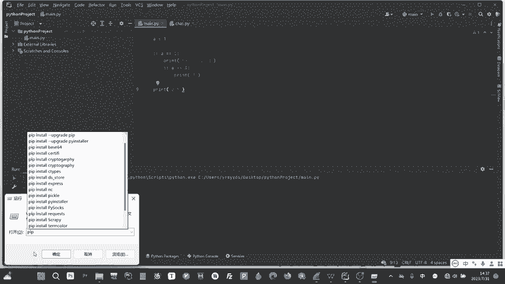

好，它就会安装，你看这个就会调用这个python的一个呃就是官方的一个原。它安装完之后它自动退出啊，这个不是我电脑，然后你安装好之后，你的地方就可以。

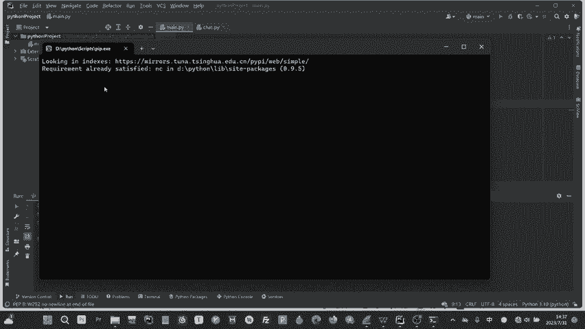

啊，就比如说你import啊ACC。好，他就可以把这个库给导入了。然后这个地方是因为我这个使用的是JB加的这个呃这个软件去编写拍摄了，大家它这个就不会自动就不会跟你的这个原本这个联系起来。

你得在它这个里面单独安装。不过也没关系，这个东西很简单，你的非有这个seing里面。我跟他说一下，吧，自己接B加怎么安装，你fael city，然呢在这个project。

然呢这个python interpretterpreer里边看到没有？这就是你这个项目里面有的库啊，你点那个加号在里面搜索，比如说NC。然后呢。

intstore它本质上就是调用了他自己的一个那个PIP这个软件，让他帮你insstoreall，那你地方搜索它之后好，他过一会儿他就安装好了，地方我看它。我们继续啊。

然后你就用这个inport就把它导入了。我这里面导入这个存在的库，就比如说request。好，这个库就导入成功了。然后我在下面再呃调用这个request的库里面的，比如说里面的方法get方法。

然后给这个get给某一个URL传一个呃get请求过去啊，它就可以调用了，就这个意思啊，它就有点类似于C语言中的。include就导不住一个include的STDIO点H你比如说你想用那个炮函数。

你的C语言中，是不是就得include的。in葫路的呃max点H嘛，对吧？就是这个意思啊，就是别人写好的一些函数和那个类啊。然后呢，就这个意思，in破的很简单。两道python没有慢函数啊。

它是所有的定义的函数，还有这些东西都是从上往下去解析的。什么意思啊？什么叫从上往下解析？就是python。比如说它现在解释器解释这一坨代码，它先解释这个。好，导入解释这个定义变量。好。

解释这个空的解释这个if好行了，进如果说判断为真就进入这儿解释，判断为假就不解释它，就直接跳到呃，就比如说一个缩进，两个缩进，判断所有前面有缩进的，有缩进的都不看，然后就看这个没缩进的好，又到这儿了。

又解释它就这个意思啊。就是一行一行的解释，也正是因为这个你包括想你小C语言啊，java cream呢，还有这些java啊这些。如果说大家用过这个，大家就会知道啊，它实际上这些语言它都是。

他说白了他都是用的用的什么东西啊，用用的从上往下解是这个顺序啊，从上往下解这个顺序。而pyython作者注意到这个时候，他就想哎。既然你都是从上往下解释啊，那为什么我还要单独写个慢函数，对吧？

我单独写个慢函数，为什么不直接我想要在哪个地方解释，我就解释比如无非你这个卖函数就是把它写在了程序的呃某一个地方。那么能不能那我在这个地方再单独写不就OK了，对吧？那他是不是卖函数就可以被替代啊？

大家要思考一下这问题，你想那个卖函数是不是有点多余啊，你定你比如说你有些人要说比如说我定义的函数，我前面定义的函数，它要执行，怎么可能你定义函数，你有那个固定的一个定义的方法，你又没执行它。

他为什么要执行，对吧？你非得要只写一个慢函数来规定这个东西，它还限制了那个位置，剩语言种让python图就解决了这个很好的解决这个问题啊，就是你在哪个位置调用函数，它就在哪执行。啊。

当然了为了那个大项目啊，它有一些地方它为的。为了它去一个方便，他就定义了一些变量。或者说你可以比如说我自定义一个慢说defin就是在hthon中定义那个。嗯，函数的意思啊，很简单，就是你deefine。

然呢加一个就这个DAEF这个关键字，加个函数名，比如第一个man函数，名字叫man，然呢这个让它下去啊，不对，这个地方加个冒号，然后这地方我打印一个print。那。但是在开始中这个慢是你自己定义的。

它不会向C语言中自动执行啊。你要想调用这个慢函数，你就得自己调用。这地方它是自动出那个慢呢，这个不是啊嗯，它就它是不是你得自己调用这个函数。你看它才会打印这个慢。如果说我把这个调用这个关了。

它实际上它也不会啊，在C语言中，你定义慢的时候，它就自动出这来执行的，相当于就是加一个自己执信慢。对吧然后呢还有一种方法就是。这个。嗯。

用这个if line等于是呃line man的这个方法去判断这个是什么意思啊？这个东西就是。嗯。我想下怎怎么给大家解释啊，这个东西就是这这种变量啊，这个这个是本质是个变量对吧？这个本质是个字符串。

然后它是做了个异服判断，这个变量等于这个字符串儿的时候，那么就会执行。然了这个变量大家看到中所有的长成这种两个下划线中间加个名字的这种变量啊，它都代表了一种超全局变量啊。

就这种全局变量它一般都是呃系统预制好的。比如说比如说这个，这个就代表了呃就是运就是代表了就是你你这个就这个文件这个慢点PY这个文件它就代表了这个慢点PY这个文件啊，慢点PY这个文件。

如果说你在运行的时候，这个慢点PY这个文件它就会呃它就会判断判断这个文件是不是作为慢来运行的，这个是什么意思啊？这个东西就是。嗯。我怎么我想怎么给大家解释。

比如说我这个地方导入的一个这个request的这个库，对吧？request的这个库它的实现原理是什么？本质上是别人自己写了一个request点PY，然后上传到thon官方官方把它下载官网上。

I request本质上就是从别人的网上去啊复制了一个这个到你的那个那个库里面。然后你复制下来之后，然后你现在导入实际上就是把这个别人写的这个request点PY加到了你这个这个代码里面。

那么就会出现问题啊。假设这个代码里面，就别人写的这个库里面，有一个print for。😊，那么我运行的时候，是不是就会运行它的这个。request have print for hard word对吧？

是不是就会出问题啊？对吧。大家想想是不是就会出问题啊。如果说别人在request hard word里面加一个iflam等于my。然后运行的时候。我在这个man里面也加个if服那等于 man。

就是所有的。比如说别人就是你想一个开发者，他不可能全都用这个别人的库本，你也得自己写一些库本，对吧？你自己写一些库之后，你为了防止你运行的，就是你比如说我这方实际运行的这个这个文件。呃。

运行的文件受到这些别人写的库里面运行的这些函数的干扰，你就让整个项目开发组的所有人都在库里面加一个这个名字。那么在这个文件运行的时候，运行的时候，它就会给这个line这个文件的这个lan变量定义为这个。

然后呢，在这个文件里面的那么变量，它就不是这个，那么它就不会这个不会不会去运行这个request里面PY里面运运就是设置好的那些要运行的函数，懂意思吧？就是避免了别人在这里面加一些什么稀奇古怪的东西。

同时也放置项防止项目之间互相干扰，因为你肯定运行的函数只有一个主函数，只有一个程序，对吧？啊，大家理解一下，理解不到也没关系，大家反正记住这个格式就行了。

最好加一个这个难那我这地方加一个printful word。啊不为一个A吧。你看吧这本是不是打一算嘛，就这个意思啊，那就把这个当成一个卖函数写吧，也可以不写啊，其实没有什么要求，很多人都不写这个东西啊。

然后啊就这两无非就成两种方式啊，就是一个规范而已。但是官方怎么没有要求你写，对吧？然后呢呃继续啊，刚说多了呃，python中还定义了一些什么特殊的全集变量表述一些特殊的地址和内容啊。对。

你刚才提到这个li，就是说白了就是代表这个文件名嘛，就是这个名字它自身的这个名字是慢，还是说其他的呃酷啊，还是什么什么分支啊这种东西啊。就这个意思啊，还有像这个in。

就是两个项框下加1个INITin这个是in学的检测，初始化的检测。这个东西是定义类啊。呃，这个类什么意思啊？就是你在你在比如说你在CC加里面。你C先加里面定一个，你定一个类呃，你定一个类叫KMX对吧？

你那个那叫KX，你是不是大括号，但是里面比如说啊pri。private，然后private有哪些变量？比如说A等于2，然后啊interA等于2这种的对吧？你是不是就这张问题下面再给它初始化，对吧？

然后是不是就这样初始化，但是在python都是不一样，python中初始化，你是比如说我class一个那叫KMX。好，往往完了之后。😊，你必须要定义一个。初始化。嗯，这个。

这个函这个函数说白了就是一个初始化的函数，它的第一个值必须要是self。这个self你可以理解为它本质上是一个对象，这个对象指的是这个类本身。啊，反正就啊就有点类似于这个东西。

有点类似于C语源中这个this这个指针啊，就是指向了这个类自己啊。这个self就是说白了这个对象就是它个类自己。

然后你必须要定义一个这个你这个每一个类都必须要有意这个每一个类必须有一个这个函数这个函数用于干嘛呢？用于初始化这个类的一些基本成员啊，比如说啊self点A。等于是一，然后呢，self减B等于是2。好。

如果说我不加这个slf。他就会出问。他就会他就会他就会不知道到底是谁的A。比如说我在前面加了个A，那么这下面这个A是不是就变成比如说我的前面加了个A，那是不是就变成一了，我变成成三个。

是不是就把这个变成一了，对吧？它就会很它就会出问题。这个de这个东西它说白了就是就是去初始化这个变量的，大家要记住东西。如果实on让你自己去定义一个类很少啊很少我觉得我用的时候很少去定义一类啊。

最多就是继承编成类，很少自己去定义类，真的很少啊而这个。pa始的这个面向对象有一点点的。有一点点的有一点没那么没那么清晰啊。

我觉得还是个C语言的那个啊C加加的那个面向对象的那个好一点python的面向对象初学者有点抽象，但是你弄不明白没关系啊，很少用，真的很少用，你看我开发这么这么多代码的项目。

就我这个地方做的一个QQ机器人，他怎么从来没有什么类对吧？很少，大家能理解就理解啊，可以去看下就能看，就面向对象的专门讲都讲的很简单，你看那thon定义变量的把写啊。就刚我说了，比如说我定义变量A啊。

直接A等于什么就行了。定义等于字符串等于字符都行啊，都没关系的。😊，然呢，python引入了一个新的负尔语法，呃使得Y和负尔的关系区分开啊，这个什么意思啊？

就是在thon中for尔语法和C语言中的for用法不一样。C语言中的for尔语法，你就是比如说首先第一个是初始化变量嘛A嘛，让它分号嘛，然后呢A条件嘛？比如说A小于10 a等于EA小于10。

又执行的问A加加加上一个大括号语言中是这样对吧？大家就会发现如果说大家弄过C语言就会有一个问题就是就会觉得这个Y这个玩意就是Y这个这个东西这个循环和这个for尔循环非常的相似，甚至是有点多余这个Y循环。

因为你for尔很多时候就是能用for尔只谁会用Y那个Y多麻烦，对吧？for尔完全就几乎提替代了这个Y循环的这个地位啊，on的开发者也是注意到这一点啊，就就相当于就是你那么你循环。

你就只用在thon中你要循环就只有Y。拿个fo把它的内容变了。可能可能th做个for的用法这个规高高智商的这。然后外Y你就Y呗。Y什么什么条件嘛A大于一，然那就是进入一个缩进。

然就比如print一这种图像。然后你for就是说白了变成一个便利啊，它把C语源中的你用for，因为C源中很多时候你用for都是去一个一个的去通过比如说数组一个一个去索引它，但是在不一样。

比如说我现在这个地方进行了一个列表，列表待会给大家介绍。嗯，首先我记一个列表，列表叫做红意。叫做么它拍出来的列表是用这个，它说白了就是一个什么都可以存的一个数组啊，就是一个什么都可以存的数组啊。啊。

首先第一个字符第一个内容是123234，第二个内容是第三个内容是KMX好。啊啊无所谓啊。然后呢我用for。这个fo。首先你可以随便制定一个边量，比如说KMX随便定义一个边量，前面没定义。

你也可以用前面定一的都可以啊。随便定一个变量in。B这个格式forourKMX这个变量应力就是什么意思啊？就是for循环，它不是会不会会不会一个一个去执行嘛？比如说首先它执行第一次。

就让这个KMX这个变量去等于这个它的第一个值。打印一个打印一个吧。打印一个。打印一该大家就懂。看到没有？看到没有？这个地方就是什么意思啊？就是首先第一次啊第一次循环提是嘛，让KMX这个变量去等于它。

然后呢让KMX个变量作为它的载体去进入到这个第一次循环里面。明白我的意思吗？进入到这个第一次这个循环里面就打印到123好，循环结束又回去让KMX作为第二个这个内容的载体。进入到这个循环里面。

一直直到这个列表或者说元组啊或者数组啊啥东西啊，或支符串被遍译完。然后呢就会退出。看内容就是一个一个打，就这个意思，就是说白了就是省去了，你大家思考一下C源中怎么去便利的，是不是forI等于一。

那那I小于10I要加那什么数组AI等于多少print for数组AI对吧啊就很简单，就省去了那个什么一个一个去动便利它的这个方法，它就直接让它就等于它的每一个值分别等于它每一个值，然那带这个循环。

大家就可以进行操作。

大家去感受一下，记这意思。这里为什么要细讲？就是因为这python中它很多东西。他擦用白的你有点降维，有点降维打击的，有一点点有跟那个C语言的那个麻妈妈麻烦分的，拍上去真的很暴躁啊，你可以这么理解。

继续我们说到python的变量类型啊。啊，原来这些图啊都是我从菜鸟教程上截图的，因为我要懒得自己打，因为你自己打的那个截图下来反而不好。拍成菜鸟教程它这个是白色背景的，看着好看一点。大家将就看一下。

首先啊py成的字符串，很简单TR这TR不是说什么类型啊，是只是定义那个名字叫做STR，定义了一个名字叫做STR名类型变成下TR用来存了一个run的字符串。好，来打印字符串就会直接输出这个字符串，来好。

这下给大家介绍一下这个。这个东西啊就是python去去索引这种这种这种数主啊这种东西的一个一个很特殊的这个东西是什么意思啊？就是他就是大家看这儿看这个位置这个位置啊。嗯，首先给大家介绍这个列表。

先给大家介绍列表，列表就是刚刚打的list，这个是列表的名字啊，就你随便什么都可以，123都可以要啊，123不行啊，嗯ABC可以要，然后呢，等于是什么什么什么什么什么内容啊，随便什么内容，这个是整数啊。

这个是浮点数啊，这个是字符串啊，对吧？都可以要。然后呢就是它的内容。然后呢这个地方啊是不是列表变成这个了。假这个地方是第一个列表是这个，分别是这些字母，然后呢。假设在C语言中。

我想索引它的第一个是不是就是列表的名字，加上它的0，加上零就从零开始编码的嘛，0就是第一个一就是第二个。好，然呢这个地方就pyon增加的一个东西，就是第一。就是从从哪个位置开始。

因为你看比如这个rundoRUNOOBR是0，U的编号是一，N的编号是2，来了依次往后，从第一个开始。到第四个啊，不重第啊说错了。从编号为一的开始。

到编号为四的结束不算编号为4的那个这个的意思就什么意思？就是从。从这儿就是从0到30到3就是截取编号0到3的那一段这一段的意思。如果说没有这个2，没有这个冒号2，它就会打印这个RUNO不会打印这个O。

如果说加了这个冒后二就什么意思？就叫不长。步长，就是首先比如说我一4就是从这个位置编号为一到编号4中间扣的这一段，对吧？123啊，不对啊，刚刚说没有这个2，刚刚打印的是UNOUNO啊，不是没有这个R哈。

UNO刚刚说错了啊，首先他截取了这一段，然呢我怎么样去取，每隔两个取一个。就这个意思啊，就是从从这个一到这个3至3个元素，就是一11冒号4嘛，在冒号二的意思就是说从零开始取一个跳一个跳两个字符，取一个。

再跳两个取一个，就这个意思啊，因为它只取到这个三嘛，大家理解一下，就是因为步长就是跳多少个去取，然后打印的最后打印出来就是U和O。因为中间跳了一个N过去，跳嘛，从一跳跳跳两个跳到这个呗。啊。

真的就这个意思。难道大家再看这个字符串就是变成这样了。但是这个东西有个很大的区别，就是那既然有列表呢又有字符串的，大家都可以去这么索引啊，就这么去索引。它。因为字符串也是一个一个的字符拼起来的。

它有什么区别啊？字符串可以通过这种方式去更改啊，不能通过这种方式去更改字符，而列表可以。什么意思啊？列表的，比如说列表的第第一个就是list中括号零等于什么什么，我会去变更这个字字符。

我会去变更这个内容。而在这个字符串里面是不行的。比如说我是STR20等于多少？不行啊，不能这么变更。字符串与列表最大区别。字符串它的索引的内容，它本身内容是不能通过这样去更改它的。然后再说元主。

元主是什么东西啊？元主就是一个就是就是说白了就是一个就是一个不可变的这个list。然后list。啊，例子呢你看吧这个东分可以存原子也是一样的，什么都可以存，但是它不可变啊。

原子更原来存一些呃敏感的一些数据啊，或者说一些防止用户什么乱改的这种东西啊。然后呢呃字符串说反正就是一个一个字符存在了存在了原组里面，你可以这么理解，就是一字符串就是一个一个字符存在了存在了原组里面。

然后呢，sit就是集合啊，这个不管这个就是这个。用不到，实际上真正大家平常用的就是字符串和列表，还有字典，原组的用的很少。集合说白了就是就是一个弱弱一点点的字典。字典这里给大家介绍字典啊。

字典什么意思啊？字典东西就是一个大家想一想啊，你在翻阅中华字典的时候，你是不是你得一个拼音啊，就是比如说就是它是一个对应关系啊，有拼音，那么就会对应一个字。啊，不对，有一个字儿就会对应一个拼音，对吧？

就是这样一个对应关系。字点就是你前面有一个键值，这个玩意儿就叫键。键值键值键会对应一个呃它的内容。就比如说你像你这个键盘这么某列，你左上角的第一个键是ESC它对应的内容就是ESC对吧？

键的名字叫ESC键，它打印的内容就是ESC这个功能，它键值就这个意思。所以为什么它叫键。然后这个定义一个字典啊，随便定义了个字典名字，然后呢等于是大括号，然后呢见的指见键。键的名字。

哪个键的值逗号键的名字键的值逗号键的名字键的值随便怎么定啊，随便加都可以摇。然后呢这些就是一些基本的那个怎么去访问啊，怎么去更改的方法，字典是可以更改的这个东西。

比如说我把呃比如说我这样这样去中括号加一个这个键的名字，就代表了这个键的值，把这个键的值就是键名为Y万的这个。键的值改成为这个一杠参0教程，就这个意思啊。看看一下输出位机变成了呃就会输出这个东西。

那这个地方就是一些特殊的方案，就是没什么区别，就说白了就是怎么存东西啊，大家看一看实在不行，百度一下也可以百度的懂啊。

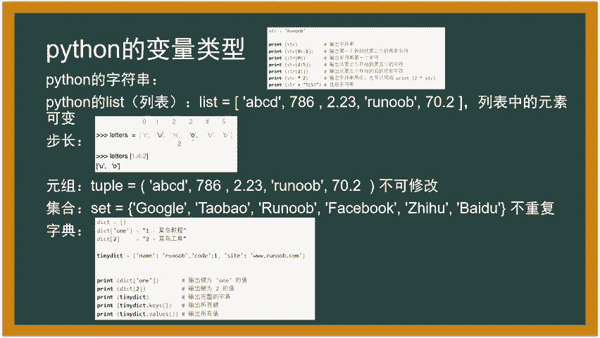

呃，这个地方就不说这个啊，接下来我们来说最重要的，就拍成怎么用啊。我觉得这个东西脚本语言，说白了这些什么什么细致的这些东西都没有意义也不是没有意义，就是意义都不是很大。最重要的是。最重要的是怎么用它。

对吧？怎么样把它当成工具用起来啊，要用它啊，首先要说到几个重要的东西就是。呃，拍成中有一个特殊的一个呃字符哦，一个特殊的字符串，就是前面加了个B，一个小写的B加一个单引号里面里面多数都是一些十六进制的。

呃，十六进制啊或者说二进制的一些哦不就十六进制的一些数啊，或的二游戏是二进制啊，它就是一段比特流啊，就是一段自节流啊，你就不用你你现在理解不要自节流，你也可以不用管啊。如果你学的那个既网啊。

这些你就懂啊，它就是一段自节流，说白了就是就是你看不懂，就是你自肉眼看不懂的东西。当然你可以用这个字符串点decode的方法，可以把它变成正常的可读的字符串啊。啊。

有些人不不要把这个抵扣的那个给给给给给看成了把这个双引号和这个B给去掉啊，不是这个意思啊，他是把它从16进子变成了你眼睛毒的那种啊。比如说。十六进制的机器数变成了你眼睛能毒的十六进制。好吧。

反正可能不太好理解，反正就这个意思啊，就是把它给抵扣了一下，它会默认变成UTF8变了啊，抵扣的都是默认变成UTF8变了。然后字符串内置的内容啊，内置的内容就是呃比如说我我想要比如说我现在字符串有123。

我想要改它把里面的ABCABCDFG有这个字符串ABCDF想把ABC改成123，那就replace，然后呢比如说字符的那个字符等于A要A点replace括号。

然后呢这个地方加个字符串要改成么字符串ABC就是双引号啊，单引号ABC然后呢替换成什么呢？单引号123啊，就把它替换了所有的ABC的替换。

等个意思啊？list就是list列表这种就这种列表这种对象。比如说我现在已经新建了一个这列表，然后它的名字叫list，它可以使用upend向后面添加元素。就比如说list点upend。

然后我再给它添加一个123进去就可以了，也是一样的，没什么没什么好说的。

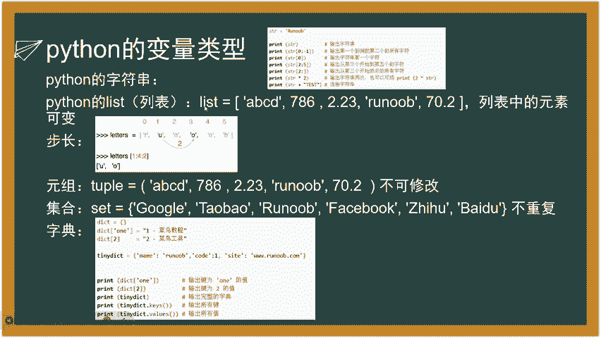

那个特殊的用法，if什么什么in。这个东西什么意思啊？这个东西就是就是省略了你去判断，比如说一个字符串或者说一个列表或者说一个字典这种存东西的这种内容里面是不是有某个指针，或者是不是有某一段字符串。

就比如说ifABC在ABCDFG里面，那么就为正，或者说ifABC在。

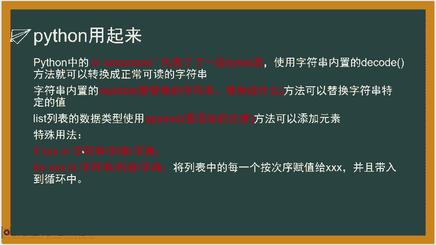

在这个列表里面，它也会被整高。但是啊但是列表里面它就会一个一个去索引，让道判断是不是有啊，你像ABCD它就没有啊。APC基本上注意区别啊，字符串和这种东西是有区别的。

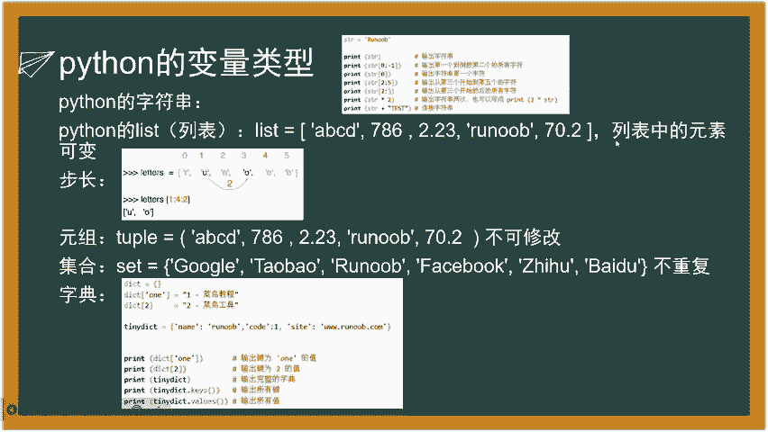

然呢for什么什么印，这个就是一个一个顺序便利嘛，这个东西就不说刚演示了大。原来接下来就进入到今天最重要的。最重要的胃部安全。用python的库就是未安全最重要的一个python的库就是request。

呃，以后面学cir注入，还是学叉SS还是学啥玩意儿，还是学什么呃爬虫啊，还是学什么人工智能啊，还是说什么安全开发，都得用这个库啊，你也可以用啊UL3再用我觉得U3不好用啊。

我觉得最好用的就是request的库。还有些人用那个什么scket的编程啊，那个scket编程也不好用啊。

我觉得scket编程你做安全研究好用一点推荐啊推荐写脚本就用这个request的库最好因它内置的很多很方便的东西啊。首先第一要怎么安装PIPstore这个就不说了。呃，发送请求的语法啊。嗯。

这个东西我觉得后明天给大家开一节那个配置服务器，还有那个计算机网络基本原理的一门课，给大家讲一下这些东西是什么东西啊。呃，首先比如说我发的请求语法这个东西是请求投啊。比如说我给他发给HTTP请求。

就上节课我们说的什么get请求啊，pos的请求，它都属于HTTP协议的请求HTTP协议什么意思？HTTP协议就是就这个就这个网址，这个东西就是调用的HTTPS协议。

对吧懂懂我意思吧？这个就就是调调调用的HTTPS协议。

而你也有个HTTP嘛，HTPSS有多少个S嘛，就是加了个证书。然后再调用这个HTP协议，你就得给他，你要给他传HTTP协议的请求，你也得在他有规范对吧？协议里面总得签签东西吧。这些请求头就是要签的东西。

user userer agent这个请求头就是用户的代理。就说白了用户用的浏览器。用户用的浏览器什么版本的什么型号的，有些啊有些那个服务器，它就会检验了，不符不合法的，全部给你打回去了。

然后pars就是用get请求啊，这个东西都是都是po的，你要给他传一个，你看这地方po的请求才有这些东西啊。po的请求才是这些东西啊，get请求，get请求是没有这个data的。get请求。

你也可以用par这个说白了就是用。呃，就是用URL去给你传，你也可以不要这个power，你也可以在这个URL后面加一个问号。比如这个地方HTPS啊，你想给他传get请求问号，然后呢。

什么值ABC等于什么？然后呢，且就那个那个语符号，两个语符号，然后呢什么什么等于什么，这个就传get请求，就是用URL传这个power给它传的本质就是就是在URL上面给它加一个加了两个值啊。

加了个问号横加两个值。问号就是一个传K的请求的一个特殊的一个呃格式啊，不懂得回头。明天给常磕磕课的给大家讲一下。data这个东西就是po的一个特有的一个内容，就是呃就说白就是内容吧。

内容里面有某什么变量啊，内容什么之道，我给大家看一个看一个东西啊，大家应该就好理解啊。

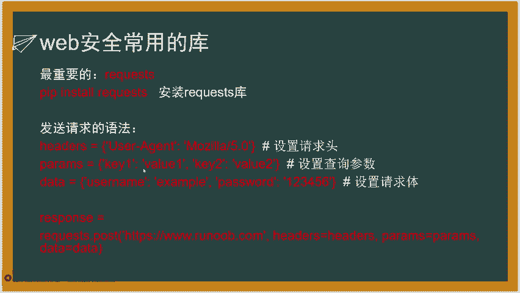

呃，这个是1个HTP的一个流量啊。你看这地方这个地方上面这个地方是协议啊，协议什么协协议啊，就是玩sha抓的包啊，呃，比示这个HTP协议，当后里面有个post，这个地方看没有？post的请求。

你看这个地方问号。看到没有？subit里PHP访问的PHP这个文文网页，让来加了个问号ID等于什么，就给他传了个get请求，get请求传了个变量回去，变量名字叫IDID的值等于它就这个意思。

来点开看一下吧，你看看看。对吧这些东西什么accept啊，还有con type agent就这个使用的是火狐啊，火狐more more，然点4。0。

然这些东西还有host这些东西叫做这个Uer agentent host把这些请求投啊就是一个HTTP议固有的一些规范的一些内容啊，就是这个东西啊，回头给大家再讲一下，那data什么东西啊。

data就是data就这个东西啊data。就是传的内容，传了一个传了一坨这个16斤的数过去啊。嗯，就这个东西啊，这个不是你这个传了一种哈西直过去啊。就传了个这个data数据过去了。

然后呢然后呢呃就是这个意思。然后呢再给大家说一下这个request的这个库里面的一个呃内置的一些函数啊，它可以传data的请求，也可以传get po的请求。这地方我们重点讲pos的请求。

因为pos的请求比get请求要复杂一些。

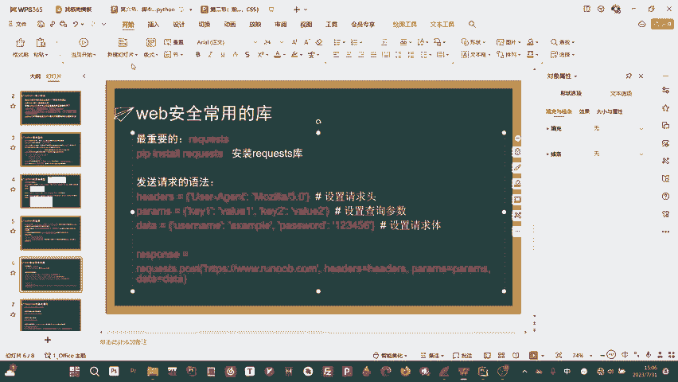

首先。python怎么调入re个的库的个post的这个方法啊。它是request的这个库的名字点，说白了就是从它这个内这个这个库里面去调用这个方法，方法的名字叫post，就这个函数。

这个函数能够向这个网页就这个URL是白了，这个网页发送。一个pos的请求，后面是参数headers就比如说请求投入等于是你之前定义好的这个字典等于它那呢它的gate请求穿的参数就是它那那data等于是它。

然后我给大家简单提一嘴，就是。传pos的请求是可以既传给请求，又传pos的请求的。但是你传get请求是不能不能传这个data这个主体的，是只能传get请求。也就是这一坨的，大家要清楚一点啊。

所以说pos的请求能够传的东西更多。能够传的东西更。嗯，就数量更大一些。同时的话，加密度也会高一些。然后呢，它会啊这个函数啊，它会返回一个信息，就比如说我访问了网页，对吧？我用我向网页发了那么多请求。

返回了一那些那个网页啊，这个蔡联中，他是不是会给我传一个呃，是不是会给我返回一些东西，显示在网页上这个显示在网页上的东西，本质上是什么？本质上是不是就是他的HTML代码，对吧？是不是里面还有很多的标签。

还有什么GS函数啊，CSS函数啊，这些东西，它是不是就会他这个返回的这个response对象？说白了就是集成的这些代码呀，还有什么状态码，状态码就是。404note放的。

大家觉得我比如说你想访问一个百度网盘，嗯，然后你点进去一看这个东西已经已经下架了，然后就变成404note放，你就找不到这种东西叫状态码。那个404有状态码，常见的状态码还有呃500啊。

52502啊这些东西，这些状态码，4002如果说正常访问就是200状态码。200。200200状态码就是正常访问，没什么问题，是吧？那他这个response里面就集成了什么状态码呀。

还有它的那个呃返回的那个HTML界面的源码。然后你就可以通过这个response去调用。比如说我想打印一个，比如说我现在posts给它访问的。好，然后呢打印一个状态码，它就会打印200。

或打印502什么东西啊，然后呢打印它的编码这东西比如什么UTF8呀64啊，是不64K这的打印它UR这东都是冗局啊，最重要的是这个东西啊，这个test。啊。

text就是比我打印这个这个这个这个response对象中的这个内容，就说白了文本这个文本就是返回的这个。

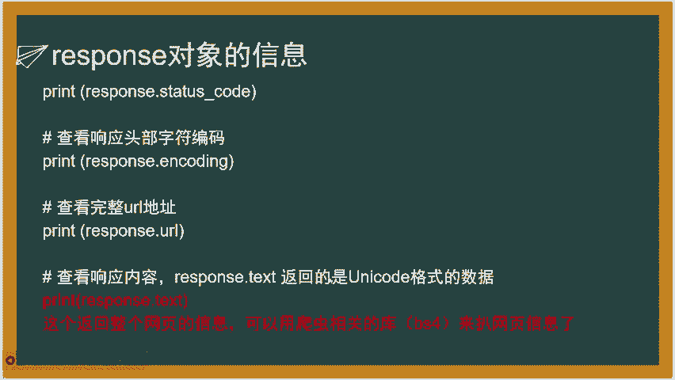

这个这个H。

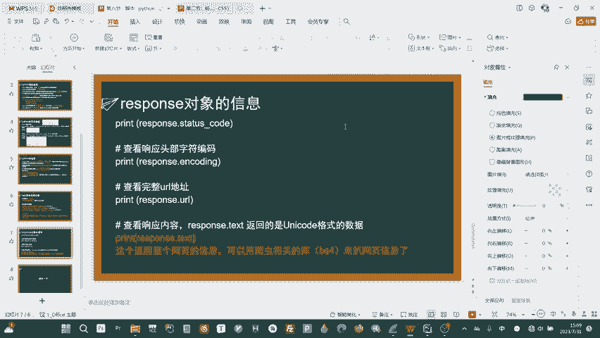

我怎么跟你们解释一下。比如说这个网页。

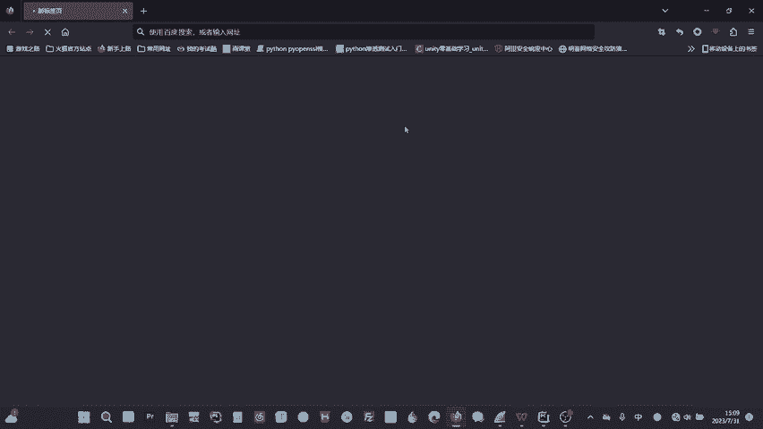

我现在打开了。啊，现在因为我现在啊现在断网了，暂时跟大家说，你是有他这个网也有代码的，就是这个东西啊，HTML源码就是这个网页核心的东西。你你去访问任何的网页，甚至你的百度啊这些的主页。

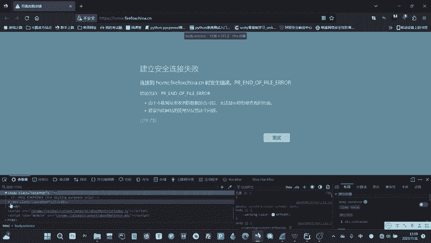

如果说你没给他传get请求，本质上也是给他传了一个啊get请求。这个get请求的请求内容就是这个网页的源代码。而这个源代码就会被你存在的这个这个这个这个response对象的text这个这个变量里面。

这个text的变量，说白了就是一个经过unic的编码呢，一个网页源代码。

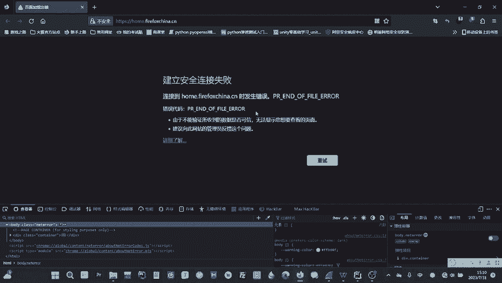

然后呢，你获取了这个网页源代码之后。它就可以用一些爬虫相关的库，比如说BS4这种可以解析这种呃HTM元素的这种这种库，它就可以用来爬这个网页信息了。呃，就是这个意思，爬虫就这个意思。

就说白了我比如说我写个for，让那我通过IP地址，一个一个一个一个的去访问，每访问一个，我就返回一个网页源代码。然后呢再用B是从里面爬取，比如什么P段落啊嗯网页段落啊。

或者是什么link呀这种的标签的内容，它不就是爬虫吗爬虫就是这个意思。大家听懂了，所以说拍on爬虫为什么东东西很重要啊？

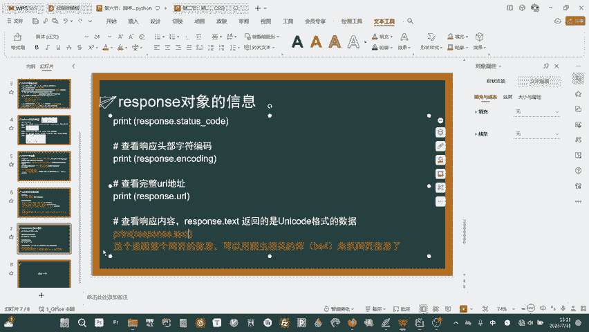

就是这个意思啊，给大家演示一下。我现在给大家演示一个这个。呃，演示一个怎么去写一个去爬那个维基百科的一个脚本啊。啊，怎么去爬危机百科的脚本啊？首先第一步啊。首先啊。我是不是得先准备好我的裤，对吧？哎。

是不是这importimport一个什么东西呢？import一个。嗯，呀个快的酷。好，我现在官方的请求，他给我返回内容的是不是还不够啊，但我们先写成这样，先写成这样，先导这个request的库。

然后呢好，我现在定一个函数，这个函数就是。啊，危机就是获取危机摆科的内容。有几百科内容哈，我调用这个函数，比如说我在外面调用函数的时候，是不是要给他你想要该穿什么东西啊，是不是要给他传。

我要查的什么内容啊，比如说我想查python。查一个python，那我是不是就得就得给它传一个变量，叫python，你是不是中西叫字符串了？那我们就给它传定一个参数叫做test。好，一个冒后。然后呢嗯。

怎么怎么传啊？首先是不是我们得向维基百科传请求啊，发一个请求，或去咱呢获取他网页的源代码，然然再把这网源代码处理一下，就得到了我们要爬取的信息，对吧？啊，然后这个网易源代码这个网页的内容在哪儿啊？啊？

我这地方我就直接给大家拿这个机器人的给大家给大家看。我因为我的机器人里面。写过哈，就这个。我给大家重重做一下这个函数，这个就是获取网页源代码，什么意思啊？首先第一个函数叫做获取维基百科的信息啊。

title就是呃获取的。比如说我要想在维基百科上搜什么东西，搜一个python的内容啊，对就这个地方加上好，然后我定义一个变量接URL用来存取这个维基百科的这个网站啊。

首先这个网站是这个然呢在这个网站的后面加上这个title，这个什么意思啊？这个东西叫做OA这个东西就是很神奇啊，就是你你得去网上去注意一些这个特性啊。去网上去注意一些这些特征呢。嗯。等一下。我现在这个。

掉掉网卡了。呃，他去获取一些这个特征啊，就是获取了这个特征之后，它就可以啊你比如说去网上，因为你去大家可以去试一下，我现在这儿没有网啊，给大家，大家可以去试试一下。就是你访问这个网这个网站。

然后在这个斜下划线后面加上你想要搜的内容。实际上就是维基百科的。这个的内容的主页。然呢就用这种巧妙的方式加上一个这种我想要访问的内容，相当于就是这个网这样一个网页，这个加就是把字符串拼在一起。

就得到了一个这个呃我想要查着这个内容的一个那个主页。好，然道我现在。response定义一个变量用来存这个request这个请这个这个库的一个呃传传给这个URL的一个那个post信息啊。

我现在po你用get也可以要，都这个地方无所谓，因为它没有什么用到post的一些传变量的，你只是访问的这个页面来获取它的源代码。好，访问了这个页面获取源代码之后。

然后这个地方再用这个HTM content，就说白了定一个变量去存这个response的这个text，就是它的原代码，然后呢再定一个sup。

等于嗯beautiful soup hT yolk那加这个HTM for啊，这个东西是什么意思啊？这个东西就是。呃，就是个函数内置的功能啊，说白了就是就是把这个源代码传进去。这个地方就是HTML解析器。

是它自己这个这个库函数里面定义的。我的地方没有，这地方必须要导住啊。import它是在BS4这个库里面。嗯，再给大家说一下，如果说你想从一个库里面调用一个单独的一个方法，或者说什么呃内容的话。

你得用这种方法，从BS4库里面。And import。import呃 BE beautifulautyful。This soup。打错了不意。fromB4经破了啊，这个地方就可以了。

这个地方就会显示为正常的。然后呢，这个地方就是调用这个库里面，因为你就是因为如果说我不这么写，我直接导入BS4库，我是不是还得BS4点。然后我后面每一解析一个都得BS4点B4点，觉得麻烦烦很麻烦，对吧？

而且我平常BS库里面我只用这个函数。那我就用这个方法，它就可以很快的去啊，就是直接打出我想用的函数了。就不用再打那BS4点了。然后呢。

你就用sup来存这个beautiful soup这个东这个东西就是说白了就是解析这个HTML这个呃源代码，然后它就会返回这个解析的这个对象。然后呢，你这个解析的对象里面就包含什么？

包含了所有的就是解析过后的这些什么呃P段路啊，或者说什么。呃或者说什么link啊，A呀这些的。元素的这个信息，你用这个来存。然呢你用这个东西poweragraphs，说白就是段落嘛。

因为我因为它这个维基版更强，维基版跟它这个网页源代码，它是不是通过。比如说我比如说我想查询python，那么python它是不是下面有很多的介绍，对吧？这个介绍。

那肯定是不是存在了很多这个P这个元素里面的，就是1个PP这个元素。在那后面HTM标签里面就很多的这种什么介绍这些东西。那么我就用一个这个呃这说白了它是一个它本身它是一个它是一个。一个一个那个一个字典。

他反馈的是一个字典，然后那个字典里面有很多的那个标签的名字，标签的名字里面对应的标签的内容，还有属性。然呢你用这个地方点finore就可以查找所有的这个段落这个P标签。P标签。

然道把这个P标签作为一个作为一个作为一个什么？嗯，作为一个。一个一个。一个一一个列表。作为一个列表返回给这个复制给他。然后现在它就是这个存的所有批标签内容的一个列表。好。

然后呢你再定一个这个啊这个东西你可以。哎，这个就就是说白了就再定一个end来存这个最终的那个最终的这个就是什么提取出来内容嘛，对吧？然那你再定一个id于0。

然后就用forour paragraph在这个里面每一个去便利它，然来让这个最终的这个值去一个一个的。首先最终的这个值它是空的，那呢等于是它去加上它的这个内容，然呢同时替换这个是没事。就是维纪百科内容。

你本身访问的时候，它是一个它是有很多的那个换行符是没有解析的。它换行符直接就是一个斜杠N。我现在那些换行符那斜杠N非常的影响我的影响我的美感或者是观感。我就把那些换行符全部都替换为空。

就用这个方法去就是内容去替换为空，就把它的换行符，就是个斜杠N这个东西给替换，来就让它看就更好看。同时再把这个呃内容给拼接到这个end里面。然后呢这个地方是个I加的一，然后I大于6。

就说白了我取这个意思就是取6个。当取到6个这个P段落的时候就停止。因为我不需要它太长了嘛，你百合太长了，几十个P，我只取6个P，简单的介绍一下主要的东西就可以了。好，现在我拼接了6个P段落之后。

这个N就成了我最终要得到的值，那么就成了我想要看到的字符串，然后呢，我再返回这个N的这个字符串，这个地方我再来接受它。嗯。等一下啊。x就是说我定一个变量，然它用来存。存这个函数的就是我想查询。Tson。

好，那再打印一个text。好了，我这里刚刚重启了一些电脑，把网给连上了一下，给大家演示一下。现在我运行的话，它也它就会去查这个。嗯，对，看到没有？

这个地方就是我从那个围基百X上去爬到的这个python的这个。这个解释的那容，你看它就是取了6个这个P的段落啊，呃，可以给大家看一下，因为这个东西很神奇啊，就你得去这个东西说白了就是一个拍。

就是它这个维基百科的1个API啊。这个API的内容就是你一旦访问这个路由，后面跟上名字就会去搜索这个呃相关的这个资料。可以给大家。大家看一看这个什么东西。

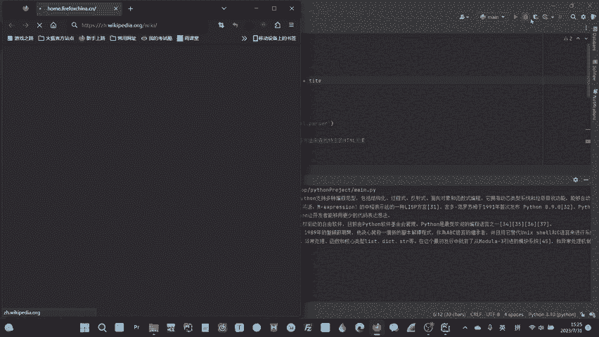

看到没有？这个地方就是危机百科，它自动会访问它的首页。如果说啊比如说我访问一个拍on给大家看一下它什么效果。

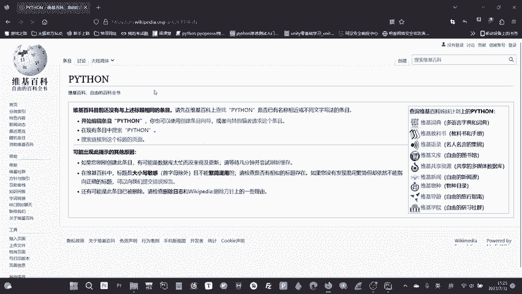

看到没有？这个就是哎等一下。好了，看到没有？这就是python的它的内容啊，你甚至你可以去搜一下你的学校。你比如说啊你比如说我搜一个北京大学啊。看到没有，它就会有的那我这地方加上当我搜索的时候。

我比如说用户输入北京大学，然后他就会呃去获取北京大学。你看一下，比如说北京大学的F12。好，看到没有？这个方现会。你看这个dve这个内容里边可以给大家给大家看一看它是内容什么东西。

这东西就是你得去网上去啊，比如说你要想找什么东西，你得去获取这个就是你得去分析，对吧？你总得分析一下，因为你得分析一下这种比如说前端开发员他的这种。

性格你看你看看看这些这些内容P就是全部都存在这个这种这种P段落里面的。你把P段落里面的内容全部都给他看到没有？这些东西给他给提出来。给他给提出来，然后呢。就获取到了是不是我想要的这些呃什么信息啊。

这些东西全部都拿出来了，对吧？然后就等于说白了就做了个这种预先处理，然后你甚至可以嗯一篇一篇的爬了，你可以加个for，一篇以及轮流的去变译，然后查询维基百科上所有的这些东西，把它全部都挪下来。

然后存到你的数据库里面，就是这样一个功能啊。嗯，很有意思啊。那今天的这个拍审的课就到这儿啊，啊感谢大家收看。

