# 0基础WEB安全教学，从开机到拿奖 - P7：第七节 网络基础：量子计算机为什么牛逼 - 看名笑 - BV1nW4y1o7T8

好的，各位同学大家好，欢迎继续收看我们的we部教程啊，头几天停更了一下，主要是在外面做项目，没什么时间。然后呢，后面会继续更新这个卫部片的CTF教程。然后呢。

本次是第七节课会给大家嗯介绍一些比较重要的网络基础。然后呢，告诉大家一些后面可能会用到的一些知识。

呃，首先是网络和协议啊，呃给大家说一下协议是什么东西啊，协议它就是大家见过合同吧。那个合同上是不是有很多的项目啊，他就是有像什么甲方啊，乙方啊，分别是谁这种。那一个合同，他要是要能够有法律效益。

法庭能够认他。他首先最重要的是他肯定得有呃，比如说法人你得有吧，难道甲方乙方难道要干嘛，时间期效都有吧，对吧？这就是一个合同拟定的一个项目，那协议它就像是合同啊，那那他这个协议它就是一个合同。

它拟定的规定的一个数据包，或者说传输的这个媒介啊，他每一个媒介中的不同的项目必须是什么？同时必须是规定有哪几样啊。这边可以看到这是我用它是一个抓包的工具啊，大家可以去下一下，我这个是汉化版的。

然楠他这个它是去抓了一个HttP请求的一个get请求的包大家可以看到这个就是一个请求议中就有很多请求头像hos比如说像这啊，这些都是请求头啊，他这些东西都是固定的。你不能他。

他就这个accept还有这个就必须要大小就不能改成小写，就是他让你写什么，你就得写什么。然像比这就可选的er也是不固定的包括也是可选的。比说你可以直接你也可以这这都可以接受他就是一个规定。

他规定的就按他规定的去弄。呃，然后呢给大家说一下网络什么东西啊，网络它是有很多很多层啊。这里首先说最经典，就是大家有很多很多说法，网上有很多的说法，那个网络分成七层、八层啊，这些东西都有啊啊。

这里最主要说最重要的5个啊，就是首先是物理层淀由下往上了，物理层、电筑层、网络层传输层，还有应用层。然后呢，物理层就是呃物理设备嘛，网络，比如说你的主机呀，还有这些东西。

链路就是把那个从电信号转换成一个呃其他硬盘能够读的一个那个帧。啊，大家知道链路层的传输的媒介是真啊。呃，然后呢，在网上就是我们大家网络安全所主要研究的三个层呢，也是大家平常能够接触得到的。

比如说像网络层啊，网络层就是呃ARP协议或者说IP协议啊，IP协议就是什么？就是IP协议就是一个去呃，就在网络上你得定位别人IP就是说不了别人的定址。别人的地址，你得去找到别人。

你就得有1个IP地址去定向它。然后呢，IP协议这个协议就是典型的网络层的一个协议。还有就是传输层啊，传输层就是很常见的就TCP和UDP啊嗯我们平常使用的一些像HTPFTP啊SMTP啊这些的一些应用类的协议。

它都是被包裹在那个TCP和UDP还有一些其他的这种传输层的协议里面而应用层就是我们大家正常所使用。比如我首先建立那个TCP连接。

这就是建立TCP连接然建立TCP连接之后向那个TCP连接后面的认证之后的那个主机去发送一个HTTP请求对吧？那或者说FTP去传文件啊协议啊，它就是在不同的网络层里面有非常非常多的协议啊。成与层之间通信。

甚至是同一个网络主机或者说向别的网络主机去通信，它都是用大量的协议这种协议它就构成了我们所认识的网络大家理解一下协议就是说白了就是规定这个数据包该怎么发我这边给你说。发一个协议规定的数据包过去。

你那边根据这个协议的内容去解析，那来我才能解析懂，不然我给你说一大堆，你不明白是什么东西，牛头不对，马嘴，对吧？然后呢哎就说到协议给大家补充一下。就是现在说为什么物联网啊物联网就IOT嘛。

物联网大家一直都没有一个那个很牛逼的一个发展。就是说什么？就是因为全世界啊没有那个一个很牛，现在全世界都缺一个很牛逼的一个大头去规范一个物联网的这个协议出来，就是一个当然小米啊，中国人跟小米啊。

他就很想去做这个物联网大头啊。嗯，大家拭目带啊，不知道谁能够最后成为这个规定物联网这个规范化协议的这个公司出来啊，希望是小米啊。

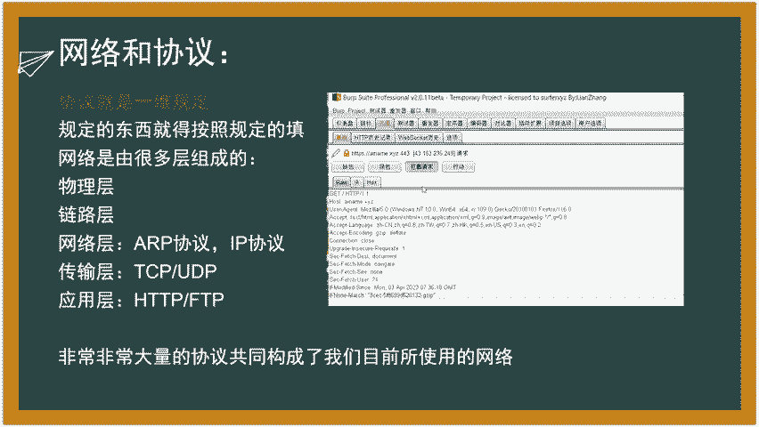

呃，紧接着是域名和DNS域名和DNS什么东西啊？呃，首先啊我刚刚刚刚我们说的那个这个网络层里面有个IP协议，对吧？IP协议就说白了就是IP地址。大家都是在公网上公网上有很多的IP你要去访问公网上其他主。

比如说你要访问百度啊。你首先本质上比如说大家访问的就是百度点com对吧？我在那个呃浏览器的栏目里面，我输入百度点com我去访问它百度点com这个东西就百度加一个点，加一个com这个东西。

整个就叫它的域名。

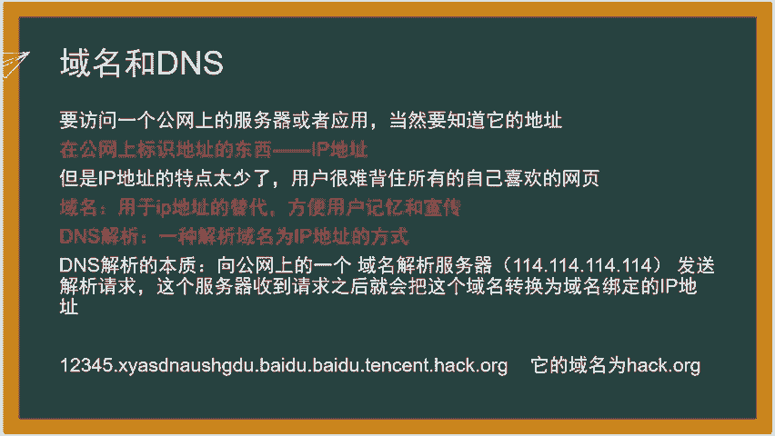

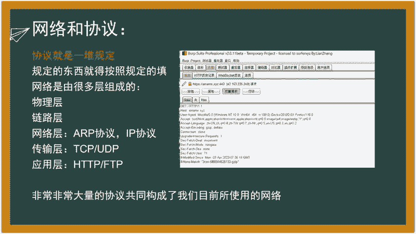

而你访问域名的本质就是去访问百度的那台挂在了他这个呃百度这些网页的这个服务器的IP地址，对吧？大家永远都知道，你在公网上去访问其他的主机，永远都本质都是访问IP地址。

IP地址理论上来说是可以准确定位得到呃主机的。有人说有人叫杠。那个比如说代理，我挂个代理挂个美国的代理，我去访问别人啊，那也是那也是可以定位的。你挂个美国的代理，那就是用美国的主机我找到美国的主机。

那确实定位到了那个美国的主机，对吧？就是说了公网上就是一个一个唯一的一个标识啊，就是IP地址啊IP地址IPV4就你可以简单理解IPV4就是这种就是四个四个点的这种IPV6就是啊对IPV4三个点啊。

就是四个字段嘛IPV6就是呃6个点的还有加上那个16进制啊，就是它变得更多了。同时的话它也能够包含的就更多IPV4现在已经是已经是全国全国啊已经是全世界通用的同时的话IPV4头几年就已经爆满了。

也就是因为IPV4爆满，所以说才IPV6的去补充还有那么多的IP地址没有人。没有12么需人们需要去用，对吧？还有不同的公司，他需要申请1IP地址的。那那这里需要给大家说为什么会域名这个东西啊？

既然IP它是唯一访问的，为什么大家不去访问IP啊？很简单，就是说我要去访问百度啊，它百度的那个服务器它随时都会挂在。比如说你你在南方。他在南方，他比如说成都开了一家百度公司，你南方的人为了访问百度的话。

你不可能我全球全国认都往北京去访问的，我肯定能够分流到那个成都的服务器去，它就呃访问的速度就更快，对吧？访问的速度就更快，所以说他就IP地址就会变化。因为它物理机它都在不同地方了，而这个IP地址。

它因为它不同的变化，但是的话它就呃它有个很大的问题，就是它不好记，对吧？你看像这种4个，我可以随便来个12323445622不是不123234441372时期，你怎么背啊，你背不到，对吧？它很难背啊。

呃，为了更方便，更方便这个网络的那个访问和商业化啊，就提出了一个字符串一样的东西，比如域名域名就能够去代替这个IP地址作为一个访问了。同时域名是具有商业价值的，域名是可以投资的，有很多人去投资域名啊。

呃，这个就东西就不说了，然后呢这个服务器啊，比如说我那个我在浏览器上去访问百度点com，它是怎么解析到这个呃怎么去找到电脑，怎么去找到这个IP地址的呢？就说白了就DNSDNS它就是一种解析方式啊。

只不检查，但不用把它想太复杂，它就是个解析方式，它的解析的方式就是把这个域名。给转换成IP地址，让这个客户能够找得到这个服务器。大家懂这个意思吧？呃，然后DNS怎么去解析呢？

它就是像公网上的一个域名解析服务器啊呃常见的域名解析服务器这个114的这个啊还有很多的域名解析服务器啊，像这个公网上的域名解析服务器去发请求，然域名解析服务器拿到你这个百度点com域名之后。

他那个服务器，它就有一个超级大数据库，这个数据库里面存了所有的那个域名和那个IP地址的对应的关系啊。然后呢，我把百度点com发给他，他就把百度点com查到那个域名之后，解析的那个IP地址再发给我。

然我就有办法去呃通过域名的方式去访问到这个百度百度的这个IP地址，就这个意思。然后再看一个呃比较有意思的下面这一图啊。他是他也是一个域名的解析啊，他他的域名啊，最后永远都是这个这个东西它域名啊。

这个东西很常见这种方法就是不我可以在前面给他加很多的前置解析啊，这些前置解析可以很多很多前置解析了。大家可甚至看到四段五段的那种域名啊，难他就是一个当然这种一般都不会这么弄啊，一般这个东西是不现实。

但是的话他可以这么解析对吧？比如说我随便拿1个123点点com我前面给他解析一个百度啊，再给他解析一个呃网易云，对吧？难道你我就可以钓鱼的，有些人他呃半调子的他看那个网页，唉。

就是腾是的中间有一个腾讯啊，他就点进去啊，结果就被客户密码就被盗了，这就是大家一定识别域名识别是最后这几个最后这一个。然后再给大家说一下端口是什么？大家都听得到经常听到什么80端口是三端口啊。

首先要给他说啊，端口它不是一个真实存在的一个物理意义上的一个洞啊。有些人就觉得那个端口啊是不是那个那个路由器啊或者交换机上有一个哪个洞啊，插上面就是什么呀？不是不是。端口啊，它不是真实存在的东西。

它只是一个程序实现的，就编程实现的一个呃网络的一个分流方式啊，这种分流方式非常的高级。就是它可以把那个呃网络的流量把它导向到不同的程序里面。听我刚刚那句话。端口的意义就是把流量。互联网流量给分流到。

适应它的程序里面懂我意思吗？就比如说网页程序，就80端口嘛，我开个8阿帕奇这种呃网阿帕奇这种都是程序啊，它本质上是一个处理web的一个处理web页面的一个程序。然我把这个程序给他开一个80端口。

呢所有的这个访用网页的这个流量全部都通过80端口进入这个阿帕奇这个程序好，他把它处理成网页的这个呃返回之后才返回给他，它这个端口就这个意义啊，它并不是说什么我插的那个上面插了个线啊，不是这个意思啊。

你那端口的范围是从0至65535啊。首先零端口是不存在的，不能零端口是非法端口啊，所以说本质上端口一共有啊一共有多少个端口呢？首先要是他他这个是什么什么意思啊？呃，这个这个东西等一下，我刚刚嘴巴绕的。

端口的范围是准确是从1到65535。然后它为什么是65535，它是因为端口号，它是一个呃16位的二进制数啊。大家可以数一数啊呃，16个016个0，然它全部占满，全部为一是最大多少，就是二的16次方呗。

就是二的16次方个，不同的端口号，2的16次方个，不同的端口号同时拖零就是无效的，就是2的16次方减一就得到了。得到了65535这个数啊，就是这个原因。呃，然后呢。

同时的话常见的端口号呃是80就是HTTP请求啊。然后43是HTPSHTTPS是什么意思HPS就说白了就加密的，那大家也会见过那个FTP和FTPS你只要看后面加个S你就把它当成是加了一个加密证书啊。

这个加了加密证书之后就让你的流量经过加密能够让他更安全嘛。但是就是别人去截取样子他也看不懂，因为他没有你的那个密码，懂我意吧？

这个证书的意思就是说加密的中间人看不到你想让中间人看不到就是加密加个加个SL证书TOS证书这种啊常见端口80端口43端口这些端口都是大家要熟悉啊，都是以后你进行资产扫描的时候。

你就要重点关注这些端口上会不会开服务啊。因为一般都不会改它改了它之后其他那种大项目，他改了之后就很容易出问题啊。20端口是FTP。21端口是FTP的控制端口啊，22端口是SSH的，是远程登录服务器的。

3306端口是数据库端口啊。8080端口通常是一些哪些什么终端管理系统啊，这种这种啊端口，它就会经常会用它。

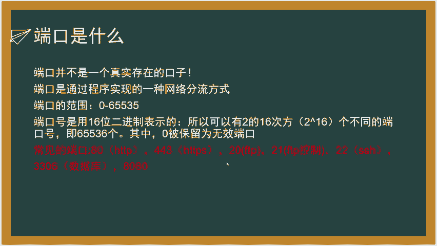

给大家简单介绍一些比较重要的网络请求啊。首先啊。最重要的两个网络请求啊就是get请求和po的请求啊。get请求之前我们做后端片的时候也知道啊，就同网页之间就传那个get请求，传密码这个东西啊。呃。

给大家说一下啊，首先get请求po的请求的区别。get请求的参数，它是通过URL传递掉URL是什么东西啊？URL就是。就是这个。这个东西这一圈这个就叫做URNU啊，就通过这个传递。

比如说get请求的本质，比如说我给他传一个123，就是get。

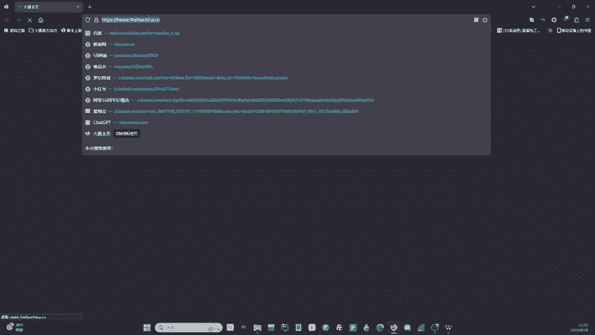

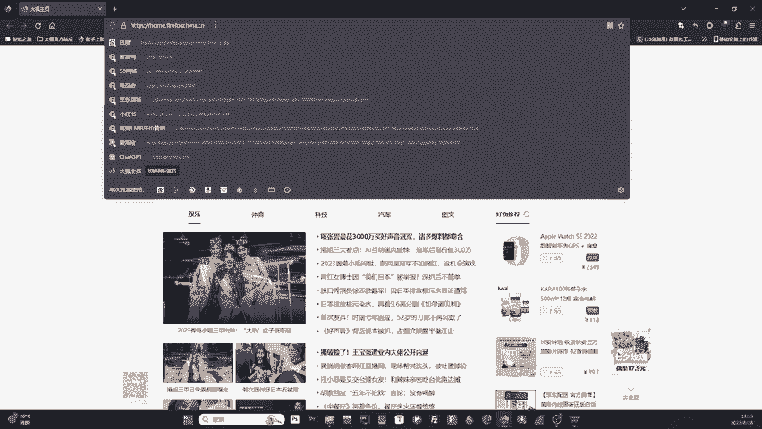

给那个ABC这个变量ABC这个变量传个123过去，本质上就这么传的。你截了一个包骤，大家也可以看看截了一个截取的一个数据包骤，它本质上就是这么传传集变量的。大家明白我思吧？就是他是通过这个传的。

而大家也可以看到，通过这个传，它是显而易见，用户是可以直观控制和看到的，他就不安全，对吧？它能够能够明眼的能够看的一般就不安全，但大家这么理解就行了啊。然后他pos的请求的参数是包含在请求体系当中啊。

pos的请求。什么叫紧究体要？大家可以看到这个。

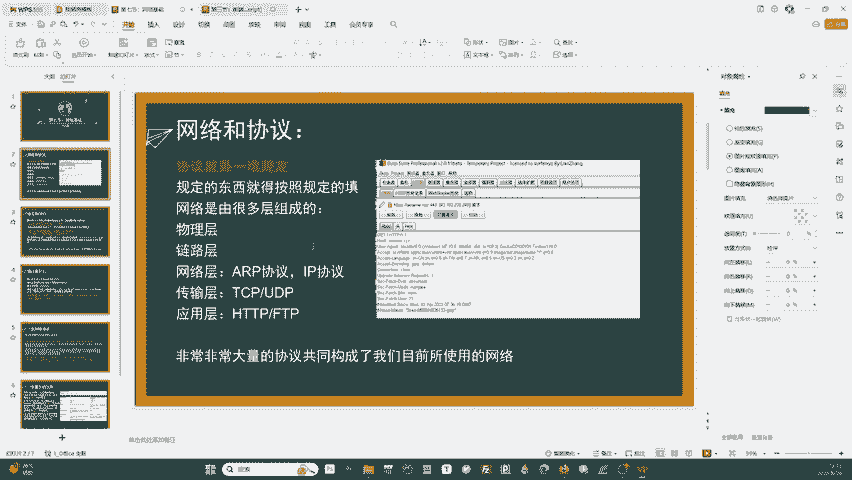

呃，这个是那个抓的一个get请求包po的请求就是把这个把这个给它改成post。然后呢，同时呢这个里面它它还会有一些其他请求头会变啊啊，这些都不说啊，有一些会变。比如con type这些好。

然后在这个下面这一坨空白这个地方就是它的请巴底BODBODY8体那个就叫做请求体po的请求的数据是在这个里面传输的，这就是它与get请求最大不同，就是它加了一层那个绕弯子。

用户不可肉眼肉眼不可直观可见了。要么你抓包抓了包这里也可以看得到啊。但家有想既然你抓了包之后，这个po的请求的内容还是可见，它是不是还是不安全。对它确实是不安全的。但是的话。如果说我再给它拿一层加密。

比如说给它转换成某种编码啊这种东西，让他肉眼不可读。OK现在是不是就算你抓包，你也无法知道我中间传的什么东西，对吧？啊，这就是为什么要用HTPS和FTPS的原因就是因为它有一个加密。

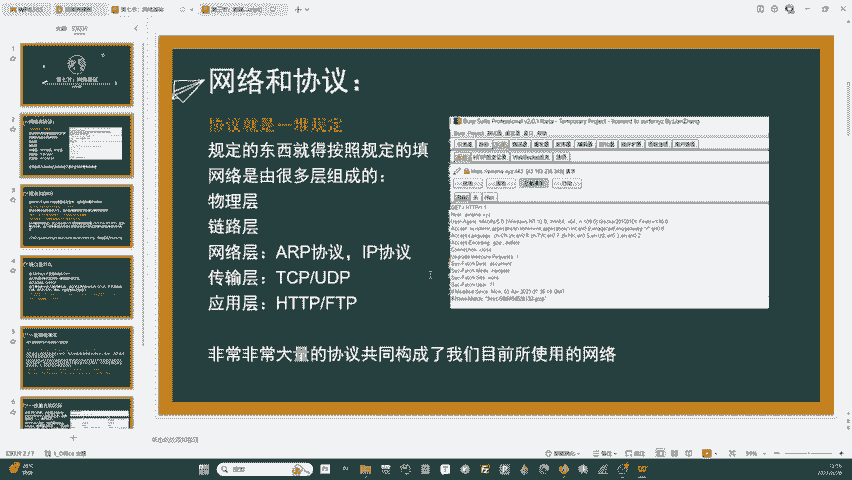

加了一层密，就让他中间人没法去抓他了，就是这个原理。所以说证书这个东西是很重要的。然后面会给大家介绍证书啊。这就呢pos的请求比get请求更安全。

get请求是通过URL传递pos的请求是包含在请求体当中啊。呃，同时的话还有一个说法啊，首先首先啊gt请求啊，它的传递它的长度是有限制的呃，它的限制什么？它是说它很短，它很短。

它它它只有几乎就是就是一长串字不串那种传但是的话pos的请求的这个地方说是没有限制，是有限制，基本上最多就两个MB那有会有问啊，比如说像服务器上传一个好几百MB的一个那种大的数据包，它怎么传的？

可以发好几个呗。我一个发布可以发好几个分段去发的对吧？嗯，pos请求更长啊，一般传输那种呃一些比较大的什么压缩包这种都会使用po请求，很少使用ge的请求去传，尤其是密码这种东西啊。请求啊。

它进行的是URL编码，因为它是URL传肯定是URL编码的URL编码什么东西，就是把字符就是把那种呃比如么把ABC啊分号啊，逗号啊这种东西啊。

编码编码统一编码都是21%就代表什么字符2引号是空2%空2应是引号单引号有可能记错了，正就这么编码请求他就支持很多编码方式，因为它它不受那个URL的限制对吧？

它可以他在请求头里面我想怎么编编码那个就完全受那个呃那个服务器或者说前怎么设计的，我可以给加个6再给来一段哈希或者说给来一段扣的编码对吧？就是这个原因就也更全支持很多的加密方式啊。

nge请求在请浏览器回退的时是无害的。浏览器回退是什么意思啊？就这个这个箭头往回走就叫回退啊，get请求它不会重复传，但是pos的请求会再次提交数据。大家有时候那个发那个表单，比如说登录注册的时候。

你有些时候没看清楚你返回回去，它就会提示你是否再次提交那个数据啊。就是那个东西啊。它是否会再次跳出去，只有一个浏览器啊，火狐火狐它是不会再次提跳的。火狐啊，有些东西还是挺有特色，还是挺安全的。

因为安全员一般大家都喜欢火狐啊，火狐它那个呃内置的很多的安全工具很好用啊，大家也可以去。看一看啊。一些比较重大的区别啊，这个东西就比较细节一点，大家理解一下就行了。对于ge请求来说。

浏览机会把HTTPer就是请求头刚刚那些 agent些什么东西啊和data就是数据一起发送出去，返回一个状态码叫200200就正常。

大家知道20状态码就正常就请求成功了对于pos的请求浏览机会先把它的请求头给发出去啊，服务器示0啊，已经接受并且验证了，再把它的数据就里面的那个8请求给发过去服务器会返回一个200请求成功。

这里要给大家提一个点啊。呃，po的请求和get请求有个很常见，有个很典型的一个区别，就是ge请求它可以它你在发get请求的时候是只能发get请求的，因为它只能通过URL去传递。但是po的请求。

你在发送的时候，大家也可以看到刚刚这个。呃，这个地方。

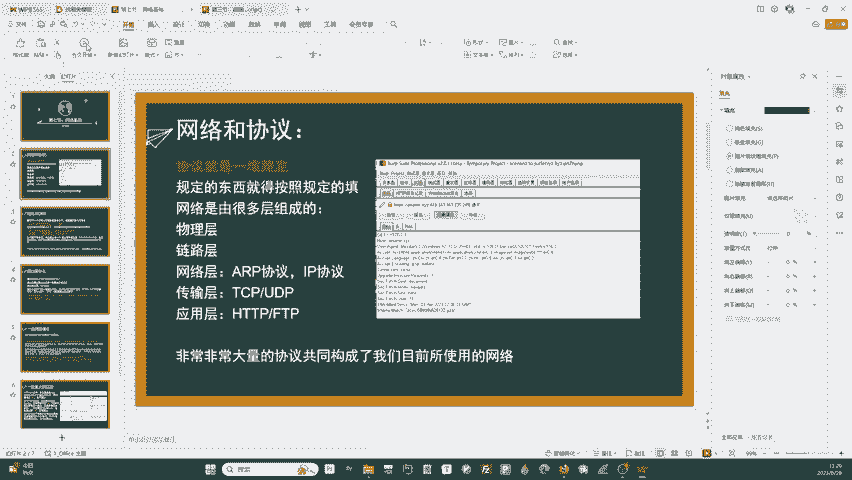

还回到这个假设把它改成po的包，那我是不是8里面可以传文件，对吧？8里面可以传输我的数据，这个地方是不是URL啊，我是不是能给他加一个问号啊，然后呢我在在URL里面还可以再传一个get请求过去。

大家想想，这就是为什么就是po的请求，它既可以在8里面传po的请求的东西，又可以在这个URL里面给它人为添加get请求，就是它既可以传get请求，可以传po的请求，甚至可以同时传。

这就是一个po的请求的一个优势啊，就是这个意思啊，你可以理解为get请求，就是作为一个临时的一个这种用法，它更轻。同时的话它也更。

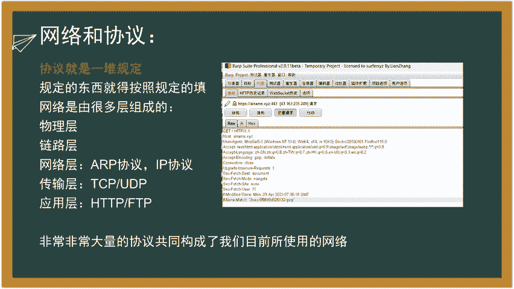

呃，更简便了，但它就更不更危险了。那能get方法啊只是授于URL长度的限制啊，最多看这个就是说的1024指己pos请求传输数据量大，最多达到两个兆B啊。两造。嗯。

这个地方是一些比较gt与pos请求的一个区别啊，大家可以看一下。嗯，这个地方就不详细给大家说啊。啊，这地方给大家说一下证书啊呃证书这个东西啊，它就是一种点对点的认证机制啊。呃。

常见的它就是一个公药加密私药解密的一个这个过程。什么叫公药私药？呃，它就是我给大家说一下什么叫公药私药，公药私药就是。呃，公钥是一个加密的一个一个加密盐，加密盐什么，就是一种加密的媒介啊。

但我这个说的有一点点有一点点的抽象啊，我给大家说一下那个那个以随机数来给大家举个例子啊，大家用过C语言，用过随机数，对吧？你要生成随机数，C语言中的随机数默认它是用什么生成的，它是用时间来生成的。

知道吧？就比如说我它你要生成个随机数，它就取当前的时间，然后根据它算法给你生成个随机数，而那个生成这个随机数，它是不是就一定要取那个时间，这个时间就叫什么，就叫做随机盐。

就是生成随机素的这个盐盐研巴的盐啊，就取就你知道你理解吗？就是盐就是一个关你可以理解为一个关键的一个东西啊，就是生成随机数的关键就是这个当前的时间。而这个而这个这个加密啊。关键就是一把钥匙对吧？

一把钥匙就是用什么东西去加密。比如说呃给一个数字123，然呢我要去加密ABCDEFG怎么样加密呢？ABCDEFG比如说它是它它是不是有对应的202026个字母，对吧？

26个字母啊当然我把它每一个数从左到右每三个加123啊，是不是123就是它的加密的密钥，对吧？这个东西就是它的加密言，就是这个关键东西，这个密钥，就是用什么东西加密的，就是个大家可以理解，就这么加密的？

公钥是怎么意思？公钥就是嗯。一个证书上，它它也是证书，这个证书什么的，就是协议啊，它也是个协议要，就是它上面会有公钥，也会有私钥。这个公钥是所有与这个服务器通信的人，他都他都会他都会获得这个公钥。

这个公钥就所有人都知道。然后这个公钥他就像我刚刚说的123123，他通过这个一所有人都通过这个123这个公钥去把自己要传给服务器的数据加密之后传给服务器。但是这个加密是不可立的。就是你用公钥加密之后。

你不能再用公钥解密回来。大家可以理解我的意思吗？就是如果说一个人A向B传，A向就是假设甲向服务器传了个信息，他用公钥加密之后，C去就是乙去截取了这个数据，他在用公钥去解密，是解屏不出来的，知道吧？

这是一种不对称的加密。好，只有服务器以上的人就是操作服务器这个人接到公钥加密的数据之后，他用他的私钥去解密，他才能够获得这个数据，这就叫非对称加密，就是一个很神奇的一个东西啊，就是。呃。

就是公钥去加密这中就防止了中间人攻击。因为中间人他没有这个私钥，所以说一定要保管好金人QQ密码，只有我自己知道我才用我能才能登得上去，对吧？这个就是证书的一个公钥私叫加密简密的一个机制啊。

你让他怎么保证安全的对吧？呃，首先啊客户啊，他通过证书，就比如空因为证书是在服务器上的对吧？大家一定要证书是在服务器上的，就跟你访问HTPS一样。大家理解下这种东西，证书一定是在服务器上的？

客户通过证书提供了公钥加密一串随机串。比如说我呃首先客户我想先向他认证认证，我怎么认证呢？我首先随便发给他1个1ABCDFG这个是随机生成的啊。

然让我用公钥去加密这个随机生成的支付串发给那个呃那个就是那个服务器，服务器拿到这个加密之后的随机串，用私钥去解密，大家听我的过程，用私钥去解密这个公钥加密的随机串得到这个随机串，然后呢好。

现在服务器知道你发给我们的随机算。这个然让我们俩紧接着后面的通讯，就全部都使用这个保密的随机串来进行加密解密的对吧？来加密我们俩之间的通信的。

这样的话就达成了一个呃点对点就中间没有任何攻间人中间人完全就是两个点上面的人私有的一个才知道的通信方式。无人渡客。呃，私有的一个通信方式。那道同时的话，这种公钥私钥的加密方式，它通常它的实现原理是什么？

就怎么样防止别人去破解呢？它都是用那个呃一些数学上的一个呃难题去作为一个。嗯，加密解密的方式的。首先啊它就是通常使用的是RSA或者说ECCC去加密解密呃，大数数的难解性，这是什么？这是。

那就比如说我给你一个。给你1个5656897这样一个超级大的一个数啊，我要找出所有它的因数里面所有与它互数的，是不是超级难找啊，就是你算他们算算个一年你都算不出来的这种东西啊。

他就他就他就利用这种原理去加密解密啊，就是说白了就是当代计算机的一个一个性能上的一个缺陷的。他就利用这个性能上的一个缺陷去呃去防止你去破译它。椭圆曲线也是椭圆曲线很难解出来它的解啊，也是利用这个难解。

就是难以找出它的零点那个解的这个性质，防止你去爆破它。就是几乎你是爆棚不出来的。你家用计算机。当然哈，如果说你的算力足够大。呃，也能破解。但是当前来说，晶体管计算机几乎没法是是没法破解的。

唯一能破解的就是什么？就是。这就提到最近的一个。呃，马上要出来研发很牛逼的量子计算机啊。就是如果说那个大家如果说如果说量子计算机真的能够出来能够民用的话，就是像大家就像网上就是那科研团队吹的那么牛逼。

那个量子计算机的算力啊吹的那么牛逼的话，那当下所有的像什么什么RSSA啊ECCC啊这些的加密的方式都将不复存在。因为它算力太牛逼了，我两分钟就能给你暴力破解了。当下所有的加密方式。

现代的加密方式都全部被推翻了。好可怕的一个事情。所以大家也如果说安全的机制啊，就是算计啊，你要是能。呃，大家可以去研究一下那个什么量子计算机这种超级算件东西，怎么样保证用户之间的安全，对吧？

那一定是跟量值有关。那扯扯到量值，那量值不题，那什么那就复杂了嘛。

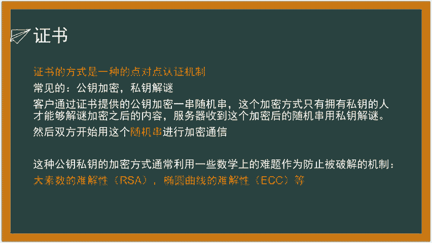

好，今天的课就到这里就结束了，感谢大家收听哦。

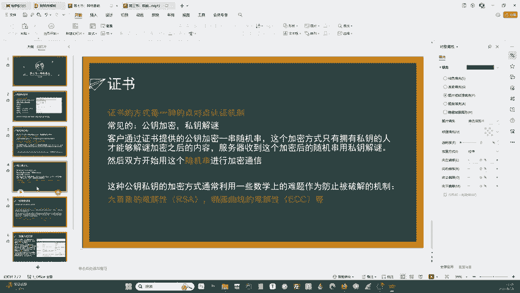