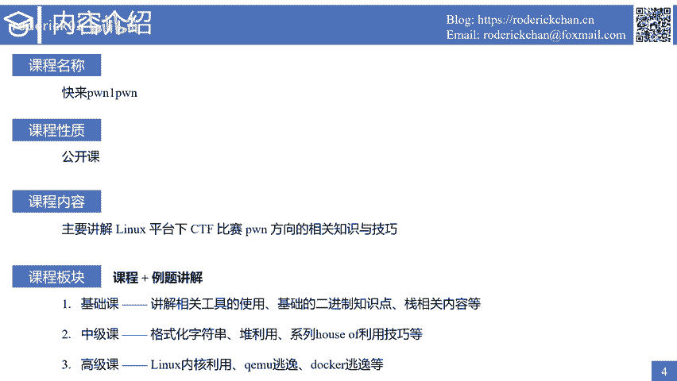
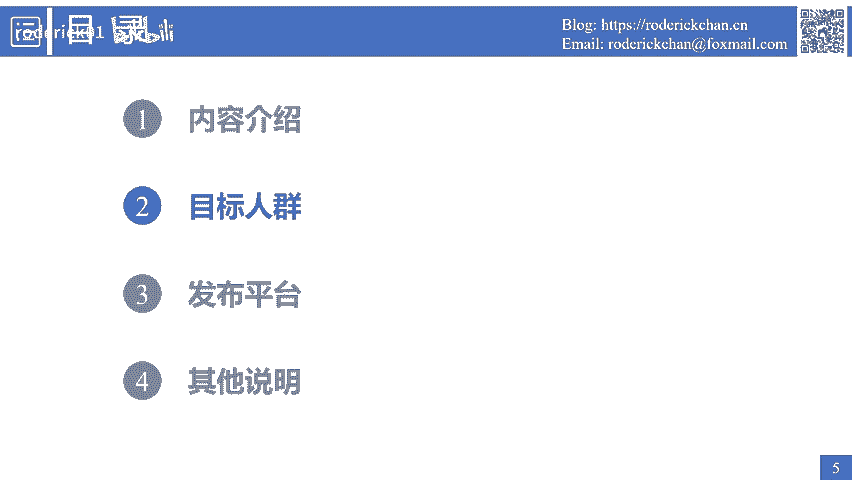
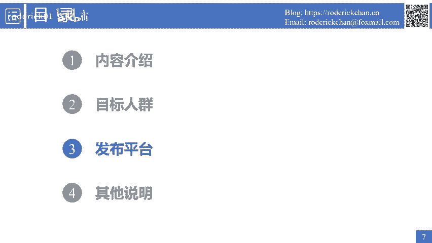
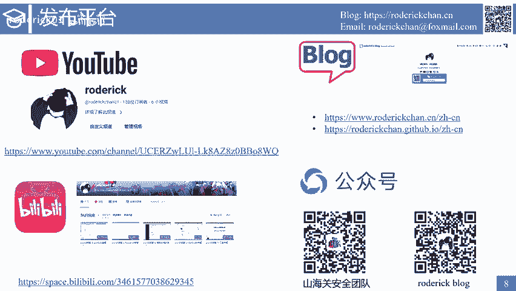
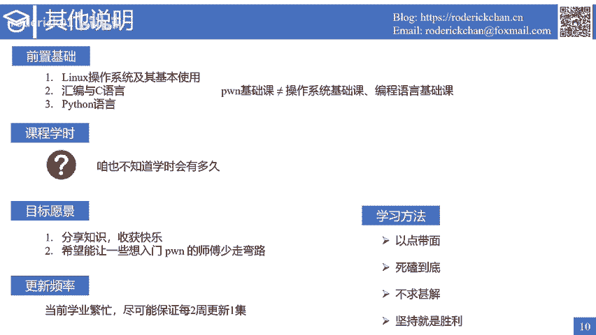

# 1. 课程介绍 - P1 - roderick01 - BV1Fi421f7ae

大家好，我是rooderi。从今天开始，我将给大家带来一门名为快来胖一胖的系列公开课。大家可以在哔哩哔哩或者youtube上面观看公开课的系列视频。下面有我的个人博客地址以及我的个人邮箱地址。

大家在观看视频的过程中，如果遇到了什么问题，都可以发邮件与我交流，或者直接在评论区给我留言。右下角分别是山海关安全团队的微信公众号和我个人博客的微信公众号，欢迎大家扫码关注。

特别是我的个人博客微信公众号，关注后，你将能及时收到最新的课程视频。接下来是本节的课程内容介绍。我将从以下四个方面对本公开课程进行详细的介绍。首先介绍课程的主要内容。

课程的名称是快来碰一碰。如果你还没有开始学习胖，那么现在就快点加入进来吧，我将和你一起学习和成长。注意到课程的名称叫系列公开课，所以这个课程的性质是完全公开免费的。那么在本次公开课中。

我主要会讲解与分享linux平台下CTF比赛胖方向的相关知识与技巧。课程板块分为两个部分，第一个部分是课程授课，第二个部分是立题讲解。在课程授课中，我将本次公开课分为了三个子课程。

分别是基础课、中级课和高级课。在基础课中，我会讲解胖解题相关工具的使用、基础的二进制知识点以及最基本的占利用技巧。而中极课则会进阶到格式化字符串的利用堆利用以及综合性很强的系列of利用技巧。

而在高级课上，我会讲解一些linux内核利用cumual逃逸、多克逃逸等知识点与技巧。需要说明的是，以上只是大致的课程安排，实际上会根据课程的进度进行一些动态的调整。

那么此刻你一定很想知道究竟哪些人适合学习这门公开课。

事实上，这门公开课有以下几个关键词，它分别是基础的、入门的、出阶的、简单的、萌新的。也就是说，这是一门面向新手录制的胖系列公开课，是一款入门级教程。因此不用担心。

我会尽可能的从一个初学者的角度为你讲授学习胖过程中所需要的知识点与技巧。当然，受限于本人的知识水平。难的我也不太会就只能出一些简单的入门的课程，只有这样才能维持得了生活。这样子。

接下来介绍课程的发布平台。

课程的系列视频，我会上传到我的youtu频道和我的哔哩哔哩账号上面。非常推荐大家在这两个平台上。进行观看有关课程的课件信息，我会发布在我的个人博客网站上。

同时会将课程的最新视频同步推送到我的个人微信公众号。除开这些平台以外，我目前不会使用其他平台发布本系列公开课视频。

最后是一些其他说明。首先需要说明的是，这是一门胖基础课，但是胖基础课不等同于操作系统基础课，也不是一门编程语言基础课。那么在学习胖之前，你一定要掌握基础的linux操作系统的知识。

熟悉一些常用的linux命令行。与此同时，你需要掌握汇编与C语言的使用，并且能够较为流畅的编写pyython语言脚本。而在课程学时方面，因为我无法预估视频的录制时长是多久，所以也不能给出具体的学时时长。

可以保证的是，没有特别的原因，我不会停止更新本系列公开课课程。那么本课程的目标愿景。也就是说我为什么会录制这一门课呢？主要有两点，第一是希望能分享一些自己所学的习的知识，有句话说得好，赠人玫瑰手有余香。

第二，在分享的同时可以帮助到一些想入门胖的师傅让师傅们少走一些弯路。而在课程的更新频率方面，虽然本人目前学业繁忙，但还是会尽可能的保证每两周更新以及。最后我想跟大家聊一聊学习方法，也就是如何学习胖。

我们知道CTF比赛中胖是一个对个人综合能力要求比较高的方向，且前期的学习曲线非常陡峭，想要入门胖可能需要很长时间。在这里我向大家介绍一下学习方法主要就是以下4条。第一，以点带面。

与胖有关的知识点非常的多。在学习的过程中，很容易将自己淹没在繁杂的知识海洋中。如果每一个知识点你都是从头开始学习，那么你在学习过程中所花费的时间将会非常的多。因此，我推荐的方法是以点带面。

当你学习某一个知识点的时候，对于其他有关的知识点没有必要深究到底。先按照你对你当前的理解解释这个知识点。你只需要像集邮票一样不断的收集一个又一个的知识点。而当你收集的知识点达到一定数量后。

在你回顾这一系列的知识点时，将它们串成一个线，拓展成一个知识面。你就会发现以前没有解开的一些疑惑，突然就被解开了。而后续的学习将会非常的高效。第二是死磕到底。对于一些必要的知识点，如果你没有弄清楚。

那么你就需要反复的观看，反复的揣摩，反复的学习，反复的训练，直到自己彻底弄清楚为止。第三是不求甚解，或者说要详略得当。对于一些知识，你需要死磕到底。而其他的一些知识，你只需要理解一个大意就可以了。

没有必要钻牛角尖。第四点也是最重要的一点，坚持坚持，还是坚持，坚持就是胜利。只要你坚持下去，你就一定可以跨过任何高山。

在下一节课中，我将讲述与胖有关的基本环境与工具。另外，在观看视频过程中，如果有什么好的建议，希望大家积极的在评论区与我交流。最后祝愿大家学习顺利。

