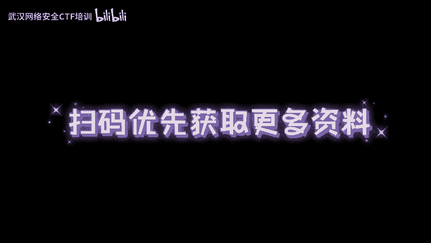
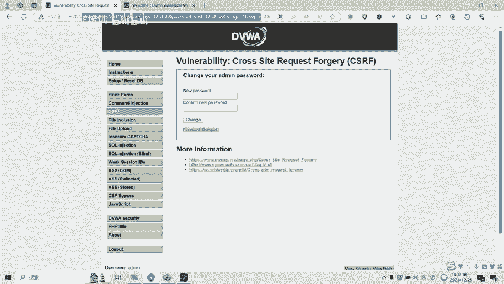

# 10-网络安全CTF系列培训教程之Web篇-CSRF漏洞 - P1 - 武汉网络安全CTF培训 - BV1T64y1E7EP

扫码优先获取更多资料。

大家好，我是武汉世纪云创公司的CTF培训老师，大家可以叫我阿阳。我们制作此视频的目的是希望帮助一些想要学习CTF的同学呢快速入门，提高CTF竞技水平。本视频为CTF网络安全系列培训教程。

后期呢将会持续不断的更新。大家如果有兴趣进一步深入学习CTF，可访问PPT上面的公司网址进行电话联系或者扫描视频中的二维码进行报名咨询。我们的教师团队均来自CTF省赛世赛前10名选手。

通过顶尖战队的手把手指导，大家学完之后呢，即可达到省赛市赛的夺奖水平。首先大家一定要遵守网络安全法。本课程内容仅用于CTF网络安全教学培训，请大家遵守相关的法律法规，勿用于其他用途。

今天这节课主要是讲CTF比赛中的CSRF漏洞。CSRF呢是指跨站请求伪造一种协制终端用户在当前已登录的外部应用程序上呢执行非本意的操作的攻击方法。攻击者呢只需要借助少许的社会工程轨迹，例如。

通过电子邮件或者聊天软件发送的链接，受害者呢一旦点击该链接，攻击者呢就能迫使受害者的浏览器在已经登录过的网站上去执行特定操作。接下来给大家看一下CSR漏洞的一个基本原理。大家看一下这张流程图。第一步。

用户打开浏览器。访问受信任的网站A输入用户名和密码，请求登录网站A。第二步，在用户信息通过验证后呢，网站A产生cookie信息返回给了浏览器。此时呢，用户登录网站A成功，可以正常的发送请求到网站A。

第三步，用户呢并未退出网站A之前，在同一浏览器中呢打开了一个标签页，访问了危险网站B。网站B接收到了用户请求以后呢，返回了一些攻击性的代码，并发出一个请求要求访问第三方站点。哎，这就是第四步。第五步。

浏览器在接收到这些攻击性代码以后呢，根据网站B的要求，在用户不知情的情况下呢，携带了cookie信息，向网站A发出请求。而网站A呢并不知道该请求其实是由网站B发起的。

所以呢会根据用户的cookie信息以及用户的权限处理该请求，导致呢来自网站B的恶意代码呢被执行。接下来我们看一下CSRF常见的几种攻击类型。首先我们看一下get类型。

get类型的CSR漏洞呢利用非常简单，只需要1个HTPP请求。比如PPT中的代码，在受害者访问含有这个image的HTMR页面后呢，浏览器就会自动的向银行bank点个s这个页面呢发送一个HTTP请求。

将小明账户account呢，转出1万元给ha这个账户。接下来呢给大家看一下pos类型的工具。pos类型的攻击呢，它的CSF利用利用起来呢，通常呢使用的是一个自动提交的一个表单。比如呢PPT中的代码。

这代码呢其实是一个木马，隐藏在一个挂码的网站上，自动的执行跨站攻击。访问该页面以后呢，表单呢就会自动的提交，相当于呢模拟用户完成了一次pos的操作。从小明的账户呢给海客账户呢转账1万元。

最后呢给大家看一下链接工具。链接攻击的CSRF呢并不常见，比起其他两种用户打开页面呢就中招的情况呢，这种呢需要用户呢点击链接才会触发。这种类型通常是在论坛中发布的图片中呢恶意的嵌入一些链接。

或者呢以广告的形式诱导用户中招攻击者呢通常会以比较夸张的词语呢来诱骗用户点击。例如发送PPT中的一个链接代码，诱导的用户呢点击该链接，从而执行了CSRF攻击。好。

接下来呢给大家看一下CIlo的一个实操演示。大家看一那，看一下这个CSF漏洞呢，我们来输更新它的密码。比如说我输入一个新密码。123456。点击欠金。密码修改成功。大家可以看一到。

这呢是一个CSRF漏洞。通过get请求的方式呢，将新密码。以及确认密码，新密码确认以及欠取这个按钮的这个操作呢进行了一个。呃，密码呢。变更。那我们我们再来看一下能不能利用这个漏洞。

我把123456改成了。654321。654321。回车。可以退出来再试一下。他的命。6543。当。登录一下。这时候就登录成功了。也就是说呢，通过CSRF漏呢，我们实现了一个密码的一个修改。

这个呢就是刚刚PPT章中讲述的一个get类型的1个CSR漏洞的一个工具。

CSR漏呢还有很多种绕过和利用的方式。后面呢我们将会针对各种类型的CSR漏呢制作相应的教学视频。大家呢可以扫描视频中的二维码呢领取资料或者呢保班学习。好了，今天的课程呢到此结束，感谢大家的观看。

