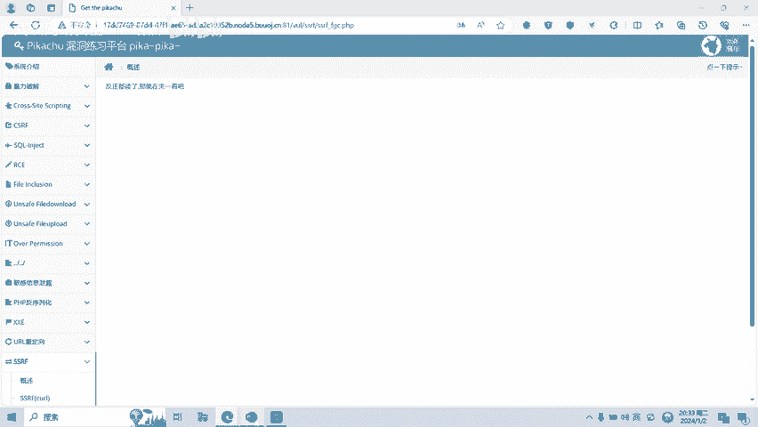
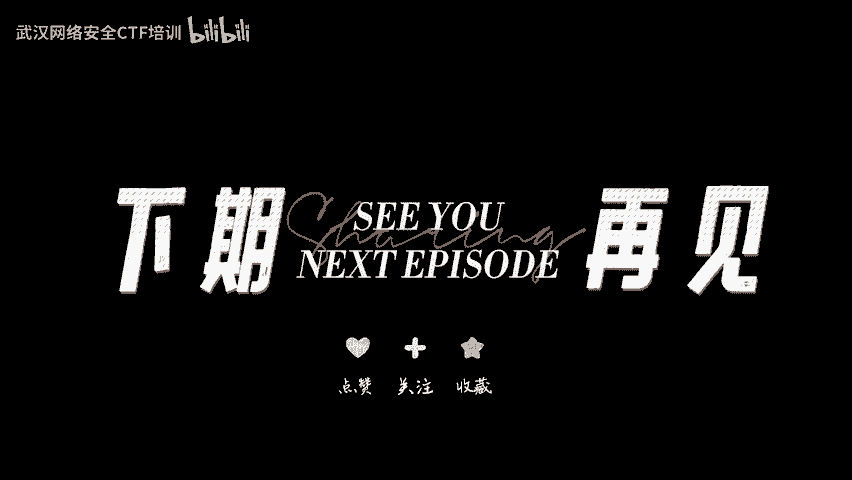

# 11-网络安全CTF系列培训教程之Web篇-SSRF漏洞 - P1 - 武汉网络安全CTF培训 - BV1dW4y1w7ch

扫码优先获取更多资讯。大家好，我是武汉世纪云创公司的CTF培训老师，大家可以叫我阿阳。我们制作此视频的目的是希望帮助一些想要学习CTF的同学，快速入门，提高CTF经济水平。

本视频为CTF网络安全系列培训教程，后期将会持续不断的更新。大家如果有兴趣进一步深入学习CTF可访问PPT上面的公司网址进行电话联系，或者扫描视频中的二维码进行报名咨询。

我们的教师团队均来自CTF省赛世赛前10名选手。通过顶尖战队的手把手指导，大家学完之后即可达到省赛市赛的夺奖水平。首先，大家一定要遵守网络安全法。本课程内容仅用于CTF网络安全教学培训。

请大家遵守相关的法律法规，勿用于其他用途。今天这节课主要是讲CTF比赛中的SSIF漏洞。SSRF也叫服务器端请求伪造，是一种由攻击者构造形成由服务器端发起请求的一个安全漏洞。一般情况下。

SSRF攻击的目标呢是外网无法访问的内部系统。也正因为请求呢是由服务器端发起的，所以服务器端能请求到与自身相连而与外网隔绝的内部系统。也就是说可以利用一个网络请求的一个服务，把它呢当做跳板进行攻击。

接下来给大家看一下SSRF漏洞形成的原因。SSRF形成的原因呢，大多是由于服务端提供了从其他服务器应用获取数据的功能。并没有对目标地址进行过滤与限制。比如从指定的UIR地址获取网页的文本内容。

加载指定的图片、文档等等。SSIF呢是由于服务端获取其他服务器的相关信息的功能中形成的。因此呢我们可以列举几种，在外部应用中常见的从服务端获取其他服务器信息的功能。第一呢就是分享功能。

通过URL地址呢分享网页内容。早期的分享应用中呢，为了更好的提供用户体验。外部应用在分享功能中呢，通常会获取目标UR地址网页内容中的标签或者标签中content的文本内容作为显示，以提供更好的用户体验。

通过目标UII地址呢获取了title标签和相关的文本内容。而如果呢在此功能中呢，没有对目标地址的范围做过滤与限制，则就存在SSRF漏洞。第二呢就是转码服务。通过URL地址呢把原地址的网页内容调优。

使其适合手机屏幕浏览。由于手机屏幕大小的关系，直接浏览网页内容呢，有时候呢就会造成许多不便。因此有些公司呢提供了转码功能。把网页内容呢通过相关的手段转为适合手机屏幕浏览的样式。例如。

百度、腾讯、搜狗等公司呢，都提供在线转码服务。还有一个就是在线翻译，通过UIL地址翻译对应文本的内容，比如百度翻译有道的。还有图片加载与下载，通过指定URR地址呢加载或下载图片。

还有图片加载远程图片地址，此功能呢用到地方呢很多。但大多呢都比较隐蔽。比如有些公司中的加载自家图片，服务器上的图片呢用于展示。第三呢就是图片文章收藏功能。从分享到UII中的读取及原文的标题等。

另外呢还有未公开的API实现以及其他调用UIL的功能。此处类似的功能呢有360提供的网站评分。以及呢有些网站呢通过API获取远程地址的叉MAL文件来加载内容。

SSRF漏洞呢还可以从URL关键字中呢进行一个寻找。在这功能上呢存在SSRF漏洞中UIL地址特征的观察。通过收集大概呢有以下关键字。

比如 share web UL link S IRC source target。U3级diplay以及sourceURLimUL domain麦等等。如果利用google语法呢。

加上这些关键字去寻找SSRF耐心的验证呢，现在还是可以找到存在的SSIF漏洞。接下来呢给大家进行SSRF漏洞的实操演示。我们点击一下。这个按钮。大家可以看到这里呢就有1个ULL。关键字。存在SSIF。

它访问的是本机IP的1个infer一点PP这个页面。我们可以试一下。他能不能反访问百度呢？大家可以看到。百度这个页面呢就被包含进来了。也就是说它可以访问百度。那么再看一下有能不能访问f协议。

也就说这个时候呢就读取了fi协议的。EDC passwordss word这个文件。我们看一下能不能读取flag。这首flag就读去了。我们再看一下SIFfage content这个函数的漏洞。

我们来点击一下。这个关键字呢也是我们存在SSRF漏洞。我们再试一下。返协议。成功访问了ETC pass错了文件。再试一下flag，flag呢也获取到了。这两个题目呢就是SSRF漏洞的一个。

实操的演示的一个题目。

🎼好了，今天的课程呢到此结束，感谢大家的观看。

