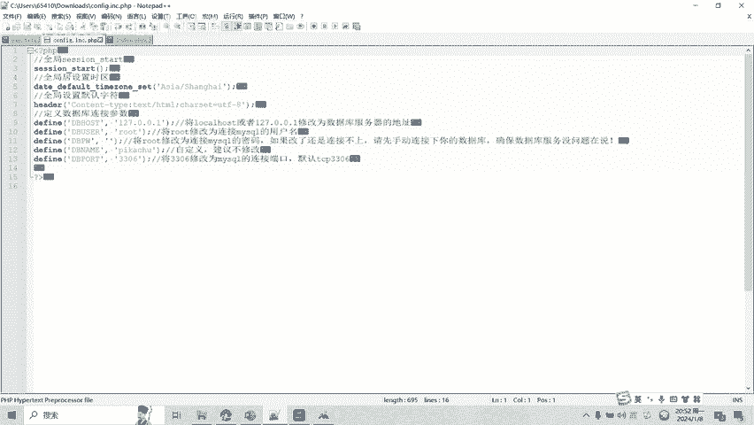

# 13-网络安全CTF系列培训教程之Web篇-文件下载漏洞 - P1 - 武汉网络安全CTF培训 - BV14e411E7jH

扫码入群CTF达人等你挑战。😡，大家好，我是武汉世纪云创公司的CTF培训老师，大家可以叫我阿阳。我们制作此视频的目的是希望帮助一些想要学习CTF的同学快速入门，提高CTF经技水平。

本视频为CTF网络安全系列培训教程，后期将会持续不断的更新。大家如果有兴趣进一步深入学习CTF，可访问PPT上面的公司网址进行电话联系，或者扫描视频中的二维码进行报名咨询。

我们的教师团队呢均来自CTF省赛市赛的前10名选手。通过顶尖战队的手把手指导呢，大家学完之后即可达到省赛市赛的夺奖水平。首先，大家一定要遵守网络安全法。本课程内容呢仅用于CTF网络安全教学培训。

请大家遵守相关的法律法规，误用于其他用途。今天这节课主要是讲CTF比赛中的文件下载漏洞。那么什么是文件下载lo洞呢？一些网站由于业务需求，往往呢需要提供文件下载的功能。但如果对用户下载的文件呢不做限制。

则恶意用户呢就能够下载任意的敏感文件。这个呢就是文件下载漏洞。一般呢文件下载漏洞呢需要以下几个条件。第一呢，存在下载文件的函数。第二呢，下载文件的路径用户可控且未校验，或者呢校验不严。

第三呢就是输出下载了文件的内容。文件下载漏洞呢可以造成以下危害。第一，下载服务器任意文件，如脚本代码、服务以及系统配置文件等。第二，可用得到的代码的进一步代码审计，得到更多可利用的漏洞。那么。

如何发现挖掘文件下载漏洞呢？首先从链接上看呢，形如read fire。PAAP然后呢问号get传参f等于某个文件，或者是下载download点PAAP问号get传参fre等于某个要素包等等。

通过read以及download这样的链接呢，就可以看出来它是否具有文件下载漏洞。第二呢就是从参数名上看。

比如re pass fire pass pass input fire uL source menu等等这些参数名呢，就可以看出来它是否具有文件下载漏洞。接下来呢讲一下如何利用文件下载漏洞。

任意文件的读取呢与下载漏洞呢一般呢隐藏在文件的读取，或者呢展示图片的功能模块里面。恶意的攻击者呢会利用对文件的读取权限呢进行跨越目录的访问。比如访问一些受控制的文件。

通过目录跨越点点杠ETCpassword或者是点点杠bo点II。获取下载。系统的敏感文件。最后呢讲一下文件下载漏洞的实操实操部分。大家可以看到这个呢是一个文件下载漏洞的1个PP。页面。

我们通过查看原来码可以发现。这些图片呢。是可以下载的。有一个downloadE一download点PPf name等于某个图片文件的名称。我们就可以下载这个文件。这个呢就是我们下载了文件。

那我们呢如何利用文件下漏洞获取？好的。源代码呢，比如说主页的源代码ind选PP。我们通过目录穿越的方式试一下。我们呢还可以获取到系统的敏感文件，配置文件config点IC。点PP。

我们再试一下是否能够下载。同样的也可以下载。我们可以查看一下配置文件以及index主页的PP文件。

文件下载漏洞呢还有很多种绕过和利用的方式，后面呢将会对各种类型的文件下载漏洞呢制作相应的教学视频。大家呢也可以扫描视频中的二维码呢领取资料或者呢报班学习。好了，今天的课程呢到此结束，感谢大家的观看。

