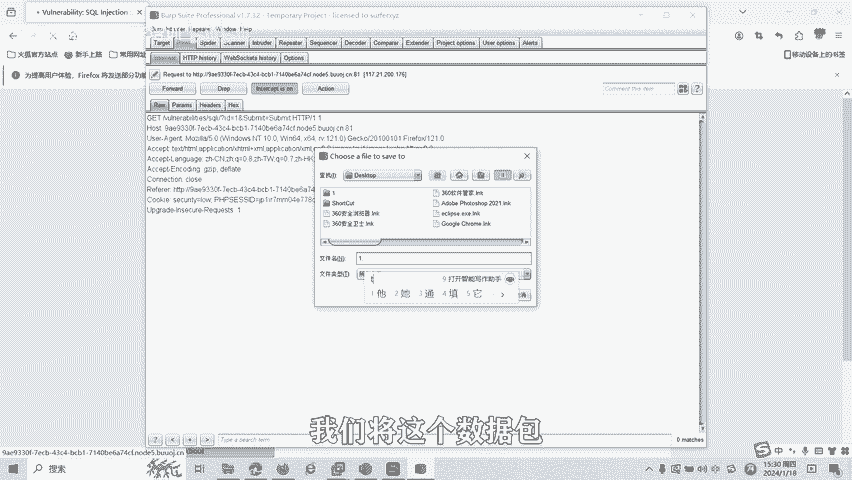

# 14-网络安全CTF系列培训教程之Web篇-SQL注入漏洞 - P1 - 武汉网络安全CTF培训 - BV1p2421L7Va

学CTF秘籍，带你质破万难局。大家好，我是武汉世纪银创公司的CTF培训老师。大家可以叫我阿阳。我们制作此视频的目的是希望帮助一些想要学习CTF的同学快速入门，提高CTF竞技水平。

本视频为CTF网络安全系列培训教程，后期将会持续不断的更新。大家如果有兴趣进一步深入学习CTF，可访问PPT上面的公司网址进行电话联系，或者扫描视频中的二维码进行报名咨询。

我们的教师团队均来自CTF省赛市赛前10名选手。通过顶尖战队的手把手指导，大家学完之后呢，即可达到省赛世赛的夺奖水平。首先大家一定要遵守网络安全法。本课程内容仅用于CTF网络安全教学培训。

请大家遵守相关的法律法规，勿用于其他用途。今天这节课主要是讲CTF比赛中的circle注入漏洞。那么什么是circle注入漏洞呢？

scle注入呢是一种将scle代码插入或添加到应用用户的输入参数中的攻击。之后呢，再将这些参数传递给后台的srcle服务器，加以解析，并且执行。

🎼如果外部应用未对动态构造的circle语句所使用的参数呢进行正确性检查，那么呢攻击者就有可能会修改后台circle语句的构造。如果攻击者呢能够修改srcle语句。

那么呢就可以篡改删除或者线路数据库中的数据。以下就是srcle注入的流程图。攻击者呢首先将参数值等数据进行修改，然后呢，未经检查和过滤即将被修改的数据呢注入到搜cle命令中。

搜cle命令功能呢就被修改数据库引擎呢执行被修改后的scle命令呢，并反馈给服务器。服务器最后将注入的结果呢返回给了客户端。搜狗注入漏洞的形成呢一般具有以下两个条件。第一。

程序编写者在处理程序和数据库交互的时候呢，使用字符拼接的方法呢构造搜狗语序。第二，未对用户可控参数呢进行足够的过滤，便将参数内容的拼接进入到了Ccle语句中。搜个注入呢具有以下几类。第一。

按照注入点的类型呢，可分为数字型和字符型。第二，根据注入点的位置，可分为get注入po注入cookie注入搜索型注入HTTP头注入等。第三，根据页面回显可分为报错注入、不尔注入时间忙住等。

接下来讲一下如何发现与利用cicle注入漏洞。首先介绍一下最为经典的单引号判断法，在参数后面呢加上单引号，比如ABC点PP呃，问号ge勒串参ID等于一，后面加一个单引号。

因为呢它的社会语原型呢可能为Cle新 from表明Y IDD等于1添加到引后以后呢，如果页面返回错误，则存在社会注入。原因是，无论字符型还是整型，都会因为单引号的个数不匹配而报错。如果未报错。

并不代表不存在scle注入。因为呢有可能呢页面对单引号呢做了过滤。这时呢可以使用判断语句进行注入。因为呢这里呢是讲的一些入门的基础课程，我们呢就不做深入的讲解。接下来讲一下搜狗注入的危害。第一。

攻击者呢通过利用s狗注入漏洞呢，可以获取数据库的各种信息。比如后台的账号密码，从而呢获取数据库的内容。第二呢，特别的情况下呢，还可以对数据库的内容呢进行插入、修改、删除等。第三。

如果数据库权限分配存在问题，或者呢数据库本身存在缺陷，攻击者呢可以通过srqcle输入的动端来直接获取we线或服务器的权限。最后呢讲一下搜狗注入漏洞的实操。这是一道思考猪入题。比如我们输入ID等于一。

那么呢数据库里面ID唯一的记录呢就有它的名字。从URL可以看出来，通过get传三传ID等于1。那么我们抓包一下。我们用BP来抓这个数据包，最后的用s map进行一个数据库的注入。输入ID1。

这时候可以看到数据包里面有ID等于一。我们在这个数据包。

保存里面。用卡利。自带的什个卖部。进行一个搜个卖铺注入。杠杠DBS。就是。注入输出他的数据库的名字。刚刚拜起就是使用默认的。

一个。操作。好，这个时候就发现了有两个数据库。一个是DVWA，一个是inform。那我们来如何。去获取它的数据表呢，比如杠D，我们获取一下。DVWA这个数据库里面的有哪些表，杠杠TABLES。刚刚ts。

最后发现有gutbook和us两个表。那么如何。查看他有哪些列呢？比如我选择其中一个表user表。那后再诉出有多少年？列明进行一个包破。四好。这时候这就是列名了。那我包括。这里面值呢。

Useer password word。还有 usererID。看看当。这时候就保出了userpas word和user IDD这几个值。大家可以看到ciircle注入漏洞端。

我们呢就可以利用scle map这个工具呢自动的来获取数据库的信息，包括数据库的内容和数据库的值。好了，搜狗注入漏洞呢还有很多种绕过和利用的方式，包括联合查询注入、报错注入、不尔忙助、时间盲助等等。

后面呢我们将会针对各种类型的搜狗注入漏洞，制作相应的教学视频。大家呢也可以扫描视频中的二维码领取资料或者报班学习。好了，今天的课程呢就到此结束，感谢大家的观看。🎼。

