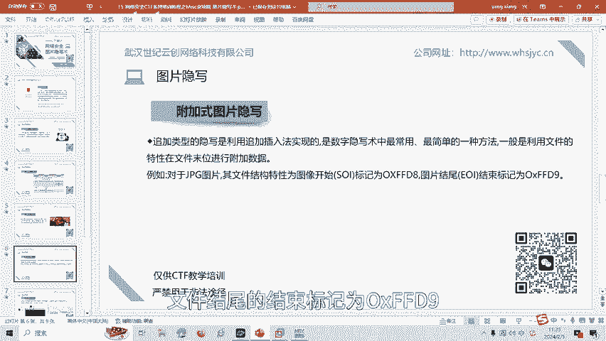
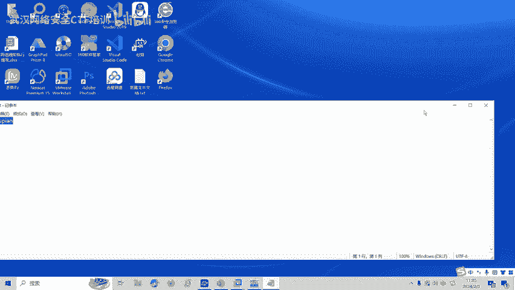
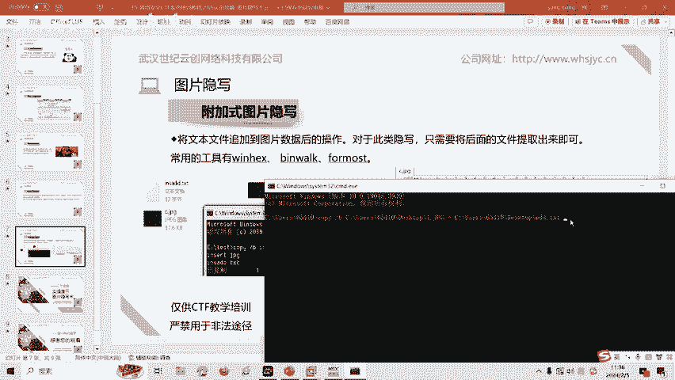
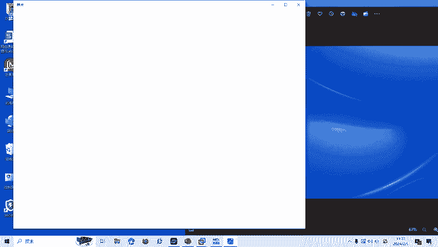
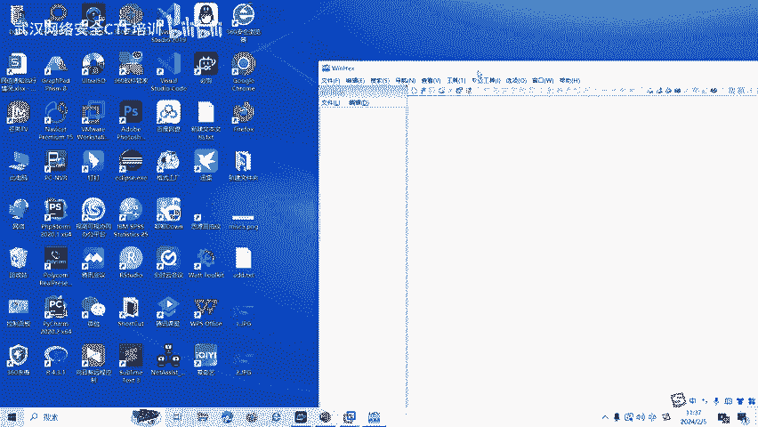
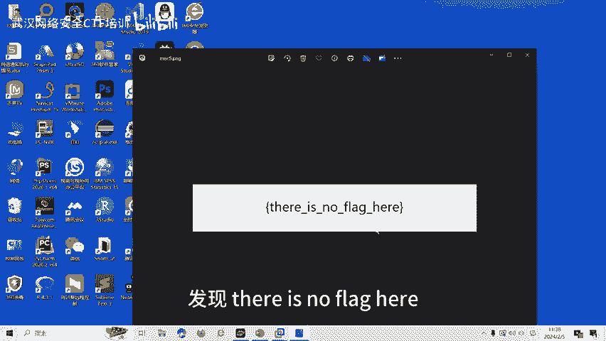
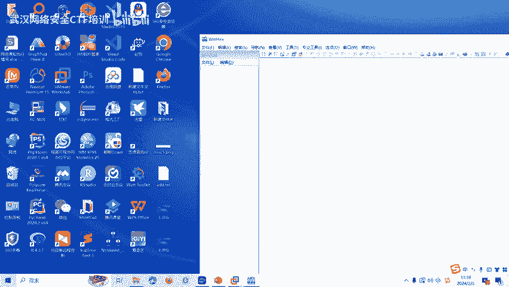
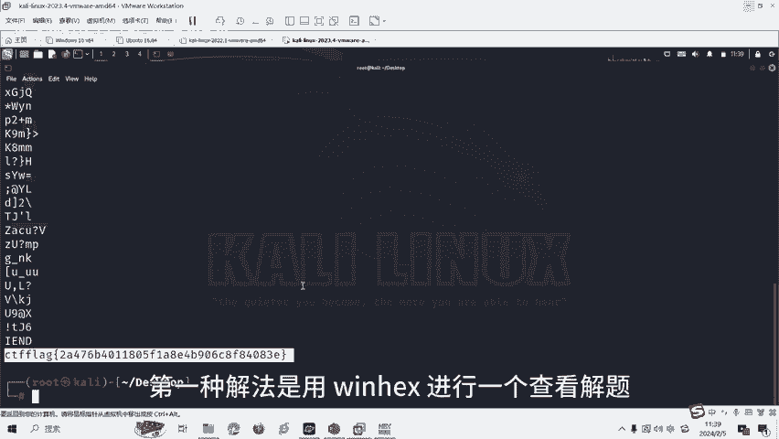

# 15-网络安全CTF系列培训教程之Misc杂项篇-图片隐写术 - P1 - 武汉网络安全CTF培训 - BV1wy421h7mH

大家好，我是武汉世纪银创公司的CTF培训老师，大家可以叫我阿阳。我们制作此视频的目的是希望帮助一些想要学习CTF的同学，快速入门，提高CTF竞技水平。本视频呢为CTF网络安全系列培训教程。

后期呢将会持续不断的更新。大家如果有兴趣进一步深入学习CTF可访问PPT上面的公司网址进行电话联系，或者扫描视频中的二维码进行报名咨询。我们的教师团队均来自CTF省赛世赛前10名选手。

通过顶尖战队的手把手指导呢，大家学完之后即可达到省赛世赛的夺奖水平。首先，大家一定要遵守网络安全法。本课程内容仅用于CTF网络安全教学培训，请大家遵守相关的法律法规，勿用于其他用途。

今天这节课呢主要是讲CTF比赛中的图片引写数。那么什么是图片引写数呢？CTF图片引写是一种信息隐藏技术，它通过在图片中呢嵌入秘密信息来实现，以便在不被发现的情况下呢传输信息。

这种秘密信息呢可以是文字、音频或者呢其他的数据形式，其重点在于信息的隐藏。在学习图片引写书之前呢，我们介绍一下图片文件的基础知识。以下这张表呢记录的各种图片格式的文件头和文件尾的16进制标识。

这在CTF比赛中呢，经常遇到，需望大家呢熟练掌握。例如JPG图片的文件头呢是FFD8文件尾呢是FFD9JIF图片的文件头呢是47494638PNG的文件头呢是89504147文件尾呢是A1426082。

CTF比赛中的图片影写呢一般有附加式的图片影写，基于文件结构的图片影写。基于LB原理的图片影写，基于DCT域的JBG图片影写和数字水印的影写等多种形式。接下来呢讲一下CTF比赛中最常见的附加式图片音解。

追加类型的图片引写呢是利用追加插入法实现的，是数字引写书中呢最常用最简单的一种方法。一般呢是利用文件的特性，在文件末尾呢进行附加数据。例如，对于JPG图片，其文件结构特性为图像啊。

开始标记为0XFFD8文件结尾的结束标记为0XFFD9。

我们呢可以利用dos命令啊，将要隐藏的文件呢添加到图片的数据后面。这里呢我可以操作一下。我们这里呢有一个要添加的文本啊，叫做。附加驶图片。

然后呢，还有一个截了一个屏啊，一个JP图片，我们要把这个TSC的数据呢添加到这张一点JP机的图片的后面。利用多次命令。改别。港B二进制。我们输入要添加的图片，然后呢。要添加的数据。

最后呢生成图边是。2。JBG。回车。发现呢生成了1个2点JVG，大家从肉眼是看不出来二点JVG和一点JPG的一个区别的，对不对？

但是呢我们呢把数据呢已经放到了2。JVG里面，我们可以用winx看一下。

FFD8为文件头JBG的文件头。FFD9呢为文件尾，大家可以看到文件尾后面的这些数据呢就被添加进来了，叫做附加式图片。对于这种类型的CDF题目呢。

我们呢经常使用face命令啊或者工具win hacksbe work for most呢等等进行解题。最后呢我们讲一下图片引写的一个实操题目，我们看一下。这个图片呢？打开之后呢。

发现there is no flag here看不到flag，这里没有flag。那我们呢用wex看一下。

PN接图片是89504147文件头，文件尾呢是。A142608，对不对？这是文建伟。那文建伟后面的数据是什么呢？写的是CTF flagag，也就是这道题目答案呢就是flag值就在后面文件位后面。同样呢。

我们再试一下第二种方法，用strs命令查看一下能否查看到添加到文件末尾的。Flag。我们使用sch命令查看。该文件。然后呢。我们就发现在尾部有flag。这就是我们的第二种解法，用str命令进行解题。

第一种解法呢是用winhax进行一个查看解题。

图片音写呢还有很多种影写类型和解题方式，包括基于文件的结构的图片音写，基于LB原理的图片音写。基于DCT域的JBG图片音写和数字水印的音写的。后面呢我们将会针对各种类型的图片已解术呢制作相应的教学视频。

大家呢也可以扫描视频中的二维码呢领取资料或者报班学习。好了，今天的课程呢到此结束，感谢大家的观看。对客姐。

