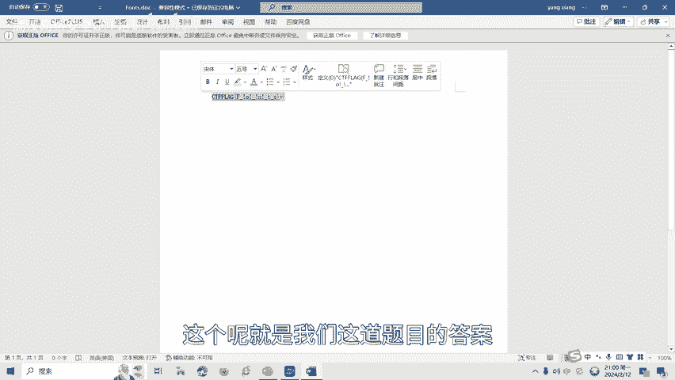

# 16-网络安全CTF系列培训教程之Misc杂项篇-隐写术之word隐写 - P1 - 武汉网络安全CTF培训 - BV1Py421a7eW

大家好，我是阿阳。我们制作此视频的目的是希望帮助一些想要学习CTF的同学快速入门，提高CTF竞技水平。本视频为CTF网络安全系列培训教程，后期将会持续不断的更新。

大家如果有兴趣进一步深入学习CTF可访问PPT上面的公司网址进行电话联系，或者扫描视频中的二维码进行报名咨询。我们的教师团队均来自CTF省赛世赛前10名选手，通过顶尖战队的手把手指导，大家学完之后。

即可达到省赛世赛的夺奖水平。首先，大家一定要遵守网络安全法。本课程内容仅用于CTF网络安全教学培训，请大家遵守相关的法律法规，误用于其他用途。今天这节课主要是讲CTF比赛中的word引写术。

那么什么是word引写数呢？word引写是一种利用word文档进行引写的技术。word允写可以通过修改文本格式，插入隐藏文本或者使用不可见的字符等方式来隐藏信息。这种技术通常用于隐藏传币敏感信息。

或者呢进行秘密通信。在学习word引写术之前，我们介绍一下常见的文件标志。以下这张表呢记度的就是一些常见的文件文件头的1六进制标识。这在CTF比赛中呢，经常遇到需要大家熟练掌握。

例如DOCXXLSX和ZIP的文件头呢是504B0304。也就说呢，丢CX文档呢和XLSX文档呢都是ZIP格式。CTF比赛中的word引写呢一般有以下几种引写方法，包括第一种隐藏文本在word文档中呢。

可以使用隐藏文本功能，将信息隐藏起来。这些文本在正常情况下不可见，但可以通过特定的操作来显示出来。第二种，隐藏信息在格式化文本中呢。通过在文本中呢使用特定的格式化，例如将文字的颜色设置为与背景相同。

或者将文字的大小呢设置为极小来隐藏信息。第三种呢使用引血工具。有一些专门的引写工具，可以将信息呢嵌入到word文档中。这些工具呢可以通过修改文档的结构，或者利用文档的隐藏通道来隐藏信息。

最后呢讲一下word引写的实操。我们打开这一个word文档。我们发现这个文word文档呢是一个空的，里面呢什么都没有。那我们看一下是否有隐藏的文字。点击选项。点击显示。显示所有格式标记。选中。

然后呢确定。我们就看到有隐藏的CTF flagag，这个呢就是我们这道题目的答案。

word了音写呢还有很多种音写类型和解题方式。最后呢。后面呢将会针对呢各种类型的物的引写术呢制作相应的教学视频。大家呢也可以扫描视频中的二维码，领取资料，或者呢报班学习。好了，今天的课程到此结束。

感谢大家的观看。

