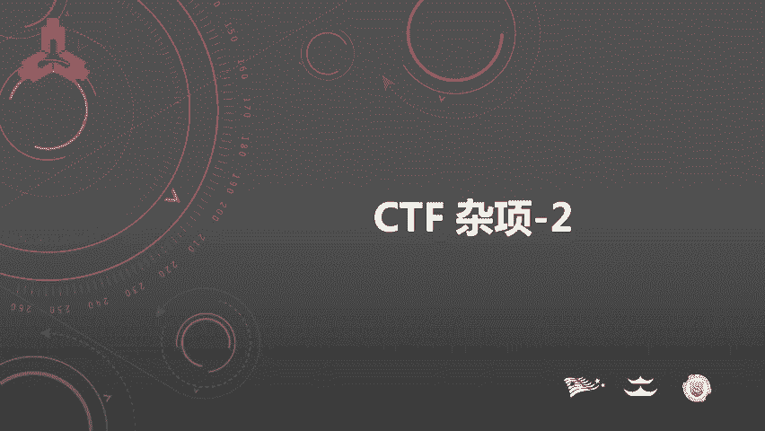
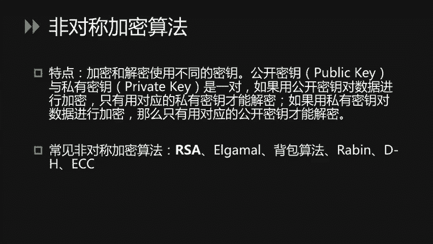
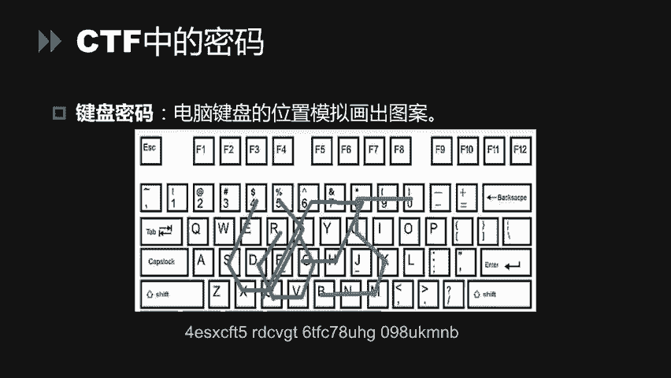
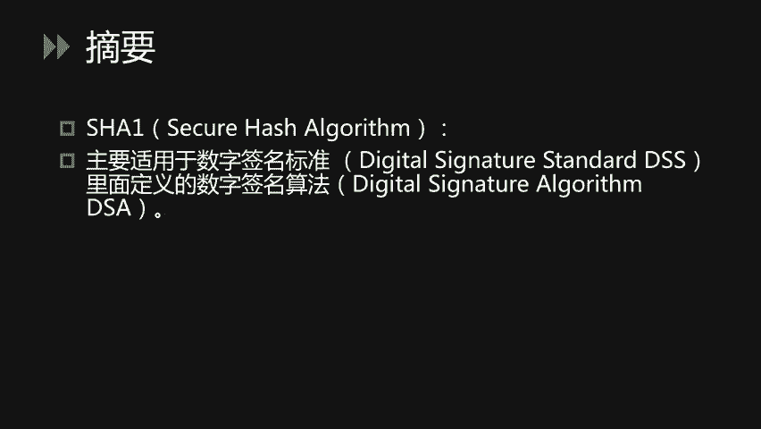
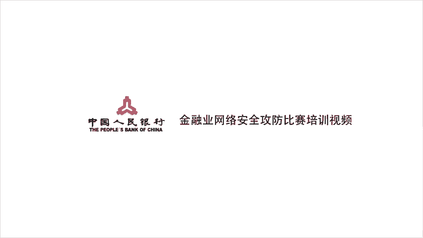

# 16.【公众号：FancyPig】CTF 杂项_2 - P1 - 高中数学yyds - BV1Sb421H7u2

大家好，本节课继续讲解引写术、密码、编码和杂项部分的内容。

本次讲解以密码学及编码相关的基础知识为主。首先跟大家介绍一下什么是密码学。密码就是我们日常登录各种账号时所用的密码吗？其实不是。我们平时登录各种社交媒体账号，登录各种系统所用的密码。

专业术语应该叫做口令。这里的密码指的是将铭文信息通过加密算法进行加密后得到的密文。密码的特点是可以通过解密算法解密得到明文。这里的密码区别于编码和摘要。编码是通过大家已知的编码方式。

对原有的信息进行编码处理后，得到编码后的字符串，任何人可以对其进行解码。而密码在没有密钥的情况下，是无法进行解码的。而我们平时提到的MD5杀 one这些摘要算法区别于密码。

原有的铭文信息通过摘要处理后得到的。摘要值固定长度。而且无法进行解密回原文的操作。也就是说。不论多么长的字符串，多么大的文件，通过摘要算法计算后得到的摘要值是固定长度的。

我们没有办法解回原来的文件内容或文本内容。密码算法经常用在文件的加密，通讯传输过程的加密。等需要对原有信息进行加密的场景。而编码通常用于。客户端与服务端之间的传输、文件的格式化存储等各个场景。

而摘要算法通常用在文件或传输内容的签名。以及文件文件的完整性校验等场景。首先，对密码学进行介绍。CTF中涉及到的密码学大概有三类。古典密码、现代密码以及CTF中特有的加密方式。下面我们来了解古典密码学。

在CTF中常见的古典密码学。可以分为置换密码和替换密码两类。首先我们来看最常见的古典密码，凯撒密码。凯撒密码的本质是一种位移密码。相传古代古罗马战争时期，凯撒大帝使用该种加密方式。

对战争中的情报进行加密。凯撒密码非常容易理解。我们首先把26个字母依次排开。然后将26个字母。顺序移动相应的位数。那么这个位数。就是加密过程中的密钥，也就是K值。举一个例子。

如果我的铭文是hello world。那么我们要对hello world进行加密。如果。如果谬值等于一的话。H。向右移动一位是I。E向右移动移位是F。以此类推，那么我们得到命文IFMM。等等等等。

这样呢我们就使用妙为一。的。这样呢我们就使用密钥唯一的加密方式。使用凯撒密码对铭文hello world加密得到了密文值。此类加密方法的解密非常简单。我们可以通过python编写一个小的脚本程序。

对明文的内容依次移动26位。那么得到的结果中。哪一个值是可以读懂，可以用肉眼识别出来它的英文单词，那么这就是真正的铭文值。相当于通过暴力枚举的方式对密文进行了破解。当然，也可以使用python中。

PY saferer这个加密模块自带的凯撒解密。来对密码进行解密。我们可以通过循环函数对K值进行循环，得到它的铭文值。当然，也可以使用一些在线工具进行解密。甚至我们可以使用手动书写的方式进行解密。

roote13加密呢可以理解成是凯撒加密的一种特殊形式。他呢实际上只是位移13位。相当于卡撒密码K等于13这种特殊形式。roote13呢有一个特征就是。无论加密和解密，他们使用的算法相同。

即N加密后得到AA加密后得到N。相应相应的解密N也能得到AA解密也能得到N。因为26个字母是循环的。栅栏密码也是古典密码中最常见的一类。栅栏密码很容易理解，实际上是一种分组密码。我们直接来看。

下面的举例。我们把hello world这句话分成两组。第一组由H开头，第二组由W开头。那么我们取第一组的H，第二组的W。以此类推，取第一组的E，第二组的O。也就是分为两栏得到它的密文。

战栏密码有一个特点。及栏数必须为密文长度的。约束。并且明文长度与密文长度相同。通常为了偶数狗。栅栏密码的解密非常简单，我们可以手动对其进行解密，当然也可以使用栅栏密码的解密工具进行解密。

刚才我们提到的栅栏密码是一种使用一维表单加密的密码。如果我们使用二维表单进行加密。那么这个加密算法称为弗吉尼亚密码。我们来看一下。名文hello world。如果使用密钥good，那么得到的密蚊值。

是怎样计算出来的呢？我们查到查找表单的第一行。H。找到H字母。我们在查找表单的第一列，找到字母G。那么H和G对应的坐标下得到NN就是它的密文值。该类题目的解密，我们也可以使用。在线解密工具。

输入密文和密钥值。或使用脚本的方式进行解密。古典密码。在CTF中的题目类型比较少。那么现代密码学在CTF中的题目也不是很常见，现代密码学可以分为两类。对称加密算法和非对称加密算法。

对称加密算法的特点是加密和解密使用相同的密钥。在编编程中较为常见的对称加密算法，如DES算法、3DS算法、AES算法等。对于此类。算法的加减密，我们很难通过口算或手算进行完成。

可以在赛前准备好在线加解密工具，或者离线脚本离线程序进行解密。此类题目解密的前提是找到密钥或对密钥进行暴力破解。非对人加密算法对应的特点是。加密和解密使用不同的密钥。公钥与私钥是一对儿。

如果使用公钥对数据进行加密，那么只有使用对应的私钥才能解密。如果使用C钥对数据进行加密。那么只有使用对应的公钥才能进行解密。编程中常见的非对称加密算法有RSAalgamal背包算法等。

此类题目呢在CTF比赛中不太常见。大家对这些加密算法稍有了解即可。

CTF中比较常见的密码呢是一些对于普通图形的替换。比如猪圈密码就是通过直线和点这样小的符号组成图形。如果我们见过逐圈密码的对应表，那么很容易可以将这道题目解出来。培根密码是一种由A和B组成的替换密码。

我们可以将A理解成零，将B理解成一。那么如果5个A是全零，则对应第一个英文字母A。如果4个A1个B，那么它对应二进制数一，那么它则对应第二个英文字母B以此类推，我们可以通过。A和B的组组合。

我们可以通过A和B的组合得到对应的英文字母。如果我们在比赛中看到由AB组成的密文，那么可则可以想到培根密码。键盘密码是一类CTF中也比较喜欢出的题目。不仅仅是电脑的键盘，也有可能是手机九宫格的键盘。

通过数字字母在键盘上对应的图形关系。通过连线的方式得到对应的图形。将图形转化成字母。那么我们就得到了它的明纹值。举个例子，这道题目的密文是4ESX。这些在键盘上位置相连的字母。

那么我们可以尝试在键盘上通过手。去简单的勾画一下。如果勾画得到它的图案。是一个字母的形状，那么我们可以得到它明文值。比如这道题目，最终的结果是UOPS。

刚刚说完了密码，下面来说一下编码和摘要，继续强调一下加密编码和摘要的区别。加密是为了保证信息传输中的安全性，通过密钥对明文加密得到密文，也可以将密文通过密钥缓解回明文原始信息。

而编码呢是将数据转化成某种固定的格式，方便不同系统之间的传输。通过解码可以得到编码的原始信息。摘要呢也被称称为散裂。或者hash摘要值呢主要是为了验证信息的完整性。不能通过哈希值得到原始的信息。

常见的编码的格式，比如阿斯柯玛贝斯64。UL encode HTML encode， Uniicode。螺司电嘛等。阿斯克玛全称是。美国信息交换标准代码。我们可以很轻易的找到一张阿斯柯玛表。

那么这张表上就记录了。数字与字符之间的对应关系。当我们遇到某个两位或三位的时间质数时，则可以想到，这有可能是阿斯科玛。贝斯64别码呢要求将三个8位的字节转换为4个6位的字节。之后在6位的前面补两个0。

即得到一个8位字节的形式。如果剩下的字符不足三个字节，则用零填充。输出字符使用等号。因此，编码后输出的文本。在末尾可能出现1至2个等号。根据该特征呢，如果我们看到末尾有一个或两个等号的情况下。

则可以想到这可能是由贝ase64编码后得到的编码值。举一个比较容易理解的例子，比如说我们将MAN进行贝斯6斯编码M对应阿斯特玛值是77。A对应的ask值是907，N对应110。

我们将三个十进制数转化成二进制数。那么得到24位二进制位。我们将每6个分为一组，得到四组6个二进制位。如果我们将。6个二进制位的前两位补0，那么则得到对应的。十进制数比如1922。将1922转化成。

字母后得到TWFU。贝斯6斯编码的出现呢是为了解决网络传输中不可见自符的问题。所有的字符通过贝64编码都可以转化为可视字符。UL编码更容易理解。我们每天使用的浏览器在访问网址的时候。

如果以get方式传送参数，那么它的表现形式是。英文问号后面跟的是参数的建制对。用等号的方式进行建制队的连接。用and符。进行多个建职队之间的组合。用于用井号。进行网页位置的定位。

井号号的内容默认不传输到服务端。那么如果我们想向服务端传送的参数值中包含问号、等号、井号这之类的特殊符号怎么办呢？那么则需要。对这些特殊符号进行UL编码。例如，间括号的ask克玛值是60。

转化为16斤之后是3C。那么UIL编码后得到的值是百分号3C。这就是URL编码的过程。解码的过程就是它的逆过程。joder这种编码形式呢是一种。javascript编码形式。

由于javascript是一种弱类型的语言。因此，我们可以使用。中括号来表示一的值。叹号中括号来表示零的值。通过括号的运算。来加减乘除，得到各种数字，再由各种特殊变量取位的方式。得到对应的字母。

对字母的拼接得到相应的函数名。通过这种方式呢。可以使用。8个简单的。特殊符号来表示出javascript中各种各样的字符。因此，我们遇到由中括号、小括号、大括号、加号、叹号等组成的编码。

我们直接将其复制粘贴到浏览器的开发者工具中的conl中，敲击回车即可运行这段代码。得到他的指令。JS fuckuck与此相同。他只使用了6个字符。

中括号、小括号、叹号加号来编写javascriptl程序。因此，它的解密方法。与刚才提到的招er相同。直接放到。浏览器的开发者工具中，即可对其进行运行。摩斯电码是一种通过点横点横的组合。

以及中间的停顿来表示字母和数字的形式。我们在电影中经常见的发电报的场景，就是使用的摩斯电板。因此，当我们在解密题中看到点横点横这样或ABAB。类似于两个字母或两个符号相互替换的形式。

我们可以尝试使用摩斯电码进行解密。随着智能手机的发展，二维码已经成了我们生活中必不可少的一部分。二维码也被称为QR code，也是一种特殊的编码形式。通过特定的几何图案，在二维平面上。

通过黑白相间的方式记录数据。我们可以使用二维码的扫码工具，或者是在线解码工具，对其进行解码，得到二维码表示的文本值。刚刚提到的是几种编码算法。那么下面我们来看两种常见的摘要算法。

MD5是我们在工作和CTF比赛中最常见的摘要算法。MD5算法具有以下特性。一、压缩性。不论任意长度的数据，通过MD算法计算出来的长度值为固定值，通常是32位或64位。2、一计算性。通过原始数据。

可以很快的计算出MD5值。这个计算过程通常由程序来实现。3、抗修改性对原始数据哪怕进行一位一个字节的修改，得到了MD5值区别都很大。4、强碰撞性。通过原数据和7MD5值。

想要得到一个具有相同MD5值的数据是非常难的。当然，他已经被清华大学的王晓云教授破解，可以很轻易的碰撞出具有相同MD5值的数据万摘要算法，通常用于数字签名，它仍然具有与MD5相同的特性。

比如CMD5点com这种网站就可以反查得到他的铭文值。刚刚呢是对密码学和编码摘要算法进行了讲解。

