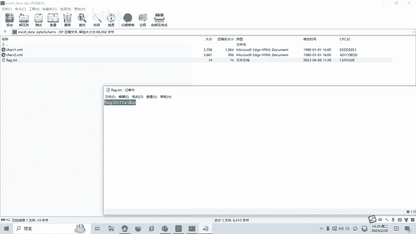

# 17-网络安全CTF系列培训教程之Misc杂项篇-隐写术之excel隐写 - P1 - 武汉网络安全CTF培训 - BV1dH4y1j7eo

大家好，我是阿阳。我们制作此视频的目的是希望帮助一些想要学习CTF的同学快速入门，提高CTF经技水平。本视频为CTF网络安全系列培训教程。后期将会持续不断的更新。大家如果有兴趣进一步深入学习CTF。

可访问PPT上面的公司网址进行电话联系，或者扫描视频中的二维码进行报名咨询。我们的教师团队均来自CTF省赛世赛前10名选手，通过顶尖战队的手把手指导大家学完之后即可达到省赛世赛的夺奖水平。首先。

大家一定要遵守网络安全法。本课程内容仅用于CTF网络安全教学培训，请大家遵守相关的法律法规，勿用于其他用途。今天这节课主要是讲CTF比赛中的excel引写数。那么什么是excel引写数呢？

excel引写是一种利用excel文件的隐藏功能来隐藏信息的技术。通过在excel文件中插入隐藏的文本或图像，可以将信息嵌入到文件中，而不引起怀疑。excel引显呢可以用于隐藏敏感信息或进行秘密通信。

在学习excel引写术之前，我们介绍一下常见的文件标志。以下这张表呢记录的是一些常见的文件头。的1六禁制的一个标志。在CTF比赛中呢经常遇到，需要大家呢熟练掌握。

例如excel和ZIP的文件头呢是504B0304，说明呢excel文件的后缀呢可以改成ZIP格式。CTF比赛中的excel影写呢一般有以下几种引写方法，包括第一数据隐藏。

将信息呢隐藏在excel文件中的数据中，例如在单元格图表或者呢公式中。第二，文件格式。利用excel文件的特定格式和结构来隐藏信息。例如，在文件头或尾部插入隐藏信息。第三是用明写工具。

通过特定的方法和工具来提取隐藏在excel文件中的信息。例如使用影响检测工具或者呢自定义脚本。接下来呢讲一下excel引响的实操部分。Yeah。我们打开这个excel文档。发现呢这是一个。图表。

the flag is under啊，在这个图表下面。我们如何来找到福奈个呢？🎼前面讲过XLSS文件呢，它是1个ZIP格式，我们可以把它改成ZIP压缩包。然后呢，在这里面寻找。

是吧在图表里面恰次这个文件里面有一个flag，也就是这道题目的flag就是这个。

excel音写呢还有很多种音写类型和解题的方式，后面呢将会针对各种类型的excel引写数制作相应的教学视频。大家呢也可以扫描视频中的二维码，领写资料或者报班学习。好了，今天的课程到此结束。

感谢大家的观看。🎼。

🎼记得一键三连。