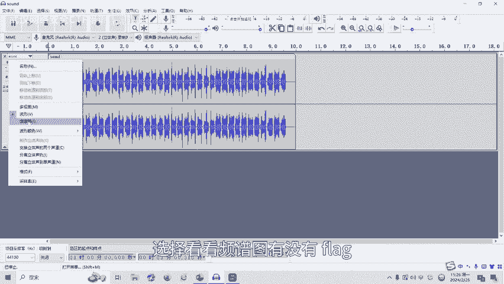
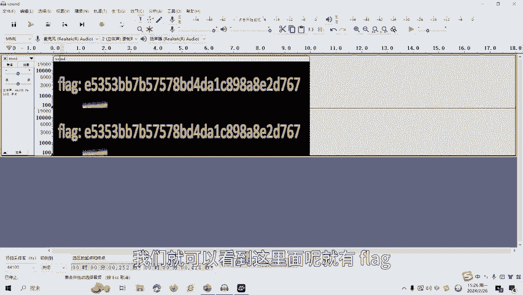
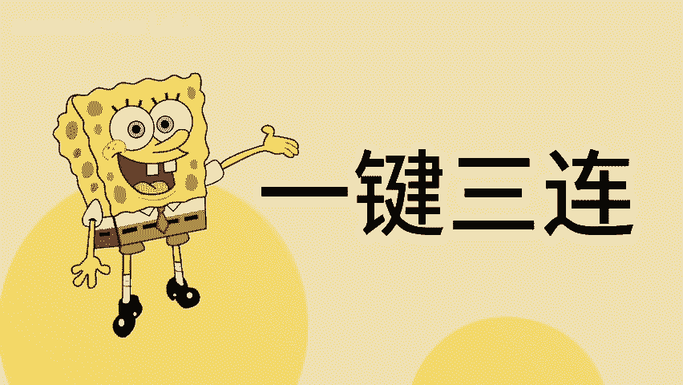

# 18-网络安全CTF系列培训教程之Misc杂项篇-隐写术之音频隐写 - P1 - 武汉网络安全CTF培训 - BV1Sm411S7u7

大家好，我是阿阳。我们制作此视频的目的是希望帮助一些想要学习CTF的同学，快速入门，提高CTF竞技水平。本视频为CTF网络安全系列培训教程，后期将会持续不断的更新。

大家如果有兴趣进一步深入学习CTF可访问PPT上面的公司网址进行电话联系，或者扫描视频中的二维码进行报名咨询。我们的教师团队均来自CTF省赛世赛前十0名选手。通过顶尖战队的手把手指导，大家学完之后。

即可达到省赛市赛的夺奖水平。首先，大家一定要遵守网络安全法。本课程内容仅用于CTF网络安全教学培训，请大家遵守相关法律法规，勿用于其他用途。今天这节课主要是讲CTF比赛中的音频影写数。

那么什么是音频引写数呢？在多媒体的研究中，人们已经对以数字图像为载体的数据隐藏技术进行了很多的研究。但是呢随着影写技术的发展。在音频文件中进行数据隐藏，也在安全通讯中得到了很多应用。

接下来介绍一下CTF比赛中常见的音频影响工具，包括。audio sittingttingsIMP3STEGO等等。我们呢重点讲一下CTF比赛中用的比较多的一些工具。

AUDACITY呢是一个跨平台的声音编辑软件。用于录音和编辑音频，同时呢存在波形及频谱分析，可对音频的频率及波形变化呢进行处理分析，也可以对生效呢进行转换。能够进行分析可能的隐藏信息。

CTMI中呢常见有以下两种解体方法。第一种的方法呢就是查看波形。按住键盘的左下角的框调按键，同时来滚动鼠标的滚轮，即可对波形图进行放大或缩小操作。根据波形来查看啊音频的声音变化啊，反应波的形状。

寻找的引写规律。第二种方法呢是查看频谱。转换查看频谱图，然后呢分析频谱的信息。一般呢在音频的隐藏中呢，存在将信息隐藏在的频谱中。最后呢讲一下音频音写的实操部分。这里呢有一个音频文件，我们点开。Yeah。

可以听到呢有一段声音，那么呢这里面呢有没有隐藏flag呢？

我们用这个软件。打开。可以看到这里面呢是一个波形图。那我们。选择看看平谱图。

有没有flag？通过平图图呢，我们就可以看到这里面呢就有flag。那么呢这就是这道题目的答案。

音频音写呢还有很多种音响类型和解题方式，后面呢将会针对各种类型的音频音写数呢制作相应的教学视频。大家呢也可以扫描视频中的二维码，领取资料或者呢报班学习。好了，今天的课程呢到此结束，感谢大家的观看。🎼。

