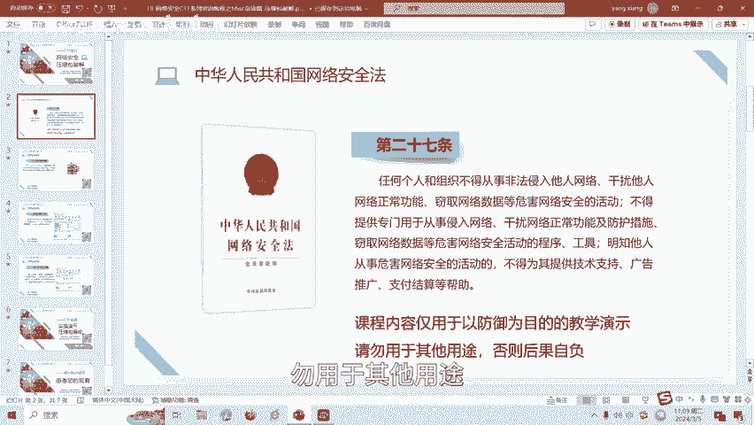
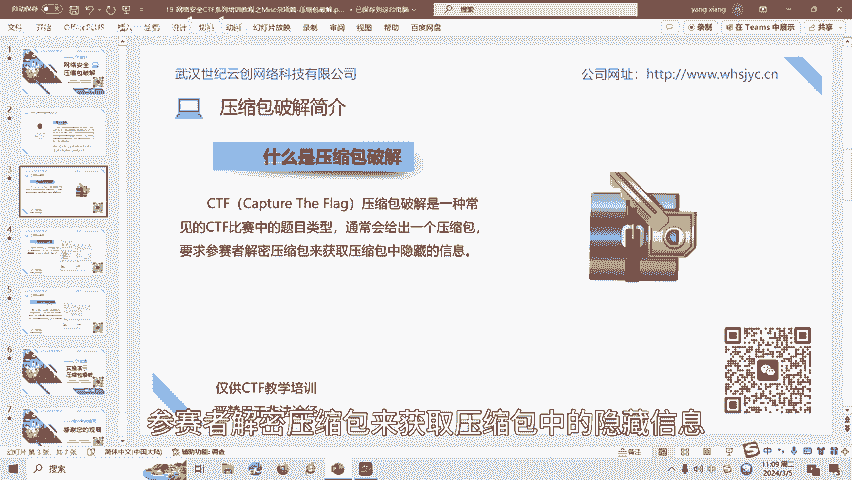
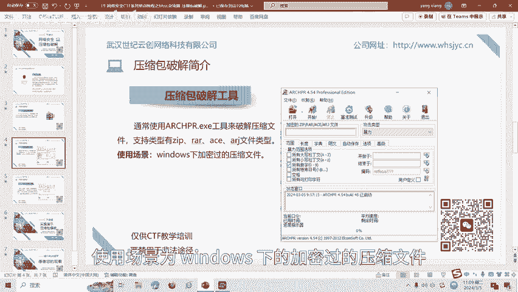
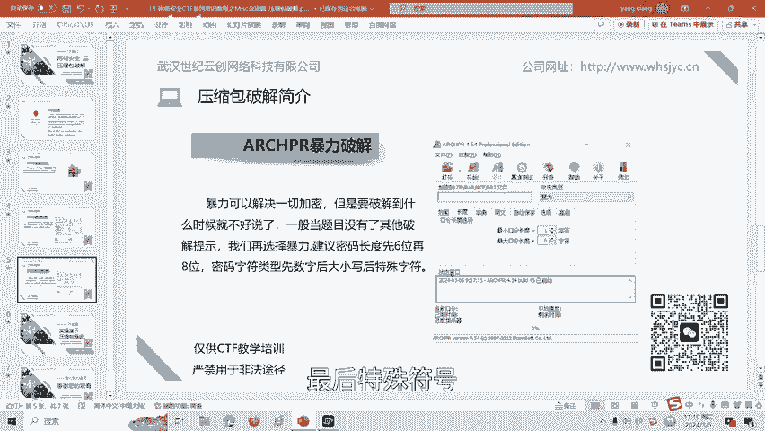
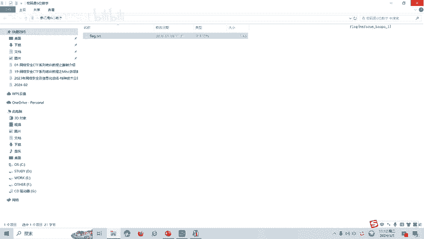

# 19-网络安全CTF系列培训教程之Misc杂项篇-压缩包破解 - P1 - 武汉网络安全CTF培训 - BV1Uj421m71K

大家好，我是阿阳。我们制作此视频的目的是希望帮助一些想要学习CTF的同学，快速入门，提高CTF竞技水平。本视频为CTF网络安全系列培训教程，后期将会持续不断的更新。大家如果有兴趣进一步深入学习CTF。

可访问PPT上面的公司网址进行电话联系，或者扫描视频中的二维码进行报名咨询。我们的教师团队均来自CTF省赛世赛前10名选手，通过顶尖战队的手把手指导，大家学完之后，即可达到省赛世赛的夺奖水平。首先。

大家一定要遵守网络安全法。本课程内容仅用于CTF网络安全教学培训，请大家遵守相关的法律法规，勿用于其他用途。

今天这节课主要是讲CTF比赛中的压缩包破解技术。那么什么是压缩包破解呢？CTF压缩包破解是一种常见的CTF比赛中的题目类型，通常会给出一个压缩包，要求呢参赛者解密压缩包来获取压缩包中的隐藏信息。

接下来介绍一下CTF比赛中常见的压缩包破解工具，通常呢使用ACHPR点EC工具来破解压缩文件。支持类型有ZIPRAARACEARJ文件类型，使用场景为windows下的加密过的压缩文件。

我们重点讲一下CTF比赛中用的比较多的压缩包暴力破解。暴力呢可以解决一切加密，但是呢要破解到什么时候就不好说了。一般当题目没有了其他破解提示，我们再选择暴力。建立密码长度呢先6位再8位。先数字后大小写。

最后呢特殊符号。

最后讲一下CTF压缩包爆破的实操部分。这是一个压缩包，然后呢，题目的提示是密码是6位数字。那么我们打开ARCHPR这个文件。然后呢，加压缩包放入进去。我们先把。密码的个数变成6个。数字勾选数字。

然后将压缩包拖进去进行暴力破解。好，破解出来了这个文件的密码呢是123456，我们复制一下。然后这里面呢就有flag。那么呢这道题目的flag呢就是这个文件的答案。

压缩包破解呢还有很多种方式，包括字典攻击、掩码攻击、伪加密、铭文攻击等。后面呢将会针对各种类型的压缩包破解呢制作相应的教学视频。大家呢也可以扫描视频中的二维码领取资料或者保班学习。好了。

今天的课程到此结束，感谢大家的观看。🎼きた。