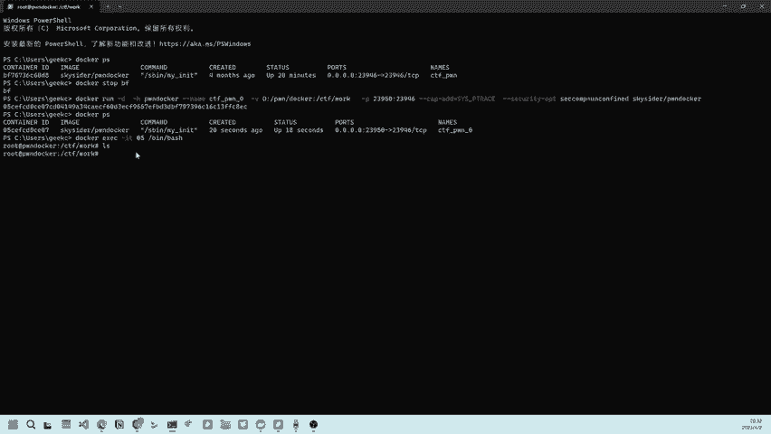
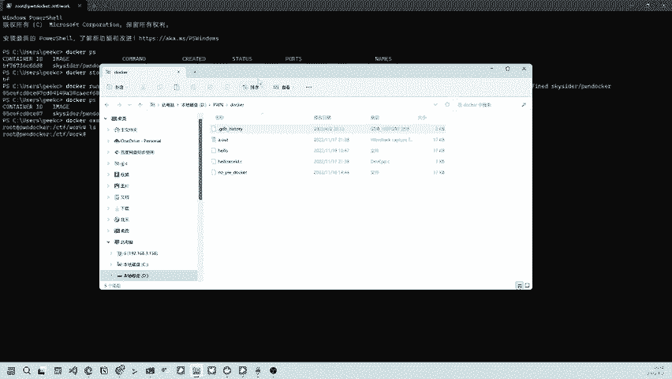
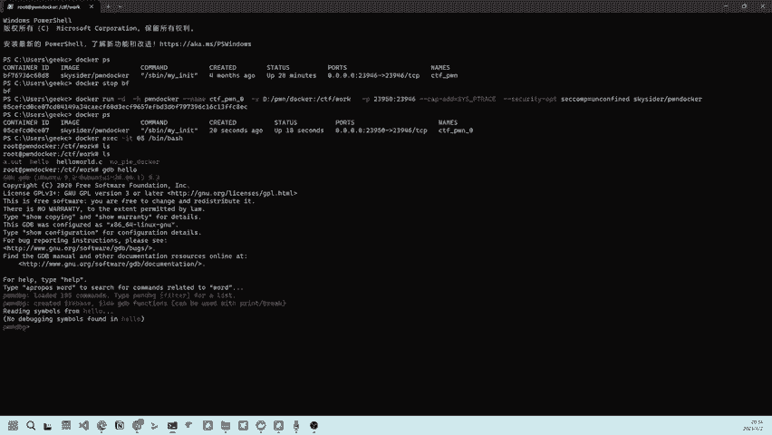
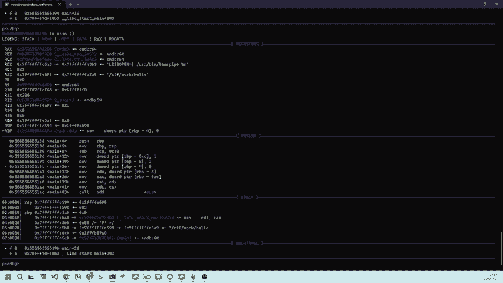

# 1分钟搞定 使用docker 一键搭建 ctf pwn 环境 - P1 - 极客信 - BV1yw411472N

大家好，今天跟大家分享一下，在windows环境下使用docker来搭建。胖环境。怎么运行我们的docker呢？只需要这么一行。就是我们运行这个pdocker，然后呢给他起一个名字。这里。是CTF胖。

因为从了那我们就就叫CTF胖。聊吧。杠V呢就是映射我们的windows主机的目录和docker里面的目录。我们的D盘的炮下面的这个docker。链夹映射到CTFwork。刚P呢是端口。

因为有时候我们要远程调试，就需要这个端口。前面这个是主机的端口，后面这个是docker内部的端口。后面这两个参这几个参数呢是就是让这个。呃，容器环境呢具有这个linux的全部的功能。大家可以这样理解哈。

后面是这个是我们要运行的这个镜像，点回车就可以。好。因为这里我们的镜像都下载下来了，所以说我一回车接着就运行了。这是它的RD05CEF。我们再看一下。大家可以看到它已经运行起来了。

我们怎么进入我们的这个容器呢？嗯Docker。你嗯。后面加我们的ID。加05就可以哈，不用写全。嗯。回这好了，我们已经进入我们的这个。隆起来。我们可以看一下，直接他就进入了CTFwork。这个目录下。

下面呢我们在这个windows这个文件夹下面放上我们需要调试的程序。

粘贴过来，然后呢，我们在dock里面也可以看见。现在我们就可以调试了。b d b。Thank you。这都是容器里自带的，帮我们搭建好的环境。

调水。

是不是非常简单？