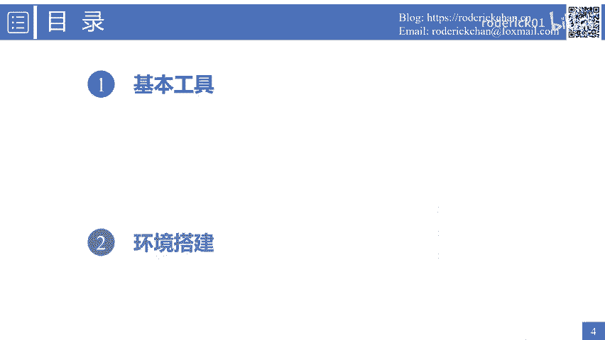
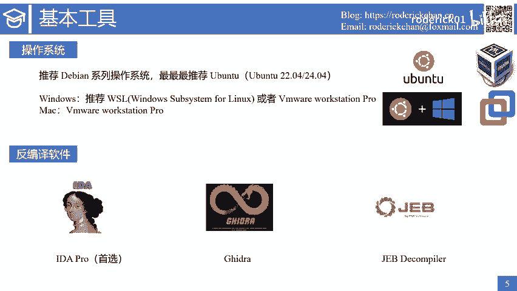
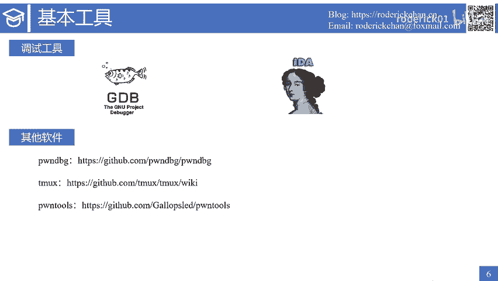
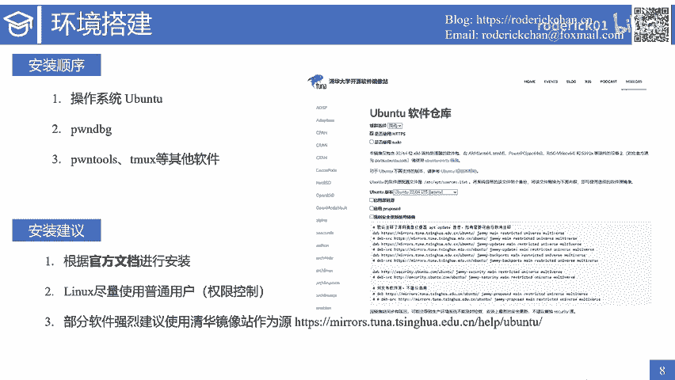
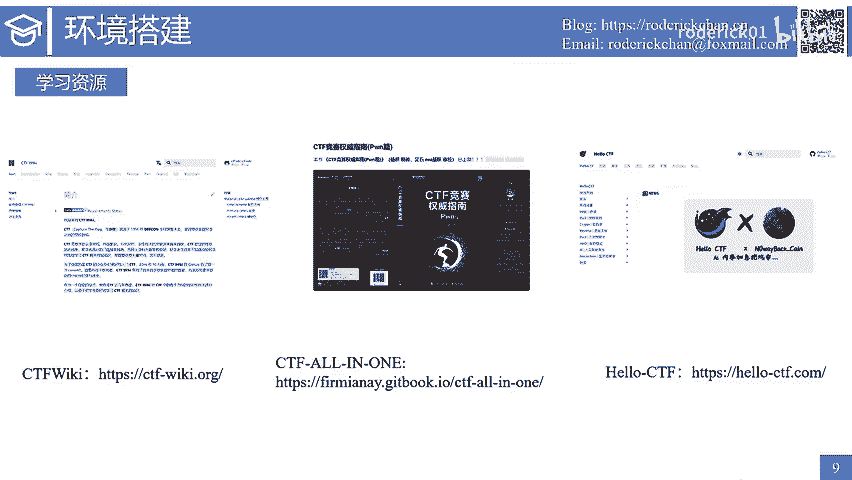
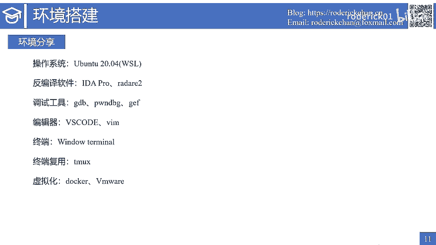

# 2. pwn基本环境与工具 - P1 - roderick01 - BV1yi421d7r5

大家好，我是roadrick。从今天开始，我将给大家带来一门名为快来胖一胖的系列公开课。大家可以在哔哩哔哩或者youtube上面观看公开课的系列视频。下面有我的个人博客地址，以及我的个人邮箱地址。

大家在观看视频的过程中，如果遇到了什么问题，都可以发邮件与我交流，或者直接在评论区给我留言。右下角分别是山海关安全团队的微信公众号和我个人博客的微信公众号，欢迎大家扫码关注。

特别是我的个人博客微信公众号。关注后，你将能及时收到最新的课程视频信息。本节课是快来胖一胖系列公开课的第二节课，主要讲解胖基本环境与工具。在正式开始介绍环境与工具之前，需要说明的是，在本节课中。

我所介绍的胖环境与工具只是一些最基本的、最常用的，并没有把胖所需要的所有工具都罗列在这里。另外我不会介绍任何工具的详细安装步骤，因为这些安装步骤都可以通过一些博客搜索得到。但是我会给出一些安装的建议。

分享我的常用环境，以及分享我在学习胖的过程中所收集到的学习资源。我将从以下两个方面进行介绍。首先是与胖有关的基本工具。第一是操作系统的选择。如果有条件的话，我推荐直接使用lininux系统。

并推荐de系列的操作系统。当然，最适合学习胖的操作系统是乌班图。

根据目前的版本，推荐大家下载乌班图20。04或者22。04。大家在选择开源的操作系统时，尽量选择LTS版本。也就是长期支持版本。如果你的电脑的主力系统是windows，那么我推荐WSL。

也就是windows subsystem forlinux。当然，在windows平台下面还有另一个选择，就是安装一些虚拟机软件，比如有开源的virtual box。也有更加专业的VM well。

如果你是mac电脑，最佳的选择就是安装VMwell软件。第二，学习逆向和胖的过程中，最重要的工具是反编译软件。这类软件将二进制码反编译为汇编语言，或者直接反编译为人类能够读懂的高级语言伪代码。

主要是C代码。反编译软件中最推荐的当然是idda pro，其次有开源的gi爪。这个软件对于反编译mpsarm等架构的效果非常好。还有另一个软件，JEBcomp也是一款非常强大的反编译软件。

通常我们在解决安卓类的题目时会用到该软件。

调试工具也是另一类非常重要的工具。如果你已经习惯了使用图形化的调试软件，那么你一定要慢慢学习并接受命令行式的调试工具。我们使用最多的工具是GDB这个工具是linux平台下最强大的调试工具。另外。

挨打也是一个调试工具，并且支持多种调试模式。关于GDB和艾da的使用，我会在后续的课程中进行详细的介绍。最后还有一些其他必备的软件，比如胖 debug是一款著名的GDB调试插件。

主要使用pyython语言编写。与之类似的还有jeff和pada。但是如果学习胖的话，我最推荐的还是胖 debug。注意这个词的拼写是胖 debug，而不是胖GDB。胖GDB是另一款。GDB的调试插件。

另一个推荐的工具是Tm，这是一款非常有名的终端复用工具，常常与下面的pts结合使用。胖tus则是一款非常强大的二进制攻击框架，使用pyython语言开发。这个pyython库是入门胖的必学库之一。

以上介绍的就是与胖有关的基本环境与工具。

接下来介绍环境的搭建工作。我建议的安装顺序是这样的，先安装操作系统，然后安装p debug，接着安装pts tm以及一些其他的软件。之所以使用这个安装顺序，是因为我们在安装胖迪bug的过程中。

它的安装脚本会帮我们安装一些必备的软件和工具。另外我会给出三条安装建议。第一，请尽量根据官方文档说明进行安装。尽管有很多优秀的博客介绍了如何搭建一个基础的胖环境。但是我们要知道，博客是可能会过时的。

而这些软件都在不断的进行更新，安装方式可能会发生改变。我们需要从博客里面知道的是学习胖有哪一些比较好用的工具。第二，在使用linux用户的时候。尽量使用普通用户。

结合sudo命令进行一些需要root权限的操作。这样会有助于你理解lininux系统上的权限控制机制。第三，部分软件强烈建议使用清华镜像站作为镜像元。例如，我们在更新乌班图软件的时候。

可以将圆替换为清华园。清华镜像站可以说是国内的几个镜像站中维护的最好文档写的最清晰的一个镜像站。关于所有软件的原替换方案都有详细的文档说明。

在学习胖的过程中，有哪些学习资源呢？首先给大家推荐的当然是CTFvicki。我当时入门胖的时候，就是跟着CTFviki一步一步进行学习的。

另外还有CTFO in one以及其出版的CTF竞赛权威指南胖片也非常值得参考。当然，还有碳极师傅维护的helloCTF也是一个非常不错的CTF入门手册项目。以上三个网站不仅仅有胖相关的学习内容。

而且有CTF其他方向的知识点。

此外，在这里给出一些常用的胖学习与刷题网站。如图片所示，最有名的网站是p点college，还有pable点TWpable点KRHTB网站等等。国内还有一个很有名的BUUCTF刷题网站。有许多优质的题目。

需要说明的是，在学习胖的过程中，一定要学会充分利用搜索引擎。搜索自己所需要的学习资源，这些资源可能是一些文档或者一些师傅们的博客，某个漏洞的POC等等。平时只要多搜索，多积累，多学习。

就能不断的取得进步。最后。在这里分享一下我学习胖的时候所使用的环境。在操作系统上面，我目前使用的是乌班图20。04，并使用WSL系统。

使用这个系统的好处是WSL里面的linux发行版会自动挂在宿主机里面的硬盘。也就是说，宿主机与虚拟机之间的文件互访问操作将会非常的流畅与丝滑。此外，WSL的网络也不需要进行额外配置。

local host域名可以解析到WSL虚拟机的IP地址，不需要额外的端口转发。此外，还可以直接在WSL虚拟机中使用VS code。VS code提供了一个官方的插件，用于访问WSL发行版。

我使用的反编译软件是idda pro和R two，一个在windows上面使用，一个在linux上面使用。我使用的调试工具也是GDB配合胖 debug插件jeF插件。编辑器则是VScode的为主。

有时候也用一用them。终端主要使用windows terminal，终端复用工具主要使用tm。此外，我也安装了虚拟化的工具，比如dockerdesktop和VM well。

本节关于胖基本环境与工具的课程到这里就结束了。如果你对课程有什么疑问，欢迎在评论区给我留言。下节课我将讲述逆向软件挨打的使用方法。最后在这里祝愿大家学习顺利。

