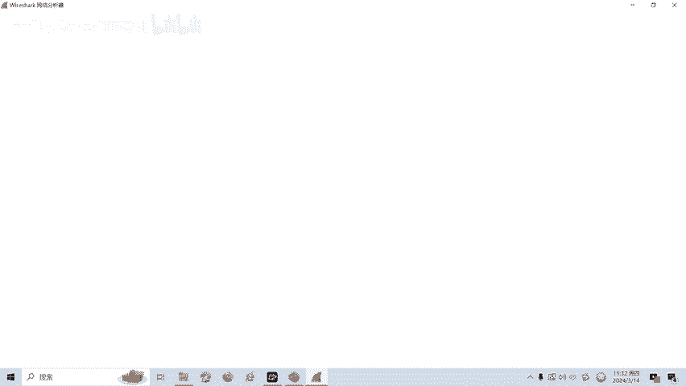
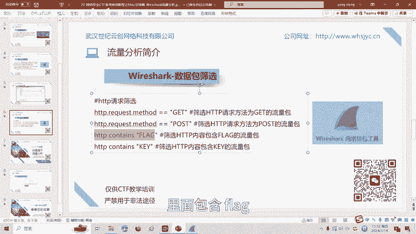
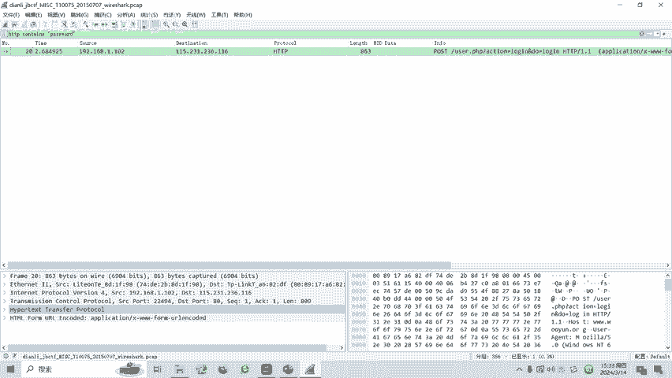
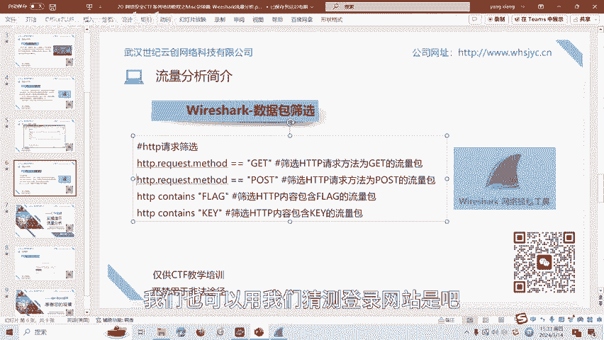
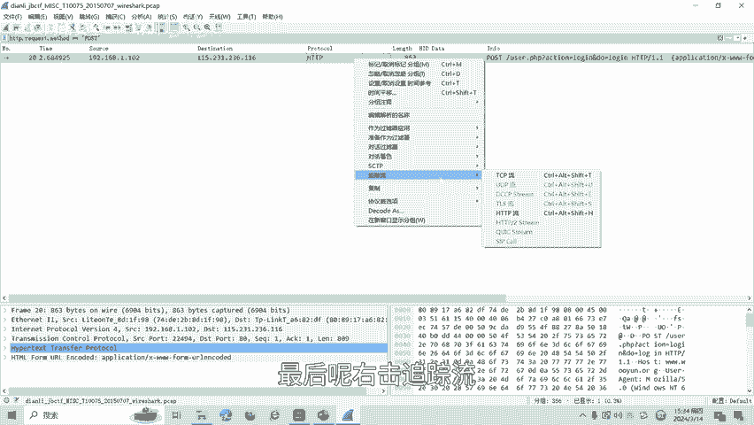
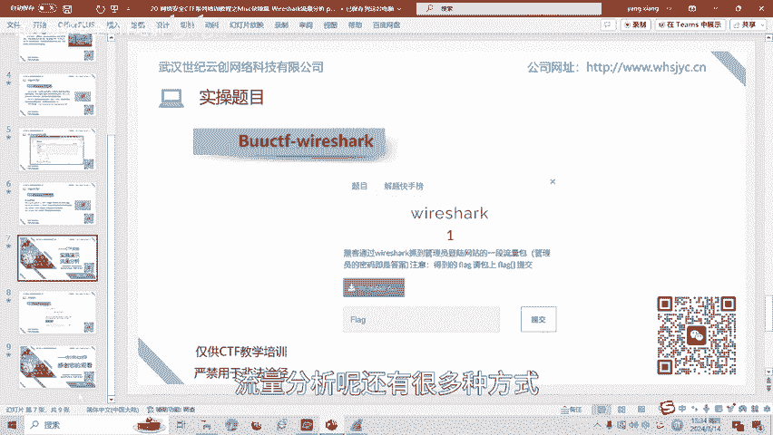

# 20-网络安全CTF系列培训教程之Misc杂项篇-Wireshark流量分析 - P1 - 武汉网络安全CTF培训 - BV1am411o7ov

大家好，我是阿阳。我们制作此视频的目的是希望帮助一些想要学习CTF的同学，快速入门，提高CTF竞技水平。本视频为CTF网络安全系列培训教程，后期将会持续不断的更新。

大家如果有兴趣进一步深入学习CTF可访问PPT上面的公司网址，进行电话联系，或者扫描视频中的二维码进行报名咨询。我们的教师团队均来自CTF省赛世赛前10名选手，通过顶尖战队的手把手指导大家学完之后。

即可达到省赛世赛的夺奖水平。首先，大家一定要遵守网络安全法。本课程内容仅用于CTF网络安全教学培训，请大家遵守相关的法律法规，勿用于其他用途。今天这节课主要是讲CTF比赛中的流量分析技术。

那么什么是流量分析呢？在CTF比赛中，通常会有一些PCAPPNG或者PCAP后缀的文件数据包。不同的数据包有不同的协议，常见的有HTTP协议。TCP协议。当然呢，CTF中考察的协议很多。

我们需要从这类文件中呢进行分析。获取数据，最后呢找到我们想要的答案。flag。接下来介绍一下CTF比赛中常见的流量分析工具。Y sha。2下克呢是一个网络风包分析软件。

网络封包分析软件的功能呢是采取网络封包，并尽可能的显示出最为详细的网络风包资料。Y下呢使用的是winPCAP作为接口，直接与网卡呢进行数据包豹纹交换。在CTF中，数据分析类型的题目呢一直是一个热点。

这类题目呢需要参赛者熟悉各种网络协议，熟悉常见的网络攻击手法。官方的下载地址呢如PPT所指。现在我们看一下Y sha的图形界面。里面有菜单栏、工具栏等等。其中呢CTF中最常用的是过滤表达式。

接下来我们介绍一下最常见的过滤表老师HTDP请求筛选。HTTP点request点med等于get就是筛选HTTP请求方法为get的流量包。

HTP点request点med等于post是筛选PPT请求为post的流量包。HTPcon flag就是就是筛选的HTPP内容包含flag的流量包。

APP contest key就是筛选HPP中内容中呢包含K的这个字符串的流量包。最后呢讲一下流量分析的实操部分。学收题目为。BOUCTFY shack。啊，题目为黑客。

通过Y夏抓到了管理员登录网站的一段数据包。这段数据流量包呢，管理员的密码呢即是答案。从题目可知呢，我们需要得到管理员的密码，而这个密码呢就是flag。我们就打开这个数据包文件，点PCAP或者名。

然后前面讲过啊。HTP我们比如说。里面包含flag，我们查找一下这里面有没有包含laag字符串。

密码为pass word，我们查一下pas word这个。含有pass word字符串的流量包，我马还下回车。法院查到了是pos的请求，可以看到是一个po请求。

有异议。那且T预留可以看到password等于这个，那么这个就是答案。同样的。我们也可以用我们猜测登录网站是吧？登录网站是不是要输入账号和密码，对不对？那么。

账号密码它大概率是使用pos串餐，对不对？我们回车查一下，也能查到这个流量包。最后呢右击追踪流APP流也能找到password，这是这两种方法。

流量分析呢还有很多种方式。

后面呢将会针对各种类型的流量分析，制作相应的教学视频。大家呢也可以扫描视频中的二维码，领取资料或者报班学习。🎼好了，今天的课程到此结束，感谢大家的观看。学文刚刚好。

🎼泼泼水来搓泡泡，今天这是美。