# 2023 hackergame部分题目讲解 - P1 - 刻不牢不雏鸾 - BV1qj411Y7iA

好，那么今天给大家带来的是pack game的部分你题的讲解。然后这是2023年的第一道7道题。那首先呃我们看一下屏幕。题目我们看到的意思就是说。呃，这边他有一段音频，然，音频播放就是它有变制启动。

然后他让我们去录制一段音频，我们开始录制。然后我们这边说话通麦麦克风给他传音频，但是一般的话。嗯，他他这边会会相似度，然后停止。他焦度会这边是76%。看起来感觉像个随习数始。就他不是很大。

然后这边给他传一下，传一下他。提升你说必须达不到99%才能拿到答案。那。呃，我们看到我们的相度是76%。但是99还很远。你该怎么怎么做呢嗯。其实他跟去年的题一样，去年题也是类似的一个，让你去画个图。

然后取上你判断相似度。今天也是，然后让你去把这个像素度也给改一改。然后你这咱们这边随便传一个比99%大的数字都可以。像999999这边随用传几。然后就可以导导出答案。呃，然后答案就是这是第一题。啊。

类似于一个原生的启图界面，对吧？然后我们再看下一道题。那下一道题是猫咪小测，那猫咪小测就是说让你去搜一些题目，搜一些他问的问题。查看一百度的技巧。但实际上这种题除了去直接在百度的话。

还有一些其他的其他的技巧。像这种，如果说它一个非负整数。啊，提升你答案非复审述的话，咱们可以呃改变咱们做题思路。那。你把这个这个网址。这网址去复制到我们的PPBP就是之前说了一个b suit。

他是可以查看我们的浏览器跟一些网站的这个请求交互的过程。就可以修改他的数据包。这个咱们可以把上的数据报，然后我们咱们去看一看。都更给可以复制一下。好的你然后诶三几之边。那个恢复指数，这边比如传一。

这边传个啊商。对。然后这样提交，它是0，因为他6个0分不是不给不能给范的那如果说我们想要fl就是怎么获得？就不不通过呃不通过去直接查这些东西的方式。因为咱们去去查这东西可能也比较麻烦。

我们可以先提交一下。然后这边我们看到这个主机这个地址和端口还有方法。然后最重要是咱们去看这个参数，这边参数我们可以可以看到的是Q一等于1Q12，Q2等于12。也就是说咱们第一个问题。

第一个快速快速省的问题。的答案咱们给到了一，然后第二个是给到了商，然后后面就是呃Q3Q4。因为Q3Q4的话，它这边显示让你去。啊，一一串俗串比也比较麻烦。另外一个就是他他会因为是麻烦我。

所以说咱们先看Q1和Q2。然后咱们去看发送到一个introdu的模式。你说呃dota模式呃，它是一个爆破模块，就是可以对网站进行一个字典啊，或者说这些数据里爆爆破。然后咱们选中这个变量。

选中这个要改的地方，可以按着一个变量。就想去修改。嗯，这样。Cl。重重来一下。那就把这个呃Q一的值给它做一个变量，Q2值也给它做为一个变量。然后再再去给他穿了。个唔产没太问题。OK先好了。

然后s模式的话是一个默认模式，默认模式的呃，s号就是狙击手，然后他只能去同一之间，你看只能去修改一个一个变量，一个配loadload。那如果说我们想要去多多设置几个配load的话，咱们可以用报爆。

就是说技术炸弹。但实际就意思说。我们可以设置所有的变量，然后我们这边变量的是纯数字的话，他刚要求是呃恢复整数，然后咱们直接设置为。这边有一个设置可以设置numbs数字，然后fo就是说从几到几。

然后比如咱们从一到30，你看他问的是图书馆一楼层，那图书馆一般不是很高，一般咱们设置个比低数字就可以，就是咱们第一个，然后从几到几，然后就补查补偿咱们设置一。咱们学放循环的话也会遇到到这个东西。

然后第二的话。呃，还数数字还数字也是从一，然后涉及到一个比较合理的数字。比如说也是30。那我这边30的话对吧？十都是多少次，一嗯一分每秒，咱们先按30来算。如果你觉得本来来合适到第。

设备323千0都可以，但是比较。你设置的东西越长，它这个呃你需要包包的时间就越长。所以说设置是先在合理时验室去测试，然后这边不传一没设置，但它不能启动。那么系统攻击呃star attack。

你看这个速度其实不是很快。就如果说你设置成9309万，它这个加载速度是很慢的。所以说你。就是选择选择合语的范围去测试。然后他这边你看咱们每个请求都都已可以看得到。对吧这是第一个是6。

第一个是呃数字咱们设这是这个6，我们两个数字为一。然后嗯他会返回一个数据报完的长度，就是他这个。啊，他整个返回返回的一个长度，整返回数据包。我们可以根据这个访回书包的长度或者状态码。

状态码基本都是200，咱们因为都能访问成功。但如果说我们根据长度去判断的话，会发现。从大到小的话，会有一个不一样的数字，7193跟其他什么70067007都不太一样。那我们这时候看到。啊。

这个response嗯全屏response里头就已经有有了我们这个答案答案去提交就可以。啊，就是这是对于一个问答题，一个这样的问答题，他有没有什么他没没有什么这个防对吧？包括的嗯阻乱阻乱。

就像这种东西的话。嗯。纯数字你就可以去这样去试。然后初此之外呢，呃我们如果说拿拿到一些网站登录的后台，像比如这网站后台啊，然后或者百度的后台甚至。他假如也没有呃类似的防爆破这个手呃拦截手段。

你也可以这样去试通过字典啊，通过这样数字啊去猜都可以。这是前道题，前的道题就是就包括下来我们根据刚才数据的话。我们可以看到我们的请求。第一个是上，第二个是23，上和23。哎。

然后我们就可以看到然后第一个第一上的答案。我后面晚上不人都话，咱们。有个简单的方法，就是说把这个问题，像这种对吧比较通过的技术性的问题，这种一般都会有。就你去报给GPT报给GPT的话。

他都会给你解答出来，基本上先启动。然后这个就是你这个问题直接放给GPT，然后GPT就可以告诉你哎在什么什么地方用什么选项都可以。还开梯子，这边就。给他开一下。

然后这第第道第三道题就你把这个问题直接个对给GPC就会给你答案。然后第四个题的话就是说嗯。有个作者发一个一头上pathon的讲杂器，变行显杂器这喜欢的代码。然后你可你假如你还是不太方便去搜这些东西。

你可以同常去问GPT然后然后GPT你去问他。啊，这这种样子的代码，这种让什么他想去相自化的代码。可能发表在什么的嗯学术会议上。然后丢箱。可能发表在什么学组会议上。学术。唯意义上。Okay。

然后他就会跟你回了。呃，你这道题他就是你可以去多问他几个学术会议，然后挨个去试一试最后一个答案。然后这边先让它加载。很有是。那你加载哎先不管它，然后下个是更深更暗，是一个VBT。那VbT的话。

咱们先看打开网页，它这个也没有什么提示，直接打开网页。

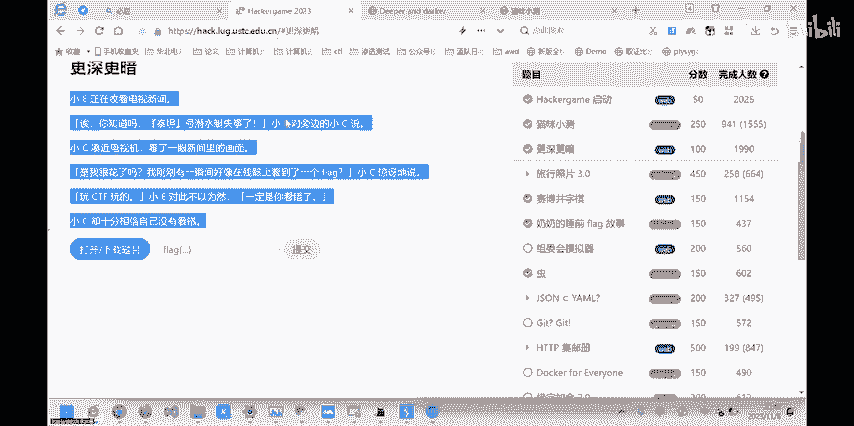

然，这个英文大概意思就是说让你去往下翻网址往下翻这个页面，然后一直往下翻，一直往下翻，就可以看出这个答案了。

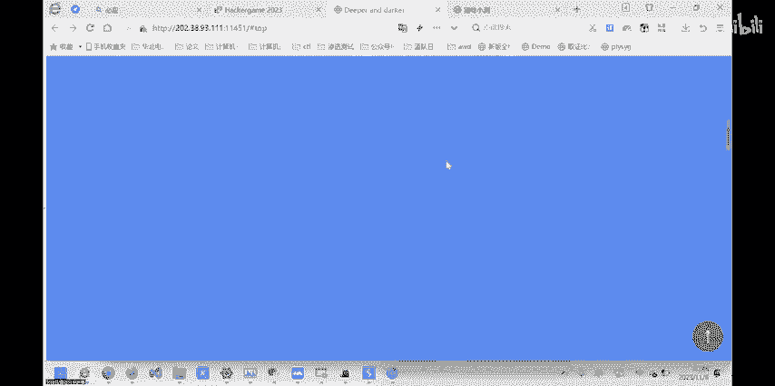

啊，但是你会发现你通过对吧？鼠标上的一些一些东西，比如什么配置到。

啊，不知道要这个。然后网上一直去去翻，我发现发现没有没有这个镜头，只会返回一些什么美术呀，还有一些计划啊之类的。

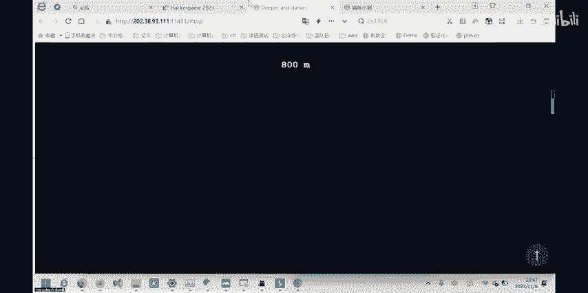

那我们就可以这时候我们去看到原代码。健康有点马好。嗯。看一看。都。没代码里般第一行第一个页页面没有什么呃提示和答案。然后我们翻一翻这些呃代码。那首先就是像这种黑体的，然后你看一看就是什么SPX啊这些。

他这些都是CSS比如说给页面进行一些装饰，同不是提起一些具体的决定性的工作人，他不会参与到一些什么呃计算呀或者限制或者其他的一些东西。好上。然后像这个平G。也也不会参与到这个这个跳转，呃。

也不会参与到这个页面这个跳转之类的问题。或者返回去的问题。错。关系到那些东西，关到关系到什么密码框啊，关系到其他的一些东西都会在JS以GS为结尾的，或者说看到这个规背的标志都会都是JS的一个标志。

那他这些就对网站的一个功能起一个决定性的因素。然后我们咱们先打开第1个GS，第1个GS题目是cpal点GS相于。呃，我们看一看这些东西，然后可以看到很多的数学方法。包括一些嗯顺便翻译发的。嗯。

包括一些什么移位啊，换位啊，还有艾4%，这些我这就是数学上一些比较底层的方法。然后他就是给网上进行加密之类的。然后这些。啊，但是就跟。跟答案关系不是很大。然后咱们再看另一个。另个是命JS是主函数。

那主函数这边啊它。冇 favor。比如FO还有AG。我翻到这边翻到这边看到这个函数。这个函数它的参数是我们的token值，然后这边有一行注释就是说生成这个flag，基于用户的这个token值。

然后设置还机还机这个变量，这个变量呢。嗯，我们看到呃通过GJS通过钢GJS。然后这个杀56的方法就是说用沙2文6理加密。啊，手段。把我们的tokentoken就是整个token。

然后并且是这个再加上前面这一段字不串。然后把它进行商澳物流的加密，再把它变成自助串。然后如果说他没有这个。呃，就是说比如他返回一只是整数或者说其他的东西，它把它给以变成字符上的形式去进行下下一步的处理。

那然后就会烫这个纸。we创一个flag flagag就是说呃前面这这段东西，然后还是点sice。然后哈slash就是说哈西是刚刚这个对吧？我我们刚刚这个编量slash，我们通过网上去查它的函数意思的话。

就是说。给他做一做。比如是21到5。然后s的话呃其实是0。这其实第一个字不是0。然后1到5的话就是从E开始截续截续到25。对吧这边截出截出来ELLO，然后就类似的话，就是说我们从第一个字不开开始截取。

然后截取30个字不上30呃，3个32个字。然后我们这边去看一看。如果说我们把我们token结合这东西。呃，群众呃去接取一下，看看是什么样结果。刷啊浏的加密在线加密，它都会有产品的工具。就卡。

先把前面这段给他记接去掉。然后为啥不截取这个变量和这个呃打括号因为这个整体的话就是。这个整体采用token啊不是说呃把它包括在一个什么包括号里，不是它的这个变量是我们token对吧？

然后不需要把它加进来，然后token就是我们做出一个凭证，这个主主页的会有。

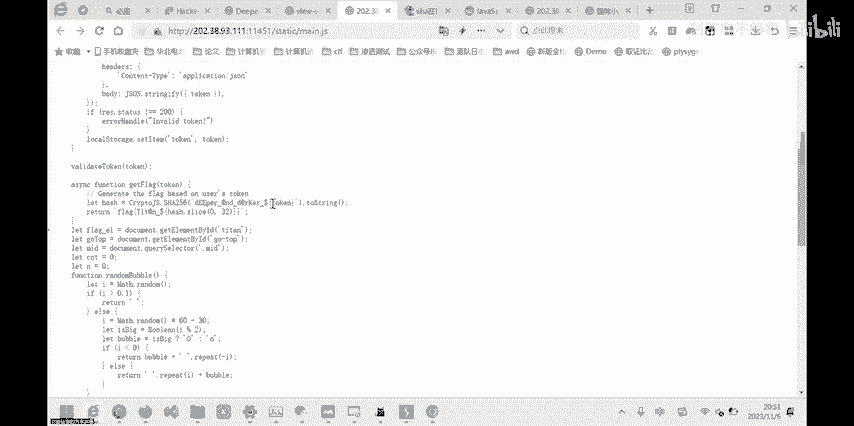

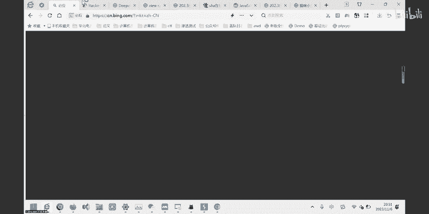

然后这样去刷过M6一个加密。M6加密之后，我们看到。得到一个结果。然后根据我们刚刚需要的是答案截取前三号尾。3上位123456对吧？到12。があす一番。但是。Okay。这个给他复下来。然后我们得到钱。

前一个。前段。好不。就前三三方位数字，然后去拼接到这个呃flag里头。那我们看看他有没有什么问题。然后你这边的话，因为这变量应该不会被加进来的话，然后直接这样去交。调整到频繁，稍等稍等一下。

就是咱们需要把这把这个变量值和变量这个符号，还有这个。嗯，括号给他删一下，然后才才能申学。对。然后这这前三题，然后是呃。重重点讲下这个题，这个题是三国节自题。这这几道外T，然后我们看到他的题目要求。

意思是说让你去赢下这个AI。你可以得录这个答案fag。但是如果我们正常去试的话，我们可以可以体验到你无论怎么去下，无论怎么去下。顶不会平局，甚至你有时候你再去st，你再去重启的话，你会发现你会输。就。

对吧底线是属，最多是平局。他致这样，所以说你要正常的通过呃正常手段去引的话，不太可能。然后我们这时候需要用到一个比较高错的工具，还是刚刚那个工呃工具。这是我们去看的另一模块。

我们先把这个网址给它复制下来，复制下来，然后登录。打电问头看。嗯，然后然后这个时候呢，我们先把把它这个记录清一下吧，cleear historyory就可以。为了方便我们我们去找我们这个。

这个网站它对对应的数据包是哪个？然后我们比如。放到第一位，然后这边AI生成一个，然后我们去看看他抓到抓到一个数据包。我们看到个pos方放。呃，你这边传了几个参数，一个是库里面传了三个参数。

三个参数前面就几个了。啊。前面这几个一个是JA一个是JA，然后一个变量，然后一个三成值，还有就是我们pos去创一个呃。上的一是数数组的东西，然后就X等于1，Y等于一大只角。嗯，从这边我们可能。

看到这边放了一个报。一负一这边我们还可能还不知道说什么意思。然后我这边看下原代码给你们大家讲讲解一下。还是刚刚说的，像这种CSS还有其他一些东西，大部分是没有什么呃。嗯就不需要他多关注。

然后说要关注是这个GS它的功能性的问题。然后我们用包数做了自带浏览器，会发现它这个出现出现了一个什么。他扔落满了落满了之后，咱们把它放到我们其他的一个浏览器里头。那我们看到这段切头。

我们看到初始化一个呃一个版，就是说初始化这个这个系盘。都是零初始都是零。然后我们这时候如果说。呃，报着X的话，X就是呃安行第几行就是X。然后Y的话就是第几列。比如说报了呃0X等于0Y等于0。

那就是第一行第一列。对吧X等于2的时候，那是第二行。然后如果说呃比如第一行第一列这个值里面的值是一，然后这边你可以看到。这边变成一个零，变成一个O。也就是说他这边你棋盘正面是O。就是AI下的位置。

然后这如如果是负一，对应的是X，也就是说我们在装取数据包里头，我们去看那一就是对应的AI数据。负一是对对应我们的数据，然后我们去修改这个可以修改X和Y。然后去我就把操操操纵这个吸盘。你这边的话。

我们继续再看看有什么分析的没，就这意思就是说连成对吧？连成一行的话就可以。就可以得到答案，就可以输出答案。嗯，我们继续去把它发送到1个B端模块。B端模块就是我们手动去修改。呃，它的这个不是包括模块。

跟包括模块不同区别在于就是说包括模块你呃去发出很多的需求，就配上模块就是你。I个。So。自自己去手手动去发送一些东西。手动去修改，然后比如我们这边先输入这里呃，一对一，还是跟刚刚一样的数据。

然后我们这边去发送的话，我可以看到。网上还是。我子返回返回我们这个东西，呃，知到返回的一个。棋盘还有三0的一个一个值。然后我们可以看到三热值被改了，对不对？三分值我们刚刚的三乘值是什么意外开头。

然后一对一，然后S。由PK结尾，然后这边是什么SU对吧？说明他已经被修改了，然后我们再去试着再发一次，再拍一次fin。我们可控参数。不只是有这个X和Y，还有这个session，对吧？就是说。嗯。

我们每次发送请求，他暂个时也会被修改掉。嗯，然后如果说。其实这样我把出现一个问题，就是说。我们走完第一步，然后我们还要想走进一步的话，比如说我这边已经这样了，然后我们想再下一步再走到这个位置。

再走到这个位置，如何去修改它的数据包呢？嗯，我们是发现如果说直接去改，比如这对吧？我们刚刚说。And。第二行第一列就是对应X等于1Y等于0。然直接去发的话。会发现我们上一步的系他能用被保一保，对不对？

这就相于还是。像双方都只制走了一步，那说明。咱们能改pos参数，只有这个。而我们不能去修改棋盘那个参数，那棋盘的参数肯定是呃建立在就隐藏的这个30里头。所以说我们把这个三tion去修改的话。

把三省里的东西去改成我们的s省。我觉得先改成一一的。就是说我们连通这个棋盘的一个呃一个状态给他去修改。你可以看到了。嗯，看到修改的话，咱们这边还得去然后下一步。然后下一步我们我们可以去试着。

如果说能把这个AI的这一步给它覆盖掉，我们可以试一试。也就是说我们在左边AI走个左这右路，然后看能不能把它覆盖。我发现。0度0被我们修改成-1。嗯，然后。我们刚走的位置也没有变，然后AI只走了一步。

那说明我们的想法是正确的，就是说我们可以通过修改AI的这个布布子的代。达到我们的一个目的，达到我们对吧？电持一切。然后这样我们我们斜斜来斜着从账，然后这之后再又还想再给他来一个妻子。

然后就可以得到我们的答案。但是刚刚这个。你感方超嘅 made up a boil。刚制地方就给他保保留一下那个位置。就他。到这一步时候，你还得再给他给还了一起吧。然后再改再改上。ok讲搞到怎打。嗯。

大数据通过呃数据包的数据包的一个修改，然后并且对棋盘AI下构的部子进行一个覆盖。然后就是说把他他这个sessionID呃session词序给他。保留下来。就可以对吧？就可以达到咱们的目的。呃。

那是这道题。然后另外一道题就是说。奶奶睡前f个故事，然后他是AF辅助创创作一团化。那么我们看到这段画里边，它标刻了几个字。呃，他前面的意思就是说他丢一个手机，然后又买一个新手机，然后买买国国规的巷子。

然后说谷歌像老鼠记。联系度没有说升级，那说明他是意思。咱们可以推测，就是说他呃系统存在一些漏洞，老版本存在一些漏洞，还没有升级。然后并且他截图。他对于这段呃这段内容进行一个接触。

然后并且呃把他后面一段给他裁裁剪掉了。那我们就可以猜测就是说这个老版本这个手机它在截图方面有一些漏洞，我们可以去搜。先搜先搜一下谷歌手机，谷歌的清子。我们数五个的相子会发现。

但是以像顾一次顾客手机下平板设备，然后。比如谷歌的手机存在什么漏洞？录都。你看了很多对吧？我就包括其他一些。呃，远生执前啊必行的东都都有。但是我们再看看他还里提示是截图。你截图的话，嗯把图片。保留一下。

就图片怎么样？我们把这 click开。且兔有肿。哎，你们可以看到一个关于。呃，一A开开出一个呃一个一个姿制的检漏洞，然后他就是截图漏洞。我们看到这这些列表贴气。

就是今年年初facebook手机被率曝出一个安全漏洞，然后他就是呃。漏洞的话，你可以去搜他这个名字名字，然后也可以去搜他1个CVE编号。CVECVE就是一个漏洞的编号。这这嗯。啊，除了这。说的，没找了。

对，你像他这个CVE2302023。28303，然后他就是呃它的一个编号，你可以去搜它的编号，也可以看到它对吧？它这个相应的呃漏洞。然后咱们这边看一看。我们看到呃最漏洞的在线利用工具或者复线原理。不见。

不行可以。复现，然后去查去查，然后他这边就不多查了，这边不多查，大致意思就是说最果找到呃你去搜下工具，搜这样一个工具就可以就已经有官方人员去把它去复现了。

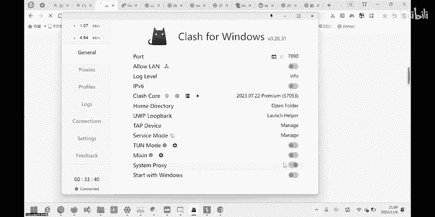

然后这边的话我们可以看一看。呃，我这边已经把一个图片保存下来，然后把它直接。直接弄就行。

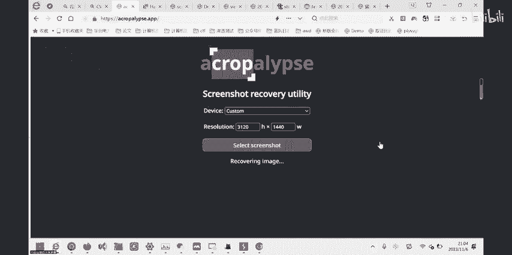

嗯，然后他他这个问。他这并没有出来，但是。

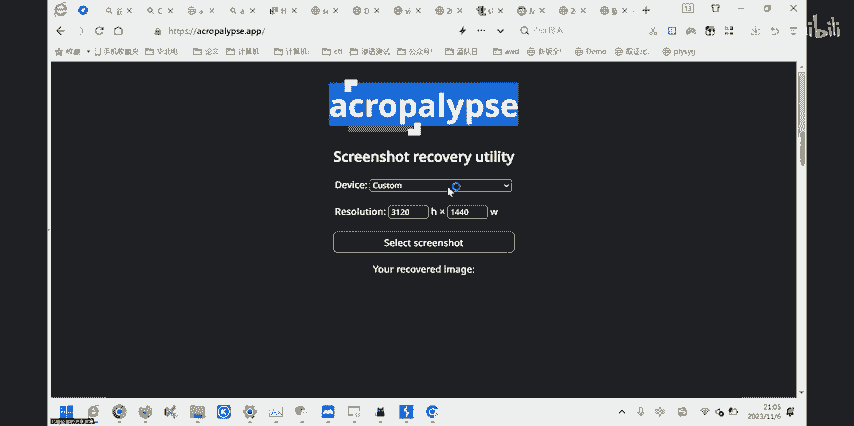

然后咱们再可以换换一下他的这版本号，然后再去试一试。

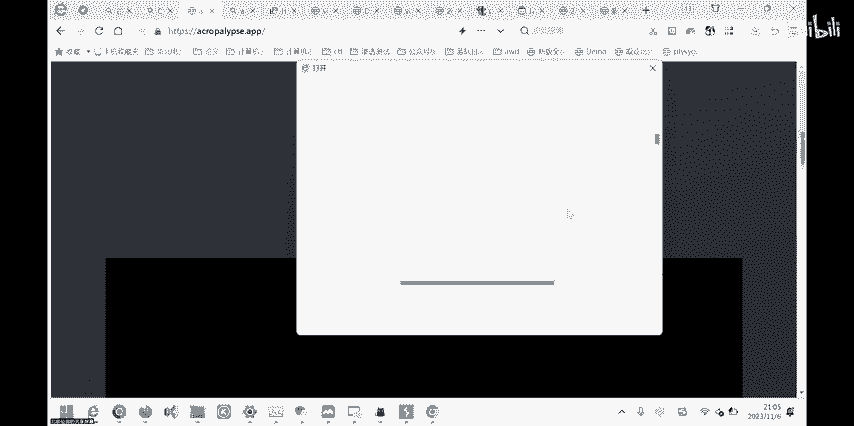

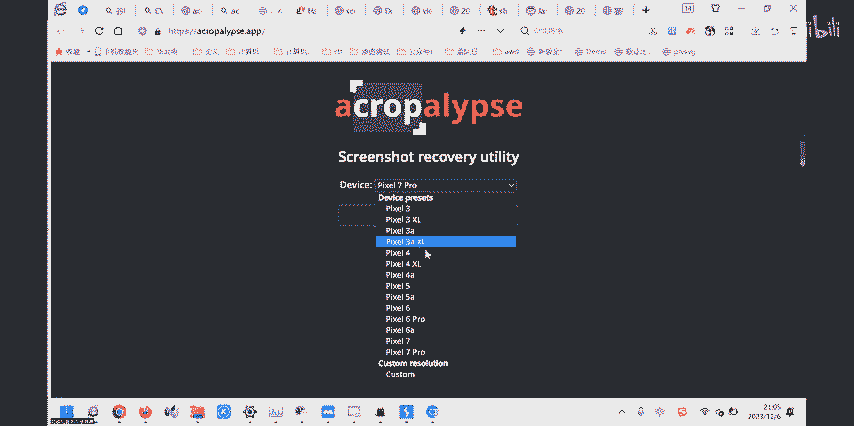

你看哈。这边你如果用老版本的话，就会发现呃他的答案已经出来了。大致这样。呃，就是说你遇到这种题的话，如果说它提示比较明显，或者说。嗯。😊，说明确指下哪哪个录洞话，你可以去搜相关漏洞呀，相关路洞编号特征。

然后去。找到这个对应漏洞的名称，然后就去查他这个付现方式，利用的方式。我说可能存在的地方。然后就这样去查这样挨个去利用。然后最终可能像这种miss的题的话。

它会有一个在线工具去帮他把去帮证嗯得出一个答案。我像外部的话有会有一些代码呀，或者胖子，也有一些代码去查一查都可以。然后这个虫他刚把我。把我今天电脑都都搞崩了，你看我现在把声音都进用呃，这个重改一下。

就是说。通过无线信无线信号传入一个图片。然后他这个是。嗯，WAV是一一个音频，一段音频。音频我这边的话这个。你那接播放器续打开的话，你呃基本没有声音。然后主要是嗯一段像重霄的声音。给给硬件。

把我的养的信息关掉了，因为比较吵。

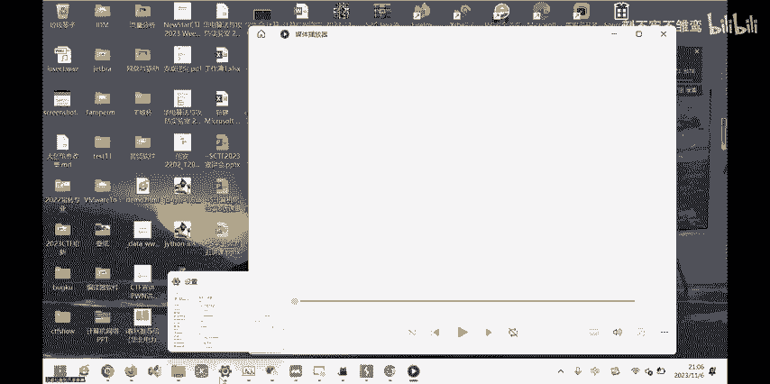

重开一下。呃，然后我们先先抛开这个东西，然后去看一看什么叫无线信号传输图片。然后这东西可能我们这这样去查，可能也不啊也看不到这些东西，但是。我们可以加一些关键词，比如说观网比赛。

然后我们可以看到关无线电的这些取证题目。啊，我们可能不不会原上，还有SSDN上都可有。

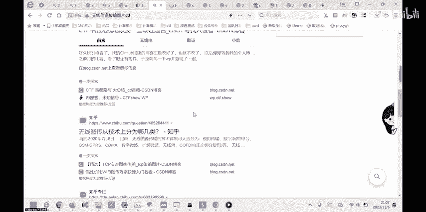

它是属于早上提提的一部分，然后主要就是通过呃已经类似于他这音音频音响，或者视频音响都可。

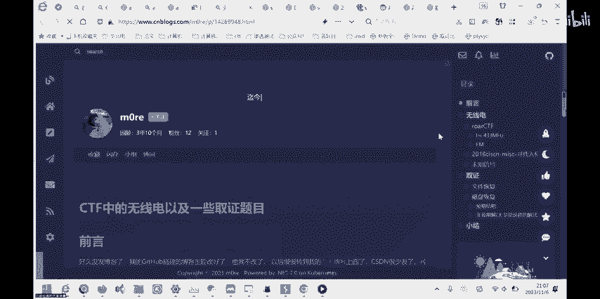

然后我们这边就去翻翻他一个呃写文章啊都可以。之后翻到有个未置信号，未置信号，它这边涉及到入一个软件叫SSTVSSTV就是去接收图片或者音频，然后再去对吧？再去给它显示。

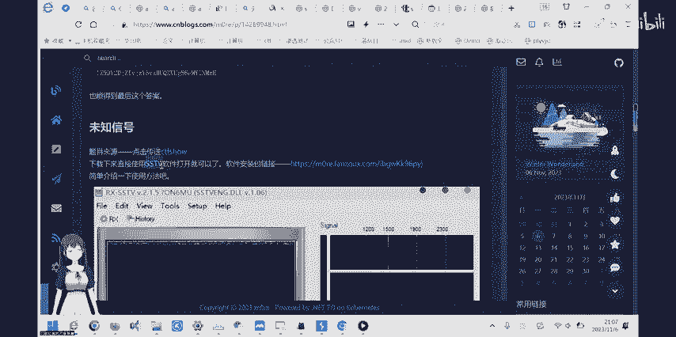

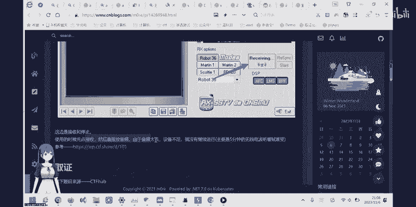

这个我去抄这这个工艺比较好用。嗯，但实际上就目前的话，相关于音频一写的工具并不是很多。你就是呃刚刚的的这个SSTV。

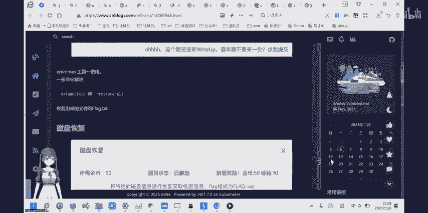

另外就是。嗯，不。呃，另外一个在哪呢？啊，另外也是那个呃A开到一个一个单词，然后他这个软件也是常用了一个音频引写的工具。嗯，应聘一些工具不多的话，咱们可以现拿现有的去试一下。我这个已经添下载好了。

然后这边就不重新下载了。然后咱们打开这个咱览音频。嗯，我们切换一下可以。Otion打开这个。就打开刚我们我们那个的呃音那边那个音频。你在在什么地方？O。

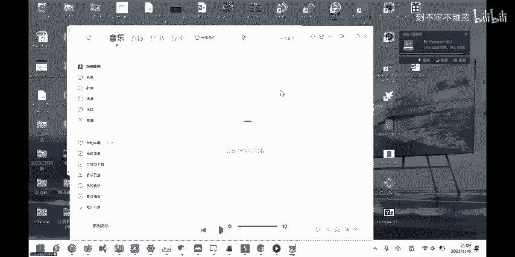

哦，他这边比较词好，声音比较啥。我慢呢在他在我们店的电脑上就会出现一这样一段呃数字。一段自自负。然后我们等它显示完毕，显示完毕就可以看到一一张图片。然图片里面就是我们想的答案呃大指这样。拿到这个答案。

然后咱们去挨个去敲这个敲这些字就可以。他这图片表做的比较精美。嗯，我声音比较音响，我这边就先不不放了，是吧？呃，然后除了这个的话，还有一道题，就是HTPHTPP的一道题。呃，我觉得搜集了几个比较常见的。

要常期ATTPTP的一个中态码。首先是200。嗯，就是。就是他就是让我们去传1个STPTPP的一个请求头，然后去请求头里面再反回我们想要的这个状态码。然后让你去搜集5个状态码是给你flag。

然后访5个状态码给你flag。然后并且我们可以看到。我必须去去发送你这样的转移字符，就是杠昂杠昂就是去画画好，或者说结束。然后两个杠啊就是有两个人联系的话就结束了。如果是一个的话，就是换换一行。

然后这样的话，我们先发送正常的请息，然后是恢复200，就网上就能正常连通。我们可以看到。这边服务器版本中心性的版本是n的1。251。25经过网上一直，他表新，就是它漏洞也不是很多。

我说甚至甚在都没有什么啊，没有什么。最新漏洞那所以说咱们。通过漏洞去查啊呢，并没有什么结果。所以只能去通过一些服务器啊，或者说它HPTB的HTPP的一个呃特特性去搜据这些装态码。然后包括4呃。

如果是404的话，就是去盖t了一个不存存在的目录。比如。盖了一个啊啊，这个这个地方肯定是没有的对吧？一般不会有这样的文件，或者或者对吧。一般是有一个文件，它会有一个。嗯。

什么对吧PNG结尾如果是目录的话，他也不会这么虚结。刘先长。它会显示一呃呃呃4040。如果说他有这个目录，但你没有这权限去访问，他会返访问你4403。比如有这个什么 flag点。XD就如果他有的话。

他说加403，然后。呃，显示你没有权限。然后其他的怎么怎么去获得？首先1个400的话，00就你把这个HTP给它改一改。如果说给他改了的话，比较改的格式比较错误了。就给你返回1个400。如如说。

或者说你现在都没有这东西。然后如果是嗯你把它把它版本号给他改到一个比较大的bu，就是说现在不存在这TP的版本号。Don't be with somebody。啊吧。他会访问你VCP的版本不支持。505。

然后304的话就是它服务器，你正常访问的话，它会有个请求。啊，他会连这样的东西。他会会给你一tag的字段，然后我们去他一t的字段，就是说。不开康。たか。现在找一下那个人。呃。

现在讲还是无无无双代码无装态码，就是说你这样嗯杠杠N杠N，然后这边就可以显示一个无无双态码。Ohello。他就会把会把这中了板给他。隐藏掉，然后这个缓存机制的话，就是呃大致意思就是说你你用一个。

You modify fan scenes。这样个字段。然后去去看他对吧，有没有嗯化成。好像有没没被修改之类的。然后这样去呃判断他一个字段。然后他这个嗯是需要。就说对他。他响应结构的一个呃时间。

所以做一一个判断。你把它改一下。我们可以看到这个时间。嗯，然后他这呃是两个刚好刚刚是结尾，然后这边把都是结尾。好，我们看到把304 not modify。我大致讲就是大致我讲的这这些块题，就是这样。嗯。

别的题我没有做太多。然后。嗯，大家都西可以慢慢去再去试一试这题。我可天总是。

