# 2023-CTF-n00bz-Forensics-John破解zip及pdf密碼(zip密碼破解，pdf密碼破解，zip file crack ,pdf fil - P1 - 都可参与吧 - BV1tm4y1e7uK

呃，hello大家好，我是提mi。今天要跟大家介绍的是呃nube这个CTF，然后里面的fs的那个quick跟quick，这个是呃22023年这个no的CTF。那呃刚好这这次有做到这个题目。

然后主要是用jo，那就顺便呃呃记录一下 journal是怎么用的。那这个是jo的呃官方网站。那这个jo呢主要就是做那个呃密码破解的一个工具。那跟HK相比，目前我感觉呃jo是呃比较好用，然后也比较方便。

然后能做的方式呃比较多。所以呃今天大概做一个简单的介绍。那首先呃这次CTF的这个呃s的这个。

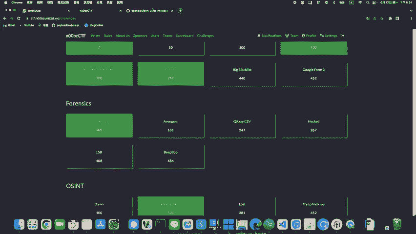

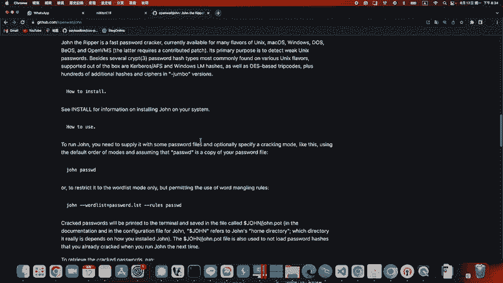

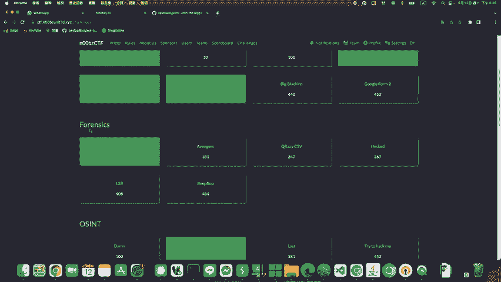

这个叫治安建设的题目吧，这个点了，然后这边可以下载1个ZIP。好，ZIP呃下载到本地之后呢，呃我这边已经下载过是ZIPone这个好，这边点两下呢，它会要求输入密码。好。

这时候我们要破解这个ZIP的密码的话呢，呃首先我这边先把呃这个ZIP呃放到。

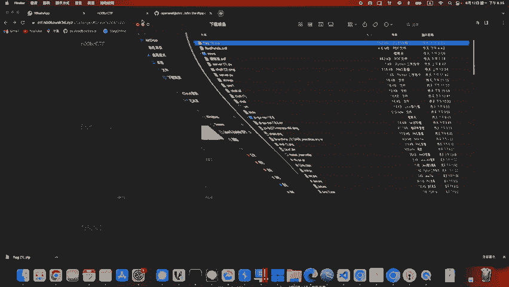

我先把它放到我的呃dus机器上面，因为我本机是make，那make在用jo re的时候有些呃问题，所以我把它放到我的GCP上面的5帮透机器。好，首先我先把把我这个。呃，那个。打ZIP呃。

我这边应该是这个flake打ZIP，然后呢把它SCP到我的。GCP场面。这台是我的GCP，然后到呃到tamp下面哈，我先放到tamp下面的CTF。那这个路径是我之前就见过的，所以我可以直接呃复制过去。

好，他现在已经复制过去了。好，我是说SS取到我的机器里面。好，okK进来了，先到我的tempamp下的CTF。好，我te不下CTF就这个那个的这个档案。那我这边它是VIP嘛。

我这边 zipip它他样会要求我输入密码。那这时候我们要怎么qui密码呢？呃，首先呢我们先到这个jo的官方呃，github上面，然后把它github click下来。

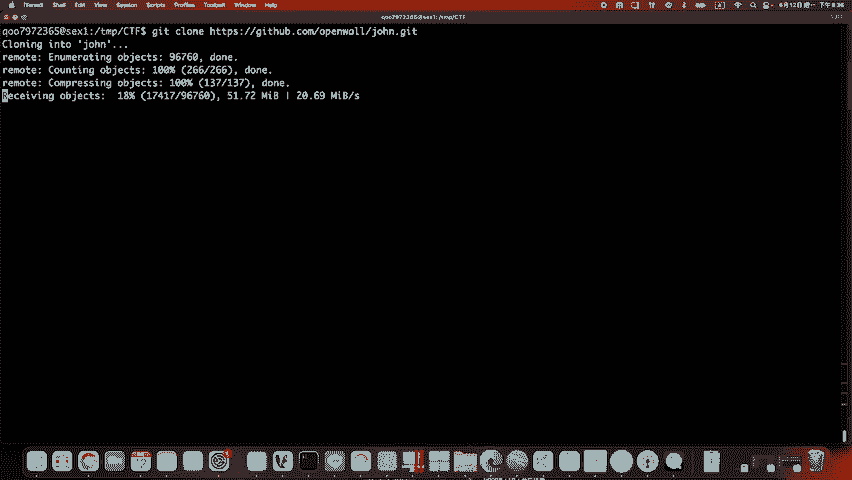

好，keyick的过程中，它这边下面keyhub下面有说呃怎么使用。那它这边有些how to installhow to use呃，我找一下唉。应该有一个how to install的地方。哎呀。

Jre reapper， journal re homeage。哦。how to installt see哦这一些怎么安装C install for information onint generate consistent。

呃，我们找一下他的。呃，安装方法在哪里？哎，我记得不用到这里，我找一下。他这个。哎呀，还没找到安装的方法在哪里。How to install C， install。好呃，先不啊。

我按照这来做的就是啊首先我们。

一克通下来之后呢，我们会有一个ju这里好ju这边之后呢，它会有一个呃最后一个run，它跟一个s这样ok那会有这两个东西。呃，首先呢我们先吸地到呃s里面。那因为我们这边要做的是呃quick zIP。

所以呃ju的quick方式就是说我们要把所有的档案都把它转成ju这个呃工具能能做破解的格式。那呃基本上我们要做ZIP的话，我们就要先用一个叫zip to jump的工具。

这样那zip to jump的工具呢，我们要先在本机这边编译一下。那编译的命令呢。第一个就是呃confi。GURE。comGURE这样在呃首先我们要在s。下面做一个呃点斜线config。

这个是编译的第一个指令。

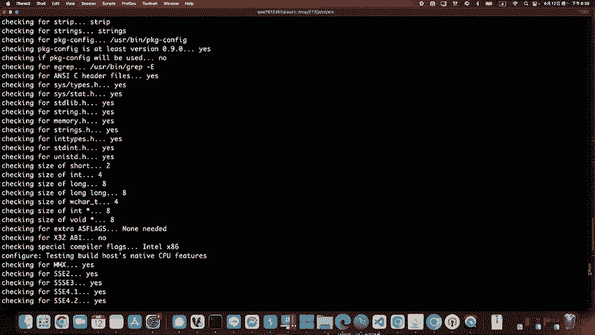

我找一下。呃，他这里进然没写，应该会是confi，这是make install。

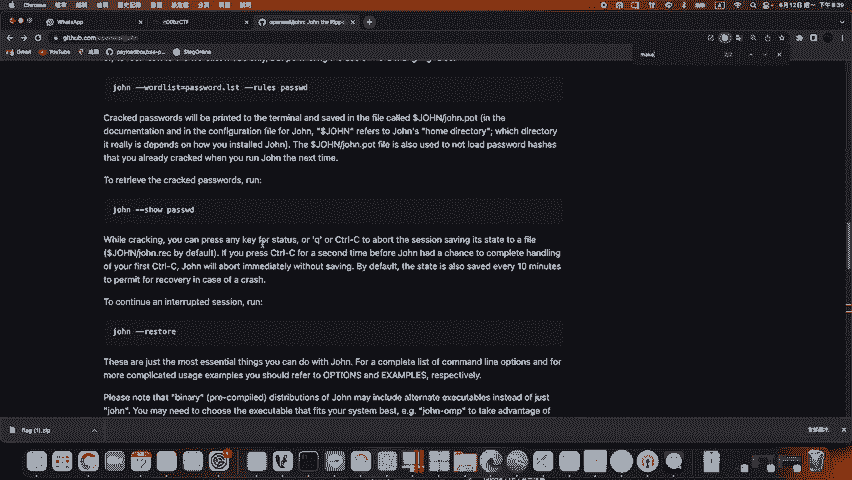

呃，或者是我们可以上网搜，然后tointall。They are down the river。啊，这个可能不好。呃，之前有试过这种，但是呃直接安装的有一些问题，所以呃还是直接从。

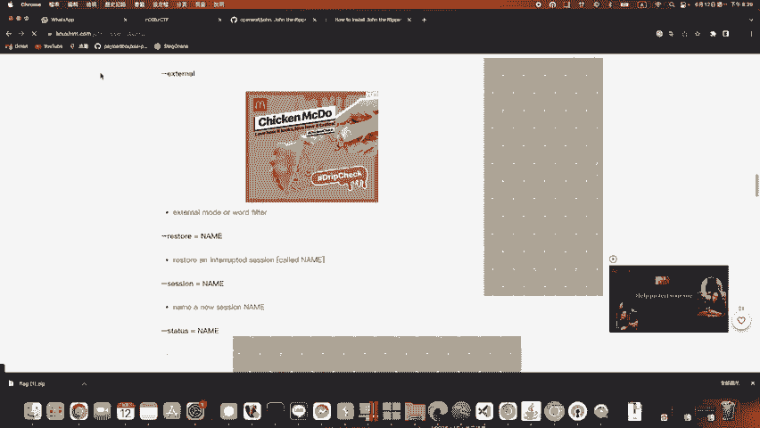

github上面载下来会简单一点。

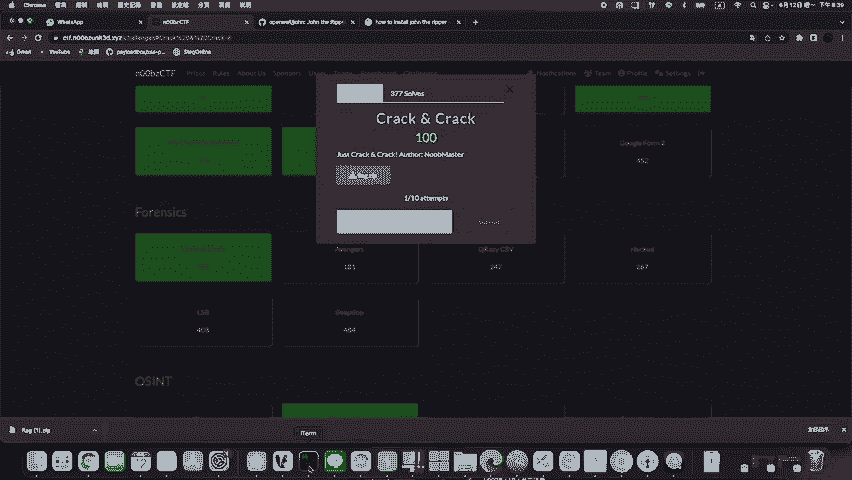

ok好，这边我已经啊这边已经confit完了，confit完。之后呢，他这边已经写说confi finish nowm减 x clean and make减这个做comppi。那我们试一下。呃。

但是这边有一个要注意的就是呃，我们应该只需要执行这个make。然后因为我说需要的是zip嘛，所以我要执行zip to join。呃，我这个只是说编译这个方法，就是说你要用什么，你就要编译方这个方法。

O好，那我这边编译完了之后呢。我CD点点回到run里面，它主要的就是这里两个东西。主要的就是一个source跟run。那我在s编译完zip to jump之后呢，我到run里面这边就会有一个zip。

2 jump。哎，啊，没有，应该是我刚刚s拾的地方啊。To be a make install store。啊唔知。To join。呃，有点忘记指令了，到时候我会把指令写在呃写在那个youtube下面。

好，待会也可以看一下历史命令。其实主要执行的命令就。呃，应该就只有三段conb，然后。呃，应该就confi，然后make installt zip to drunk就这样。那之后要做什么工具都是一样。

就make呃install要的工具，什么zip to drunk啊，PDF to join这样，那这边等它编译一下。好。

中间的过程有看到这几行呃呃 warningning他这边只是说呃警告的等级并不是报错。那他这个编译有一些。有一些时间。耗费一些时间。好，这边编译完了，然后他这边已经。只不过看起来这次应该是编译成功。好。

我们让CD回到run这边点zip to join。哎，这时候我们就可以用它zip to join。好，这时候zip to join之后呢，呃我们要指定我们的那个答案，所以那个答案在tamp下面的。呃。

我看下tamp下面的呃CTF下面的flag打VIP直接就这样执行。ok执行之后呢，它会显示一大串的这些h。这些h呢就是说呃我用zip two join把这个ZIP作为一个呃h的转换。

转换成呃转换成jo可以破解的格式。那我这边一样把它这就是我上面这串h了，把它放到呃t下面CTF下面的呃这个。打ZIPh这样。okK那在我们查看一下呃CTF下是不是多了这个好。

flake打ZIP打ha这是呃这个格h。好，然后这时候呢我们再做一次呃我们再run一次破解。那破解的指令的话，就直接做juokju它这里就是能哎这里写jucom找不到。因为我刚没打。

当前路径这边写juOK这时候jo可以直接ju的还有一个好处就是可以直接执行，然后我就直接ju，然后tempamp下CDF下的。是这个打字也打h，我这边直接执行，哎，它速度很快，马上就破解出来了。

这个密码是它ok我这边也没有指定我的质典档是raview啊什么的，但是它直接破解完了。ok好，所以就是这个就是密码。好，复制这个密码之后呢。

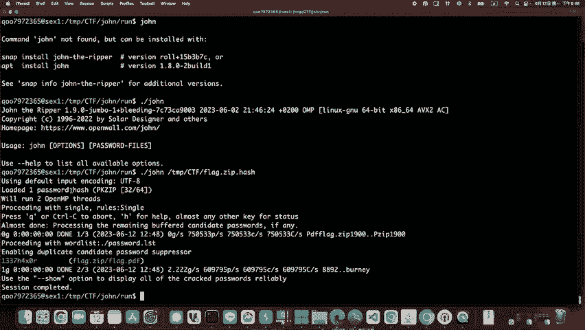

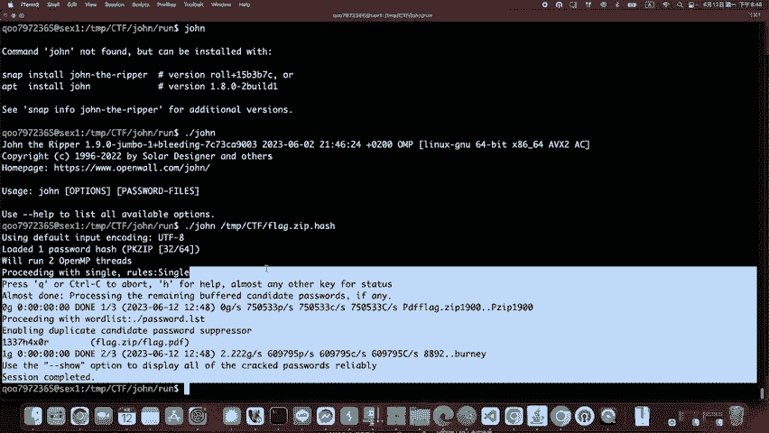

呃，我可以。到我本机，因为我本机还有这个档案嘛，刚刚下载flake点一的这个okK我刚刚我有一个原档了fake，但是我在这flag这里好，我让它贴上密码。ok这时候就解密出来，解密出来之后呢。

有一个flake2点PDF呃，它应该只会应该是正常会有个flake点PDF吧。那这边。打开的时候，它这边显示要我输入密码，那这又是1个PDF要quick破解密码的地方。好，那我一样回到我这这台机器里面。

呃，这边on zip，然后flake。按z，然后flake打ZIP然后要输密码，我就输刚刚破解出来那一串okK这边就解出来了。解出来之后呢，现在是多了一个。呃，PDF嘛是吧，那PDF跟我一样。

我本机有1个这个PDF。那这个BD的部分我们也是要做一个密码的破解。那一样回到刚刚的。呃，我们这里面那我们要现在就是PDF破解嘛，所以我们CD到ss里面会有1个PDF。

two这的这个ok那我们这边要makeint。呢度啊P d f to jump。好，这时候他要编译的这个好，那。诶。我看一下PDF主卷应该没错。O。好，那我这边照理来说，它编译完之后呢。

我们到ron这里看有没有PDF。2。

jo。哎，这里没有，那我们再回到我们的ss，看一下，应该是刚刚这里没有编译成功。Make install P， D F to J， O， H， N。看起来没错。PDF。Make install。

Makeake in store。PDF to join这里有一些报错。呃，不确定是啊，这边看到了一个permission decline，这边有一个permission denied的报酬。

不知道为什么。那我这边熟度一下。嗯。好，那个报错没有了。那我们再回到哦我们再回到run里面PDF。2。Joump a， say jump。カメラか。诶，还是没有。PDF to卷A，我们再试一次。啊。

这样。P，D， F 2。这样。便秘。

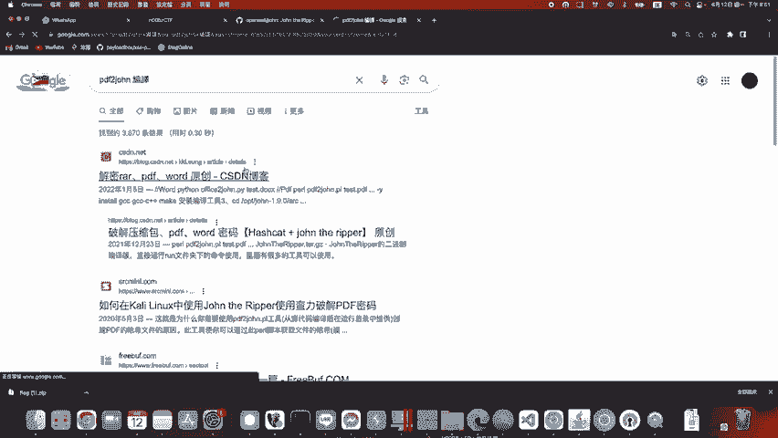

不对，我这边应该有历史命令你看一下。Hissterory。滚PDI。哦，看一下之前是怎么做的。makePDF two啊，这应该是打错啊，这那个字是这样的ZOINPDF to join它这里就不是jo了。

是join这样O呃，可以再检查一下，我一开始的是呃zip to join。哦，这里也错了哎。靠这个make。ake唉，这里应该是JOIN不是卷过再确定一下，我们再试一下呃，CD到source。然后。

Make。呃，PDF two。j哦 i嗯。No rule。 make， make。インスト。这permission一样是permission抵赖。哎，再回到run里面呃，PDF。To strong。啊。

它这个PDF two卷的指定是呃宾异环会是这个。PDF 2。Johnong。这个ok那这边的话呢，我们一样需要做的方法就是。呃，到tempamp下的CTF。然后呢，刚刚我们的那个PDF。那个点PDF。

OK执行完之后呢，它一样会多的给我们一串呃，转把这个PDF转成jo的这个。呃，转成这的这个格式O好，那这个格式就在这边，那我这边一样把它放到我tempamp下的CTF下的啊temp下的CTF下的呃。

这叫什么PDF。hash这个。ok那这时候呢我要quick这要破解这个时候再用。直接用ju点斜线撞，然后tamp下CTF的PDF hatch。

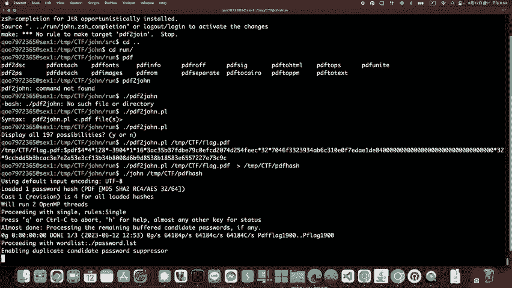

好，这时候密码也破解出来叫noob must。那我们这时候把密码复制起来，呃，再到PDF这边PDF我这边输入这个密码。O这时候呃这个noob的呃CDF答案就出来。好。

这就是今天呃jo the的呃大致上用法。那它实际上呃编译的指令我会呃确认，然后放在那个连接O这样谢谢。

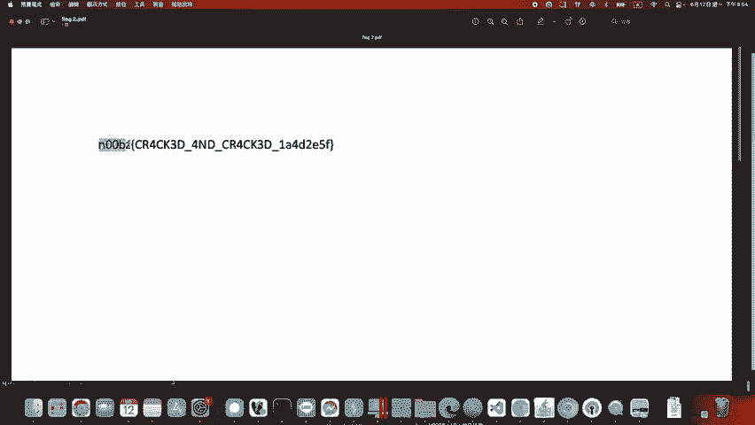