# 20230826-csrf漏洞讲解与实战 - P1 - SecureNexusLab - BV11N411i7NK

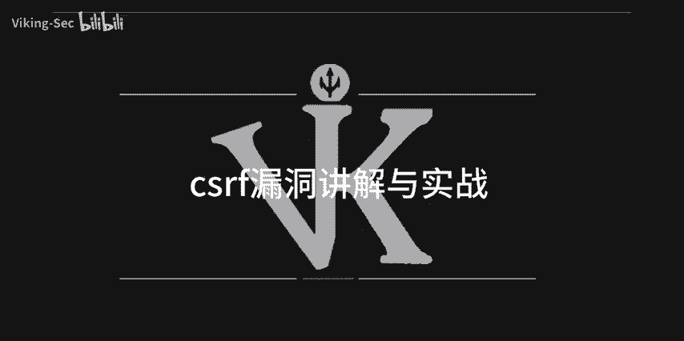

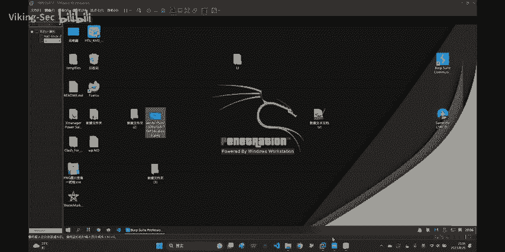

哦。好，大家好。然后今天讲的是CSRF，然后。嗯，其实我一开始是想讲叉SS的，然后我东时都做好了，然后结果有一个同学先讲，然后我就想讲什么呃，这个CSF漏洞呢，他跟叉SS有点像。

然后在一些比较复杂的题目和环境里面的。然后他们也经常在一起用，所以就今前就讲一下这个相当于也是承接一下，上周讲那个叉SS漏洞，然后先简单介绍一下这个就CSRF他相当于是攻击者通过伪造用户浏览器请求，呃。

像一个用户之前访问的网站，然后发送一个请求，然后让网站误认为是就是刚才那个用户发送的请求，然后他响应了之后就有可能会呃回显一些敏感信息啊，然后甚至是就是转账交易这些敏感行为，就达到了攻击的效果。然后。

呃，他之所以能达成这种攻击原理，就是很多时候攻击者利用网站的这种漏洞来实施攻击的时候，网站只能够确认请求是来源于用户浏览器。

但不能去确定他这个到底是不是用户本人或者说是那个呃就用户的那个客户端的真实意愿下的操作行为。然后这是一张图，就大概讲了一下CSF的这个攻击流程。然后比如说这个呃右边这个就是左边这个就是客户端。

然后他先跟这个正常的网站A进行一些交互。然后呃我们都知道，如果你产生交互一般会有 cookie啊，然后什么ces token这些东西，然后他会有一部分是存在你本地，然后用用来验证像网站验证。

你是就是你是这个人，然后网站下一次可能就不需要你登录，不需要你输密码上登录这样子。然后。CSRF就是说呃这有个前提啊，就是用户不能登出A网站，或者说是A网站保存了用户在这个网站上的登录状态。

这可能是通过session cookieook或者。呃，Xces token实现了。然后在这种情况下呢，如果用户访问了另外一个钓鱼网站，就是实施CSF攻击的网站。然后B这个危险站也就会向A发出一个请求。

然后用户可能觉得用户会以为这个B就是A，就是这是达到一个混淆效果。然后他在这个B网站上上做出了一些敏感的行为。比如说一些隐私信息什么的。然后用户以为他发到了A，其实是发到了B。

然后这样就相当于是就可以盗取一些信息，然后呃这就大概就是一个原理啊，然后CSF跟叉SS区别呢，呃这段有点复杂，其实简单来说就是呃叉SS它是相当于是在前端通过你在前端执行一些代码，然后获取权限嘛，就是。

呃，叉CS是。执行了恶意脚本，就是它是一个双向的模式，就是你攻击者在用户机上面执行了恶意脚本，然后用户机再给你回显。但是CSF是单向的，就是CSF它其实不能有的时候它是不能获取到你的。

就比如说你的账号和账号和密码，它是获取不到的。但是它只需要你的这个有的账号和密码之后，在某个晚上登录状态，它可以发起攻击。但叉SS它是可以直接盗取你的用户的敏感信息，就是账号密码。然后它就可以。😊。

他盗取的叉CS攻击成功之后就可以不管你这个客户端，然后就直接开始攻击了。然后CSF还是需要这个它主要核心还是在蒙蔽或者说欺骗用户，然后拿来拿到一个获取获取一个登录状态，然后后面才能执行对应的攻击。嗯。

然后这就是这两个攻击方式一个区别。然后呃下面就是分类，这个分类就简单看一下就行了。嗯，盖子型和pos型，一般来说在做题里面是比较多的。它就是前端的相当于两种不同的请求头嘛。然后。😊，嗯。

get形式提交某些事件，然后让用户执行相关的操作。然后pos形式它构造一个pos型表单。然后比如说subit request，它可能。你看着是提交一个什么问卷啊，或者是评论什么的。

但是他那个网站是伪造的。然后你点了那个post之后，你发送post请求，其实是把你一些敏感信息就给了教育网站了。然后这就是两个比较常见的。然后这个也是很常见的。呃。

token leak相当于说利用CSF和叉S叉SS这两个攻击方式结合。然后可以做到从呃你的客户端去。盗取你的token，然后到只要成功盗取了一次token时候，就会有一些插件和其他的办法。

就相当于是不停的跟踪你这个token的变化的值。然后相当于是在第三方就保存了你这个呃被攻击的这个客户端长久的登录状态。然后。这样也是一种很呃相于很常见的CSF攻击方式。然后后面两个就是比较少了。

这个flashCSRF是。呃，利用了前端flash组件的一些漏洞。但其实flash这个东西现在已经基本上没没人用了，这个已经是淘汰的东西，就这个就了解一下就行了。

然后jason hijack的话就是有一些前端。他传递到后端的这个请求里面，没有对这个呃就后端的这个jason这个文件啊，就后端的这些代码做一个过滤。然后你可以就对于这种情况来说。

就可以通过劫持后端的这些代码，让他重定向或者是修改它的这个它传递的参数这些方式，然后把敏感的数据返回给你的攻击端。然后呃这就是一个简介。嗯，然后现在就来看点题吧。

然后嗯第一个题还是这个DVWA就是上次也是说了有的。

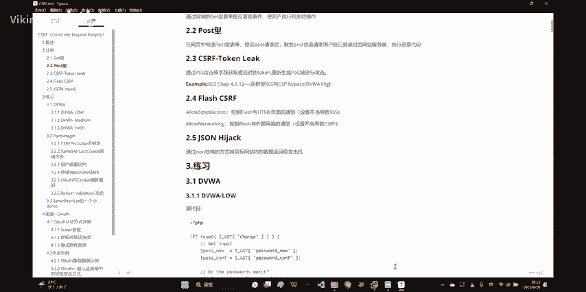

啊，叉SS。他那个里面也是有。嗯。哎，放哪儿生。嗯，对，就是。

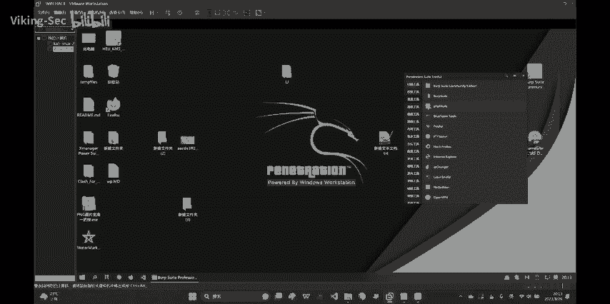

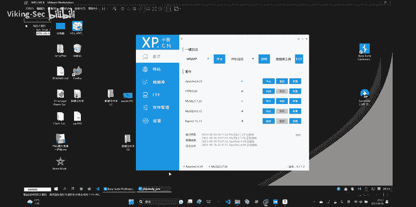

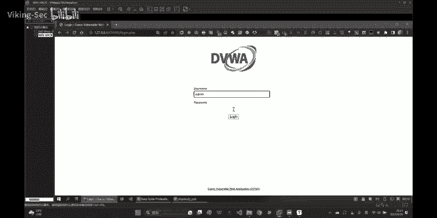

啊，然后。

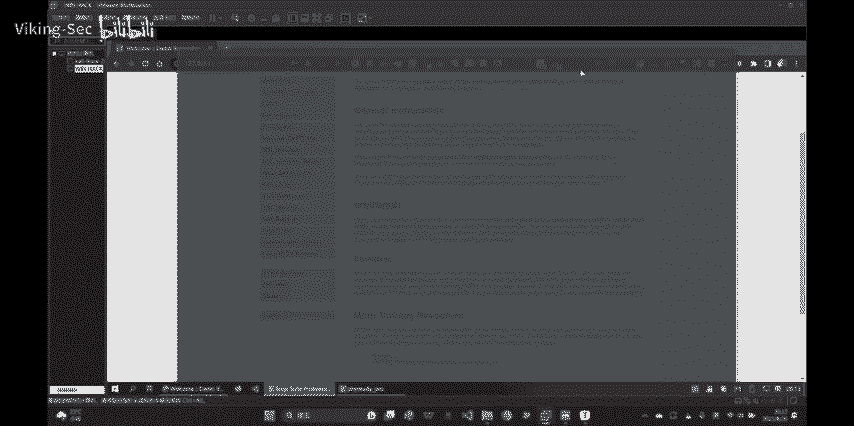

这边人可以先把他的。先把它代理打开啊，然后就可以正常的去看他的包，然后先调一下，就从漏开始吧。哦。然后。这边是SF。啊，然后这个漏就很简单，呃，先看一下它的源码吧。这个就是。先是判断一下他有没有改。

就是你有没有更改密码这类的行为。然后这边是。嗯，这个相当于是验证一下你在这两框就是确认密码和你的新密码输入是否一致。然后如果一致的话，它相当于是。把你输入了这个密码，把这两个合成一个变量。

然后用这个MD5函数给它处理一下，生成1个MD5的字符串，然后就返回到后端。然后后面你的密码就改掉了。呃，他这个漏这个难度呢，他没有对。

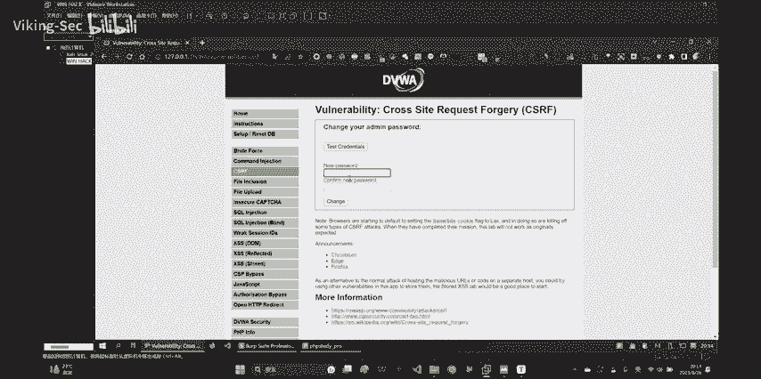

没有对，就是你输入的东西做任何的限制啊，就是他没有基于就是对CSR攻击的防护措施。

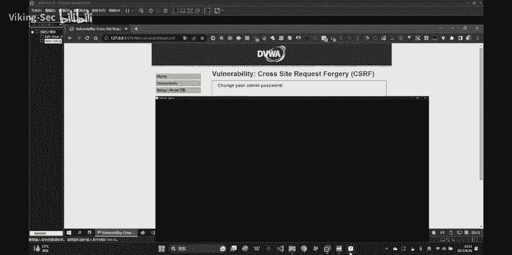

啊，然后他这个后端的这个代码，它是全部都是通过get形式。去拿到你这个前端输入参数了。所以说这个就是之前说的get性CSRS。然后这个其实很简单，你直接构造网网址就可以了。比如说我们可以先录一个。

比如说123。123456。然后你会发现他又改了，然后你可以看一下他。你看。这就是。它相当于是就是你这个更改密码的行为啊，它是直接显示在前端上了。然后你作为CSRF攻击者。

你相当于是就是诱骗用户去点击这么一个链接好，然后你get型表现提交了，你的密码就被改掉了那。事实上比如如果你把这个页面关掉。就很简单，你把这个页面关掉，然后。比如说你想改成什么其他的密码。对。嗯。

你想改成一个什么其他密码，然后你就把这个去掉。比如说你要改成123。然后你直接执行，他密码就改掉了。这个时候他密码就已经是123了。

啊。就差不多就是这么个情况。然后呃但事实上如果考虑更现实一点情况，那你公你想公资人肯定没有这么傻，对吧？你看到他又是change什么东西，他可能会比较警惕。然后这种时候你就可以通过短链接。

就把这个链接变成一个短链接，然后他短链接你就看不出来它这个里面具体是什么东西了。😊，然后就大概这么个情况，然后呃这边介绍b suite一个功能啊。呃，比如说这边扎包。

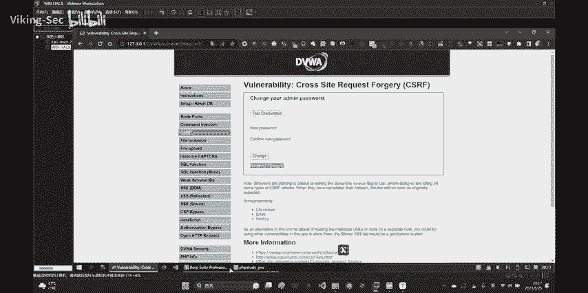

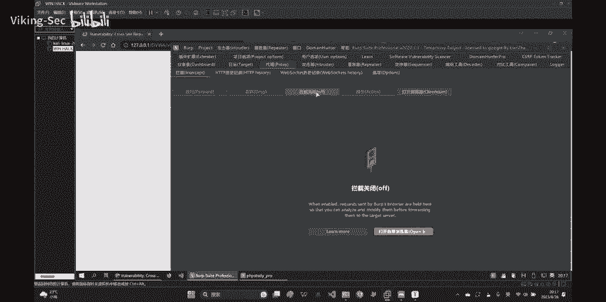

先把烧口打开，然后给它改成pass word。哦，然后你看这个包，然后他这边工具里面有一个生成CSFPOC嗯，它这个相当于就是说核心还是你比如说修改密码，盖不管盖型还pos型还是什么其他乱七八糟东西。

它就是核心还是你做这个行为，你没发现这个t。这些input里面其实改就是包含的就是你更改密码这个行为。然后它相当于是帮你包装了一下，包装成了这么一个前端的页面。然后比如说这边可以有一个包含自动提交脚本。

然后你再生成，它就有个document from submitit，然后你。啊，你复制HTML，然后看一下。啊，他要直接搜了，然后呃比如说可以新建一个文文文档。然后保存一下。

我们就可以看一下他这个工具生成出来是什么效果。哦，他就直接跳出来了，就是刚才他闪一下，不知道你没有看到他有个subit no。😡，在那个里面就刚才是闪闪了一下，因为它是自动提交嘛。

它检测到这个这个是这个函数，就是相当于是直接提交你这个请求了。嗯，然后这就是这个POC脚本一个作用。哦。然后啊稍微等一下。啊，然后下面这个漏就解决了，然后下面就是。medium帮我调一下难度。

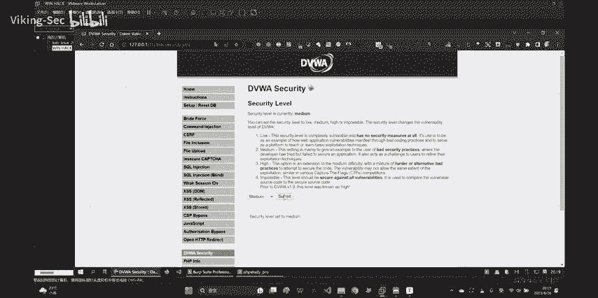

然后还是先来看一下meium的人吧。然后他相当于是。这有个sstrippo函数啊，就是这个这一段就是相对于low这一段加上去的东西。啊，这个还有就是leAB嘛，这个大家应该都学过。

就是返回前面这个字符串，在后面这个字符串中出现的位置。😮，然后它只有不等于foralse，就是说这个HTTPre字段必须要包含在serv name里面，它才会。就是相当于是接受你这个修改密码这个请求。

然后。这个怎么办呢？就是有一个办法，因为你HPre其实就是你的IP地址，然后呃servver name。😊，ser name是你的那个就是整整那个长的名字。然后在这种情况下，其实你就可以把。

比如刚才这个。就改成你的IP地址就行。你改成IP地址之后，你截断把这个后缀截断了时候，你127。0。0。1就会包包含在你这个传给后端那个链接里面。因为你那个链接里面也肯定是包含你的IP地址。啊。

所以说这个就是比如说如果你在真实法上面遇到这样类似的题目，你就只需要把你的这个恶意页面。重名成哪一批就可以了，然后就结束。然后下面是这个hi这个题。嗯。稍等一下，我找个老西。呃，害这个题就比较麻烦，呃。

还是先看一下原码吧。嗯，这个原嘛就是。他有一个函数，就是check token。嗯。他首先是一个pos的请求，然后。他会对你的你的这个输入的协议里面的这个伪协议嘛啊然后对你输入协。

就是你这个呃输入的URL后面的东西进行先进行一一次编码，然后把这些东西全部都分离出来，相当于从前端分离出来。然后分离出来之后。你会发现就只有他。呃。就是只有这样成功分离之后，然后他pass new啊。

然后呃token这些东西才会更新。然后你会发现他每周一次判断相当于是你每提交一次请求，他token就会变一次。呃，就相当于是我们打个比方。😊，如果你还是用刚才这个页面。啊，就还是。

生成1个POC你还是刚才这个页面化，你就可能需要一个什么。就是说。就是input type等于。token啊呃等于heden，然后。name等于token啊，然后这个token等于一个什么值。

这个值是后端随机生成的。然后你并不知道，但就很很显然的，如果你不知道这个token的值，那你显然没有办法把这个请求成功的提交，那你就没有办法攻击。😡，那你就相当于需要两个方呃。

需要一个方法去找到这个token。然后这个题其实是有很多种方法。呃，这边就讲两个吧，第一种是。比如说你可以构造一个脚本。这是一个示例脚本。这个document gets element by name。

然后user token呃，这一串。就这一行相当于就是说呃前端你前端注入一个get element by name这个函数，然后这个函数就可以。呃，相当于是获取到你这个user token。

然后你获取 userer token之后，然后再自动提交，然后剩下来的东西就跟前面的你这个攻击脚本是一样的。呃，但是事实上呃就是这个脚本你们回去可以试一下。就是你在本地搭的靶场上是可以改的。

但是呃如果你找一个服务器搭一下。就是它跟你不同意，那你会发现它攻击不了。因为。😊，这边就要涉及到一个同源策同源策略的问题啊，就是如果。你的后端呃，就是你要攻击的后端和你服务器所在IP是不同源的。

就是你IP地址不一样，不同不在同一个网站里面，然后它就会。不接收你有关token的这些修改的请求，然后你就没有办法攻击。所以说需要一些特殊的方法，让你的token在这边先回旋出来。

然后啊确实是有一些方法。

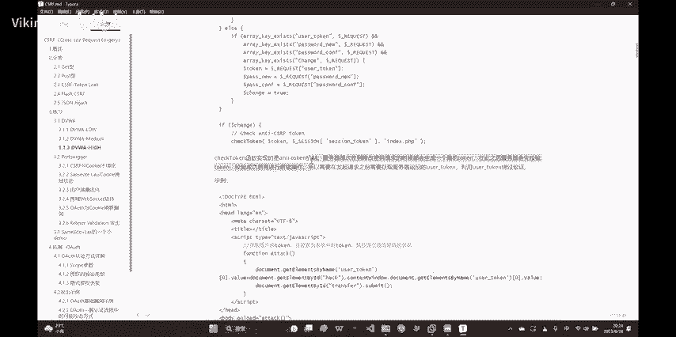

比如说。可以跟那个叉SS合在一起用。呃，就说这边。呃，这边嗯。我可以简单写的东西啊。如果你上次应该试到了，就是这个name里面它是有限制的，就有字助限制。所以说你没办法提交，然后就抓包。呃，转包之后。

然后再修改就没有限制。我是不是没有调难度？看一下。😔，哦，确实没有小男。哦，然后。我跟。就说随便输点什么东西，然后抓个包。把他抓出来。2。嗯。啊，是这个包。就是。😔，T T name。嗯。

我们可以构造一个配漏的。就是说。😔，嗯。这个就是一个目录嘛，目录目录截段之后，然后截断到这个点点高目录阶段，然后到你所在的服务器后端这个CSRF的那个。那些文件的位置，然后用onload。

做一个报报错出来。Con friendsri。这个应该很熟悉了，就是通过onload的这个。event然后去获取它优势token。我看一下应该是没有问题。😔，这个。😔，先互去一下，我再说问你。😔，然后。

放行。

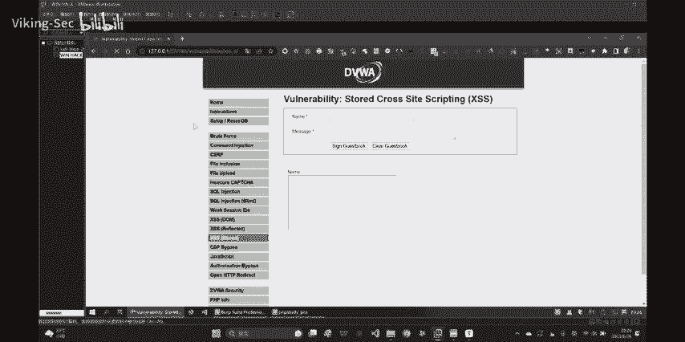

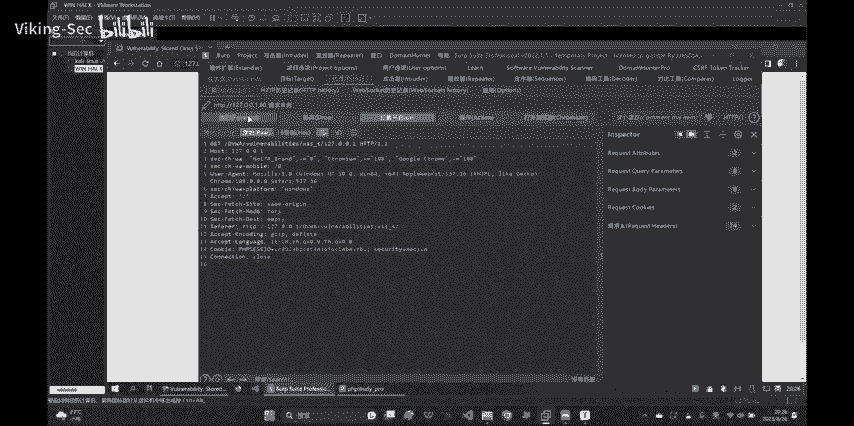

吧，好像不出意外的，出意外。😔，嗯。重新试一下。我你说不应该有问题。😔。

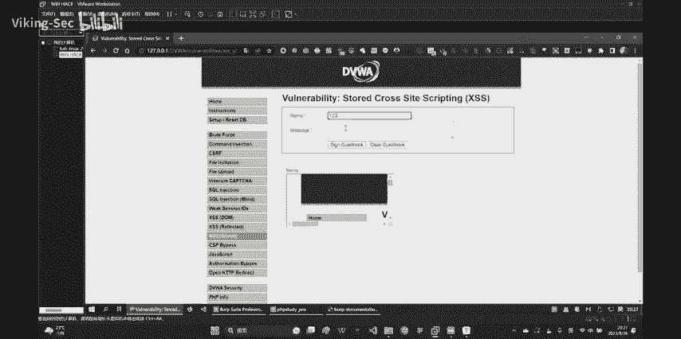

直接复制吧，我笔记里面是有。就是这个。

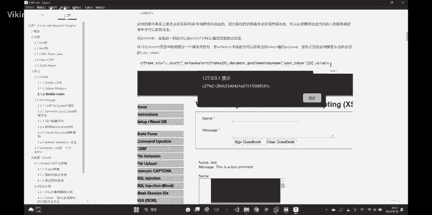

坏了，不知道为什为什么他这次显示不出来了。按道理是可以显示出来。

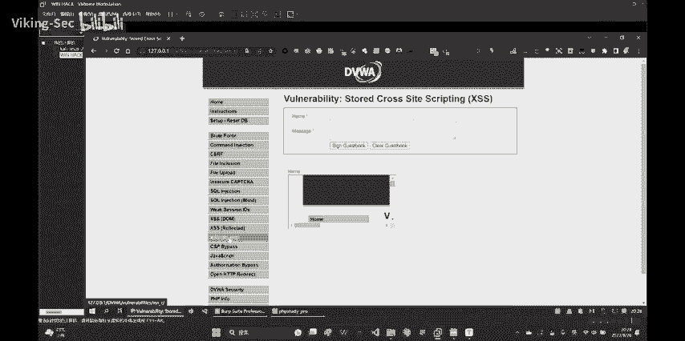

嗯。😊，嗯。不知道为什么可能出现些小问题，然后。呃，如果他成功的回显的话，那他就会有一个弹窗，就是frames嘛。然后它弹窗里面就是现在的token。嗯。😊，然后这是一种方法，你获取token之后。

然后再跟上面一样的方式用CSF去抓包。然后你添加一个隐藏的token字段，然后这个value里面填你获取到这个value就行。然后还有一种方法就是利用这个b的插件。

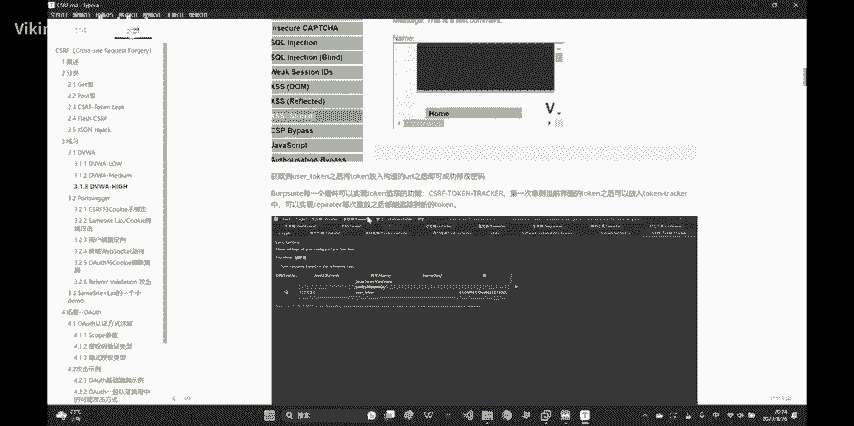

这个插件就是token tracker。啊，在这边你可以在那个商店里面自己下。

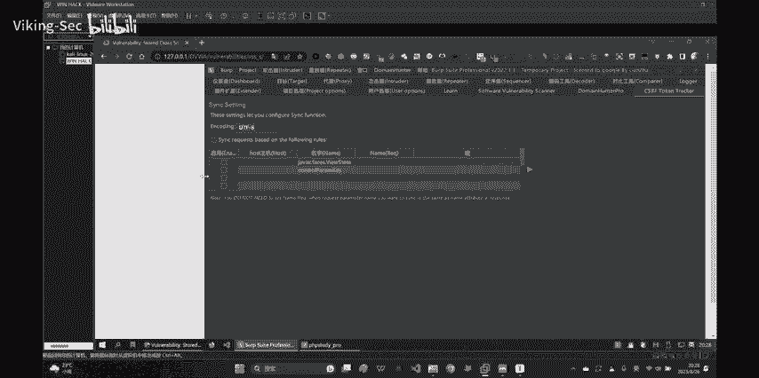

然后还是这个插件的条件呢，是你。先需要放一次包，就是先抓包之后放一次包，让这个brk three的成功的获取到一次token，后面他就可以实现一个追踪的效果。比如说还是。嗯。将关了。

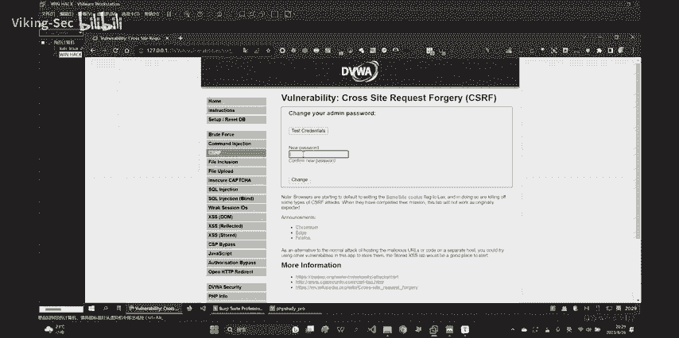

比如说123456。往后。拦截。然后这个时候已经揽到一个包，然后你在这边估一下。这个这个名字这边就是输的你需要追踪的这个字段，这个题里面就是user token。

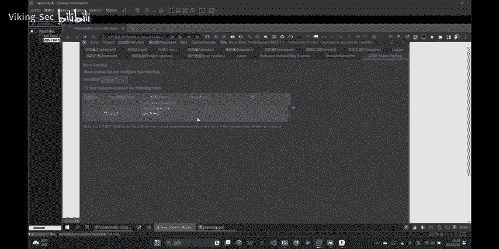

然后。How这边。嗯。看一下行不行。嗯。😔，哦，夫。稍等一下，我说他是个什么。怎么没有改过来啊哦。😔，Yeah。哦，这样就回显了，我说怎么不对呢？啊，因为刚才那个脚本已经被传到后端了。

然后陈云叉SS按道理来说传的时候，它就可以显示，就是刚才那个效果。然后呃还是来看这个。嗯，然后。打包。change置一下。他这边是有个。啊，对他这有个usertoken就是这个字段，然后你把它复制。

点击到这边。好，然后你把这个打上勾，然后think request based on the following rules就是它会每一次刷新的时候，页面它只要捡到有一次token。

然后就会更新这个后面的值。然后我们来试一下。放行。哦，然后密码已经改了，对吧？然后你如果再输一次呢，你现在看它应该已经变了。你发现已经变了这个值。就是下一次你申请的时候。

可能会就是即将回显的那个token值。比如说这个什么0A44什么东西。

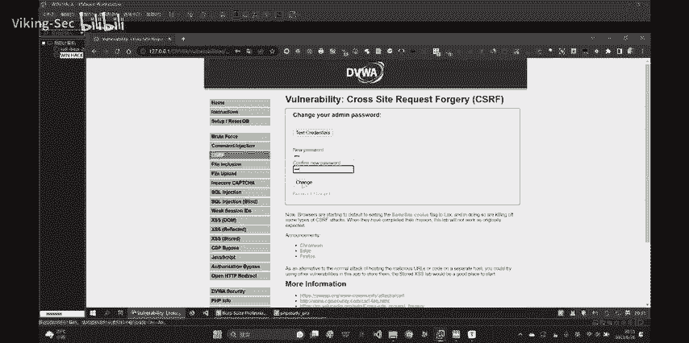

还是快。好。看到没？这个0A44，你会发现就是。跟这个是一样的，但是他只是是下一次抓包时候token。然后相当于是你就提前一次知道了下一次修改密码时候，token是多少。

那你就可以通过刚才那个POC工具把token放在里面，你就可以实现攻击了，差不多就是这么一个原理，就这个插件。然后这道题的话，其实还可以用呃文件上传命令注入的方式去解决。然后大家有兴趣的话。

可以下课之去看一下啊，这边就不演示了。然后。😊。

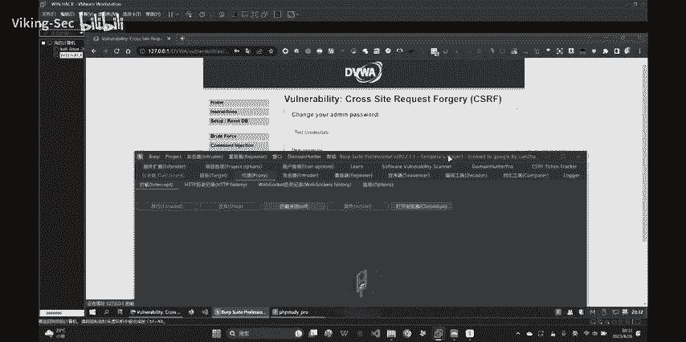

啊，这是DVWA的一部分题。然后下面是一些比较有意思的东西。就是这个靶场啊这个靶场我个人是非常推荐的，就是它上面CSF跟叉SS的题都非常好。

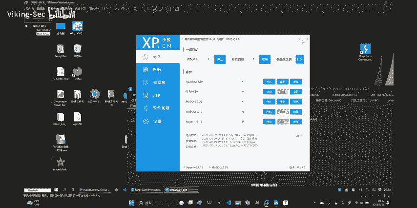

嗯，你就只需要注册一下，然后他需要呃外网的环境。他就可以用。嗯，要稍微等一下这个靶赏比较慢。把这管理好。等一下登录。嗯。嗯，然后时间时间的话，因为我后面可能还要再讲一些其他的东西。

就是说我就挑几道题来讲。这个alls，然后。他里面题还是挺多，就基本上耳熟能详的这个。漏洞都是有。就。呃，我就不每道题都讲，然后看一下这道题吧。

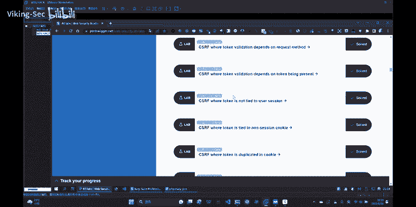

这道题是这个跨域攻击。嗯，我们可以先来了解一下这个，因为这个规则是在很多漏洞里面都要用到的，就是。cookie seems set这个只要是chroium内核，它都会有这么一个限制。呃。

它是对前端的一个属性的限制。就是说如果前端所在的网址与后端的API不同欲，则会限制前端返回cookie就这张图其实很明显。呃，你会发现。这边。这个上面这上面这一半。

它这个前端和后端都是在这个Adotcom上面。所以说后端生成的token会被返回到前端。呃，也就是说这个时候就像刚才那道题。你是可以通过这种方式去获取cookie。嗯，但是如果你的前端和后端不在同一个。

不在同学域里面，也不是一个B到com，那个A到com。那这样的话，它后端产生那个实际的token是不会回线到前端的。呃，大部分网页就是直接拒绝回线，你就看不到token这个字段。

然后小部分的网址它可能会。😡，对那个头肯进行一些。呃，转译或者是什么其他的处理之后，然后再返回。总之就是他会达成你前端拿到的token，没有办法对。呃，使用类似CSF或者叉SS这样的攻击方式。

直接对后端进行攻击。然后。cookie的 sme size属性有3种。第一种。就是没有啊，就是你不管是什么玩意儿，你只要申请了，他就给你发那个真的cookie，就是no，然后leex。

nex是仅在顶部窗口导航，比如说A标签或者window open函数里面的get请求中发送cookie。

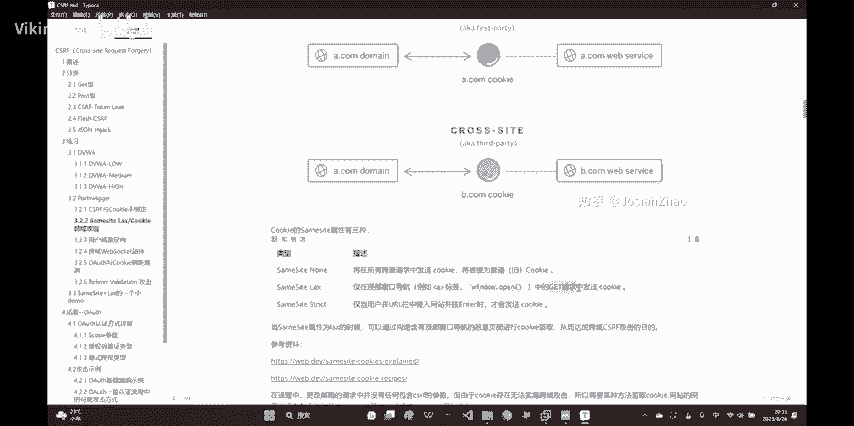

然后sim size strict呃是紧当用户在UIL栏中建入网站并案enter时才会发送cookie。这个就是怎么说严格到什么程度呢？就是你通过呃bb数直接抓包啊，然后你发送请求都没用。

它就没有都没有办法反回，就是这样子。然后呃bb数的靶场里面这道题呢，它是通过。这个simson relax。这个情况下的顶部窗口导航这个漏洞来实现CSF攻击的。我具体是什么情况呢？嗯，是这道题。

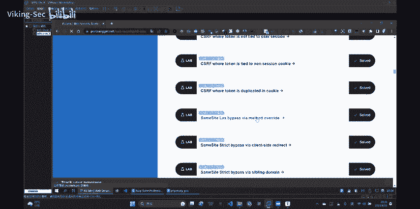

Over right。我们先启动麻烦看一眼。啊，他就真的很慢，就是。这个靶场不好就不好的是他有时候会非常非常慢，然后要等很久才能打开。

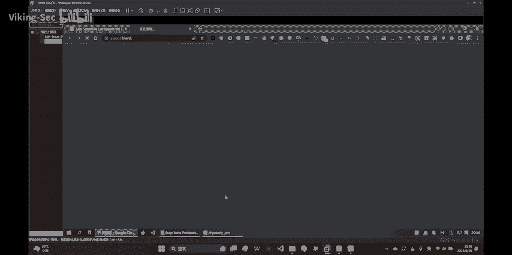

哦。嗯，然后我们可以嗯先看一下描述。先登这个账号。登这个账号。呃。前面的这些题啊，我说一下就是。就是前面这些题我不讲的这些题，然后基本上都是。嗯，因为他这个靶赏有个好处，就是他每道题下面都有文字解答。

就在这边，它其实是有solution的。然后他有一些还有youtube视频，你可以看嗯，那你如果不想看签自己做的话，像这种。他的目的就是通过CSF攻击在你在这边不署email。

你相于一个第三方公积机的身份改掉他的邮箱，这就是CSF的目的啊，就这道题CSF目的。然后我们可以先试一下。就是说。先试一下啊，加个包，看看他修改邮箱的时候，他请求图是长什么样。

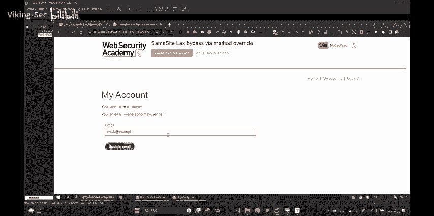

嗯，打开，然后。

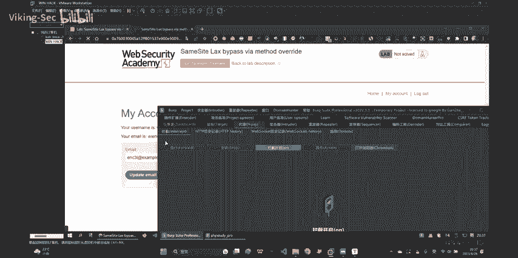

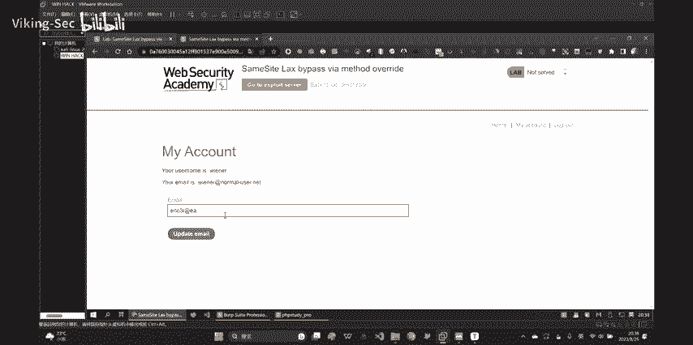

为啥，然后update。哦，他这样应该就会找包我的。好，我会发现。他没有任何CSF参数。呃，之前的那些题就是在这题上面那些题，它会在这边有一个，比如说and CSSRF等于叉叉叉什么东西的。

然后这个就是相当于是CSF参数。你可以把它理解为某种意义上的token。呃，但这道题它没有，它只有一个session。session是就是只是只是现在这个对话哈，然后。😊，但因为你有cookie嘛。

所以就跟刚才那个DVW的那个骇闹其实一样的。你因为有cookie，所以没有，所以说没有办法实施跨域攻击。😡，那就是跟刚才的思路又变成一样了，你需要通过某种方法去盗取cook。

然后我们把它发到repeer，看一下他的。响应是长什么样？哦。放了。然后发现就是302放的，然后没有任何东西，呃，没有任何关于cookie的限制。他这个只有same origin。呃。

这种情况就说明他的sme size是lax的。如果他sme size是是strict，他可能有什么。比如说这边会有个什么。比如说secure啊。然我开一下手。嗯。😊，比如说他会。

比是说就就有什么secure。或者是这个是其实根据他后端CSP那些规则去决定了，或者是什么same site等于strict，它会直接在这个。X frame options里面回显啊回显是这样。

它既然没有的话，那一般就是默认成leex。呃，因为。就是默认成呃n网站就基本上没有，因为它安全性太差，你没有办法抵御CSR的攻击啊。所以说教题们说是Lx。然后那既然是lex。

我们看一下笔记leex怎么攻击呢？就是在顶顶部窗口导航A标签或者win到op这种函数里面的get形中发生了固体。但你会发现这个是post呀。😊，那ps怎么办呢？那就要想个办法把它。改成。Get。

他这个里面有一个。修改请求方法哦，然后你会发现它变成get。行不行呢？

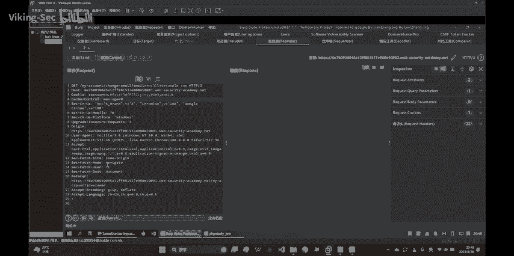

不行啊，记了，说明不可以这样搞。嗯，那怎么办？呃，我们先把这个放吧，放掉吧。好，然后然后怎么办呢？就可以换一些其他的方法。比如说。还是先抓个包。嗯。

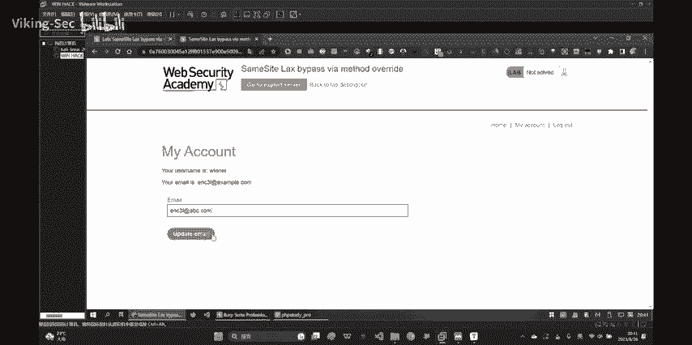

有什么方法呢？这其实是。就是相当于苹果浏览器的一个little trick吧。哎，我把它放掉。

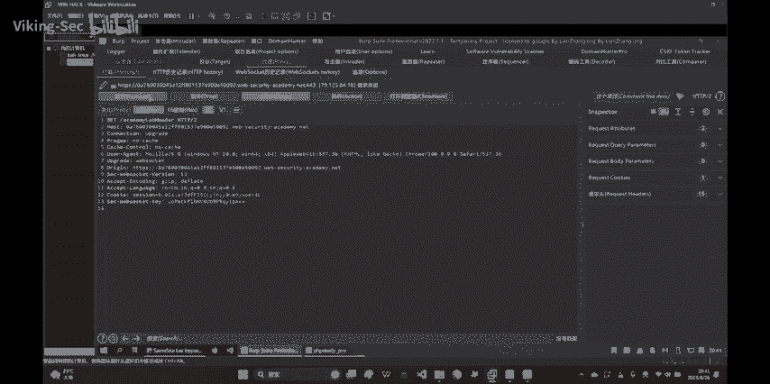

嗯。播放。😔，不。然好。你空出话去。

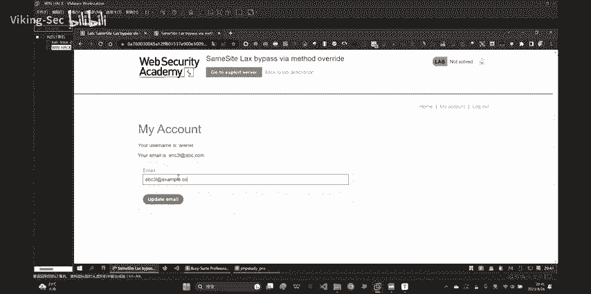

哦。比如说可以这样先把它。改掉。不get就去直接改get，不要用它那个change mass的方法。呃，但是在遇到类似的题或者做法场的时候，遇到类似的题的时候，可以先试一下他那个刚才那个修改请求方式。

很多时候是可以用。呃，比如change email，然后问号后面接。email等于什么东西？都说。😔，我好。At。啊，and。Go method。等于postt。这个是什么意思呢？就是说嗯。

因为请求头的最前面的这个是决定了后端识别你这个请求是什么请求。你前面写get，后边后端就觉得你是get，你写pose后端就觉得你是pos。但是你在写get的时候，你可以通过后面这个杠me的这个参数修改。

比如让它变成po，你把它复制成pos，那就相当于说这个实质上还是个pos的请求。但是后端会把它识别成。😡，呃，get。啊后是这么个情况。哦，然后你会发现回显了，跟刚才没有这些东西。

就是单任pos请求的时候是一样的。那就说明哦我们只需要这个东西就好了嘛。😊，那就可以通过这个来生成一下POC。就是长这样呃，包含自动调整的生成一下。哦。然后这样是要改一下。呃，当然也可以就是把这个链接。

直接复制到那个expo server里面，也是可以过的。这道题就这道题的后端也是可以通过这道题。然后但这边就实操一下吧。嗯，我们可以先看一下。

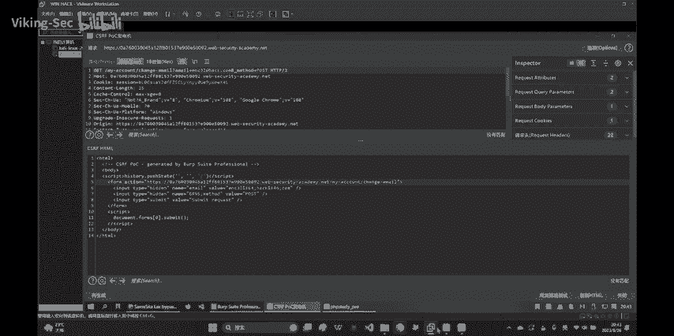

他的那个对他的这个ID。

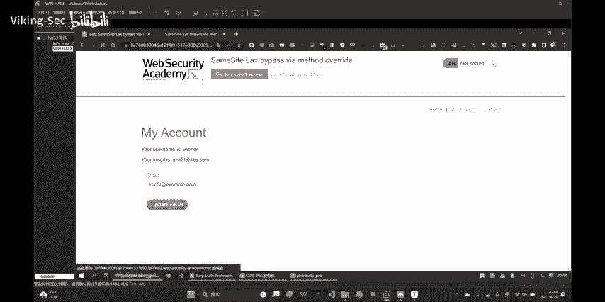

好。嗯，这是他的ID。我先复制一下。

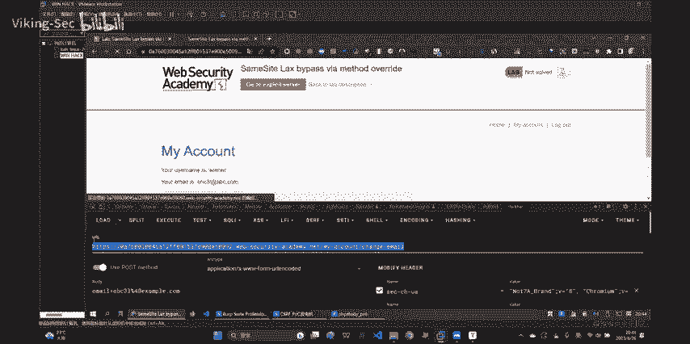

我好钟你。这边后面加一下med。等于。Post。好。然后。后面啊，因为他这个里面这个。

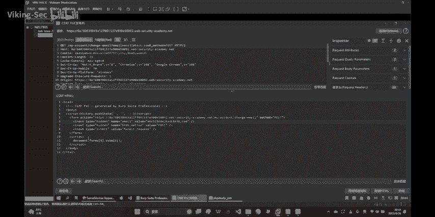

就是回车键不好用啊，然后就看一下。能写的这个。就是我说的第一种方法就是你直接document location。😊，嗯，相当于是这个页面里面，只要你加载了这个页面，然后这个里面的这个链接就会被执行。

就会被跳转到那个链接去。这样是可以的。然后或者是你会发现他相比于之前那些简单的POC，他加了一行type name高me，然后value等于post，让我们来试一下，这个肯定是可以的哈。啊。

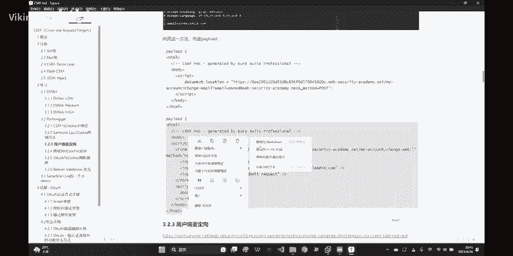

就直接复制。哦好。

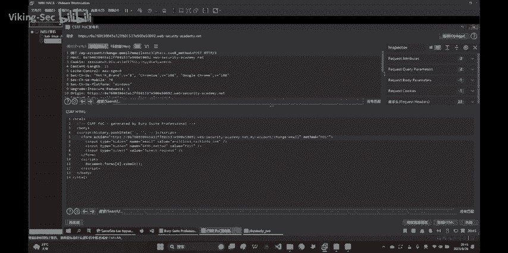

先把这个关掉。嗯，因为他这个题里面啊有一个这个go to explore server呃，我讲解一下这个是干什么用的，这个相当于就是一个第三方的攻击客户端，他帮你搭好了。

然后你会发现他这个域名和他的域名里面这个前面这一串字符和这个是不一样的。然后他相当于是充当一个第三方攻积机的身份，然后他默认你传到后端的所有东西。就是你只要传过去，先store。😡。

然后再deliver deliverver之后传到这个。这个的后端他就会全部执行，就默认执行，相当于是默认了啊这个人很傻，然后执行你的恶意代码。然后如果达到了这个题目的要求。

他就会说你有sofve the lab，就是这么样一个流程，然后检查一下他这个对不对。不太对，那我复制一下这。我让我试一下。嗯。我那可能是有点有问题，那换一个吧。

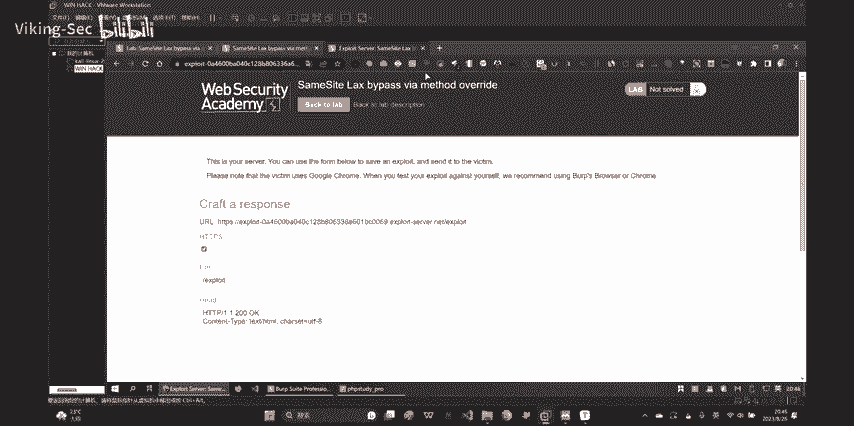

哎，你天翻车有点多。

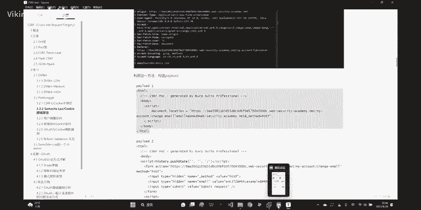

嗯。哦，这样就对了。就是他就是一个通过直接一个链接的方式，然后。就跳转嘛，跳转之后执行了这个代码，然后就结束。好的，然后这是这道题。然后我们看下面的题，再找再找两道题做。

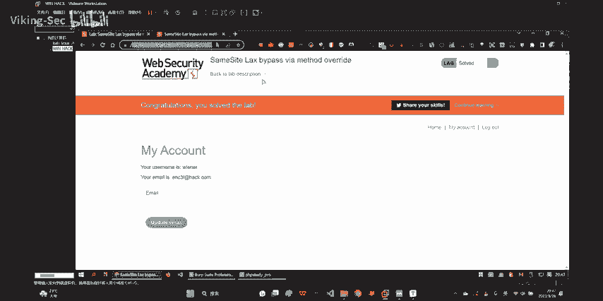

嗯。哦，我想。安上锁。这道题其实挺有意思。呃，先说一下这个吧，用户端重定向。嗯，跟这道题是连着的，像这种方法就是相当于是处理sem set等于lax。

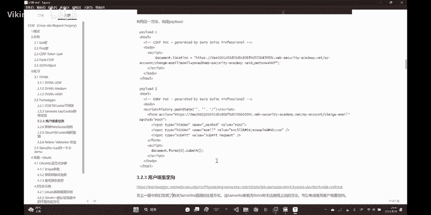

的方式通过顶部导航，然后加get请求。成功的把你的这个呃。请求发送到后端。然后如果你现在参数是strict，那上面这东西你就都用不了了，那就可以考虑使用客户端重定向。啊，这道题。那还是先来看一下。

看一下题目。啊，这个把赏真的是很慢，而且就是你打开b suite的那个代理时候，它可能会变得非常卡。😊，然后。嗯。这题。

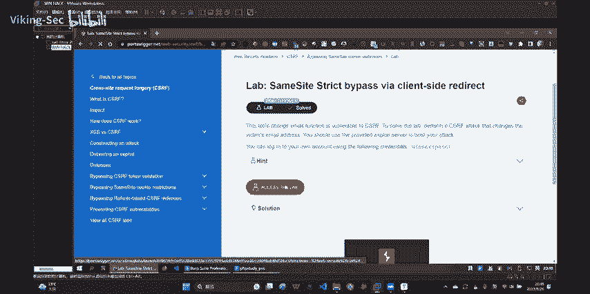

先启动一下把手。那就真的很慢哎。😔。

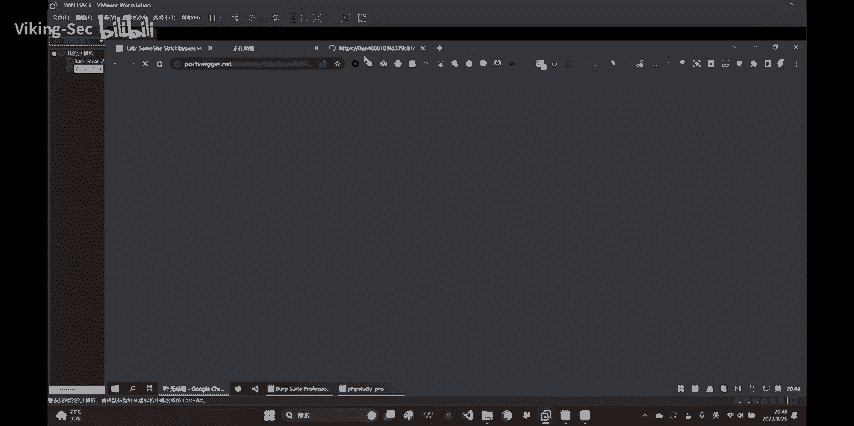

我，还是先登录一下。看一下还是只有一个。Yeah。然后我们就登录了，也是跟上一题一样的，就是你要通过外部攻击CSF的方式去修改他的密码。好，然后。呃，他这边是有个问题，比如说我们发个评论啊。

不是就是你做这种题的时候就是。能发评论的地方能点的地方，你都点一点，然后看看UIL有没有什么奇妙的变化，或者说你打开代理，就是打开个proxy，然后不要开拦截，看看能不能抓到一些有趣的包。

然后就慢慢磨就行。呃。

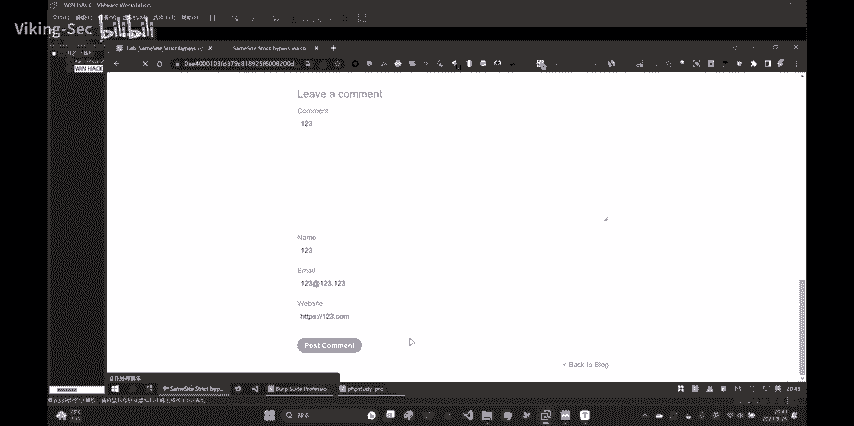

好，就是这。就是不知道刚才有没有看到我手慢了一点。嗯。就是他会这样。confirmation问号pose IDD等于X。然后如果说是。呃，做过一些跟目录阶段有关的题的同学，在这就会很敏感了。因为。

他这边可能是存在，就相于是可能是存在目录阶段。然后我们还是先看一下他这个东西有没有一些本地的。

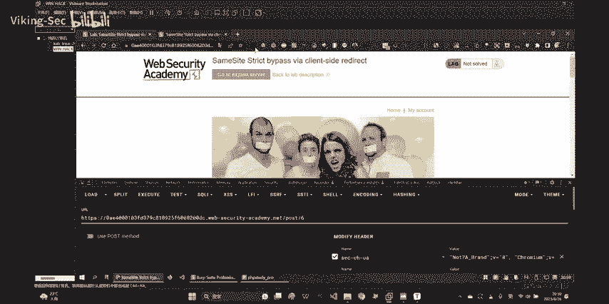

整体的东西，因为这个用户端重定向其实是有要求的。因为他为什么说是用户端重定向，不是什么服务器端重定向，看一下代替。

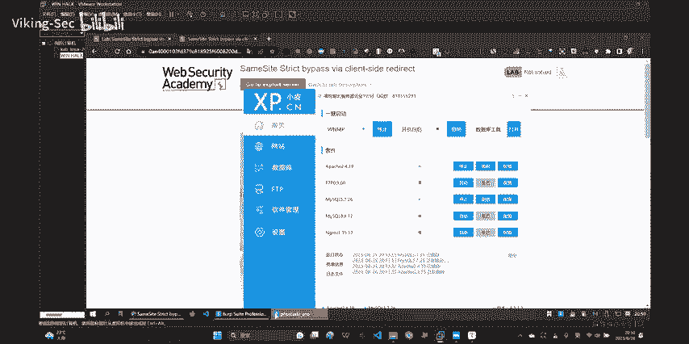

CP历史记录。有点乱，我刚才没有听。😔。

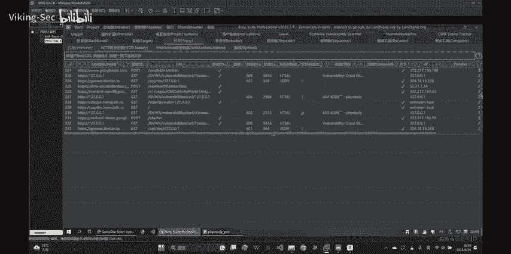

嗯。好，然后让我找一下。他这个应该是在。嗯。对，不是这。算把它全部清掉吧，这实在是太多了，看不过来。嗯，然后我们重新发个什么？

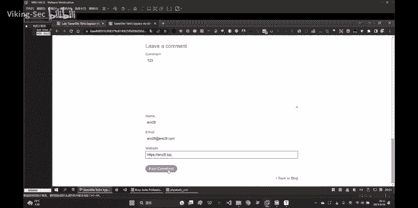

Ill post comment。

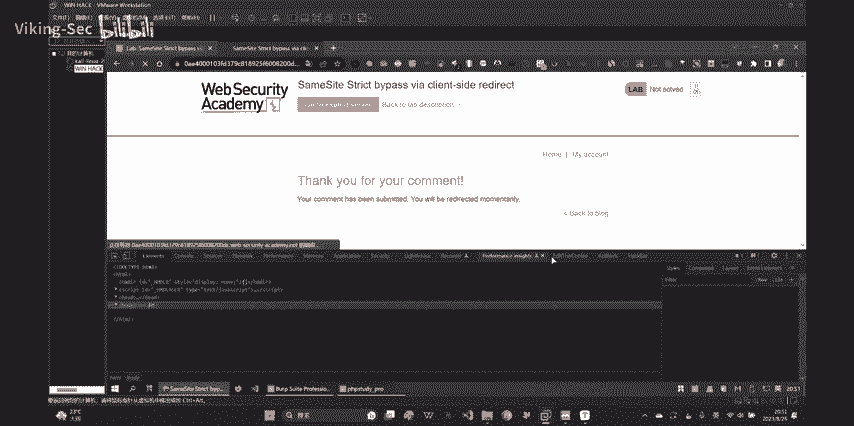

哎，我是每次都慢一步。就是看不到那个，不会也没事。

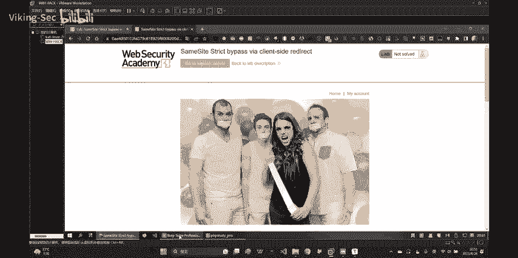

看一下。

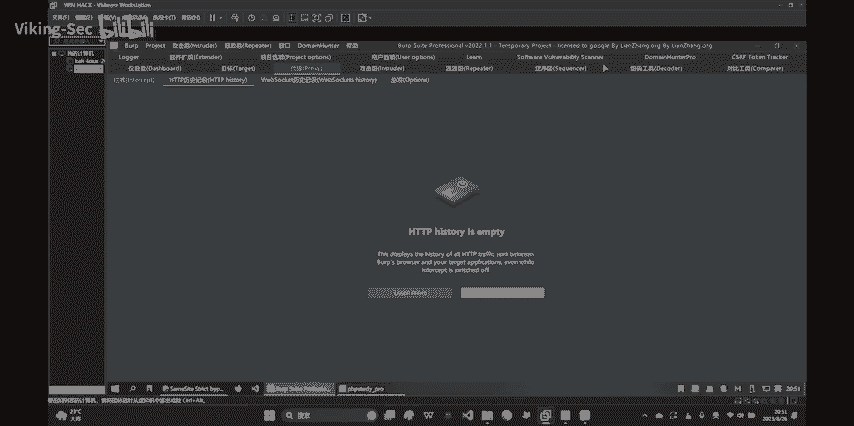

哎呦，我没开，快有点小紧张。嗯。看来下载不起。嗯，还是没节奏啊，不管了，反正就是这时候history里面应该是有了。我们找一下。往下走。Oh6。他会有一个重定向。但是哎不知道为什么，他就貌似找不到的。

😔，呃。不是这个。道体来说，应该在这附近。它会有一个redirect到GS嗯，具体是什么效果呢？就是会有这么一个东西。嗯，我不知道为什么他就突然没了。可能是靶场更新，然后。呃。

我先说一下他为什么可以用目录截段，因为。这个东西不是保存在。服务器的就是这个东西其实是在你的网页里面的，是在你的前端的，相当于是说。😮，呃，它的跳转功能是先在前端被这个GS文件解析了之后，然后你的。

解析了之后，他会通过这个GS文件里面的某些规则。哦，然后把它变成另外一个另外1个UIL，然后变了之后才把这个UIR传到后端。所以说为什么说这是客户端重定向？因为负责重定向这个文件是在你的客户端。

所以只有这种情况时候才可以用这道题的这个方法。然后我们就看一下。

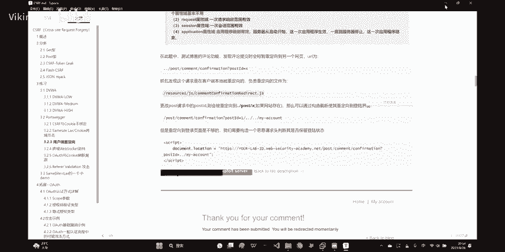

比如说我们可以构造一个链接，用一下目录阶段。因为你是在本地的东西嘛，那就很显然可以用目录截段。就是说还是comment。嗯。B confirmation。然后posID。等于一，然后顶点杠。

这就截断了嘛。然后比如说就什mymy account。哦。然后exec一。哦，你会发现。就重新上买count嘛，说明就这个目录结段就起作用。😡，而且你会发现他重新上到micic的时候。

你已经登录了账户没有退出，说明他这个整体的先通过客户端这个GS进行重定向的过程，它不会销毁你本地的那个登录状态，就是它的cookie30年的东西都没有变。包括CSRFparmeter这些它都没有变。

所以说因为这么一个特性，它能重定向目录阶段，且不会注销你的登录状态。那我们就可以通过这个东西来进行攻击。你怎么攻击呢？啊，其实也很简单，就还是用那个简化的代码的比较方便。

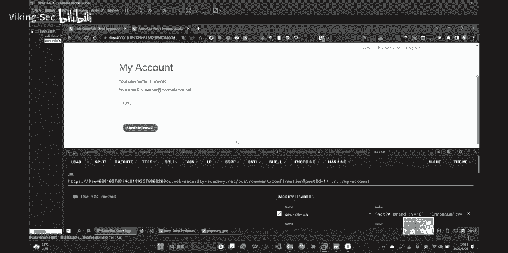

就直接去到这个，把这个盖完。啊，你会发现代理关是会快很多，然后。

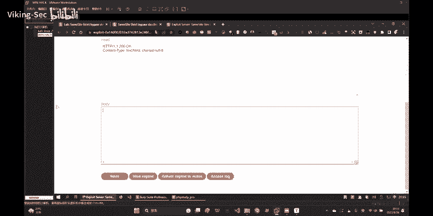

V code就行，看顺眼一点。哦。哦。嗯。Crypt。然好。Document， both location。

等于呃复制一下你的这个。

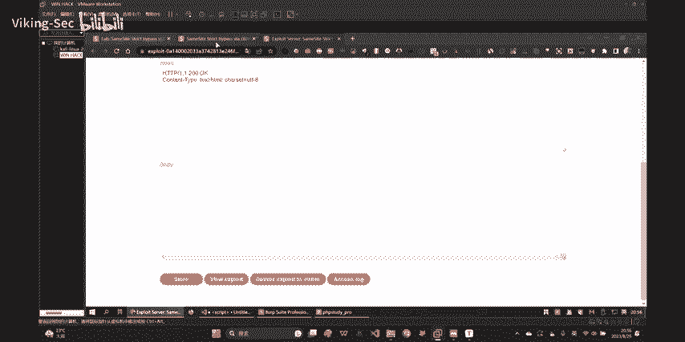

嗯，不是。

看一下。😔，哦。杠change email就是跟其实这些东西就是把之前那些简单的那些tck，然后把它混合在一起，就只要你能看得出来就行。So， that's。ubit等于E。好，我们试一下，看行不行啊。

我也不知道行不行啊，我随便建写的。

嗯。2。多少钱。然后deliver。啊，好像不太对。嗯，他可能是。这个可能是要。编码URL编码一下，试一下好。没是阿0。哦但是感冒号。我是不是。哎，还不行。啊，总是有奇奇怪怪的 bug。Post。哎。

按道理来说应该没出问题。我看我是不是有什么东西打错。哦。我是。我是呆子，我好像没有打分号。😔，然后。哎，我觉就是这么个笑。😔，嗯。嗯，我们每每次都要复制这个已经写好的推漏的就非常。不舒服。😔，嗯。嗯。

按道理来说，就是直接这样就行，不知道为什么这边可能出现个哦。这一会儿好一会儿不好的，可能是响应的问题吧。然后反正总之这道题就是这样，然后。

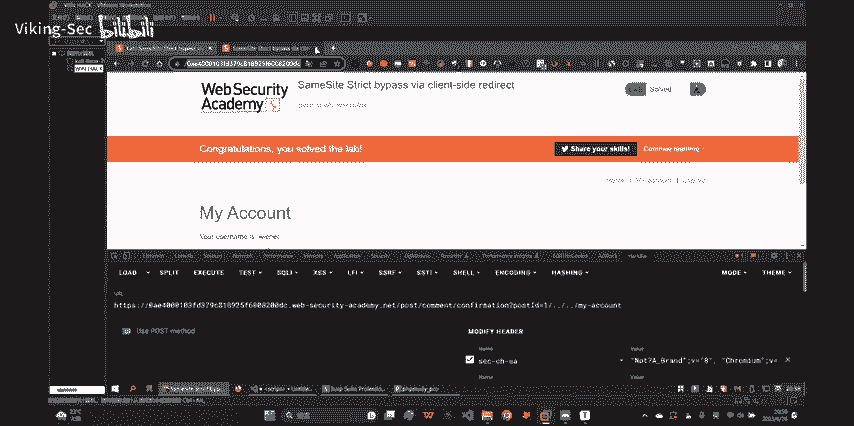

下面我们来看一些真正好玩的题。呃，然后这个题的话就web socket这个题其实也很好玩。但是我这边就不讲，因为开了那个b suite proxy之后，这个题因为它web socket有很多来回的通西。

它会变得很卡，然后你们可以自己回家试一下，反正我呃过会就把这个发上去。😊，我看一下这个。这个Oos这个东西很有意思。呃，原理的话，我看今天有没有时间。😊，嗯，如果有时间就讲一下。

但总之呢这个东西简单来说就是比如说你登录一个什么新浪微博，然后它可能有一个什么选项是使用微信或者QQ登录。😊，呃，他为什么。😮，凭或者说凭什么你只需要输个QQ，你只需要给QQ的登录状态。

你甚至不需要输QQ密码，你只需要有一个社交媒体登录状态，你就可以进入一些其他的东西。比如说掘心社区啊，你可以通过github进行登录。呃，这个这种登录方式能可以实现使用就是all这个协议。😡，呃。

他主要是这样，你可以先看一下这张图。简单的看一下。这个就是奥斯一个流程。就总之你的客户端先向去开放平台获取一个token。好，然后开放平台就。看不出来就哦知道了，就比如说微呃。就是比如说什么gitty。

这是githubgity说你github给我搞个token出来，然后getthub就申请一个token，然后给gity，然后用户。😊，想登录集ty。然后但是他可能没有gity的账号。

他是github账号，然后他申请github像github申请。好，然后gthub申请，然后如果同一之后，还会被重新上到gity然后github里面那个token会被给到gity身上。

这样就相当于是说你不需要gitthub，你既不需要gity的密码，也不需要github的密码，你就可以登录gity社区了。你只需要的是一个github的。😊。

登录状态和ittopub和gity这个这两个社区之间互相信任的这么一个情况，你就可以登录。总来就简单来说就行。然后。嗯，可以看一下这个。就是通过。就是OS呃的原理嘛。然后我是写了一个小demo。

就是怎么去绕过呢？因为chrome有这么一个漏洞，或者说是一个机制。但这个机制在新版chrome里面已经没有。我记得好像是89还是之后反正就没了。呃。

是这个机制是这样的Crome将会为不在两分钟内设置sme set属性cookie设至抛出一个异常。呃，尽管正常的sme set等于lax cookie要求顶级跨件点请求具有安全的HEP方法。

比如get但此类cookie也将与pos的顶级跨件点请求一起发送。啊，听不懂，感觉不是人话，没有关系。它是什么意思呢？就是说你访问一个网站，如果他抛出了一个sme set属性未定义的异常。😊。

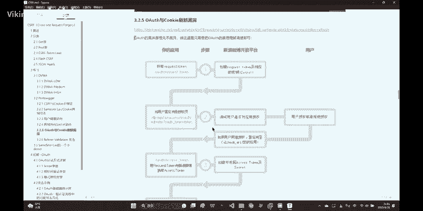

它会在两分钟内设置更改cookie。那么浏览器将在pos请求中发送给cookie，并将其视为no。顶顶部窗口导航可以这样。但在两分钟之后，它将变为Lx。我们回到这道题。

做题跟刚才说那一大串东西有什么关系？😡，嗯，他的关系就在于。不是。啊，应该是。O， refresh。

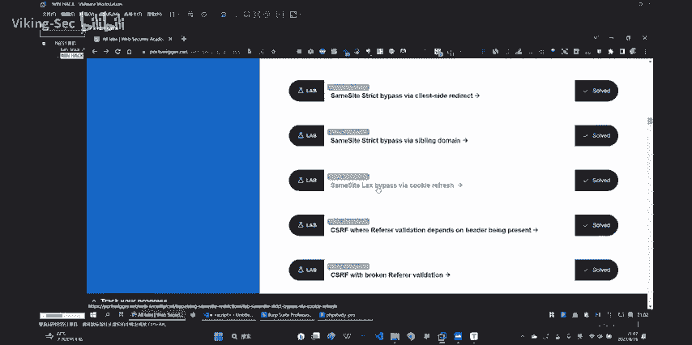

Thank。就是这道题，它就是符合刚才chrome那个机制的。如果你在2分钟之内提交了请求，你可以直接pass，就是你就直接top这个lab。但如果你在两分钟之后用那个普通的CSICSFPOC。

你会发现你进不去了，就是你没有办法成功的。😡，呃，成功的进行这个攻击了，他就不给你pass。

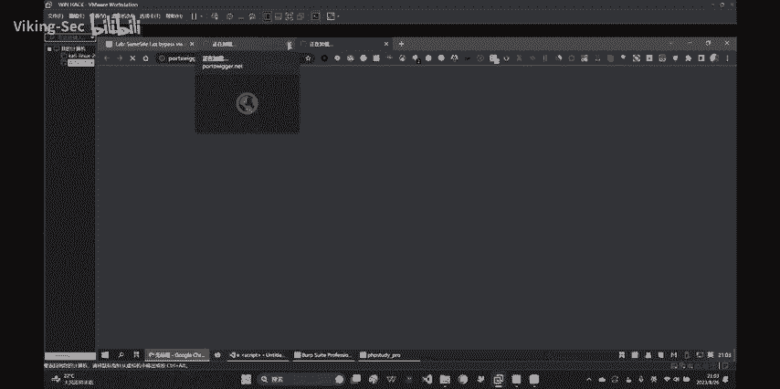

真的很难，保证。你先登录。哦，你看。从定向到学招媒体很熟悉，对吧？就我们现在这个O用的确实是很多的。嗯，然后还要申请获取的什么权限。好，然后现在我们给你登录下，呃，反正在两分钟之内嘛。

然后比如说我们就用这个一个最简单的。CSFPOC啥东西都没有，没有任何的过滤绕过什么东西，你就把人里面，然后把你的这个改成你的来板ID，按道理来说。然不出bug。真难过。试一下，看看到底行不行。嗯。

怎么又给我出bug哎。😡，怎么说呢？就按道理来说，他像dlir之后。就直接pass。你看他就pass了。😡，嗯，但因为这个靶场它会在大概两三个小时里面保存你这个已经解解的题目的这个状态。

所以说大家回去之后可以试一下。如果你两分钟，你就把这玩意儿放着两分钟，啥都不干。你两分钟之后再用这个payload去试，你会发现不行了。因为它的sme赛属性已经被默认设定为Lex。😊。

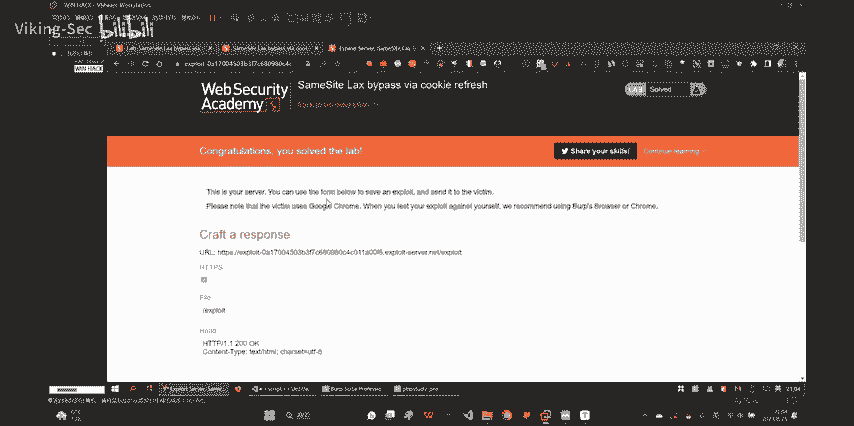

哦，然后这个ns怎么解决呢？就是我马上要说的这道题。

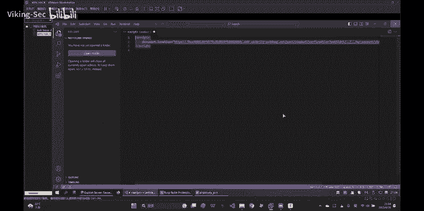

嗯。这个是我自己答的。我不通这个。

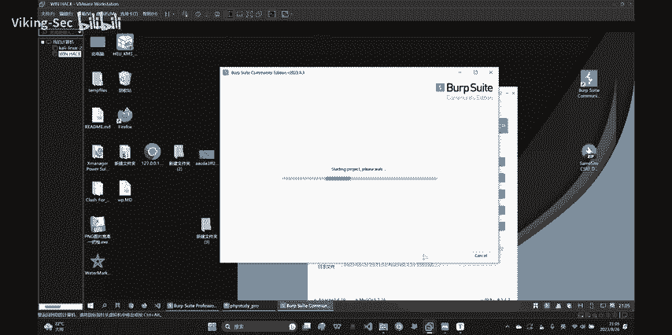

好，然后。我用他这个浏览器。

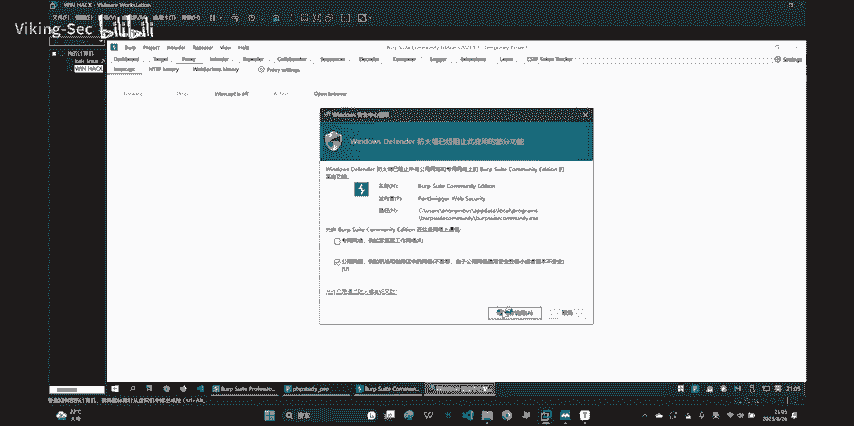

哦，是117002。哦，这是一个界面，对吧？然后我们假设等这很简单，这都没有密码，什么，这超级简单，就loing。哦，然后你发现你登录进来。tes这个就是你可以更改你的，就是你log out哦。

你就log out，你带点home就gues，对吧？就是看一下，我可以给你们看一下这个后端的代码它是怎么写。就是其实非常明显的。

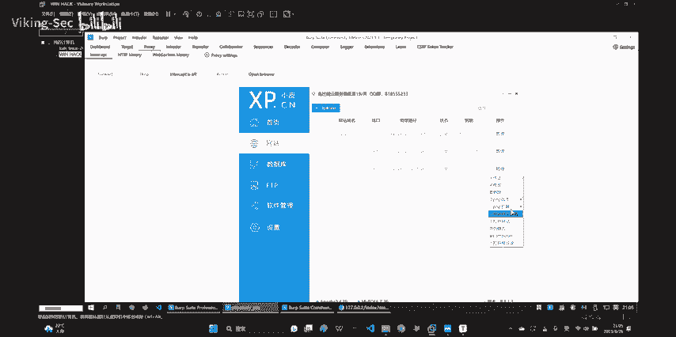

勇往归来。妈的知道。😡，现在上调啊。😊，快点。啊，我舍友回来了，不知道你们能不能听到他们的声音啊。如果能听到的话，告诉我一下。他们在收拾东西。

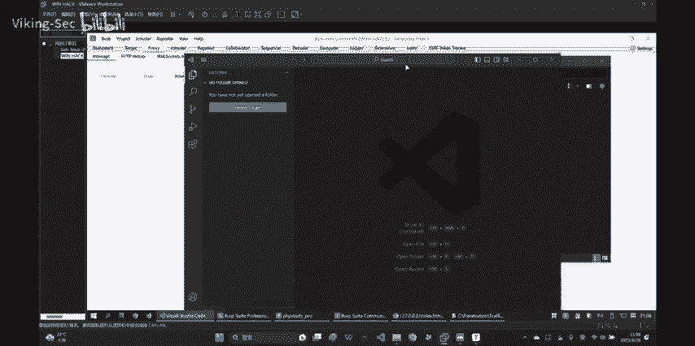

没以。它就是一个简单的页面，相当于是使用了cookie进行你登录的凭证。哎，那也没有办法，就我就把这个讲完就不说了吧。后面的那个Os的那些拓展。😊，题目也挺多的哦，那我也可以继续讲嗯，不管了。

先把这个讲了吧，就是。😊，这个它的页面都很简单，其实就是利用了一个。cookie，然后进行一个验证。嗯，好。啊，除了前端以外，就是get cookie session。

然后到get里面的ID就是一个非常简单的cookie。获取你服务器后端设成一个cookie，然后前端获取就是一个很简单的就。😊。

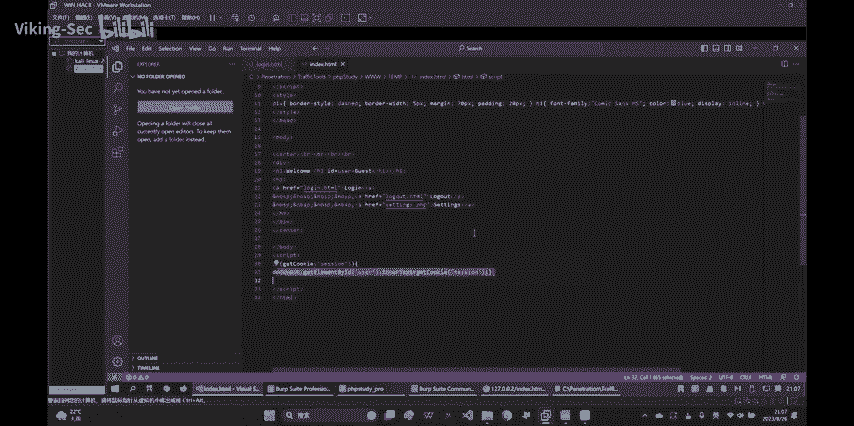

然后那怎么绕过这个simside等于Lx。我们来看一下这个如何解决它。

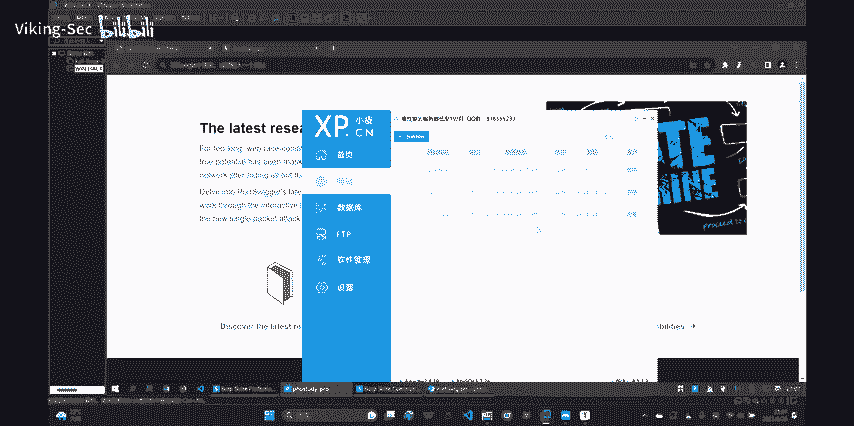

这边还有一个网页。The路ution点是甜的。

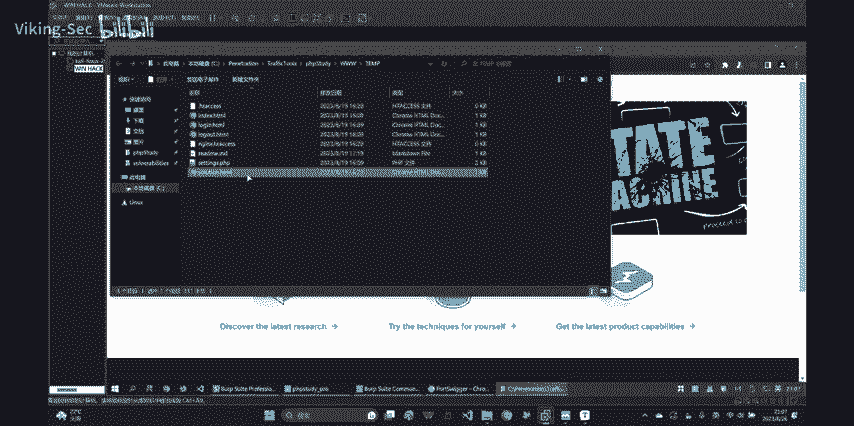

我。喂嗯。稍等一下，应该是。我又不好意思跟你说用。那就不要做呀，还比你妈逼不要好点刚我说的放你们就不要说呀。😊，你中学我我选。哦，我这个没。太慌了。就是说那还是先登录啊，然后以inexcel这个登录。

然后你。点一下刚才的那个sutionM，然后点click me提交请求，你就换哎。怎么就变了呢？又是那个change的，然后点个确定。😡，通这玩意。变成胖子了。他是怎么实现的呢？

我们可以看一下这个网站的源码。

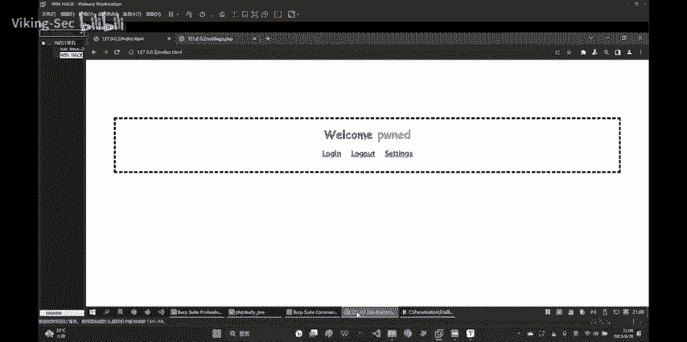

在学习。听我走。但那太了，是些方够啊，这个就是做了一个函数，s time outfunction W点close，就是让W是window点open。😊，W点close就是关闭这个页面，先打开再关闭。

然后它的时间限是1000秒，就相当于是。其也不用一天嘛，你设个120秒也行，就是2分钟之内嘛。然后它诱导用户点个click me。如果你点了好，然后下面这个form就跟刚才的CSFPOC一样了。

它会提交一个pos的请求。然后修养的 name为胖的。然后他这边有个CSFsmit这个函数和这个1000秒的这个配合起来，用相当于是。就相于是绕过了120秒之后变成Lx这么个情况。

你这个东西你刚才那个页面等120秒也是一样可以用的。就它通过一个就相当于是自动设置超时的函数。然后如果你要提到这个请求，他会相当于是强势把这个时间归零，然后就绕过了Lex限实。

又重新变成了sme side0于no。然后你的用户名就这个放表单就成功被post了。post之后，你的用户名就被改了，就差不多就这么个原理。

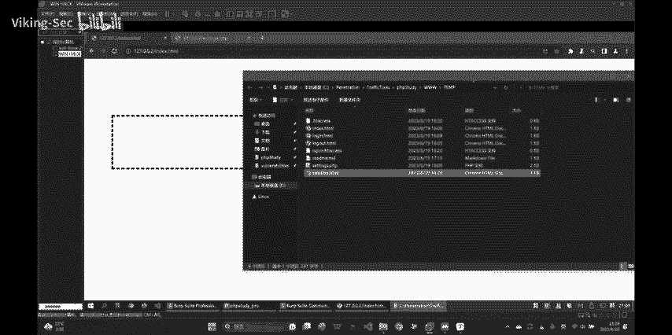

然后跟。刚才这道题。我也登Q可刷新漏动也是一样的。

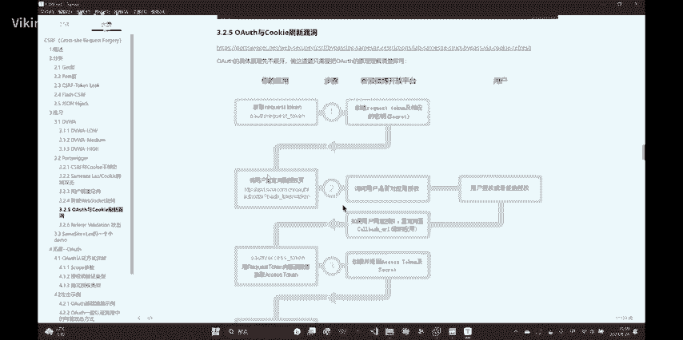

我再变。所以说哎。😔，然后下来这些题就是我这个powe laps上面的题都还挺有代表性。然后这几道题是相对来说嗯可能算是比较难的题吧。然后我就写了一下在上面，然后其他题也是可以做的。

你在youtu上面也能找到很多人呃就是体解的视频啊，就reups。然后最后一个就是。😊，关于修改refer这个东西。这个就相月说比较简单了。开着。哦哦，他没有退出去。然会你往下看一下。

又refer有两种，就我那是写到一道题里面的，就随便拿一个吧。

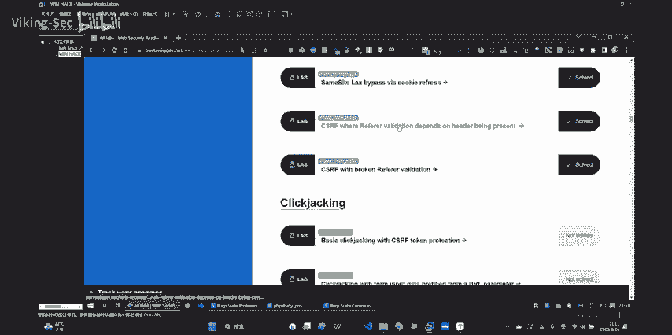

这个refer是什么东西呢？那先等一下靶房启动。这么卡啊。

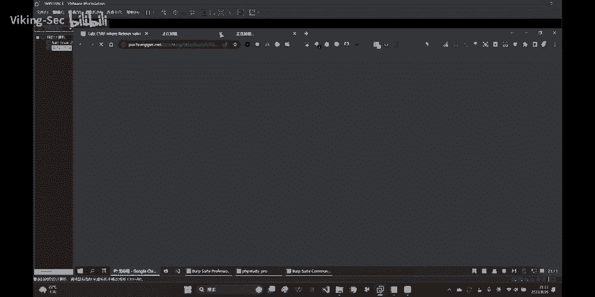

哎。不是不是。哦，进来。那还是照例先转录。你这个靶场的时候速度真的很慢。Okay。哦。知啦。我们先抓个包，然后来解释一下这个repper是什么东西。

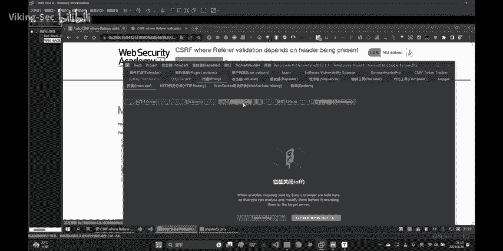

哎呀，我。

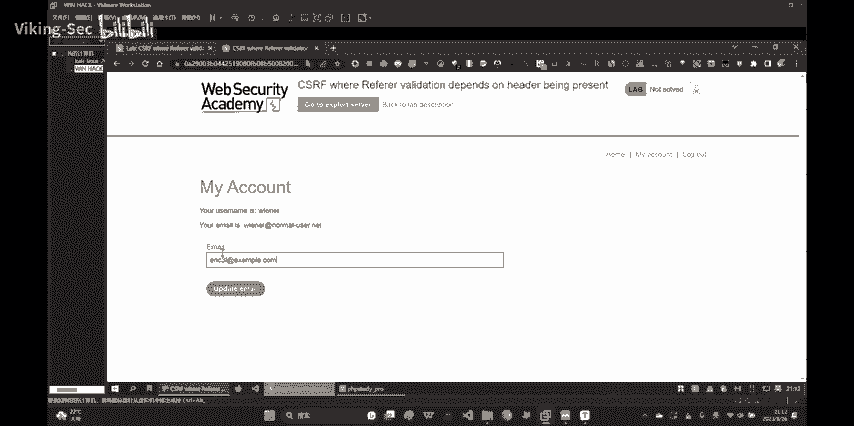

啊，然后就是这么个东西，然后他会有一个。奶粉。没。待会就是。他相于是。浏览器向外服务器发送请求的时候，请求和信息一般就包含这个东西。recor相当于是它后面就是个链接嘛，它的参数值就是这个链接。

这个链接就是你从哪过来的？就是前端你申请这个就是这个请求被传到后端之前，你前端所在URL是什么？相当于是标记了一个你链接来的地方。😊，就是这样，然后。可以通过修改refer的一些手段来达到CSS攻击。

比如说不。发送repeer试一下。不我就改，然后就随便加点什么，反正就不对了。

哦，你会发现400that request，他其实inventre header，说明你这个refer图信息不对。但时我把它删了。看下删了怎么不重么做。你把这行删掉。哦，你会发现哎。你把re份删了。

他就可以正常回去，我再改一下这个。还是那常回线，你会发现只要36月份就行了。然后。嗯。那你发现只要没有约份，你就可以随便修改这个邮箱嘛，你的目的不是达到了吗？那怎么去。

怎么去就是利用这个规则去构建POC呢？就是这样。mea name等于refer就标签，名字是refer，然后count no refer，就相当于是进用refer标签。然后你进了之后。

你那个请求头里面recor刚就没了，就没有内行了就行。没有，那你咋发邮件啊，然后就是这么个情况，有这个包，然后。这个也是也是一种是下一题的，我就不打开那个靶场，为啥真的很慢？就是这行。

refer policy on safefe UL就是。修改这个refer的这个策略为可以包含不安全的链接。也就是说它不再检测你这个email里面这个东西是否和他应该提交那个请求一致。

那也就可以一样的成功成功修改嗯，然后CSF东西呢，其实到时候就结束了。然后下面就是O的内容。因为。我为什么要做这个呢？一个原因是因为这个Os用的非常广泛。

然后现在大多数CSF的漏洞攻击都是攻击O奥就是带有oss页面，或者是在Os的认证链里面去攻击，但是已经9点15了。但是就是时间有点超了。然后我舍友又回来，就看哎，就确实是有点东cy。嗯。我他们寄过来了。

怎么说呢？别没什么用。嗯。那就。啊，我说我讲一下这个认证方式吧。然后后面的题，我笔我这个笔记里面每一道题上面都有链接，你直接点进去做就行了。然后后面的rightite ups每一题都是跟链接相对应。

然后这里面有一些题非常难，然后也很有意思，就是大家回可做一下，我就把这个认证方式简单过一下。嗯。😊，boss的那个。刚才那个原理学实已经差不多，然后。嗯，他的授权码认证类型嗯简单来说就是。

这是欧老斯的一种。嗯，比如这是client application，就是比如说你的浏览器，然后b user agent就是你本人，然后O service APII。这个就是提供oss认证服务。

提供token交换的这么一个东西。一个服务器，然后它是这样的。首先你要登client那边是你client application，是你要登录的这个服务，这个服务会先向俄斯服务器申请一个授权请求。

就是这个一。好，然后系统会询问是用户是否同意这个访问，然后同意就行了。然后如果用户同意的话，就OAPI。会先返回给用户一个授权代码，然后。再把这个数据代码同时还给clification。

然后car vacation拿着这个authorization code就是授权码去再次向Oos握手去申请这个token token值。然后Oosserv就验证这个token是否正确。

是不是他发的相当于啊，如果正确，就把access token。这个是access token是直接关关系到你能不能登录这个东西发给car vacation。好。

然后cl application拿到这个之后，然后再通过这个access token，相当于是他拿到之后就是allservice已经认证了啊，你这个 client application是对的。

然后下一步你就是说你拿着这个access token去申请一些特特定的AP就一些功能嘛。😊，好，然后。这可能是一个一些，因为登录状态本质上也是sction跟cookie，也是信息。他有可能申请一些。

比如说用户需要的资料啊，一些功特定功能啊之类的。😊，啊，然后如果API对了，就这边是没有问题的话，然后他就会把你需要的信息返回给ification。好，然后开拿到之后就会提示user log link。

就是你已经登录进去登。然后这边要有一个特性，就是从这里开始，只要从就从第三步开始，所有通讯都是安全的这就是相于是这一块，就是我鼠标指的这一块，它都是在安全的预配置的反向通道。

在服务器和服务器之间发送的是不会被劫持了。然后这里面呢，在这个过程中呢，会传递一招client secret的东西。这个参数呢是让客户端应用程序向服务泄示自己兴份，就是这个像这个人人身份。

然后重点请求啊一般就长这样，就这个是你b suite抓包能抓的东西。然后Y sha那个流量也能监控到这些这些东西，它是。欧奥斯里面这些东西都是透明的，就不是你其实是可以看到的。

然后我来解释一下这些字段什么意思，response type。哪种类型的响应？如果是authorization code就是response type等于code。呃。

但你其实后面还会讲到有些其他的方式，然后就不是code。然后然后client ID是授权服务器注册应用后得到唯一标识。就是代表这个。嗯，然后reUR。注册之后重定向到一个什么东西，重重进到一个什么链接。

然后scope是请求资源的范围，它可以用空格隔开，然后state是。一个令牌不可猜测的，也就是client secret，它这是一个东西，这个东西上就跟CSFtoken有点像，它每一次都在变。

当然这个东西不能用刚才那个bory token tracker去追踪啊，它要更复杂一些。也就是说基本上可以实现你这个state是没有办法被追踪的，没有办法被预测。那没有办法被预测的话。

你只要state不对，你发送到这就是伪造的请求，如果state不对，那你显然是不会被接受了，它服务器不会接受它。因为你这有错误的。😊，参数。

他的目的就是确定了这个client application是一个是同一个人，不是伪造的。你。然后如果用户登录了，如用户同意了授权服务器收到了请求，他会把用户重样登录界面。

然后系统会提示用户登录osss提供商的账户。然后他们会看到用户提供商黄数据列表，比如说QQ登录游戏，就是什么你的什么头像啊，什么个人信息、好友列表什么的，这就是范围，数据范围。可以选择同一访问。

然后他这个特点就是如果用户批准了客户端应用程序的给定范围，只要用户仍然有os次范围保持有效的通话绘话，这个步骤就会自动完成。它有点类似于但是酷可以保持你登录状态这种感觉啊。

我问一下能不能听到我说舍友说话，我带现在戴的是耳机就是不知道你能不能听得到。😊，看一下。我看一下我的麦克风。喂。我。我找清楚。哦，行，那就继续说。好吧，我哦。就在这个过程中。

客户端有al次认证服务器的连接艺术过认，它其实是一个认证流一样的。在认证结束之前，这个连接就不管它是否你是不是那个。正确的用户就是不管OL最后认证的结果如何，在认证的过程中，这个连接是不会断掉的。

这也是后面很多OL斯的题目里面，他那个攻具方式可以实现原因，就是它是一个长时间的连接。就是这么样一个机制。然后如果对的话，他就会把如果用户同意请求访问，然后就被重定向。

然后刚才这个redirect uR生成的ge请求将包含这个授权代码。这个code和这个state就相当于就是来认证你是不是那样那个正确的用户，然后。客户端用谁收到授权代码之后，就把它交换为访问令牌。

客户端会发送posts像O服务的token端点发送就是点到点的请求，就是这一堆跟刚才那个上一开始是一样类似的。grrant type就是auorization code，说明是授权版意人形式。

然后访问令面传递，传递完之后，它就会回显这样一些东西。这个东西一般是不会做过滤的。他这个服务器它具体回显什么？取决于服务器的后端怎么配置它。嗯，所以说后面也有一道提示。

就是在这个里面返回一些敏感的敏感的参数，也是可以用来攻击的。然后后面就是API调调用和资源传递就没有什么好说。然后影视授权类型呢，其实跟授权码区别不大。

它唯一的区别就是把那个auoration codeauation code去掉。也就是说。直接接触访问令台，那其实就安全性要低的多了。因为这个访问令牌是直接以明文的形式传递。就那个token。

它URL呢可能会经过某些加密啊，但是肯定是不如那个授权码两次交换来的安全。然后这些其实大差不差就少了个。落是验证验证码那样一个传递的过程。然后我看一下讲哪些题。嗯。要不讲这道题吧。

就是有缺陷的CSF保护。我来找一下这题在哪。哦。

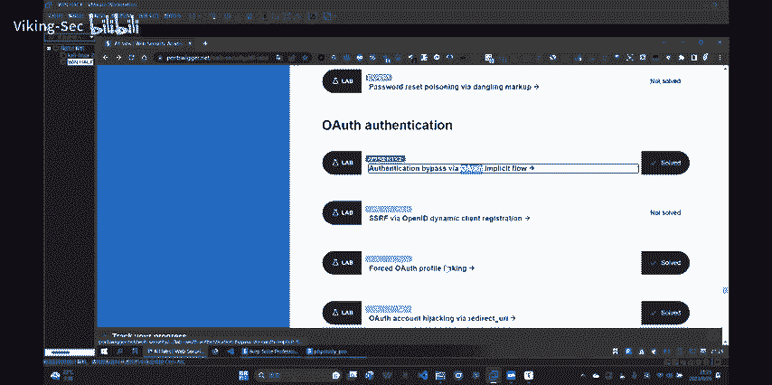

诶。稍微等一下，他这个靶赏启动确实是比较慢。

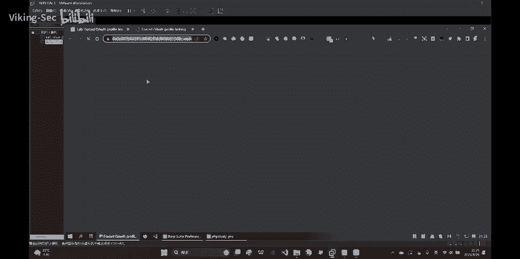

好。边日。既然是O奥斯的漏洞，那肯定有一个社交媒体登录嗯。

我们肯定是要打开这个，把这个拦截关掉，我们要查看他的这个。

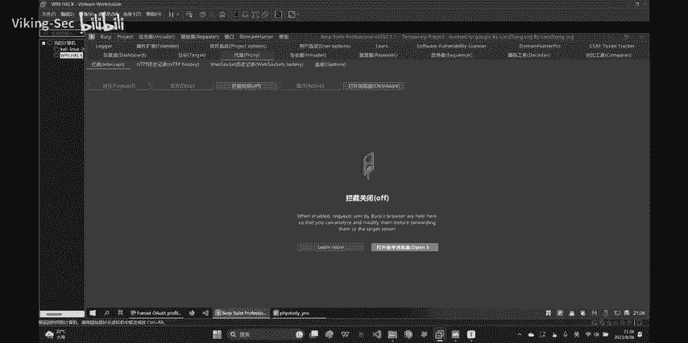

H是TTP historyory看看他这个认证流里面到底有些什么东西，就一。1点看。我们还是先正常登录。然后他会让你绑定一个。这个截止。哦，现在声应该还好吧，我切换成那个耳机的麦克风。应该还好。嗯。

看一下接手点不要要到。嗯系。哦，然后就相当于是完成了一个登完完整的登录过程。我们来研究一下它这个由流。

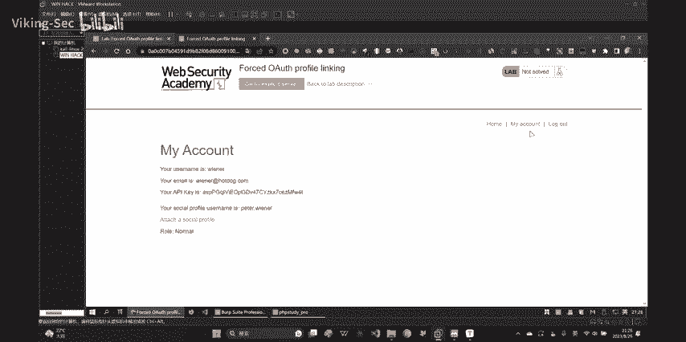

看看都有些什么原，我这是介绍。好，然后呃一般来说你怎么来判断他哪里开始了Oos认证，你就看这个URL，就是你奥次问号，后面一大串各种乱七八糟就开始，这个就是get请求。

然后然OOS认证的这个流程就开始了。然后们来观察一下这个。哎，然后。你们发现没有那个sate函参数啊，那个s参数是干什么？就是。嗯，一个不停变换，每次在变换一个随机字符，它有后端生成用来排除攻击。

就CSF攻击那些没发现没有。那就可以从这边入手。那。我们就把拦截打开，就相当于是。因为他没有state，所以我们拦截任意一个请求，它理论上都是可以通过奥斯认证的。因为其他的参数不变就行。

那只要拦截到这个时候，后面一次再再往后一次。比如说boss认证都开始，在后面某些可以修改它社交媒体啊或者邮箱的地方把它改掉。然后他因为没有tay的参数，还是会正常的通过验证，那就达到了攻击的目的。

相当于是说。那具体是怎么做就是。我还是先把意识清除掉。그好。

我在这里。嗯。请把这个拦截打开，然后。先关掉，先把这个退除。

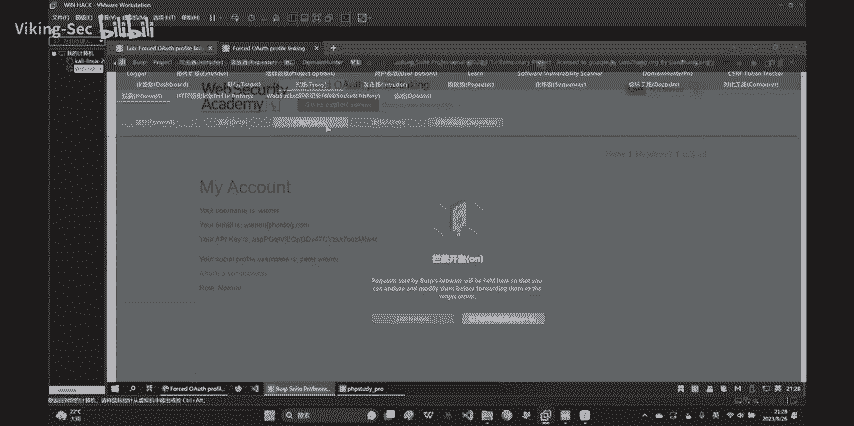

嗯。

啊，这个肯定是要放掉的。你不放这个的话没有办法。没法重定像。哦就懂。这个有个扣，就当于就是刚才说的那个用来验证你是不是。

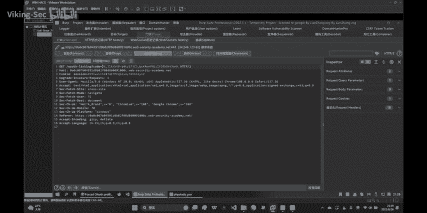

这不不断的扣。然后刚才那个code事实上就是因为没有state，所以就是唯一的可以验证你是否是侵确客户端的方法。那如果说我们想在这边构造攻机的话，那就是。

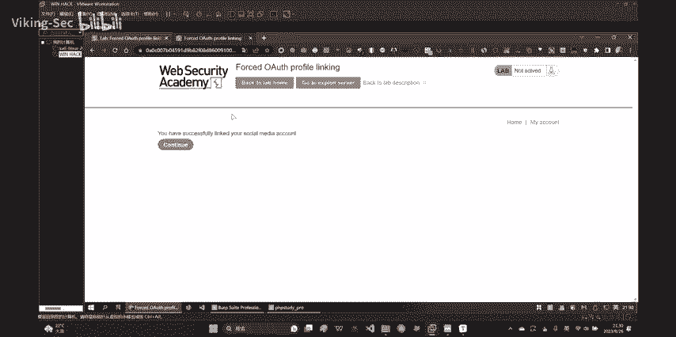

李用。嗯，先放行，然后到。刚才那个页面之后。好，然后把这个。

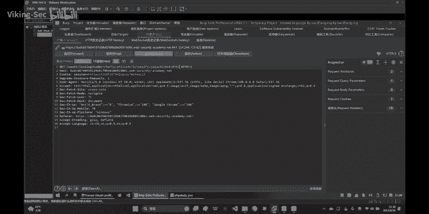

不是你。嗯。😊，这就是斯扣呃，当然你肯定是要把这个丢弃掉了，你不丢的话，他就登录了，所以肯定是不行的。

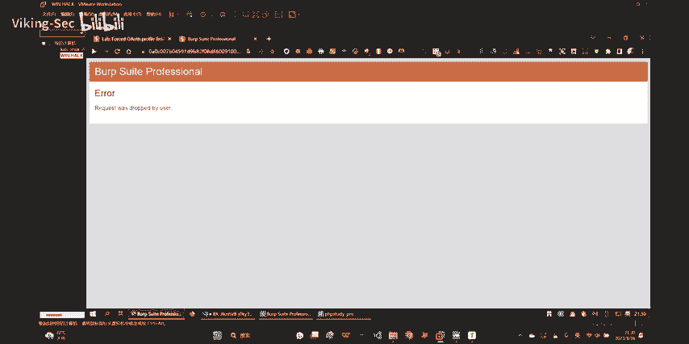

哦，然后。把拦截关掉。我会打开那个ex。

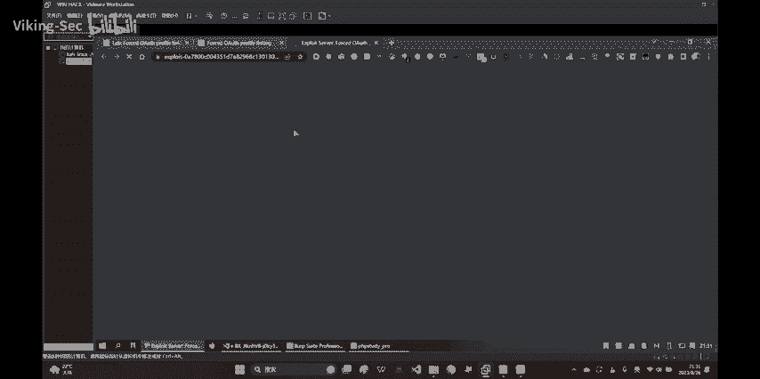

那就简单写一个。难写个paload的形式I用Iframe直接相当于是你。嗯，进入的时候。加载这个页面的时候，它就会它就会嗯跟请这么一个。相于是完成这个script里面这个动作，然后呃C试练习。

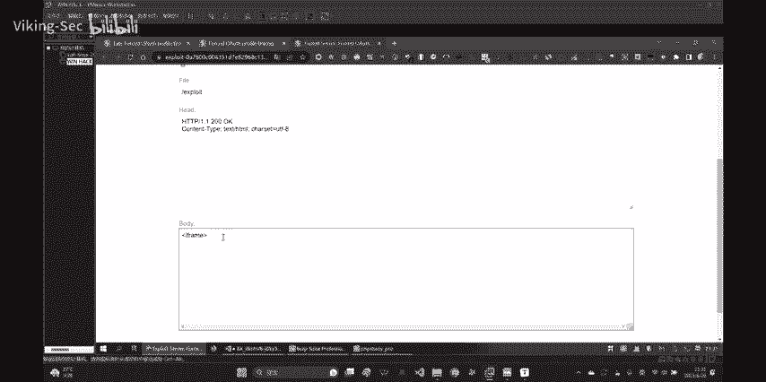

My friend。Force。哎，我把这个放你这去以了。

哎，然后复去一行。

啊。跟你属你妈。

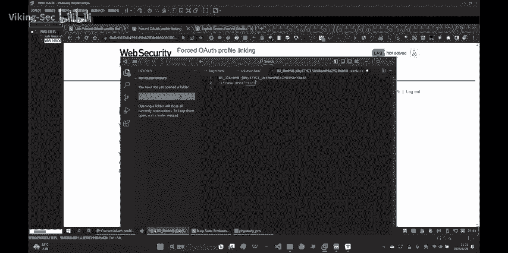

嗯。因，那你不是miccount，然后是O刚才那个O240。大。关。发过来。然后就把这个复制进去。就查叉叉复制进去。然后。攞把翻嚟。

睡觉就行了，这就是配着，然后还估计巴不测试他，应该真的很慢啊。然后哎9点半了，已经，然后看一下再讲哪一道题。哦。嗯，我笔记里面的这一道题。这道题的令牌泄露其实和这道题是差不多的，就不说了。

然后这一道题开放页面从定向。也是通过目录阶段。他。也是。目录阶段之后才可以相当于这相于是获取你那个呃就是auorationauation code。这也是差不多的，就跟上面那个CSR目录时间差不多。

但这道题确实真的非常漂亮，你就是回去可以做一下，演示时间就可能有点长。然后看一下。要么就讲。😔，哎涨4。2。6还是4点。7。3点6吧。Duringing我。啊，这是唯一唯一的那个。

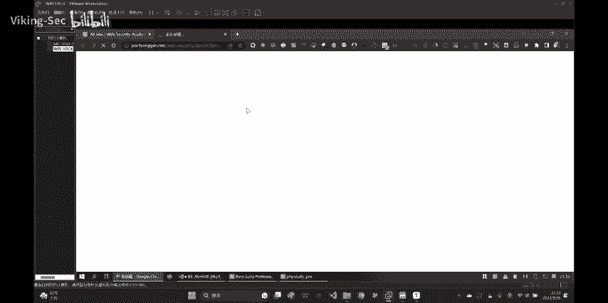

搬家难度的题啊，不过其实问题不大。你看一下吧，先把这个拔房启动。我操这还真他多的，我操。

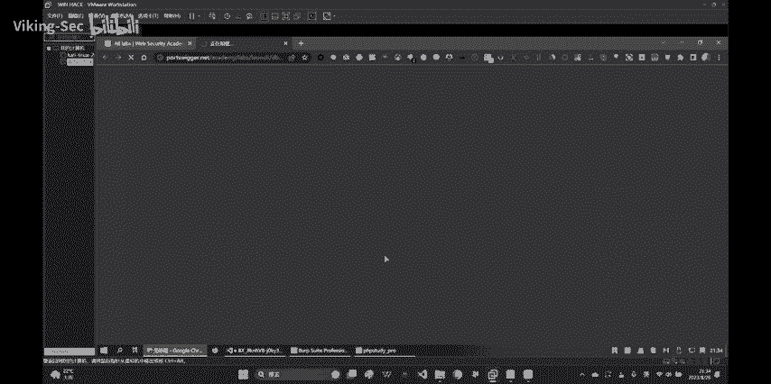

是放歌。好人有好报。而先登录看一下登录的那存。嗯。哦，我先说一下他这个。是外部与攻击，相当于是有点类似于。在set策略等strict的时候，你不可以相当于是跨域。

然后只能通过外部域一些其他的能获取到类似于shall啊，或者是一些敏感信息的方式去攻击。然后基本上有几种。第一个就是不安全加出入脚本，这可能是之前说的在前端执行JS本，或者是在后端进行JS本。

但是它参数传递没有说保护或者过滤，就可能都可能导致jasonjack。然后还有一种就是叉SS漏洞，这个也是外部语攻击。然后。HEML注入漏动相当于是CSP策略啊这个。哦，我叉SS笔记里面有写。

然后我后面可能也会传嘛，然后呃。这个就是导致前两种用不了，然后这个时候就可以通过修改reg uRI。就是刚才那个参数，前提是他没有做过滤，重上到自己的页面。

然后通过内嵌一些iframe啊onload那些标签来泄露refer。然后再把refer改掉，然后再重另上一次就可以到恶意界面，差不多就这样子。发的我也说过。你第一次发，然后不是啊，我不是刷了第一次。

我他妈刷了两次。反我三次我刷了，你妈被超东刷了。你班车通同咩未上户。还是先登录。真的很慢。

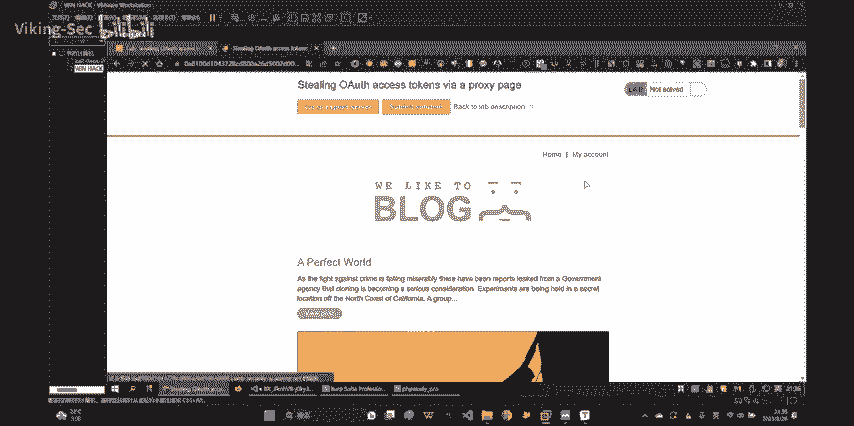

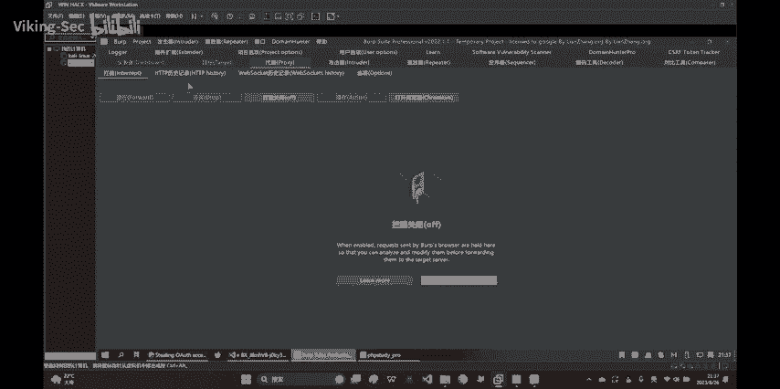

我卡顿。哎对。可。飞哥想我没有？打电话俾九二七零。知吗？嗯，哎，不知了，我宽了我。啊，这个服务器不太给力，真的。

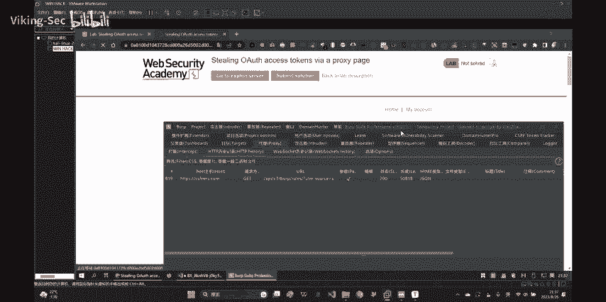

都可。换一个br sweet的版子，看会不会稍微好一点。

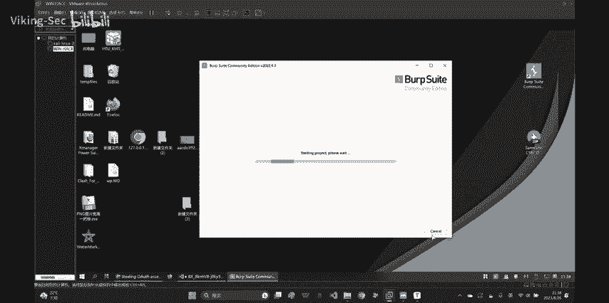

嗯。哦。Okay。嗯。嗯，他就抽风了是吧。对。我和第一个没有截到。那不行，我再重新来一遍。一。先拿报一下，然后。抓那个登录的包。嗯，就睡觉。然后嗯先看一下这边有什么。突破点吧，就反正。

因为他说的是重定向嘛，所以跟刚才那道题一样的，就是我们可以试一下目录阶段可不可以用。你就。还是经典的点点高。呃。Eural post。postst IDD等于2，然后就可能定位到。第二个文章嘛。

然后看等一下。哦，你会发现。他是他这个redirecting是通过一个craft。链接实现的又超链接，然后通过触发这个，然后重新上到这个网页。然后你如果点了之后。

它就会相当于是从令向到那个pos IDD等于2。然后这个题他在。嗯，先把这个包放着吧。说。也是一样的，就是演示的话，这么就快一点，看还是原代码。

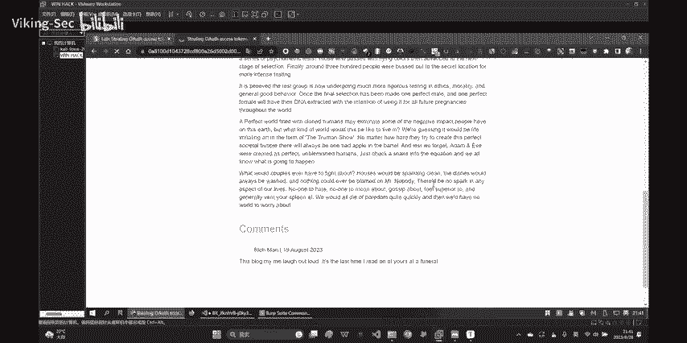

呃。Okay。最近找不到可是有点多。呃，应该是在。

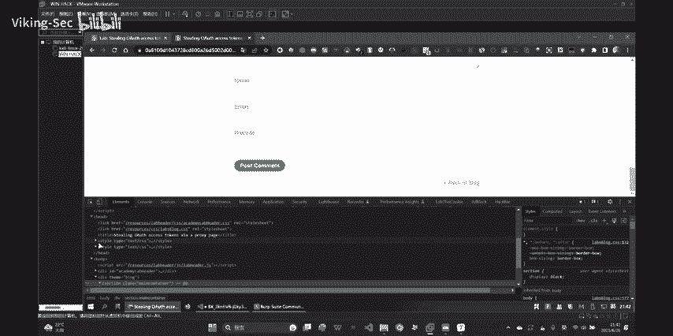

一。冇。这个iframe就是一个标签嘛，然后unload这个也没什么，就是一个事件。但是unload这个事件里面会发现它是有个source参数。然后这个source参数它。哎，他有一部分这个。

链接的里面。这个链接相当于是说就是你可以利用这个链接，然后把进行一些跳转或者是一些其他的操作。因为它这个链接相当于是暴露在前端里面的，它没有做任何过滤。就说具体是怎么搞的嗯。

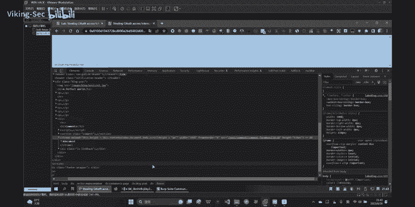

然后来看一下。他有没有抓到一个？有意思的宝。😔，Sure。Post comment， comment form呃。他这里面用了一个有点意思的函数，就是这个。Post message。就是负的呀。

这就不管他。😊，它type是unload，就是事件，然后window location craft就是把所在窗口位置，然后添加一个超链接这么一个函数。但是它这个星号。是可以进行注入的。

因为它将于是这个函数把你alload的这个属性发送到。这个windows location correct的副窗口，你们就是parent嘛，然后它这个函数是允许你这个。参数传送到任何地方。

因为它是新号嘛，它没有做限制，所以在基本就可以做跨域攻击。那具体是怎么搞？嗯，我们还是要重新刷个包。

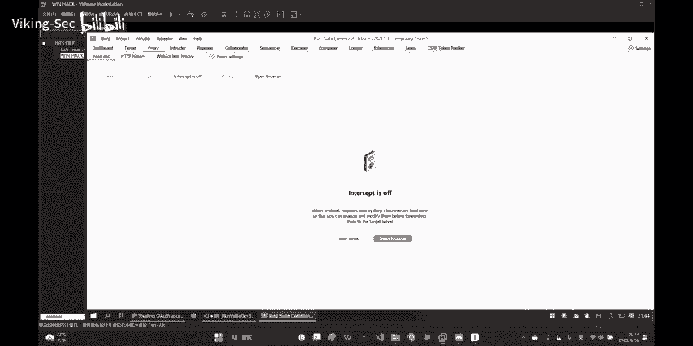

好。

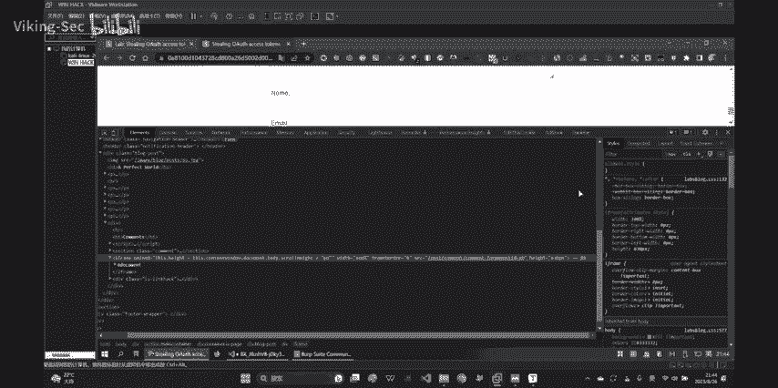

还是抓一个俄os的包。唔 got。然后。My account。嗯，找到，然后这个先forward。然好的。我。不。对。几。

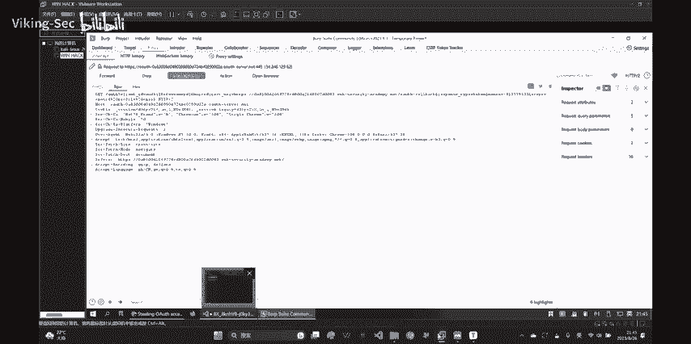

复持一下URL，然后。

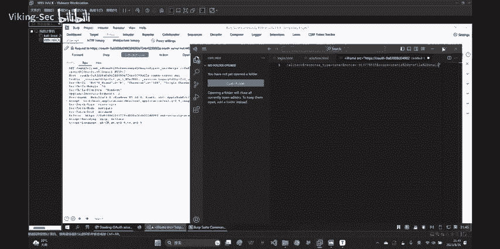

就是就这个URL就是。呃，偶是这个的。页面URL就是你打开这个，如果你在浏览器面打开这个链接，你就相当于直接跳转到这个里面。然后这个倒是没有什么东西。我i friend。二岁。嗯。哇，这少了一个。哦。

对。然后相当于是添加一个这个脚本，它是添加了一个。相当于是。事件的监听，他ele listener。这可能写过前端的人应该知道，因为你。如果是要。监视一些上面的监视一些你网页上发生的东西。

基本上这个东西都是要用到。然后。它的函数就是把斜反斜斜杠去掉，然后把那个URL编码一下，这个倒是没什么东西。加上。不认识。😔，我都个括号。对。然后cr结尾。试一下啊，我也不知道听没听。这个就是放在。

其实很简单，就是原理就是先访问这个网站，然后它重进上之后就会开始一个Os的流程。然后你又通过脚本添加了一个事件监听。那监听的话就会监听到你泄露出来一些什么access token啊。

这个token那个token这些东西，你就可以监听到，然后把它重新编码出来。你的那个服务器的log里面就会回显。那试一下具体的效果啊。😊。

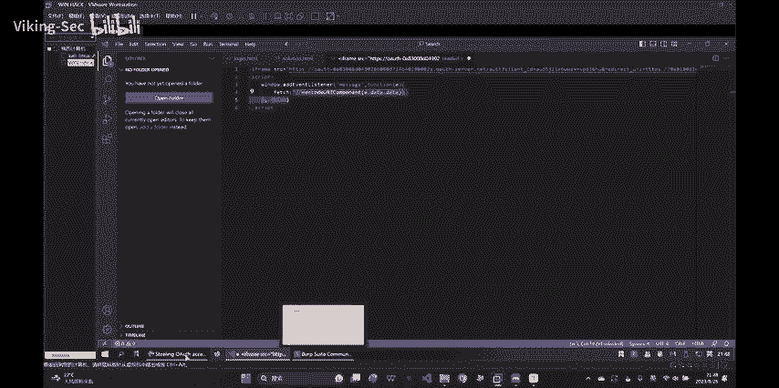

Ve sir。

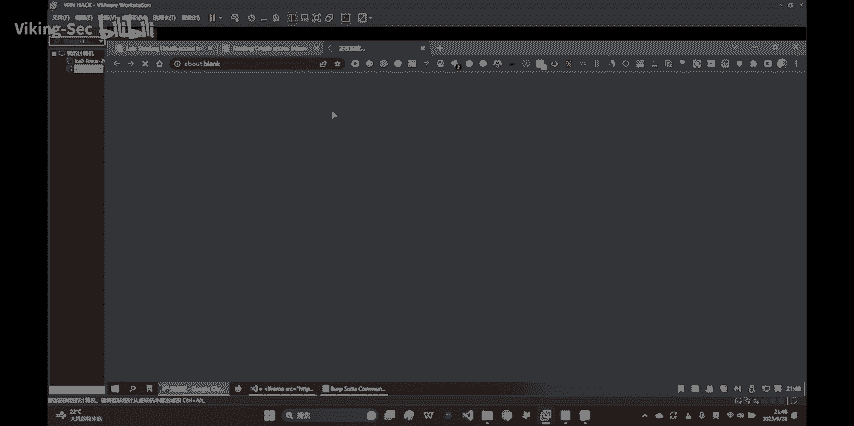

如果是正常的话，这个Xces log里面应该会有一个。嗯，看没有。😔，他应该会。😔，那会有一个问号access token。但是。老师并没有看到。嗯。有点bu了。他会出去。😔，嗯，怎么说呢？

就如果他哎可以正常回选的话，他的access log这个服务器的access log里面应该会有一个user token，然后那个user token就可以直接回选。嗯，不知道为什么现在有美元。

你这么看也看不出什么东西。😔，你说看一下这个参数是不是有问题。嗯，我。对谢。😊，才不出这个问题。那看起来是没有什么问题。😔，哦，那个那s好像有点问题。哇。那都不是最新的。嗯，这样吧，再试一次就是。

抓包抓一下。对。我直接放掉。那我靠。😔，哦，找到了，然后。这本都是没问题的，应该。就是这个nce应该是变，让我看一下。冇。做。如果他还是问题的话，那没办。为啥。😔，啊，看来他这个靶赏今天不太听话。

就还是没有正常的回响。嗯，反正如果他有正常的回险的话，他应该是这样。呃啊，这个他上面没有图，就是大大概长这个样，就是上一道题，他会有一个get x token，然后它后面的那个内容都会跟在后面。

这就是正常一个后端的回显。但这个回显因为你不是那个就对的客户机嘛，所以说如果没有用过它的过滤，你一开始是看不到这个。所以就这么个情况。然后。呃，那今天要不就这样吧，然后然后也不早了，快两个小时。

然后看看有什么问题或者是什么的，也可以问一问。然后如果没问题的话，就差不多了。啊，有什么问题吗？嗯。讲我哋癫女。呃。我就。呃。反正怎么说呢？他这个这个把卡今天确实不太听话啊，因为我。😊。

之前自己在家做的时候，他这个把手状提到花很长时间才能做出来，就是。可能很多时候就是。怎么说呢？你你进去的步骤是对的，但是他因为网络原因或者一是其他原因，包括这个抓包代理的一些问题。

他就很容易就是出各种情况。然后然后我这边说一下啊。

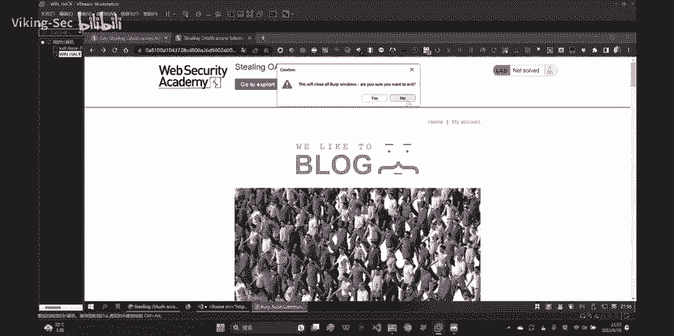

就是如果你们是用那个比较老版本的那个，不是属于是专业版的话。下面有个东西要调一下。我说一下啊，新版的这个，如果你买的新版的那个。专业版是没有问题的，或者是这个最新的社区版也是没有问题的。他。

因为这个网站比较新了哈。嗯，因为这个靶场你能找到的教程基本上都是两三年前的。然后那个时候他这个服务器还是用1。1HTTP1。1的协议进行交流。大家建在也是HTP2了。

然后它有的时候如果你不把它改成HTTP1。1的话，它就会出现那个什么底下会有一段报错，就什么零差1什么procol error，就是说你使用的协议不对，然后这边需要调的东西，就在这个项目选项里面。

然后TL。嗯，是TX我找的HTTP。这个如果你发现底下有什么ever code零差1pro。这个你就把这个关掉，就是不要开这个都什么默认老GTP2协议。如果把这个关掉之后。

一般来说那个没法就是一般来说这个问题就出现在你把包放到repeater的时候，他没法发过去，这重放放不起来。然后你遇到黄放不起来，就把这个多掉，然后就没什么问题。

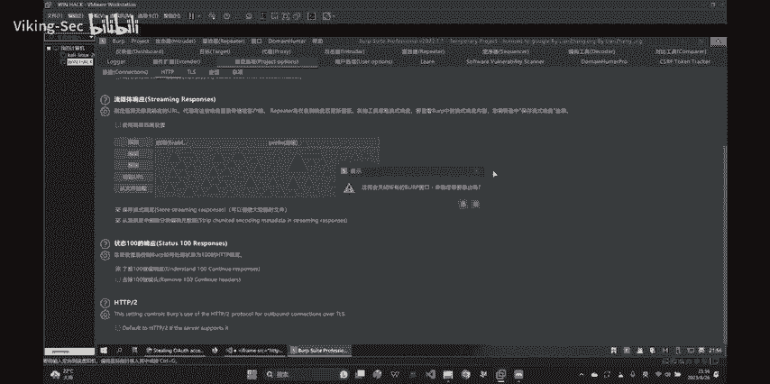

就我当时搞的挺久的，然后除了这个问题以外，应该就没什么。然后啊今天就这样吧，然后后面我会把那个CSF这个笔记发群的。然后还有这个demo我也会发，然后。

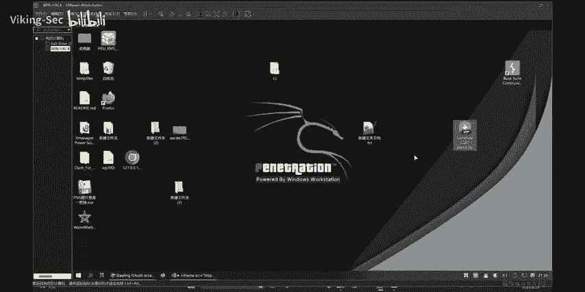

嗯，因为我这笔记本还有一些关联到那个叉SS内容。然后等我把那个叉SS的笔记搞好了之后，我也会发上，就一起发上去吧。然后今天就这样。

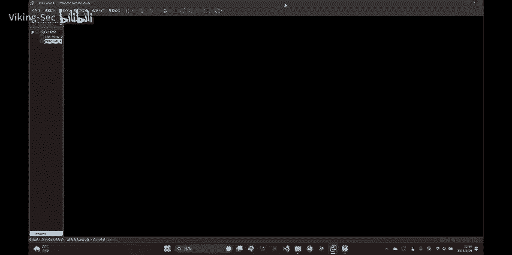

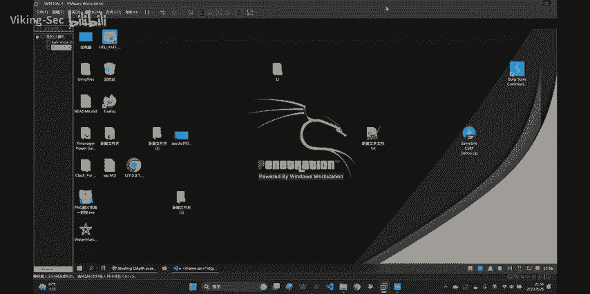