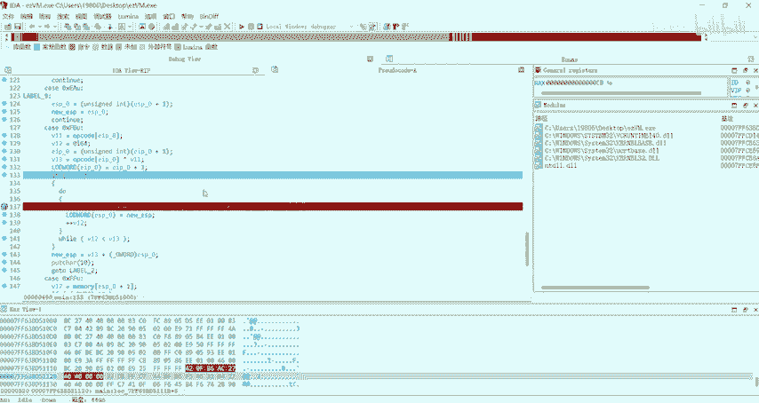
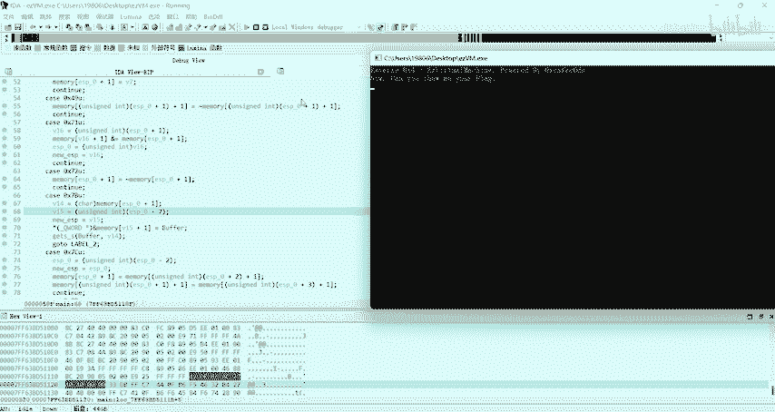
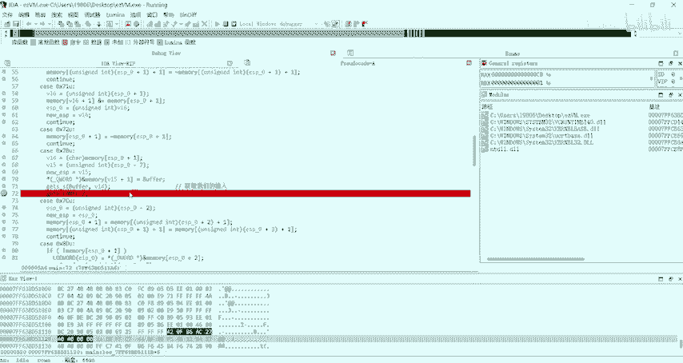
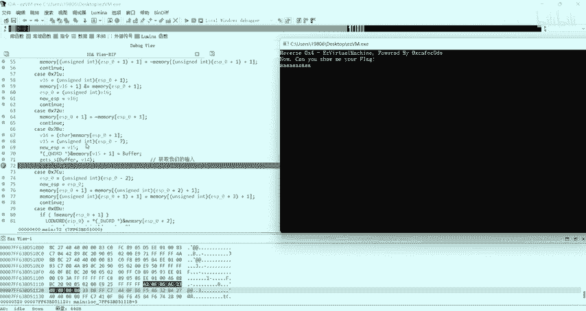
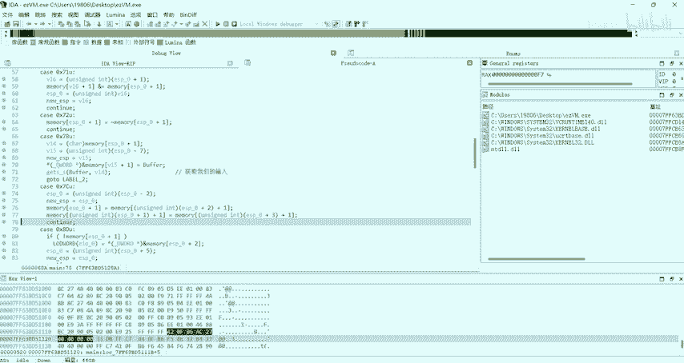
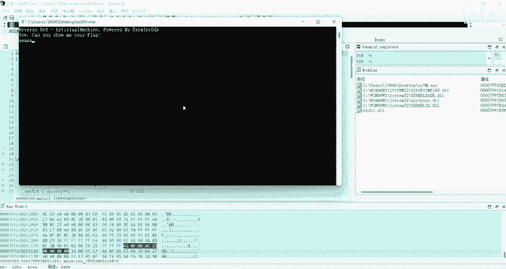
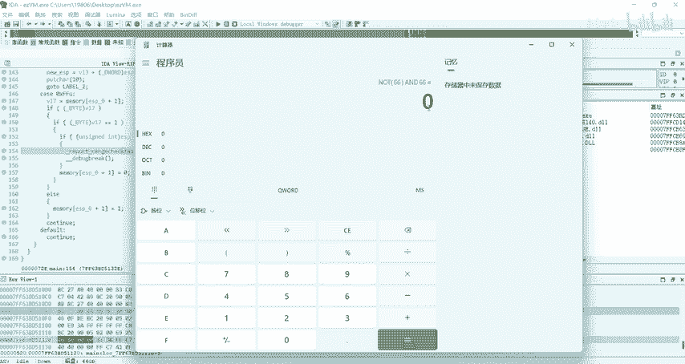
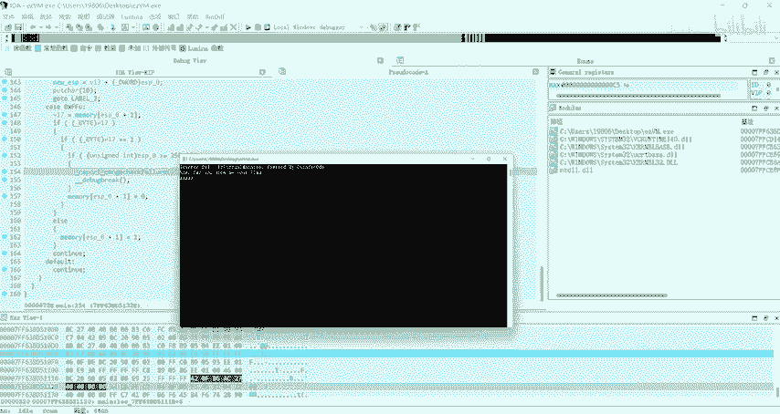
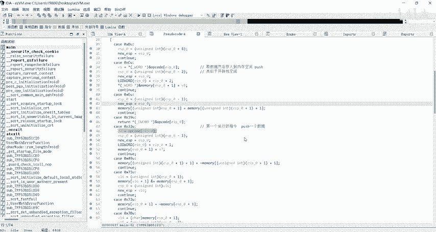

# 2023年NCTF网络安全比赛REVERSE题目EZVM分析 - P1 - aiyakami - BV11K421178n

这里复现一下。2023年NCTFEZVM这道题。左先用DIE打开，好像是个64位的。windows程序。可以先运行一下。随便输一点东西。文通ア中打开。是。就是CDM中很常见的那个VM题。

这主要面向新手讲VM是什么？一级边容易的意思啊，VM就是。维桥麻庆就是模拟的这个。自己用C语言代码模拟一个虚拟机的执行过程。比如说。这里一般你特征都是用switch语句，switch语句。

然后通过便利这个。操作码数这有操作码和数据。计算机中的。模拟这些操作码和数据，然后通过一个switch语句。然后写很多个分支，每一个分支代表。模拟一个汇编指令，比如说木偶破神那些。当然每个题不一样。

这个要具体分析。我们首先来看这个程序。在主函是中，首先他把V5复制给这个。这个变量它是一个取折值，我们可以看一下是距离是多少。是1把H。又是。就是零差100。实际是2256。他有什么作用，暂时看不出来。

往，这里。switch这里那这里就是操作码和数据的，我们可以给他改个名。那是OP code。嗯。用我这个V6指针。就很明显，V6就是一个。EIP吗。相当于我们计算计算的EIP。

它存储的是当前指令执行到哪的。然后EIP是等于V4这个东西。所我可以把V4给它改成EIP。EIP复制给V6，然后EIP加1，因为要执行其2条指令。Yeah。然后一般思路就是。分析每个。

每个cat语句代表的哪种会变指令？那这一题其实是不适用这种方法的。因为他这种指令。一般的VMP都会去模拟计存器对战那些。但其实这道题你可以先分析一下，它这个是没有模拟计存器的。我们看到这个人。

比如说我们看第一个人差并优。他首先把V5加8。然后。把这个值复制给，把V5复制给这个值。Yes。V5是什么呢？😡，那首先V5加8。单看这个指令完全什么都看不出来。我们继续往下看。这是0叉CU。

首先V8等于。这里面这个值。这个对VM比较熟悉的话。他这个是操作数嘛，操作数里面取1个EIP当前指令，然后取它的值。那很明显，这里首先是取值吗？取数据。那我知道VMT，你这取数据一般都是to了。

那一般就是to。要后数据要push进去。然后往下看。V5等于V5减2。然后再把V5又复制给这个值。然是EIP1加2EIP加2表示这条指令执行完切到下一个指令。然后注意看这里。这里V8是我们取得操作数。

然后把它存到这里。啊，存到这个里面。这个代表什么呢？取操作数，然后存到里面。其实这是push的完整的一个p值。我这个值就是我们的内存空间。如果说是push主印的话，相当于把这个push到这个站里面。

但其实这个它不是模拟的一个站，它其实就是一个内存。这里其实也不能说是push。他只是取数据。然后存入到。存入到这个内存地址当中，我们根据看一下。我会发现他就有。能差101个大小。我们自己可要加个名。

就是内存空间嘛。再继续 memories 。这里是内存空间。所以这个只用取数据，然后存到内存空间。那你确实也可以把理解为对战，有push，然后下面那个就相于是个战。我这个是干嘛呢？😮。

那首先V5减等于2。然后下面这个空间。从空间是一个数族。然后V5相当于一个数阻索引。就说V5实现的存放。这个pspush的这个变量存放到具体的哪个位置当中。V5就记录着他应该存到哪个地方。

因为他是一个数族。这里如果对VM比较熟的话，其实这里相当于。类似于啊就是相当于类似。类似于开辟战空间。在B站空间其实这个指令就类似于啊类似于ESP。但他不是实际的ESP。然后这个保存的是新的指任。

因为你这边减二的。然后把这个指针再复制给这个。然再回溯这个值。Please。但它是1个6ESP。Yes。然后下面指令其实也没必要一条一项子分析。因为这个。它并不是完整完整的模拟一个技术。

完整的模拟一个虚拟机的功能。그。而且很难很难看出来，你直接看是很能看出来的。所以这里最好是动态调试一下。Yeah。所以我们直接开始运行。我看到指令是怎么运行的，在这里下个段就行。你让他断下来。

对我的IDA又出问题了。即便我每次设置过，他还是这样。Yeah。然后成功断起来，这时候它是没有输出信息的。我们看一下这个信息是怎么输出的。跟进一下。所以我们直接F8。哎太快了，我靠我没看到。

第一个只没看到啊，我还是重新重新运行一下吧。嗯。Yeah。嗯。Yeah。我发正好第一个组力是这个。嗯。0差32。他首先还是取值，取值存到微信里面，然后开辟一个字节的空间。然后把这个值放进去，我们可以。

最行完上看一下。那首先微7取的值是0叉98。我们点击这个memory，然后它最后一位被复制成0398。前面我们说到。这个初始的值啊，这个ES我这你设置为ESP0杠0的初始值，它就是零差100。

又是256。256指向的是。最后一个字节最后一个地方。然后他这里先减一。然后存到这个里面。再把它加回来，然后存到。从到最后这个尾数。就是把成功的传到这里。但实际上现在ESP的值指向的是这个位置。就是。

从右吧从右从后面开始往前一直往前直。所以说它第一个字数存在这里，实际上实1的ESP的值指向这里指向这个地方。好，我们又可以发现他又进行了这个指令。所实我们不能发现，其实这个就相当于。不子。

如果你把那个数组理解为这的话，这就是push一个数据。一个字节数据。然后这里。他减释。直接相当于存4个数域嘛，就不是4个数域。根你去看一下也可以发现。Yeah。这有直接就有4个数据了，而不是一个数据。

最终po4个数据4个数据。继续往前看。这个就是。这里减8其实铺18个数据。一下就有这么多数据了。Yeah。Yeah。其他的就没什么好看的。其实这些。这些数据。最近建的数据就是要打要打印的信息。

我们可以直接跟进到。或者差这个函数。嗯。Yeah。这里这里其实就是输出信息了。这是我们看里面的内存值，它有这么多，这这些就是要加要打印的信息。Y一8。

没看他一个个打印出来。嗯。得继续进程吧。然后就是这样。关键点就是他是怎么判断我们的flag是不正是不是正确的。首先，输入输入函数在这里。

说还是在这。Okay。他把它存到这个包房里面。我可以仔细看一下，实际上这个bffer这个内存内存的数据和这个memory是相邻的。紧挨着的下面就是。我们flag的数据。我们主要看他怎么验证。

我们flag是正确还是错误的。

我们首先可以。随便写，因为我们不知道flag长什么样。这里也可以多写几个A。只是方便我们测试。回车按下回车之后。

还是断下来断下来，我们之后看看怎么验证的。😊，那那接下来执行的直率是哪一条？所里他有好多无用子令，不管他了。好。他这里运行到这个这个指令，这个指令它还是push一个数据，我们看他怎么复ush的。

我是看怎么 push实，看他push的是啥。首先这个。EIP是我们当前要指向的地方，它是一。不能这么看，要这样看F8。他这样子看吧。F7加1是F7加1的位置。哦，F7加1等于多什？Yeah。Yeah。

这是248的位置。总共大小是256。啊，V7的值是多少？Yeah。零。那首先传了个零进来。我，们可以看到这个就是。第248个位置。然后这里被复制成零。那个操作我先弄了一个零进来。

我们继续看看不出来还干嘛。好，这里一个数据。那只行到这里。他还是把这个F8的位置。哦，这里比较关键的。😡，我们看这一个。这个直接读的话是理解不了的。这些读是你解不了的。你可以尝试看一下吧。他首先把。

F8的位置。就是还是那个之前那个零的F8的位置。直存控的是0。行我你先看一下。这里原本存放的是0，但是变成了061H。我们可以发现6EH实际上是我们输入的flag，毕竟我输入发全是全是AA就是61H。

他把那个6个H给他。换成了零的位置。实实要是敏感一点的话，敏感一点。它刚刚是一个0。0变成了61。比就是说这个零其实索引零索引到了我们这个数组的第零号位置。然后把61给存了进去。他首先会是一个索引。

然后根据这个索引找到这个数入，那把这个。所谓的位置给它放放进来。要是直接看这一段C源的话，是看不出来什么东西的。左边这样很正常，右边就不正常。右边它是新号。这一个。加上。这个模是看过啊，可以直接看汇编。

看过来的时候看汇编是最合适的。首先。会编成是这一段。嗯。首先这个是数组的指针啊，数族指针在这里。他把数字指针复制成了这个EDX。他指向着。嗯。然后再往下看吧。然后RX加R12加这个。还是数主地址吧。

2059H。先看一下。Yeah。59H。Okay。他这里显示有点问题。我们可以看这里是690，看到没有？690往前100位，100个十进制，不十6进制，直接就是590。然后这里是591。Yeah。

这里怎么说呢？591。690。要动态调试可能比较好说一些。Yeah。R和R12，它反像是前面的值，总之这个值跟。这个指针其实指向的就是这个首例指。啊这样看什不好看的，我下个段吧。这样子看不出来下个端。

跳段之后重启一下程序，可能比好比较好看一些。

放下来之后，我们看一下。首先这个指能指向的是这个速度。再下一吧。然后。😔，哦，EDX不指向指是？EDX指向的就是那个银锁银锁那个零。它等于2X加22加这个。哦，对对对对哦，我想起来了，我之前忘了。

实际上这个东西它指向的是这个银锁灵。然后下面这个下面这个指向的是零锁零锁零后面的这个东西。一索0后面这个是没发现它是它是什么呢？他其实这个东西。所就是这个地址看到没有？7F。7FF6F6。然后3838。

哦，70。呃，零地七啊。然后690看到没有？这个这个其实就是个数内存地址，这个内存地址刚好指向的是我们这个巴佛的地址，那么是690吧。就是前面前面要是难看的话，反正都一样。因为前面我们讲一样的。

可以不看，就看最后的690。我们发现还是690。他实际上这里就是。这个指针。这个ERRCX这个指针不是RRCX指标。RRCX的指保存的是这个我们输入巴的。地址。然后再再把它括号起来。

括号起来就取地值的值。就是你所地址吧。啊，这时RDX。不不RD对RDX是银素RRCX就是。输入的。地址啊，我输入的字母串成的地址。然后荀址。寻址就能寻址到我们的这个输入第一位啊。

因为我们零锁是零就输入零锁到第一位。所以这就变成61。然后再把它存回去，存到我们这个银锁零的位置。这里就变成61了。所以我就是这里就是内存地址，加上你这这边这个原本是偏移，是这样子的，我也忘了。

Yeah。然后他把我们的输入存到这个位置，然后他是怎么进行判断的呢？怎么进行判断的排列。嗯。判断首先要个有个判断点吧。知。你可以直接看。我有这些东西。你路扫下来，他都没有一个判断的地方，看到没有？😡。

其这里有个判断。嗯。只有这里有一个碰断。然后再往下看。这里都没有判断。好，再往下看。只有这里还有这里有一个判断。只有这两个地方有判断。😡，嗯。我们先看上面这个判断。Yeah。Yeah。对。If服。

这个内存地址的值。如果它等于零就会执行下面这一段。如果不等于零，就会执行这一段。这操作是ESP。这过应该是P写的，我们可以。😊，不用看了。因为他操作的不是EIP。就无法达到跳软的目的。😡，Yeah。

我们看下面这一个。哦，不是这里哈。其实这里还是。他是看有没有输入啊，有没有输入。你是看有没有字符需要打印，这个也不是。再往前看。其实是在这里。在这个地方。我们可以看一下这个逻辑。这里有一个。

他可以其实有个退出的。Okay。也不能也不能说退出吧。所以这个操作也不是EIP啊，操作是ESP。如果这个。如果这个是为0的话。某这一位就会设置为一。这一位其实还是就是这一个。如果它不等于00。

它就会设置为一。然后又会执行这一个循环。如果它等于一的时候。Yeah。并且这个。大于这个东西。实这里分析的可能不对。这里可以不用管啊。重点其实肯定在这里了。Yeah。哎，当然也可以不也可以不仔细看吧。

直接看可能确实不好看出来。因为这里他IDA分析是卖的。所以做个标记吧。你这里它是一关键判断。哎哎，打对了。如果看不出来的话，就还得一步一步调。只不过其实一步步调最麻烦。因为他总是做了很多无关操作。

我们可以继续再看吧。他首先他又 pushush了一个数据。我看一下他布署的是。0叉B8看存在哪里？所的是F6加1就是F7的位置。F7我们的输入存到了F8。他到前一个位置。Yeah。就是BB8是我输入。

它首先push一个数据，存到这里。到目前为止，前面那些数据还是那种打印的数据，需要打印的无关数据，都不用管。继续看。他又普写了一个数据。他这时候负值的是零差低。这个位置是。F5加1就是F6。

就是上一个数据往前的位置。Yeah。DE和B8，然后这是61。我们再看。嗯。嗯。他进行了这个操作。这个操作他改变了一下值。没有他这里没有碰到点啊，首先。因为他就是复值嘛，复值复值这个付给他这个付给他。

也不管他的过程，也不用关心他过程具体怎样的，我直接他复制完再看一下他做什么操作。😡，我是DEB8。他把利益秘方往前复制了一份第一B方。看不出来还干嘛？再往下分析。他还是在这样。还是在那个村值。

DEB8DEB8，它又这里复制了1个DE。再看这里有个取反。他把这个批8取法。这于不是啊，这里DE啊，他把定E去翻。然后再看。You。又把前面这个去反。😡，睇看。好，这里余等于。他这里语了哪个东西呢？

一我三去。天意变话。😔，这你捋了个啥？13。好像也跟自己一比吧。这步没有什么意义啊。他基于这些操作很多是无意义的。哎，哦哦刚刚那手机没分析啊，咋里忘了。行，这个我们也不用关心。

我们再看它还是在这个操操作赋值。原本是DEB8，然后现在变成B8B8了，随便原本是R121DE。是用为成B吧B吧。不看他啊。继续说法。很有区分。哎呦，我又用看。他为了4企页去。它总之就是在取法。

然后还有香芋。取反和相遇取反相与取反相遇。他，到底要干嘛呢？但是又又相于了。下于之后还等于什么？我可以查一下。5月47。阿1472147的。我们再看一下。反正就是又给他平移复制。我可以多给它运行一会。

看最终是怎么样的。然后是98。EB898。98这个值怎么来着呢？给忘了，我看一下我之前分析的。😔，Yeah。98是DE和B8相遇，然后能等到98。再分析。那继续往下。然后四7又背到前面去了。

这里又变到事情。这是右取反，然后这里变成212147。你再跳过一下吧。2147，然后这也是98。98这里变成一。你怎么来的呢？也是47以上这个21等于1。又去烦，然后比说刘备成FE了。

FE又是什么来着呢？😡，我一步一步一步分析，因为比较比较苦，比较难呃比较难。不是比较难，比较耗时。一在取反，因为它只有取反和相宇，这里这里它只有取反和相羽两个操作，他就一直在取反项与取反相宇。

那他到底要干嘛呢？再捋一下，我们重新捋一下，它原本就是铺起1个B8，要铺起1个利E。然后第一取反得到21页。然后在第一语。与B8相于等于98。然后在4期与上应个21等于1。一再取反等于FE。FE。啊。

98再取法等于67。然后F1与上67等于66。66。其实上全部的操作其实就是这一个。😡，首先DE与上28，然后取反与上一个括号里面取反B8与上一个取反DE，最后等于1个66。最终。这一位会不退等于66。

我们可以再给它运行一会看一下。现在是66。他最终把这个DE和B8这两个数据经过这一样这一个操作。取反和与反正就一直取反与一直取反于，然后一位最终不到66这个值。66这个值。再会进行什么样的操作呢？

我们再看一下，还是66。61。Yeah。还是没变化，继续往下看。是没灭回。Yeah。Yeah。那还是一些无关操作，因为它确实有很多无关的一位操作。这一张判断一会。还没变还没变，不管他。还是61。

然后60。61和66。多行一会吧。无关指令太多了。哎，不看了。直接看到判断这里吧，他其实这这里是判断。遇到这里，我们其实就看这个值。前天的V1侵学是什么？位置就是F3加1就F4的位置。

我们这里原本是F8F4在有876544在这里。是在这里。他是一。好，他们符合它是一的值。好点你。哦，这里应该也有个重要的判断。那我前面就说错了。那我前面应该说错了，ESP确实能影响到这个判断。

其实这些东西呢就是他已经判断完失败了。他已经知道你是已经判断失败，他到底怎么判断的呢？我可以发现。他最后得出来1个66的值，通过p1的这两个数据，B报和D得出1个66。而我们的输入是61，A是61。

因为它只有语和法嘛，它只有一个取法和一个语。这两个操作。实际上他是在判断这个66和这个。66。他实际上就是判断这个66和这个。61相不相等？如果不相等，那个标志位就不会为0。

它只有为0的时候才才是算判断正式判断正确。Yeah。一个相同的数。是哪个操作来着？我还是取反再语吧。Yeah。66。取房。然后再雨上应个606。没点按错了。嗯。Yeah。Yeah。对。

66取法与上1个66会等于0才对。他是通过这样的判断。判断你是否像着。

因为只要不是0。只要50就会算你错。😡。

。其实后面也可以看一下。他不在这里退出的。最出点在哪来着，我没找。😔，没忘了。Yeah。对就是通过一个语和一个学法，然后就能判断你是不是正确的。然后。它是通过最后通过这两个数啊。

它不写两个数得出1个66。66其实比较敏感一点的话。其实比较敏感的话，66其实就是。其以就是F就flag的F。😊，他的判断逻辑就是这样的。所以说他的。那之后就比较明显了，之后就是。啊。

首先来看看下这个操作，其实这个操作就是抑货。😊，B8和利它其实它进行这么多一个。取法还有这个语位语语操作，还有一个移位。还是一直复复制来复制去的。啊其实是为了迷惑你，实际上他就是一个疑惑。

O试一下啊一8。密码和定义一或等于多少？B8。最后一个定E。等于66，又是102，其实就是F。他就是这样循环判断你是不是flag。所以说这题答案就很明显了。我们只需要。

循环的获取啊循环的获获取它 push取了哪些数据，然后把这些数据抑惑起来。😊，然后拼接在一起，就能得到我们的flag。那么第一部分讲解就先到这里吧。

之后完全的讲解放到后面再讲。