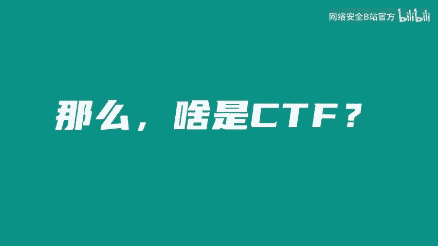
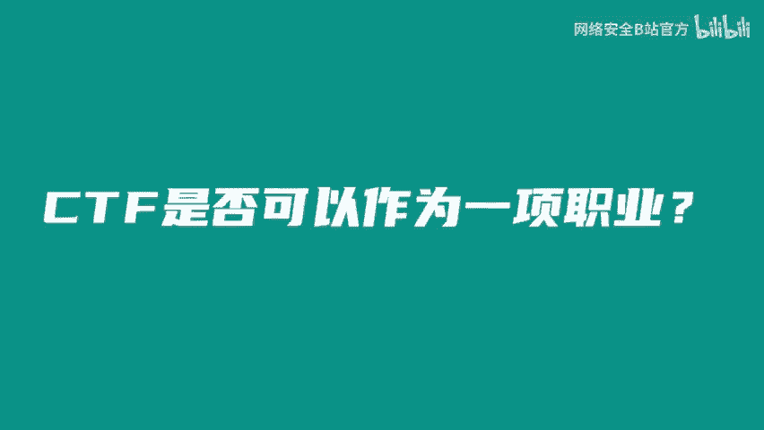
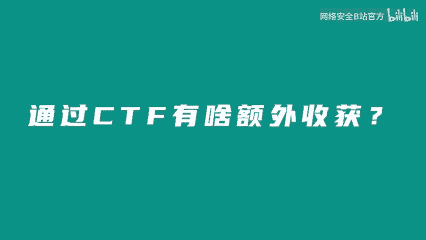

# 2023网络安全CTF全套学习资料（CTF夺旗赛、核心真题解析、CTF综合测试训练、项目实战解析） - P1：关于CTF大佬那些事 - 网络安全B站官方 - BV17x4y1X7H5

🎼我本科的时候呢就经济独立了，可以很早的实现一个干饭自由。🎼可以说别人的大学都是在学校里面上课，但是我们的大学生活就是在各地的旅游。🎼我认识了我的研究生导师呃，朱葛建伟老师。

后面成功考研到了清华大学网研院。

🎼特是可以帮我到QQ币吗？是不是可以定位我女朋友手机在哪里，是不是可以瞬间让网站变黑的那帮人？😊，🎼网了安全，是不是想窃听我的手机？🎼别老天天看我的购买记录了，我的购物车里边没有东西了。😡，🎼CTF。

🎼哦，是韩山让人打的那个吗？是不是动不动，就蓝屏的那个。😡，🎼听听CTg怎么说。😊，🎼大家好，我叫大雄。现在在无痕实验室之前待过一些战队，比如rce red barTD蓝莲花。🎼嗯。

作为一个CTF的老赛问，CTF给我带来的收获还是不少的。不管是在保研还是就职方面，丰富的大赛经验总是给可以给你一些加分，让你不至于倒在第一轮简历筛选上。🎼大家好，我是来自北京邮电大学天梭站队的队长贝尔。

然后现在在自疗跳动无魂实验室实习，主要是负责南军方向。🎼嗯，对于我来说，当然是收获了很多的朋友，包括我自己所在队伍的队友，各大高校的师傅以及国内外各大公司的安全研究人员，能够得到他们的认可和信任。

也是对我的一种鼓励。嗯，大家好，我是来自这些跳动无痕实验室的恩妮，也是经济界百CTF的出题负责人，呃，也是第一次呢从幕后到前台来跟大家这样分享。呃，欢迎大家来找我线下PK啊。🎼首先收获的还是快乐吧。

然后跟队友一起解题，或者说是。🎼嗯，比赛获奖时候的一个成就感。🎼CTF是否可以作为一项职业？

🎼嗯，CTF确实是可以作为职业之一，毕竟现在也催生了一系列的产业链，养活了不少人。学生阶段我也是借助CTF培训的机会赚了一些零花钱。但就我个人而言，我更多的是将CTF当做一个兴趣爱好。

我更享受的是跟朋友一起解题的乐趣。对于我来说，CTF是入门安全行业的一个好的起点，它可以让你认识到更多志同道合的朋友，同时学习到更多前有用的知识，我理解CTF本身是不能作为一个职业的。

因为成为职业的话就会失去CTF本身的一些乐趣。我更多的是希望大家能够享受比赛本身的乐趣。🎼通过CTF有啥额外收获，首居一指的话肯定是公费旅游。借着CTF的东风，我在读书期间也换了不少地方。

体验了国内外不同的风土人情，去过几次日本迪拜，另外一个潜在的福利。呃，你的零花钱相对会比较宽裕。比下奖宾，再加上培训收入，读园期间自己玩的还是比较嗨的。😊。

🎼嗯，我觉得额Y福利便是安全行业对于你本人的认可，特别是现在越来越多的公司在招生安全人究人员的时候，会十分看重就是你的CTF的经历，这也提高了我们在求职道路上的一些竞争力。而且在找工作的时候。

越来越多的地方会直接的去联系你，避免了很多繁琐的步骤，简直就是一个招聘的直通车。