# 2023网络安全CTF全套学习资料（CTF夺旗赛、核心真题解析、CTF综合测试训练、项目实战解析） - P27：61.61.二进制2 - 网络安全B站官方 - BV17x4y1X7H5

大家好，今天我们来学习一下GTF中艾定制相关的两个知识。

说完战争，我们来说一下逆向里面使用的工具，包括PIDPID可以用来去检测我们的。我们的程序。用什么样子的用什么样子的形式去域成编程了，这也会进行一个显示，然后它也会。给你显示出MG point这种东西。

然后另外一个就是IDA pro。IDA pro的话是一个。神器，但是我们基本上都还是使用啊那个破解版。首先上面是它的工具栏，各种各样的一个呃。一个功能。然后第二个是它的文件地址打航带。

这一个可以在点击任何一个地方去到文件的一任何任意地方。然后这边常用的一个函数表，因为我们可以看到整个。程序里面的函数。反编反馈编制后的一个函数，然后函数图。这个是当前函数的一个流程图。然后还有就是。

type对应的内容。这里有很多个tab。然后我们当前的t叫做IDA view。A这一个这个t呢啊。可以显示成像这一个。这个就是我们谈。函数的流程图，如果按一下空格的话，它就会变成我们的背面代码。

然后这一个平实度A其实就是啊我们在按了F5之后，由IDA所生成的一个呃。类似于伪代码的一个呃代码，当前当前函数的一个伪代码，可以更方便我们去阅读。因为下面的话就是一个输出窗口，然后还有一个函数窗口。

函数窗口呢我们可以用python或者说C去呃进行一些简单的一些脚本编程，然后去达到帮助我们分析程序的一个。效果。另外一个就是呃OD buggO bugg。是一个跟ID不一样。

它是一个呃动态的一个纯动态的一个啊调试工具。专门用来调试windows里面的一个windows下的一些程序。啊。首先前面这一块呢也是它的那个功能栏，然后这一块是汇编窗口，然后信息窗口。计尘器窗口。

我们刚才说的对战，大概这有一个对战窗口，而这里就是内存里面的窗口。然后下面的命令啊，就是我们可以输入各种命令来代替我们啊用鼠标去点击。然后其实在很多高手来说啊，命令是非常有用的。

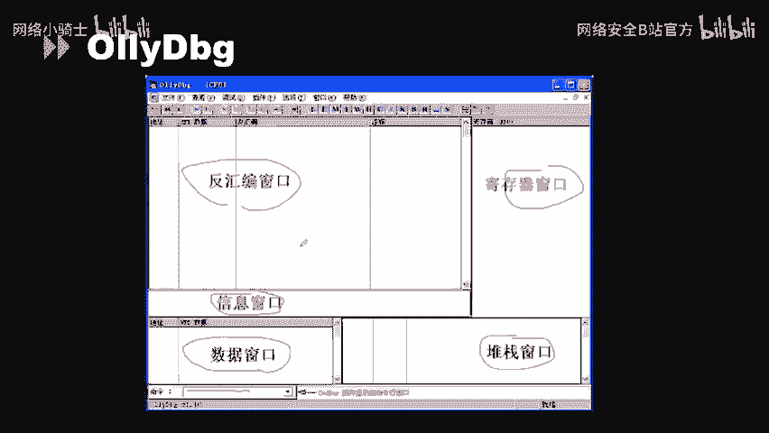

整个立项的流程啊，其实就分为这么几步啊。第一个啊是识别程序，我要识别程序是什么样子的？啊，一个。程序它是C语言的，还是C加加的，还是一个啊点net，或者说一个呃。1个VB的一个程序。针对不同的程序。

我们可能会对不同的就是说不同程序有不同不同的啊调试方式。然后另外的话就是啊静态 string得到关键字符串。因为我们在打开一个程序的时候，通常会有一些啊提示，像什么input什么之类的。啊。

input your key，input your back之类的，这些都是一个关键字，或者说是成功或者失败的关键字。像啊congratulations you are。啊，you are win这些。

啊，东西都是一个关键字符串。我们可以通过这些关键字符串去定位我们。关键的一个函数。然后有时候是有时候我们关键的个算是有点考，我们关键的时候是有点考。然后我们需要啊去将它改成啊unic口形式的。

然后我们啊如果说啊。在逆向的时在静态的时候，我们可能还看不太清楚它的逻辑，我们就可能要大大致的运行一下，找一下啊有没有其他一些关键的字符串，或者说大致的功能去辅助我们去静态分析。

辅助我们接下来的静态分析。然后还是关键字符串，然后顺序崩了。然后就是呃利用按照它的运行顺序去找它的那个关键功能。如果前面四步都做不。都没有办法立想出这么这么个程序，我们得去进行一个动态分析。啊。

用OADbug或者IDA其实都可以用动开分析，然后还是找关键字串，然后从。然后关键串在内存里面的啊变化。然后还有啊根据我们的会面代码去猜测我们的算法，然后最后得到。得到整一个计算T的一个算法啊，立项。

计算得到一个fg。OK接下来我们看一个例子。

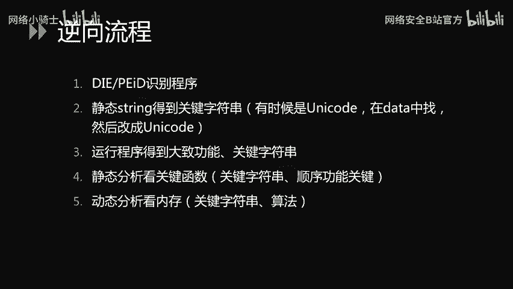

首先我们要做的是一个啊sample一的一个一个立向，我们先首先运行一下。提示give me thef，然后我们随便输一个Q串。然要返回一个错误。反馈个错误，然后我们就可以把呃进行一个立项了啊。

把这一个啊asseemble一放到IDA里面去。不是。我们可以看到这边打印一个good job，这边打印一个错误信息，然后。这种呢就是一个条件判断，条件判断testEX这一个从这在这里判断。

然后呃既然在这里判断的话，我们上面这一个函数就很可能就是一个关键的函数。然后我们F5看一下。再不看一下啊，wifi啊可以看到，其实就是我们打印呃打印。那个字符上信息的啊，就像这1个PB的flag。

这些都是用wifi去打印的。然后啊。这两个函数就是啊比较重要的一个函数了啊，我们看一下先看一下这个函数，这个函数呢呃有一个wifi file啊，然后有一个过滤。哎。

这个很明显就是呃将我们输入的东西读到啊内存里面去，读到内存里面去，然后过滤啊这个回车换行。然后我们就可以去啊改个按一下N，改一个名字。啊。因会。是吧。我们按一下。嗯。我们再看一下下面这一个啊函数。

这个函数。这函数呃很明显是一个呃关键的一个函数了，关键的一个函数啊，这里进行一个判断。对，然后呃这边是。一个呃for循环，for循环中间没有循环体，它只是进行一个I便利，然后返回一个I啊。

这个很明显就是一个长度。返回一个长度。返馈长度，然后这个呢。就是我们。所说的 input办法。都是按N去进行一个执行。然后。我们来看一下这一个。这一个是一个啊逻辑运算。这个逻辑运算的话呢。

我们待会儿啊我们这在这边可能计算有点复杂。那么我们待会用I呃OAbg去看一下，按一下X，我们返回到呃我们弹出来这一个呃调用框，我们可以返回到上一步。也或者按前面的那一个呃箭头，我们就可以返回上一步了。

然后这一个我们待定。按一下那个斜杠，我们可以加一个标签，加一个备注。我们按灯去命名一下这个参数，就是类。这一个我们先把它设置为K。然后呢。

我们的一部buuffffer会跟T去进行一个啊一的一个对一个对应的一个。每个buuffer都会每个ber的值都会跟key进行一个抑货。优惑完之后放在一个啊time。time的数组里面time数组里面。

然后time数组跟这一个数组去进行一个对比。这个数组我们看看出来这是一个呃。这是一个。一一个已经写好的一个数组。然后这个数组的话呢，待会我们是需要使用的。然后啊长度这个数组的长度应该就是39。

应该就是39。然后这边也会给T一个负值啊，那么其实就是我们可以知。可以知道啊，我们整个顺序的一个流程啊，我们顺序的一个流程啊，这样子啊我们啊先把这一个啊40401000这一个啊内容就是P的值给拿到啊。

这个怎么拿呢？我们用灰 bug。

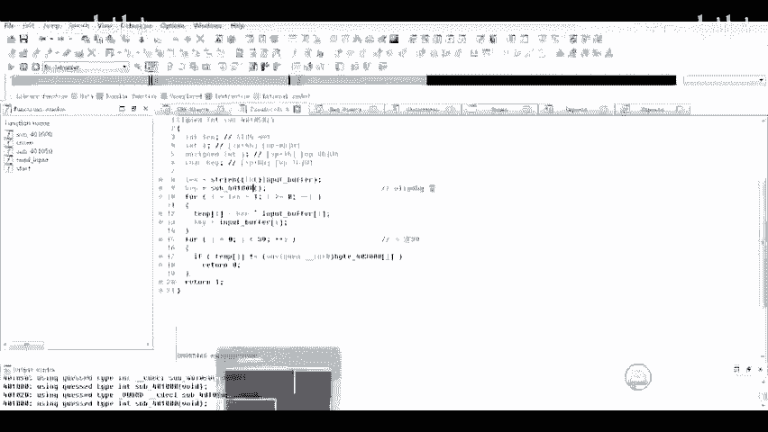

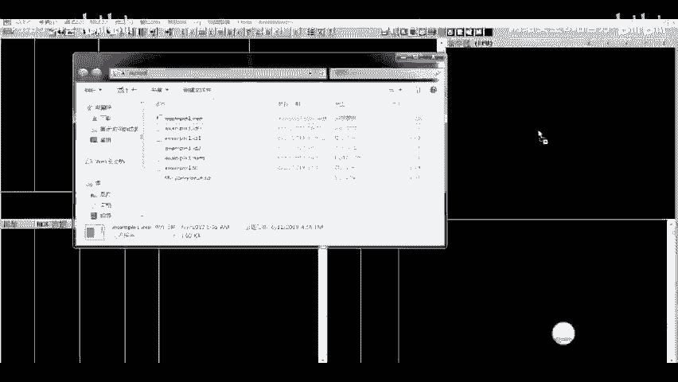

放进去。我首先来定位一下。看一下中文要。然后。me的。即系即。就这里，然后它会调用50这1个。然后。按F2下一个断点进去50，然后要用这1个401000啊，就是这一个我们下一个断点，再在下面下一个断点。

ok。因为这1个40100，我们刚才看到。

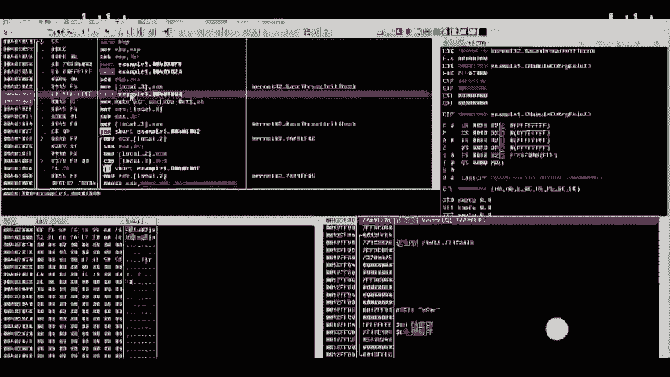

我们可以干。在这里看到它是这这么一个东西，这个东西呃，我我们还是看回那个汇编吧。这边点一下啊，我们来到这里我们来到这里。呃，这是它的流程图，然后我们按一下空格，然后回到我们的那个汇编。

我们可以看到它其实是一个比较固定的一个数字啊，对比较固定的数字去做啊一个。嗯，一个运算。然后所以我们可以直接。

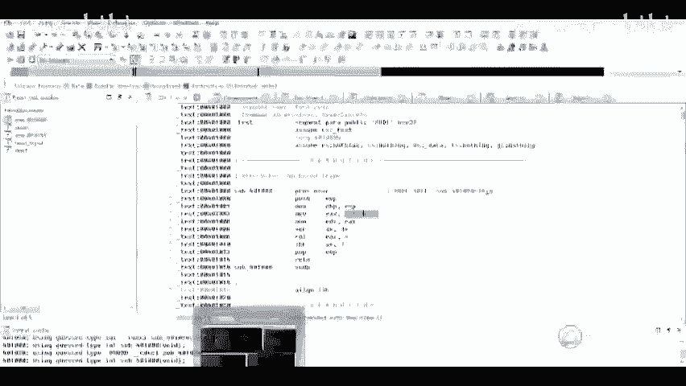

它每一个他每一个机子，它的运算都是一模一样的啊，所以我们就直接去看吧。他跟我们说有的东西没有任何关系。2346。O这里。啊，这里已经定下来了，然后我们按F7啊进。进去，然后F8啊一直一直走一直走一走啊。

走到这里。然到这里。啊，401000这一个啊，我们就不进去了，我们直接F。F8，我们认为F8，然后它的值会啊存到哪个地方，它的值。

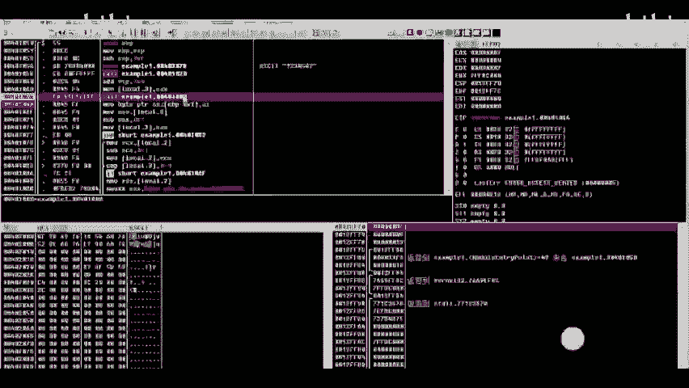

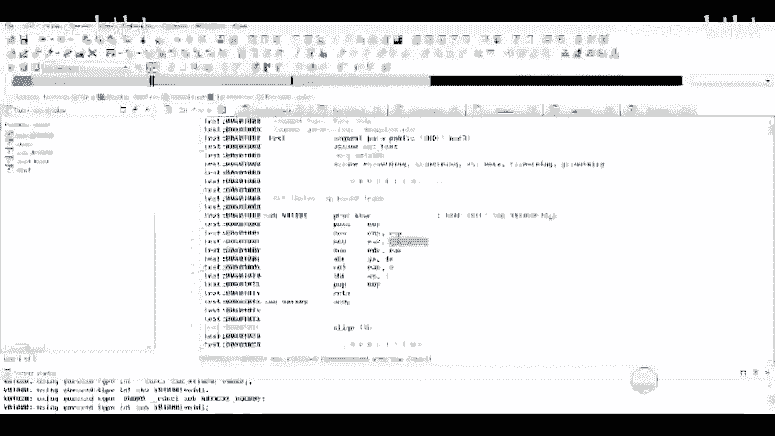

我们看到它的值返回值会存到EX里面。一直会存到EX里面啊，之前说站的时候也说过啊，就是啊1个004，因为它是一个啊它是返回后面的那1个AL的，它是返回后面的AL的。所以我们这一个是1个004。

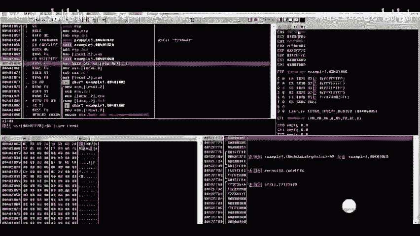

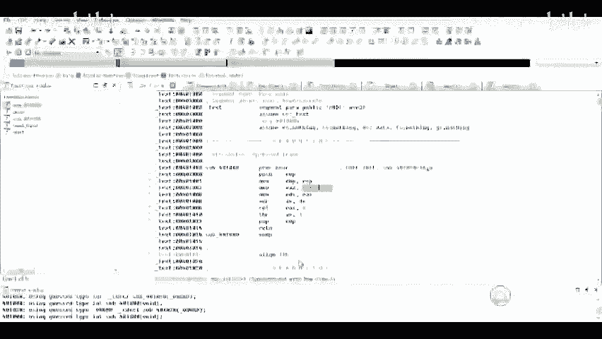

这里就是我们返回的AL，因为它这边是in16，int16其实就是AL啊，后面这后面是4位，后面这4个位。

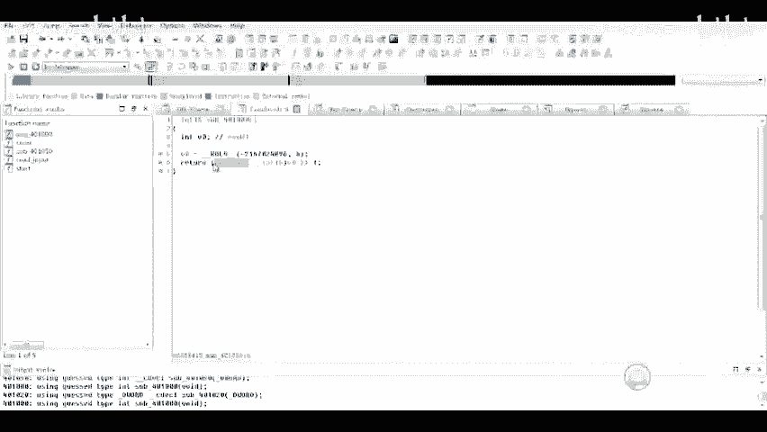

啊，返回就是004啊，就是T值等于4。这样子我们就可以进行一个啊编写，我们就可以进行我们的那个啊P的编写了。算法编写，然后我们来看一下。啊，我们的代码。

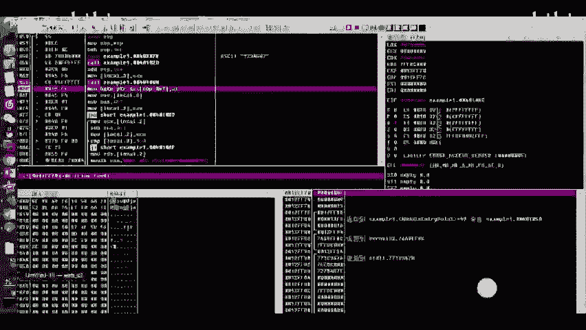

那看看我们代码。呃，这个就是我们刚才那个啊地方的那个值。

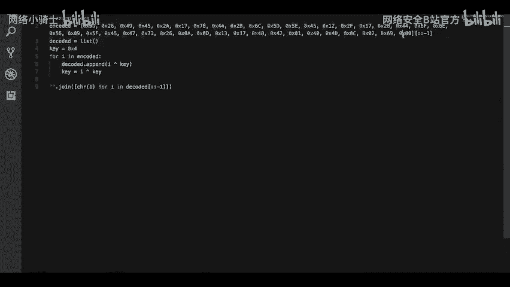

就是这一个数组的值。

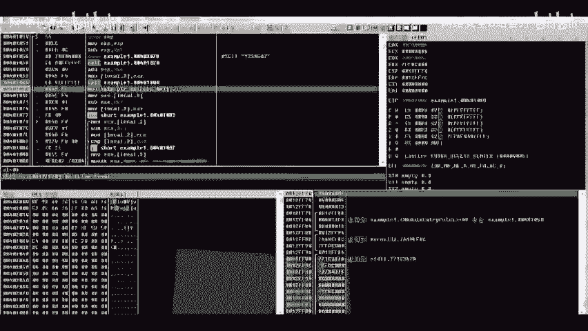

这个数字的值。我把它转换出来，转换出来成为一个数一个呃类。

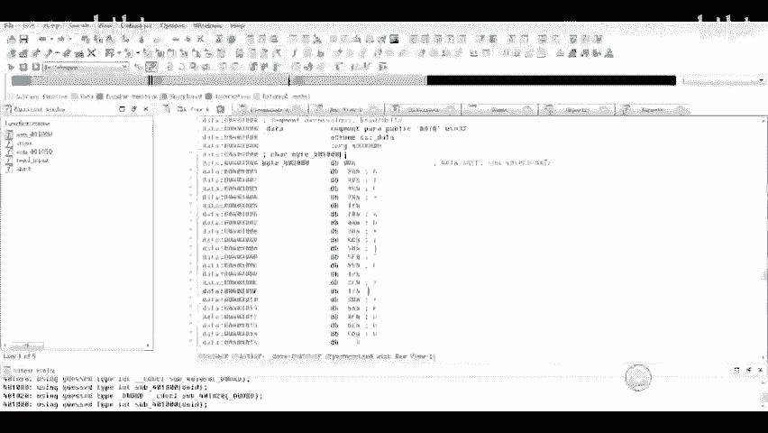

嗯换成一个例子，然后啊list这一个啊进行一个倒叙，倒叙完了之后我们就可以啊K为04，然后我们就可以进行一个啊。计算。So， of。II就是incode这每一位倒序之后的每一位。

然后进行跟key进行抑或，然后将key啊负值。负值的呃那个值呢就是这一个运算出来的那个值，然后得到K。呃，得到一个新的 key，然后再进行一个循环循直到循环完这一个encod为止。然后最后呢啊。

将encoding啊进行一个反叙。反叙之后啊，CHR得到。HHR然后它就会呃把它所有的所有的decoded里面的所有反序后的所有字。呃，内内容会转换成一个呃字符，然后呢也形成一个队列。

然后用呃这一个转去把它的队列给。啊。给打印出来。我们来直接来看一下python，我现在这个python的命令行格式命令行里面，然后我们看一下okK然后这一个就是我们的一个。

我们的最后得到的一个flag啊，当然flag是前面这一块前面这一块。前面这一块。这个就是我们的是。OK我们可以输入一下看一下。

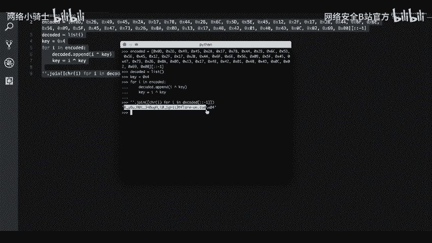

OK啊，我们的那一个fl是正确的。可以，这一道题啊就到此结束。

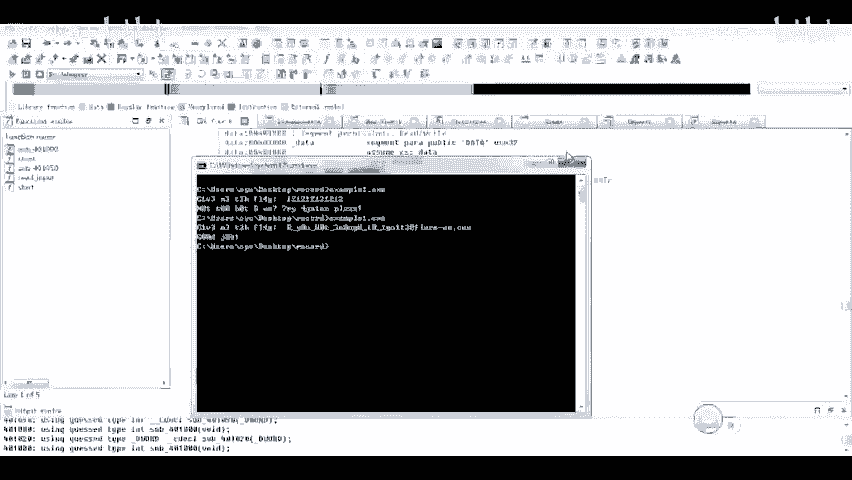

接下来我们会啊说一下胖。哼就所谓我们所谓的所谓的软件都洞利用，主要在lininux平台上面去进行考察。然后呢嗯它是通过漏洞啊，并且呃。进行利用脚本的编写。

然后get一个sha得到我们get shell之后可以进执行命令，然后得到flag啊，它的难点主要在于汇编语言比较复杂，然后那个知识点过于复杂，可能还会有很多知识点的结合利用。哼，我们来说一下那个呃。

战役出漏洞。首先程序在运行的时候，因为要呃保证它的程序需要去进行一个内存分配，分配一定大小的内存。然后啊像我我们在向内存空间里面写入超过这个所分配的大小的一个内存的时候啊。

那个内容的时候就会导致了覆盖就是覆盖啊所分，就是说所分配内容的那个内存，覆盖所分配啊内存。

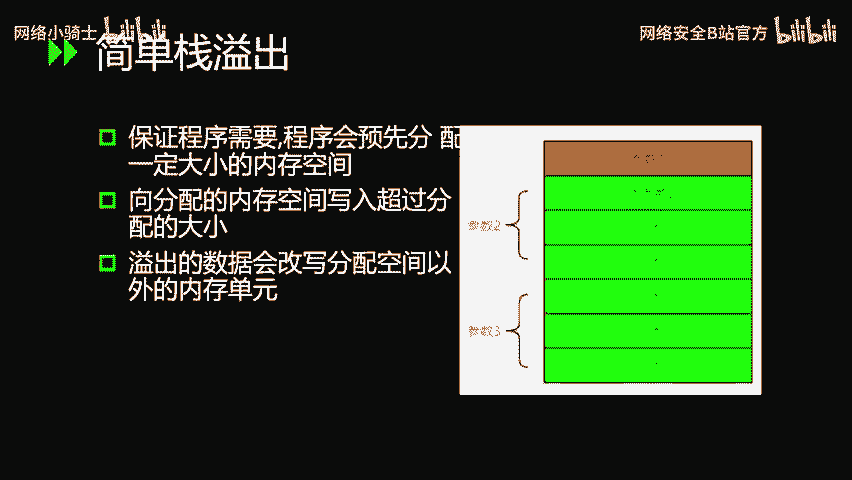

啊，以外的一个啊内存。啊，我们来拿这个东西举例啊，这里位的话啊。为的话为的1个256的1个字字段，但是啊字节256字节，然后啊报只有128，这样子就会产生一个啊战役出战役出。啊。

这种站一出的话呢啊就会覆盖了前面128位。呃128的那个buff啊buff的空间，然后。并且。也会覆盖到。这个函数的一个战争啊，我们之前也说过战争啊。

这个会覆盖到呃那个EBP也会覆盖到的weturnATDR。这种情况下，我如果我们覆盖了wetturn ADR啊。

这个retturn ADR就会呃导致程序在运行完这个waable function之后啊从。跟着那个bitADR跳到我们的我们指定的一个销扣里面去。这个销扣啊是我们自己放到内存里面去的。

而这个销扣我们可以直。呃，执行任意的任何的命令。执行任何的命令，我们可以实现任何我们想要实现的内容啊，只要它的那个啊程序的那个就是说我们存放销扣的空间是足够的，我们都可以去进行一个销。

就是说很庞大的销扣编写都可以。

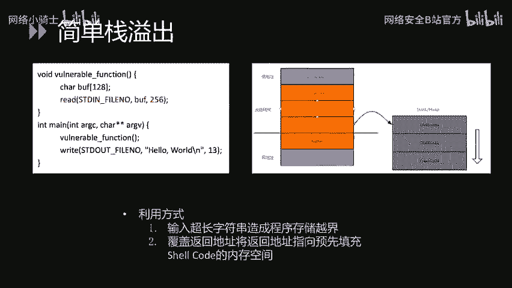

而在limimux里面啊，通常会对啊那个程序进行一个保护啊，最常见的是NS，还有PIEPIE啊，这两个啊NS的话就是啊程序在。可。可执行上面做了一个限制，可执行可执行可可写啊做了一个限制。我写的内存。

我可我可以写的内存，然后那个内存是不可执行的。如果说啊我。我不可写的内存，那个内存是可以执行的，就是说写和执行权限只选其一。然后另外一个就是PIEPIE就是认啊地址变化地址变化。我每一次运行内存的时候。

它的地址都会产生一。一定的变化，这就是PIE。

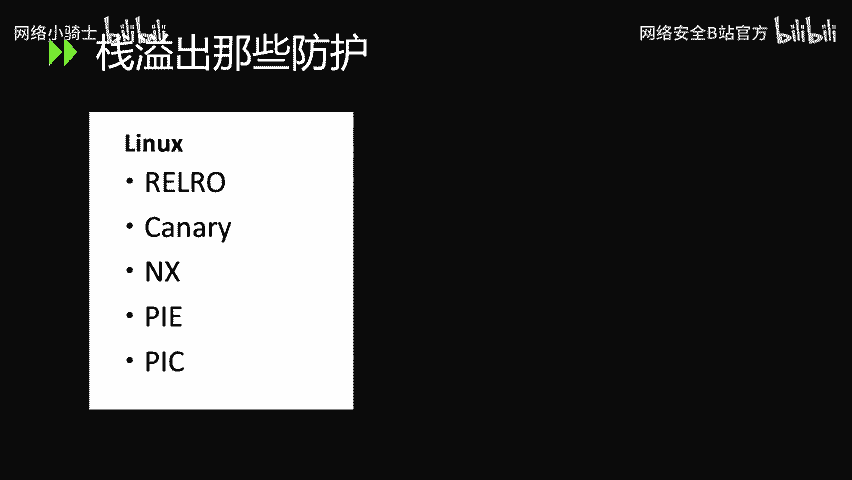

绕过这一个绕过绕过这一个内容呢啊可以通过LOP或者啊return toIBC lipsacy啊这。这个技术来实现。我们啊。来看一下。

其实它的其实它是啊利用系统本身的那个啊就是说程序本身的一个代码去进行一个执行，而不是我们自己写入销扣。如果我们自己写入销扣就没有办法啊，就因为有Nex的存在。那个东西就没有办法去执行啊。

所以我们啊需要去。利用程序里面原有的一些东西。我们首先来看一下这个右边的这幅图啊，这幅图啊其实就是啊buffer里面填入了AA，然后在return address里面就填用一个stem啊，这一个的话。

我们就到时候这个函数执行完之后，它就会转到stem systemtem里面去。那stem啊，你也要构造一个战争量啊，然后sstem systemem的啊。

system后面它就会啊再填一个return address，这个dress啊随便放啊随便放，然后啊再填一个binSH的一个指针。然后这时候啊我们执行啊stem的时候。

它就会把啊beSH当成是它的参数去执行这个stem。所以啊它的整个步骤其实就是一个伪造函数啊，调用站的一个啊步骤。伪造函数调用站的一个步骤，然后去执行我们的那个啊get shell的一个。啊，一个流程。

接下来我们会呃看一个样例程序。

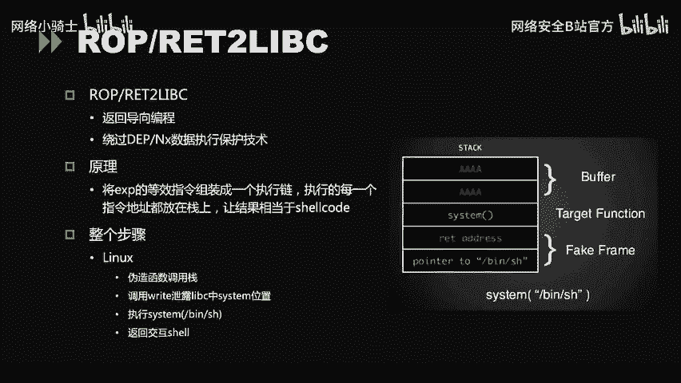

我们首先来看一下这个胖一。创一啊，我们把它放到IDA里面去。

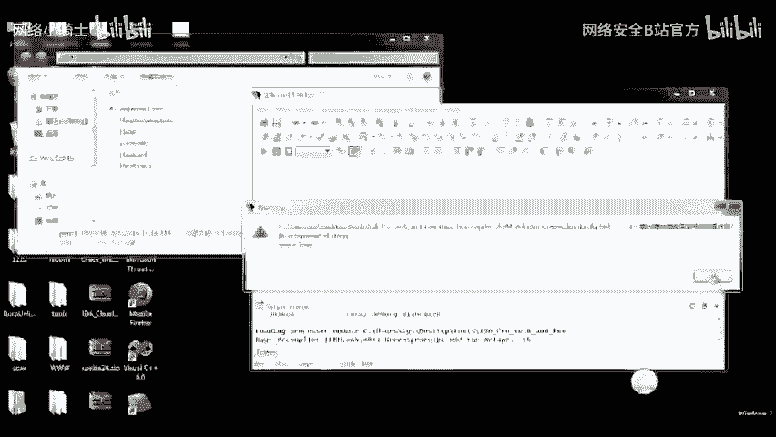

它是1个386的，就是说我们的32位了，我们看一下。m函数里面啊，前面我都不用看，我看到这里这里面有个winner吧winner啊，这里面就是一个典型的一个。这一出点击的一个站一出上面buff的大小。

buff大小1C，然后这。这里的话啊50。转换是32932。033这个就很明显有那个呃。有那个啊战一出。然后我们来再来看一下啊，这一个函数呢啊它还有一个sshall函数，这边还有shall函数。

这个shall呢啊已经有一个stem并SH的命令在了这个shall函数是那个呃胖那个胖的。啊，那个作者。就降低这条这道题的难度啊，写了一个shall在里面。然后这个shall的地址我们来看一下。

我来看一下，这点击一下sll。然后双击一下下，然后来到这里，然后点点击一下空格啊，我们看到啊80。0804851D哎，这个地址这个地址是比较关键的一个地址啊。然后我们啊把这一我们再来到我们的32位的。

啊系统系咩？

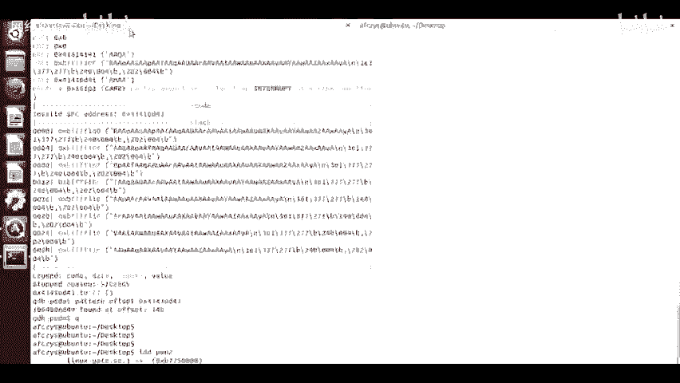

去干这么一个。去弄这么一个胖。啊，我们在桌面上面，首先是先要加。看一下。杠一啊这是4用到。我们随便输入字符。运行一下随便输入之符。哎。方案程序错误了。

这边有secondment for seven station fault啊，这个就是一要战役出啊，导致程序动快。然后我们用GDB来调吧。OK因为我装了一个叫做pada的插件，大家可以去装一下。

然后我们首先是啊。对。V u l n。然后在break里面去啊。就下了个断点，然后我们先。诶。诶。然后选一个。100。然后它会生成一个字符串自助串。内度上，然后我们在。C。啊就是问那个程序，然后就到了。

啊，一个。一个点上面就是这一个是valentable里面的点，然后我们再吸一下。把刚才把刚才那一个记一下，就是从继续运行，然后。哦。然后把这个数字然后粘贴进来。OK然后再。

然后程序已经啊自动的往下去执行了，因为我下面是已经是没有断点的，已经这边啊。这边 stop stop vision  figure。这个东西，然后反正程序停止了嘛。

然后这边有1个啊EIPEIP我们已经复制，已经干掉了EIP。把EIP给替换了。那我们看一下。不是。呃，就是说我们32的时候，我们的站就可以就会溢出了啊就会溢出了。

然后啊这个就是我们的offset oneoff。然后我们需要填充啊，3前面填充32个位，然后再去填一个啊sll的那个sell函数的那个地址，然后它就会啊将sll。那个地址放到这这里EIP的地址来。

EIP的地址来，然后去执行一下OK我们来。试一下。

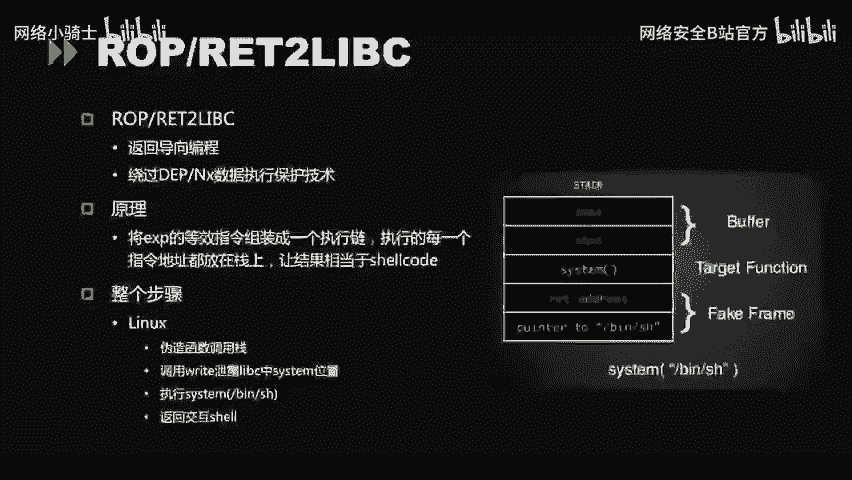

啊，我们已经写好了那么一个。函数啊，我们已经写好了这么一个呃。

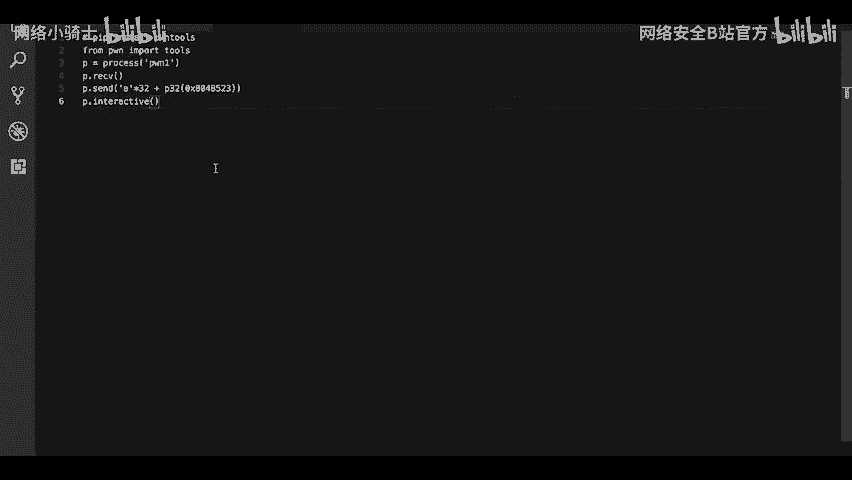

利用脚本啊，我们现在改一下，因为这一个啊。这个内容不太一样。我看一下，就这边。啊1地。51D，我们来把这一个。

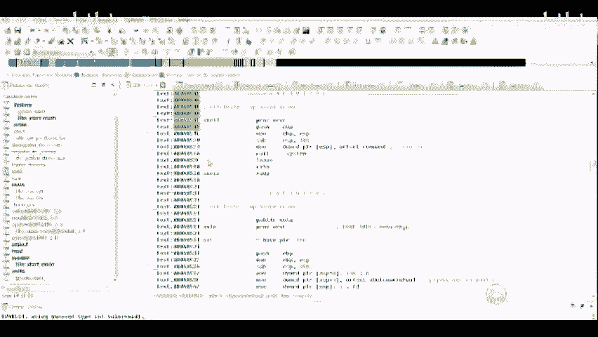

啊，这个是用到了那个p tools，大家可以用TIPinstore去进行一个安装。我怕一怕那个啥。

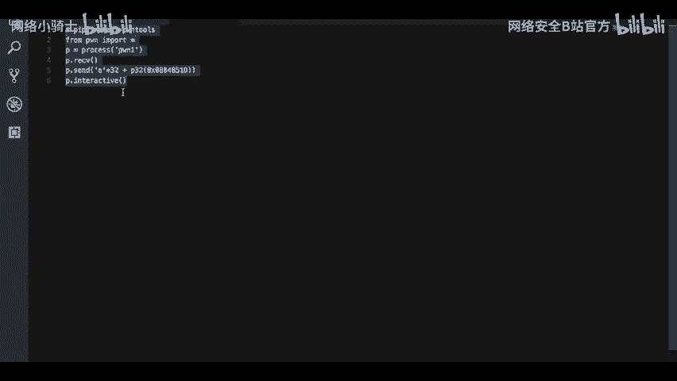

OK。已经运行了，这一个是本地的时候啊，如果是远程的时候，这里是remo加它的那个地址，就还有端口。然后啊然后说一。然后s我 send了过去了，然后再你个act。OK这就我就inlect就是啊。

进入一个交互的一个阶段。因为我已经执行了一个s一个sstem啊，BS action啊，没有就是一个shall。然后我这边我就啊进行inter，就进入了交互阶段，我们来看一下。OKI执行可以成功ID。

OK这边这边也执接成功。那么也就是说咱们这个part啊就成功的完成了。我们要啊进行一个。通常我们进入之后，我们就要看一下flag，看一下flag啊，通常都会有一个flag文件，我们开flag啊。

这边我应该是没因为我没有啊flag文件，所以这边也没有flag啊，大家。啊，可以自己去尝试一下。

