# 2023网络安全CTF全套学习资料（CTF夺旗赛、核心真题解析、CTF综合测试训练、项目实战解析） - P28：62.62.移动安全_1 - 网络安全B站官方 - BV17x4y1X7H5

大家好，本次课程为大家介绍CTF比赛中逆向部分的安卓逆向。安卓逆向其实在实际生产生活中应用广泛，比如VIP功能的破解，协议的破解。去广告等功能的实现，其实都是基于安卓逆向实现的。所以。

CTF比赛也把安卓逆向作为逆向的一个重要方向。

下面我会从以下三个方面介绍本次课程，分别是安卓开发逆向中用到的工具和CTF中常见的考点，以及安卓逆向部分。在安卓逆向部分会有题目实战演示操作。首先为大家介绍安卓开发部分。为什么要先讲安卓开发？

是因为反汇编APK文件后会生成各种文件，包括资源文件、清单文件、代码文件。你需要知道你关注的重点的东西在存在什么位置，这就需要知道文件的前生今世，下面先为大家介绍。SDK开发，也就是常说的java开发。

这里重点分析了最重要的文件。android mini first文件和。java可执行代码文件。清单文件是安卓开发的重要文件。

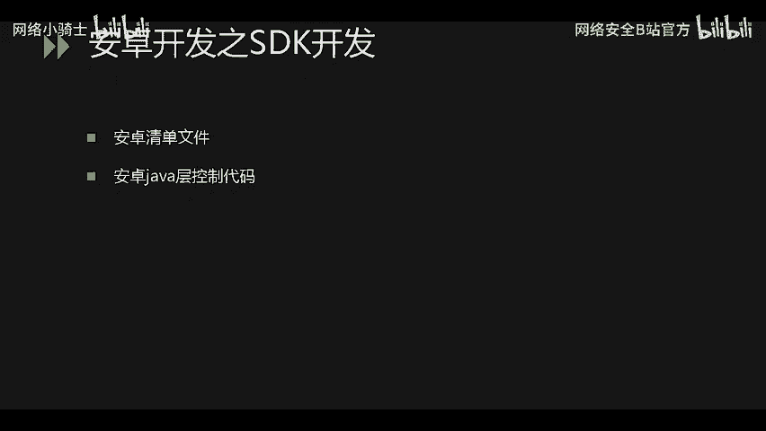

从图中可以看出。包括的有报名的信息，权限的声明，安装的时候，权限就来自此处权限申请。接下来就是代码入口等信息。逆向前后，此文件都存放在项目的根目录下面，不同的是编译后生成的文件是不可读的。

逆向的时候解析文件格式生成的开发者开发时代码的样子。

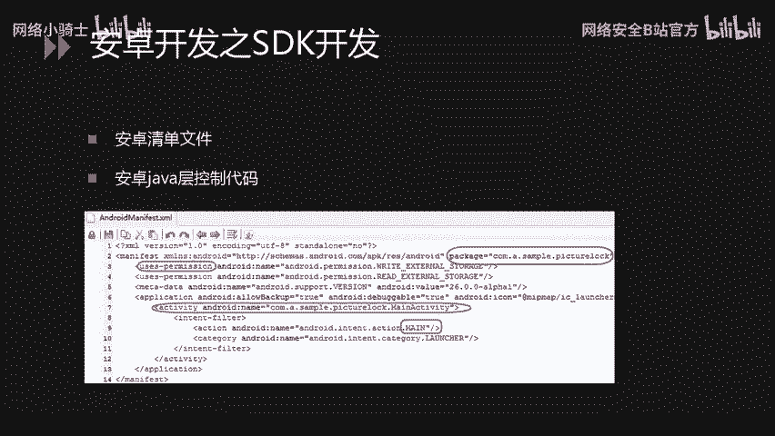

另外就是java控制代码，java代码编译后生成DEX可执行文件。同样，逆向时会解析DEX文件生成smily文件夹。smily文件夹中存放的是逆向出来的java代码，可以使用工具进行查看。

ABK文件格式本质上是一种压缩包的格式，使用解压软件打开，可以看到里面存放的文件。第一个是数据文件。不参与编译过程，不会进行操作，用于存放数据库一些。

重要的文件而IB文件是存放接下来会介绍的NTK中使用C语言或C加加语言编写的C代码编译生成的so文件存放在这里，也不参与编译过程。META。INF文件夹存放的是签名文件，里面存放了。

APK文件的一些签名信息RES和最后的resource点ARSC文件都是资源文件，包括字符串。还有控件的声明等信息的。文件。需要解析，不可以直接读取安roidmin first first文件。

就是清单文件里面存放的重要信息。DEX文件就是java代码编译生成的可执行文件。需要文件解析。然后使用工具进行查看。接下来介绍的是NDK开发。NDK开发是为了保护核心代码。因为SDK开发的java逆向。

获取言代码过于容易，而C语言逆向生成的。是汇编代码，会涩难懂会增加逆向难度。NDK开发使用了C或C加加进行编程。从左边的图片可以看出，是在java层进行声明和调用的。

system点load library是加载s文件。接下来是它的声明，加载搜文件的时候是没有LIB，但是存放在LIB目录下面的是完整的一个文件名。调用是在java层调用，安卓开发就介绍到这里。

接下来为大家介绍安卓逆向中需要用到的工具和分析CTF比赛中安卓逆向的考点。首先是最重要的反编译工具。这里给出了三种，实际上还有很多常用的。就。三种。

安卓 killererAPKIDE和JADX前两者集成了。逆向的很非常多的功能。最后。一个工具不提供反编译重打包的一个功能。阅读的时候。使用起来会方便一些。第二个是逆向分析的工具。

ID是逆向分析的重要工具。NDK是。生成的素文件使用IDA进行分析。十六进制编辑器。这里给出的是010editor。市面上还有的user edit。win hack等都可以。

16进制编制器主要用于查看文件是什么文件，确定本次逆向是什么方向的逆向。最后一个是root权限的安卓手机。主要用于动态调试，接下来是考点分析，包括初级、中级、高级CTF比赛也。也是从易到难的。首先。

最初级的包括资源文件备份文件中存放了flag的关键信息，或者直接存放flag。进进阶的话就是java层代码的逆向分析。纯java逆向编写程序即可获得flag终级。就是C语言代码的逆向分析。

需要阅读汇编代码，写出逆算法，获得flag动态调试。会有一些内存中的值需要动态调试来获取才可以。分析出逆算法，最高级的是。给应用程序加了市面上成熟的壳，那么首先就需要脱壳。

加壳了加了壳的程序是无法看到java层代码和。C层面的代码的最后一个虚拟机混淆技术。如果是脱壳之后查看到的。C代码仍然是经过虚拟机混淆技术进行混淆的，那么同样会极大的增加逆向难度。这里是常见的技术难点。

然后就是大家最。期望听到的安卓逆向部分。这里首先是静态分析，包括静态分析java层代码和加静态分析C语言层面的代码。直为大家演示。两个题目。第一个题目是纯分析java层代码获得flag。第二个。

是需要结合分析java层代码和C语言层面的代码，才能得到flag。

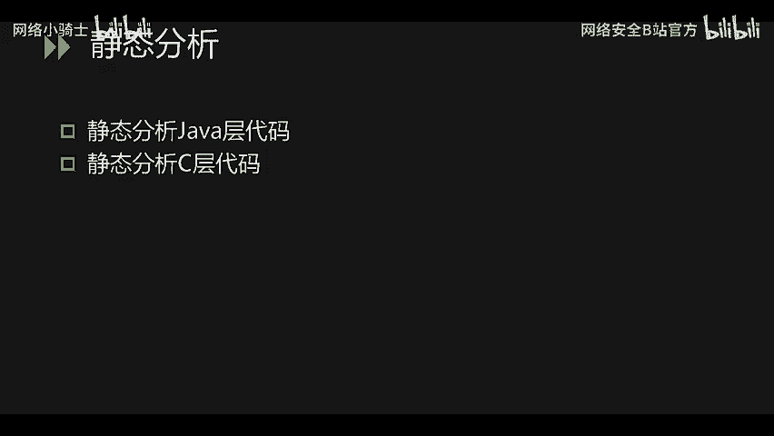

办方下发文件的时候是。题目的名字再加本次题目文件的哈希值，这里我没有留下哈希值。首先。我们使用十六进制。编辑器查看本次逆向是针对什么方向的逆向。

我们可以看到是以PK开头的，对应的是APK格式。其次包括and卓min first文件，说明是安卓方面的逆向。

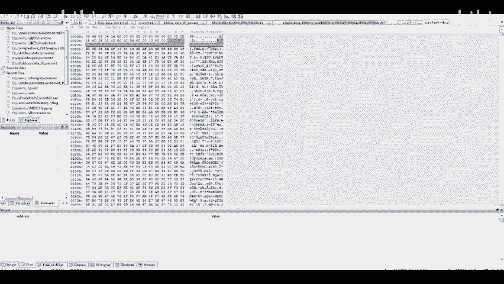

首先。把文文件的伪缀名。给出。然后打开APKIDE工具，这里是我刚刚打开的。为了节约反反编译的时间，把APK文件直接拖入即可。可以看到DEX文件在这里生成了smarly文件夹。

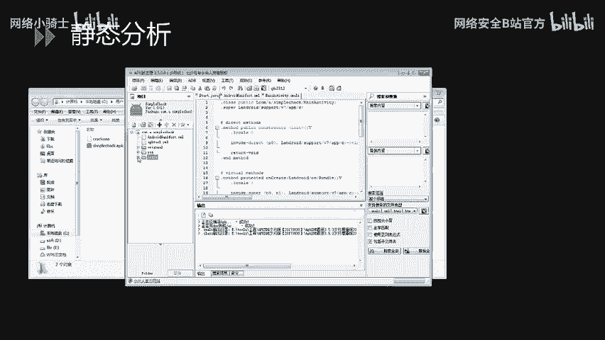

清单文件也是在这里。简单分析一下程序。包名是come点A点simple check。入口。在man activity中，这是它的主函数的声明。接下来我们就去看smarly文件夹，下面有一个。

安卓的包还有一个ca的包，安卓的包是一些依赖的包，是系统包。打开comm a，然后simple check可以找到代码，这里呈现的是smily语法。如果想查看java源码，打开。

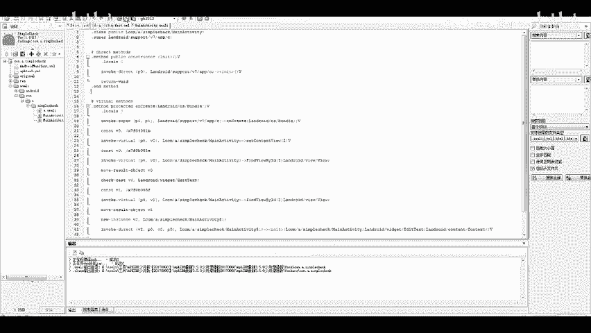

咖啡杯即可查看。

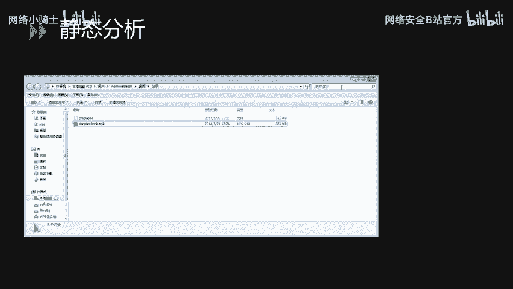

java源代码。打开以后，点开我们关心的。主函数发现是一个if的判断。如果判断。条件成功成功，那么我们就可以得到flag，否则的话提示失败。这里。A函数就是最重要的函数，我们点进去查看。发现。是一个。

函数最后返回值。决定了我们是否能得到flag，我们就需要。逆逆向分析慈算法。这里为了节约时间，大家有兴趣的可以自行查看。这里的条件实际上是解一个1元2次方程。那么我们直接把数组复制下来。

在C加加中编写解解密代码。注意类型是double，否则最后。输出的值不对。最后得到结果以后，进行输出运行此程序。即可得到本字flag。可以看到FLAG中括号的标志。

最后一位问号即为中括号大括号结束的标志。第一道题目就分析到这里。

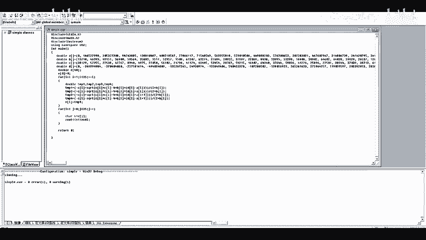

然后第二道题目同样的使使用十六进制编辑器查看。

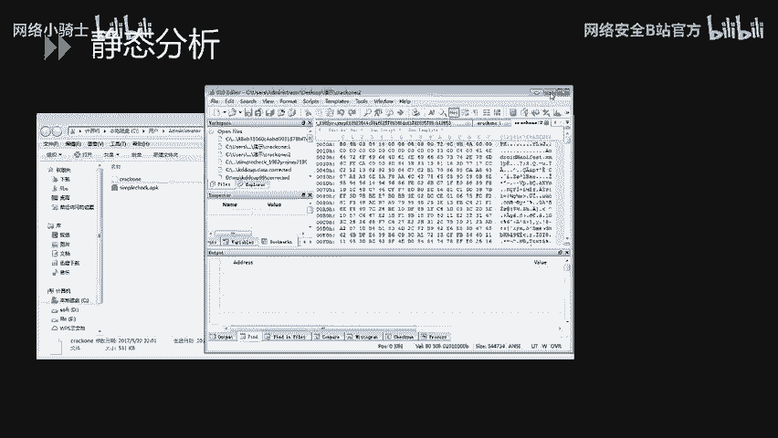

发现是以PK开头的同样的androidmin first。

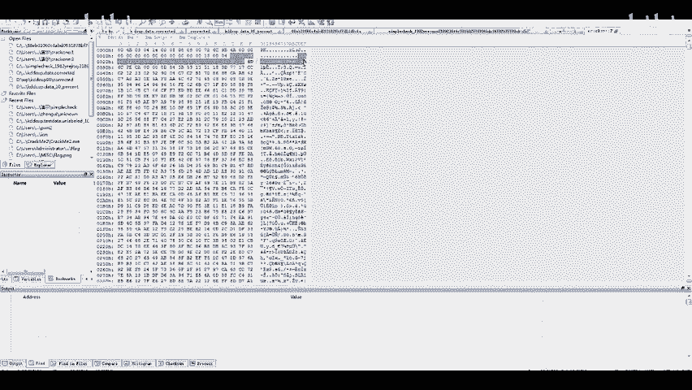

存在安卓的清单文件。确定是ABK格式文件后。修改伪缀名。这里使用另外1个JADX工具进行演示，在get help中可以找到之前的安卓 killerer和APK IDDE可以在无碍破解论坛中找到打开B目录有1个BAT。

把APK文件拖进。

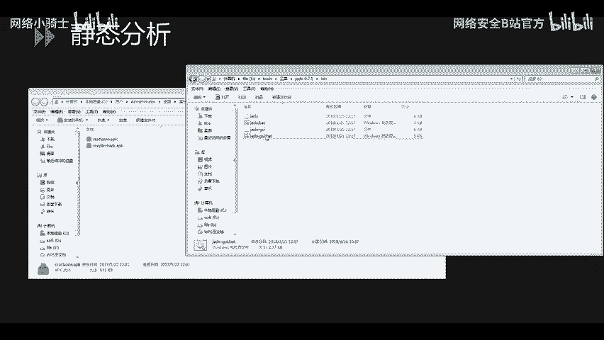

BAT文件中。

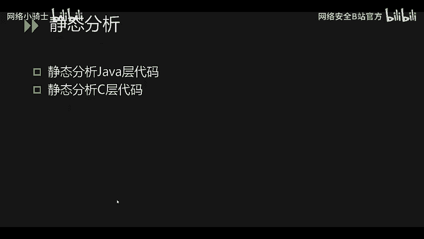

这里我们就得到了本次的源码资源文件和清单文件全部存放在resource目录下面，上面是代码。我们。可以先查看入口。知道入口是men activity以后，直接打开men activity。发现。

主函数安卓中每一个activity的入口是oncre的函数，这个无法进行混淆。可以注意到它这里加载了。ISCC的一个售文件。声明的话。可以看到native声明有native标志的声明在这里。

接下来最重要的核心代码部分，这里是先进行了b64的一个加密，获取了用户输入后进行了加密。紧接着。用check函数检查了输入。当然是使用base64加密之后进行的比对。接下来java代码的分析就到这里。

然后是。调用是s文件中的check函，check flag函数。所以我们需要去分析s文件。我们可以使用这里。反编译生成的。搜文件。

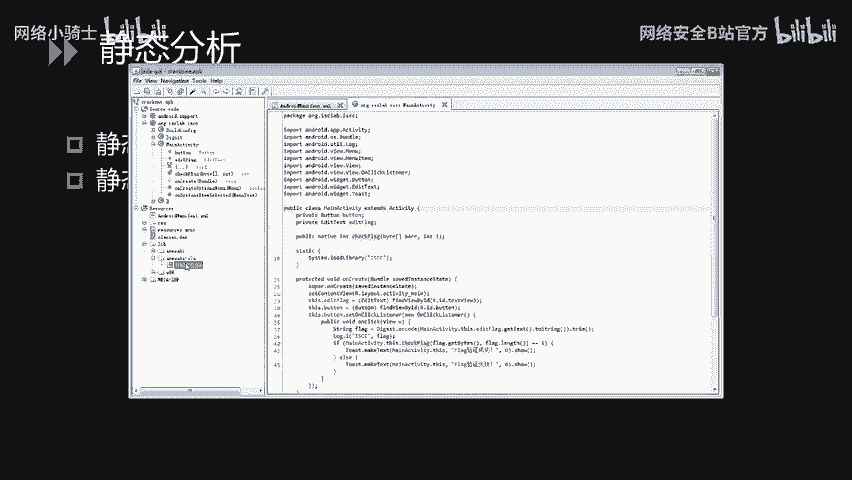

也可以直接用。

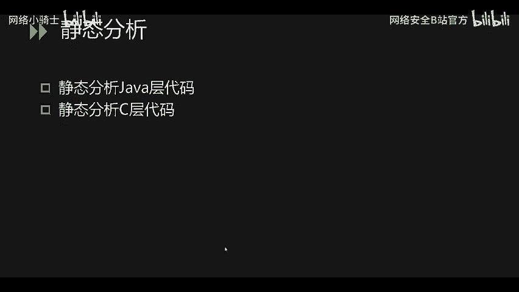

压缩包。压缩软件打开。APK文件提取搜文件。在LIB。

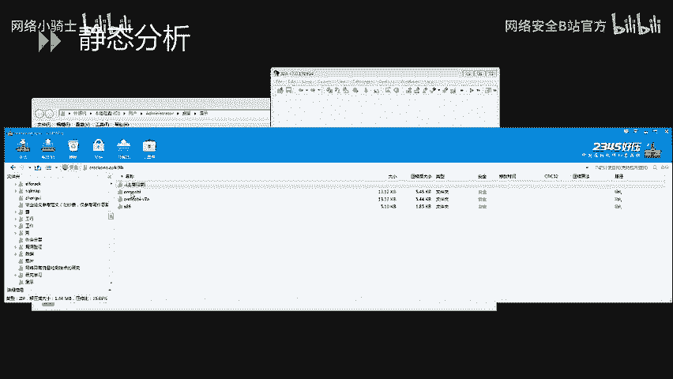

armV7的。上一层V7是引擎，引擎的型号，叉86是另外1个CPU平台。搜文件直接拖入IDA中。IDA是用于逆向分析的重要的代码分析工具，可以逆向。多平台的代码。

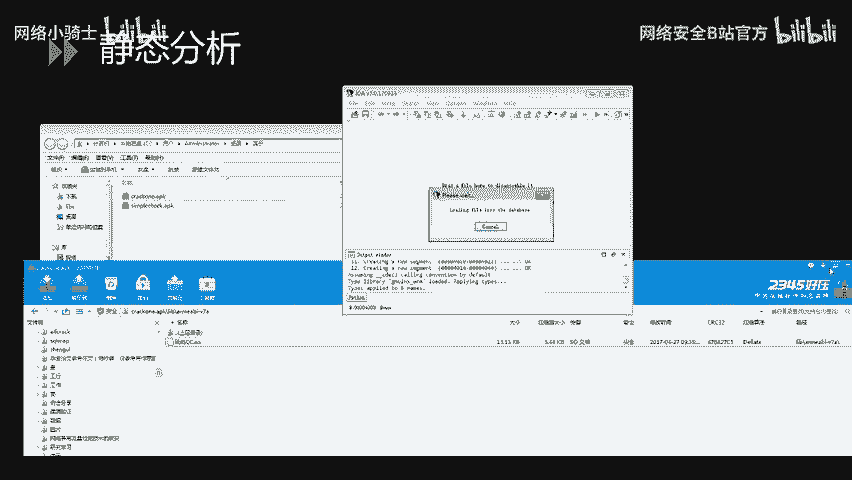

点击OK。打开以后，从左侧寻找check flag函数。按空格键。查看汇编代码。使用F5。键是一个把汇编语言转成。嗯，VC语言的一个插件是IDA支持的。

这里我们就可以看到check flag这个函数干了什么。仔细分析代码。首先进行java。to C也就是java调用C代码指针的修复。点击第一个参数。选择设置类型。修复为。大小写必须正确是JNIE大写。

然后NV小写星类型。修复完之后可以发现。有些函数的调用就可以。查看了。最核心的是。这个where循环。发现他是。把前后进行调序。把前面的每一个字符的。十十进制的值减5之后转成字符串，进行前后的一个调换。

调换结果和这个字符串进行比较，即为flag。分析出原理之后。我们编写。程序。把字符串复制到这里。导入。贝是64编码。计算字符串长度，把第一位和最后一位第二位倒数第二位全部进行位置调换之后。

得到新的字符串。因为。这两步操作实际上是完成了交换。所以这里进行交换，接下来写一个for循环，把。之前。这里进行减5操作的。字符串的值进行加5，最后进行背164的解码，调用de扣的解码函数运行此程序。

即可获得本次flag。第二题的演示到这里就结束了。

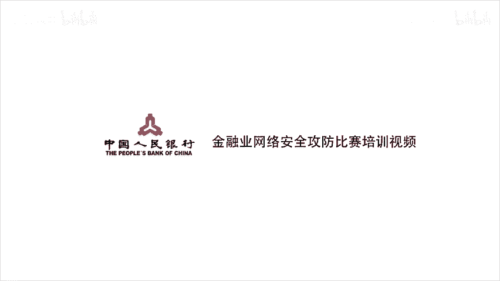