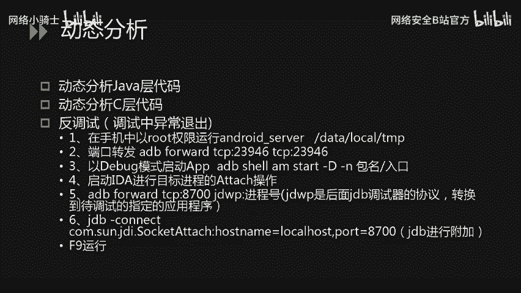
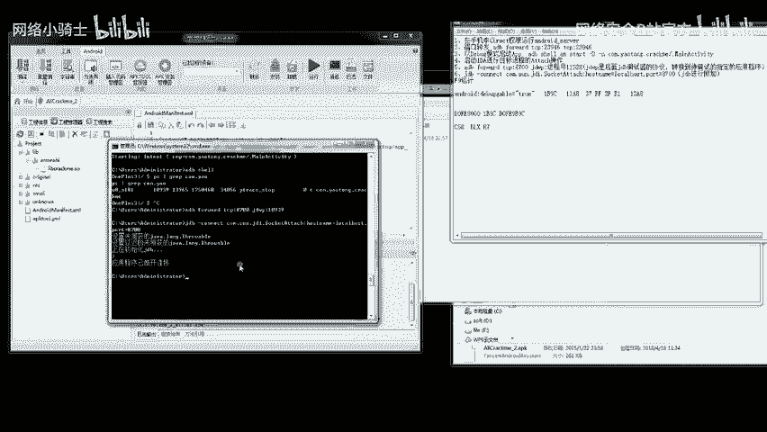
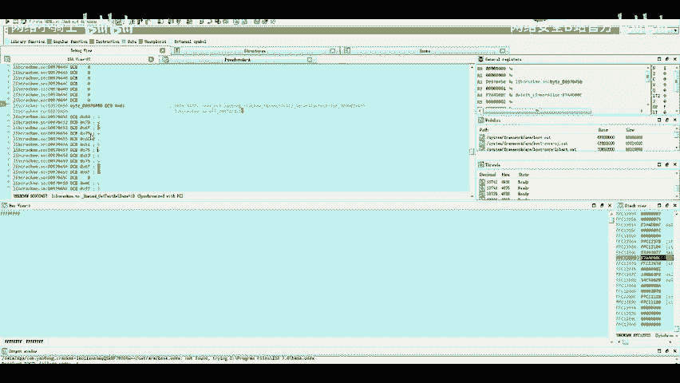
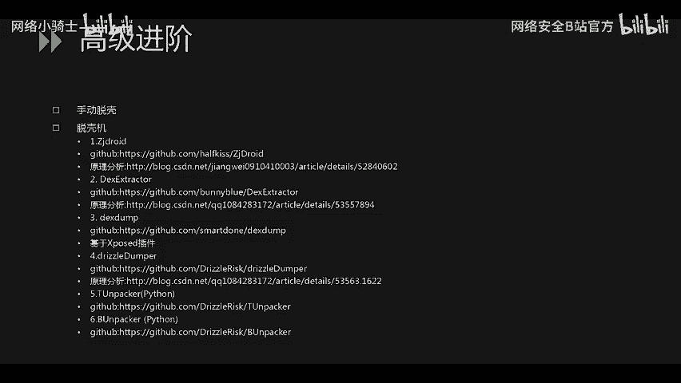

# 2023网络安全CTF全套学习资料（CTF夺旗赛、核心真题解析、CTF综合测试训练、项目实战解析） - P29：63.63.移动安全_2 - 网络安全B站官方 - BV17x4y1X7H5

大家好，本次课程为大家介绍CTF比赛中逆向部分的安卓逆向。

刚才介绍的两个题目的算法都是相对容易的，是为了方便演示。实际题目如果偏向。难的话会出AESDES等对称加密，这个时候需要拿到密钥，然后写算法，可能也会在算法中间或最后进行一些其他的操作。

才能获得flag。然后接下来。为大家讲解动态分析。这里需要动态调试代码，包括动态分析javajava层代码和动态分析C语言层面的代码。也会遇到反调试，在调试的过程中异常退出。

是因为它检测到你正在调试程序。这个就需要去掉调试或者挂起调试程序。以下66个步骤是调试的步骤。接下来在演示视视频中会一一对应。

首先第一个步骤是把IDA中目录下面的安卓 server调试文件放到手机的目录中。然后我这里是存放在手机的data local temp文件文件夹下面赋予可执行权限。然后第二步是开始端口转发。

把手机和电脑进行23946的端口通信，在手机端运行。刚才的可执行程序之后，会在23946进进端口进行监听，这里就需要把23946的数据转发到电脑端进行通信。第三。

开始以debug模式启动APP这里使用命令ADBsha aMstar杠D杠N报名加入口进行启动。第四步，启动IDA进行目标进程的atach操作。attoach程序以后，第五步进行。程序的附加。

也就是把程序。作为当前的调试程序，第五和六步都是进行此操作。接下来为大家演示动态调试。

最后一个题的介绍使用的是安卓 killerer。到目前为止，三种工具都给大家演示过了，把APK文件直接拖入其中就可以分析。然后这里首先编译当前的工程。为当前项目添加了。呃，右面记事本可以看到的。嗯。

安卓第bu个 able等于处的一个权限，就是让当前文件可调试。然后编译生成，也就是。大家想知道的重新打包。前两个工具都包括对它的签名和重达包，然后生成的APK文件使用命令安装到手机中。

这里的手机是root，有root权限的手机使用ADBinstore命令安装APK文件。安装可以看到这里安装成功，安装成功之后，使用AB share进入根目录下第一步执行。And卓roid server。

可执行文件。接下来。我们让程序。进入调试的状态。现在手机的界面是一个呃wait for debug的一个状态，然后远程进行attoach勾选这三个选项是让它停留在s文件加载之前，s文件加载非常早。

所以我们才必须与debug模式的。来启动这个文件。这里。呃，使用cttrol F搜索进程，找到嗯刚才APK文件的报名。我使用的是CRAcrack，就是最后带有带有特点的。

然后这里的嗯18010是它的附加ID一会儿也是需要转发进行附加的。接下来是稍等一下。第一次附加的时候一般会失败，因为它的停留在so之前并不会生效，需要重新设置IDA这是IDA的一个问题。

ADB shell进入。进入控制台，使用PS命令打印刚才的进程ID18010可以看到。如果是没记住的话，可以使用PS命令进行查看。然后。进行附加，把18010转发。最后就是。附加调试。

这里如果没有加调试权限的话，是会提示出错的。可执行以后，我发现已经ick就是左下角已经退出了code0，所以重新进行一次附加。我。调整设置的时候发现已经加载完了。所以。他才没有成功，我必须现在重新设置。

附加。第bu个 option把这两个勾选上OK之后再进行一次附加，attach to process。搜索进程controrl F进行搜索进程。这里先重新启动一下，因为进程要重启。18736。

然后转发18736到8700调试端口。这里看可以看到已经开始加载搜文件，这是系统的搜文件的加载。然后转发和调试完成以后，点击运行，一直运行到linker。这个搜文件加载的时候。

此时我们自己的搜文件就已经加载到内存中了，使用cttrol加S键调出所有。调用的库。然后记下带有可执行X权限的。的起始地址。D096C3个0，这是在内存的我们自己写的搜库的内存中的起始地址。

然后再打开1个IDA。静态分析和动态分析要结合。因为我现在要计算在s文件中。我写的那个函数的。地址在什么位置，然后去内内存中。把它射断点断下来。找到这个函数。发现他的文件偏移是11A8。

这个静态偏移是不能变的，但是动态调试每次的基制都会变，把这两个值相加以后就是。此时我写的最关键的这个函数，它在内存中的地址复制这个地址。按计件。复制跳转，然后设置F2设置断点。

在第一句STMFD就是内存压站出站的操作，这里设下断点。然后再点一次运行，程序就会断在这里。然后开始单部的调试。此时这里还是支持F5插件的运行，可以把汇编转成C的一个代码。

这里我们自己的搜库已经加载进来了，我点yes，然后。现在是按了F9运行到我刚刚设置的断点处，也就是最关键的函数。然后我点击F5，把它转成C代码。静态分析代码的时候。

已经知道此处的ve尔循环是我最关心的一个比对，它会从内存中提取一个值进行一位一位的比对。我只需要拿到内存中的那个值，所以我把程序运行到V尔循环处。这是会加载一些。其他的受苦。一直运行。

可以比对汇编和C代码之间的进度是保持一致的。我会在中间查看我现在在C代码中执行到哪一步。如果需要。呃，具体分析。某一处函数还需要。具体分析。我不断的查看CCCC代码中的运行的结果。

现在还没有到达V要循环，已已经运行到。一个中间的位置。在关键的点的时候就不能再继续运行下去，要停下来查看内存中的值。也就是我们想要的flag。这道题最核心的也也就是一个比对的过程。

但是它的值是从内存中提取的，我们输入的值直接就跟内存中的值进行比较。前面的java层和CC nativeso so层面的分析，这里就没有放出来。直接给大家演示怎么得到动态调试，得到内存中的一个值。

这里我在这里停下以后。发现。他把R2寄存器的值。传给R3。R2寄存器的值作为相对地址，然后取这个相对地址的值传给。R3R0进行同样的操作。我们在这附近就可以拿到flag，要慢一点进行。

如果说调试过去的话。就会导致已经出来的flag就不见了。这里把R一付给R3，都是从相对地值中取取的值。这里就是我们想要的flagR3计存器现在存的存放的值。我们可以直接跳转计算器。查看他现在此刻的值。

这里我我现在正在分析他。每一步的操作的汇编。还在观察到底需要查看哪一个值。这里我跳转到。跳转到寄存器的地址之后，发现了flag是存在这里的。只要把这个输值输入即可获得最终的flag。

本题解。解题就到这里，刚才为大家动态调试了1个APK程序，获得了flag值。这里最后一讲为大家。提供一些脱壳方面的思路。第一种是手动特壳，是肯定需要动态调试去运嗯去绕过很多反调试机制。

然后等到真正的程序加载到内存的时候，直接从内存中当不出程序，也就得到了把壳脱掉，得到了源代码。脱壳机的话，这里给出了。6种脱壳机ZZ draw这个是很老的一种脱壳机制。很大部分都是基于当普的方式。

第二种是模拟器。模拟器脱壳机的一个实现，它是修改了手机内核中。呃，加载。搜文件程序的那一部分，所以这个也可以实现。第三个是基于叉po的一个内存当普的一个程序。第四个是拖360的壳的一个。程序可执行文件。

这个是一个可执行文件，在手机中执行，然后运行程序就可以荡不出内存中的东西。第五个是。腾讯的壳的脱壳的一个程序，不过是之前的版本，作为考试的话，不会出最新的最新的壳去难为大家。

然后第六个是邦邦的壳的一个脱壳。嗯，第二种方式是可以解决。个人版的很多企业壳的一个东西。关于安卓逆向的介绍就到这里。

