# 2023网络安全CTF全套学习资料（CTF夺旗赛、核心真题解析、CTF综合测试训练、项目实战解析） - P6：5.6.CTF夺旗-SMB信息泄露 - 网络安全B站官方 - BV17x4y1X7H5

今天我们来学习SMB信息泄露，而最终通过SMB的新露信息获得主机的权限，最后提升主机的权限为root权限，取得对应的flag值。

那么咱们下面来介绍一下SMBSMB哎是servver message block的简写。它是呃一个通信协议，是由微软和英特啊，公司在1987年制定的呃一个网络协议，主要是作为微软网络的通信协议。

后来呃linux移植了SMB协议，哎，并且改换名称为SAMBA。那么咱们MSMB协议呃是基于TCPnet BIOS下的一般哎使用的端口号是139和445。咱们SMB哎协议是用来访问计算机资源的。

可以通过哎这个咱们分享对应的文件夹，打开SMB协议，远程计算机就可以通过该协议来下载对应的资源。也可以看到这里这张图哎，就表示咱们比如说有这样一个网络top扑。现在啊咱们这台计算机开放了SMB协议，哎。

并且开放了对应的共享。那么咱们另一台机器就可以通过哎这个网络哎来连接这台计算机，最后下载这台机上的资源。下面咱们来介绍一下今天的实验环境。首先呃是公积机使用卡利linuxIP地址是192。168。

253。12。咱靶场机器哎使用的是lininux系统，并且它的IP地址是192。168。253。17。那么咱们拿到这样一一个实验环境，该如何操作呢？首先哎咱们一定要想到。

咱们最终的目的是为了获取拔唱机器上flag值。也就是说，咱们要不择手段去获取拔唱权限，得到flag值。咱们拿到这样一个靶场IP之后，咱们首先第一步要进行对应的信息探测。

也就是哎对这个靶场机器进行对应的扫描，探测靶场机器上所开放的服务寻找。机器上的弱点。其实咱们渗透哎就是针对靶场机器上开放的服务进行漏洞探测，然后哎发送对应的数据包，获取靶场机器的最高权限。

下面哎咱们使用M map来探测一下咱靶唱机器上开放的服务。首先是M map之后，哎加上杠小S打V这样一个参数，表示探测服务信息之后加上靶场的IP地址。

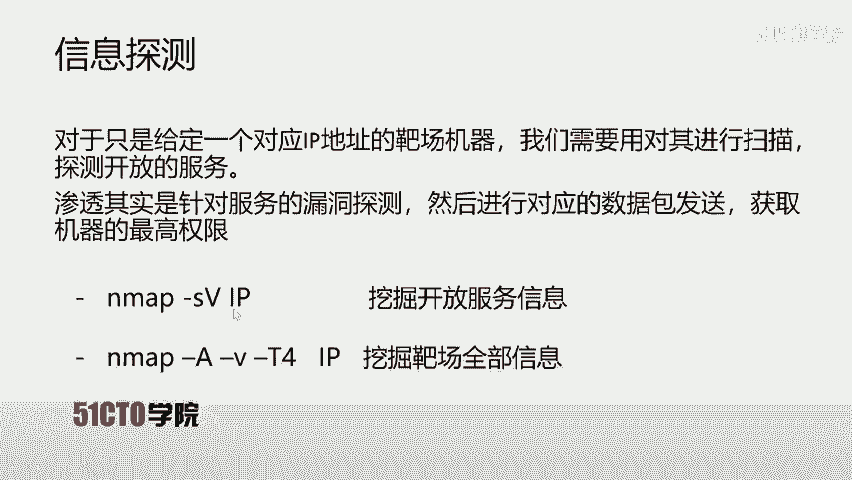

咱们下面来操作。首先哎咱们进入系统输入N map之后，杠小S大V哎之后是。

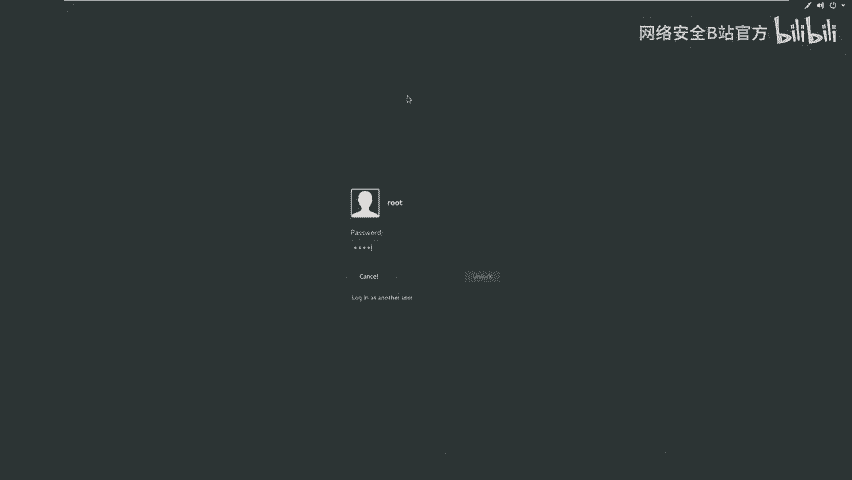

IP地址。253。17，哎，这是咱们靶场的IP地址回撤。这个时候哎，咱们N map开始对靶场地址进行对应的探测。呃，可以看到哎，咱们这个N map其实是在后台发送大量数据包，哎。

并把这个数据包发送给咱们这个靶场地址。之后靶厂会返回对应的啊这个信息，信息返回之后，nm啊会以它标准的输出，将这些信息输出到哎它的这个界面上。

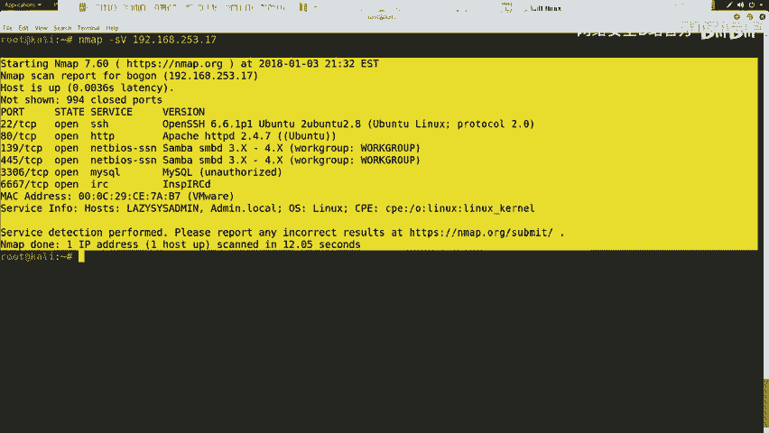

咱们除了哎可以探测靶场开放的服务信息之外，还可以哎使用这个其他命令来探测靶场的全部信息。比如说咱们这里使用杠大A表示探测所有信息。杠小V表示把探测信息详细输出之后，杠大T4表示N map使用最大线程数。

也就是使用最快速的N map扫描来扫描咱们对应的靶场IP地址。

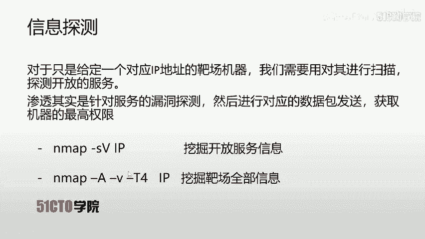

下面咱们来操作。

首先输M map。Nm之后，杠大A杠V杠T4之后是IP地址。253。17回撤。

那么咱们这时候哎N map开始快速发送大量数据报来探测靶厂机器的全部信息。

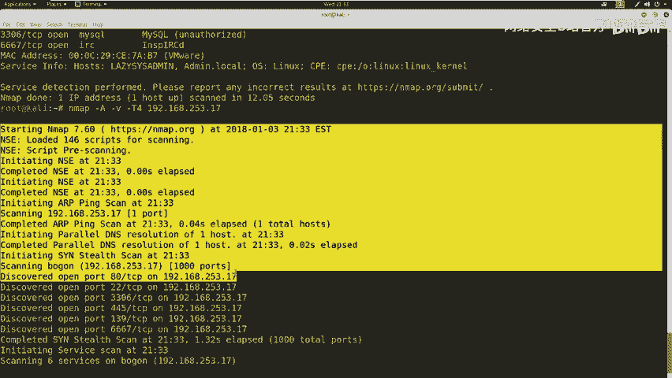

比如说咱们开放的哎这个端口号以及端口号哎对应的一些服务。哎，我们现在正在看哎，他现在正在探测开放的服务信息。并且还正在初始化这个脚本探测脚本。可以看到咱们很快速的哎探测出对应的信息。

并且哎对每一个服务进行了很详细的这样一个探测。我们向下看哎，也可以看到呃会有一些路由信息，以及它的这个后期把这个扫描结果保存在哪里。

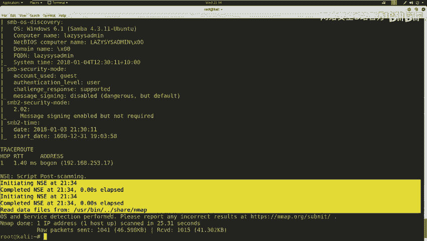

我们在探测完这些信息之后，哎，是需要对探测信息进行对应的分析，哎，分析出内部可以使用的啊一些信息来进入系统。首先哎咱们介绍一下这个服务和端口的这个对应关系。咱们计算机哎，这个服务是用来通信。

为了哎这个每个计算机上都有多个服务，那么咱们就需要开放不同的服务哎口，让不同计算机连接该计算机的哎这个服务。那么咱们这时候计算机虚拟出一个端口来用来进行通信，表示呃咱们不同服务哎，有着不同端口。

两个计算机哎的服务连接表示是两个端口对应的连接来实现对应的通信。咱们常用的端口号有0到1023，表示哎咱们已经分配给固定哎这个服务的一个端口号。咱们在扫描过程中一定要注意一些特殊端口。

比如说咱们针对哎这个开放啊大端口的这个HTTP服务哎进行对应的排查，查看啊它是否具有一定的隐藏信息。咱们只需要使用浏览器，打开这个HTTP页面就可以。

今天呢哎咱们针对一下刚才扫描到的SMB哎协议进行弱点分析。首先咱们回到哎刚才的结果，看是否开放SMB协议。我们可以哎在它后期的哎扫描过程中会发现。

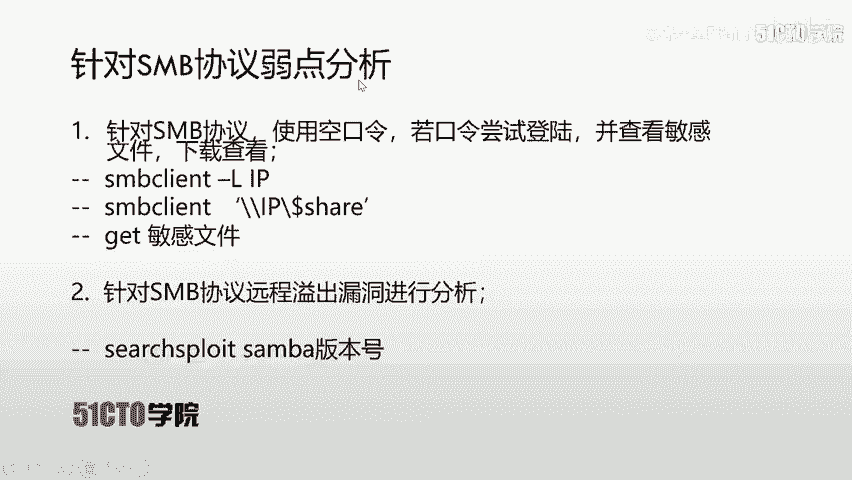

呃，在这里哎它开放了1个SMB服务，我们向上看也可以。可在这里哎看到139和445哎这两个端口，并且哎它的这个服务版本也被看到以及它的工作组。所以说啊我们通过以上扫描结果。

会发现该靶场机器开放了SMB服务。

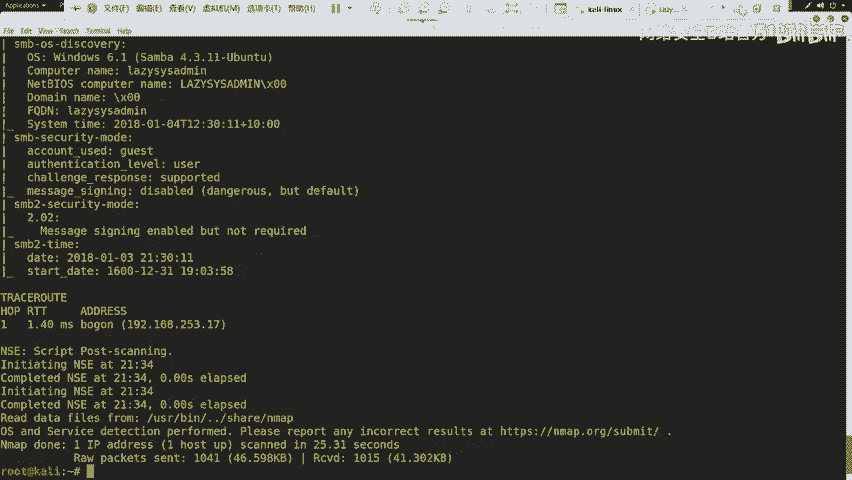

我们针对SMB符哎，可以做以下弱点分析。第一，哎使用空口令。登录哎该SNB所分享的哎这个文件夹。如果哎咱们登录成功，哎，就可以查考对应这个敏感文件，哎，并且下载到本地哎这个机器上进行更深入的了解。

首先哎咱们可以使用到卡利当中的SMB client，然后加上杠大L表示列出该IP所分享的所有哎这个目录以及链接。咱们下面来查看一下今天把场机器上哎所共享的哎这些文件夹。

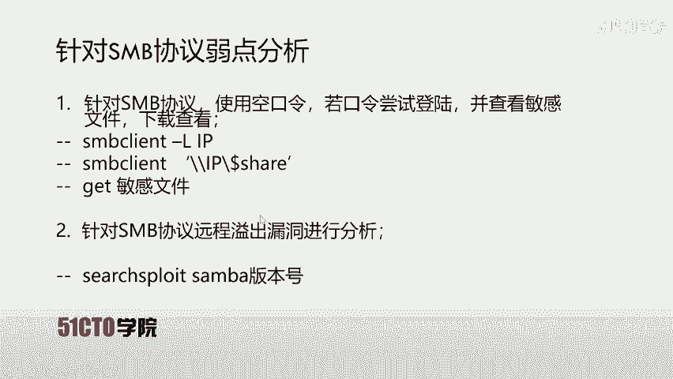

首先来输入SMB client杠打压的输IP地址。253。17回撤。这里哎他让咱们输入对应的密码，咱们使用空密码登录，直接回撤。会发现哎这时候给咱们返回了啊三个结果。

返回了一个print这样一个共享设备。啊，它是一个共享驱动，哎，也就是共享了对应的打印机之后是一个sha。呃，它表示一个这个共享的文件夹，这里还有1个IPC哎，表示一个空链接。

它相当于哎我们不需要用户名就可以登录的这样一种共享方式一个。rapb的服务器。那么下面哎咱们就来继续探测一下这些文件夹当中哎到底有什么内容。

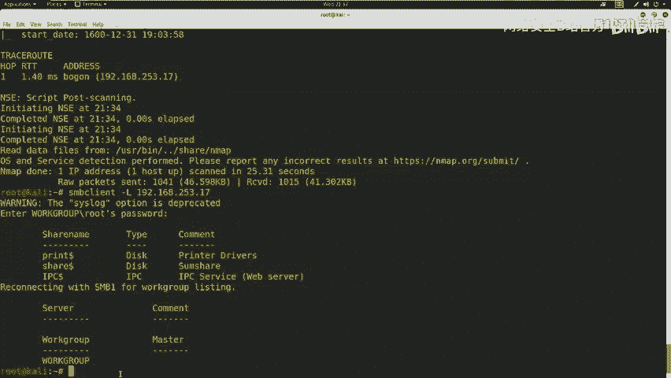

咱们接下来啊要使用到SMB client之后，加上单引号，哎，之后是双斜杠，之后是IP，然后加上斜杠，哎之后是咱们想要查看的这个共享文件夹。

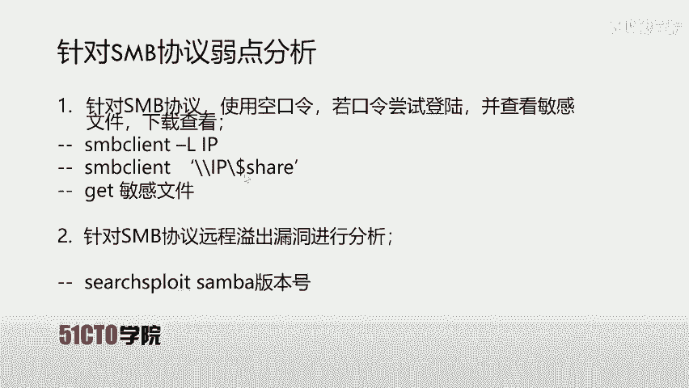

首先哎输入SMB client之后哎单引号之后是两个斜杠之后是咱们靶场的IP地址啊3。17之后是咱们想要查看的哎这个。共享名。首先我们来查看一下print呃，这个共享文件夹当中具有什么内容？

print之后加上多ll了，然后回撤。我们回撤不使用密码，可以看到哎，我们这个连接是失败的，因为我们没有对应的权限。我们看到print没有权限，那我们继续哎长看一下sell是否有对应的查看权限。

这时候哎我们输入下回撤，我们再使用空密码回撤会发现啊我们进入到哎这个共享文件夹当中，我们使用LS哎可以看到哎有很多文件。那我么们下面退出哎继续来查看一下对应空链接是否有一些信息呢。首先输入之后，哎。

我们输入IPC回撤回撤哎发现哎，我们可以登录该控链接LS。会发现啊我们没有哎这个查看的权限。PWD哎，我们也可以看到，哎，当前这工作目录还是这里，但是我们并不能列举出哎当中的一些信息。

所以说哎这个空链件是没有任何利用价值的，我们退出。刚才啊我们在share啊是有对应的信息的那我们下面就打开share这个SMB这个对应的服务。打开对应的文件夹回撤来回撤使用空密码LS啊。

查看哎这个我们当前目录下的这个文件信息，并且列出了对应的信息。

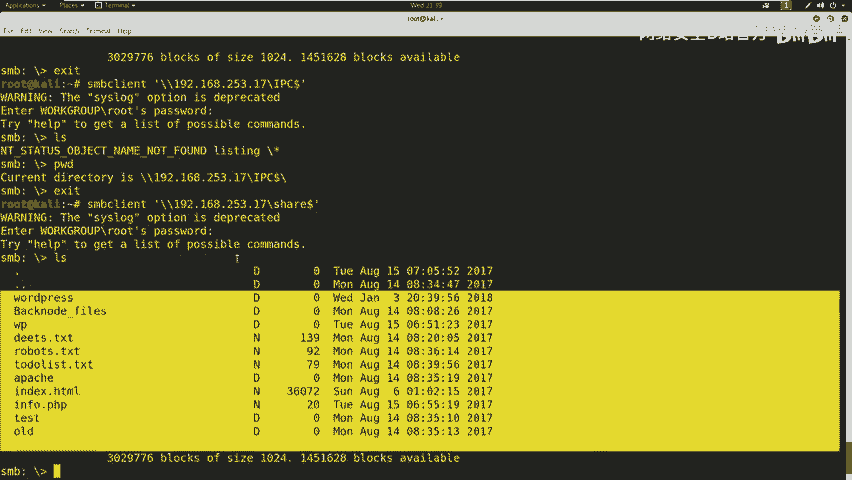

这时候哎我们就可以来使用get来。下载我们这个敏感文件，并查看敏感文件当中的一些信息。

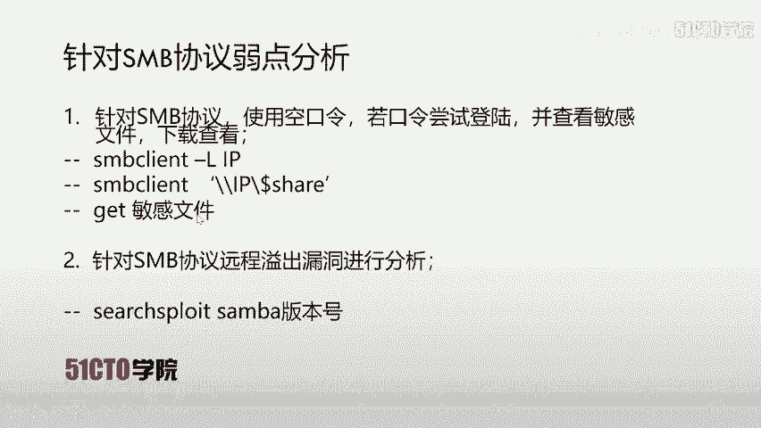

下面回到这里。首先哎我们来寻找一下敏感的信息。我们在这里会看到一个第一次点TST啊，然后我们把它下载下来，看是否有一些信息get第EETS点TST回撤。这时候哎我们下载到哎这样一个文件。

我们下面打开另外一个终端来查看一下这个文件。的内容。L啊我们可以看到这个下载是在咱们这个目录下，然后cat D1E。TS点TST火车。我们在查看啊这个文件的时候，忽然发现一个password啊是。

12345。那我们这里哎应该可能是哎某个服务或者某个。这个对应的。登录页面的密码，我们现在哎先把它记下来，12345，哎，我们关闭这个桌面。我们下面继续来探测一下是否还有更敏感的信息。

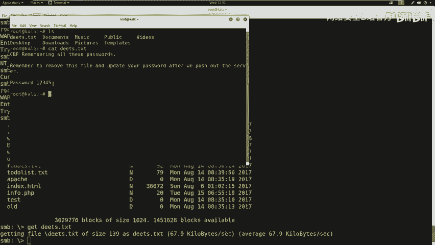

我们向上看，看到哎这个当前目录和上级目录，这里啊有个wordpress啊，这样一个目录。我们来查看一下wordpress当中是否哎有我们想要的一些敏感信息。

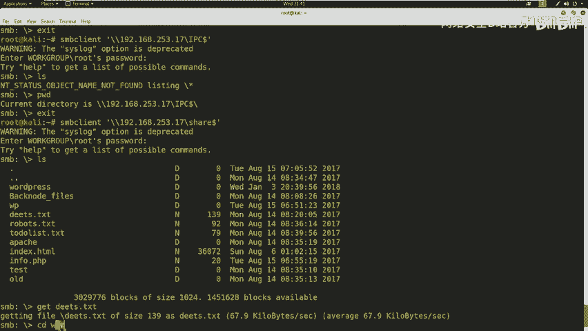

回去。不要来死。可以看到我们接下来啊就进入到这个wordpress啊，并且列出了它对应的信息。在wordpress当中，哎，大家需要注意，我们现在这样看看是否有它的配置文件。

我们在这里啊看到了wordpress配置文件，它配置文件当中一般情况下是具有用户名和密码的。那么我们下面哎就来查看一下该文件哎是否有对应的用户名和密码。首先我们下载。WP。Contact。config。

然后点PHP哎回撤。嗯，我们看一下。哦，我们输错了。config啊回撤，这时候啊我们就下载到了啊对应的这个文件。我们下面打开这个。另外一个终端来查看一下这个文件当中内容LS我们把它放大。

之后哎GEDIT然后WP哎这个confi的PHP之后回撤。

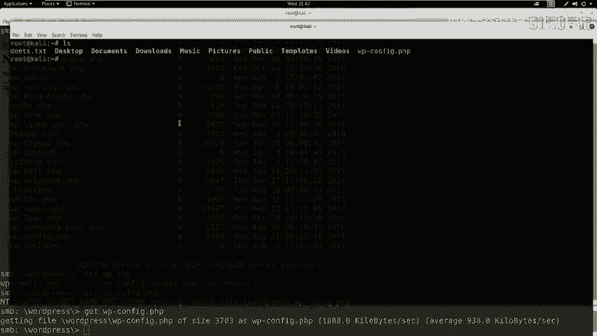

我们来查看一下哎，对应的这些信息。这时候我们会发现哎这里定义了一个哎这个DB内是数据库名，并且定义了数据库的这个user name和用户名，并且定义了这个对应的这个密码。

我们可以看到这时候得知数据库的用户和密码。我们这时候就会想到是否可以通过这个用户和和用户名和密码啊来登录这个服务器之后哎取得服务器的权限呢。这时候哎我们记住了这样的用户名和密码。

首先我们把这个密码给它复制出来。复制出来之后，哎，我们。来，继续哎来登录哎，这个服务器my circle是否可以登录？我们也在上面的这个扫描结果当中，哎，看到它是开放了3306的这个端口。

还是一个my circlecle这样一个数据库。现在啊我们就在终端里来远程登录一下这个数据库。首先，my circle杠H加上咱们对应的靶场地址。17杠U哎，咱们admin杠P哎之后回撤。

这时候哎粘贴哎咱们刚才所得到的这个密码。啊，咱们打开一个终端，首先GDIT。呃，之后哎咱们输入这个WP scancom这个PSP回撤，然后啊把这个密码给它复制出来。好py哎。

之后哎我们把这个密码粘贴到这里回撤。会发现哎，我们并不能哎允许我们远程登录这个my circlecle的服务。那我们接下来哎这里不行，我们来继续看是否还有远程登录的位置呢？这时候回到扫描结果。

可以看到这里有1个22号哎这个端口，我们再来尝试一下是否当前这个用户密码可以登录哎远程服务器，利用SSH协议。首先。SSH啊之后使用admin啊这个用户艾符号啊对应的靶场IP地址。一气不撤。

我们这时候哎把刚才的密码粘贴进来。GDIT啊之后，WPconfi的PHP。我们把这个密码给它粘贴进来。拷py哎，然后粘贴进来。pa不撤。我们发现哎这个密码并不正确。我们发现哎最终尝试失败。

我们除了哎可以对SMB哎这样敏感信息进行逐步分析，也可以对SMB远程溢出漏洞哎进行一个分析。我们可以通过search bullet，然后加上SMBA版本号，哎之后来查看一下是否具有远程溢出的漏洞。

首先哎咱们来查看一下刚才的这个扫描SMB的这样一个版本号。一起而车。呃，这里咱们因为没加4这一个。ra值哎，咱们需要加了这个值之后，哎，这个N map才会根据哎这个速度哎，这个线程数来发送对应的数据包。

也可以看到，哎，咱们也在不断的哎探索着。哎，这时候哎咱们扫描完毕，来把哎咱们看到的哎这个版本号给它复制进去。这里哎咱们。把这个啊给它复制出来。之后哎search spot之后，哎。

把咱们这个复制的这个版本号给它paste进去，会发现哎没有任何这个可利用的这个信息。那我们接下来啊再把这里445啊的这个版本信息给它复制出来。之后哎我们再在sport it，哎。

这样来探索一下是否有这些漏洞呢。我们会发现哎也没有任何漏洞。其实如果有远程一出漏洞的话，咱们可以直接使用来获取靶场的机器权限。咱们现在啊已经获得了啊一定的用户名和密码信息之后。

我们就来针对HTTP协议啊的弱点进行分析。因为之前啊我们针对SSHmy circlecle啊这些登录。这个协议呃的探测啊并没有成功。并且哎它受到权限的限制。

但是啊我们也可以针对HTTP哎的这个协议的网站来进行对应探测来挖掘是否具有登录界面之后，哎找到这个登录界面来登录后台上传咱们的web share来获取对应的权限。

这里啊我们将使用到DRIB和尼wo来进行对应探测。首先我们回到哎公击机当中。首先使用DRIB啊来探测一下是否哎具有咱们登录界面。HTTP来之后，192。168。2253。17回撤。

这时候哎咱们开始来扫描当前这个靶场HTTP哎所开放的这个对应的这些目录和文件。咱们依次来看呃，可以看到PHP and my amin啊这样一个文件。因为咱my circle是无法登录的，哎。

所以说PHP my amin也是无法登录的。在这里啊咱们扫描到哎1个WPadmin哎，咱们rl C暂停。然后哎右键。打开哎，在浏览器当中会打开这个登录的这个后台。啊，看我们这时候跳转到登录的后台。

下面啊我们就输入哎对应的用户名。之后哎，咱们把密码复制到这里。之后点击登录。我们会发现哎这时候就登录了啊网站的后台。就可以来进行对应操作。对于WPS呃这个wordpress啊。

咱们就可以使用哎这个固定的方法来上传固定的木码来进行对应的啊提全。首先哎在上传web shell之前，咱们需要制作一个web shell。自作完web shell之后，啊，咱们需要启动监听，哎。

来监听这个web shell啊所返回的哎excel。下面我们就来制作一个we shop啊，并且启动监听。来，打开卡利，哎，然后我们切换到中端。首先哎咱们使用。

为这个MSFVENOM来制作1个PHP啊的这样一个we shell。Reverse。re TCP哎之后哎，咱们。把他的这个local host。也就是我们返回的这个IP地址。

也就是咱们卡利的啊这个IP地址。咱们给它哎复制出来。粘接之后，咱们输入这个尖轻的端口号。哎，这里咱们使用444啊这样一个端口。之后哎咱们文件格式改为R。回撤这时候哎咱们这个mettterpo。

帮咱们生成一个哎这个返回到这个IP地址和对应端口号的这个源代码。下面啊咱们就把源代码从这个注释符后边来开始复制。如果复制注释符，那么咱们这个代码是无法执行的。co背哎， copy背之后，哎。

咱们切换到桌面。把它复制到桌面的一个文件当中GDIT哎，然后是web shell。点PP。不去。cr位ctrlS这时候哎咱们就生成了一个vi，下面哎咱们就启动监听MScrl回撤。

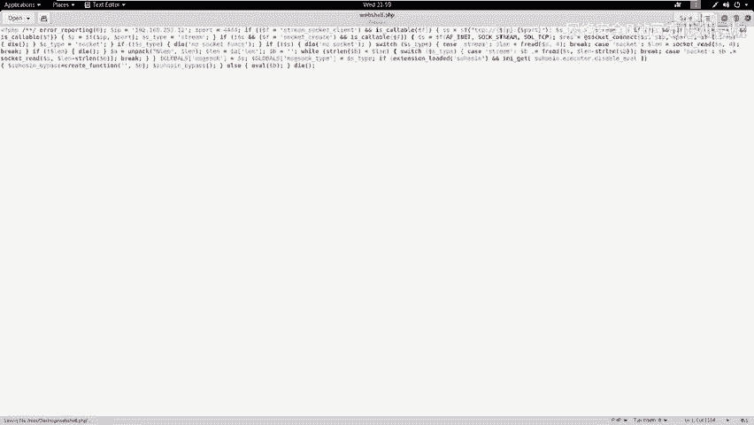

来监听哎，咱们这个端口哎所返回的任何连接。themetalpo啊是一个特别大的这个集成安全，也就渗透测试当中所有过程的这样一个框架。所以说它启动的时候啊会比较慢。下面我们使用 epo，然后是metal。

然后hand了。之后i set回load。然后是PHP mattertter。Great。Reward。TCP回撤。接下来我们来设置并应参数。

s optionstion来查看set low host来设置咱们返回的I这个IP地址。192。168。253。12回撤。咱们设置完这些参数之后，为了确保哎参数设置正确。

也可以再次查看一下options来查看一下是否设置。哎，这里咱们可以看到哎，它设置成功了。那么咱们接下来就来启动监听，使用running回撤。

咱们这时候哎就启动了哎一个这样的监听来监听本地地址的这样一个端口号，哎，是否有反弹回来的TCP连接。

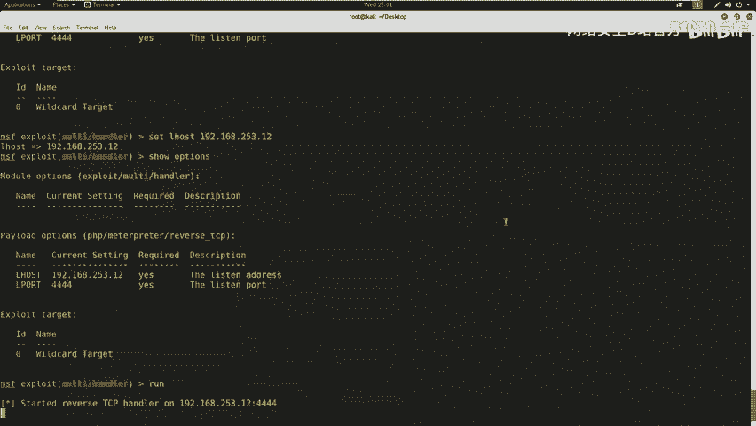

呃，对于Wpress哎，咱们就需要哎上传webshop。上传web shell时候，哎，咱们有固定的方法。首先哎咱们要找到对应的上传点，也就是咱们这个sme，也就主题的404界面之后，哎。

咱们来执行哎这个 shellll，那么咱们就会反弹回系统的se。

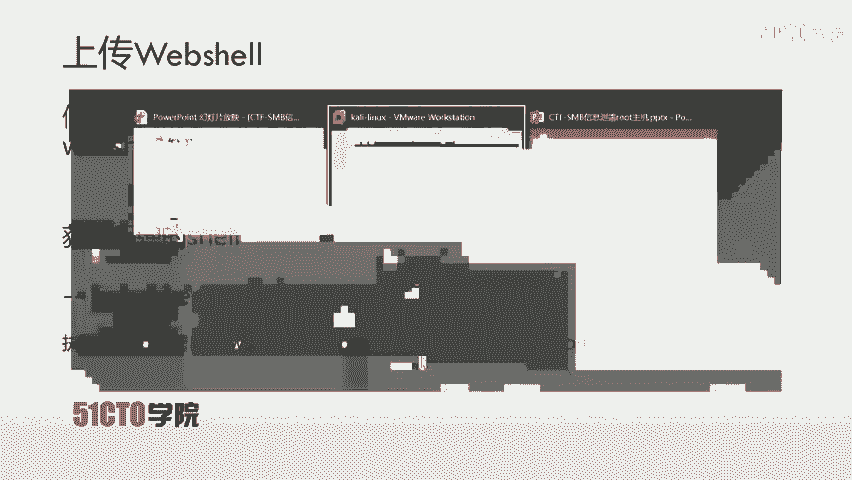

咱们下面哎来操作。首先啊在appears也就外观之后哎是se，然后edit it。在这个编辑当中，我们会发现哎在它的右边有个404哎，这个PHP然后我们点击会发现哎我们。这时候啊有一些代码我把它去掉。

因为我之前已经上传用b share，哎，所以说它会哎展示出这样一个源代码，和咱们这里是一样的。下面啊我们来继续操作，来把这个源代码给它粘贴到这里，来执行对应的sha很微哎。

我们点击upload find哎上传这个we shell。这时候我们看到哎这个文件哎被编辑成功了。那么这时候我们404的代码，哎，就是咱们web share代码。下面咱们来执行一下这个we shell。

咱们上传的微博上啊是有固定页面的。这里啊我们给它复制出来。复制出来，然后哎在卡利当中再粘贴进去之后，哎是把咱们这个。马成IP来输进去。253。17。因为咱们当前的主题是fifting，啊。

所以说咱们这里需要改为fifting。回车哎，咱们这时候哎，这个we shell已经执行。那么咱们哎现在来查看一下监听端是否反弹回来，是要。

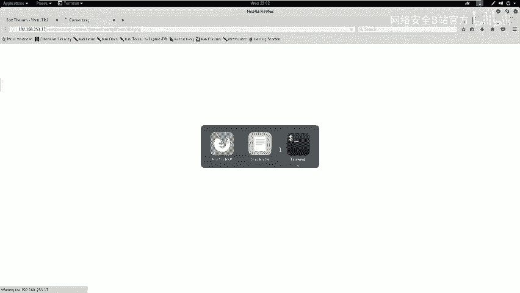

可以看到哎当前哎返回了exel，并且从咱们靶场机器的哎这个端口给咱们返回到哎咱们这个攻击机啊的44端口。咱们下面哎来查看一下咱们当前用户ID啊，回车这个命令不知道，哎，咱们可以用sell来执行一下。

查看一下当前的用户，会发现是1个3W a这样一个用户。

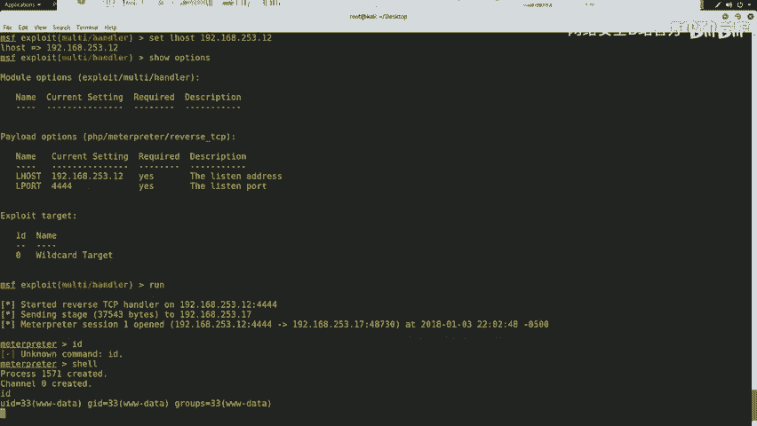

咱到这里啊已经获得了啊这个服务器啊的普通权限。那么咱们接下来啊就需要哎获取。服务器啊的这个flash值。那么咱们查考f值之后，哎，是需要优化终端的。咱们也可以看到。

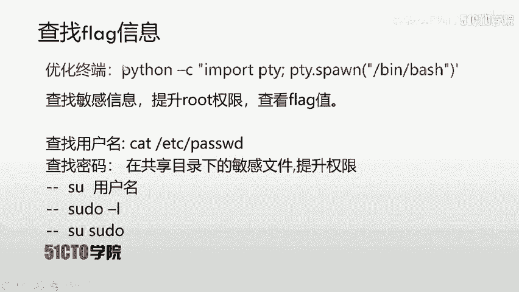

在这里啊，咱们直行一条命令，并没有看到哎他前面一些用户名。比如说咱们打开一个终端。看不到哎他当前的哎操作的用户以及主机名，哎以及他当前的目录，以及他当前的权限。那么咱们下面哎就来优化一下这个终端。

首先使用pathon杠C表示执行pathon的一条指令。Import。TPTY呃，然后分号，然后是。PTY点SPAAWN之后，哎，咱们把base给它返回去并。BASH，然后单引号，然后是括号。

然后是双引号回撤。咱们这时候哎就返回了这样一个哎比较好看的哎终端。

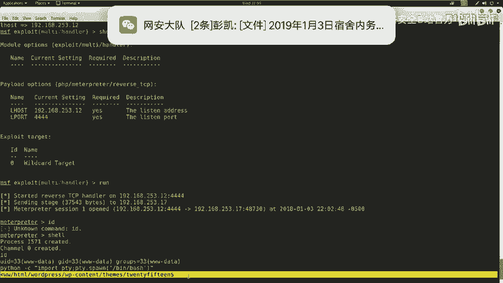

那么咱们接下来啊就需要啊查找对应的敏感信息来提升root权限。首先呢哎咱们现在是以3Wroot登录的那咱们来查看一下当前哎该计算机当中还有哪些用户cat啊，咱们在ETC passwordss。

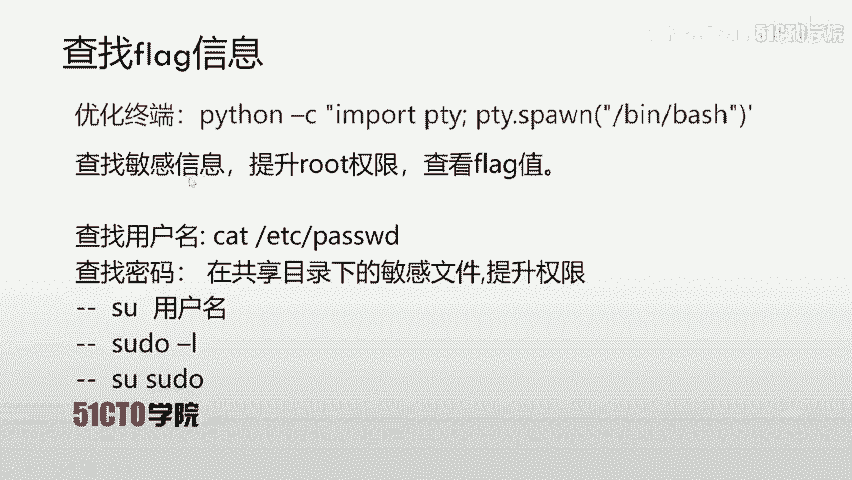

来查看一下是否还有一些其他用户。我们依次向下看，哎，查找一下当前缀系统是否有其他用户名。

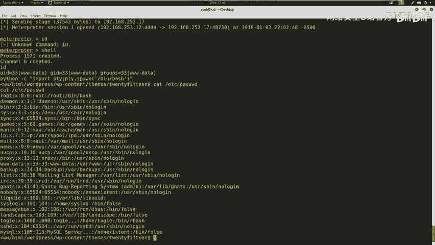

我们来逐条来看，这里没有我们看一下home啊这样一个目录。

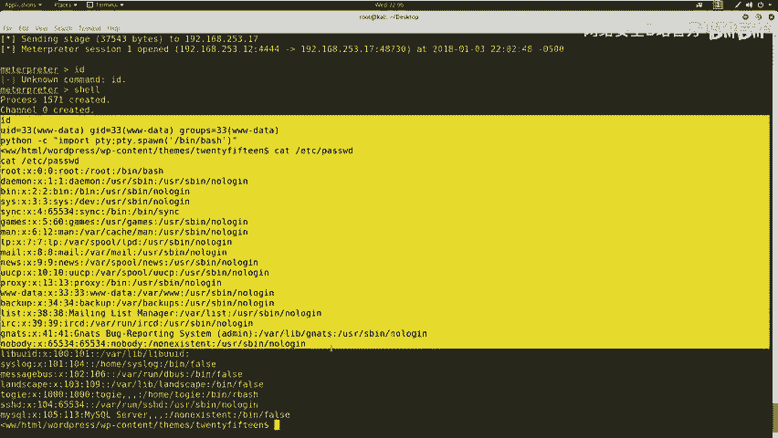

我在这里哎看到1个TOGIE这样一个用户。并且它的这个是在home目录下的一个目录啊，我们就可以发现啊这个GOGIE啊是一个用户名。那我们下面哎就来进行提全。首先我们切换到哎该用户名。回去。

我们发现它是需要输入密码的，我们现在试试空密码是否可以。直接回撤还是不能进行切换啊这个用户的。那我们这时候它的密码在哪里呢？我们会想到我们之前分析的时候发现哎在我们对应的目录下，哎。

有一个密码是12345。那我们下面就来尝试一下该密码是否能登录哎该系统12345回撤。这时候我们发现哎切换成功。并且来适引我们GOGRE登录该系统的。

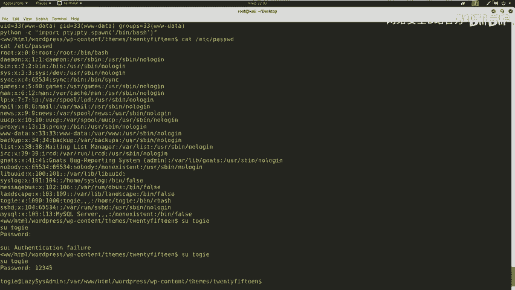

我们在哎取得了啊对应的用户名之后，啊，我们想要切换到root权限，只有哎root权限的时候才能哎查看对应的flash。下面我们就来切换哎这个ro权限。我们使用SU。

然后do哎然后杠L来查看一下我们当前SU可以执行哪些操作。我们会发现哎这里有它对应的一些操作，哎，可以它的这个安全路径以及它的这个对应的设置。下面我们就使用SU doSU来提升对应的权限。

会发现这时候哎我们就提升到了root权限。在提升到root权限之后，哎，我们需要执行下一步操作，那就是获取哎对应的flag值。我们下面啊在根目录像寻找对应的flag。先切换到哎root目录之后。

LS会发现有个fag的TSD我们来查看对应的fag值。可以发现这时候啊我们就获取到了靶场机器的flag值。那我们现在哎靶场机器的所有权限就被拿下。我们这节课啊就已经拿下了对应的权限。下面我们进行总结。

对于开放I139和445端口的机器，一定要注意是否可以直接使用3B client登录到共享目录，查找对应的敏感文件，分析其中可以哎利用到的信息。并且哎我们一般情况下。

这个flash是存在root目录下的，需要提升对应的root权限才能查看哎里边的内容。所以说哎大家以上两点一定要注意。那么咱们这节课就到这里，再见。

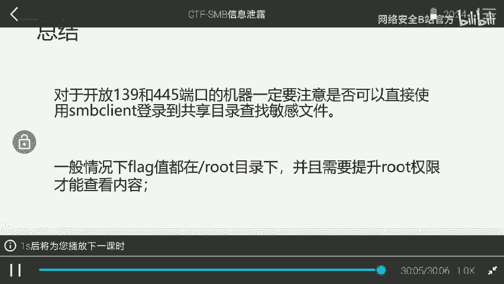