# 2023／12／15 SRDP分享会-GDB的使用和三道CTF题的讲解 - P1 - chycal - BV1KN4y1a78T

本地知啊。对，然后等会直接上传。哎，怎么有人退了，消失了。😊，怎么有人就退出去了呢？😊，不想不想被看到了是吧？差点没看等一下，我先。😊，桌面仪能看到吗？看到我这个界面。啊，我你看不到吗？啊。

你那是黑屏的吗？等一下等一下。😊，你们那都是黑屏的吗？我看一眼啊。😡，嗯，对。呃，等等，稍等一下，我看一眼。试机卡了，你现在正常了是吧？😊，我看你的屏幕呢。纯黑的什么鬼？网络状况不佳，哦是你卡了。喂。

其他人能看到吗？喂。不会我也卡了吧。😡，可是我的网络状况正常呀。喂。😊，你们都闭麦了，还是哦，好的。😮，那我就开始了嗯。呃，首先先讲一下就是如何启动GDB啊，就按照一般来说，大部分电脑上应该都已经。

帮你安装好了这个GDP程序的。然后但是正常的代码，如果你直接把它生成成可执行文件，它是无法就是被GDB调用来不不能被GDB直接去调试的。所以我们需要在编译的时候加上这个杠G参数。

然后它就可以被GDB直接调从头开试吧。因为刚刚好像什么声音都没有。啊，刚什么声音都没有吗？现在现在有了吗？喂，现在有了。对对对，那可能是我卡住了那我那我重新开始，我其实其实啥啥也没讲，就是就是。😊，呃。

首先就是我要讲一下如何启动这个GDP调试啊，安装过程我就不讲了，应该网上很多。然后就而且正常的linux系统应该已经帮你直接安装好了这个GDP调试的程序了。所以我现在直接讲如何进行GDP调试。

首先的话就是你正常的一个可执行文件，它如果没有编译的时候没有加上特定的参数，它是无法被GDP直接直接调试的，它会报错。所以我们需要在写完这个代码之后，编译的时候，我们需要加上特定的这个杠G参数。

然后它就可以被GDP直接调试。所以然后我现在演示一下，😊，嗯。

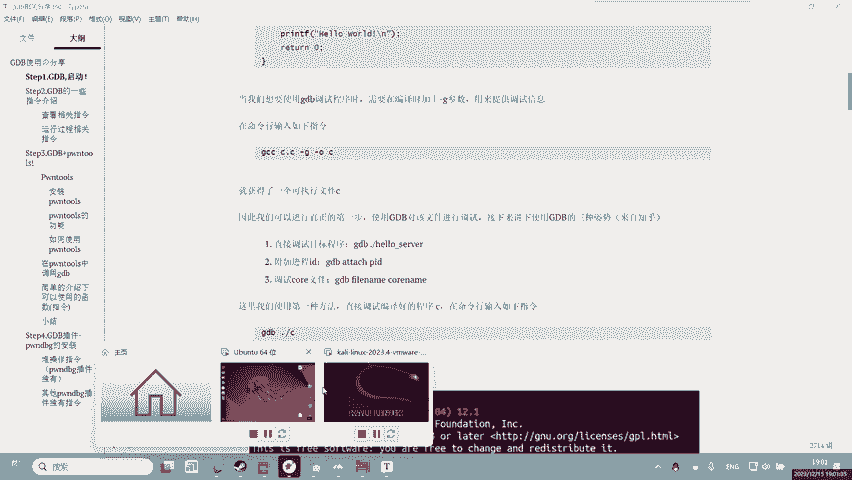

我演示就用这台。诶。啊，突然他突然登不上去了，我换一下。嗯，这个。我就好。密码输错了。呃，我现在直接用这台调试啊，呃，我这边已经写好了一个C点C的1个CC语言文件。

然后这代码是它里面就很简单的一个会打印一个hello word，然后我现在退出来。我现在要通过输入这行指令，把它转化成一个可执性文件。我用DCC来。杠呃，这杠O的话就是它输出的意思。

它就会把这个东西直接就是进行一个转化，把它转化成一个可技性文件。然后就杠G就是可调试啊，就是把它变成一个可以调试的可执性文件。然后我现在输入完之后，我的桌面上就会出现一个可执性文件C。然后我们现在。

这里有三种方法可以可以来调试GDB文件啊。最后一种我没有试过，因为我还不知道core文件是什么东西。然后这个的话就是。正常的话一般是用第一种，然后也可以用。第二种就是当你的程序。

比如说你的程序是一个服务器，或者你用。

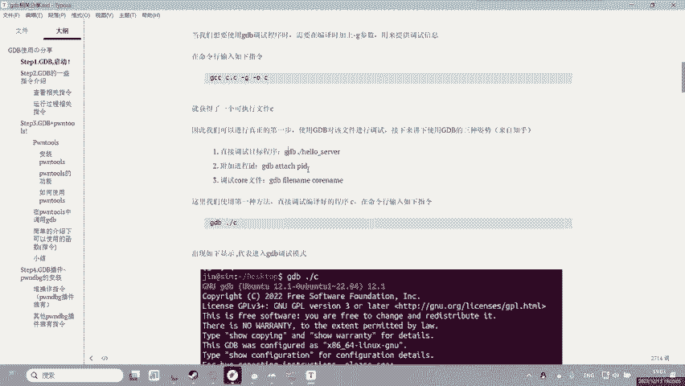

呃，会反正就是它暂时不会终止的。然后你运行完之后，你可以在另外一个terminal里去给它附加上，就是通过进程ID去给它附加上这个GDP调试。然后我们这里的话直接就使用第一种。

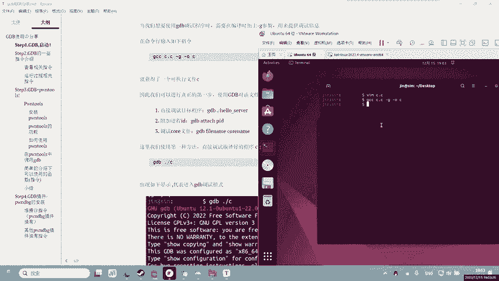

GDB点2C这样的话我们就可以进入这个GDB调试界面。

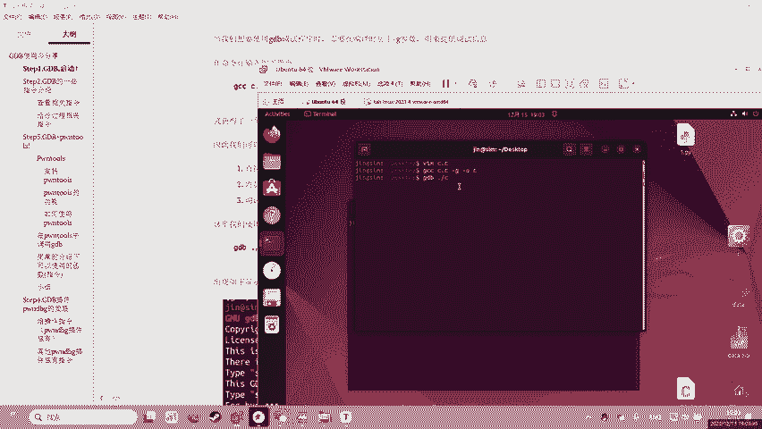

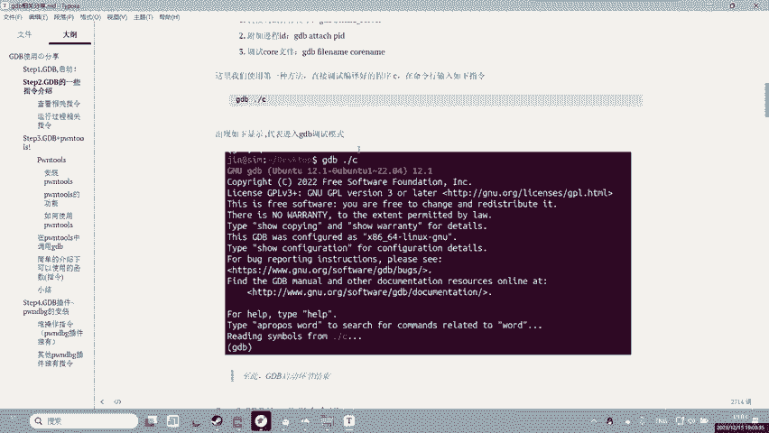

然后我们这里已经成功进入GDB调试模式了。把它关了哎。

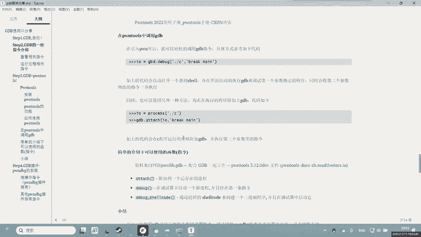

啊，然后至此的话，GGB启动环节就结束了。然后第二第二节的话就是我要介绍一些GGB常用的一些指令。呃，首先GGB主要有以下四个功能啊，就是启动你的程序，然后按照你的要求，你可以随心所欲的去运行它。

你可以在任何地方设置一个断点，然后可以检查可以在你设置断点的时候，你可以去检查一些程序中发生的事情。比如说你检查某个变案的值，检查当前的一些呃一些站啊之类的操作。😊。

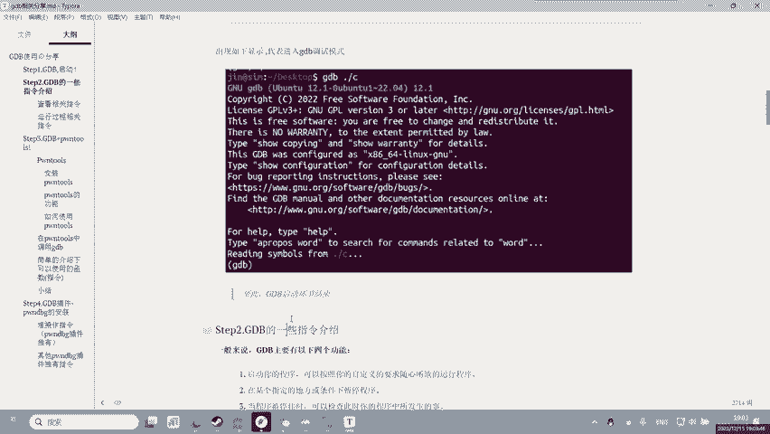

然后你还可以在程序执行过程中直接去修改程序中的变量和条件啊。然后我们现在先先看一下，就是跟查看相关的指令。就第一个的话就是list list的话就是用直接会显示指定范围内的源代码。呃。

一般这个东西它的显示范围是可以调的。然后你每次输入list，它都会它都会向下，就是比如说现在我第一次输入list，它会显示1到10行的源代码。然后我再输一次list的话，它就会从1一行开始往下继续输出。

但是我这边下面因为已经没有了，所以它就不显示了。然后我们如果输入list空格减号的话，它就会它就会显示1一行之前的那十行代码。因为我默认设置的它是十行啊，输入一个减号，它就会输入1一行之前的这十行代码。

然后还可以就是通过。通过你去指定一个位置去显示它之后的时行代码。比如说我list2。哎，他这边是反正他是只有这0行，所以他只能显示这十行了。😊，然后。然后这个的话就是显示某个文件的第多少行附件代码。

就是你可以我记得好像是可以附加上多个文件吧。然后你可以在这里通过前面加上这个前缀，然后对某一个文件进行进行一个单独的查看。然后这个的话list function name就是你可以查看。

某一个函数附近的代码，比如说我们现在这里有一个main函数。啊，我输入这个，因为它我就实在是太短了，它就会它其实就会把这个ma附近的代码都显示出来。😊，然后的话底下这个就是跟这个是一样的啊。

它会它可以去指定某一个文件，然后去显示那个文件里面的。然后指定的函数的代码，这个的话就是。呃，怎么说呢？如果你有两个函数重名的话，你可以用这种方法。呃，然后的话这个list from two就是。呃。

看看这文字意思就知道了，它是从某一行显示到某一行嘛，list。😊，1到5。它就会显示1到5行。然后的话就刚才我说了，因为我们默认设置的。这个代码显示代码行数是默认是十行。

我们可以通过这个show list size去查看啊，他会告诉你这个默认现在现在默认显示的是十行，我们可以通过底下这个去给它改掉啊，就改这个设置。比如说我可以改成。Lister size。改成五行。

然后这个时候我们再用list，它就会只显示五行代码。然后这个的话是比较重要的，就是显示查看指定位置的汇编代码。这个的话可能你得需要先让程序运行起来。比如说你现在输一个rung哦，我现在没有加断点啊。

断点的话在后面会讲，我现在先先加一个断点，我在第一行加一个断点。他直接加到第五行去了，他这个的话可能是因为前面都没有可执行的文件可以执行的操作。然后然后我现在去跑这个程序，它就会在这一行直接停下来。

然后他会告诉你，我这里设置了一个break point，然后它停止了，然后它停止之后，我们就可以使用这个。Disassemble。或者直接缩写成d哎。他怎么啥也不现示。我 the fuck。

我之前用卡利的时候，它都会显示的，等一下。😊，诶。我们这个演示一下。这个的话主要是因为我已经我已经把这里面的他这个。胖DBG装好了，所以我等会儿安装的时候，我要用这个去演示一下怎么安装。

然后我现在设一个断点。然后我在。😔，考一下。y，他怎么不动啊？那我是到后面去。请。我我打问我。哦，打满就可以了。那这个函数是。那这里我可能写错了，我看那个教程，他他直接就写，可以这样缩写。呃。

你看我这边应该能看得清吧，就是我输入这Dasseemble之后，它就会就是这箭头代表的就是现在停下来的这一行，然后它。他会把周围这一圈所有的也不能说所有的吧，大部分的汇编指令都给你显示出来。啊。

他这个的话是显示了一个der，它把main main函数里面的汇编指令都给你显示出来了。然后。我们现在继续看，然后有一个非常好用的指令叫info，它可以查看，就是它在它后面加上不同的参数。

它可以帮你查看很多呃不同的东西。比如说我现在我这个。我先看先给你们看一下，我这个CC代码里面写的东西啊，它里面设置了一个变量S1个A。然后have输入一行print，然后两行print。

然后这里会修改一下这两个变样的值啊。然后我们。现在我已经在运行当中了。呃，我现在定义的这一行，他应该已经把这个变量给他定义好了，所以我。我们先查看一下break我们先查看一下break。

因为我刚才设置了两个断点，然后我们输入info break的话，它就会把这两个端点按照就是你设置的先后顺序给它。给他这个显示出来啊，然后我们再看一下infolocs。

info locals的话就是会去把你设置好的本地变量都给它显出来。本地变量的话，它这个意思已经呃你们在做那个等会儿。等会要讲的那三道题的时候，应该已经知道它本地变量的意思了。

就是在当前正在执行的这个函数里呢，就算本地变量。然后。😊，然后的话我们再看一下这个back trace，它可以直接查看当前调动战堆。然后我们等会儿要讲的这个胖DBG它有一个功能，就是直接帮你显示出来。

胖DBG的话，就是它会帮你你每次暂停，它都会帮你显示很多东西。嗯嗯。然后我们这边输入一下back。Tce。啊，他会帮你去显示这个。当前调用的战队。Theう。然后还有一个功能就是watch呃。

watch的话就是可以监视某一个变样的值。然后在它它在被修改的时候，他会给你一个反馈。他会在比如说我现在暂停的代码是print，然后它后面会被这个S和A的值都会被修改。所以我在这里打一个watch S。

他会帮我监视这个S的值，然后我再继续让它运行，我输一个continue，我让它运行。让他运行到它现在是显示在第八行暂停了，对吧？呃，第八行暂停了，然后。看这里。因为我监视了，所以他会。

他会告诉我这个值被改变了，他的老他的旧的值是0，然新的值是13。啊，是可以通过这一行代码。因为我第七行的是候修改了嘛，现在运行到第八行了，所以他会告诉我它的值被修改了。啊，我取的话一般就是这样用。

然后还有就是如果你在运行的过程中，你想要当前在暂停的情况下，你想要直接看某一个变要的值，你可以直接把它print出来，就是或者是缩写一个P。比如说我现在要看S，它就会告诉你这个值等于13。

然后还有就是你可以直接看某一个备案的类型啊，就是。printnt tab吗？就是P tab。PTYDES他会告诉你，这是ink。然后的话就是我们要讲的，就刚刚已经用过好几遍了。

就是如果你直接使用GDP调试。比如说我现在GDB点-C，我现在进入调试模式，它其实一开始是没有这个程序，其实一开始是没有运行的。所以什么站啊什么的都还没有。你这个时候去你这个时候想要查看它的站。

其实是查看不了的，想要查看什么呃汇编汇编还汇编代码，汇编代码可能可以看，反正就是站之类的东西，你现在是看不了的。你输入进去，它会显示没有。呃，所以我们就需要运行，把你的程序运行起来。如果你不设任何断点。

你直接运行，它会从头到尾直接运行到结束。呃，或者是你你比如说你跑服务器，它本来自己就不会结束的，它可能你这个地方运行之后，它会一直一直运行，一一直运行，直到你手动给它结束。呃。

然后的话就是比如说你设了断点。😊，然后我们现在就有一个指令，可以让这个程序继续去跑。呃，比如说我现在设一个断点，在。二次行。然后。😊，我run一下，他就会在地上停下来。我应该先讲brick的。算了。

没关系啊，我呃。先先先先先讲break吧先讲break吧。呃，break的话只是设置断点，刚才已经用过很多遍了，它有好几种设置断点的方式啊，比如说break function name。

你可以在某一个函数的入口处添加一个断点。然后这个的话就是不需要去知道这个函数行函数在它的呃代码文件中是第几行，它你可以直接在它前面停下来。

然后这个的话就是你知道你要暂停的那个代码是处于它所有代码中的第几行，你可以用这个方法去给它直接暂停。然后这个的话就是说你知道呃。

你你想要暂停的位置是在你当前暂停位置的多少多少行或者是这个off set的多少多少行。😊，嘿，就是你知道。😡，你想要暂停的位置是在你当前暂停的位置的上面多少行或者下面多少行。

然后你这个off set就是跟你当前这行代码的距离啊，然后你输入之后，它就会在指定的位置去给你设计一个断点。然后这个break if if副什么 conditiond啊。

就是你想要这个地方是在多少多少行啊，这是一个指标，你可能输function name之类的，应该也可以啊。就是你在它这里暂停，然后后面设一个条件，if conditiond就是你。😊。

比如说我这边因为修改了这个第七行。这地下呃这个值改变了，对吧？然后我我可以设一个，比如说我想要在第。第九行停下来。如果。我的S。等于13。啊，然后他就会。😊，它在S被改成13的时候。

它就会在这个第九行这里设一个断点。然后我让程序继续运行。啊，他在第九行这里设了一个断点，对吧？因为我的S是13了，所以它就会在第九行停下来。😊，然后的话然后我们现在回来讲这个continue啊。

就是当你手动中断运行，或者是当程序用那个break去触发了一个断点。程序在这里停下来之后啊，你可以输入continue继续让它运行，它会一直运行到下一个断点或者是程序结束。然后还有一个的话就是。

t break这它是一个临时断点，你使用t break。添加了断点。它会在运行第一次运行到这个断点之后，它会自动被删除掉。你第二次再运行到这里，它就不会不会再进去了，就不会在这里停下来了。

然后的话就是这里有两一个单步执行的，一个叫step，一个叫next。然后这个step的话，就是如果他遇到函数，就是他们的运行方式都是往下走一行嘛。然后这个step是 step的话，它如果遇到函数。他会。

直接进去，然后。它会停在那个函数的第一行。他就是说他不会去完整的一次性就把整个函数都执行掉。但是如果你用nex的话，他就会直接去。😡，啊，我这个step可能不太行。看一眼他有没有执行啊。好的。

feel dictionary因为我这个他现在走不进去啊，因为因为我因为他找不到这个printf这个函数所处的这个文件，它这里无法去暂停它。呃，如果他知道这个函数的文件在哪的话。

它可以直接去就是进到那个函数里面，然后停在第一行啊。如果我们输nex的话，它就会遇到这个调用函数，他会直接给他走完，他把整个调用函数的过程都视作一步，它会一次性全部执行完。

然后直接的直接到你当前这个函数的下一行去。😊，然后这个unil的话就是执行到某一行是停止嘛。呃，比如说我现在unt。然他就会。诶。😊，啊，他只行到第十行就就停了。我重新跑一遍。就被我改的面目全非了。呃。

不好意思，我要先设一个断点。然后跑一下。啊超。19号。啊，他会跑到第九行，然后停下来，其实就相当于你在第九行设了一个断点啊，然后还会跑那里去手动停一下。😊，啊，我自己讲了。然后的话就是有三个指令用来。

用来就是去把你的每一个断点单独设置。就是我们输入infer break，我们可以查看infer break，我们可以查一看查看每个单断点的序号。🤧嗯。我喝过水。你。

然后我们这个时候就可以通过这个inable加端点序号，还有这个Dcable和delete加端点序号。去对他执行以下的操作。就是我们比如说我们先diable了这个。Dsable第一个锻炼。

然后我们再次这个时候，如果我们再次运行到这个断点位置，它就不会停下来了。因为你的断点被禁用了，呃，所以我们可以通过inable去把它启用。然后这个时候它在运行呢，它就会跑了啊，它就会停了，它就不会跑了。

😊，然后的话就是如果你不想要某个断点了，你可以直接给它删除掉啊，直接delete掉。然后这个时候我们再用break in for break的话。它就会显示没有断点了，因为我一共就一个，我现在给他删了。

现它就会显示没有断点。😊，然后的话这个frameme。就是切换战争啊。😊，应该大家都现在都知道战争是什么意思了吧，就是每一个函数在运行的时候，它都会有一个战争。

然后我们我们可以直接通过这个frameme去给它切换。😊，啊，我这里只有一个函数，我这里还是个命函数，所以它就只有一个站者。啊，比如说哎。然后他这个的话就是。F0切换到当前被调用函数的战争。我看一眼。

哦，他告诉我我现在被调用的函数是这个。这个命运函数，然后它是第零个战争。如果我还有更多的函数的话，它都会它都会一层层的显示出来。然后这个up和 down的话就是去切换战争嘛，它是一格一格的切换。

然后但是你可以在后面输入输入你想切换的距离啊。这样就可以一次己切换好几个战争。然后 jump样吧这样的话就是直跳行。呃，比如说我现在我这个代码中间有一段是去修改这个S和A的值的，我可以。

我看我现在执行到第几行了。😊，他现执行到第九行了，我重新跑一遍。没了。我先设个断点。哦，然后现在执行到第四行，它把S设成零，看一眼S的值啊，它确实是0。然后我通过jump。我直接跳到第。不行。

我还得先走一步啊，先走一步，把这个。把这个A的值也设置一下，然后我通过jump直接跳到第九行。哦，打错了，不好意思。通过这样户直接跳到第九行。啊，他就退出了，运习完了。😊，嗯。他怎么没显示啊？

那我就直接包喝酒啊，已经烧了杯酒。有道理，他是跳到第九行还是跳跳过第九行，等一下，我看一下我能不能打印，他直接程序已经结束了，稍等一下，我重新跑一下。😊，然后我next。那我就写到第八行好了，我TMP。

哦，他是他这个是报错啊，他不能跳到第八行。😡，那那我先不讲这个我先不讲这个，我等会再研究一下。😊，诶。嗯，这个。相方。我看他那个介绍是直接跳转到指定行或者地址啊，我输入的话，他应该是跳转到指定行的。

奇了怪了，呃，那我那我先不讲这个，我先往后讲吧。然后我们第三集啊，就现在就进入第三集了，上面讲上面已经大概讲完了，就是你查看用的一些指令和运行的时候可以用的一些指令啊。

然后我们现在讲一下这个p tools。😊。

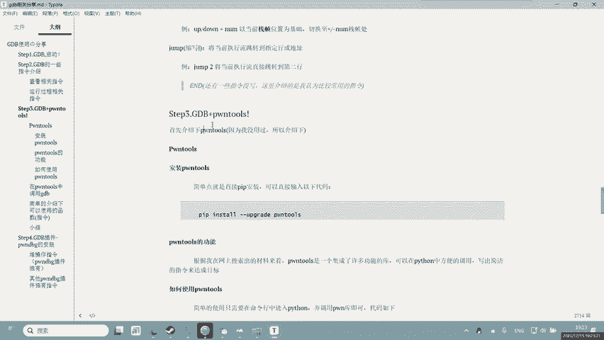

呃，这个punchos的话，就是你看那些。😮，比如说我们之前做做的那三道题，他讲解的时候，他都用了一些非常非常看起非常高级的一些代码。它是直接写在一个penil文件里一样的。

然后比如说什么import OS，然后它直接什么IOGDGDB，然后它还可以直接往这个流里面去输输出一些东西之类的，它就是通过这个p toolss去。😊。

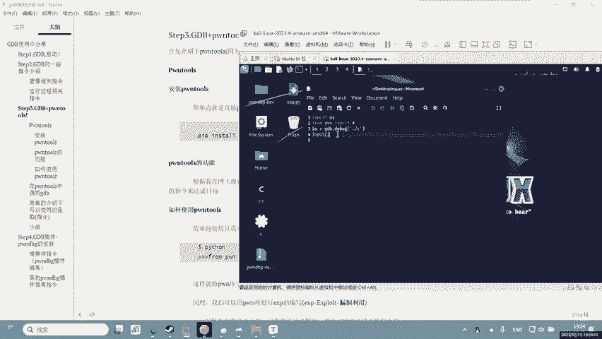

呃，去执行的呃，我们现在的话就是讲一下如何安装。

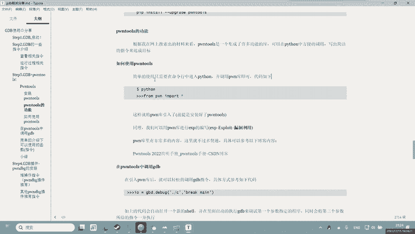

我这台已经安装完了，我看我用这台安装一下。哎。呃，首先最简单的方法就是直接PIP安装啊。😮，我现在直接。把这个指令输进去。啊，然后他就会。自动的帮我安装完。那，只要你的papper的这个库是最新的。

他应该就不会报错。呃，安装可能需要一点时间，因为它毕竟是外网的东西，然后我们现在直接跳到安装完之后。然后。你想要调用这个库最简的方法，就是直接去import它。

比如说我现在这一行fromPW去import这个去import这个。为什么删在下面这样？

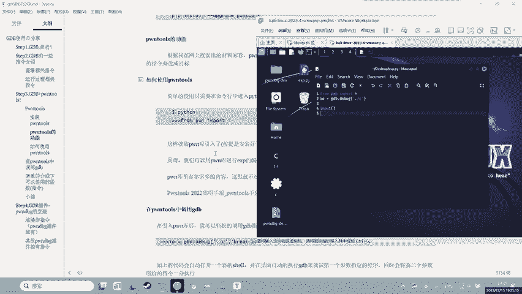

啊，这样的话就直接能引入这个库了。然后。然后我们接下来应该要讲的就是如何在p tools中去调用这个GDP啊。

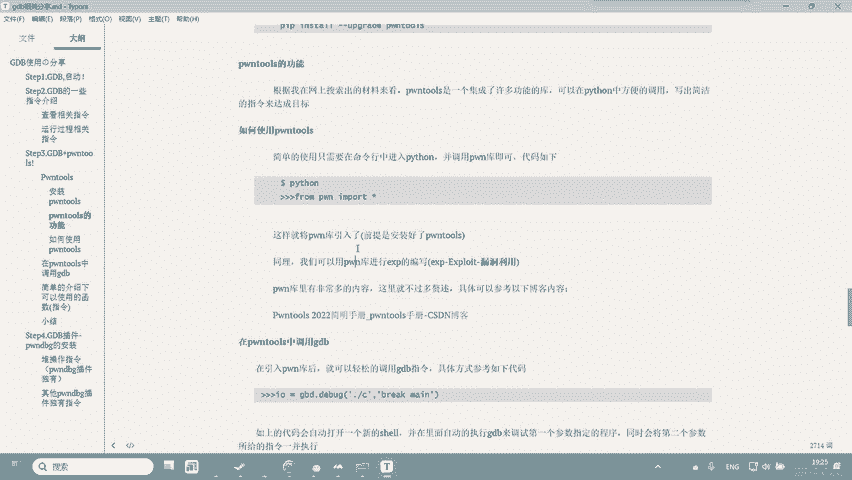

呃，这样的调样方法的话就是通过这个来。首先我们命名一个变量，然后我们通过GDB点第bug，然后后面加上一个参数。这个第一个参数里面是你想要执行的一个文件的文件名啊，然后前面加上点纲。

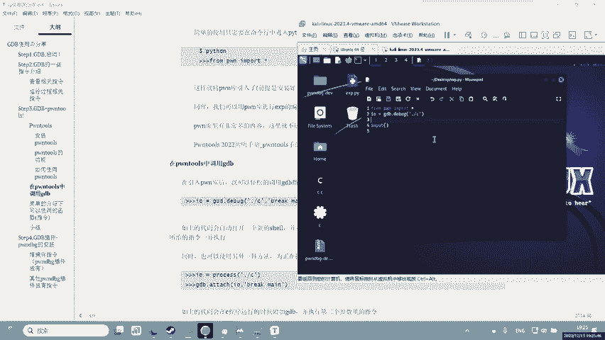

然后这个时候我们去运行这个代码。这个时候我们运行这个代码啊，它就会像我们之前一样，它会把这个GDB的这个秀给打开，然后在这里单独有一个。然后左边的话啊就是你原来运行的这个程序了。

其实是就是相当于在这个程序里面，他帮你去打开这个东西。啊，然后它还有它还可以添加添加不同的参数去执行不同的操作。然后我看的第一种，我看我看了一种的话。

它就是你可以在它的第二个参数里面输入你想要执行的GDB指令，它会在进入之后直直接去执行这行指令啊。然后这个的话它和。其他和你直接去GDB去调试一个可执性文件，有一点不同就是。当你使用这行指令。

它会弹出那个GDB的那个调试窗口吗？它是直接开始运行了，它不是说呃它先先不运行，他等着你去输入那个run再运行，它是直接已经开始运行了这个。代码的他不是说。等你运行啊，然后所以他才能执行。

直接执行下面这行，后面这行或者是哦其实这个东西其实也可以慢慢后面执行。但是你这里输入别的话，他就不好说了。😊，嗯，然后的话还有就是你可以先运行程序，然后再用GDB去附加上去啊。

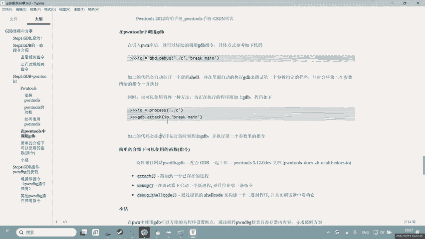

就比如说我我现在改一下这个EXP，我先把它改成。我写了process。😔，阳江市。然后我再用GDB点att。第一行的话，第一个的话就是输入你想要速加的一个这个程序的流。

然后后面再比如说我想要它在命运函数这里停下来。

然后输入这个input，其实是让它阻塞一下，让后停在这里不动，不然的话它就会直接直就结束了。然后我现在再执行一下。嗯嗯。啊，他会去附加。上去啊。然后他告诉你，这里有一个。breakak point了。

嗯，这是什么？你在这里run又行了。啊，他这里有可能是。执行结束了，还是说还没有开始执行啊？啊，这个反正就是这个是可以，他在你先先先把这个流给它设定好，然后他再额外的用银行代码去给他附加GDB啊。

然后的话。这三个。呃，刚才已经讲过两个了，然后下面这个销扣的我还没有用过，你们等会儿可以自己试一下。然后小结一下，就是在PWN中使用GGB可以方便的为程序设置断点。然后就像我们他那个给的那三道例题。

他做题的时候一样，他设完断点之后，他可以。😊，呃，他可以去当场去检查寄存器里面的东西，然后去看一眼这个汇编代码，然后他接着往他接着往里面去写一些指令，然后可以。😊，就是说调试完这个程序嘛。

然后可以直接去找到破解的方法。呃，然后最后一个最后一个的话是这个插件的安装。然后我这边写了一个安装方法，这个应该是可以用的。我就是用这个方法去安装的。然后我现在演示一遍安装过程。啊。

他这里这个胖兔是记了。安装了半天安装不起来。呃，我有我这台电脑，因为还没有安装过。首先的话你需要输入。这个去更新一下你的。哎，完了，我不会这个密码忘了吧哦，没忘，先去更新一下你的库啊。😊。

然后你如果没有更新的话，它大概率是按照不了的。我也不知道为什么，就是它底下。呃，反正底下这行你可能就走走不了，不过底下这行的话，你前面都能走，这行应该也能走了，这行应该已经是安装完了的。😊。

主要是要安装这个get的。然后我第二行。电上走一下吧。他应该是能接走的。哦，他你看这不就有东西没人装了吗？应该是get没安装，他会帮我安装一下git。然后用get的话，我其实这个你也可以不不安装get。

因为它后面这其实是个库嘛，你可以直接去。😡，啊，直接去他这个网站上去给他下下来，然后你就上传到虚拟机。😊，其实我一开始就是手动下载这项传的，因为因为我这边克隆实在是克隆不下来，我要我还要做一些别的操作。

翻个墙才能。😊，才能给他克隆下来。然后的话。然后的话就是很简单，就是你因为我这边就是直接手动上传了一个这个。不好意思，带个电子过来嗯。我这边就手动上传的这个这个文件，然后我直接进去。

它里面很贴心的给你搞了一个这个脚本，你直接运行这个脚本，它就会帮你安装完了。然后的话就是比较麻烦的一步。不过这里也是通过一句话就可以直接直接给你搞定，就是你要去EDB的这个。配置文件里面。

你要去让它每次启动的时候都去调用这个这个软件啊，调用这个功能，调用这个插件，不然的话你可能你还得进去手动调用一下，太麻烦了。然后你直输入这行。哦，我这边是输入完了的。然后我现在。

直接运行它就会多出这一行效果。你每次它在断点停下来的时候，他都会去帮你显示这一大堆东西。然后你可以慢慢的看，你可以找一下，比如说好用的。在这里。Ill just stack a both。

我记得有一个叫registered的。啊，就这里就rejust，他会把每一个计层器里显示的东西都都告诉你，然后他你也不用输入那什么list了，他直接告诉你你这个代码啊，这个源代码他直接帮你显示出来。😊。

就很方便，他一下子帮你这这多这么多行都显示出来，你可以不用去list一个个慢慢的看了。不过如果你刚开始。😊，跑这个程序，你还没有你还不知道它里面大概长什么样，你最好还是用用一下list，不然设个断点。

再再等它运行的话，可能会出一些问题。然后的话这个插件还集成了一大堆的指令啊，我之前看到有人用过这个，他直接生成50个用来艺术的字符，我看着好像挺好用的。不过我还没有用过啊。

然后的话就是一个tack查看站。😊，然后之前不是说有一个叫PLT表和一个过程表嘛，这里也可以直接帮你看。😊，呃，然后的话。就差不多了。这这一大堆的指令，我现在写的代码里他基本上都是都是看不出来的。

看不出来有什么区别的。因为你运行它他都会告诉你没有这个东西都是空的，因为我这啥也没设置。😡，他高大部分东西都是空的，我这边就。呃，不演示了，你们想要知道它怎么用的话，可以去百度一下，避应一下谷歌一下。

自己去查一下吧。好，那我今天的共享就到此结束了，谢谢大家。😊，你你先别跟讲的挺好的呃。其他同学都听懂了吗？就是你们学会了吗？差不多吧，这星期哦，你你把你的那个。放开来，我还有一些东西要什不行。

你把你刚成个。对。呃，第一个是我我如果我想就是用不带插件的这个GDB，我想看寄存期，我应该怎么操作。哦。我记得他有一些。他这个infer指令应该是可以直接去查的吧。

他这个printin可以看info print也可以看。那这这怎么操作？我看一眼应该是是不是info register啊。嗯嗯。没有，这个叫register没错。完了陷入盲区，你就是应付IEG。

你就先REG就行。你索IED不是不是RR，不是I是R。哦，吓。你没有运行，可能是。哦，对我没运起来。那我这个哦，那我上面这行这个info register也可以的，就是没运行起来。😊，哦。

然后是我想单独执行一条汇编语句，我应该怎么操作？单独执行一条汇编语纪。对，这个非常重要。可能吗。完了又是一个盲点。😊，呵呵。😊，嗯，没事没事，我查那个他他上面没写就行。因为是这样的。

你你你这个查的基本上是就是普遍的就很多是这样，就就是只给你讲了正向的过程。然后比方说你讲了list，你讲了很多list史的，我就问你，当你如果没有源码的时候，list会输出什么？

就是说我现在只给你一个可制性文件。那么绿似会怎么样？直接一个可执性文件，然后list。冇错吗。我觉得不会报错，但他不会输出结果了，他就不会给你输出那个源码。因为你没有源码，这个时候你没有那个C文件。哦。

如果这个文件被删掉了，他其实不能。就不能显示源码了吗？对你就看不见你的源代码。你先退出哦，不是你。你你把你这个。因为你这个可执性文件是在你这里自己生成的，你应该。你应该就是从网上找一个可执行文件。

或者是或者是你把你这个可执行文件拿到别的地方，就是去生产的。你就把你上一次那个网好下载的快捷性文件放进去。哦。等啥。确实解示不出来了。no such feels对啊，这个时候我们就需要看汇编了。

因为我们已经没有源码了，对吧？首先你你要看汇编，然后你你一般在上面那条语句后面加一个ma就可以了。你。你语音信结束就行，你随便输点东西。OK你在deceemmber后面加一个ma。就代表你可以返回。

就是你想返回遍那个面的那个战争，不一定说呃一定要运行。因为运行的时候，你输入的是他当时正在执行的那个战争。然后就左边也有些地址，我就很重要的点就是。你break的时候。你希望希望在一个地址上往下断点。

应该怎么操作，这也是很重要的一个点。直接输入这个地址可以吗？你试一下。哎，好好思。嗯。Made defenses。再加个星号是吧？对你加一个信号就可以。哦。对，这个也是一个很重要的一个点。Yes。哦。

好。对，嗯，单条单单条这个汇编指令的这些，你先把它运行起来。单条汇编指令的运行，现在已经对你你先下一个断点，然后运行起来OK然后你输入NI。本来对对对哦，就是那就可以。R。你得看那个汇编的简历。看搞了。

他当不执行的一条。你操作一下NI，然后你再看一下，现在是120的位置。哎，你这个怎么不执行？不说就没反应了。😊，为什么你这个。他这里提示了N了can not。哦，哦你这个指令的相当于你这个指令没有执行。

就是正常。如果你程序是正常的，一般是你用NI是会执执行。单独的一条汇编的。因为有的时候你需要单独执行汇编，然后来。来看这个就是他的一些操作。然后还有一个点就是。嗯，为什么他要加那个港记还？是哦。

有没有效果。杠机的话，它如果不加杠机，他好像无法用GDB直接去调试啊。那为什么不加酒？58小时，那这个杠低他干了什么？我看的是它会生成一个调试信息。对，差不多是那个意思。你你先退出一次。

你把这个嗯DVD的退出一个啊，我是你用QQ就可以了。行行，那你再看一个。嗯。出1个GDB的某一个文件就行。对，这个也可以。会车。这里有一个很重要的一个点叫reading symbols from。

看到了没？哎，这里呀对对对，这个就是说嗯因为加那个杠D选项的时候，它就保留了符号表。就是保留了你比方说内函数，然后以及它的一些地址等的一些信息，所以你才能够调试。那有很多可执性文件，他把符号表给剥离了。

然后现在相当于你你刚记现在拿到了一个带有符号表的一个程序。你你去想一想。就是你去查一下怎么样把这个符号表从这个源程序中剥离出去，你可以查一下，然后再告诉大家。对你之后再说。哦，然后就是你还提到了一点。

就是说嗯。在你没有运行起来的时候，你没有办法看到战的战争，对吧？嗯，对，为什么有没有想过？他那个查看战争应该也是指也是查看当前所在行的那个。代表的函数的战争吧。是对，就是这样。就是说在你没有运行的时候。

呃，战士只有在。执行的过程中才有一个实体，执行结束了，它就消失了。嗯，我想补充的就有这些。啊，其他的同学刚刚那段那些有没有听懂？没事，我保存那个了，保存有有有有视频录制，到时候可以直接发群里。需要。哦。

 no。今天今天我相当你们名字有点对不上，今天是有人要分享那三个题目？是。是我应该是。哦，那那你分享吧。嗯，ok我先解束共享。好好好。😊，Okay。そは。

Yeah。哎，你叫啥呀？嗯嗯，啊月月月1类。

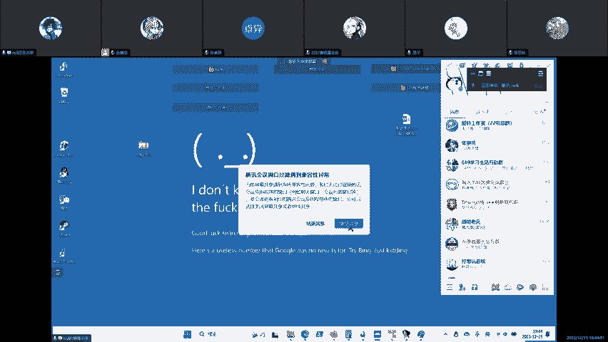

现在能能看到。可以看到。啊，就是这个。ROP啊，它其实就是利用该计册。来进行执行一下你想要的一些内容的一个。东西概括来说是这样。呃，我们这三个题呢都是战役出的，然后先讲一讲什么是这样吧。呃。

就是你运行一个函数的时候。然后他的他一信函数的时候，它又存在一个债，然后这个站有呃EBP。还有ESP。那这样。然后当你要调研一个函数的时候，你比如说你要靠一个的靠一个函数，它的名字的话，靠一个函数的话。

之前他是会有一些push操作，就是。因为这队友还是要传参嘛，然后他就会把这些参数复制到这些站顶上，然后ESP就往下移一个。等他把这些参数都。诶。参数都放到站里之后。他靠之前还要再放一个是返回地址。

然后靠的时候就开始把EDP。变成了指向了显新的站顶了，然后把旧的EBP。入战之后。开出了自己的新的战ESP啊。可以可以这么说，反正就是他开出了一个新的站，它的结构基本上就是呃参数，然后返回地址。

还有旧址。然后就是你站中的一些内容。就是当前还是的一些。一些局部变量，一些一些内容，还有缓冲区啥的。然后我们是通过呢。是通过一些啊危险的函数就是gass。它或者是STRcopy呃。

str copypy这种不检查呃占缓冲区大小直接直接向里面复值的。然后假如说你的法证区就是盗窃函数就是在这儿。然后如果你ge输入一个很很大超出这个超出这个大小了，它就会往继续往上写，然后它就会覆盖旧值。

然后覆盖返回值。啊，这样就会破坏。破坏了这个战争的结构。呃，他在返回的时候，这个EBP就可能跑到了一个未知的地方。然后他返回的时候就会返回到你这个你覆盖的地址上。

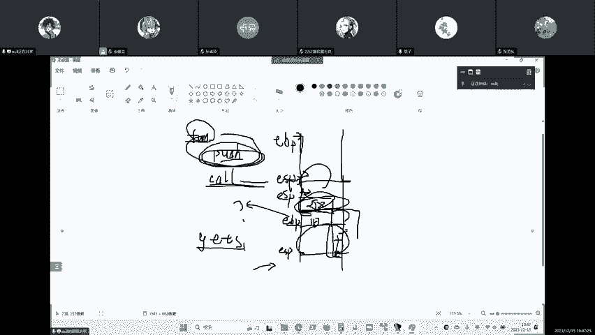

啊，当然你写的如果不不是地址的话，可能触发其其他一些错误。啊，这就是战一出。的大体内容。然后看第一个题。第一个题就是直接去跳转到。我们程序本身的代码。呃，这其实是自己简单的，也就是说。我们只需要把这个。

这个返回地址改成一个你想要的值就可以了。看看第一个。

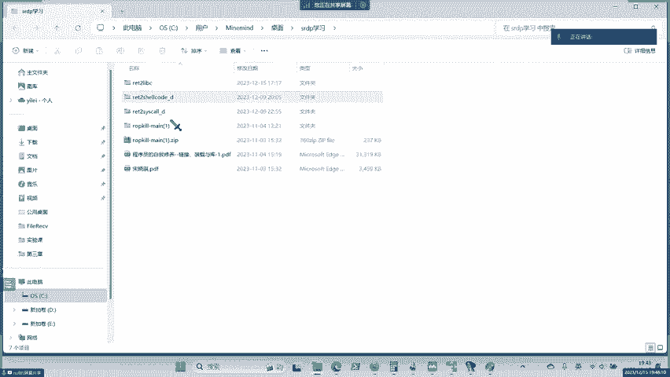

呃，第一个是代码的。是。

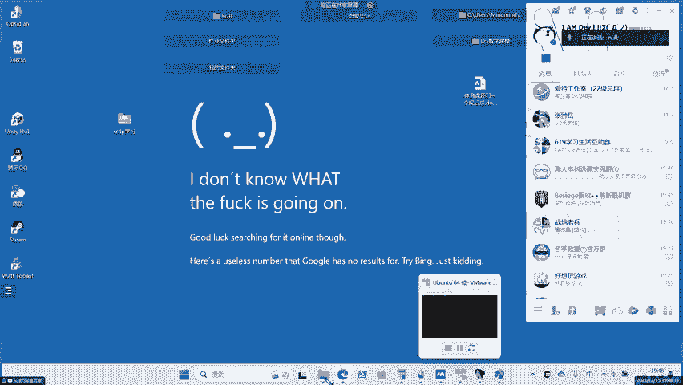

他应该是这。然后这是我们IDA嘛，先是先装好了。呃，我这是打开的时候是嗯没有没有打开文件。单独一个空的窗口，我只需要把我们需要汇编，把汇编的东西直接拖进去。

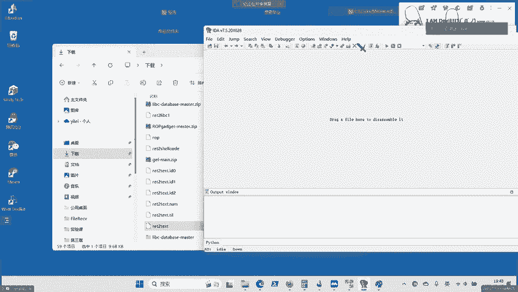

好是出现了。这个这个还这个可执性文件，它的大开编的内容。这边就是。函数的一些列表。啊，这边应该就是内存结构，上面上面这块部分就蓝的、黄的，还有粉的啥的。然后我们看到我们的面函数。媚函数这样看。

我们可能不知道它魅函数看的啥，它有一个功能就是。看类似于每伪代码的一种东西，你可以直接F快捷键。然后就能嗯到了这个，即使你没有这个语言文件，你也可以看到呃这种代码啊。

然后我们可以看到这个m力有一个gues。这个是我们的就是我们站一出他下属的地方。啊，我们再看我们的函数列表，它应该有一个叫s，对就在这儿。

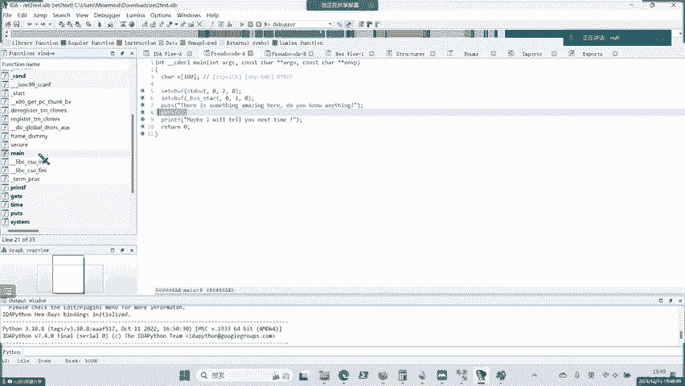

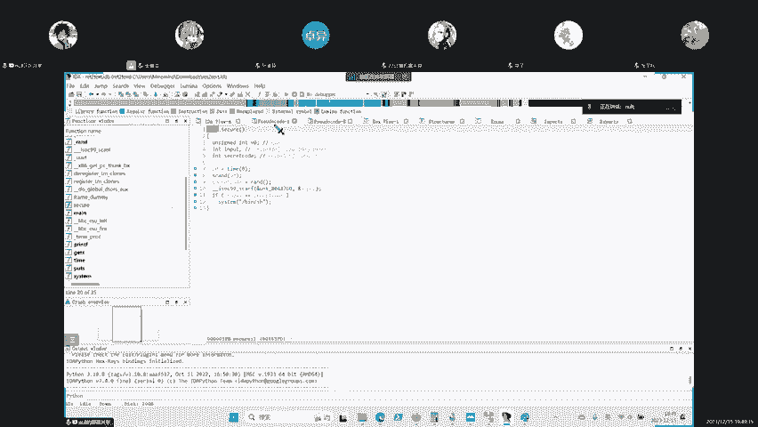

嗯。就是他的内容，其实我们不不太用管他内容。第一个只是我们执行他就够了。调到1Q。啊，这就是我们的。secure函数我们可以。从他的。开始地址就是push者。调跳到这个地方，也就是我们要跳到这个地方。

但是地址在哪呢？你可以右键一下，然后点text view。我们现能看到啊这个push。哎，这个开头地址就是0840285FT。是这样，我们就要跳到这个地址上。啊，你也可以。咦。点一下。啊，这样吧。

其实这样看也行。这样我们就要跳到这个地址上。

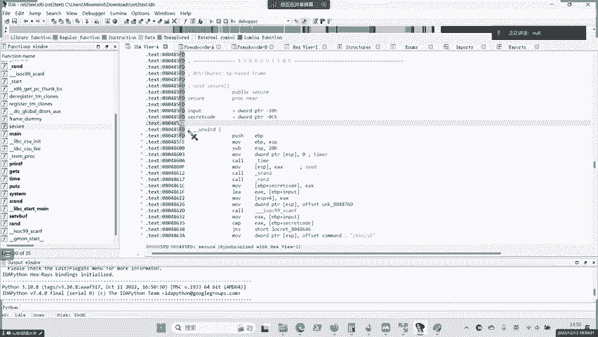

然后我们把它。

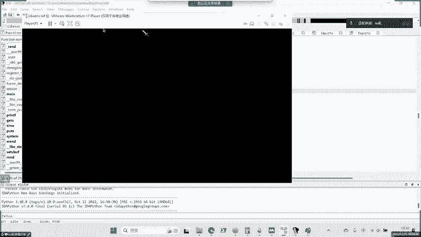

到虚拟机上。啊，这就是我们这个可执性文件，我们可以。首先呢非常重要的一点。就是我们进行这个写写入的时候，我们是要在这个返回地址这个地方。这。🤢，啊，写入正确地写入正确的范回地址。啊。

只要求我们就是非常了解你这一块它有多大，实上你才能对齐，对不对？嗯。我们可以通过GDB啊。

然后我们可以在这个。调用干啥之前，他这个地址打上一个断点，就已经把。

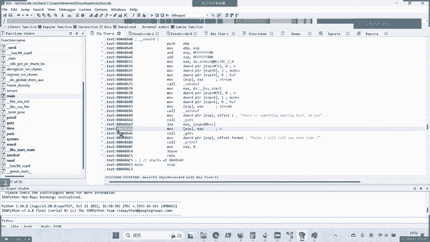

可比。嗯，这样我们就在这个地方打乱断点，然后我们只要。并起来。我们就会发现我们现在执行的是gass前一步。给1X里。啊，不这确实这是。这是英特尔类型的，这是英特尔格式的，不是ATMT的。

就是这个是原操作数，这个是目的操作数。你是把EX放到了你的。站点上。然后我们再对用这个gue，然后。其实我们传入的这个。我们这个时候他其实就是一个。常生的参数了，就是你华城区的。缓城区是是是在什么地方？

然后我们ga死的东西都会抛到你的缓冲区里去。就是当前EX指向的这个地方。啊。这个是装了插件之后的啊，没装插件，就直接用I2开就行。Yeah。那们就知道这个EX是这这个这个东西。然后我们可以。进行下一步。

碰到了。Yes。现在我们输入我们，比如说123456。然后就是。EX指向的。EX这个地址。他指项的内容它已经是我们想要输入的东西了。那怎么知道这个。这块大小呢。我们就其实可以算一算，我们现在是。

EBP是在这儿，就是占地是在这儿。然后我们现在缓冲区的开头是在这儿。我们只用1178减去10C，我们用计算器减。

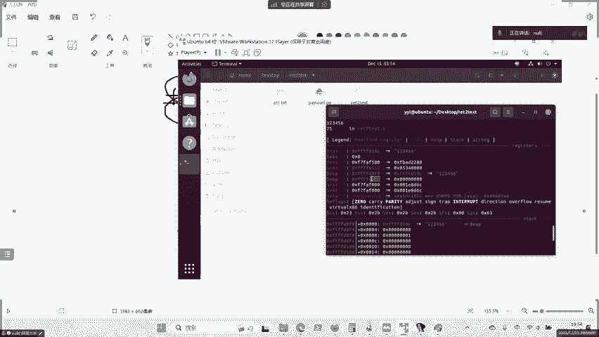

虽然有那种更暴力的，但是。呃，需需要一些插件啥的。一汽8减去。依脸色。你发现他是6岁。在实际至少就是108个字节的位置。也就是说。你着。占地。啊，对，不是这样是这样。占底。

从我们的开从我们的缓冲区的开头到站。别看这个这个不是。跑出去的开头到站地。还有108个字己。然后因为他占地还有还有一个什么叫旧旧的。就的占地啊。它是有4个字节的，因为它是一个地址。

所以说这整一块是112字节。这啊，我们只需要写入112季节的呃，随便写一个什么东西，然后我们在后面附加上我们想要的返馈地址。哎，我们这个题就解决了。所以说我们打开我们的python叫python。

然后我们。如何构造这个东西呢？如何构如何输入这112的，还有加一个地址这种东西的，我们就是用PWN。这个这个工具PW toolss。刚开始我们的步骤就是。import引引入它这个库唉。然后。S，H。

就是一个一个进程吧，相当于。嗯。😊，你是不对的。I should这。嗯。我们先SH就是我们的这个程序的进程。然后那们中间的部分就是我们主体的你要写的东西。

然后最后你需要用interactive它进入这个interactive模式了。中间呢我们就我们要跳转到一个地址，就是FD。这个地址。这啥呀？我写过这东西。And都变了。大概是这样。没电。啊。

可可可可能这种。这个文件就是这样。啊。当时之前是可以的，然后这是我们要挑改的地址，就是刚才的ID里找到的。然后。sunderline就是。我肯定是干了什么奇怪的东西，这东西不应该存。哎。Yeah。

sline就是呃向你的这个进程发送一个，就是当你到了gas的时候，他就会把你。你过造的这个数据给他发送过去，发送到gets这个函数的时候。呃，然后。我们发生的数据就是这样。0叉6C加4个A。因为。😊。

为什么加B呢？因为python跟python3，它里的PPWN。其实它因为path3相比path2它的。制符的要求可能有点。呃，有点变化。所以说。你是加一个B把它。啊，是命为data的。啊。是是这样。

就不能是字符串类型的。然后。就是112个C呃，112个字符A。看到了那个。完成区里，然后加上。加上你的目标地址，然后P32是打包加你的。地址也就是一个整整数类型，打包成。打不成数据给他发过去。

如果如果做过那个什么。bula的话。可能你可能知道可能有一个has屠ro那个那个东西你可能会知道。没说不款可可能比较抽象。Yeah。然后最后我们把它变成interactive就可以。

之前我们要之前那个函数。然后这啊。他是这是他程序本认输出的。然后最后。我就到了这个县啊。怎么指？就到12点。可能就这这就是那个CQ的函数的功能。然后你就可以通过它进行一些很很恶意的。啊，代嘛。

比如说山库跑路之类。然后第二个是C那先停一下你得首先问一下大家有没有理解，我觉得讲的挺好的。但是我其实有一个点。嗯，你先问一下大家。啊，有什么不懂的吗？就比较模糊的，我再说一下。

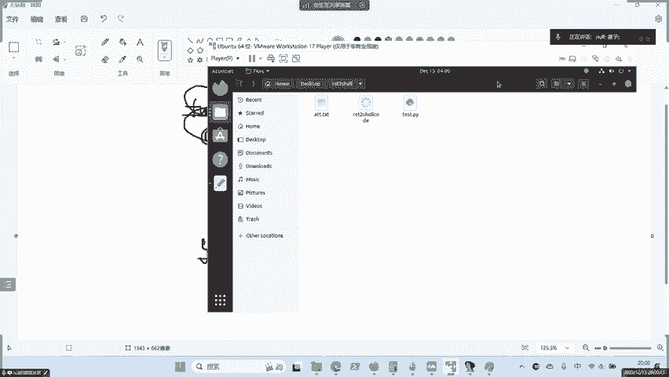

雷志亮，你你你听懂了吗？

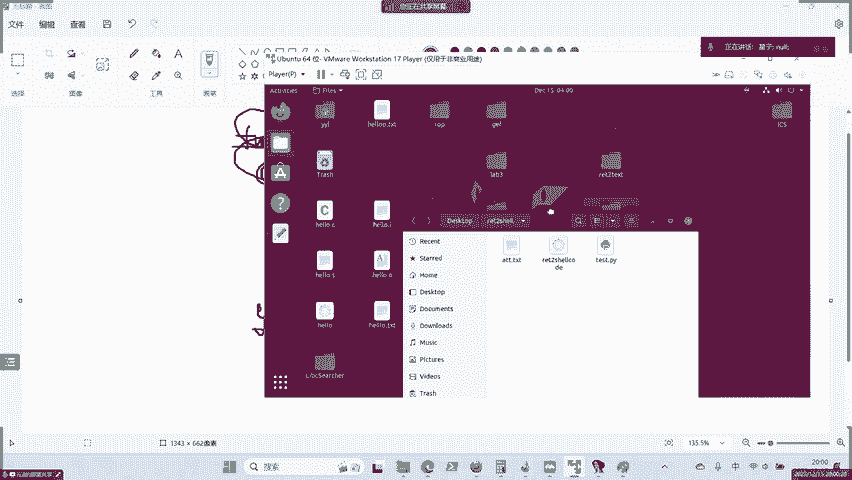

呃，流程是懂，但是。呃。大概步骤是知道的。那你们你们上课讲了那个函数掉落吗？就计算机系统那个课。就是那个。就是怎么站的那些东西，你上课就好了。哎，我们上课应该是讲讲过讲过吧，应。但他没讲，他不会讲吧。

他不会讲EBP那些东西。他只是会讲会保存一些东西，只是讲完图像。

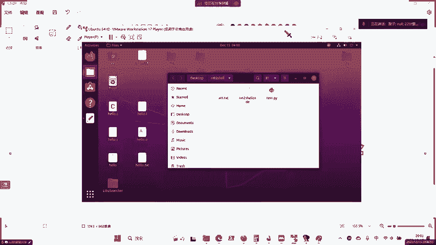

哦，对啊，你刚刚有一个地方就是说为什么你在IDA中看的地址和你最后执行的地址是不一样的，并不是你出了差错，而是。

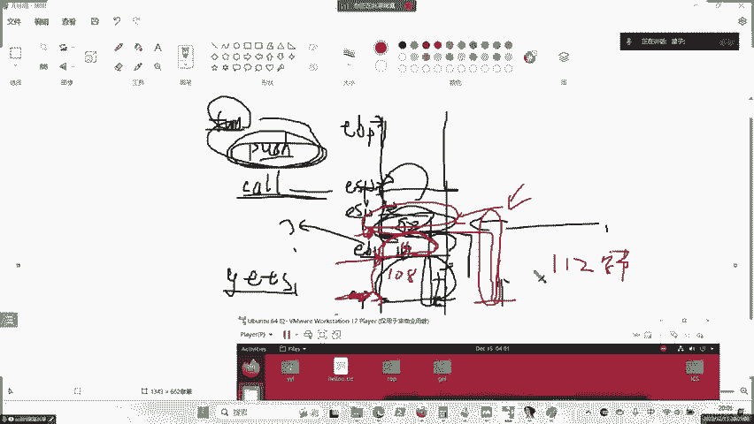

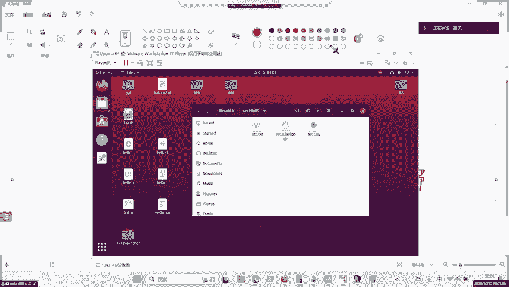

他他指向的并不是你打打开那个IDA。

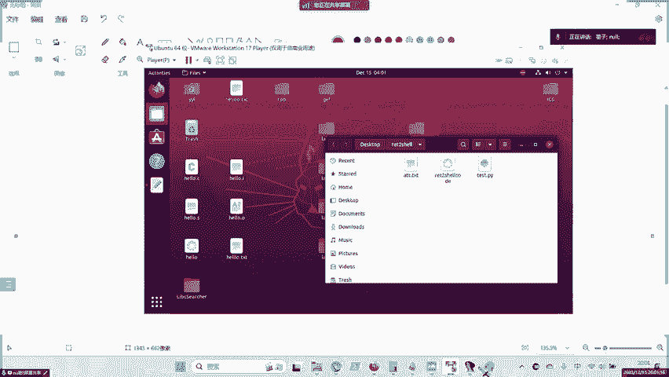

他他指向的。你点CQ还是对，它指向的并不是那个CQ的开头，而是这个地方。这个地方哦这个地方是什么？就是说他首先给sson函数先传了一个参数，然后就调用s函数了，相当于它就是。

为了执行这个sson函数的一个地址，就是先是它的参数，然后执行它。所以他就只想到这里。哦，对对对对对。对，想起来。搞错了。是的。就是目标就是这儿。

就是 system system code进入shall里。对。哦，张胜秋，你听懂了吗？我我觉得没问题。行。哦，那那应该可以，那那你接着讲。啊，那接着这。

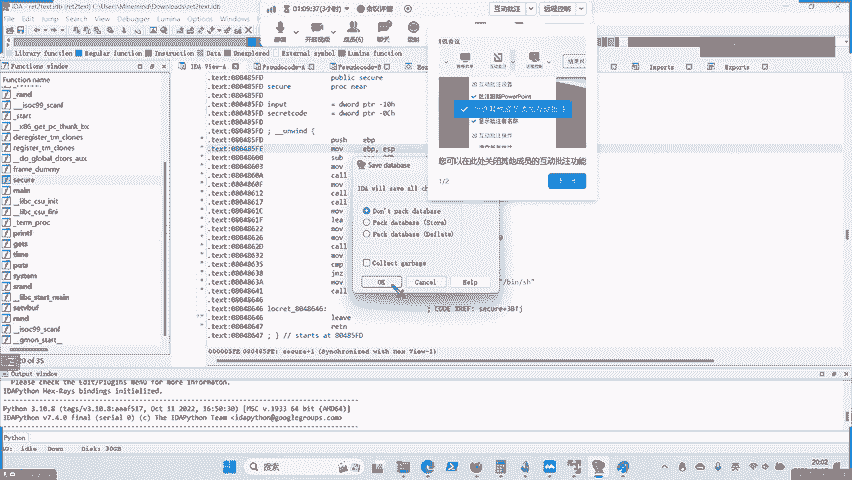

好，那这第一个就解决了，然后我们。然我们看下一个下一个是。

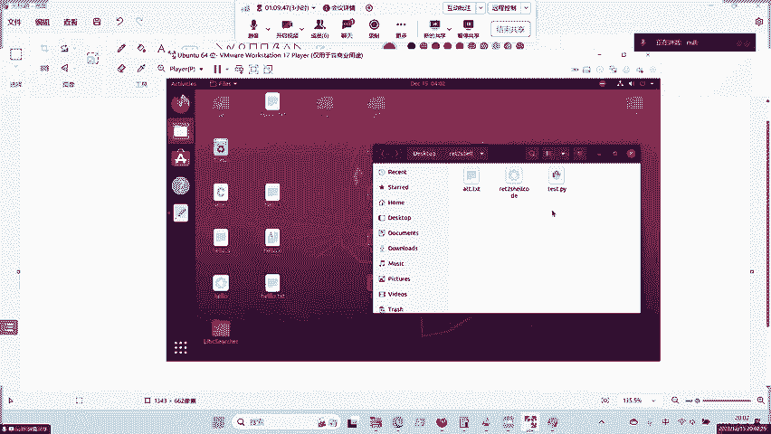

其实下一个我是没有浮现出来的，但是。主要是因为不知道为什么权限它不大一样。啊下一个是turn to show code。就是他说他自己写的代码中，就是你他给你的那个代码中可能没有执行。

刚才刚才CQ那样执行那个system code。然后选的yst。我们这儿呢。就需要自己去构造一个这种这种叫用system的这个代码。啊。把啲。这个应该。

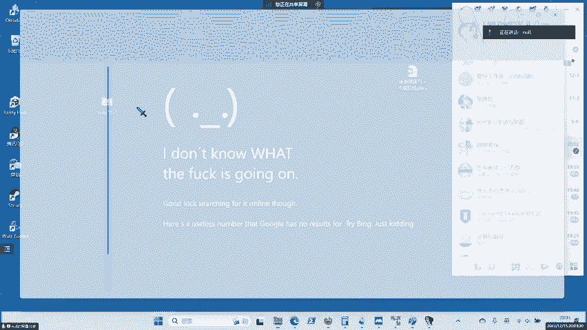

好的，然后这个里面。这个的内函数其实跟刚才也是呃大差不差的。都是有一个ge茨，然后前面都是。那是设设置缓东区的一些内容。然后就是。比如说我们要啊着手的地方啊，但是呢我们在这些地方都没有发现。哎呀。

不能这个。就是在这些的函数里都没有发现。呃，类似于stem的这种这种函数这种地方。所以说我们就要去自己去写。但问题是写在哪儿呢？然后我们发现他但把它读入之后呢，它又写入到了通过这个。

这copy形入到了bu分bu分，你可以双击它，你就可以发现它就是在BSS2。然后他又。还有100个那么那么大小的地方，就是这个地方。形容到这个地方，然后。只需要。假如我们能够在这个地方写入函数。

写入我们想执行代码，然后我们再跳到这个地方。我们就可以执行这个stem了。就是这样。

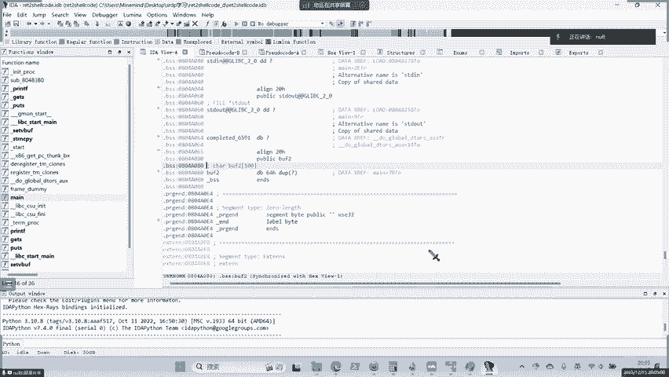

我判断。怎么跳到这个地方？呃，其实跟刚才是差不多的，你只需要把那个target设成这个地方就行，就是它的开头就可以了。呃。然后我们输入输入输入这个黑load的时候，是首先要构造一个函数吧。

构造构造一个机器代码，然后让它可以执行的。拷贝到这个8分的地方。然后我们可以我们自己写，毕竟很麻烦嘛。我们可以通过。PWN提供的一个叫sll craft。那会构造出一个呃sstem。呢种。

这样的一些机器代码。那ASM呢是法汇编。就叫他。诶。是汇编。反而变成机器代码。这样你就出出现了，我们是要扣的了。他其实他其实输出出来是一个是一个会编语言的。我们可以。

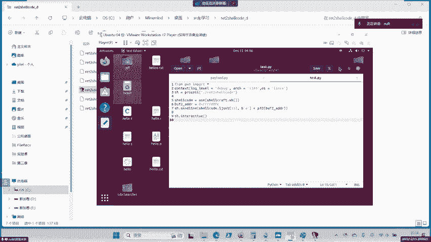

随便开一个进程看一下。Yeah。然我们现在可以。小口。等于。うん。对呀。然们再print一下。我们说看一下他是这种内容的。就是汇编语言。通过ASM呢。从ASM我们把这个汇编语言转化成机器机器代码。

然后放到C要code里。然，这这一行呢其实就是我们要跳转一下到那个华中区的那个地方。这边。这边还是够到那个payload的。哎，将它将这个是要扣的。呃，放到我们的。华中区。

然后后边再加上我们的球员的地址。你为什么要left adjust？他他是左对齐，他意思是左对齐，然后其余其余格的话，我是用。A，一共1202112个大小，然后。除了需要扣的以外的空空格的地方。

用用A补齐，这就是组对齐的这个效果。毕竟你要跳到开头，然后你要执情他，所以说需要首先进行做对齐。哎，我们可以。但但是这个前提呢是我们那个海城区是可以执行的。我们在GDB里调试一下。

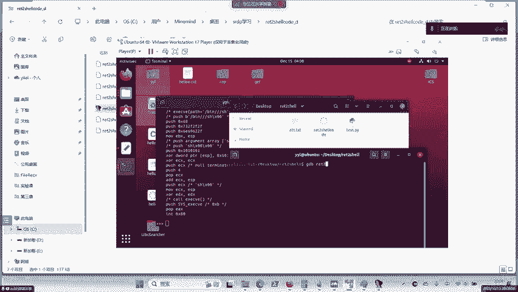

真没看。这面试个断点吧。然后我们再让他跑起来。如果你用VMMAP嗯，这是这个查件立的。命令他可以。看各段的这个这些。啊，权限。然后我们发现。要么就是RW，要么就是RX。没有没有一个WX的地方。我们。

没办法写入，虽然写入了之后，我们也没有办法执行。所以说这个题我是没有。没有一个拒蟹职业爸爸。我他看看。会不会？可。就今呢我们运行到这儿，我们再看一下。也是没有我们要想象的那那段地址。看。

就是buff这一块的话，它是084。0804A080。

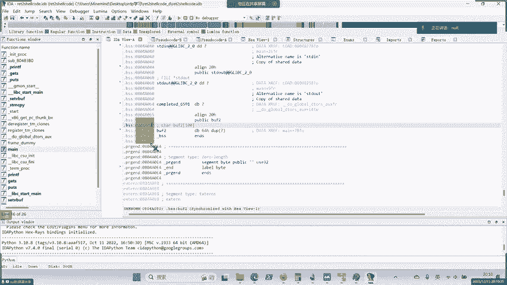

他是在嗯他是在。这一段的。然后他也没有权可执行的权限，所以说就到这儿了啊。还有有什么疑问吗？这个嗯有疑问我大概弄不了。哦，你你把你那个。呃，我我我很奇怪，为什么为什么他没有权限？因为。

因为这个t给的程序能不能执行，是在编译的时候确定的。所以就是。是不是下错了，不知道啊，我就点你用che一下。你缺个赛克一下。Yeah。都是没有任何保护的，可以看到。然后你把你那个派送文件的地址改一下。

安可能现在地址。你把那个什么FF的地址改成那个什么80的那个地址。哦，这个这个是我之前实验下看看能能不能再战区。

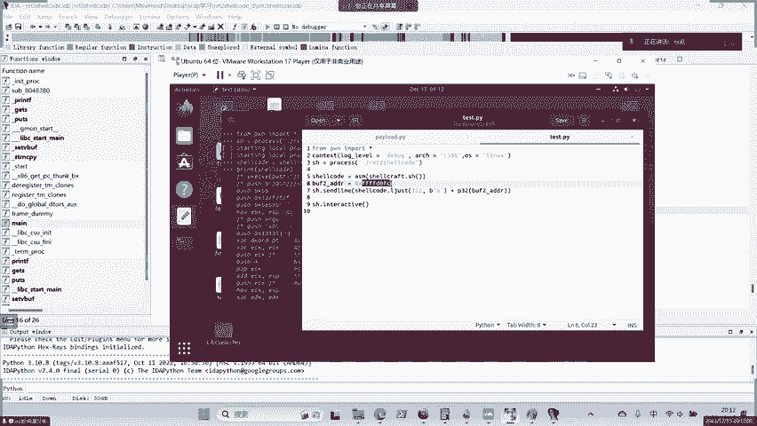

那战区也没有权限。Oh。那就可能有可能是程序的一个问题，你你改一下事情，再写一下。因为怎么说呢？我之前做的不是这套题，我给你找了这个，是因为他。

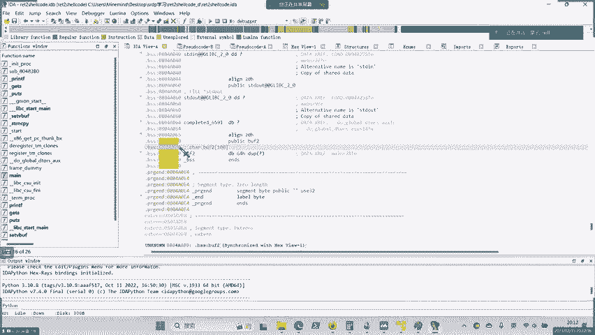

讲的比较系统一点，比较容易理解。哦。

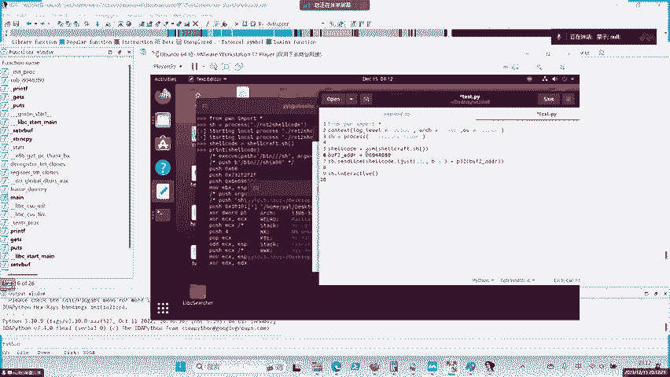

应该不会出问题。C。

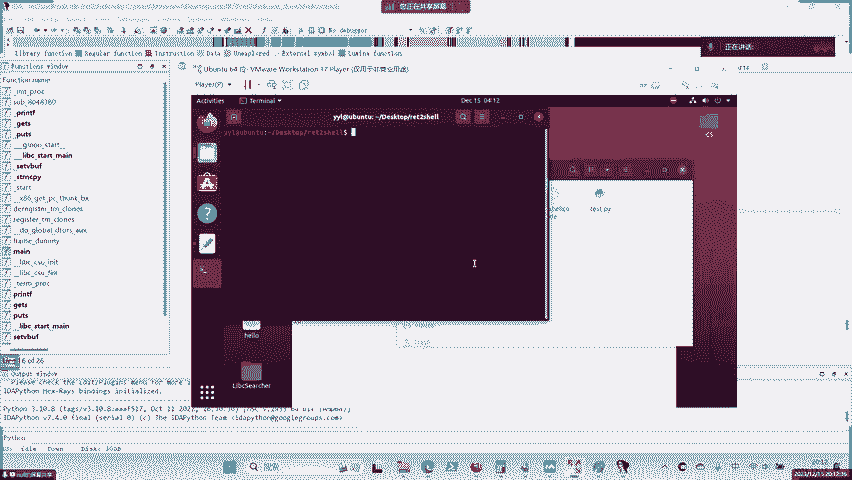

保存货了，然后。H。屁。

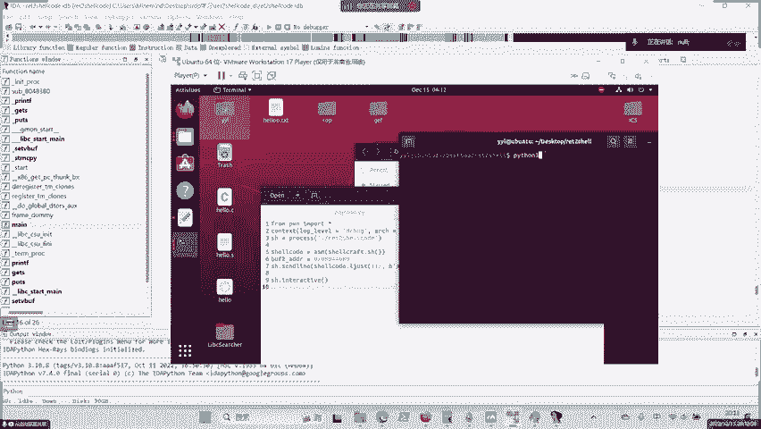

然后他就会结束掉。他就会退出了。他他其实没有或者这个相当于没有成。对对。那可能就是还是有可能有一点的。哦。那那接着下一个吧。哦，有一个点，我刚刚忘记讲了啊。嗯，你就把这个ID解扫出来。点一下妹，应该是。

然后放出他的那个。语言程序的爱爱服务。啊，对，刚刚就是刚刚他给我们讲了一个球。那个。偏移的就是用GDB调试的是一一种方法。还有一种方法就是你可以在这里看。你像这个地方输的是S。

然后然后他就告诉你距离EBP的一个距离了。然后再。对。然后再就是加上应该是加4的话或就是加班，应该取决于那个应应该是加4。32位应该是是加4，然后就就可以直接。不用刚刚GDB的方式。

他这里就已经告诉你这个离EBP的一个便宜了。啊，对，就是不知道是加4加8，应该取决于是要覆盖EBP的，还是覆盖那个。叫什么来着？啊，对，返回地址的那个地方我有点忘记了。100。加EC在。哦，你可ESP。

这不是不用看左边，看右边就可以了。然后你这个是64。然后。他那个。偏移可能有点问题，就是他那个112的偏移，你你自己用GDB是那个偏移吗？我记得是的。啊，那我后面做一下，后面就做这些切。

我我感觉有点不对，嗯我这应该是11。嗯，那你接下来讲第三个。行吧。可能是我搞错了。哦。

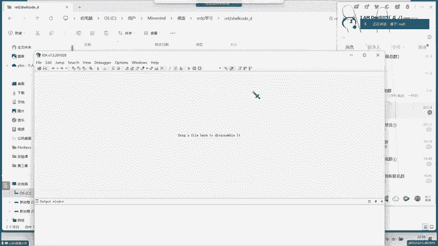

Yeah。

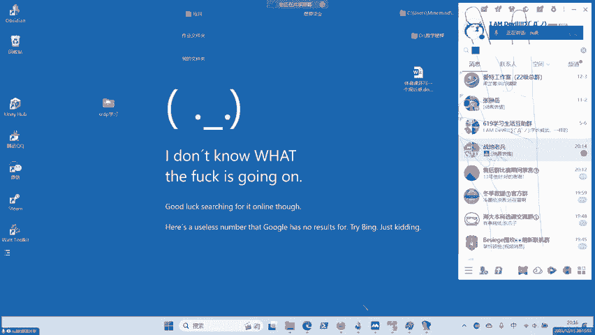

呃，第三个第三个就是。呃，最像ROP的地方。因为我们构造了这些，我们从。呃，原本的可执性文件中返回编，我们发现里面的有很多get，我们去。啊，找了很多get，然后我们用方用一定的方法把它们排列起来。

就构成了我们的攻击点啊，当然。主要是构造一个。这个什么。这系统调用的类似于是这个in特0叉80。就是这个这个指令。勾造出这个东西。

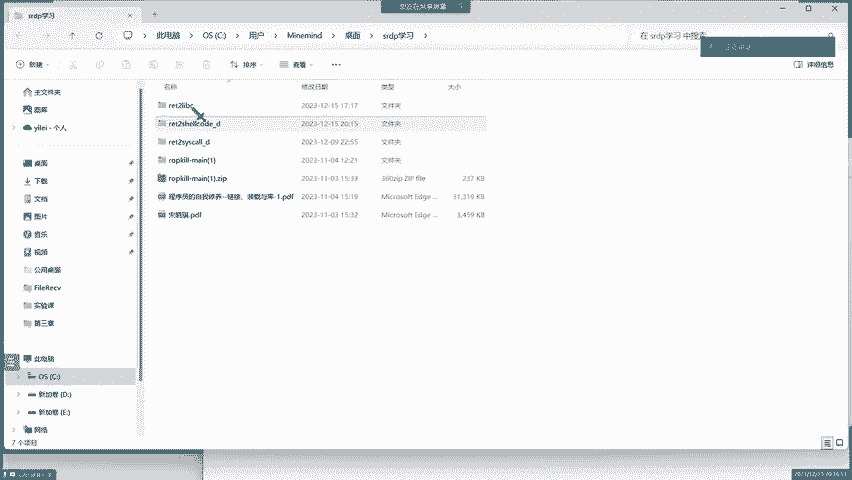

Yeah。

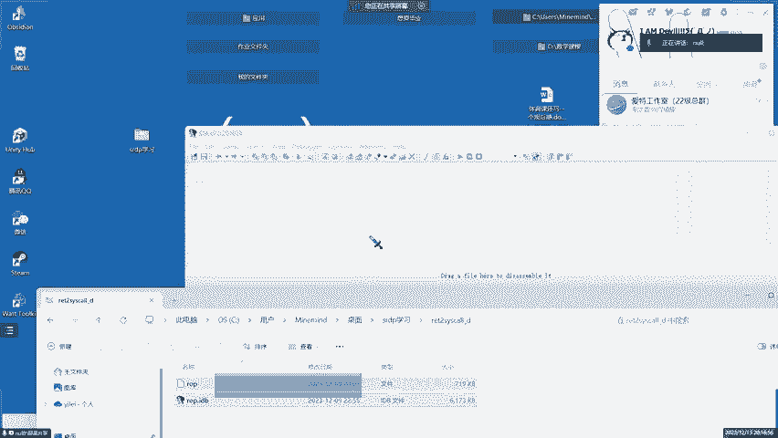

这么多啊。嗯。怎么回事出问题？哦。k。啊，我们看这个面函数吧，这个面函数也是有ge茨的。然后嗯。送给了一个。这是。嗯。这应该是地址，他给的。然后这这就是我们要下手的地方嗯。我们在函数里也没有发现一些。

比较危险的东西。反正就是啥啥啥也没有了，现在。

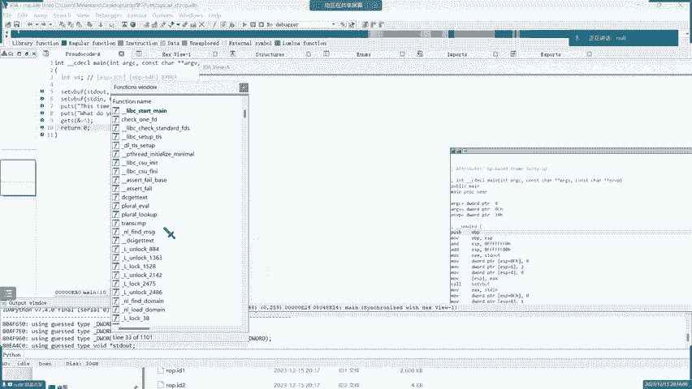

我们就只能通过get。啊，构造出那种那种那种程序那种链。通过改变啊寄存器，还有。啊，通过改变集算器的值。来实现我们的系统交友。

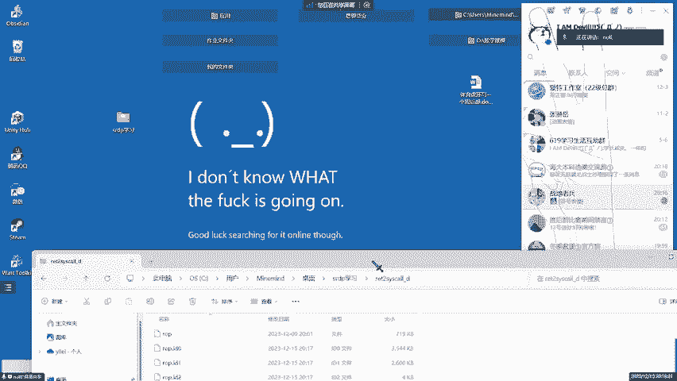

嗯。tick。啊，这个程序呢。啊，之前那个华华城区的大小不不用说了，我觉得。啊，这个程序呢就是。前面这两个就是get的位置。然后后面呢就是呃那个字符串的位置，还有像这个箱子用的位置。

至于这个get怎么找，我们其实可以通过这个LP那个什么RP gadget这个这个这个工具。

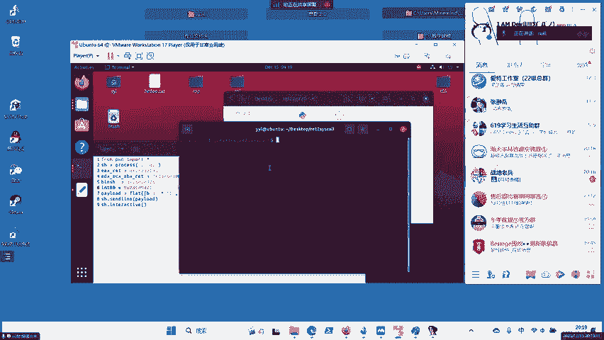

就是他在这里这里用的。我们可以复制一下。嗯。空gress会吹。然后这一条呢就是通过RP gadget，然后。这个是我们的二进制文件ROP，然后我们去寻找RPP pop return就这种类型的ge。

就是p就是可以改变。计算器的值，然后从它的输出中，我们又过滤出来改变成EX的值。EX的改进成那我们出消去出一下。啊，我们就发现。很多这种。Pop EX然 returnturn。啊。

这这一条这就是我们所要的，然后在前面给出来地址。就这个应该是对，是对应的。然后其他的EX，然后还有EDXECXEDX。这四个寄存器我们需要找到。因为我们调用的时候就是需要这些。

因为它的参参数都是存在这个计计算器中的，我们就。根据他的这个这个调用的这种规则。EX是0叉B，然后其他的。这个是。我们需要进行的指令啊。就是shall获取sll的啊，其都是这。能就达到这种效果。

我们找到了改变的这几种。自身器的这种get之后。他进去之后，我们。就可以。啊，对我们还得找到一个呃这个斜杠BSBI斜杠SH的这个地址。

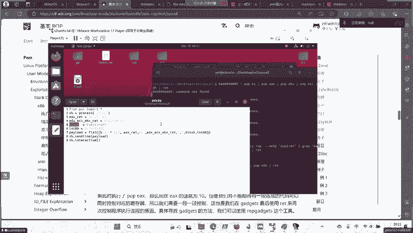

因为他他也需要存在计存器里。所以说但是我们geges的时候，你又不能直接直接输输输入，它也不会改变自行器值。然后这样我们。也是通过这个get工具。在哪来着？对，就是可以查找。字符串的这个位置。

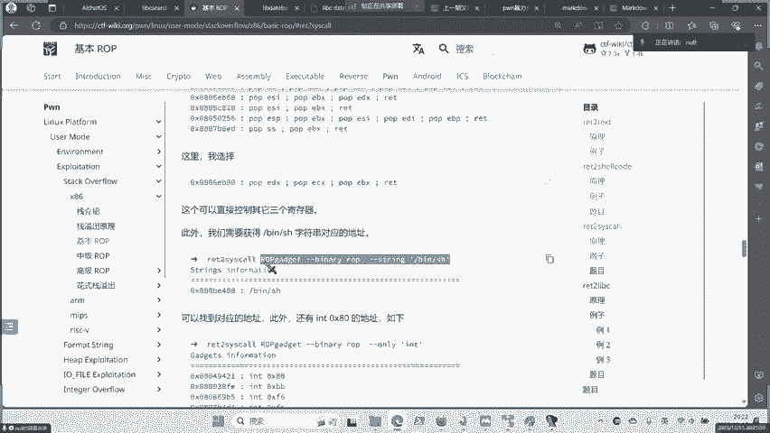

然后我们就得到了一个结果。于是我们就放在了这里。

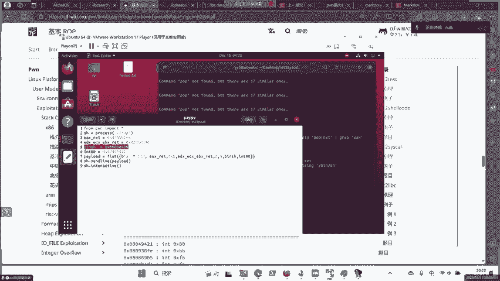

然后启动专用也可以通过它来寻找，就是。我理认。

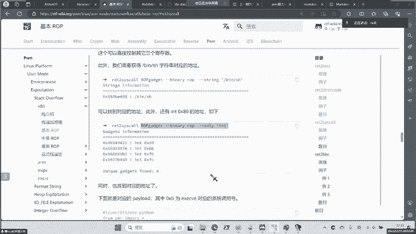

还没找找找到这一些对我们有用的片段啊，就是必须的这些片段之后。我们就可以把它地址都放在这里，然后我们去构造我们的beload。哎，我们构造的过程中主要是。

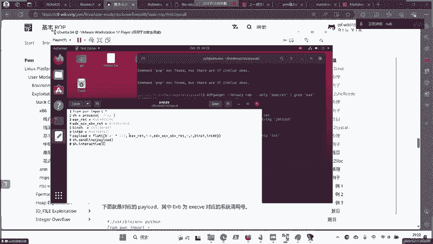

嗯。はい。全程。Yeah。比如说我们的战绩在这儿吧。我们关心的并不是从我们的缓冲区。啊，到站地。啊，这一块他到到底有什么内容，到底要写什？我们关心的是。我们把OOP覆盖之后，嗯，们把一就EP覆盖之后。

它的返回地址。网上的这一块部分就。这一块。就是我们主要是把它填充完之后，主要是构造了。估造的东西都在这一块储存的。

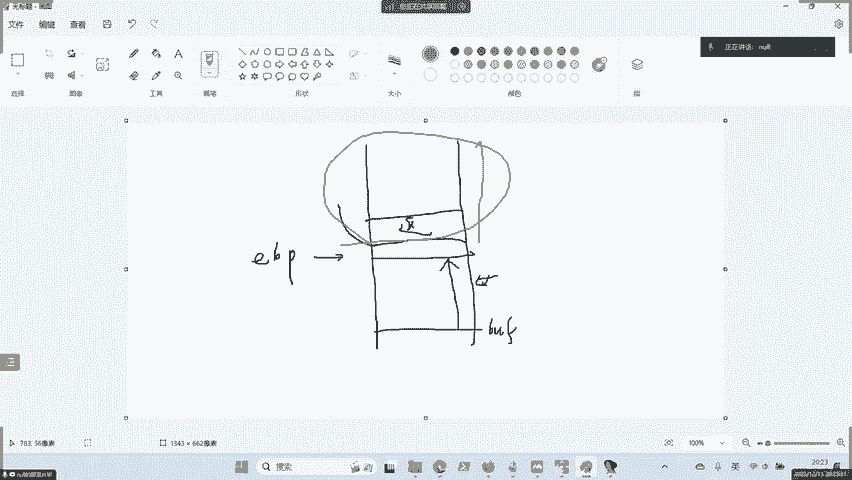

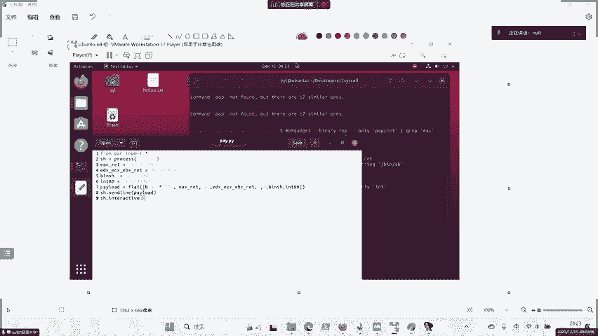

然，第一个就是把这这个flat flat。就相当于把这些都平铺到一起。呃，是非常方便的。然后我们第一个首先是把这个缓冲区用112个字符都填满掉了。就把这块的地方都都填了。嗯。

然后我们再将这个一E改变EX值的。这一段。这个地址放到这个位置。诶。啊。中标吧，别乱。放到这儿。然后下一步我们放的是0叉B。啊，那是一个数据一差异。就是我们。执行完这个函数，然后我们返回的时候。

我们就会。到到达这个我们的指令就会到达一hoEX。啊，这个泡泡呢。就是我们return的时候，我们的ESP本来是本来是只在这个地方的。然后我们return return完。就指向了我们这个数据。

现在我们pop EX。就会把这一块数据放到我们的EF集算器中。然后接下来。我们就继续将其他的这该制的片段给地址。因为它最后会跟一个return嘛。泡泡完之后，ESP会指向这儿。站点会指向这儿。

我们return就直接return掉return到了这一块，它指向的那那那一段地址上。呃，我们就只需要。鼠标呢。啊，我们就只需要。咱这一块他的地址。放到这个地方，然后后面。

因为它是改了好几个寄存器的内容，它会p很多次。所以说你后面再在写数据的时候，你就要连续写几个你想要的数据。就是00，还有你这个字符串。这个数据，然后将最后加。这个中断。呃，可以说系统调用的。

这个地址放放到最顶上，然后他就会开始调用了。然后因为我们的计算器已经被改变了，这时候。我就可以得到我们的信。

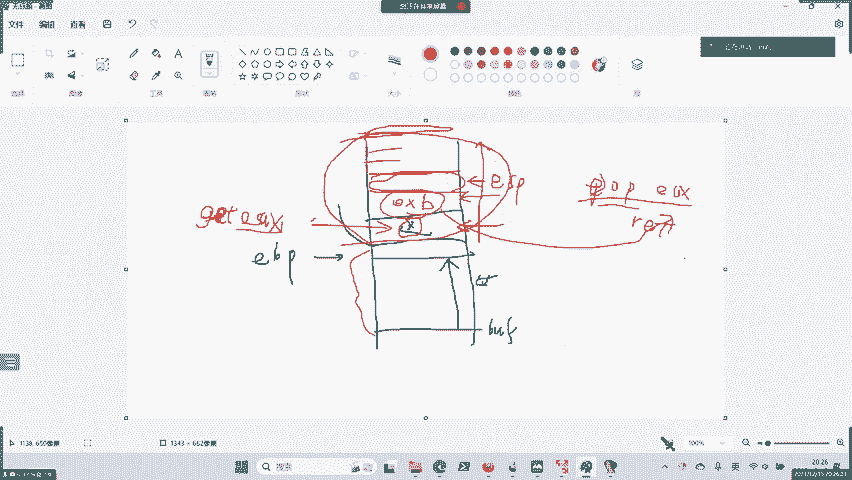

原理是这样，我们可以直接运行一下。

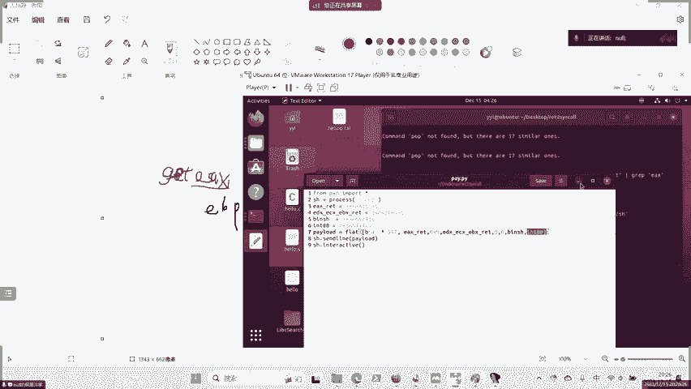

然后我们就发现我们就已经可以I。好，这这就是第三个题。

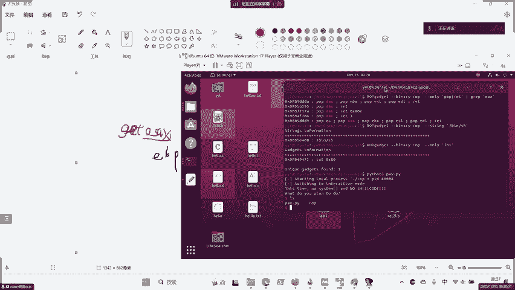

哦，这的还还挺好的，就是呃有一些我我再补充一下，你你放到你画的图的地方。嗯，他讲的挺对的，但是我们不能认为就是就是比方说当这个是泡泡EAX的时候，这个时候理查被填充的时候，嗯，他他为什么就是之后。

就是这个会把这个B放到EX中。和之前的这个这个这个位置是返回地址没有关系，这个没有关系。我想说的是，而是因为它就是正常的一个这个执行。因为这些都是空的，就是你乱填的东西，他不会执行。然后到这里的时候。

相当于是一条poEX的指令，他把它拿出来了执行。然后这个操作他就会把最站点的值弹到计层器中。因为这个时候他拿出来执行，那就他一经指令了，所以站点就是零差B了，所以他就会把站点的元素放在EX中。

后面的所有谈的也是呃如此。然后你放一下那个那个页面。嗯哪个？嗯，这个就是。浏览器的。嗯，VK的那边也没。就是你你应该跟大家讲一下为什么需要这些计算器。为什么没有设计？对我我我跟大家说一下就这个地方。对。

这个地方呃，他说了，就是他希望最终执行这样的一条语句。那这个语句的话，他就是分别。就是首先要执行这个函数嘛。那其实在new6中，它。这是一个系统调用的函数。系统调用的函数。

它在最后最终执行的时候是利用的这个调问号来执行的。所以所以你只要找到它的调用号是多少了。那这个调用号为什么是零差B，你你可以自己去搜32位，一定要搜是32位。因为这个程序32位的呃，系统调用号表。

你去搜一下。就能搜到这个异常啊，这个这个是那个设联个B，然后就是它后面的它的参数。分别是这个冰雪，然后这个就直接填地址就可以了。然后这个的话一般都是为0。

所以才是才是提到我们刚刚为什么需要改这些计算器的一个内容，然后并且他们内容应该是什么？就是就为什么。哦，然后就是还有一个点，你我想我想试一下。你你把你的程序这个这个地方你改成104执行一下。

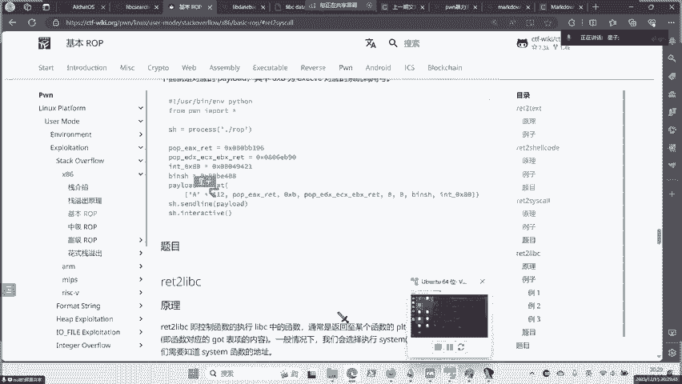

O。

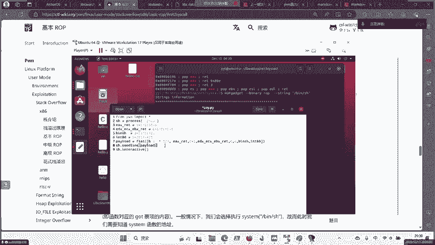

。然后就告他UF了。等下先会撤。嗯。真奇怪啊。IS的话也是不行。那你把第二个改成104。Yeah。第二个。嗯。😊，这个。我现在感觉这个偏移有一点奇怪，有点问题。很奇怪。So分。

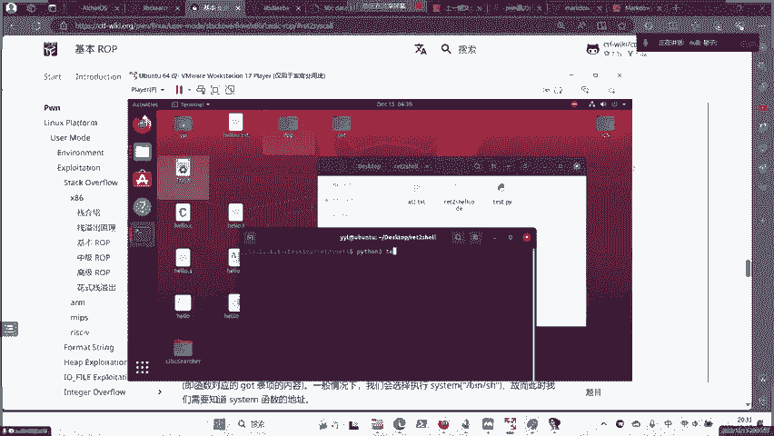

啊，他是卡的UF对，但嗯你你方开翻那个浏览器就是只上浏览器的地方，它明明。说的是错误的。我想回来。嗯，那就直接翻那个return to six吧这。就这个地方你停一下停一下哦，往上一点。对。

这个地方他说这个V似相对EBP的偏影是108。他这个。不是计算错误了吗？嗯。就是他为他为什么。不是，那是返回地址，你这是返回地址，是EBP就是说他他直接得出来这个是108。很奇怪啊。

因为上面是64这个是吧？知道。64是100。失败。Okay。Yeah。啊，我再看一看这个点吧。64就是100。对我看一看这个点。哎，哦，我知道了。因为他都是。那这个IIDA出了问题了。哦哦。

我知道他为什么是那个。他为什么说是那个。因为因为他这三个程序的偏移是一样的，你开你的。浏览器就是那个界面。因为你第一个就是。点 return to test。对王晓华。那就是可能是ID出了一点问题。

因为一般这个地方呃这个地方。与与咱们实际实际的便宜是一致的然后这个可能有点不一致。我往下，你这个地方是64吗。对我这也是。你你往下滑了。我那个。然后他告诉你了，又。我想。再往下了。啊。啊，对对对。

这里他他告诉你用这个这种。这种方式获取到了它这个偏移是0XC啊，这种你你用这个方式肯定是最准确的。我我想说的是啊，但是一般情况下。用IDA是没有问题的。呃，如果大家不是很确定的话，你去做一下那个第。

有有CTF的题。你试一下，是不是就是说。就是你拿IDA的试一下，看看能不能成功。大家有空以试一下。你的权利回下也行，行。嗯，刚刚第三个例子大家有听懂吗？生村主义。喂，能听到吗？能。哦，差不多差不多就是。

那个从那个。嗯，他的讲解中大概差不多。但是就是但但就就你刚才讨论那一部分还是有点不清楚。就是他他前他前面讲的那几部分是没问题。你说的是那个偏移吗？对，就你们后来讨论那一块啊，偏移我我可能需要再看一下。

它这个偏移和IDA的是存在差异的。要当然你不是他当然你们。以GDB的为准啊，因为GDB是程序真实运行的，所以那个是最准确的。你你能看懂原理就可以了，偏移的计算嗯不是最重要的，没有关系。

就是他它是一个关键，就是如果你写的不对啊，你可能就没有办法攻击成功。但是。但是你计算错误了，不影响你对这个攻击的原理的一个理解，对吧？嗯，所以只要能理解他的原理就行。那今天就这样。都挺好。

我还以为你们学不会呢。😊，那还挺好哈哈做了一整天。😊，做了一篇。还行啊，你是三道题做一天。我当初是一道题走了一天，谢谢还行啊。系难。我觉得你讲的很好，而且讲的很清楚。谢谢。😊，这个挺好的。

就是大家有问题。就可以问一下线像相关的。😔，这是负责的这。那今天就这样。拜e拜。😔，那个学姐，我下次这个ID要讲什么内容啊？这是。讲一些常规的用法。就是就他刚刚其实相当于只讲了一个用F5的那个。

然后可能还有一些其哦，就把其他功能给讲一下是吧？大概讲一下，然后你顺便再讲一下那个IOPge，因为他他也只讲了。搜索那个gadget的嗯ROPgadget，还有一个是。构造链的就是它可以给你生成。

剩下那个叫什么来着？E叉P的那个代码，你你他有些能成功，有些未能成。你可以自己试一下，试一下他哪些情况下能成功。然后你把他的那个生成的那个E叉P的文件运行一下，看看能不能成功。对，这个也讲一下。

就是ROT该进的这个工具大概也讲一下。嗯，好的，行。好，然后那你们下一周就。就是你们什么时候什么时候期末考试。1月14号就开始了吧，快了，还有两周了。啊，写的是13号啊，不对，两三周三呃4周一个月。

不说我就说明明有一个月，怎么就两周嗯，你你们现都快接课了。有些还有还有需什么时候复习，就是你们需要多久复习？因为如果呃如果需要比较长的时间复习的话。😊，那我觉得可能就不太有时间做题了。

因为这个做题还挺费时间的。估题大概2到3周吧。嗯，需要背的东西比较多。行，嗯，那那这个就可以先做一下return to c的。但是呃我们放到那个你们你们考完试之后再讲。可以的。好的。那就这样。

那我先拜拜了。O学姐再起。学姐。😊，我结束会议了，就给他起来然后就嗯嗯结束会议是吧？

