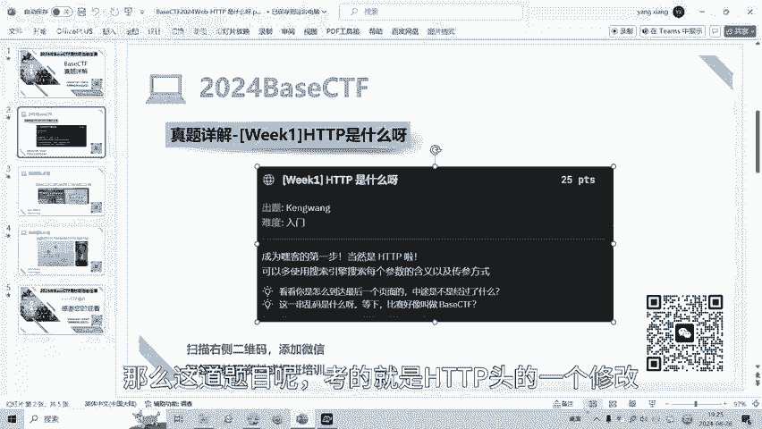
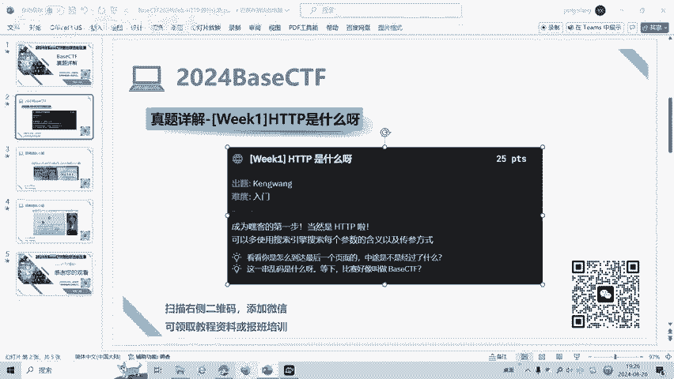
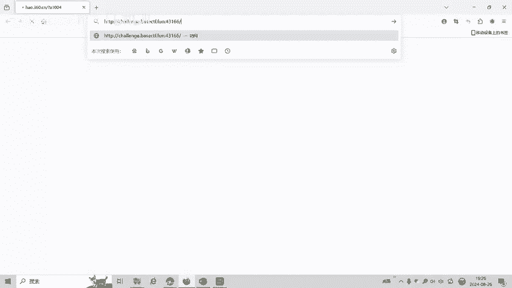
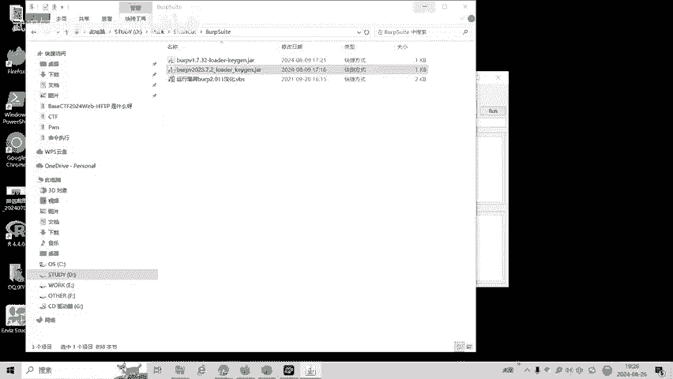
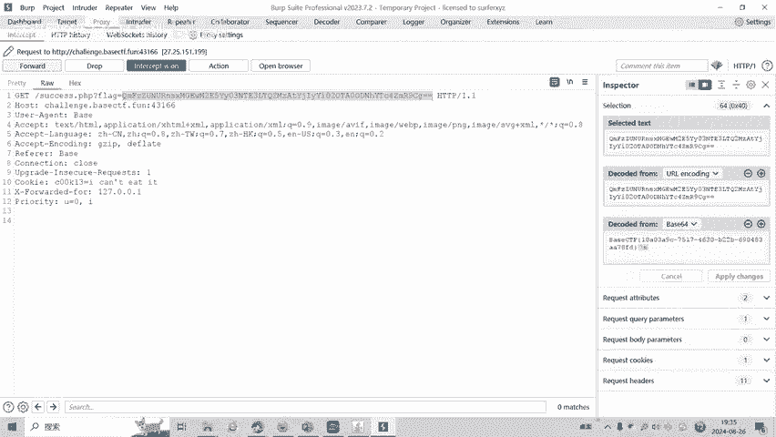
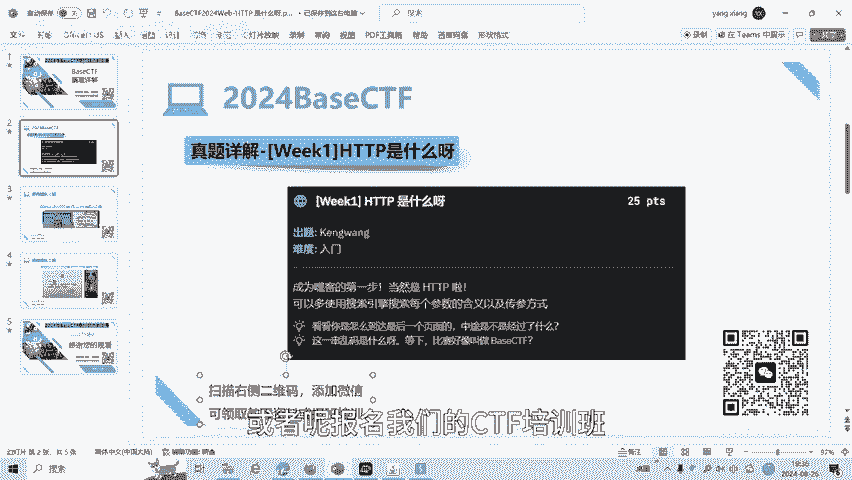
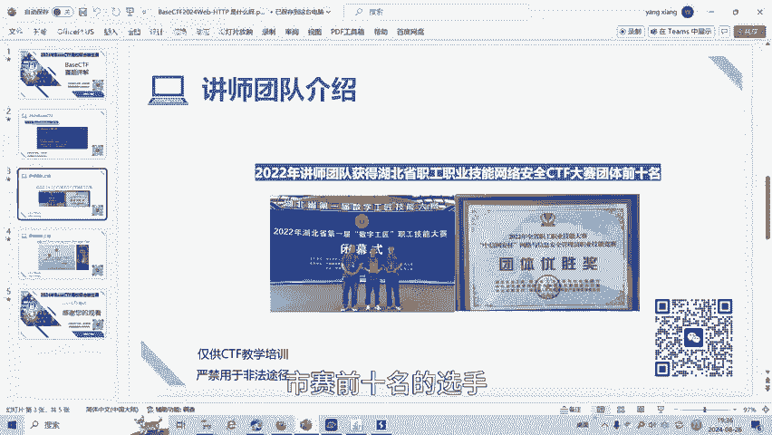

# 2024BaseCTFWeb篇HTTP 是什么呀-BP修改http头 - P1 - 武汉网络安全CTF培训 - BV1hAspeqEe1

大家好，我是阿阳。本视频为2024年baseCTF高校联合新生赛赛题详解视频。今天讲的赛题为HTVP。我们可以看到题目的描述为HTP是什么？可以使用多种搜索引擎，搜索每个参数的含义以及传参方式。

那么这道题目呢考的就是HTP头的一个修改。

我们可以看一下题目的网址。他要求get传参传被CTF传的值呢是这个，然后pos传参。传串名为base，然后呢需要传入flag。cookie传舱呢传的是这个变量名，cookie名。

cookie的值呢为这个用户代理呢为basere为base，你的IP为127。0。0。1。当这些都传入正确的时候呢，才有可能。得到我们的flag，那我们看一下。

我们首先。把浏览器打开，用BP抓包。BP呢可以修改各个参数的数据包，当然也可以用hel个霸火锅来做。

我们秘密抓包。然后呢，抓到了这个包，我们send to repeatpeatal重放模块。这里呢要求我们get传参传被CTF我们复制一下。穿餐。传舱给的单是问号。Base。复持一下没复制过来。等于。

不要看嗯复制过来。然后呢，紧接着呢，他要求pose传仓传flag。我们呢这里可以修改。产餐模式。前景request method由get变成post。大家可以看到这里原来的get变成post。然后呢。

这里的值呢，我们复制一下，他把这边的ge的值呢也修改成了pos传它的值了。我们复制过来。然后呢，pos上他穿的是被ase。只呢是flag。然后呢，还有cookie串串。我们可以手动敲一下。CO。

 O KE cookie。会位船舱船舱的会费变量名为这个。等于。I can't hate it。并且呢用户代理为base。那么这里用户代理。我 base。Agent。

 user agent replace。来yuanriver的 base。revo这里还有没有，我们就手动打一下了。Real with base。你的IP差 four。会追的。那我们发送一下。是什么？

点击re，我们看一下返回的界面。可以看到脱子传舱正确，co毙传舱正确。用户代理来源，你的IP都正确。叉 forty four呢，它表示的是这个IP来自于哪里？它的代理IP来自于哪里？要求是本机IP。

所以我们修改叉 fortyty four为127。0。0点1本机IP。然后呢发现呢get传单不正确。第二三条不线，请注意UIR软页。我们当前传值是WEECME。嗯，他把00呢进行了一个转移。

00呢转移成了空字符。那我们呢。为了避免。幼儿呀被转移，那我们呢。把这个百分号进行一次转移UR编码。有时25%。经过盖船餐。它会进行URL解码解码成的百分号，从而呢25%00其实就是00。

我们再胜了一下。可以看到这个时候呢就出现了flag等于。我们选中它，发现它是贝64编码，进行贝斯6解码之后呢，就得到了这道题目的答案。当然这道题目也可以用。黑客把来做，我们可以用黑河把做一下试一下。

我们关闭BP。然后用黑个棒来做一下。第二种解法就是喝个棒。加载。我们要求get转餐。BaseCTF。等于。这个。破自传舱ba。等于。rival应该等于多少？rile是等于贝ase，来源等于贝斯。用户。

带理agent。用我代理回权状态。也等于背死。cooking值，我们选做cooking。阔北。名为边量名为这个。等于。我们记得这个地方呢是进行的UR编码，我们改25%。还有个查夫里服。127。0。0。

1。我们确新下看一下。发现cookie哦，这里它应该是不用加这个头的，它这有R呢，就是rivo。嗯，直接添加变量的。内容值就可以了，我们再。发送来看看。看不到返回看不到返回。要要是这个题目呢。

看不到返回之后呢，那我们还是要用BP来抓这个包。比如说我们到了终点呢叫thank you点PP。把B给打开运行一下。Then to repeat。或者不是呢，我们服了一下。

这是我们hel bar传进来参数。贝思。baseac it17001。pos传哉。盖子来我fo了一下。我们通过BP包的。一个个的放包发现这里有个fllegag。我们就得到了我们的答案。

好了，大家呢如果有兴趣进一步深入学习CTF可以扫描视频中的二维码，免费领取工具资料，或者呢报名我们的CTF培训班。我们的教师团队呢均来自CTF省赛市赛前10名的选手。

通过顶尖战队的手把手指导，大家学完之后即可达到省赛试菜的夺样水平。好了，今天的贝CTF赛题详解到此结束，感谢大家的观看。喂小狗。😊，🎼小狗乖乖。😊。

