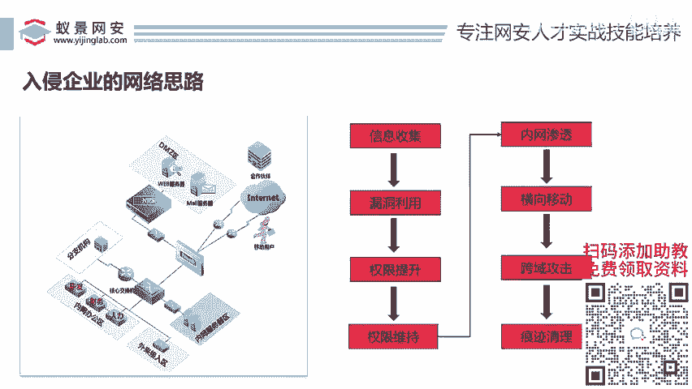
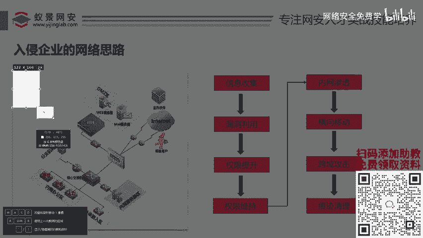
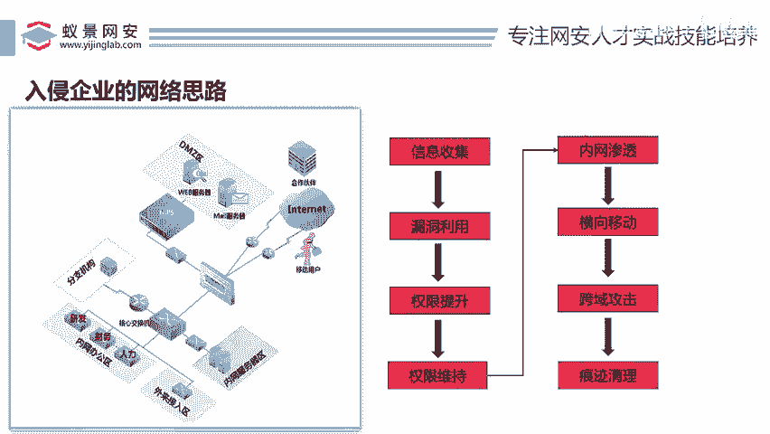
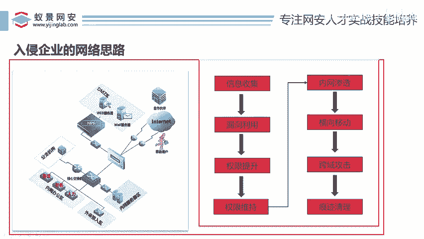

# 2024B站最值得看的黑客教程 ｜ 网络安全／渗透测试／内网渗透／漏洞挖掘／web安全／kali linux／红队靶场／CTF／信息安全 - P100：入侵企业的网络思路 - 网络安全免费学 - BV1uBsTetEow

好，那接下来我们来看一下入侵企业的思路，就是说这个靶场啊，很多人说我只会很多人是这样的，因为我也了解过啊，很多人只是会打靶场，但是并不会搭建靶场，甚至他对整个网络结构架构他都不了解。

所以呢在这里必须要给大家讲一下啊，一些入侵网络的入侵企业级网络的思路跟一些架构流程。好，我们都知道对不对？就是说。😊。

做东西有一有二有三有4，它是有步骤的。那么同样当作为一个黑客来说，或者作为一个渗透测试工程师工程师来说，或者说作为一个红队应人来说，你入侵一个企业，他一定是有步骤的他不是瞎打啊。

对我们因为我们直播间1000多个人，对不对啊？我们不是瞎弄啊，我们不是说哎闭着眼睛，用起的开了，你度瞎搞，不是的，他是有一有二有三有四的，对不对？那这个步骤长什么样子。

在讲这个步骤之前，我们得先了解一个公司，一个企业的网络架构是什么样子啊，什么叫网络架构？哎，就是说这个网络的一些计算机的分布，对不对？

哎，网络计算机的分布到底什么样子？好，我们来看一下，对不对？😊，好，对于一个企业来说，我们知道企业里面会有研发人员，会有财务人员，会有人力人员，对不对？就会有不同的部门。

那么不同的部门之间它就会有不同的什么，都会有不同的电脑，对不对？比如研发它有自己的电脑，财务有自己的电脑，人力有自己的电脑。那么这些的电脑都在办公区域里面，对不对？是不是都在办公区域里面啊。

他们都会在自己的办公室，O那么同时呢对于一个企业来说，他们还会有自己的官网，哎，比如官网在这一块，对不对？邮件服务器在这一块，对不对？还有呢什内网服务器哎，在这一块，那么我们黑客一般是在哪呢？

是不是在这个英特尔这一块，就是我们是在互联网上，对不对？我们先会入侵到这个企业，那么这个企业里面可能存在的成千上万台电脑，对不对？那么你要对这个机构里面的。

或者是对这个公司里面的网络有一个架构要有一个了解，对不对？好，那这里给大家说一下，首先这里主要就分为两种网络。第一种叫公网，第二种叫什么内网啊。😊，所以我们渗透一般分为公网渗透跟内网渗透，对不对？

公网渗透是什么意思？就是说你可以直接访问的机器叫做公网。比如说我们的外部服务器啊，你在你家通过浏览器就可以访问到的电脑，它就叫公网，比如说我们的一个公司的官网，你是不是可以直接访问啊，那这个就属于公网。

那么他们公司的内网，比如说研发人员的电脑，你是访问不了的，对不对？那这个叫内网，那么你想控制它就要借助一些手段，那么我们一般是怎么去控制整个公司的。比如说这个公司有一万台电脑，对不对？

我们一般是怎么控制的，就是说先从这个互联网上打到他们的公网的DMZDMZ就是他们公司的公网，对不对？然后通过公网哎入侵绕过这个防火墙进入到他们公司的内部系统，然后通过这个内部系统再入侵到内网系统啊。

或者说先入侵到内网再入侵到办公网都无所谓，对吧？就先进外公网，然后再进入内网，从而就把整个网络给它控制下来了。好，所以看起来这些比较麻烦，所以。😊，看起来就比较麻烦，对不对？但是它是一定有步骤的。

所以李哥在这给大家讲一讲啊，一个入侵这种企业一般的步骤是什么，对不对？来给大家讲一讲，对不对？第一步啊，叫什么叫信息收集技术，也就是我们的什么公网信息收集啊，这里大家要要记住，对不对？

是公网信息收集技术，信息信息收集技术是什么意思啊，给大家说一下啊，就是说比如说你要入侵，我假如说这个是我们公司，对不对？我们公司有一个我们官网在这一块好，我们公司名字叫怡井科技啊，现在我就给你个名字。

好，你去入侵一下怡景科技没有了。对于一个对于一个红队人员来说，他只知道这个企业的名字就叫什么怡景科技没了。😊，其他的还知道吗？其他的都不知道，对不对？

所以说呢我们要针对怡景科技这个东西进行一系列的新收集。比如说这个怡景科技在哪里啊？怡景科技的网站是什么？怡景科技这个邮箱是什么？怡景科技的法人是什么，对不对？我们只有说知道这些怡景科技的相关企业信息。

对不对？然后就可以利用漏洞了。😊，比如说你已经知道了，哎一经科技对吧？有哪些电脑有有些有些东西，对不对？这个叫新数据。我啊举个例子你们就知道了啊，比如说呢。😊，我给这个新收集什么意思啊啊？

就比如说啊你是个啊小偷啊，你是个小偷啊，小偷哎，你要怎么？哎，你要你是个江洋大盗，对不对啊啊，比较厉害的小偷啊，你要去偷一个城堡，哎，城堡里面有很多的财富。那你第一步是干嘛，肯定是踩点啊，对不对？哎。

你围着这个城堡转两圈，看这个城堡有什么后门没有，哎，这个城堡有没有人巡逻，这个城堡有没有监控，哎，这个城堡这个墙高不高，对不对？第一步是不是踩点啊，你得先旁边观察个几天，然后再准备自己的实施计划，对吧？

同样我们新收集就是针对于你要入侵的企业，哎，先给他收一下，收集一下，网上找一找，百度找一找是吧？佛法找一找，哎，找到了这些相关的一些薄弱点之后，我们就利用漏洞，可以攻击这些企业了。哎，攻击完成之后，哎。

就可以干嘛了进行提全了。😊，啊，城堡里面有没有有没有美女，那你得攻击进去之后才可以搞，对不对？哎，利用完漏洞之后，就代表什么呢？这个漏洞一利用就等于你把这个电脑给它控制下来了啊。

那这个漏洞就是我们说的CQ入文件上传呀，插SS呀，对不对啊等等相关方式，对不对？接下来就要进入另一步叫提权，什么叫提权，这个一会我们会讲的对吧？以在这里我先提一嘴提权就是你控制的这个电脑的权限不够啊。

不能做一些高权限。比如你控制个电脑，你想给它关机，但是你发现你执行不了关机这个命令，原因就是你的权限不够。那么这个时候就要提权。哎，就是要提权了目的就是为了干嘛呢？为了提升我们权限。

从而执行一些危险的命令。哎，那接下来呢就要进行一步叫做权限维持，哎，就是我们的什么后台后门技术，后门技术是干嘛的？就是说哎你把这个电脑控制下来，拿到最高权限了，还不够，还有一个问题是啥？

那假如说有人把这个电脑的漏洞修复了，那你是不是就进不来了呀？是不是那这时怎。😊，你一样，你入侵到一个城堡了，你进去现在开始偷了，对不对？你偷了一天没偷完，你发现里面还有80%的金银财宝，你没有偷完。

那这个时候你然后你又发现哎呀我承了，我是当时是敲玻砸玻璃进来了，然后呢这个主人又快回来了，他发现这个玻璃要是碎了，那不是凉了嘛？那么明天是不是进不来，他把玻璃换成防弹玻璃，我就进不来了。

所以这个时候你就想办法，对不对啊？你在城堡里面挖一个地道，对不对？挖到你家。那么第二天呢你就趁着个地道再进去，哎不就可以了嘛啊？那这个权限维持了，就是我们的后门技术，对不对？

我们要在这个电脑上开一个后门，让这个管理员发现不了，保障我们随时随地可以控制这个电脑，哎，这个就叫权限维持。好，那么权限维持之后啊，也就把这台电脑给它完完全全的搞定了。

那么接下来就要进入我们的内网渗透啊，通过这台电脑对不对啊，入侵到我们公司内网，对不对？入侵到我们公司内网之后横向移动，就是把研发通过研发入侵到财务，通过财务入侵到人力，通过人力入侵到内网，哎。

这个叫什么？😊，叫横向移动。哎，跨域是什么？跨域就是说哎这个公司它只是北京的那我们从北京直接就给他入侵到广州的分公司。广州分公司直接给他入入侵到上海分公司，明白明白？这个叫跨域啊。

把它的整个域里面全给它控制。那么最后一步就是什么？把你做的这些操作全部给它清理掉，痕迹清理掉。理解没？哎，那这个呢就是整的一个听好了，我现在讲的这个步骤，它是什么？它是完完全全整的一个渗透的总流程。😊。

谁来了都是这些，明白没？国外是用这些的，国内也是这些的，对不对？那这里别看它只有4个字儿，但是每一个四个字的背后掌握的是无数个知识点。😊，明白不啊，每一个知识点，每一个知识模块。

你可能都需要用两年一年时间去学。光漏洞利用啊，就找我们的外b漏洞这一块，很多安全从业者在这块就学三年。两年。对不对啊？那维持内网这块，很多人一学就是学一两年，对不对？所以路漫漫起修远兮。

所以网络安全这个路大家一定要坚持内容是比较多，但是它的总体思路它就是这样的，好不好哎。好，把这个入侵网络思路之后，我们就知道我们主要的是干嘛，先入侵我们公网，然后再入侵我们内网。

那我们今天的实验也是如此啊，所以大家就来看一下我们今天的这个操作到底如何进行实现的，好不好？

好，那么接下来就带着大家啊没有搞懂遇到的啥。还有人说哎啊我老老师我没有搞懂玉什么啊，什么上海北京。😊。

哎，这个玉讲了一下，没听懂，对不对？没有关系。因为今天的课我们就会讲玉。哎，所以说这里你可能一知半解没有关系，这概念不懂。啊，今下来我们会讲工作组跟玉懂不懂啊，我们接下来会讲的，你不用担心啊。

不用担心啊，以后讲不讲蓝队，我告诉你，你把这个会了啊，蓝队就是手拿把掐啊，未知功胭脂房啊，其实世界上本来就没有蓝队这一说的啊，都是红队好吧，都是红队啊。😊，你想成为牛逼的蓝队，一定要会红队技术。

懂不懂啊？你不会红队技术，你就是个菜鸡啊。

