# 2024B站最值得看的黑客教程 ｜ 网络安全／渗透测试／内网渗透／漏洞挖掘／web安全／kali linux／红队靶场／CTF／信息安全 - P101：实战部署真实渗透环境 - 网络安全免费学 - BV1uBsTetEow

好吧，好，那接下来我们就来开始部署这个网络真实的实战环境了。在这里也给大家讲一下，不管你看到的哪一些实战环境，都可以采用力哥。😊，今天给你讲的这套技术。去部署好，什么意思呢？就是李哥刚才这里给大家讲了。

对不对？讲了什么啊？😊，讲到我们这个红日靶场是不是有8个呀？那么你把今天呢学会这个搭建之后，你把那8个也就学会搭建了，懂不懂？就是我讲这第一个搭建，那么红队的第二个搭建，第三个搭建，第四搭建。

当后面无数个搭建你都学会了，懂不懂啊？所以我们今天这第一个搭件是非常重要的啊，所有的搭建都跟我今天讲的方法跟思路是一样的。所以大家只要按照我的步骤去搭就行了，对不对？所以第一步我们需要干嘛呢？

因为我们需要在我们的电脑上装三台windows，对吧？所以我们第一步得先部署这样一个真实的环境。那部署这个真实的环境，需要借助这个we word，对不对？那这个we word什么啊。

它是一个它就是在这个we软件上可以去安装一些虚拟机，对不对？都安装一些虚拟机。好，那接下来啊我就带大家小白同学来一步一步进行安装，对不对？好。😊，好，首先我在我我是我我用的是套娃，对不对啊？

我会在虚拟机里面安装讯拟体啊，大家不用，大家直接在你自己的电脑安装就行了，对吧？好，那么本次呢我们会用1个win11电脑给大家做一个操作啊。😊。

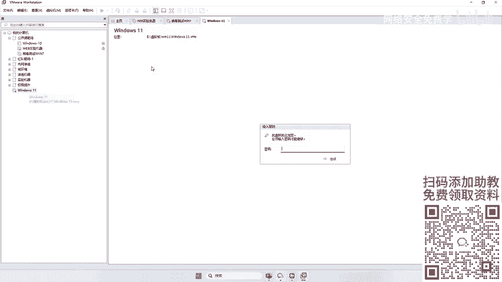

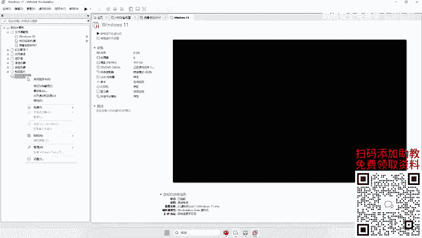

好。

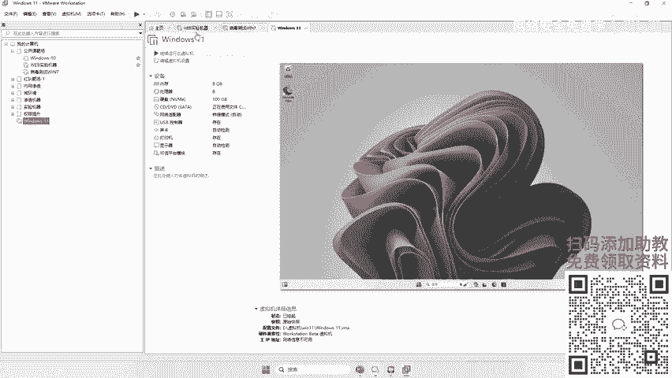

全部打完了啊，那你理解了吗？你吸收了吗？啊，好，那接下来我们就一步一步来。首先呢我们先从我们百度网盘里面，对不对？下载下来哎，一个东西，什么东西呢？就是我们的这个虚拟机啊。好，就这两个东西。😊。

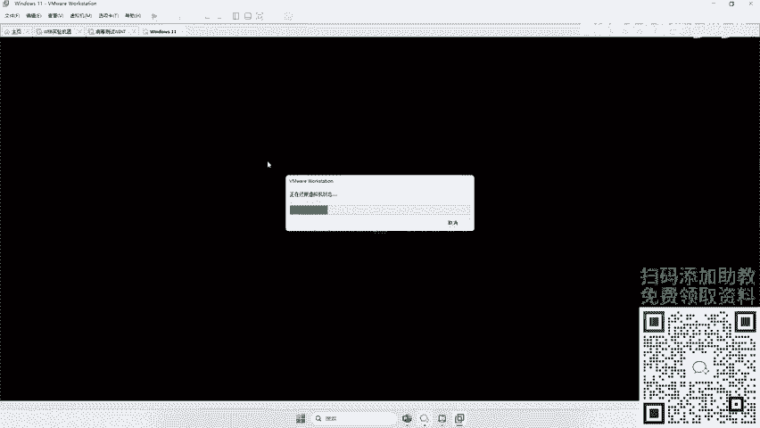

来看一下。

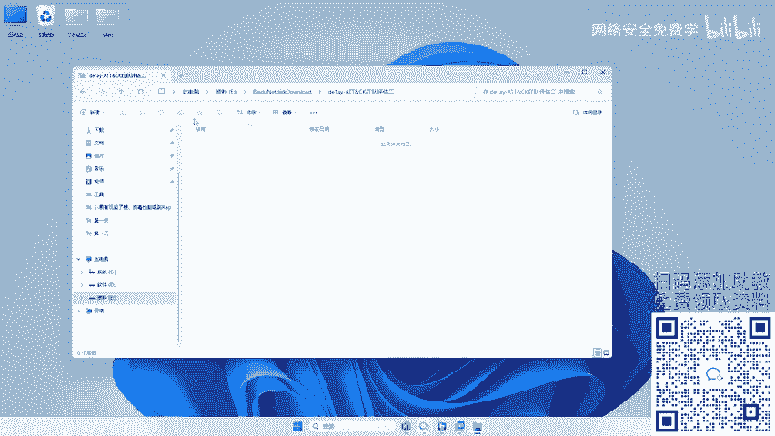

哎，你看在这里对不对？好，来，就这两个东西啊。😊。

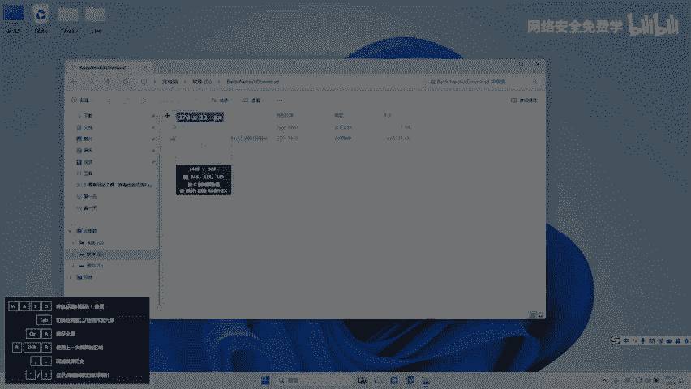

好，这两个东西我已经李哥已经在这个百度网盘提供了，对不对？所以大家呢把先把这两个东西下载下来，哎，这个是他的什么密钥，哎，就是他的这个要要填的一个密钥。这个呢是他的安装包。哎，有的同学就不用了。

对不对啊？有的小伙伴就不用安装了，没有的，像我一样安装，对不对？先把这个东西呢放到你的电脑上，哎，直接放到你的Wwin101里面就可以了，或者win10里面就可以了，对不对？好，我们先放过来啊啊。

在这里有一个李哥给大家演示一遍，好不好啊。😊，好，是不是先把它放到你的电脑里，对不对？好，然后干嘛呢？双击它双击大家都会吧啊，没有问题，这些都不用我讲了，对不对？双击啊。

就是鼠标的这个左键双击双击完了会出现个事啊，你点击这个事，哎，它就进行安装了。😊，对不对？啊，提供密码啊，我们提供密码。好，那这个密码在哪一块呢？在这个微m16这一块，对不对？哈？

那李哥在这里给大家提供了3个，对不对？所以呢随便选一个就可以了。好，然后呢怎么安装呢？来，大家看一下，等这个迅机运行起来啊，我们就下一步下一步下一步下一步下一步哎，我相信这个小伙伴应该都会，对不对？

没有人说哎呀，不会下一步的，对不对啊？那么不会下一步。😊。

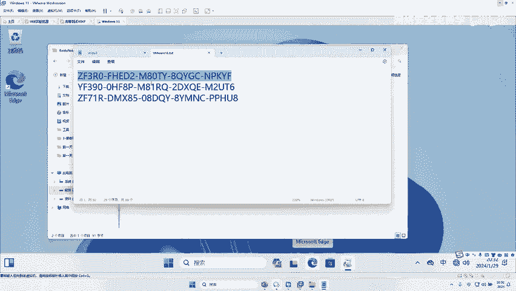

啊，不用截图啊，这些东西呢大家啊都是网上可以找到李哥都给大家提供了，对不对啊？给大提供问大家直接去这里啊，百度网盘这里下载就行了，对吧？因为李哥已经在这里给大家有了，对不对？大家去的这个课闲的预习资料。

你看有人在有人已经发群里了，对不对？好，这就是这个下载地址啊，里面就包含了这些啊一些东西啊，这个什么安装啊东西啊，对吧？啊，都都在里面啊，我们打开啊。😊，点击室啊。诶。好。好，运行一下啊。好。

这里我截图了，对吧？因为我可能这个是虚拟机的原因啊，我们就这样，我给大家放大看一下啊，这个其实非常简单啊，就是一步下一步下一步对吧？你看就下一步啊，全部首选下一步啊，下一步。

然后最后呢你会弹出一个提供密钥许可的这样一个证，看到没？然后你就把这哥刚才提供的这几个证，对吧？这三个东西，对吧？你就给它输进去就可以了啊，这三个东西，对吧？随便选一个输入到这里面来，然后点个确定啊。

那这个就算安装成功了啊，所以这个还是蛮比较简单，对不对？是不是出来了，你看你就下一步你看接受下一步哎，这些都大家都会吧啊，这个应该都没有问题吧啊，下一步啊，下一步下一步下一步OK这都没有问题吧。

O我去那这个工具呢大家一定要去安一个。如果说你没有一定要去安装一个。😊。

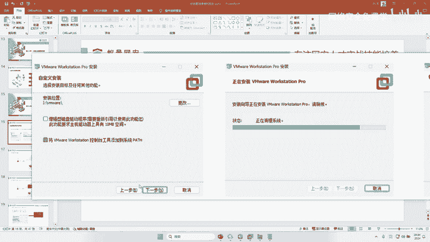

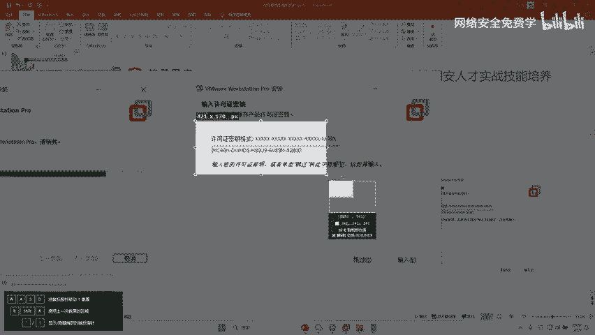

明白吗？因为这个东西是你学安全必备的一个工具必备。哎，必备啊，比人说为什么要装这个讯拟机啊？因为我们今天会装三台电脑到这个软件上啊，你因为你的电脑只有一个电脑嘛，我们要模拟这个公司的这个网络环境嘛。

因为这个工具它就可以模拟啊，用这个工具啊，它就可以去安装很多操作系统啊，它甚至可以里面去装十几个电脑都行。像我的电脑上是不是装了十几个镜像啊，十几个系统啊，大家可能会用这个工具去装一些开里什么的。

对不对啊。😊，啊，也于说要怎么搭建，嗯，可以用服务器里面的不行啊不行啊，这个必须要有IOS搭建，或者别人写好了才能搭建啊。你看这个就开始了啊，我在这里就带着大家一步一步来啊，第一步是安装。😊。

这些大家都没有问题吧啊，大家先不用管怎么去搭啊，我们只需要按照我的操作，把这些东西做好，做好之后呢，会把这个靶场打哈。你看这里是不是提成一个许可证。好，我们点击许可证。好，然后把这提供的三个许可证。

对不对？随便选一个复制进来，点击输入哎，就完成。然后双击你的这个信机。😊，哎，然后就可以了，你说虚机内存怎么办？这些都不用重点啊，我哎这个软件就运行起来，对吧？这个软件是不是就运行起运行起来了。好。

那么这个软件就装好了。好吧，这是我们今天讲的第一个啊。😊，哎，先把这个软件装好，对不对啊？😊，啊，这些都没有问题吧，这个虚拟机安装大家都看明白没有？看明白给李博扣波李哥扣波一好不好？就这么简单啊。

这是我们的第一步，先把这个工具装一下，好不好？没有装的就现在不用装，对不对啊？你明天再装，有了的话，你就不用装了，好不好啊？都明白了，对吧？我觉得应该有手就行吧，如果说这个时候你还没有手啊，不行啊。

那李哥真的太难了好，第二步哎我们来装我们的环境了，对吧？那我们的环境到底长成什么样子，哎，给大家讲一下，好吧，那么本次的环境主要它长这样，O我们来看一下哈，首先呢黑客是你对不对？

那黑客是你就是你要拿着你的电脑去进行渗透，对不对？然后我们通过互联网，哎，先入侵到这个外部服务器，入侵到外部服务器之后再入侵到这个内网机器，这是我们本次实验的这个网络拓扑，简单的网络拓扑，好吧？

就是说这个外部服务器，对不对？黑客是通过可以通过互联网去访问的啊，那么我们公司里面还有两台什么内网机器，对吧？😊，外部服务器有一台内网服务器有两台内网服务器，就是这个电脑在人家公司内部啊。

没有在这个互联网上没有分配互联网公网IP只在公司内部。那么黑客是不能直接访问内网IP的内网的这个。机器的对不对？就像你一样，我的电脑在我公司，你现在能直接访问我的电脑吗？你肯定不行啊，对不对啊？

因为我的电脑在内网中啊，同样对不对？人家公司两台电脑也在内网中，那么我们怎么去入侵这台两台机器呢？啊，在这里大家看一下，对不对？因为外部服务器它是可以访问我们内网服务器的。

所以外部服务器就可以做一个跳板，是不是我们必须先入侵到外部服务器，然后借助这个外部服务器再入侵到内网服务器，哎，理解没？因为黑客不能直接入侵它啊，必须先入侵到这个电脑。😊，然后借助这个电脑当做跳板。

再入侵到底下这个电脑。明白明白吗？啊，所以我们本次的环境就这三台，所以我们需要把这第一台、第二台、第三台都给它安装好，并且搭建成一个这个是公网的服务器，这个是内网的服务器，这样一个网络架构，对不对？

从而实现入侵啊，不管怎么入侵。只要我们能控制它就可以啊OK。好，那么嗯接下来啊我们来看一下对不对？好，有人刚才好奇说，okK那李哥呀，那为什么这个web服务器又可以和黑客访问，又可以跟内网访问，为什么？

因为这里给大家说一下，因为一般来说很多有一些双网卡机器。比如说这台外b服务器，对不对？它有一张IP地址，大家看到没？是要这个IP地址，这个IP地址是一张网卡，对不对？这个网卡它是可以跟黑客进行访问的啊。

它是提供给黑客访问的，还有一张网卡是这个网卡，这个网卡是跟我们的内网进行访问的，对吧？所以说我们的这个web服务器，它是有两张网卡的。😊，哎，两张什么网卡。啊，两张网卡意思你可以理解为就插了两个网线。

一个网线啊是干嘛呢？是黑客可以通顺着这个网线访问到这台电脑，一个网线是干嘛？一个网线是负责跟内网进行通信的，对不对？所以说呢我们需要干嘛？黑客先要攻击到这个web服务器啊，因为外b服务器它还有一张网卡。

对吧？我们借助另一张网卡访问到我们内网就可以了。对不对？所以说你要入侵内网，必须先要把这个web服务器给它控制下来啊，所以呢现在我们第一步啊先去搭建一下这个web服务器啊。

这个 web务器到底如何去搭建。好，接下来跟着李哥的操作一步一步进行搭建，好不好啊。😊，好，首先呢我们先打开我们的这个虚拟机啊，对不对？是不是都打开了啊，打开之后呢，来大家看一下。😊，哎。

我们在这里干嘛呢？哎，在这里呢新建一个。😊，文件夹好，在这里写什么红对。红队。对法场。杠一对不对？好，那红队把上杠一创建好之后，哎，我们得把我们的续拟找到了，对不对？好，那接下来找一下我们的续机。😊。

啊。好，一对不对？好，这里是不是有三台？😊，哎，一这里是不是有3台？好，我们先搭建第一台vol stack win7好，这个是我们的什么刚才给大家说的什么公网，也就是我们的可以给被黑客访问的电脑。

这是这台win7的电脑，对不对？靶场用刀坑不用包壳，全部是真实的环境，好不好？全部是真实的环境，好不好？好，那现在怎么做呢？我们把我给你下载这个安装包，你是不是在百度网盘里面可以下载到啊，下载了之后。

然后干嘛呢？哎，解压，不要双击，对不对？我们右键。😊，哎，解压到当前文件夹。这个都会把把它解压一下。好，接下来我们先把这台电脑解压出来啊。😊，光猫桥街上，一会儿桥接n，李哥都会给你讲啊，大家不用着急啊。

我们你只需要按照这个步骤一步一步来啊。好，先把它解压出来。好，等他解压。啊我们接着看我们的这个报告，对不对？😊，解压时候之后啊，我们一定要先对我们的虚拟的网络进行编辑。好，那接下来进行编辑啊。

等它解压啊，然后我们顺顺办顺带，对不对？这个时候干嘛呢？哎，打开我们的这个。信捷对不对？打开们信捷好，怎么打开？好，我所以这里给大家放大一些，好吧。😊，哎。哎，都能看到吧，能不我现在放大。

大家能不能看到啊，能看到你大家看一下我屏幕有没有放大，放大给李波扣个一啊啊，没有放大的话，我就截图给你放大。😊，大家可以看到这个放大了吗？因为我害怕很多人是手机看，对不对？O。你这个屏幕有放大了吗？

没有是不是啊，没有可能是这个录这个分享的员。那我给大家这个干嘛一下啊，没有就行啊，没有是吧好，那我给你截屏一下。好，那首先这个时候我们干嘛呢？哎？😊，哎，点击我们虚拟机这一块，哎。

这里有一个什么虚拟机这个选项，对不对？我们把这个点击一下啊，这个会点吧啊，点点下虚拟机。😊，啊，错了，不是李说李哥说错了哈，我们再给大家看一下，我们点击什么，我们先点击这个编辑。😊，哎。

先把这个编辑点一下，对不对？这个编辑大家会点吧。好，点一下编辑好，编辑点完之后呢，哎里面有一个什么叫做虚拟机虚拟网络编辑器啊，这是我们第二步啊，把这个虚拟网络编辑器点一下。好。

所以我们要点一下这个虚拟网络编辑器啊。😊，好，点完这个虚拟网络编辑器之后，哎，大家看一下，哎，它就长这样一个界面，对不对？好，如果说你的右下角有这样一个更改设置，对吧？需要具备管理员权限才能修改。

记得一定要点一下这个更改设置这个选项啊，不然不能修改。啊，我们要点一下更改设置啊。😊，好的，小伙伴点完更改设置之后，哎，我们就要进行这个环境搭建了，对不对？哎，我先把衣服脱下来，有点热啊。好。

我们来看一下怎么搞，听好了，对不对？首先第一步。😊。

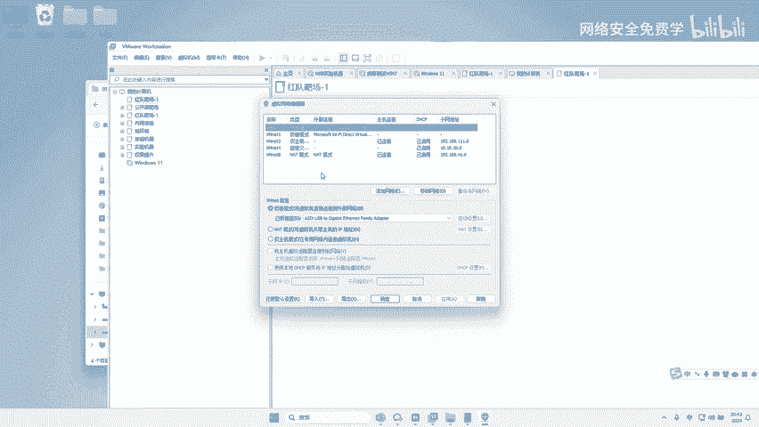

啊，因为这这个很多人都不太会啊。😊。

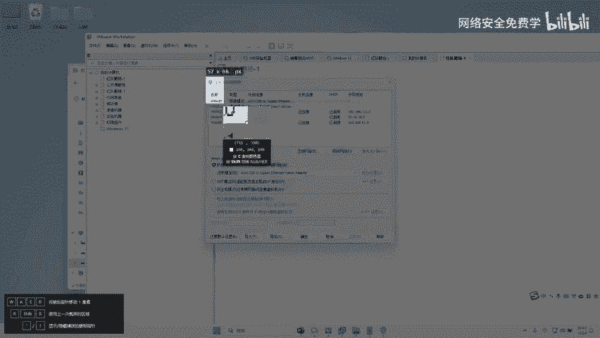

第一步干嘛了？点击这个添加网络，哎，点击这个添加网络。好，我们把添加网络点一下好，点完添加网络之后，大家可以看到哎。那这个还截不了屏啊，那截不了屏就没有办法了啊，我给大家再看一下啊。好。

点击完这个添加网络之后啊，大家看一下这里是不是有一个下拉的按钮，我们把这个下拉的按钮点一下。哎，点完了之后，你可以看到里面是不是有很多vimnet哎，这些都是什么？我们的网卡啊，就是我们的网卡，对吧？

所以我们因为刚才说了啊，刚才说了什么？你看刚才说了这台电脑对不对？它是有两张网卡。第一张网卡是供黑客访问。😊，第二张网卡是跟什么跟我们的内网访问，对不对？所以我们必须在我们的虚拟机里面设置两张网卡，哎。

两张网卡必须把两张网卡先搞定啊，才能啊肯定不一样。docker搭建的那多low啊，我们都是正儿八经的windows的真实环境，那跟刀cker不一样，好吧啊，docker那轻量级的啊。

我们这这都是重量级的环境啊啊，是实战环境好不好啊，所以我们必须设置两张网卡哎。第一张网卡来，我们来先设置一下啊，你在这里随便选啊，我在这里选择什么啊，你看我选了一张vimnet3，对不对？

你点这个添加网络好，选择这个vimnet3，点击确定。好，那这个时候呢你的电脑大家看一下。😊。

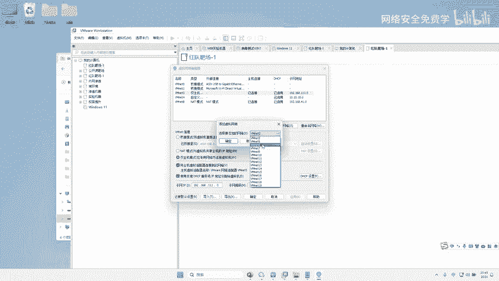

就会多一个什么多一个vimnet3。

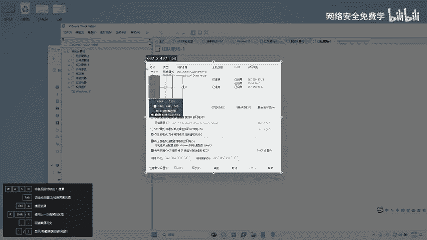

啊，多一个vivon3啊，在这一块对不对？😊，好。啊，多一个win3好，那这个vim3大家看一下，一定要按照我说的这个步骤去设置啊，不能去啊。实际上对很多公司它也是这样有两张网卡，对不对？怎么去设置。

大家看一下，一定要把这里打上勾。首先选中这个微n3，选择仅主机模式，好吧，不要选择桥接模式，也不要选择NAT模式，这两种模式都不要选你们之前学开的时候，老师是不是给讲的，哎，你就选桥接或者选择net。

你的开dy就可以上网的，对不对？好，那是你的开dy。那么今天我们讲的是什么？讲的是内网的靶上，它需要两张网卡，所以我们那个微mnet3一定要选择什么，选择的是仅虚拟机模式。😊，啊，警讯机。

然后把下面这两个勾给它勾选上，一定要勾选上。对不对？一定要勾选这个勾要勾选选上，这个勾要勾选上。因为勾选上这个东西，一会要才能访问啊，不勾的话不行。啊。

所以我们来看一下我们的其实我们的课件里面已经给它家写的非常清楚了，对吧？😊，来看一下啊。来看一下。是不是？好，来，我们来看一下黑客这个电脑，黑客的有一个IP是192168111。128，对吧？

这张网卡我刚才说了是跟黑客进行访问的对吧？黑客是跟这个IP访问的，所以我们这个网卡的这个子网这一块，要写1921683个1，1定要写1921683个1啊，不能乱写，所以我们再回到这里看一下。

是不是你看李哥这里微木奈的3，大家看一下，是不是跟这里弄的是一模一样的啊，对吧？第一个选上了，第二个选上了第三个选上了IP地址1921683个1。0，这个时候点击确定。😊，点击确定。

那么我们第一张网卡就配置好了，对不对？那接下来再点击添加网络，再选择vimnet4。好，然后再点击确定好吧，你这个时候这里又多了两张网卡，对不对？好，这里我们怎么去选，大家来看一下。😊，啊。

这就不一样了，对吧？因为第二张网卡，哎，它是这个外部服务器的这张网卡，它是负责跟我们的内网电脑进行通信的，对不对？它的IP地址是19216852这个段。好，所以呢我们在这里也要选紧主机模式。好。

这里要要注意啊。要注意。注意什么呢？这里这个勾不能选啊，这里这个勾不能选，对不对啊，然后这块选择19216852。0。哎，所以李哥来试一下，对不对？好，我们按照这操作来试一下哈，我们选择webnet4。

你看。😊，哎，这里选的什么金主机好，这个勾不能选了，对吧？第二张网卡这里不选，第一张网卡，这里是勾打着勾的，对吧？我们第二张这里就去掉。好，然后这里打上勾，这里选择什么写上什么，写上我们的IP地址。

是不是192。168。52。0。😊，哎，没有问题啊，没有任何问题。看到没？第二张网卡啊，警主机。使用本地1926852。0，点击确定。统你确定。好。没有问题了啊，现在就OK了。所以现在为止啊。

我们这个工具的两张网卡已经配好了，对不对？配好之后，那接下来要做的是什么？就是把我们的这个给大家提供这个虚拟机，对不对？挂到这两张网卡，就给他插上网线，对不对？现在只是说哎网线有了，对不对？

接下来我们就要给虚拟机，把这两张网卡对接好，那么这个时候我们的就可以进行渗透了，是不是啊？所以我们来看第一个啊，第一个你看这里给大家写写步骤了，对不对？好，我们来一步一步看好。

首先我们第一个虚拟机vol7，对不对？哎，是不是已经解压出来了。好，那接下来按照李哥的步骤啊，先把我们第一个虚拟机给它搞好啊，怎么搞呢？大家看一下啊，看好了啊，点击这个文件。😊，哎，然后点击这个打开。

哎，不错啊，点击这个文件啊，然后点击这个什么打开，对不对？打开里面哎，我们来找到这个。我们的熏机啊。哎，个。这个。内网渗透。哎，不对那容很啊，我找到这个红队靶场一ont对不对？好。

选择这里面这个windows7叉64VM叉啊，然后点击打开。就直接可以运行了，好不好？OK啊，这个是我们的第一个啊服务器。现在设备已经完美的打开了。那打开之后呢，现在还需要把它的网卡给它对接上，对不对？

好，所以我们先要干嘛呢？先要编辑一下这个讯息。😊，哎，大家看一下。这里是有个编辑虚拟设置。好，我们给它。😊，选中。啊，大家这个对点零啊，选中啊，选中之后我们来看一下。哎，首先呢我们先干嘛呢？哎。

大家来看一下，这不是它的编辑虚拟机的，好不好？哎，编辑完成之后啊，我们需要在这里点击一个添加。哎，我们先不点添加，我们先直接来编辑，对不对？好，那这里本身是不是有一张网卡就是网络适配器。

就是这个虚拟机本身是自带一张网卡是吧？叫NAT啊，所以我们得把这个NAT什么选成这个自定义啊，自定义选成我们的vimnet3哎，这个大家要注意，对不对？

把我们的第一张这个虚拟机的这个win7这个第一张网络适配器啊，自定义选成vimnet3就代表什么了？就代表着。😊。

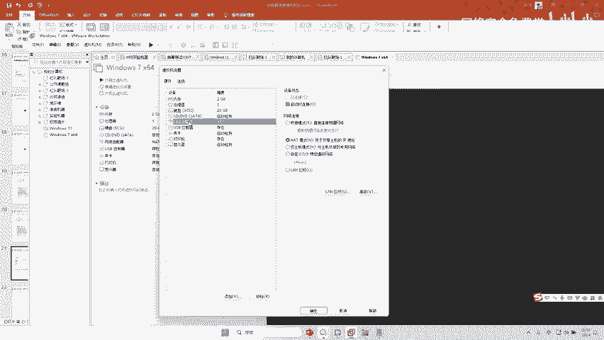

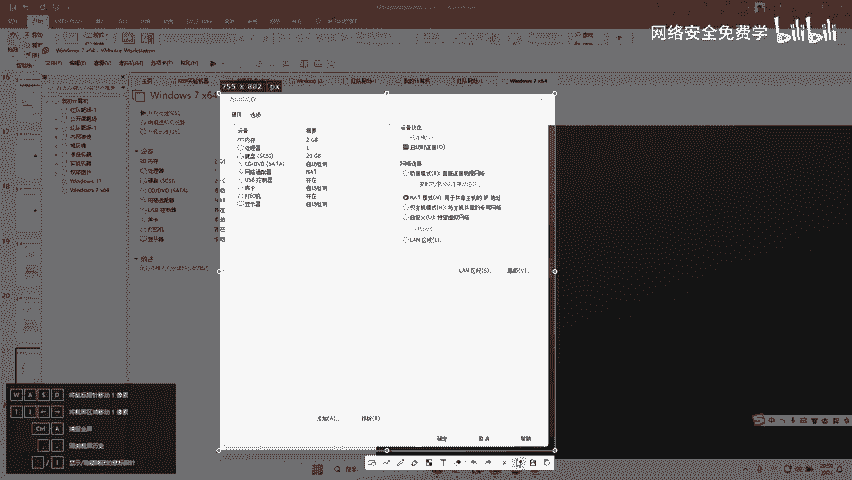

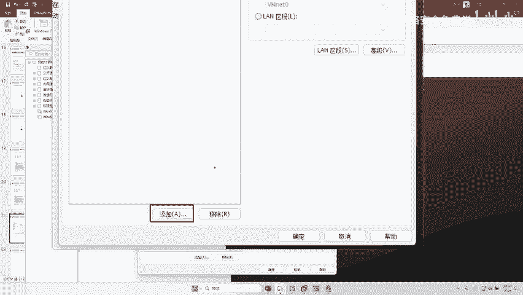

我们winI7对不对？这是那个win7啊的第一个网卡跟我们刚才虚拟机设置的那两个网卡已经对接好了啊，这里是不是对接？你看啊，就是我这个winI7的这个网卡。第一张网卡是winn3，是不是我刚才设置的啊。

我说的这个win3是不是可以供黑客访问的啊，那么黑客一会就是通知这个winn3访问到这个电脑的对吧？所以我们在这里就点击什么，点击确定就可以了啊。😊，好，我们来试一下啊，wine3啊，点击确定。O。😊。

OK然后我们干嘛，然后点击开机。😊。

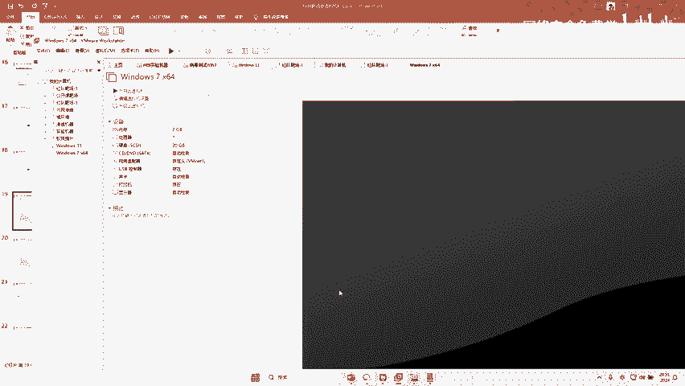

好，然后点击我已复制。OK那这台电脑就OK了，明白吗？哎，明白吗？你说这个win7有什么区别？这个win7里面是有实验环境的，里面是有漏洞的，懂不懂？我们要去攻击呢，对不对？😊，我们现在讲的是什么？

这些把先把这些攻击的这个靶场还原一下，对吧？好，在这里呢我们给他先重命一个名，对不对啊？为了专业，对吧？我们去给他这这个。😊。

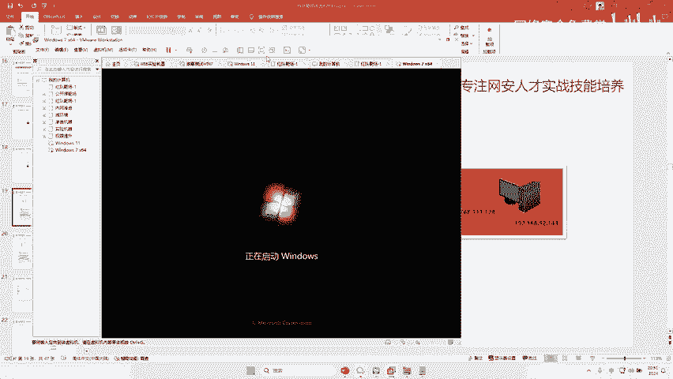

嗯，重命名一下啊，那这个叫什么叫做web服务器，对不对？好，然后把我们的web服务器拖到刚才这个什么文件夹里面啊，我们红队靶场，对不对？😊，啊，红队靶场。第一个机器是我们外b服务器好，现在已经开机了。

好，开机之后呢，小伙伴们啊现在把它干嘛呢？打开。😊，好，好，那这里的密码是多少呢？啊，李哥在这里也给大家写了，对不对啊？密码是多少啊，大家看一下。😊，哎，密码是这里叫红日SECar2019。哎。

这个是它的密码，好不好？哎，这个是它的密码。来给大家看一下啊，这个是它的密码啊，不要忘了哦。哎，来，我们接下来输入，对不对？😊，红日SEC at201。重述一下啊。同是SEC at20。019啊，回车。

先给他登进去啊登进去。好。等它登登的时候，哎，我们这这个时候还要干嘛呢？还需要干嘛？还需要把我们其他两台电脑也给它解压出来。因为这是第一个，对不对？我们还有这个是外部电脑，已经搞好了，对吧？

我们还有两台电脑是我们的内网电脑，对不对？所以我们还需要把内网的电脑给它搞搞定啊，搞定啊。好，那我们接下来打开这个一啊，顺便把这个什么内网的两台电脑给它解压出来啊，解压一下哎，解压应该大家都会，对不对？

好，把这个vol这个08也解压一下。😊，解压一下OK先这让他解着压啊。😊，啊，这个我我要说一下这个PPT我会发给大家的啊，你放心，我一定会发给你们的啊，一定会发给你们的哈啊，好吧。

就这个安装流程我会发给大家的，我就直接发给大家啊，课后之后啊。😊，啊，这里是点0啊，这里是点0啊，笔记啊非给大家发分享给大家啊。😊，都是小问题啊小问题啊。😊，好。好，我们来看下这个电脑先登进去没有啊。

😊。

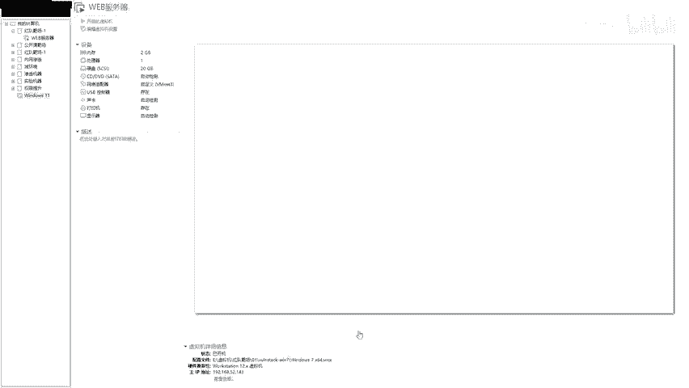

啊，密码写错了啊，我们再说一遍啊。哎，登进去了啊，现在登进来了，对不对啊？现在登进来了。好，我们点击这个取消。😊，好，那么这台实验机是不是就搞定了？哎，搞定之后还没完呀，是不是小伙伴们啊，怎么还没完呢？

啊，我们先看一下当前这个电脑。啊，打开这个CMV啊，我们在这里看一下当前这个电脑的电脑的IP地址。啊，我们来打开哎。打开哪里啊，我要去编辑一下，对不对？稍大家先听啊，先听先听听跟我听我讲，对不对啊？😊。

啊，网络对不对？在这里搜一下。啊，网络。对啊。网络。好，我们找到这个网络共享中心啊。好，这网络中心点击这个更改适配器，这个相信大家都会用，对不对？好，咱们看这个适配器的，这个应该这个是这个网卡，对不对？

好。😊。

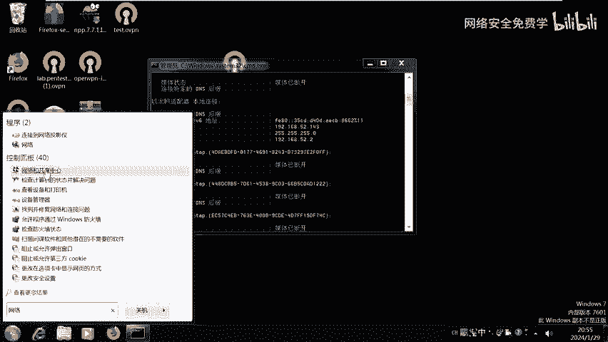

看详细信息啊，你看这里IP地址是不是有问题啊哎。😊，啊，我们得还在这里手动配一下，对吧？来，我看下怎么去配啊。好，大家往这里看啊。你看刚才说了这个IP地址是多少，是不是192168111。

128是我们的winI7，对不对？我们win7的第一张网卡，公共网卡的地址是多少？192168111。128，对吧？所以我们在这里得给它配置一下啊啊，点击这个属性啊。😊，在这里配一下OK。192。

168点111。128，是不是？好，底下呢这里就。啊，默认就行了啊。啊，这里这个DNS写不写都无所谓了啊，不用写也行。好吧，我们要按照这种方式去配好啊，192168111。128，是不是好。

这里呢写点0，这里写11。2，写11。1都行，这里不写也行啊，无所谓。好吧，我们点击确定。😊，点击确定。关闭。OK那我们就彻底搞定了。好，我们看一下那种截图里面啊，也是这样的啊。😊，啊，11。

128对不对啊？1。128O。😊，好，那接下来呢我们要干嘛呢？还还需要给这个电脑配置两张网卡，对不对？好？第刚才是第一张网卡啊。好，所以接下来我们搞第二张网卡右键设置。😊，是不是啊。

进入记接着进入这个界面，对不是？我们再点击一个添加啊，添加这个网络适配器确定。好，我们把我们的第二张网卡，这个网络适配器选成什么vimnet4，这vimnet4是不是干嘛了？

是不是就是跟内网通信的地址啊，是吧？哎，所以我们点击确定。😊，哎，点击确定好不好？哎，所以接下来我们需要把第二张网卡也给它复置好。哎，配置好之后，你可以看到你的电脑里面是不是出来一个这样的识别了。好。

哎，识别完后我点击属性。😊，啊，在这里手动配一下，对吧？那这里是多少呢？哎，李哥在这里给他写好了，对不对？大家按照李哥这种要求去写，对吧？他的IP地址是多少，是不是19216852。143，是不是啊？

所以我们就把这个IP配成52。143好。😊，192。168。52。143。好，这里要写2。0网关的话，你就写192。168。52。1啊，无所谓。好，这里注意这个DNS一定要写成什么呀？

一定要写成李哥给你讲的，在这个截图里面写的这个啊。大太阳。啊截图里面写的这个192168，对不对？552。141啊141。192。168。52。141OK我们点击确定。啊，确定确定。

OK那么现在这个电脑就搞定了，这个IP是谁的？这个IP是这个winI7的。哦，再给大家可能有的人已经懵了，对不对？好，我再给大家再重复一遍。好，因为是这样的啊。😊，因为我们本次的这个渗透啊。

这个外b服务器它是属两张网卡，对不对？所以我们得给我们刚才打的那个虚拟机里面配IP第1个IP是19216861。128，对不对？这个密码这个IP是跟黑客进行通信的。还有1个IP是19216852。

143，这个IP是负责跟内网通信的。刚才给大家讲这么多，其实都是在这个电脑里面配IP地址，这个电脑配IP地址，我觉得是非常简单的。这个有人不会这个电脑配IP地址吗？我觉得应该没有人不会吧啊，怎么配啊。

就是打开你的这个网络这个网络连接，对吧？找到这个网卡是不是好，然后把它双击一下啊，这里有一个属性，我们点一下里面有个IPV4协议，是不是？然后你在里面写就行了啊，按照我的格式把它写好啊。

逐个点击确定就行了。😊。

哎，那这样我们就。配好了。啊，配好之后，那接下来哎我们来测试一下啊，测试一下这个IP地址O不OK，对不对啊？我们到底怎么测试啊，来来一下看一下啊。😊，因为说了啊这个128呢哎是干嘛的？

是跟黑客进行通信的那谁是黑客呢？就是我们的这个windows电脑啊，就是我们一会儿入侵的时候，就要用我们的实体机啊，那所以在这里得拼一下那个IP地址能否拼通，拼192。168。111。128回车啊。

大家看一下这里是不是没有拼通啊，没有拼通的原因是什么呢？哎，就是因为这台电脑它开了防火墙，对吧？所以我们得先把这个防火墙先关掉啊，关掉之后呢，看一下能不能拼得通，哎，能拼得通就证明OK了，拼不通，哎。

那我们就得再修一修了，是不是哎，所以我们来拼一下啊。😊。

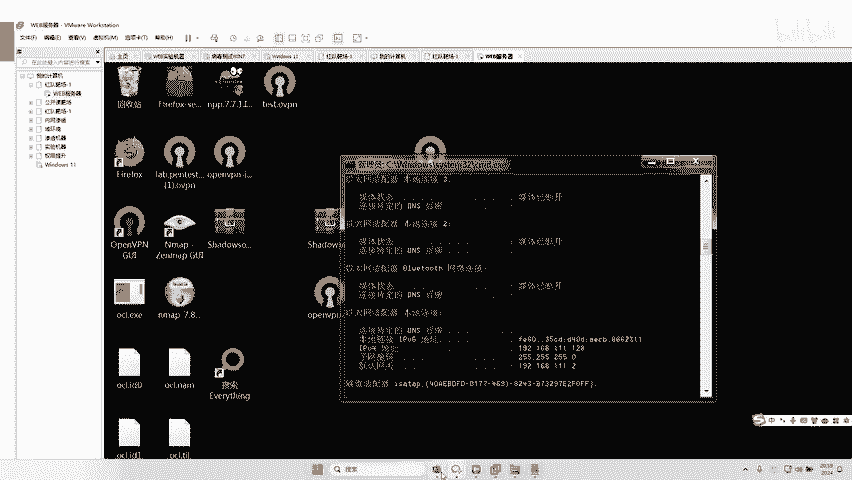

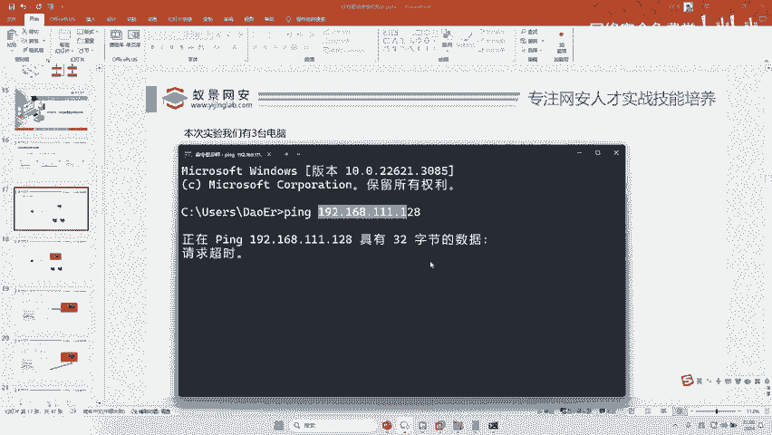

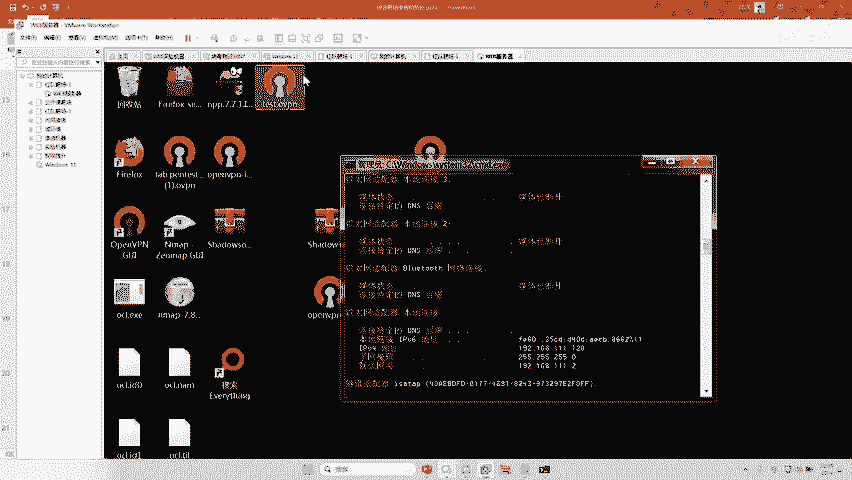

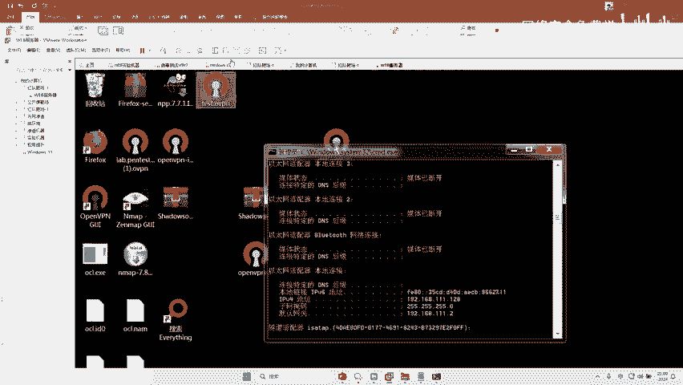

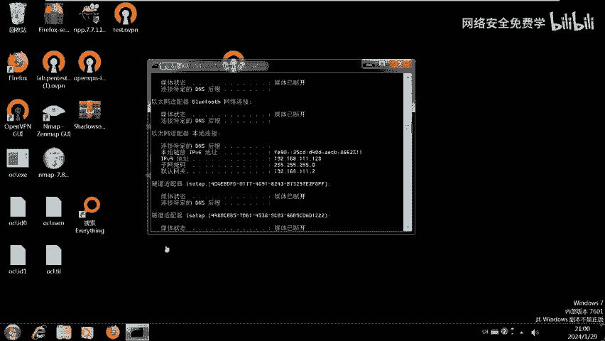

好，找到这个控制面板啊，找到这个安全防火墙啊，先把它这个防火墙给它关掉啊。😊，因为这个防火墙是不能拼的啊。好。OK那这个时候呢我们再拼一下。来，大家看一下是不是拼好了呀。

所以说你看黑客现在去访问这个128，就是我们的Wwin7是可以访问的，对不对？那么我们刚才说了好，这张网卡还有一张网卡，对不对？是这个52。143，所以我们拼下52。143。😊，好。

大家说一下这个能不能拼通啊，我们都对照网络拓扑图，对不对？啊，第一张这个网卡128是跟黑客进行通信的。这个143是跟我们内网进行通信的啊，大家说看能不能听得通？你们觉得能不能可以？有人觉得为什么可以呢？

肯定不可以啊，因为因为这个网络它是内网的IP。😡，内网的IP黑客是没有办法访问的，黑客只能访问到这个111这个网段。😊，对不对啊？只能访问到111。因为黑客跟跟这个网卡进行通信。

跟我们这张网卡是不能通信的。😊，啊，所以我们得肯定是不行，对不对？你回撤一下，看到没？肯定是拼不通的啊，你的效果必须要达成我这样，这个可以拼通，这个拼不通，我们才能干嘛，我们才具备这样的网络环境啊。

这样才算搞好了，对不对啊？你不能说两个都能拼通，那你就没得玩啊，很多人做这个靶赏，两个能拼得通啊还子能写报告。哎，我说我用永恒之蓝直接打进去了，对不对？那你是不是开玩笑能中是不是实际情况你就拼不通的啊。

拼不通啊，OK。😊，哎，这个没有问题吧。好，那接下来干嘛呢？哎，接下来哎我们就需要干嘛了？哎，再把这两台电脑给它干嘛呢？哎，给它搞好。这两台电脑的IP地址是19216852。138跟19216852。

141，对不对啊？一台是预控，一台是域内机器，所以我们得把这两台电脑给它搞定。😊，此外子网源码是255。255。255。0啊，25。0OK好，那接下来啊再把接下来两台电脑给大家搞定，好吧。

接下来两台电脑就跟上一个电脑是一样的了，对吧？所以呢我们干嘛呢？哎，就是在这里点击。😊，好，先点击打开，对不对？😊，好。好，只先找到这个08啊，这个08我们打开。好。再打开一个电脑。打开。

然后打开什么呢？打开这个啊03啊，把这两个都打开。啊，大家记住这个08呢，大家要备注一下，对不对？这个叫什么叫预控？啊，有人说不懂这个诊标预控。😡，对不对？预控不懂没有关系哈。

第二个我们要写叫叫什么域内主机好，把这两个东西移到这里面去啊。😊，好，然后记得把预控啊，这个网卡要调节成什么啊，这个网卡要设置一下，对不对啊，调到我们的vimnet4，对不对？

因为vimnet4是内网的网卡，对不对？所以因为这个预控它是机器是内网的对吧？所以我们得给它写vimnet4，点击确定。😊。

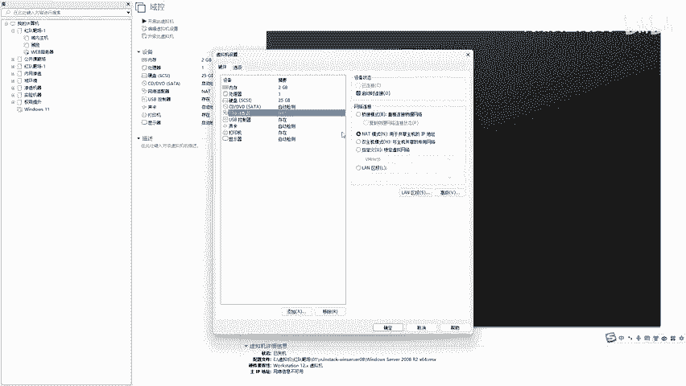

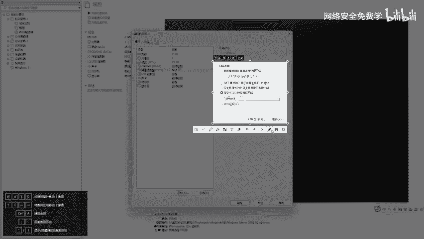

好，然后这个域内主机我们右键。O。我们点击设置。啊，也给它选成什么选成viven4啊，选成我们内网的网卡。好就可以了。

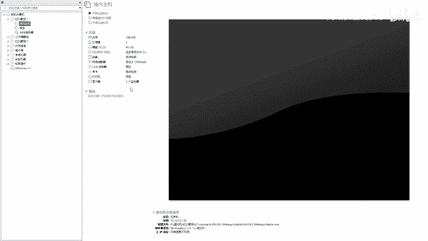

对不对？现在就可以了，现在只要把这两个电脑开机。😊，好，点击已复制。好，然后把另一台电脑。也开机。也复制。ok小伙伴们，先来我们的。😊。

环境就搞好了，非常简单吧啊，这个大家听明白没有啊，听明白给李博扣波一，不听明白的啊，回头一定要什么把它认真听再听一遍，好吧，可以看我笔记啊。😊，因为我觉是非常简单的对吧？啊，非常简单的OKO ok。😊。

啊，对，就这个配置环境，对吧？这个非常重要。我说了，你会了今天我的这种配置方式，你后面的什么配置都会了，对不对？好。😊。

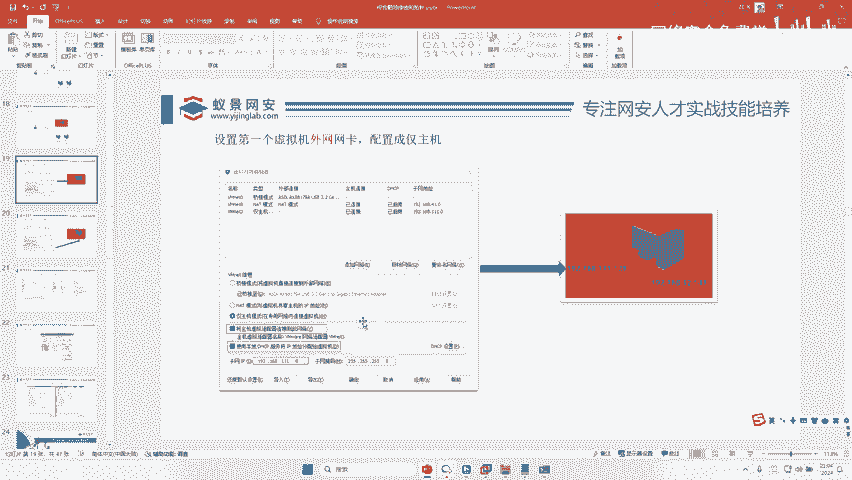