# 2024B站最值得看的黑客教程 ｜ 网络安全／渗透测试／内网渗透／漏洞挖掘／web安全／kali linux／红队靶场／CTF／信息安全 - P102：内网渗透中的基本环境和账号 - 网络安全免费学 - BV1uBsTetEow

那接下来呢就要给大家好复杂呀。哼对呀，你以为你搭个开里，用个docker，网络安全就这么简单吗？我就说很多人对吧？连这个把机都不会，我告诉你们，你要去自学，你配这个。😡，网上教程一大堆，你去配。

你配个三天，你配不定。啊，不骗大家，你去自己下载，自己配。如果没有人给你讲，你去配个三天啊，你都把这个环境搭不起来。😡，啊。好，等这三个电脑开好之后，我们就可以进行渗透了。好，那么在渗透的时候。

有一个非常重要的东西要给大家讲。😊，这个不会努力白费，对不对？所以接下来我们要讲一个知识点了，对不对？就是内网渗透跟我们的公网渗透有什么区别，或者内网渗透。😊，因为内网渗透后渗透，对不对？

主要你要懂内网。三台讯机共用网卡吗？对，三台讯拟机共用那个网卡啊，它是调过去的啊，连过去的啊。好，那接下来我们讲一个问题啊，就是我们的电脑。😊，有两种身份啊，这什么意思呢？啊？就是说嗯一种是本地工作组。

一种是域啊，就是说在内网中的电脑，就是说你的这个电脑在公司里面，对不对？这个公这个电脑它是有两种身份的，或者两种形式存在于公司内部的啊。第一种叫工作组。这个一定要记住啊，工作组叫本地工作组形式。

有一种渗透叫做工作组内渗透，对不对啊？有一种渗透叫做预渗透，预渗透听过没有啊，你能很多都没有听过预渗透，对不对啊？李哥之前是不是也出过一个预渗透的课程啊，非常屌啊。啊，预水。啊，大家看一下预审透。啊。

预渗透对不对？预渗透啊，那这个预渗透什么？这个域指的有人刚才也说了，我说跨域攻击，跨域攻击，对？欲指的就是这个域。那这个预渗透是干嘛的啊，接下来我给大家讲讲这两种形式的区别，对不对？好。

一定要分清楚分不清楚就没有搞啊，分不清楚这种这种形式。什么叫工作组什么叫预，那么你是搞不了完玩不定的，好吧，来我们来看一下。😊，啊，先看一下概念对吧？在一个大型的单位里面啊，比如说对于一个公司来说啊。

它可能有100个电脑，对不对？一个公司有100个人，100个人，那么就有100个电脑啊，有甚至都是成千上百台电脑，相互连成的内网，对不对？如果不对这些电脑进行分组啊，那么网络就是非常混乱的。

那么为了解决这个问题就产生了什么work group的概念，就是工作组。😊，哎，什么叫工作组？就是将不同的电脑按照不同的功能划分到不同的组里面。比如说你是行政组，哎，你的电脑就加入了行政组。

你的电脑你的是技术部，你就加入技术部。那这样的话，管理员在管理电脑的时候就非常方便。哎，我点一下技术部，技术部。哎，我知道这技术部里面有10台电脑。对不对？哎，我点了这个行政部，哎。

那这个行政部里面有100台电脑，哎，我就非常清楚了，对吧？就跟我们上学一样，一个班级里面你不能乱做呀，得分好组啊，一组、二组、三组、四组，你得堆堆规规矩矩的做到哪，是不是？那这样的话就非常方便了。哎。

明白没？这个就是对电脑的什么一些分类。好，那这个工作组在哪里啊。也就人说我不知道工作组啊，我们每个人的电脑默认都是工作组形式啊？😊，每个人。每个人。电脑。默认都是工作组。存在的。

就是你在电脑从买回来的时候，默认都是工作组，只是大家不不知道，对不对？那接下来看一下怎么个默认法，默认在哪里，我怎么去查看。好，那李哥在这里给大家瞅一眼好不好啊。😊，我们打开一个哪个哪个电脑吧啊。

我们打开一个。

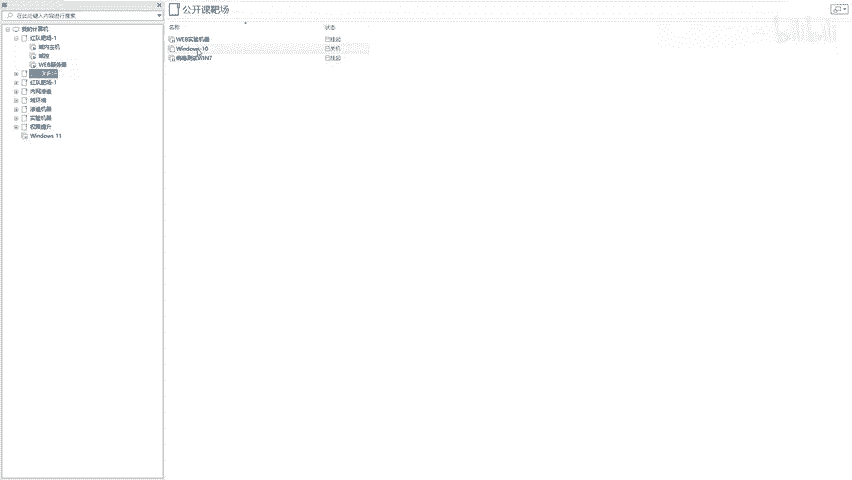

win10吧啊，我们来看win10啊，在win10里面看一下啊。

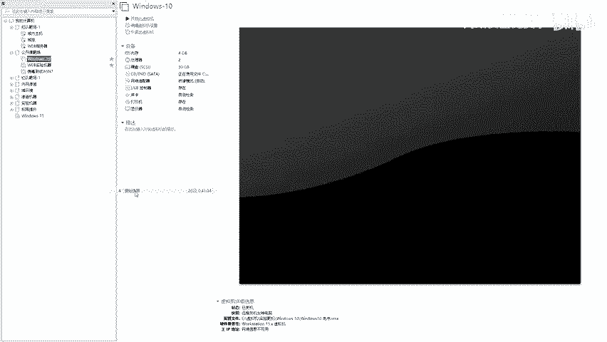

好。好，小伙伴，我们来看看win室。好，来看看win10，看win10怎么去看啊。

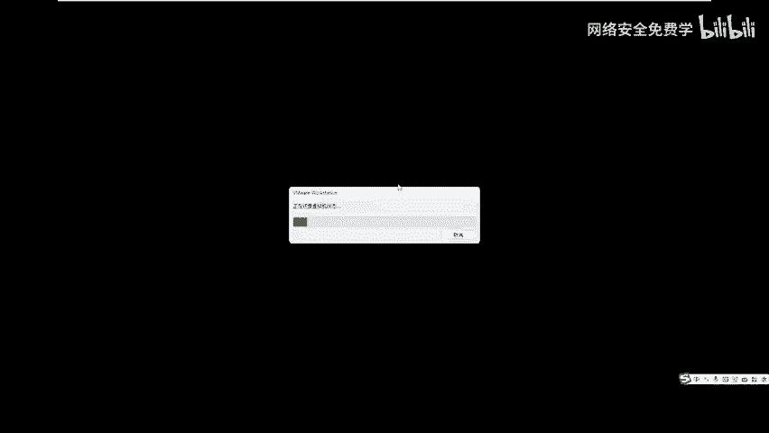

好，你这是你的win10，对不对？好，我们点击什么？点击这个计算机此电脑对吧？然后点击这个属性好，然后有一个高级系统设置，对吧？好，我们来看一下，这里面就有啊，我给大放小一些啊。😊。

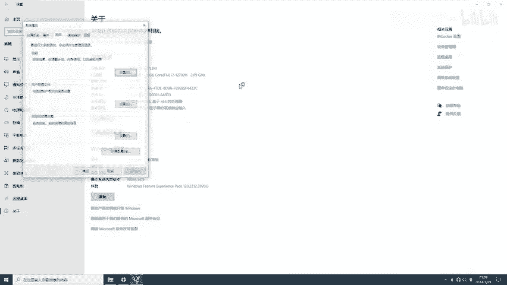

好，我们来看一下啊，这个win10啊。好，来，然后呢无N10我们点击这个高级系统设置，对不对？好，我们点击这个计算机名。好，看到没？好，在我们每个人的电脑属性里面啊，有一个计算机名这一块，对不对？

这计算机名是往下翻，哎，有一个叫做什么更改啊，我们点击一下这个更改，对不对啊？😊，更改好，这里是有两几个选项，大家看一下，你看来你们可以去看自己电脑，对不对？第一个叫计算机名儿。

计算机名就是你这个电脑叫什么名字，好吧，就跟你叫张三李四王麻子一样，因电脑也有名字，只不过你的电脑买回来的时候不设置，它会给你一段随机的，对不对？什么top A272对吧？随机的啊，如果说你改了呢。

他就叫其他名字，对吧？很多人可能不改，这个叫计算机名，就是这个电脑叫什么名字啊，给他起个名，这在电脑里面是可以更改的，对不对？好，这是电脑名，那电脑名里面还有个什么隶属于就这个计算机是属于哪个单位的。

对不对？你看工作组。😊，哎，这里工作组名叫什么？叫work group，就默认work group。你的电脑买回来有一个work group组，那你的电脑就在这个work group组里面啊。

那上面是不是还有个域啊，所以说你的电脑要么在工作组，要么在域。那么如果说你的电脑现在公司，哎，你想加入技术部，哎，你就把这里写成什么技术部。😊，点啊其示技术部好，然后你点击确定好，我们点击确定。好。

那你的电脑等一会儿，他就加入了技术部的工作组啊，人说哎那我的电脑就一个人呀，怎么没有技术部啊，哎，就是说如果说你是第一次加入这个工作组，或者说没有这个工作组，你随便起个名，你点个确定啊。

他就会创建这个工作组啊，默认创建啊，你看欢迎加入技术工作组，然后点个确定。哎，他要求你电脑重启。对不对？好，那么这个时候你的电脑就加入了技术部。😊，明白不啊，如果大家先不要不要按照我的步骤操作。

你课后再进行操作好吗？课后再进行操作，先听我讲好吧，因为我们后面都有笔记啊。好，这是加入技术部的，对不对？OK啊，工作组组名是随便写啊，你想写什么就写什么，无所谓啊，你今天加入技术部可以。

明天加入IT部也可以。你只要在你的电脑上点确定就可以随便加哎，理解没？这个就叫工作组。那么呢这个对于一个管理员来说，他只用去找这个名字就可以了。😊。

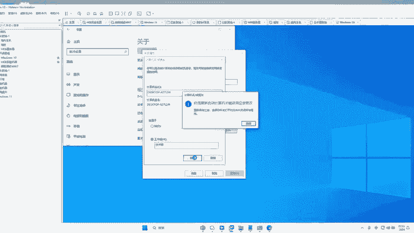

啊，那么工作组的形式类似于什么啊？啊，就类似于我们大学，对不对？会有这个一组、二组、三组、四组啊，会分成四个组啊，然后呢不同的电脑哎，你去不同的组里面啊，你今天做到一组，比如说一组哎。

一组他是什么技术部，那你做到一组，二组是财务部，那你就做到二组，三组是什么啊研发部，你就做到三组，对不对？你今天想做到一组就可以，明天想做到二组也可以，后天想做到三组就可以，随便啊，你的电脑。

你的这个组，你随便加啊，是不是就跟我们大学上课一样啊，它是一个比较自由散漫的组，就说我可以在技术部，我也可以在财务部，我可以在IT部完全由我决定，就跟你大学上课一样，对不对？你今天做到前面一排。

一组的一排可以做到一组的二排也可以做到二组的一排也可以做到三组一，甚至你不来不加都行，对不对？没有人管你，没有任何约束力，而且执行起来非常简单。你加入工作组，只要打开你的电脑，点击确定你就可以了。😊。

对不对？所以说这样哎。对不对？是。有点问题的对不对啊？是有点问题的。一会儿告诉大家有什么问题。大家说一下，你说工作组形式好不好？好不好？工作组的这种电脑好不好？先听我讲课，先听我讲课好不好？大家想想。

就是比如说你上大学这种上课模式好不好？你今天想做到第一排，你就做，明天想做到第二排，你就做。第三，后天想做到第三排，你就做，甚至你不来。😡，都可以，很人说好还可以，那只能说你纪律性好，对不对？

这样是不好的。你想想你高中是这样吗？😊，你高中今天做到第一组，开心了，明天你做第二组，你试试，你看你班主任是不是抽你两个大嘴巴子。😊，是不是啊？所以工作组有一个最大的弊端是啥？😡，啊，是吗？是吧。

没有集中的集中集中的统一管理。对不对？什么叫集中统一管理？就是你今天加了工作组，随便点点个确定就可以加了，对不对啊，想加就加，不想加，还要什么自由散漫，对不对？自由散漫啊，对吧？是不是啊。

还有什么没没有。😡，没有统一的分发机制。是不是啊，就说你工作组的电脑。😡，我假如说我想把财务部的电脑都统一关机了。😡，怎么管呀？我难道一个一个通知财务组的人啊，说哎，你们赶紧关机吧，是吧？那谁屌你呢。

对吧？就跟你们这些人一样，哎，你人来通哎，统一上课了，你看你谁来啊，你逃课怎么办？你都对吧？你看你前面的老师管你嘛？不管，但是你高中你逃课和试试那班主任喂谁的家长过来，是不是立马就把你喊过来啊。

就没有这种一个统一管理的人去管理这个班级，所以是比较自由散漫啊，那么为了解决这个问题是不是就为了解决哎呀，没有统一管理的机制，自由散漫啊，这样个问题就诞生了我们电脑的第二个概念就是遇这个概念。😡。

所以说一般来说，企业里面都有玉，像哪些企业都有玉。比如说银行里面有玉，钢铁厂里面有玉啊，什么啊飞机这个这个机那个飞机机场里面有玉。对不对？还有什么中国移动、中国电信啊，像我们公司都有预，对吧？

大很多公司都有预，那么玉到底是干嘛的，是为了干嘛的？其实非常简单，就是解决这个统一集中管理的问题。对不对？你看你要域的管理机制更加严格，对不对？用户想要访问一些东西，必须要用合法的身份登录到域，对不对？

域能进行什么集中管理控制。啊，所以我们就诞生了玉。玉就好比什么哎，就好比于什么？好比于你小学的时候啊。😡，你的域域里面的谁在集中管理，就是这个人，你的班主任，对不对？你的班主任就在集中管理你们啊。

不是小组长，是班主任，这个人在集中管理里面，对不对？这个人让你坐到第一排，你就必须坐到第一排。这个人让你出去，你就必须出去。这个让你明天5点钟来上课，你就必须来上课。这个人让你穿校服，你就必须穿校服。

这个人让你带红领巾，你就必须带红领巾，这个人要不让谈恋爱，你就必须不能谈恋爱，这个人给你布置作业，你就必须完成，是不是全部由这个班主任统一管理啊，你今天不来了，你试试后天不来了，你试试啊，你今天坐这。

明天坐那，你看抽不抽你。😡，对不对？那么班主任在狱中就扮演着一个啊集中管理的角色。那这个集中管理的在我们的电脑里面调查。好，听好了，这个电脑的名字叫做什么？预控。预控。

预控预控就类似于我们班级的什么班主任啊，他是统一集中管理的。所以说我给大家一个问题，对于一个有欲的电脑，比如这个电脑里面现在有多少台电脑，有1000台电脑，你现在进到这个那公司内部了，你要控制这个公司。

你应该控制谁？这有1000台电脑啊，你把它全部控制了吗？😡，你应该控制谁？控制谁，大家说一下。比如说这个公司人家有预环境，这个公司里面有1000台电脑，你现进入内网了，你要把这个整个公司全部控制下来。

你要控制哪台电脑。😡，对不对？肯定是控制欲控了，对不对？哎呀，就跟你要把这个班职啊劫持了一样，你把班主任一劫持，这里面的小鸡仔不都是手拿把掐嘛，对不对啊？是不是啊？你都是人家底下的小弟啊。

那班主任说查就是啥，对不对？所以预控他是扮演着一个非常重要角色，所以我们的内网渗透。😡，在一定程度上，它又叫做什么预渗像头。啊，那么预渗透其实有一个最终它是渗透谁呢？其实就是什么渗透预控。啊，理解吗？

所以说你们看到很多网上的打靶场什么的啊那打预控打预控，为什么要打预控？因为你把预控打下来，也就代表着把这整个公司给他打下来了。对不对啊？把公司打下来了，好不？所以说呢好，在这里也给大家说一下。

那么对于一个什么预来说啊，玉来说，一般来说，这个域里面会有两台预控，理解没？一个叫预控。第二个叫做备份预控，备份预控就是说当这个预控休假了，请假了，这个备份预控可以及时上岗，哎，什么意思呢？

就跟你的班级里非常像，对不对？你的班级里面一般会有两个班主任，一个正班主任，一个副班主任，正班主任平时负责你们班里的事务。但是有天你班主任结婚了，请假了生病了，那么副班主任临时就可以接管你们班级。

同样在预中也会有两台预控啊，一台预控叫主预控，第二个叫备份预控，对不对？他俩都做了同样的操作，对吧？这个DC一旦关机了，出现了恶意情况，那么这个备份预控就可以管理整个班级，对不对？你看。😊。

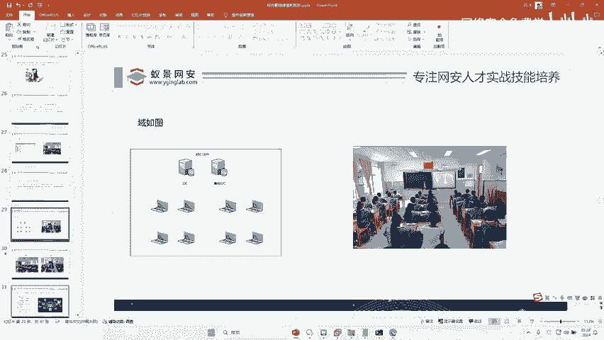

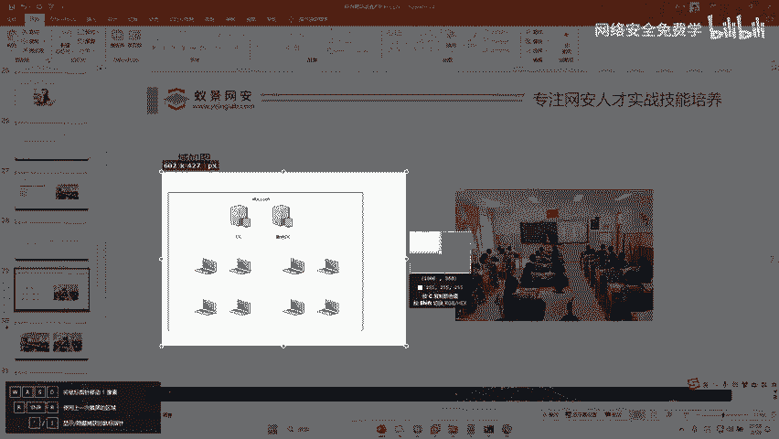

一模一样的对吧？所以刚才在我们的实验机里面啊，我们在这里可以看到。😊，这里是不是有三台电脑，那么这三台电脑分别扮演着什么角色？第一台电脑。

域内主机就是班级中的小鸡仔预控班主任web服务器啊是我们的公网机器。对不对啊，那DC的意思叫什么？DC的全称叫doomman controllertroller，对不对？动漫。读慢就是域的意思，对不对？

contl控制的意思，对吧？叫DC啊，英语叫DC啊，DC就是预控。哎，理解了没有？哎，好，这里有一个概念必须也给大家讲清楚，对不对？预控预控预控预控预控预控。好，那预控跟本地有什么区别。

这个关乎到我们的内网渗透啊，所以说对于一个电脑来说好，我们知道在是机接下来的渗透中有一个非常关键的点叫做什么叫做账号好，因为后续我们渗透的时候会把这个密码的，这个电脑的账号密码给它破解了，对不对？好。

账号又给它破解了。所以对于一个电脑来说，它就有两种形式的账号。😊，啊，哪两种形式账号听好了。第一种叫做什么本地账号啊，我给大家写一下，对不对啊，就不写了，太麻烦了。😊，好。叫本地账号。

本地账号就是说这个电脑的账号密码是存在于这个电脑上的啊，理解没？就是你工作组下的账号啊，我们一般人的电脑是不是都都有一个账号，是工作组下的账，比如个win10啊，我现在是在本地工作组。

那么我肯定有一个账号啊，什么张三李四啊，德秘，你们每个人电脑就自己的账号名的密码，对不对？那这个密码是存在这个电脑上的对吧？那么一旦这个电脑加入域的时候啊，那么这个电脑就会有一个账号叫做域账号啊。

就用这个域账号也是可以登录到这个电脑的。那这个域账号是由谁分配的啊，是由。😊，是由。预控分配的。懂吗？就这个电脑如果加上域了，那么你就可以用域账号登录这个电脑。那这个域账号是谁呢？哎，就由预预控上。

你可以设置一些账号，就可以登录这个电脑了，对不对？好，在这里对吧？你看在这里还有一个存储位置，存储位置的，对不对啊，大家要记住，域账号跟本地账户啊，因为非常关键，非常重要啊啊，因为你渗透要用到它啊。

本地账号是存在就是他的账号密码是存在哪里？存在这台电脑上自己身上的，对不对？域账号是在哪里呢？你想知道所有的域账号，它一定是在哪里，是不是在这个班主任手里啊，在预控上啊。

预控里面是存着这个电脑里面所有的域账号的啊，OK所以那这两个账号有什么区别，怎么识别啊，给大家说下，比如说呢啊有一个账号叫这样。😊，那我答写是它形式，好吧。啊。啊，好，工作组账号叫什么？叫工作叫机器名。

斜杠账号名。比如说呢这个电脑叫什么？叫这个电脑的名字啊，电脑名字我们来看一下啊。比如说你看像刚才这个win10里，这个电脑名是不是叫dtop杠A27啊，我们就简称叫DES，对不对啊，简称DES。

那么如果说这个电脑的账号我们来看一下啊。

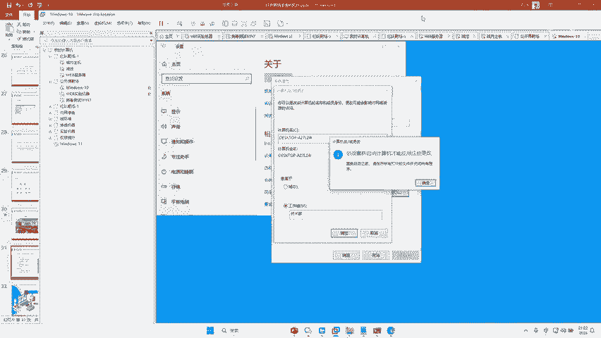

Awei。我给大家那个什么一下啊。😊，在这里看一下啊。你看比如说我想查看这个电脑上有几个账号，对不对？好，我放大大家看一下。😊，耐。耐优的好。来，大家看一下，这里是有个账号，你看dest AR7的用户。

这是什么意思？就是这个电脑的计算机名，对不对？所以他这个账号名叫什么？叫这个东西，斜杠，这里是有个ad me啊。😊，好，这是这个账号全名，对不对？前面是什么机器名，后面是什么，后面是用户名。好。

那这个账号是什么账号？是不是本地账号？本地账号为什么是本地账号啊？因为本地账号的形式什么？机器名，斜杠账号名，前面这个是机器名，后面这个是账号名，所以这个是本地账号。那么域账号的形式是什么啊？

前面是域名，后面是账号名啊，比如说这个域名叫什么？叫JOD斜杠。我的密好，那这两个账号，比如说你到时候渗透时候，你发现哎你发现这个电脑上有两个的密，一个长这样一个长这样。😊，OK所以你就分辨出来。

后面这个是玉米。😊，前面这个是计算机名，对吧？那有人说啊，我怎么知道这个是计算机名，这个是域名，对吧？那我们到时候控制这个电脑之后可以查看呢？比如说host想上计算机名，也就ho host name。

对吧？你看就查出来了它是计算机名啊，想看域名啊，你直接什么我们看一下，对不对啊？所以这里我们要知道啊，计算机名跟。😊。

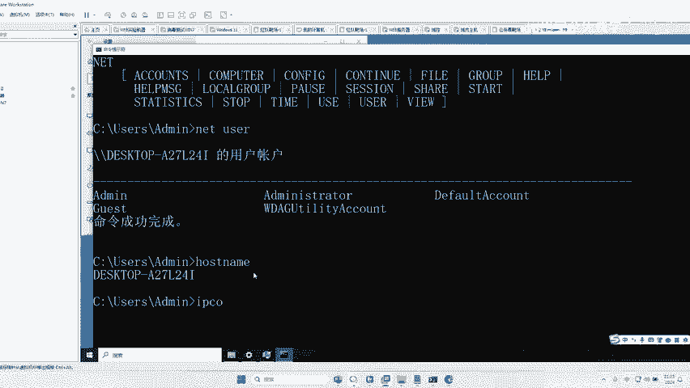

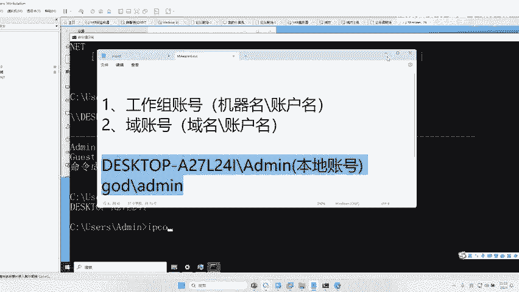

这个什么。跟域名好吧。好，那接下来啊讲完这个概念之后，我们再回到我们的实验机器里面啊。😊，好，这里给大家问题。好，我们刚才这个web服务器是不是登进来了？好，我现在在这里好锁屏一下。😊，好。

然后我们登进去。好，大家看一下这个电脑前面叫GUD斜杠administ，是不是它的名字？所以这个GOD是什么，你现在也不知道它到底是机器名还是域名，我们不知道，对不对？所以我们先登进去查看一下。😊，好。

先用密码登进去。好，登进去大家在这里。😊，看一下。

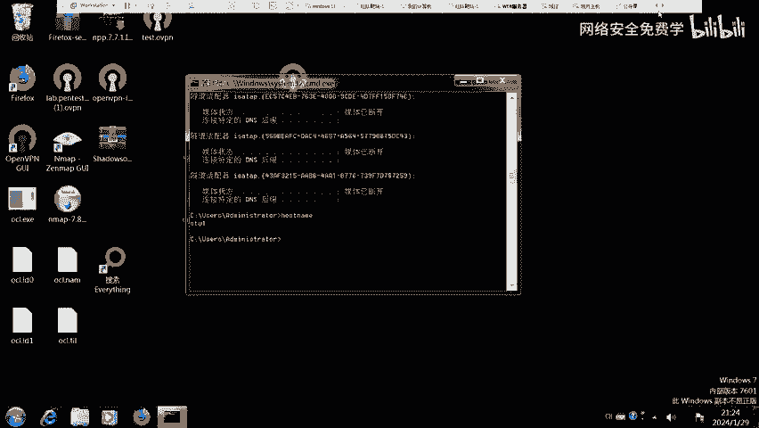

来这个电脑的机器名叫什么？STUE。

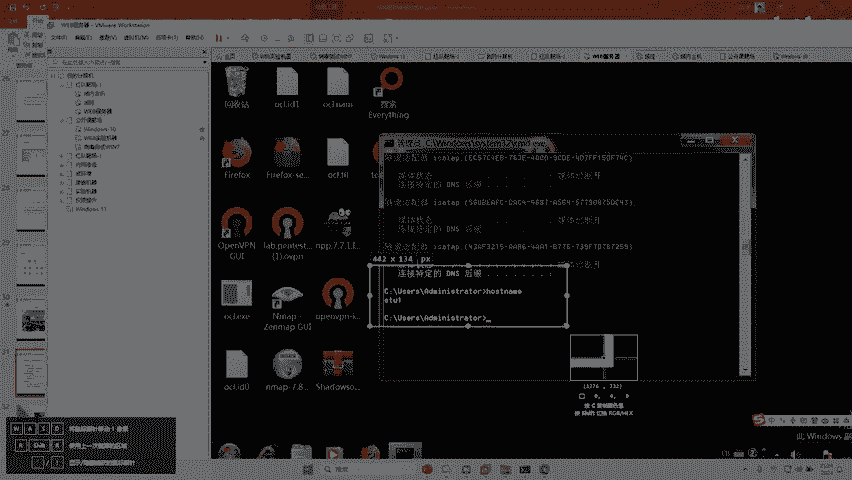

所以你告诉我刚才那个GODadminist是什么是什么账号？😡，是什么账号？😊，这个电脑叫STUE它的机器名。但是你刚才看到叫什么？它叫JOD。所以说你现在登录进来这个账号是什么账号，它是一个预账号呀？

兄弟们OK所以我们来登这个预控来看一下。😡。

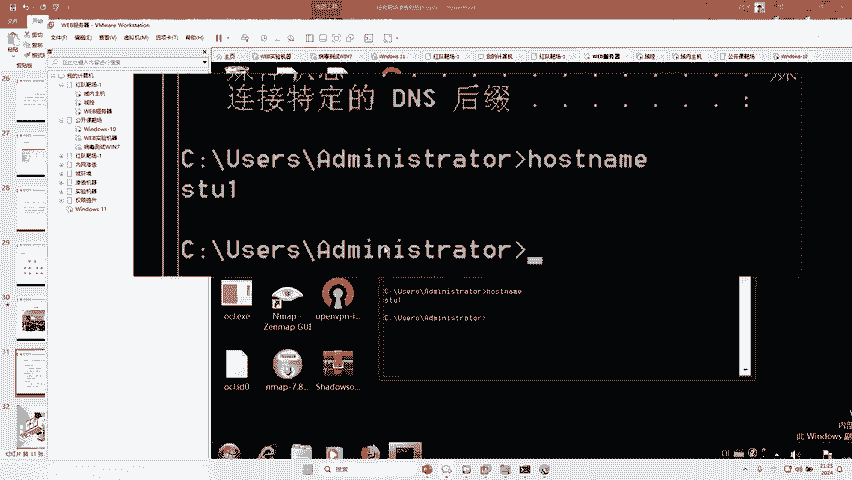

好，你发现在这里我们预控这个账号，对吧？我们修改一下切换用户，我们切换到什么JOD斜杠。😊，我都没催塔对吧？ADMINISTRATO啊好，密码来看一下。GOD administrator那密码是什么？

是不是还是同样的？同样的红日SEC艾特2019啊。好，所以我们再写写进来啊，所以他们预账号名字是一样的，好不好啊？回车啊，他说你密码已过期的，必须更改。😊，对不对？好，我们点击确定。好。

你在这里更改一下。😊，艾t2020对吧？我们改成2020。好，是这样改。好，哎，他你。😊，好。密码。红日C艾2019，对不对？好，新密码红。日SEC艾2020。从日SBC拍到。2020。

O密码更改了对吧？好，我们就登进来了。好，那么现在我把这个域账号的anmin改成了红日SEC2020，所以这三台电脑对不对？就全部改了啊？因为这个域内主机对不对？它什么？它也可以用这个账号密码登进去。

😊。

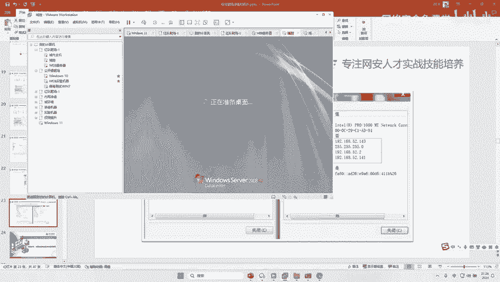

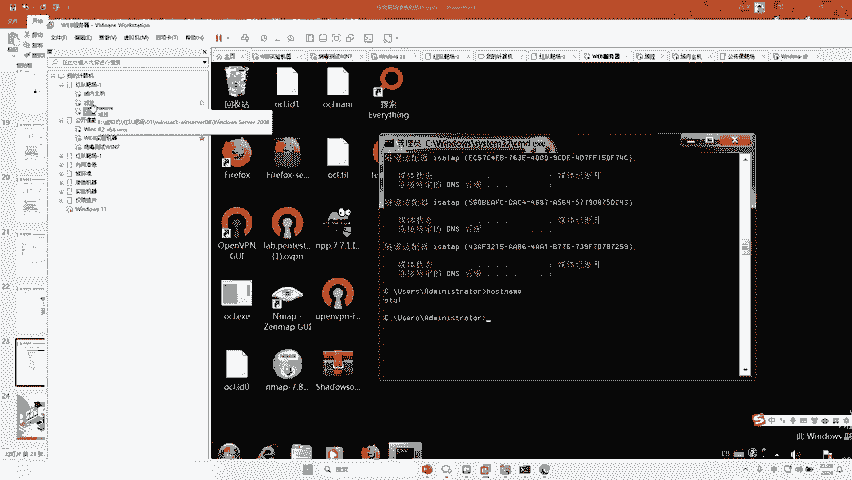

啊，什么红日SEC at2020登进去，对不对？う这。嗯再等一下啊。好，登进去了，对不对？你看我用2020的密码登进去了。😊，对不对啊？没有问题吧。哎，那这四单电脑账号密码都改了，哎，OK了，好吧。😊。

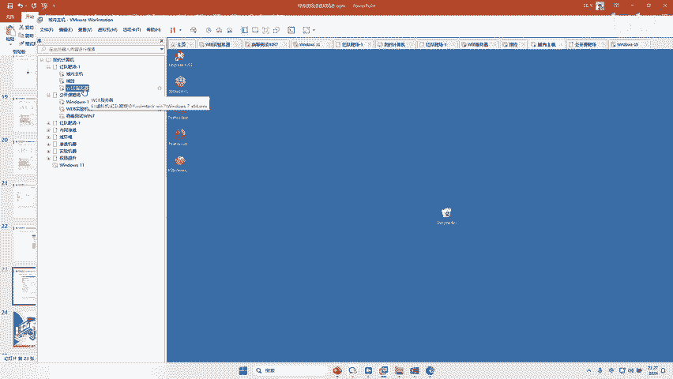

这个大家明白没有？所以这个账号有人说哎，你讲这个账号什么意思？因为后面的渗透我们有用到它。😡，老师字很小，对吧？啊，这个字没有关系，我我是给大家做实验的，对吧？好，这我又说一下啊，关于这个工作组跟域。

听懂没有？你这个概念听懂没有？听明白给你李波扣李李哥扣波一好不好啊，你给你李哥扣个一，李哥看一下啊。你你要知道有人说没有录播，是不是告诉你李哥在这里偷偷给你们录着呢啊，你们不要告诉别人好不好啊。

你们如果谁想要，到时候我都私发给你就行啊。不用担心，如果说你想学的话，对吧？我非常乐意帮助你们好吧，大家不用担心啊，说没有录播啊，班主任是那样说的，对不对？但是我偷偷在这录着呢啊。😊。

大家别告诉别人好不好啊。到时候我先让申请一下，能不能给大家都可以，好不好嗯？😊，反正你只要能听懂好吧好？你说哎哎这个李哥，我听懂了，但是我没有操作会，这个都是小事儿。你回头再看笔记录播。

我就害怕你上课没听懂，你没听懂就不行，你没听懂，我都不可能再给你讲第二遍，对不对？但是你听懂了，但是忘了，你可以再去看。再讲一遍玉是吧？喂。你听我讲这么久了，你不知道我是谁啊，对不对啊，是不是啊啊。

你没有听懂玉啊？我跟大家讲一下域跟工作组的分类是啥？其实非常简单啊，就是域就是你的小学高中啊，电脑在这个域中它是有统一管理的机制的，由这个域控去管这些电脑，工作组类似于你的大学，对不对？

电脑是自由散漫的，一般来说我们公司的电脑，要么是工作组，要么是域。所以呢根据工作组跟域不同的环境，我们就诞生出来了工作组内的渗透，跟域中的渗透，对不对啊？域中我们有域账号可以去渗透。

工作组中我们有本地账号可以去渗透，对不对？所以说你渗透的方向就不一样了，方法就不一样了。😊，对对，就是加入了安全边界的这个助机，加入预住。那怎么加入域，对不对？你必须有一个预控嘛啊，然后干嘛呢？啊。

然后。

啊，你看点击这个电脑。因为我们当前这个环境已经加入域了，对不对啊，所以已经加入域了，所以是。

你可以看到他加入域的啊。怎么看加入域，到时候我们渗透再说，对不对？所以大家先把这个概念了解清楚，加入域也非常简单，对吧？就是在你的要配要加入域就非常就是加入域是非常简单的，但是配置域环境比较复杂。

你要去有好几台电脑，对吧？先一个先1个201920182008都可以搭一台预控，对？搭完预控还要搭DNS服务当然DNS服务还要配置不同的IP啊，设置DNS啊，最终才能加入预控。

是不是啊所以它它是比较麻烦的啊，但是呢我们这个环境里已经给大家搞好了，对吧？已经加入到域了啊，所以大家不用担心啊，所以这个东西就可以直接搞了，对不对？好，那到现在讲了一个半小时了，对吧？

我们终于可以进行渗透了，对不对？所以我们今天再给大家讲最后一个内容，对不对？最后一个内容啊，就是我们渗透的第一步。😊。

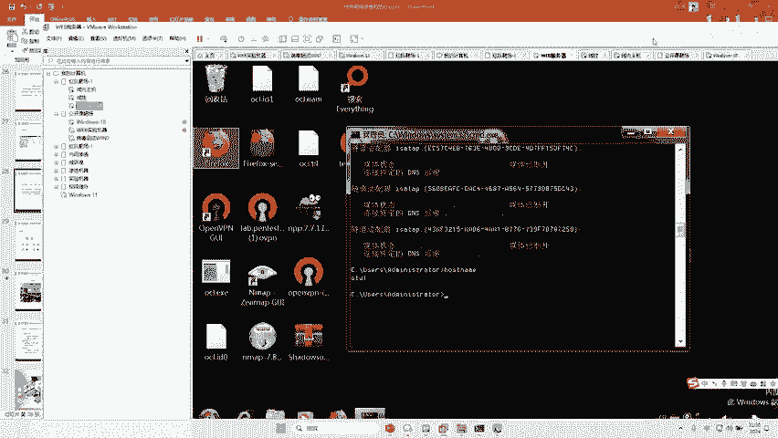

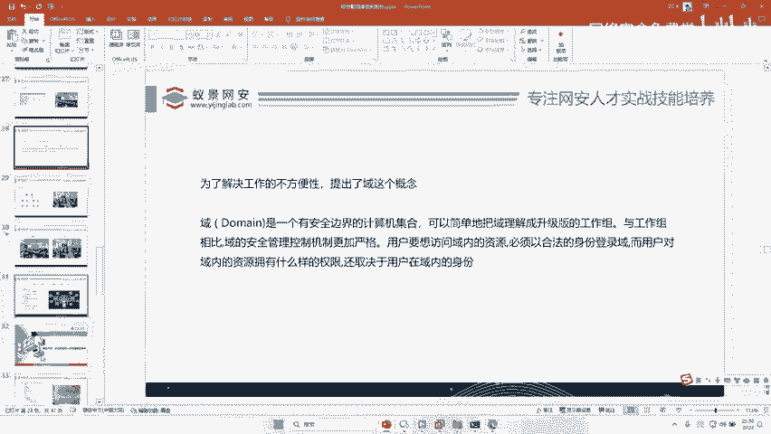