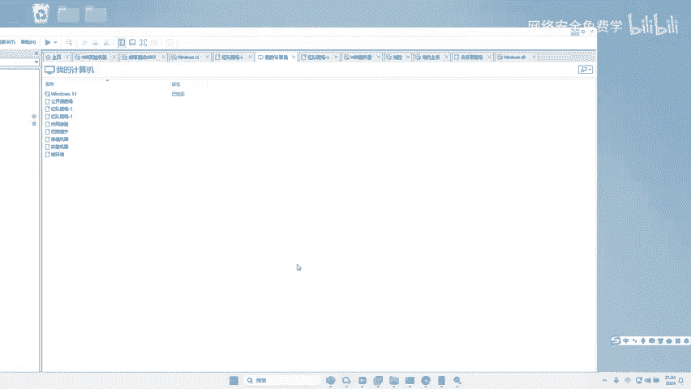
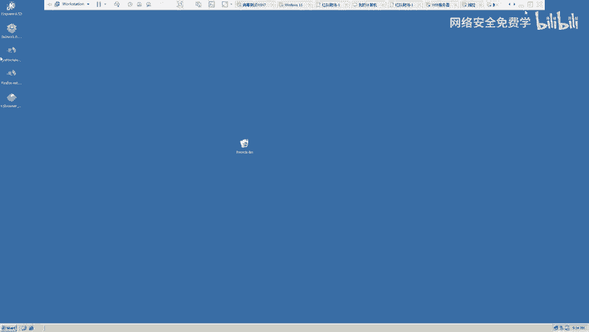
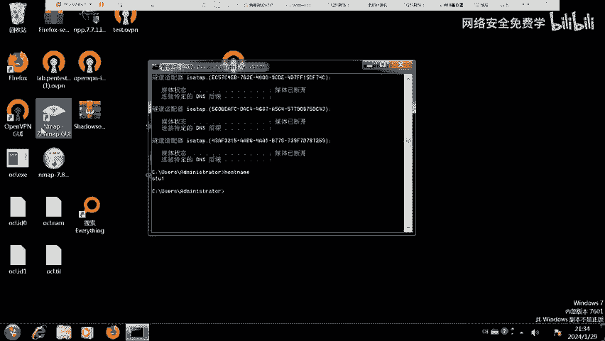
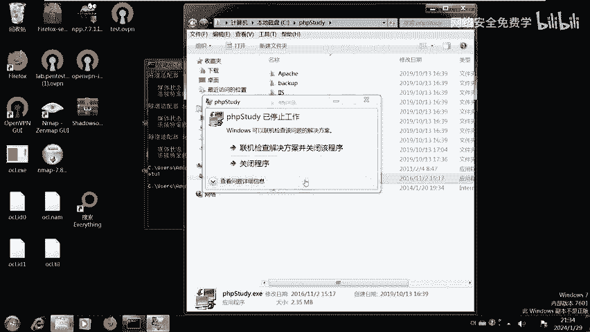
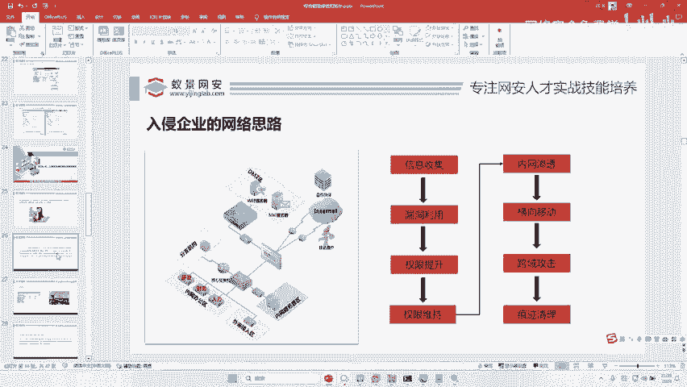
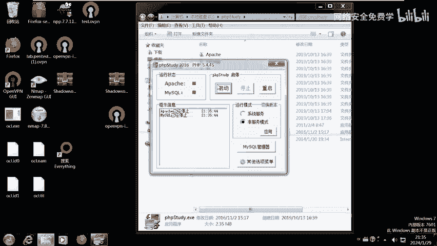
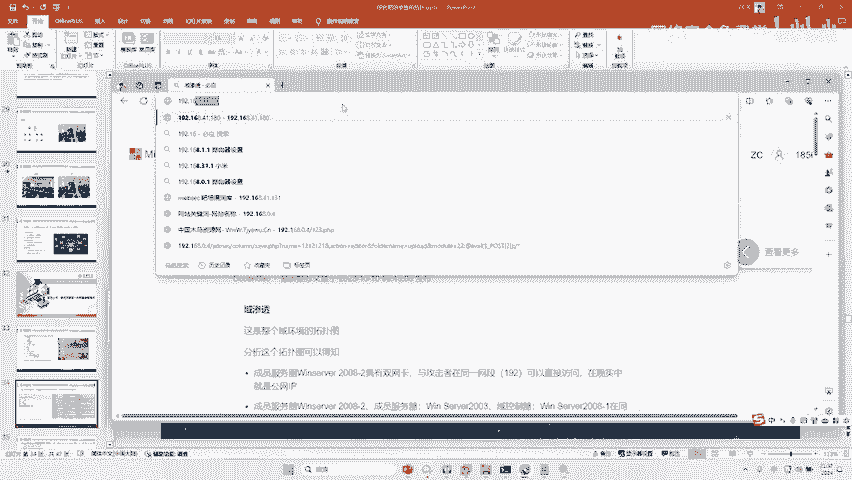

# 2024B站最值得看的黑客教程 ｜ 网络安全／渗透测试／内网渗透／漏洞挖掘／web安全／kali linux／红队靶场／CTF／信息安全 - P103：渗透测试第一步信息收集技术 - 网络安全免费学 - BV1uBsTetEow

啊，有人刚才问啊，有人刚才问这个工作组账号跟域账号有什么区别啊？肯定啊工作组账号只能登录到自己电脑，预账号可以登录到任意电脑，对不对？比如说我有个域账号叫张三。

那么这个账号可以登录到内网中的任意一台电脑，因为它是域账号，它随便登。那么如果说这个电脑的本地账号叫张三。那么你只能登录这个电脑，那其他电脑登不进去。对不对啊？所以在红队打这个公司的时候。

比如说我们之前打这个呃这个三峡三峡大家听过没有？三峡集团。啊。打这个三峡就是那个三峡大坝啊，他们公司就有好几个域啊，域比较多，对吧？啊，一个月、2个月、3个月、4个月、5个月啊，这个域之间还有信任啊。

我们打第一个月跨过去打第二个域，三个月到第四个域啊，每一个域里面都有。很多电脑啊，最终摄像头什么都搞定下来了，对吧？但是我们搞的都是谁，搞的都是预控对吧？吧？预控一搞账号密码一看其就就结束了。

这个就是一般来说啊就是红队的最高级就是打到预控，拿到预控就结束了啊，就拿到预控也就代表着这个企业已经被打穿了，打废了，打积木 over了，明白吗？啊，因为秦子一线金王已经把班主任擒住了啊。

所以我们这两天的实验也是需要打到预控的，好吧。😊，好，那么接下来啊我们就是进入。😊，Yu。Guanying。预管理的机器有上限吗？没有上限没有上限，对吧？你可以设置很多预控，对吧？

因为你班级班班级里面有很多班主任，对吧？无所谓。😡，好，我们来看第一步，我们刚才在这里给大家讲了，对不对啊？入侵企业的第一个思路叫什么？叫信息收集，信息收集是干嘛的，对不对？信息收集是干嘛的？

就是对这些企业的相关信息进行收集。好，那我们来看一下今天我们的收集怎么收集啊。那李哥在这里是不是给大家提供了几个工具啊，我们把这个工具先下载下来，好不好啊？现在下来。😊，好，我把这个工具给它复制出来啊。

😊，啊，想一想啊。第一天。好，工具好，这个工具大家可以去百度网盘里面下载。好，那接下来你就可以拿什么呢？哎，拿你的电脑去进行渗透的，拿你的开立什么的，对不对？去攻击这个电脑了，对吧？好。

所以我们第一步先去扫描一下这个电脑啊，我们怎么扫呢？哎，我们是不是已经知道了我们要入侵的目标是多少，192。168点。😊，111。128，对不对？这是我们要入侵的电脑。好。

所以我们先把这个电脑是外部服务器，对不对？好，把它复制到里面来啊，点击扫描。😊，啊，这个时候还没完呢啊，我们得先开个服务啊。😊。

好，大家记住啊，等这个环境搭完成之后，大家去这个什么去我们的这个web服务啊，web服务就是我们的这个web服务器里面啊，找到它这个C盘里面的这个C盘里面有一个PHP study啊。

把这个官网给它打开啊啊，官网给它打开。好，如果你的电脑已经出现了这种预啊错误，对不对？你看比如像我们的电脑现在是不是你看啊，它停止工作了，那你就把你的电脑干嘛重启一下，好吧，重启一下。😊。

好，重新启动哎，重新启动就可以了，对不对？我们现在的目标是192868111。128。所以我们第一步渗透是不是要对这个。

目标的IP进行一些扫描啊，他开了哪些端口，对吧？因为在这个新息收据里面包含的内容比较多啊，什么公司邮箱啊，因为我们毕竟是模拟的对吧？这些公司邮箱都不要做了，我们只需要做一个端口扫描。😊。

对不对？做一个目录结构的扫描就可以了啊，其他的就不用了，对不对啊？好。okK好，在这里输入密码。😊，哎，登进去对不对？好，登进去之后，哎，我们干嘛呢？哎，我们打开计算机啊，点这个C盘PV study哎。

😊，啊，运行启动。

哎，把它启动起来。好，启动起来之后，哎来开始扫，对吧？来，我们先这里用什么可以扫呢，对不对啊，不用改这个IP地址啊，这个IP地址我们之前已经改过了，对吧？你直接启动就行了哈，我们那击扫描。😊，好。

大家在这里是不是能看到这个IP地址开了一些端口，哎，什么801351394453306，对吧？那为什么要扫端口？其实非常简单，就是每个端口对应的不同的服务，对不对？我们来看一下，比如说80端口。

大家看一下，就是不同的端口对应不同服务。那不同服务就有不同的攻击方式，对不对？那80一般是我们的什么外b服务器，所以我们就可以用浏览器去访问啊，比如说它开了什么53端口。

你就可以用这种DNS截持预传送漏洞，对吧？开了什么2223，你就可以用一些什么口令暴力破解。是不是哎这些相关工具。去扫啊，比如说他开了什么139445，你是可以试试用这个永恒之蓝去打。对不对啊？

不同工具对。端口对应不同漏洞啊，这个工具大家可以去下载，这个是一个遇见的轻量版的啊什么端口扫描工具啊，比较快啊，我们是不是能扫出来对方是开了什么80的。好，那我们就用web浏览器去访问下这个80。

啊，回车。哎，是不是能访问到这样一个网站啊，对不对？访问到这个网站之后，那接下来要怎么做了？哎，就要进入我们的下一步了，对不对啊，去渗透了啊，对不对？那之前大我要问一下。

你们有没有人学过啊一些漏洞渗透信息收集的技术，有的话扣个一啊，如果你学过，那现在你就可以干嘛了啊，你就可以开始攻击了啊，先把这台电脑控制下来。然后通过这台电脑。

你再去把我刚才我们刚才设置的那两台电脑给它控制下来啊，你现在就可以试了。如果说你不借助任何文档，能把这台电脑控制了，并且能成功的啊去把预控控制了。那么我可以告诉你啊，你现在可以去找工作了。😊，啊。

直接找工作吧啊，如果说你不介入任何参考，你就给你一个这样的东西啊，你就直接打啊，你会打就你第一次啊通过自己学的知识啊，通过网上白学的那自学的那些知识，对不对啊？把它打穿了啊，把育空控制下来了。

班主任搞定了，你信我啊，你现在就可以找个班上，对不对啊？你学过永恒之蓝肯定不行啊，那太low了啊，永恒之蓝没有人用啊，那都是骗小孩子的好不好啊？我们真实的是不会这样去做的啊，不会这样去做的啊。😊。

