# 2024B站最值得看的黑客教程 ｜ 网络安全／渗透测试／内网渗透／漏洞挖掘／web安全／kali linux／红队靶场／CTF／信息安全 - P104：打点技术和漏洞挖掘思路 - 网络安全免费学 - BV1uBsTetEow

今天会讲什么啊？今天就会讲我们如何去攻击昨天的那个企业。对不对？哎，一般如果说你多长时间左右面试，一般6个月，4到6个月，你只要每天都认真学习，你找个工作没有问题，好不好啊，就害怕你三天打鱼两天晒嘛。

对不对啊？😊，好，这里要给大家讲讲好吧，我们来看一下啊，那总我们知道了我们目的是什么啊，就是入侵什么，来，我们来写一下我们的目的啊。😊，啊，今天我们的目的啊就不是搭建八成了啊。今天我们的目的是啥？

目的什么啊？😊，控制哎192。168。111。128这个电脑对不对啊？要把这个电脑给它控制下来。我们只知道这个IP通过这个IP到底是如何控制这台电脑，哎，我们要一步一步做。那怎么做，我们得按照流程来。

对不对？那么李哥在昨天的时候给大家讲了什么啊，我们渗透测试它是不是有流程的呀，它并不是瞎渗透，还记得吗？哎，在这个有道云笔记里面啊，我们来再去看一下。我说了，作为一个黑客来说，他不是毫无章法。

他不是我拿着工具一顿乱打，对不对？这样是不行的啊，他一定是有步骤，有纪律的那第一步昨天也给大家讲过了，对不对？怎么去入侵企业，第一步就是信息收集，信息收集昨天也讲过了对吧？好比你要抢银行，对吧？

你第一步就踩点嘛啊，你看那个银行外面有几个探头啊，警察什么时候来，对不对？我的设计路线怎么设计啊，这个银行哪里比较薄弱啊，我哪里能攻进去，几点工，对吧？几个人手怎么砸啊，他有没有防弹玻璃。

你得把这个点才好啊，你才能做坏事，对吧？所以说入侵一个企业，第一步就是信息收集，好，那信息收集，哎，我昨天给大家略微提过一嘴，对不对？所以信息收集呢也叫打点技术，为什么叫打点啊，本身他想想叫踩点。

对不对？就跟我们这个啊犯罪片里面也叫踩点一样啊，但是觉得踩点这个字啊，不太好听啊，好像是想干坏事啊，所以我们把这个踩非什么打啊，是个打点技术，我们来看一下打点技术到底如何去搞。哎，我们来看一下啊，😊。

啊，那么怎么去打点啊？昨天我给大家就是说啊简单去用了个工具，对不对？哎，然后呢，但是也讲的不详细，那今天再给大家讲讲，对不对啊？所以有句话叫做知己知彼方能百战不殆，对吧？你要攻击一个企业，对不对？

你要做到什么程度，你才能把这个企业。比如说你想把中国移动给他控制下来。那么你要做到什么程度，你要做到你比中国移动的员工还了解中国移动，那么你就90%就能把中国移动给他打进去，对不对？就是这个道理，对吧？

所以叫知己知彼才能百战不殆。那怎么去。😊，知己你肯定知己啊，你自己什么逼数，你有什么技术，你心里门清，对不对啊？那知彼那就怎么知彼呢？哎，我们就要用到什么信息收集技术啊，那么对于一个企业来说啊。

它有很多信息啊，比如我们公司的股权结构啊，公司的邮箱，公司的手机号，公司的端口啊，比如这台电脑开了几个端口啊，公司有什么网站，有什么小程序，有什么APP啊，有什么源码，对不？有什么子域名。

这些都是我们要探讨的重点。那么因为时间有限，篇幅有限，就光这个信息收集啊，让我如果说全部给你讲完，那我可能要讲一个月吧？我一个月全部讲信息收集我都可以，但是啊我们今天是打靶场，我们就就这个靶场来学习。

那么我们今天对这个靶场来说，哎，我们要收集什么信息呢？哎，我们需要收集目录信息跟我们的端口信息啊，我们就要做这两个信息收集，对不对啊，那么昨天的时候也给大家去。😊，演示了这个东西啊。

那么今天哎我们把我们的虚拟打开，是不是啊，接着来进行实操。

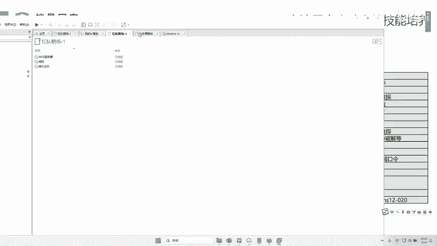

啊，我们今天呢这个渗透只需要打开这台外部机器啊，其他两台先不用打开啊，因为其他两台打开之后，我们就要涉及到预渗透了啊，预渗透呢现在还还没有到，对不对啊？我们先把这个电脑打开啊，打开之后呢。

把这个star启动，启动之后大家记住啊，去这个控制面板里面啊，把你的防火墙给它开开啊，不要给它关掉，因为这个默认这个防火墙是开的，对吧？我们昨天讲了，你就拼的时候把它关了，对吧？只是为了测试啊。

那这个时候就把它开开，把它恢复成这个最原始的系统。好，那这个时候开完之后。😊。

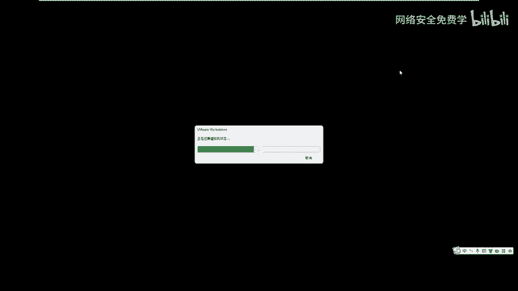

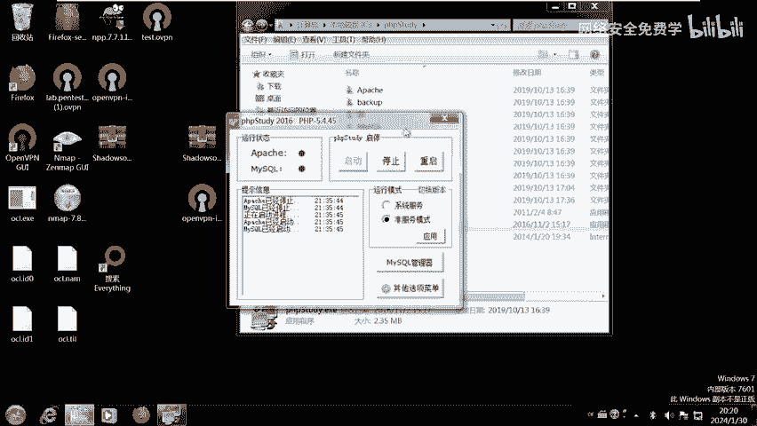

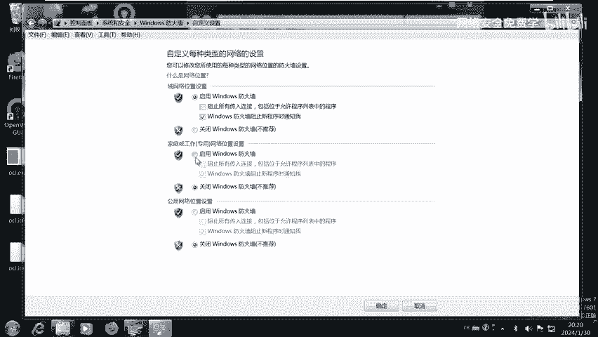

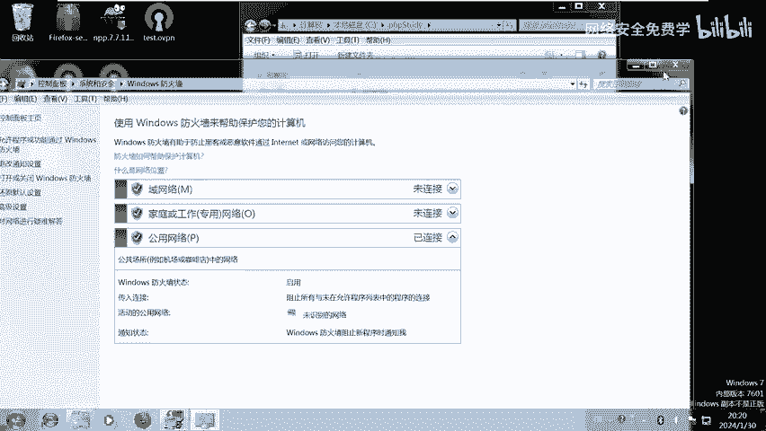

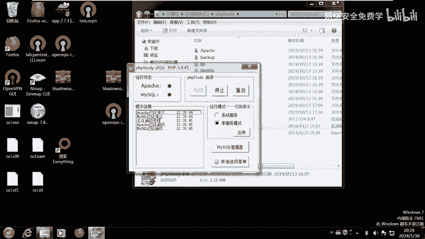

好，就可以渗透了，对吧？来，我们来第一步，对不对？那么我们刚才说了，我们的目的是什么？是不是要控制这个电脑呀，对吧？那我们第一步是不是信息收集？😊，哎，那么要收集什么信息？第一个是不是端口啊。

为什么要收集端口，对不对？因为不同的端口。对应。对应不同的服务，对不对？那么不同的服务啊有着不同。的攻击方式，对不对啊啊什么叫端口啊？就好比什么叫端口啊，非常简单啊，就还是那个例子，对不对？

比如说你想入侵一个城堡，对不对？你把这个城堡看成一个电脑，那么入侵这个城堡就有很多口，对吧？它有窗户，它是一个口，对吧？它有门，它是一个口，它有天窗它是一个口，它有狗洞，它是一个口，对吧？它还有后门。

它是一个口，对？它还有地道，它是一个口，对吧？那对于我们电脑来说啊，它身上也开了很多口，对吧？这些口呢对应不同服务，比如这台电脑呢，它有web服务器，还有数据库对吧？还有什么3389啊，不同服务。

我们就可以干嘛呢？我们就可以对应不同的攻击方式了，对吧？所以我们必须要去扫描这个电脑的端口，那怎么扫描，哎，有人昨天就说了哎老我用开可不可以K肯定可以啊，老师我用Zmap可不可以OGK也可以行不行？

就是任何端口扫描工具都可以，对吧？你喜欢用哪个啊，就用哪个好不好啊？那么我们本次用的是哪个工具呢？啊，昨天也。😊，他说的对不对？啊，好那。不同不同的服务有着不同的攻击方式，对不对？好。

那我们我们本次用到哪个工具啊，是不是这个TCP预见扫描工具啊，这个工具的优点是什么？是它高效速度快轻量级电脑双击就可以运行啊，不需要我们额外去装什么东西，对不对？所以我们先用这个工具去扫一下啊。

当然跟它相关的工具是非常多的对吧？大家啊就慎重选择嘛，对吧？就跟你要买车对吧？那啥牌子都有，你喜欢哪个用哪个哪个顺手用哪个就行了，对吧？好，我们先打开这个TCP遇见扫描工具，那这个工具怎么用。

其实就是傻瓜式工具了啊，是个人应该都会用啊，把你的这个什么想要的这个IP写进来就可以了。那么我们本次刚才已经说了，要工具的是这个电脑，对不对？那我们就把这个IP啊干嘛写进到这里面来，对不对？

然后开始扫描。😊。

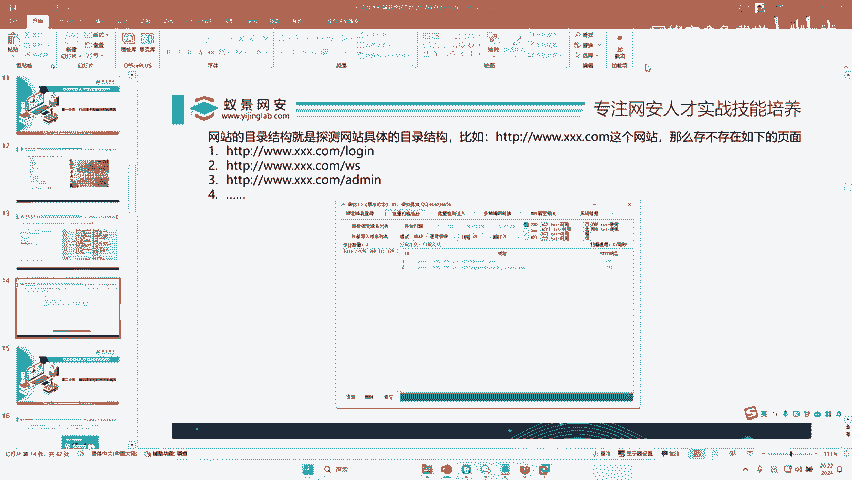

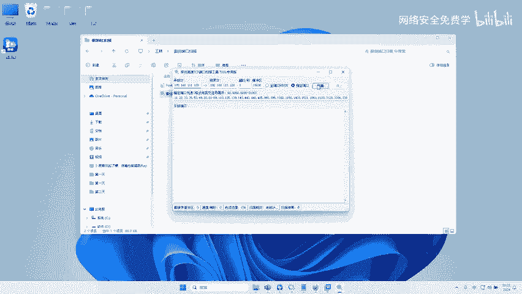

嗨，扫描之后，我们在这里可以看到，那么这台电脑是不是开了80端口跟3306端口呀，对不对？那么80端口哎，根据李哥给你提供的这个表里面，我们是不是看到80端口，它是什么？它是的web服务。

什么是web服务啊，就是我们通过浏览器可以访问的网页啊，网页就叫80端口。那么还有一个叫33006，对不对？3306是什么啊？是我们的数据库端口，对不对？

数据端数据库的端口就用有着注入或者爆破等相关方式，对吧？假如说呢你用80没入侵进去，那你就开始入侵这个3306啊，就跟你入侵家城堡一样，对吧？你这个窗户没砸碎。😊，那你可以破门啊，你门没砸碎。

你可以搞天窗呀，天窗没搞碎，你可以找狗洞啊，狗洞没搞坏，你可以找地道呀，是不是哎，反正无所不用啊，什么招式都可以用，目的一样，都是要把它什么控制下来，对吧？好，所以呢我们先第一步先找一下这个80端口。

那这个80端口怎么去访问啊，就是非常简单，我们用浏览器去访问啊，192。168。111。128回车对不对？来，我们是不是能看到这样一个页面啊，对吧？那么看到一个这样页面的时候，很多人懵了，哎。

那这个页面我怎么去入侵呀。😊，对吧好，就好好，比如说我们这个和田网安。😊，啊，和联网实验室一样的。哎，给你这样一个网站。😊，啊，比如这个网站来，现在把我们的这个网站给它攻击下来。😊，哎攻下来。好，哎。

你懵了呀，怎么攻击啊，对吧？你可能会点点点。好，那么我们黑客的步骤是什么，对不对啊？遇到一这样的网站来，我们应该怎么去做呢？😊。

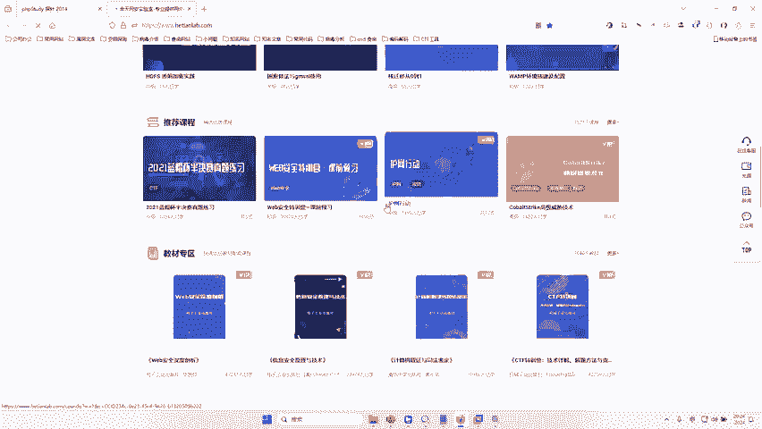

啊，有人说好，那我看找一找这些地方，对不对？有没有注入点，对吧？好，那这里用到的什么技术？就是在这个网站上面找漏洞。😊，啊，遇到网站啊。在网站。网站上面找漏洞。好，那这个技术叫什么？听好了啊。

遇到网站在网站上面找漏洞的技术。好吧，听好了，就是我们网络安全界大名鼎鼎的web渗透啊，web渗透是干嘛的，就是遇到网站在网站上面找漏洞啊，仅凭一个web渗透，工资就可以拿到多少啊，1万块钱左右啊。

如果在好一点的企业，你可以拿到一个多少，拿到1个150001000。明白吗？就是你要学会，只要你会在网站上面找漏洞啊，那这个专业名词叫web渗透工程师，对不对？啊，也可以叫渗透测试工程师。

这样的工程师啊，薪资就可以拿到1万块钱多，对不对啊？那在网站上面找漏洞都有哪些漏洞呢？对不对？啊，网站都有哪些漏洞，那这个东西就需要我们去学习，对不对？哎，我们一步一步去学习。好。

那么网站上面有什么漏洞？😊。

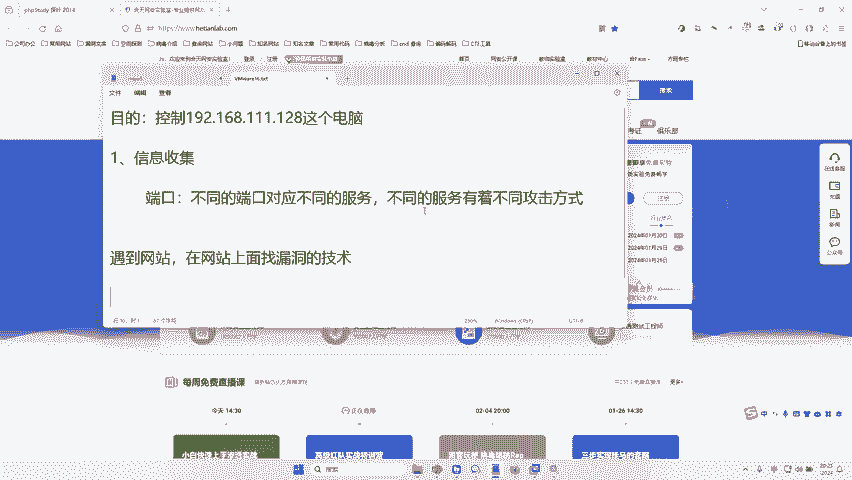

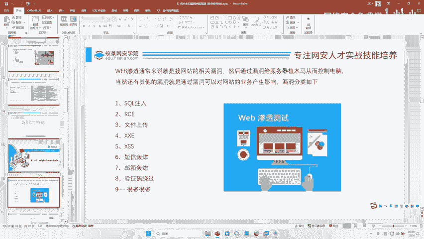

好，来给大家看一下，对不对？你看。来我们来看下，你看外b渗透通常就是在网站上找相关漏洞，对不对？然后通过漏洞干嘛呢？啊，为什么要找漏洞非常简单，对不对？就是通过漏洞啊控制电脑。

或者说通过漏洞可以危害到你的这个网站啊，对不对？那这样的话我们就可以拿到一个比较好的漏洞啊，或者一个高危漏洞，那这些漏洞都有哪些哪些分类，对不对？你看这里是不是有非常多注入RCE文件上传。

这里李哥写的只是什么1%，那有没有更全的那个漏洞的啊学习的东西呢？有李哥昨天是不是告诉你，我说如果大家不知道怎么学不知道如何去学，对吧？李哥在这里给大家整理了啊这个外b安全学习的路线。

这里面90%都是漏洞，对不对？为什么要这样学，因为我讲了对吧？你会外部安全就可以找外渗透测试的工作，对不对？你看这里面大多数都是漏洞？中间漏洞注入对不对？你可以在里面去看对不对？

暴力破解C注入文件上传逻辑漏洞，对不对啊？审计移动安全反序列化，对不？漏洞。😊，扫描器OA系统好，在这里面是不是非常多，每一个都可以点开看里面详细的内容，对吧？那因为篇幅有限，对吧？😊，啊。

这哥不可能说把每一种漏洞都给你讲，对不对？我把这个漏洞光光讲一个思Q注入，我可能就要讲7天啊，才能给你讲明白。所以因为3天的训练营，我们是不可能给大家讲这么多的对吧？所以我们只能精简化去讲，对吧？😊。

Okay。好，话多说了哈，那么找漏洞找漏洞怎么去找啊，当然是用手找，对不对？用手一个一个找。那有没有一些东西能帮助我们快速找到漏洞，辅助的有对不对？其中一个工具就是什么？这个目录扫描器啊。

那这个目录扫描器就可以帮助我们快速的去。😊，发现扫描一下这个网站存不存在一些暴露页面，有一些漏洞，对吧？那这个目录扫描器是干嘛的？哎，给大家举一下举下例子，对不对啊，比如说呢这里有一个网站。啊。

他长这样啊，3W点叉叉叉点com对不对？这是他的网站，那每个网站后面还有它的链接啊，比如叫什么一点G啊GSP。对不对？1点GSP哎，这个1点GSP是它的后面的东西，对吧？那它可能还叫什么？

它可能还是叫什么AMAJE对不对？imagage是图片，对吧？1点OPG哎，那这样域名链接是不是就是它的一个图片地址啊，对不对？所以这个网站前面这个域名是固定的，后面这个什么路径，它是不固定的啊。

就后面这个东西我也不知道网面后面这些东西是什么，对不对？所以我们就要干嘛，我们就要去猜怎么去猜对吧？我们就可以写很多字典猜它后面这个有没有一哎，有没有2有没有三有没有4。

然后我们整理个10万个这样的不同的字典啊，里面写着不同的数字组合AABABC对不对？然后一个一个去测啊，去测存不存在这样的页面，那这个技术它就叫什么技术，叫我们的。😊，是吧目录扫描。啊，目多场描。哎。

目录扫描就是扫描这个网站上面都有什么页面，对不对？那这个目录扫描用到什么工具是不是也是非常多的。我们DNR啊遇见呀，我们go啊，这些都是可以扫的对吧？那么李哥今天给大家用这个工具啊。

也是非常经典的一个工具，叫做遇见这个工具呢在李哥在16年学完权就在用。现在2023年了，仍然有很多人用。所以可想而知，这个漏洞有多么的强大，对不对？好，那么接下来我们就用这个工具去扫描一下他的页面。

对不对？好。😊。

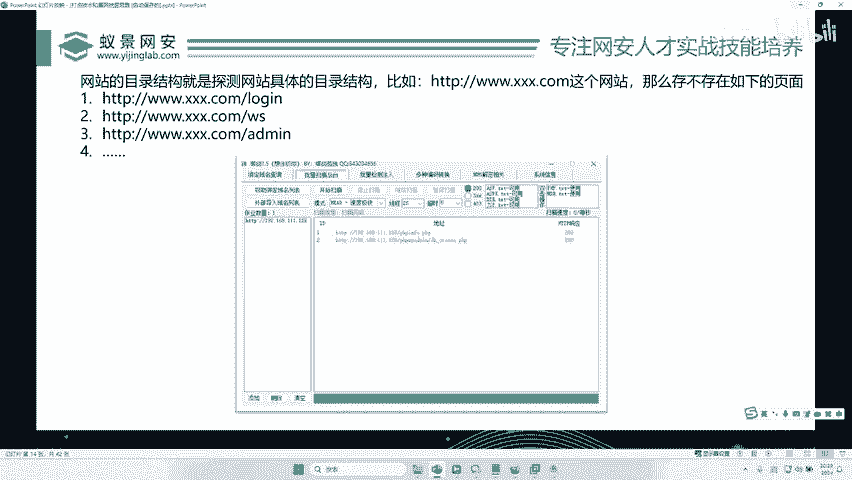

好，打开我们这个预键，对不对？双击打开啊，双击打开之后，哎，我们怎么点呢？哎，我们点击这个批量后台扫描。😊。

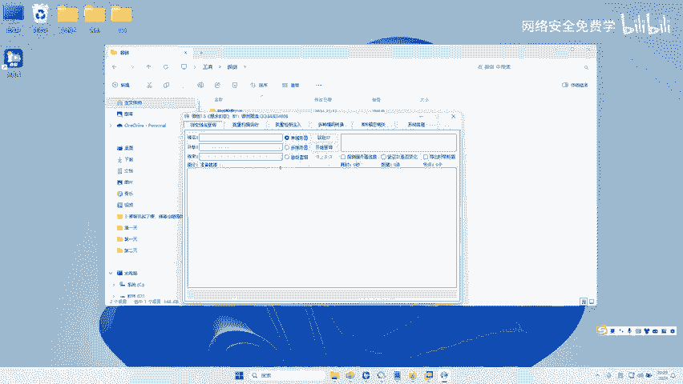

好好，点击完这个批量后台扫描之后，我们是不是可以看到，对不对？这里有很多这样的选项，我们点击底底下有这个添加哎，添加是不是好，添加。😊。

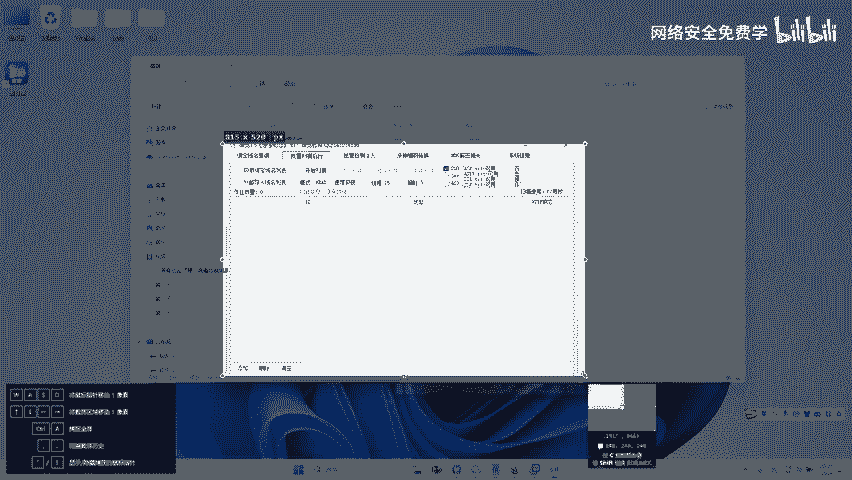

好，那这里呢让你输一个链接。那这个链接是谁呢？哎，就是我们想要扫描的网站，对不对？这是我们的网站，对不对？好，我们复制一下。好，放到这里来点击确定好，点完确定之后呢，我们可以看到在这一块啊，有一些什么。

你要扫描的字典，就是你想扫描什么类型，是AP还是还是这个图片还是路径还是勾SP对不对？你要选一下，这里大家可以把里面东西都全选上，对吧？也可以不全选，无所谓。这个呢根据你的喜欢，对吧？

我们选最后1个PHP对不对？好，然后点击这个开始扫描。😊。

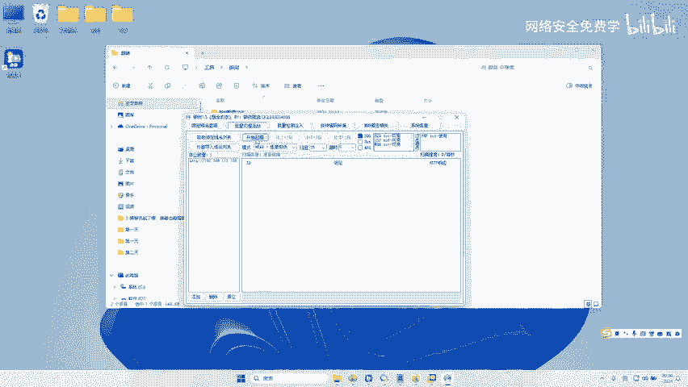

来，你看它就会什么，你看扫描出来哎，这个网站对不对？你看在128后面拼接一个这样的。

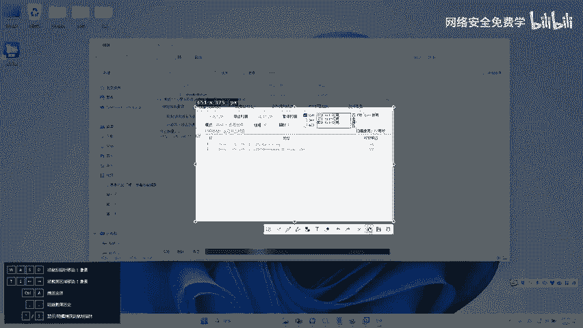

名字哎，就可以访问。在这个后面再拼接一个这样的名字就可以访问，对不对？好，那我们来试一下，我们假如说呢哎我们要去扫这个和田。当然这里我授权了，对不对？大家不要去。扫对不对？大家不要去扫啊。好。

大家不要去扫我们公司啊，是是违法违法行为，对不对？我在这里扫一下我们公司，看能不能扫描出来，对不对？好，一些好公司他可能扫不出来，对不对？啊，一些啊就是这个呢就看这个开发人了，对不对啊？

我们来看一下能不能扫出来。😊，哎。哎，我扫一下我们公司，看能不能扫出来。啊，因为我也没有扫过，对不对啊？哎，你看如果说这个工具没有扫出来，那怎么办呢？那么我们就要唉扫不出来了，对不对？

你看是不是扫出来我们公司一个这样的页面了，对不对？你看在这个移景lab后面加一个rerebot点TIT哎，就会有这样一个页面。那我们双击访问一下，你看是不是就能访问到我们网站的这样一个页面。

那这个页面对于大，你看这里是不还有一个这样的页面了。哎，我们又发现一个这样的页面，对不对？好，我们再去访问一下。😊，哎，你看这里又发现了哎，有一个这样的页面，是不是？你看那这样你找着找着。

是不是就发现了，可能会发现移警的一些。你看啊，这到哪了，对不对？你看是不是发现了移警的相关的一些安全日报呀，对不对？😊，好，那如果说你用手找你能找到这个页面吗？这些这些信息，你看这个页面。

你用手找你能找到吗？你肯定找不到的，对不对？你看这个页面对吧？😡，这是什么页面对吧啊，这个页面对吧？可能是我们公司一个页面，是不是？那在这些不同的页面里面可能就存在不同的网站，不同的作用，对不对？

大家可以看到我们公司我扫了一下，这个是真实企业，对？我们公司的企业，对吧？你看他扫了一下，对对？也是能扫到相关信息的啊，所以大家在入侵的时候啊，也是肯定是需要用到这个技术的对吧？好，那我话不多说。

我们就接回来看那么我们刚才我们的靶场上面，对不对？扫到了两个这样的页面，对不对？是不是有一个叫一个叫，我们分别就访问一下，哎，访问到第一个页面了。好，我们再访问第二个页面。😊，好，访问到第二个页面之后。

我们来看一下。好，那这里时候我们是不是就发现三个页面了，这样一个界面这样一个界面这样一个界面。好，那这三个界面哪一个有漏洞呢？😊，来，请他告诉我。哪一个有洞？哪一个有洞？等你说我怎么知道呀，对吧？啊。

那就像我怎么知道哪一个有洞啊啊，我我也不知道啊，对吧？我就我看不出来啊，那么肯定如果来说大家第一次去那个嗯搞的时候肯定不行嘛，对不对？那第一次去访问的时候，就比如说我们刚我们公司刚才那扫到那个。

我我问你哪个页面有漏洞。😡，你肯定也不知道，对不对？好，所以这个时候呢我们就诞生一个问题哈，怎么去快速找到这个公司漏洞，提高我们的效率。哎，这个问题就来了，对吧？哎，我们来看今天的第二个技术，对不对？

😊。

