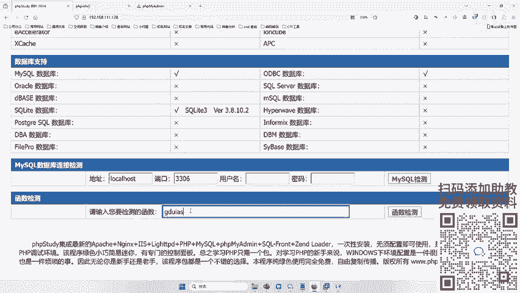
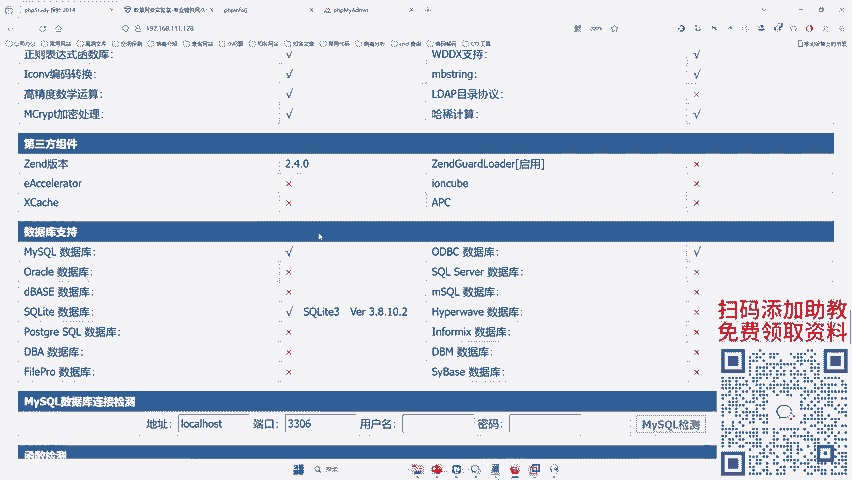
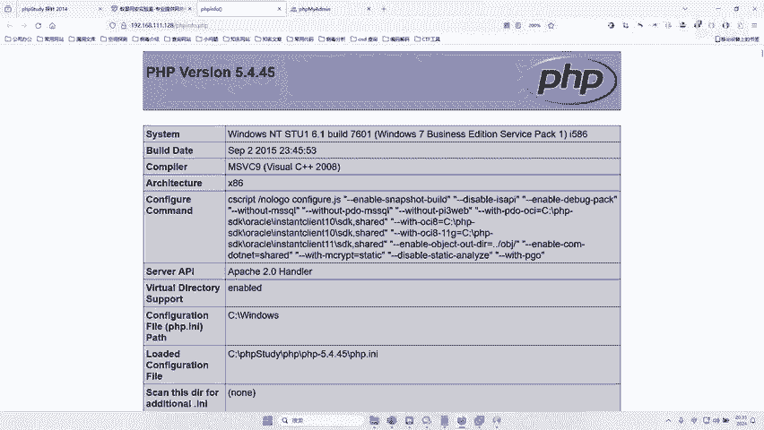
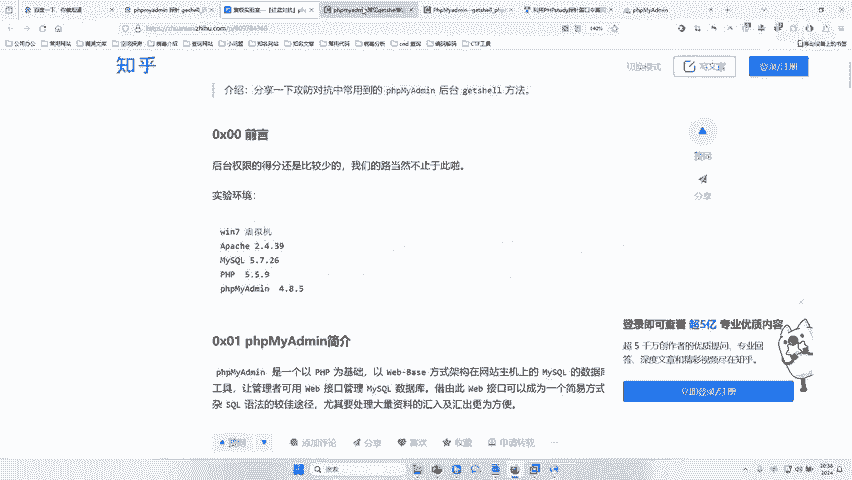
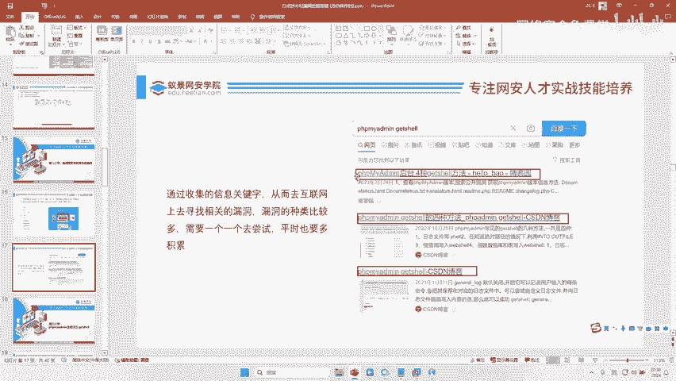

# 2024B站最值得看的黑客教程 ｜ 网络安全／渗透测试／内网渗透／漏洞挖掘／web安全／kali linux／红队靶场／CTF／信息安全 - P105：漏洞搜索与利用历史漏洞 - 网络安全免费学 - BV1uBsTetEow

好，漏洞搜索一漏洞搜索与利用和这个历史漏洞的使用技巧。好，我们一般来说哎在找漏洞的时候，对吧？找漏洞有两种方式好，听好了，两种方式。啊，什么叫哪两种方式？听好了，哎，这两种方式每个人都是这两种方式对吧？

第一种叫什么？😊，逐个。测试。第二种叫什么叫什么？😡，找特征。然后搜索历史漏洞。好，那这是什么意思呢？什么叫逐个测试？什么叫找特征？然后搜索历史漏洞。好，就是这个意思啊，逐个测试的意思是啥？

就是说你把这个你找到这个网站打开，对不对？在这个网站的能，你学到的那些技术啊，找到了这些什么这些地方输入你那些攻击的命令，就是我们学的什么CQ注入啊文件上传啊，对不对啊，一个一个去测测这些功能啊。

测这些功能有没有入口令，哎，有没有这个一些啊漏洞，对吧？比如说我们找到这个和。😊。

我们网。我们公司啊，比如说你想挖我们这个公司网站漏洞，你是不是一个一个去测啊，你看哎看下底下呢有什么东西没有，对不对？这个注册登录能不能注入啊，这后面加一个什么个包几个包对不对？

就是一个一个去测那这样一个一个去测的话，吧？哎，就逐个测试什么比较费时间，对？因为你需要一个一个点去测啊，对不对？那么还有第二种方式就什么找特征啊，因为每个网站都有特征，比如这个网站什么特征啊。

我们可以看到这个网站上面是用的叫么探针啊，啊，那这个PA可能是一个公开的一个框架或者公开的一个东西，对不对？那我们去网上搜一下这个PA探针有没有漏洞就可以了啊，或者是有这样个页面。

我们搜下这个PA页面有没有漏洞。哎，这个我们搜一下这个页面有没有漏洞哎，就通过互联网的搜索的形式去搜对不对？这个呢就就就就是什么因为互联网上有很多案例。😊。

对不对啊？通过收集这个网站的相关信息，对不对？从而去互联网上寻找相关漏洞啊，漏洞的种类比较多，需要一个一个是啊，也需要积累。所以我们你看这个网络线为什么需要积累啊，对不对？因为你只有见的多。

你今天建这个PP麦，明天见探针，对吧？你要见上1万个网站啊，你看到过1万个网站，你研究个一1万个不同的网站有不同的漏洞。那么你就是高手了，理解了吗？啊，这个就叫特征，也就是一个观感，对吧？

就跟你单身了18年，对不对啊？一眼瞄过去啊，这个狗是这个公狗母狗，你分的门清，是不是一样的？因为你单身久了，对吧？你对这个雌性的嗅觉非常强烈，对吧？啊，你挖洞挖的多了，你对这个网站他的这个啊漏洞的存在。

你就非常敏感啊，为什么高手一看这个网页面就有漏洞，因为人家见过是不是哎，就这么个道理，对吧？因为见过啊，没了，他他还有什么厉，就是因为见过，对吧？因为你没见过啊，你见的多，你就是高手，是不是啊。

所以我才说网络安全不能速成，需要积累啊，所还是一个积累比较长期的构成啊。😊，好，那接下来我们去往上搜，对不对？我们先搜这个PAP探针，那怎么搜哎，就有技巧了，对吧？好，我们来搜一下。😊，好好。

我们搜索这个名字，然后搜什么搜这个get shell啊，或者搜什么，或者搜漏洞，哎，都可以，对不对？哎，搜。哎，我们搜。啊，你看PHP探针改的是绿蒙UTS啊，什么PA。啊，探针。啊，搜人说搜不到怎么办？

😡，搜不到就搜不到嘛。说了渗透测试，它就是不同的去测。你看利用PAP探针热口令批量拿sell。哎，你看这里网上是不是有个教程啊，那接下来你怎么做？你只要把这个教程读懂了啊，在这里面去试一遍不就可以了吗？

对不对？好，那我们再搜第二个啊，我们刚才是不是还搜到一个这个页面PAP my me啊。😊，啊，by the me改的事，哎，这一搜也是不是能搜出来很多案例啊？哎，哎这个改到事。

这个改的上是不是能搜出来很多啊，你看。😊，你看哎来有几种方式，你看哎给大家讲，对不对？一个一个往上给你讲，哎怎么操作怎么操作怎么操作，对不对？怎么操作怎么操作，哎，就可以了。那这个谁不会呢？

但每个人都会啊，只要你能看懂这个文章就可以了啊，所以你不需要太多基础啊。当然等于说我看不懂，你看不到原因是你没有认真，对吧？你信我，你先在怎么去看啊，你把这每一句话都一个一个利用条件啊。

对目录需要有写权限啊，知道网站的路径啊，这个没有具体报错啊。😊，对不对？然后一步如果说这个看不懂，没有图片啊，你可以找一些网站那个文章比较多啊，找一些对不对啊，能看得懂的。对不对？好。

有人说哎那有的网站我都不知道哪种类型啊，不知道哪种类型，你就找特征嘛啊，你不断去找特征嘛。直到你找到了这个网站类型，找到特征为止，像这些页面，我们是一眼就能看出来，对吧？你像我们公司你能看出来吗？

啊你看个毛线啊，对不对啊？你看不出来，看不出来，你就接着找嘛，接着看嘛啊，接着查嘛，对不对？接着用发现嘛，对不对啊，不行，我们就一个一个再去找嘛，对不对啊，就这样一个道理啊，明白吗？就是要不断去做。

不断去做，不断去做，就这么简单啊。😊。

好吧，哎，这就是我们找漏洞的方式。当然了啊这里还会有很多额外的一些东西啊，比如说我们网上会有一些漏洞库啊，如果大家平时想要去积累这些网上特征的话啊，可以去一些啊漏洞库啊，比如说我们的什么配啊。😊。

佩奇文，这个我之前讲过，对不对？啊。佩齐对吧，漏洞文库啊。是不是啊，你看啊这里面存着大量的对不对？大量的这种一些漏洞啊，白泽纹扣、旋风纹库Cbug对不对啊？这些都有啊，大家都是可以去。啊，还不让复制。

对不对啊，这里面都有啊，你看这些都是漏洞库，这些漏洞库里面存着大案漏洞啊，都是公开的，你都可以去看啊。平时呢没没事去积累积累啊，都可以了，好吧，就可以开了啊，这个非常简单，对吧？啊，所以一定要多观察。

好吧啊。😊，好，那么刚才通过搜索对不对？哎，我们也是知道了这个PHP my的方法是比较多的，对不对？好？

