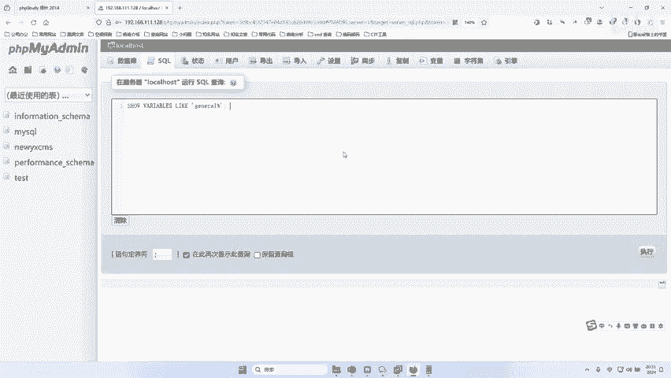
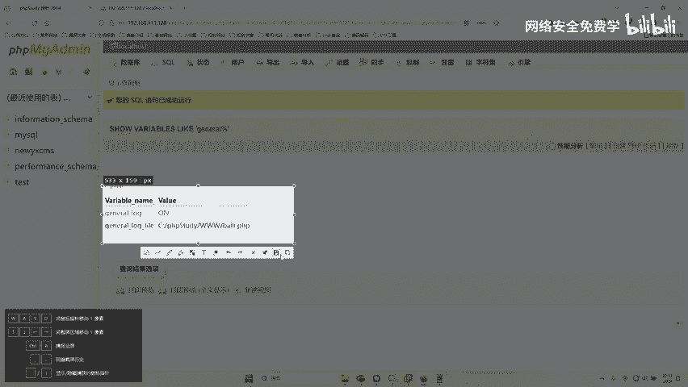
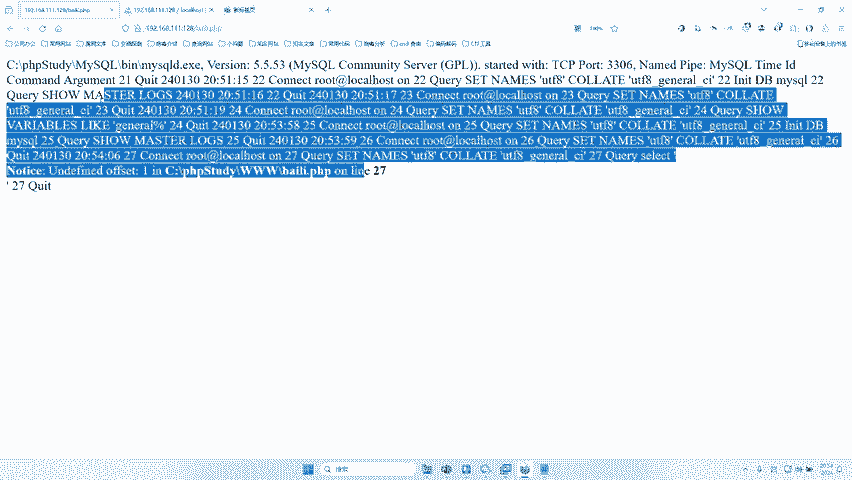
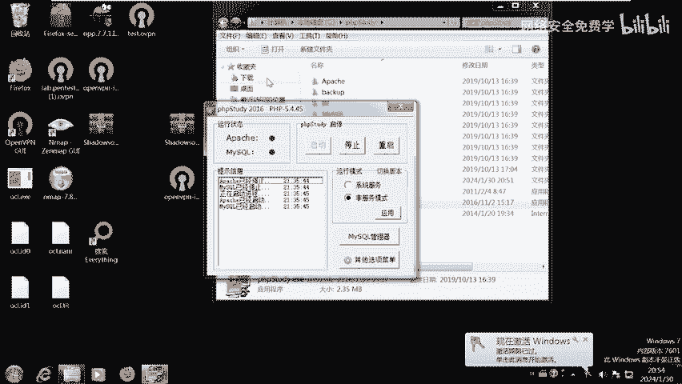
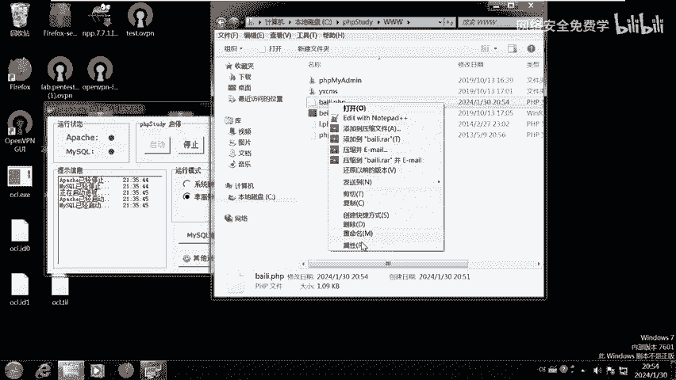
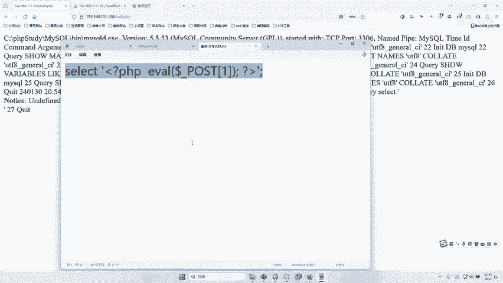

# 2024B站最值得看的黑客教程 ｜ 网络安全／渗透测试／内网渗透／漏洞挖掘／web安全／kali linux／红队靶场／CTF／信息安全 - P106：phpmyadmin全局日志 getshell - 网络安全免费学 - BV1uBsTetEow

那接下来哎我怎么通过这个东西去get shell呢？哎，接下来我们来看一下对不对？好，我在这里我们只讲一种，对不对？刚才我搜了是P这个页面啊，get the shell是不是有4种方式。

所以你今天就可以用四种方式全去打一遍。那么老师呢李哥在上课的时候给大家讲一种就可以了，其他几种都是照模画虎的对吧？还有包括那个探针也可以对吧？你都是可以去试的，对不？都是所以我们就是举一反三嘛？

所以大家讲个一，希望你练习的时候啊，可以多多扩展这些思维。好，那这个漏洞到底是怎么利用的啊，我们通过刚才的页面是不是发现了有这样一个界面，我们来去访问一下，是不是有这样一个界面。😊，好好。

那有这样一个界面，这个界面应该怎么去入侵啊。那么根据这个网上的漏洞描述来说啊，就是你必须得知道他的账号密码啊，那么怎么去破解他的账号密码呢？哎，那李哥在这里啊给他提供一个小工具，就是可以破解的，对不对？

好。😊，啊，这里是不是又用到我们工具了哈，那这个工具在哪里呢？啊？就这个PPmy me破解工具，对不对？好，这个工具用起来非常简单，对不对？我们先在这个这里啊新建一个文件夹啊，里面写好什么。

写好你要破解的这个PAmy的地址啊，把这个地址这个什么复制到这个里面来啊，写到这个TIT里面，然后把这个工具打开右键啊，右键右键完成之后，大家可以看到啊。😊，这里呢是不是有一个什么导入网址啊。

当然你自己测的时候，你可以写上几百个，对不对啊？一个一下就测完了，是吧？导入这个网址，哎，我们导入个网址。好，那这个网址这来选择啊，我们就选择刚才这个TIT文件，对不对？

这个TIT文件是不是写着里面写着我们这个页面啊，我们点击确定。😊，好，那我们怎么去设置账号密码呢？对吧？哎，这里有账号密码，你看他默认哎提供了这三种账号，是不是哎，那密码呢你看它默认哎有这么多密码哎。

就是他会用这三种不同的账号啊，用这个rootmin个t三个账号不同的去测哎，密码是不是这个是不是这个是不是这个这个这个这个这个这个一个一个去测测测，对不对啊，那这样测的话，比你手册要快的多，对吧？

人家一分钟就测完了，你手册得测一天，对不对啊，好，那如果大家觉得这个密码字典不够啊，也可以在后面再去添加自己额外的字典都是可以的啊。好，这这是个工具去设置密码。好，然后呢，设置完了之后呢。

我们直接点击什么开始任务。😊，好。来，因为我们是靶场，对不对？所以它比较简单好，它里面是不是能扫出来了。好，这个页面的账号是root密码是root，是不是差不多10秒钟哎。

就把应该有6000个6000种可能全部测完了啊，我们知道刚刚里面是什么，三种账号2000个密码啊，那你3乘26000啊，所以6000种可能是不是用了不到10秒是不是测出来了，账号跟密码啊啊。

所以效率是非常快的啊，所以我们就拿到破解出来这个账号密码是干嘛呢？去登录到这个网站里面去啊。😊，啊，当然实际情况可能没有这么简单。对不对啊啊，实际情况可能没有这个啊，等于说是不是这个色差这样也可以啊。

因为这一样的，你把后面这个页面删掉，它也是可以看也是可以访问到这个页面的。你看是不是把这里删掉了，对不对？也是可以访问的啊。😊，我们来执行就登进去了啊，这些都是我们用工具搞出来的，对不对？好。

那么登进去之后，我们来看下一步啊啊说了啊这个页面ge的事什么？就是说控制电脑的意思啊，我们专业名词叫控制电脑的方法有很多啊，我们今天给大家讲一种那么有几种方法呢？我们刚才是不是在百度里面搜了对吧？

P有4种方式啊。那我们今天呢讲一种方式剩下的三种方式，你都可以私下去练习啊，这个P非常重要啊，都重要面试经常问啊，你像当于绿蒙什么面试都别问对不对啊？大家不要觉得这个这个东西老了。

你就这个东西你就搞明白，你把这四种方式搞明白好吧，你已经比很多人厉害了。😊，你想去互网的时候，有的时候也会问这样问题啊，人家面试官就问你啊，这P有几种方式，你说一说啊，这个时候你跟他说哎有4种。

第一种是啥？二种是哎你不就可以了嘛？对不对？哎，很多面试都喜欢问这样的问题啊，所以不要看哎虽然它只是个靶场啊，但是它非常符合我们什么工作的需求啊。好，那么我们今天讲一种这个的方式，原理是什么呢？啊。

原理是这样的给大家讲讲啊，就是说这个P啊啊，这是个什么东西呢啊，它是一个什么数据库管理系统，数据库啊，就是这个网上的数据库系统啊，那这个数据库系统在我们在进行一些操作的时候会有什么会有日志。😊，啊。

现在还不是体全，现在在什么入侵，在入侵中啊，有一个日志，就我们在这里面进行操作的话，会留有日志，对不对？好，那我们怎么通过什么样的思路去入侵呢？好，我们把这个日志啊一改改成黑客的一个页面。

那么我们在干嘛呢？我们在这里面做出一些操作。这个日志就会记录到黑客的那个页面里面去，对不对？本来这个日志假如说在这个一里面存着呢啊，就是正常在一里面存着。现在呢我们把日志啊改一下。

改成二这个这个文件里面去，那我们进行操作的话，这个日志都会记录到2，对不对？好，那我们在记录日志的时候，我们就可以干嘛呢？我们可以让这个日志记录一段什么？让它日志里面记录一段木马。😊，对不对？

我们在操作的时候操作一段木马，那他就会把木马这个日志记录到这个二里面。然后黑客就可以通过我们指定的这个二访问到控制到这个电脑。理解了吗？哎，就这样大条的这个流程啊，主要是这样的，对吧？

通过修改它的日志路径。啊，修改成我们黑客的一个页面。然后呢我们再构造一些恶意的日志啊，就是控制木，就是控制别人电脑的一些木马的日志，对吧？或者哎我们记弄一段木马啊，把这个木马记录在这个日志里面。

然后我们就可以访问这个日志，日志里面又包含木马，所以我们就可以控制这个整个网站，这个电脑了，对不对？好，那接下来我们就来操作一下怎么去通过这个日志去进行控制了，对吧？😊，好，首先第一步，哎。

我们得先查一下当前这个电脑的日志是在哪个文件夹里面放置的，对不对啊？它原本是有一个默认文件夹。好，那我们先用哪种方式呢？哎，这里命令给大家提供了，对不对？好，用这种方式啊。好，大家在用的时候啊。

尽量复制一下，对不对？好，把这个画复制到哪里呢？哎，我们看一下啊，这里是有个circle啊。😊，有个叫什么？有个就啊点这个scle，哎，把这个话敷到这里面。这句话大家不用管什么意思，对不对啊？

等你后面进阶的时候再学，你先知道这句话，它就是查这个my数据库的日志在哪里放着，对不对？我们点击执行。😊，好，在这里是不是查出来了。

我们可以看到啊这个网站的数据库日志是不是在C盘下的GP study mydTUE点log在这里面放置的，对不对？那你黑客现在是访问不到这个log的，对不对啊？我们必须要一会要把它改一下啊。

并且我们可以看到这个日志这个功能当前是什么off是关闭的，关闭什么意思？就是我们在这里进行操作，它的日志并不会记录在这个文件里面。虽然这个是记录日志的文件，但是哎这个日志的操作并不会记录，原因什么？

原因是它开关是关着的啊？我所以我们接下来一步要把这个off变成什么变成on给它开启，对不对啊啊啊，就是你加了门是关着，你进不去，对不对？以第二步就是这个什么开启日志，好吧，开启日志啊。😊，好。

我们点击这个啊。😊，好。点击执行。哎，是不是在服务器上已经运行了，是不是已经开启了？哎，那在这里执行完了之后，他们没有什么没他只是说什么语句执行成功了，对不对？好，那我们接下来干嘛把它复制一遍啊。

再执行一遍。😊，这个查询日志。好，是不是看到这里已经暗了呀，是不是暗了呀？没有问题吧。哎，我给他看一下啊。你看啊，刚才我们是off，对不对？然后呢，我们干嘛把这个日志设成on，然后我们再去查一下。

那这个off变成on了，对不对啊，所以说这个日志现在是干嘛的，是不是一个开启状态了，刚才是offf关闭了，对不对？那现在是开启了，那么开启之后，我们做一些操作的时候就会被记录在这个日志文件里面。好。

那记录到这个日志文件里可不行啊，因为黑客没有办法访问它，对吧？因为这个在人家电脑上放置了，对吧？我们必须把它改一下，改到哪里呢？改到我们可以通过这个浏览器啊。😊，啊，改到哪里？我们大家可以说改到哪里啊。

😊，啊，可以改到这个探针里面来，改到这个页面，对吧？我们要这为日志记录到这个页面，这个页面我们黑客是可以访问的，对不对？所以我们就可以通过这个让这个探针去包含这个日志，日志里面又包含了木马。

所以我们通过这个探针页面就从而可以控制什么控制我们的电脑。好，那接下来就到下一步了啊。😊，好，下一步啊下一步是不是要自定义一个网站自定一个日志，对不对？好，那怎么去自定义哎，怎么去自定义。哎。

我们得先知道什么这个网站的根目录在哪里啊，就是这个网站的目录在哪里，其实在这个探针里面已经给我们写清楚了，对不对？你看啊这个网站的绝对路径啊，是不是在这里啊。

并且当前的这个探针的路径是不是叫一点PHPL点PP对不对？L点PP好，所以呢我们可以有几种方式啊，可以直接把这个日志直接放在这个L点PP那这个I点就是我们这个探针页面，那这个探页面就会包含日志。

那日志就包含木马，那从外就控制它了，对不对？那么我们也可以在后面自定一个，比如说叫什么叫123点PP啊，随便啊，你只要知道它的路径就可以了啊，那么当前这个网站路径是不是长这样。😊，好。

那我们想把这个日志放到哪里呢？啊，比如说呢放在一个叫做什么百里。啊，随便捏一个，对不对啊？百里啊，我们就把这个日志放在这里面来啊，那接下来就是更改什么，更改这个日志的路径了，对吧？啊。

怎么更改这个画就在这里啊。😊，你看好，我们要把这个日志什么加载到哪里，加载到百里的这个页面里来。好，我们就把它写进来。好，然后把复制一下set就设置设置全局jalog就是日志，对吧？

设置全局日志文件到我们百里的这个文件里面。好，因为百里这个文件又在网站的目录下，所以我们就可以通过网站去访问百里的这个文件，对不对？然后从而控制它。好，那么接下来哎我们就干嘛呢？在这里设置一下啊。😊。

啊，点击这个circle。好，这理执行。点击执行。好，是不是执行成功啊？执行成功之后呢，哎我们返回去再看一下这个日志日志文件是否开启。还有就是是否已经更改成百里的这个。😊，好。

执行。哎，兄兄弟们，现在看一下，现在来看我们日志系统现在是不是已经开启了啊，并且日志就会存放在这个百里点PP里面来啊。那么接下来我们去访问一下百里点PP啊，就怎么访问，就在你后面加一个白。😊。

你。你看你看是不是日志是不都在里面啊。你看啊这是这句话是不是我们刚才操作的时候的命令，你看是不是存在日志里面了，你看。😊，是不是我们刚才是不是查用的这个january啊，一些查询like了，对吧？

你看会记录在里面来。好，那这个时候呢怎么让这个日志里面包含木马呢？😊，哎，非常简单，对不对？那接下就用到另一句话。😊，哎，我们运行这样一段话。啊，运行这样的话。这样的话什么意思啊？就是我们用查询。

这样的话运行，那这样一句话就会被记录在日志里。那这句话呢，这里面这一行内容它又是个木马，对不对？好，这个木马是不是我们的一句话木马？😊，好，有没有人知道这句话为什么是木马的？知道的话扣个一。

不知道扣个2。我看一下，好吧。知道话扣波一，不知道扣波2。可能人不知道。好，不知道。那今天李哥满足你好，那这句话为什么是木马？李哥要讲的话。😊，要讲什么？要讲40分钟。所以李哥已经提前给你录制好了。

这句话为什么为什么是木马？我已经把这个知识给你录好了，大约有四五十分钟。那这个课怎么看？听好了，我会放在那个录播文件里面，明白了吗？听明白没有？听明白？扣个一。关于这句话为什么是木马。

因为这个知识比较多，我们会讲40到50分钟。那这就这个教程我就放在我们本次的那个录播文件里面。下面你学完把这个三天训练营学完之后，你再去听那个你就知道了它为什么是木马了，好不好啊？因为知识比较多啊。

我们要挑我们的重点去讲，对不对啊？因为这个为什么是木马这就不是我们本次训练营的重点。对不对啊？所以说希望大家认真学，我能把我给你的都给到你了，好不好啊。😊，好，那这句话为什么木马大家不用不用管了啊。

你就知道它是木马了啊，为什么是木马？你稍后再学哈，那我们就把它干嘛呢哎。😊，啊，点到这个scle啊，日志文件内容是哪来的啊，你这你把这样一输入，这句话就会被记录在日志文件里面。好，我们点击执行。😊，好。

那这句话就被记录在日志里了，对吧？那又因为这句话它是木马，那这个木马就被记录在日志里，我们来看一下，你看木马就被记录在日志里。好，那这里是看不了这个木马的，对吧？因为木马被隐藏起来了啊。😊。

我们可以去这个什么里面看啊，可以去这个里面看到底有没有成功啊。

你看PV study3W，你看里面是不是有一个白里的PVP好，我们就打开这个文件看一下。

你看看到没？slight这句话，这句话是不是被记录在了日志文件里面？看到了吗？好，又因为这句话他就是木马。😡，啊，所以我们就可以通过这句话去控制对方电脑。哎，理理解了吗？好，那么接下来问题来了啊。

我们如何去控制别人电脑呢？哎，我们现在找到漏洞了，对不对？😊。

