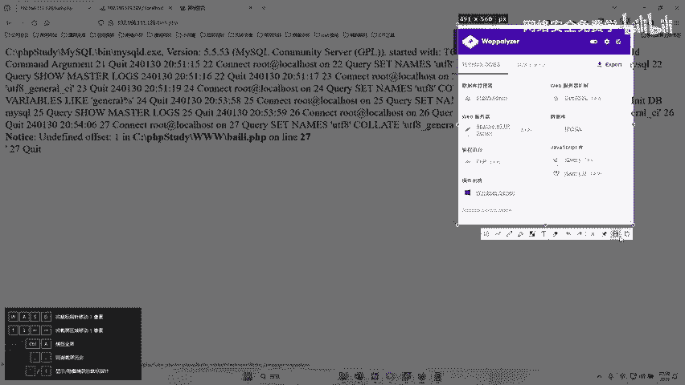
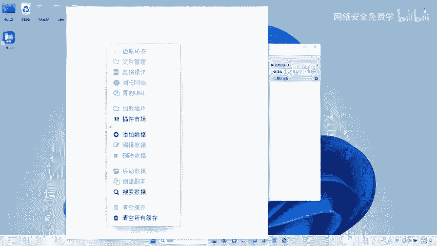
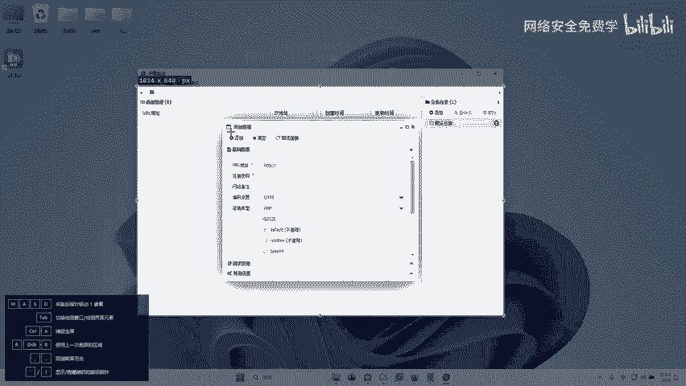
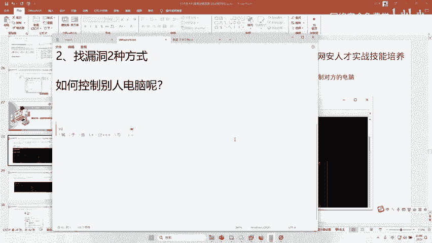

# 2024B站最值得看的黑客教程 ｜ 网络安全／渗透测试／内网渗透／漏洞挖掘／web安全／kali linux／红队靶场／CTF／信息安全 - P107：如何控制别人的电脑 - 网络安全免费学 - BV1uBsTetEow

啊，如何控制别人电脑呢？啊，一般会用到这几个文具，听好了。第一个叫做一键。好，第二个叫什么哥斯拉。第三个要什么叫做。冰烯。啊，第五个叫什么？叫菜刀。好，在我们国内著名的工具就这几种。

那接下来给大家分别讲解这几种工具的不同，对不对？第一个菜刀菜刀是最早的控制别人网站的一个客户端工具。那这个工具呢，它主要是针对AP网站，也就是我们之前的微软的那个。到net开发的这个网站ASP网站。

那么这个ASP现在国内其实比较少了，对不对？因为这个菜刀啊啊它是80后发明的啊，用菜刀的年代大约还停留在22000年到2010年这个时间啊，就是在2000年到200。😊。

1、2010年这个期间段啊这个期间段内啊用菜刀的人是比较多的。啊，因为那个时候我们国内啊，你像阿里巴巴那个网站都很low，都是这意思，对吧？你就可以用菜刀让国家去控制，对不对？好，那么以健是什么时候啊？

以健是90后的，对不对？它流行的什么时候，它是流行在2015年啊，到20。😊，20年。啊，大约就是这56年时间比较横行。这个已键主要是针对什么？针对PHP网站的。啊，因为不同的网站有不同的开发语言啊。

大约已见就是那就说那是不是菜刀在现在就不用了。不是我只是说菜刀流行的时候，在2000年到201就这十年代比较流行啊，就跟你听歌一样啊，10年前流行的歌，不是说你现在听不了了，也不是说现在不能用菜刀了啊。

只是他比较流行，大家普遍比较认可，对吧？像已健一样，15年到2020年之间啊，差不多这个已键，每个人都用，对吧？包括现在也有很多用，但是很多人很多人已不用了，对不对？你可能有一半人都不用已键了，对不对？

那么剩下两个兵烯跟哥斯拉，那这个就属于2020年啊，到现在。😊，啊，到现在就是这两个工具，哥斯拉跟冰蝎对不对？这两个工具啊，就现在这两年比较火。那这个工具主要是针对什么？主要针对我们java。啊。

java开发的网站。啊，所以说这里有个问题，如果这个网站是java的，你就中java的嘛，然后哎用哥斯拉冰线连接。如果说你是用PP的，你就用引键，如果是菜刀，你就用AP当然这个不固定啊。

你说有java的Java的网站，我能用一键吗？也可以，人家现在的最新版的已键也是支持java的，对不对啊？只不过啊这两个工具更流行而已。哎，仅此而已，对不对？但是你非得混着用也行啊，这是它一个区别。

但是他们的功能都差不多啊，都这个功能都是什么？通过这些工具可以控制对方网站。那么今天我们就用已键这个工具对不对？去控制对方网站。好，那么已键这个工具在哪里。😊，来李哥在这个安装包里给大他提供了，对不对？

有这样1个HTM2不行，那个是前台页面啊，我说的是开发的后端啊，怎么去判断别人语言啊？一般来说我们的网站会有个插件，对不对？你像这个你看。😊。

这是平常开没，大家可以去你这个这个电脑里面安装一个这个。

外po这个工具这个工具有的时候会识别出来这个网站用的编程语言PP5。45。好吧啊，现在80%你能见到的网站都是用java的啊，百分之七八十吧啊，80点多了，70%都是java。啊。

百分之233二三十可能是PVP或者一些到net啊，也有啊。一般中的就是几种啊。好，那已键到底如何去用啊？首先这是它的工具，对不对？好，我们得打开，我拿一个全新的虚拟机啊给你打开。

然后给你说一下已键怎么去用啊。这里呢大家要听好了啊，因为很多人连这个工具都打不开，对不对啊，我就人傻了啊。😊，好，我们先恢复原始快照。

好，来，我们先把我们的一键啊给它干嘛拖进来哎。

哎，放到我们一台电脑里面来啊。全部给它复制过来，对不对？😊，啊，因为我们现在这个。虚拟机得开虚拟机啊，没有，不是虚拟机开，在虚拟机里面弄了一个W11嘛，因为我的已键已经配置过了啊。

我是可以直接双击打开的。你们没有配置过，它还需要有一些配置。很多人不会配。因为我之前讲过，很多人不会配，所以我在这里要一步一步给你教学，对不对啊？我们得把它先复制进来。😊，啊，这个复制起来太慢了啊。

OK我先把它。😊，先给他压缩文件啊。好，我们把这个工具呢啊复制进来啊，就复制进来了是吧？😊，哎，好了好了，让他进来了啊。😊，好，我们再稍做一下等待啊，把这个工具全新的这个使用方式给它家演示。

因为这里需要一个啊配一个东西啊。好，我们这个工具打开之后啊，双击。😊，好，这里有一个对吧？ANTSWANTS word对不对？好，我们把它双击开。😊，在你第一次运行这个完站时候。

这里是不是有一个初始化一样的东西啊，我们点击这个初始化啊，点完点完这个初始化选什么呢？大家看好了，选择这个第一个文件夹啊，选择这个文件夹听好了，这个文件夹哦啊，不是这个文件夹里面的东西啊。

是选择这个文件夹啊，文件夹哈，这个文件夹在哪里呢？是不是在桌面。😊，啊，里面是不有个ANT2。1。3，这是我们的配置文件，我得把它选中，直接点击这个什么，不要双击进去了啊啊，听好了，不要双击进去了。

不要双击进去了，选择这个ANTS word杠2。1。3这个文件夹文件夹，然后点击直接选择下面鼠标点一下，点击选择文件夹。😊，好，设置完毕，请稍后重启。然后我们再次运行一键。就进去啦。懂了吗？会了吗？

会了，扣个一啊，就这个问题我有一次讲过这个东西啊，我们那时候我记得有200个人听课。😊，啊，就100个人不会。100人不会这个问题。所以今天我在重点说这，我已经说话说三遍了，这个是重点啊。

不然你这个文工具就打不开，一定要配那个文件夹啊，文件夹，那个文件夹在哪里啊？就在那个包里面，对吧？就在这个工具的第一个好不好啊，不要在啊不听课，信不信大家信我一下啊，明天谁在群里再问哎。

老师已键那个怎么打开是初始化啊，你们就喷它行不行啊，你们就直接开喷啊，啊，你们就直接开喷，对不对啊，再来一次再来不了一次，这个东西只有一次啊，只有只有一次，对不对啊？只能来一次，因为我已经配好了，对吧？

啊，就重点就是选择这个文件夹，初始化的时候，选择第一个文件夹就行了。好，那么接下来哎我们打开这个一键啊啊，那怎么工通过这个工具去控制对方电脑了。哎，我们先把这个之前数据删一下啊。😊，好。

我们直接在这个鼠标的右边啊，点击什么点击一下好，然后选择什么点击这个什么添加数据这个东西，对不对？好，我们点击添加数据啊。😊。

好，添加数据完成之后啊，这里让你填这个木马的地址。那这个木马的地址是多少啊，其实就是我们刚才这个有漏洞的这个地址，对不对啊？就是这个百里店PP啊，好，我们把这个漏洞地址写进来。好。

这里是不是还有一个什么叫做连接密码的东西啊，你看大家可以看到这个地址跟密码是标星的。那这个密码是多少呢？哎，就是我们刚才哎这里给大家写的这个po的里面是一，它的密码就是一，是二，密码就是二，是三。

密码就是三，是4，密码就是4，对不对？是这样一个A密码就是A啊，这里面是什么东西就写什么东西。我们之前是写的一啊，所以这个密码它就是一啊。😊。

选完一之后，我们来干嘛呢？哎，我们点击什么测试连接。测试连接。是不是点击成功啊，然后点击添加。好，那么这条记录就被添加到了礼一键。然后我们鼠标什么右键？😊，哎，右键完成之后，我们可以看到针对这条啊网站。

我们就有很多操作哈，可以去管理这个电脑的文件，可以去管理这个电脑的数据库，可以用这个电脑去浏览网站，对不对？可以用这个电脑去虚拟终端啊，我们双击就可以进入到这个电脑里面来了。比如双击。😊。

大家可以看到就可以进入到啊我们当前这个控制的这台电脑的什么，它的一个C盘D盘啊，并且在它的每一个盘符里面，对不对？是都可以点开的，并且可以在里面干嘛上传下载编辑删除更改复制粘贴，对不对啊。

所以从而变相来说，就是我们已经可以控制这个电脑上的任意文件了，对吧？上传这个文件，复制这个文件，下载这个文件，对不对？已经把这个网站控制下来了啊，那么这样只是用工具控制，它还不够，对吧？

黑客一般啊我们一般就是安全从从业者来说，对吧？哎。😊，从业这来说，对吧？我们不太一般不习惯用这个东西。我们一般用什么用这个什么虚拟终端。好，大家看一下虚拟终端就是什么远程去操纵这个电脑的命令啊。

比如我们可以查看一下当前控制这台电脑哎，它的IP地址。😊，啊，我们可以看到当前这个电脑IP地址是不是192168111。128。😊，是不是哎来，我们来看一下当前这个电脑的名字叫什么。😊，GODad好。

这个大家还记得不？😊，呼M爱。这什么意思？来有人能告诉我这个东西什么意思？😡，这个是昨天讲的，对不对？是不是你看昨天讲的知识，现在是不是用得到了，是不是预账号呀哎。😊，啊，是不是预管理员？

域名后面加一个账号，是不是一个域账号？哎，那这个那有人去得，哎，这个GUD到底是不是预账号呢？我们可以搜这个host name。😊，house name是不是STOE呀？那那如果是本地账号。

那就是STOE斜杠ad administratorminist，对不对？那当前是一个什么预账号，并且是域的最高管理员。😊，哎，那其实就非常恐怖了，对不对啊？其实如果说你有这个预个管理员啊。

那这个电脑就穿了，是不是啊？那么穿怎么我们接后面再说，对吧？我们先讲今天的对吧？好，那我们今天的目的别忘了，对吧？我们要控制这个电脑。我们刚才说了，哎，我用已键这段控制，哎，我觉得效果不好。哎。

我想通过远程桌面的方式控制，可不可以可以？那接下来哎我们就通过远程桌面的方式去操纵电脑，对不对？😊。

好，怎么通过远程桌面去操作呢？非常简单，就什么啊每个电脑都有3389，那我们只需要干嘛？我们只需要把对方的电脑的3389打开啊。比如说现在我用已键控制电脑，对吧？我用一键。😊，啊，这个意见啊啊不直观。

啊，我想通过什么？我想通过远程桌面。

形式可不可以也。